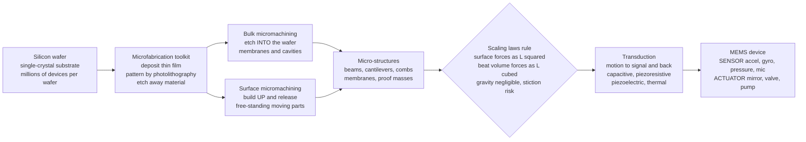

# 🔬 MEMS and Microengineering: Machines the Size of a Speck of Dust

> [!abstract] TL;DR
> **MEMS — MicroElectroMechanical Systems** — are complete machines (sensors, actuators, springs, gears, resonators) with moving parts from about **1 micron to 1 millimeter**, carved out of silicon by the **same photolithography, deposition, and etching** that make computer chips — so millions of identical micro-machines are **batch-fabricated on a single wafer** for pennies each. The heart of microengineering is the **scaling laws**: as a device shrinks by a factor $L$, **volume/inertial/gravitational forces shrink as $L^3$** while **surface forces (friction, electrostatics, surface tension, van der Waals) shrink only as $L^2$ or slower** — so the **surface-to-volume ratio $\propto 1/L$ explodes**, surface forces come to dominate, **gravity becomes negligible**, **stiction** (surfaces sticking together) becomes a top failure mode, and **electrostatic actuation** becomes wonderfully effective. MEMS put an entire lab of sensors into every phone and car — the **accelerometer** that senses tilt, the **gyroscope** that senses rotation, the **pressure sensor** in the airbag and tire, the millions of tilting **micro-mirrors** in a DLP projector, the **MEMS microphone**, the inkjet nozzle, and the **lab-on-a-chip** microfluidics of modern diagnostics — making them the sensing front-end of mechatronics and a multi-billion-dollar merger of mechanical engineering with semiconductor fabrication.

## Intuition

**Analogy:** Imagine building a working machine — gears, springs, levers, a proof mass on a hinge, a sensor — so tiny that **dozens of them fit across the width of a single human hair**, and carving it not with a lathe or a mill but with **the very same photolithography that prints computer chips**: shine patterned light onto a silicon wafer, deposit and etch layer by layer, and an entire clockwork emerges. That is MEMS. The accelerometer that knows the instant your phone tilts, the gyroscope that keeps a drone level, the array of a million tilting mirrors inside a cinema projector, the pressure sensor that fires a car's airbag in milliseconds — all of them are **microscopic machines with moving parts** hiding inside a chip the size of a grain of rice.

And here is the delicious twist that makes microengineering its own discipline: **at this scale the rules of physics flip.** In our world, a machine is ruled by weight and inertia — gravity holds a ball on a table, momentum carries a flywheel. Shrink everything a thousand-fold and those *volume* forces (which scale with $L^3$) all but vanish, while *surface* forces (which scale with $L^2$) take over. A micro-machine barely feels gravity at all; instead it is ruled by **friction, static electricity, and surface tension**. Two polished silicon surfaces brought together can **stick permanently** (stiction), a droplet behaves like glue, and a tiny voltage across a microscopic gap produces enough **electrostatic pull** to move a whole structure — something hopeless at human scale but the *preferred* actuator in the micro-world. Your macro-intuition, calibrated on falling apples and spinning wheels, is exactly backwards here.

---

## How It Works

### Core Mechanics

A MEMS device is born on a **silicon wafer** and shaped by the **microfabrication toolkit** borrowed wholesale from the integrated-circuit industry. Three moves, repeated in patterned cycles, do almost everything:

1. **Deposition — add a thin film.** Grow or lay down a micron-or-less layer of material: silicon dioxide, polysilicon, silicon nitride, or metal, using thermal oxidation, chemical vapor deposition (CVD/LPCVD), sputtering, or evaporation. Some layers are **structural** (they become the machine) and some are **sacrificial** (temporary scaffolding to be dissolved away later).
2. **Patterning (photolithography) — define the shape with light.** Coat the wafer in light-sensitive **photoresist**, project a **photomask** pattern onto it through a stepper, develop away the exposed (or unexposed) resist, and you now have a stencil that tells the next step *where* to act. This is the step that makes MEMS **batch-fabricated**: one mask defines millions of identical devices across the wafer at once, so the cost per device collapses.
3. **Etching — carve material away.** Remove the exposed material chemically or physically. **Wet etching** in liquid chemistry can be crystal-plane-selective (anisotropic KOH etches make clean V-grooves and diaphragms). **Dry/plasma etching** — especially **Deep Reactive Ion Etching (DRIE / the Bosch process)** — cuts near-vertical trenches with enormous depth-to-width ratios, the trick that makes tall comb fingers and deep proof masses possible.

Two overarching strategies assemble these steps into real machines:

- **Bulk micromachining** etches structures *into* the thick single-crystal silicon wafer itself — carving out membranes, cavities, and cantilevers by removing bulk material. It is how most pressure-sensor diaphragms are made.
- **Surface micromachining** *builds up* the device from deposited thin films on top of the wafer, alternating structural and **sacrificial** layers, then performs a final **release** step (dissolving the sacrificial layer) to free the moving parts. This is how comb drives, movable proof masses, and micro-mirrors are made — and the release step is where **stiction** most often ruins a device.

The result is a **micro-structure** — a beam, a cantilever, an interdigitated **comb**, a membrane, a suspended **proof mass** on flexure springs. But a machine that only moves is useless; MEMS must **transduce**, converting between mechanical motion and electrical signal in both directions:

- **Capacitive / electrostatic** (the dominant mode): motion changes the gap or overlap of a capacitor, changing its capacitance to *sense*; conversely, a voltage across the plates produces an electrostatic force to *actuate*. Because electrostatic force scales as $L^2$ and is enormous relative to the tiny $L^3$ inertia, this is the workhorse of MEMS. **Comb drives** interleave many fingers to multiply the force.
- **Piezoresistive:** strain in a doped-silicon resistor changes its resistance — the classic pressure-sensor readout.
- **Piezoelectric:** a strained film (AlN, PZT) generates charge, and vice versa — used in resonators, energy harvesters, and micro-speakers.
- **Thermal:** differential heating bends a bimorph to actuate.

Overlaying all of this is the single most important idea in microengineering — the **scaling laws**. Any *volume-based* quantity (mass, weight, inertia, stored elastic/thermal energy) scales as the cube of size, $L^3$. Any *surface-based* quantity (friction, surface tension, electrostatic and van der Waals forces, viscous drag, heat exchange) scales as $L^2$ or weaker. Their ratio, **surface-to-volume $\propto L^2/L^3 = 1/L$**, blows up without bound as $L\to 0$. That one relationship explains almost every peculiarity of the micro-world: gravity is negligible, thermal time constants are tiny (things heat and cool almost instantly), electrostatics is a superb actuator, viscous air-damping sets the quality factor, and **stiction** — surfaces held together by surface forces that dwarf the restoring spring force — becomes a defining failure mode.

### Flow / Architecture



---

## Key Concepts

### Secondary Level

- **MEMS are machines you can't see.** They have real moving parts — springs, hinges, a tiny weight on a beam — but the whole thing is smaller than a grain of salt and carved out of the same silicon as a computer chip.
- **They're made like computer chips, not like car parts.** Instead of cutting metal one piece at a time, light and chemicals shape **millions of identical micro-machines at once** on a single wafer, which is why the accelerometer in your phone costs almost nothing.
- **At tiny sizes, gravity stops mattering.** A micro-machine is so light that its own weight is irrelevant. What matters instead is **stickiness** — friction and static electricity — because surfaces, not weight, rule the small world.
- **Your phone is full of them.** The accelerometer (senses tilt and shaking), the gyroscope (senses turning), the microphone, and the pressure sensor are all MEMS. So is the chip that makes millions of mirrors flip in a cinema projector.

### Undergraduate Level

- **The scaling laws are everything.** Shrink a device by factor $L$: mass and inertia $\propto L^3$; surface forces (friction, electrostatic, surface tension, van der Waals) $\propto L^2$. The **surface-to-volume ratio $\propto 1/L$** grows without limit, so as $L$ shrinks, **surface forces dominate volume forces**. This is why gravity is negligible, why **stiction** is deadly, and why **electrostatic actuation** — hopeless at macro scale — is the preferred MEMS actuator.
- **Electrostatic transduction.** Parallel-plate force $F = \tfrac{1}{2}\varepsilon_0 A V^2 / d^2$ scales with area $A \propto L^2$; comb drives use $N$ interdigitated fingers, giving lateral force $F \propto N \varepsilon_0 t V^2 / g$ independent of overlap, and capacitance change $\Delta C$ reads out motion. Sensing and actuation use the *same* structure.
- **The MEMS resonator.** A cantilever or comb structure is a **mass–spring–damper**: resonant frequency $f_0 = \tfrac{1}{2\pi}\sqrt{k/m}$. Because $m$ is minuscule, $f_0$ is high (kHz to GHz). The **quality factor** $Q = f_0/\Delta f$ measures sharpness; in vacuum $Q$ can reach $10^4$–$10^6$. High-$Q$ resonators are the basis of MEMS oscillators (timing), RF filters, and the drive/sense modes of gyroscopes.
- **Two fabrication strategies.** *Bulk micromachining* etches into the wafer (pressure diaphragms, KOH V-grooves); *surface micromachining* builds up structural + **sacrificial** thin films and **releases** the moving part by dissolving the sacrificial layer (comb drives, mirrors). DRIE/Bosch enables tall, vertical-walled structures.
- **Core devices and their physics.** *Accelerometer* = proof mass on springs, capacitive readout of displacement under acceleration ($F=ma$). *Gyroscope* = a vibrating proof mass whose **Coriolis force** under rotation drives a perpendicular sense mode. *Pressure sensor* = piezoresistive/capacitive membrane deflecting under pressure. *Micro-mirror* = electrostatically tilted plate.

### Graduate Level

- **Damping and squeeze-film effects.** Air trapped between close-spaced plates dominates MEMS damping via **squeeze-film** and **slide-film** effects; the Knudsen number governs whether continuum or rarefied-gas models apply. Packaging in vacuum raises $Q$ by orders of magnitude but adds cost; damping design directly sets bandwidth ($\Delta f = f_0/Q$) and sensor noise.
- **Fundamental noise floors.** Thermomechanical (Brownian) noise sets the ultimate resolution: acceleration noise density $\sqrt{\overline{a_n^2}} = \sqrt{4 k_B T \omega_0/(m Q)}$. Smaller mass and lower $Q$ raise the noise floor — a direct tension with miniaturization, so proof-mass sizing is a noise-vs-area trade.
- **Coriolis vibratory gyroscopes.** A drive mode oscillating at $\omega_d$ couples, under angular rate $\Omega$, into an orthogonal sense mode via Coriolis force $F_c = 2 m\,\Omega \times v$. Mode-matching ($\omega_{\text{sense}}\approx\omega_{\text{drive}}$) boosts sensitivity by $Q$ but narrows bandwidth and demands closed-loop control and temperature compensation of the split.
- **Pull-in instability.** Electrostatic parallel-plate actuators are **unstable beyond one-third of the gap**: the nonlinear electrostatic force overtakes the linear spring restoring force, and the plate snaps shut (pull-in voltage $V_{pi}=\sqrt{8 k g_0^3/(27\varepsilon_0 A)}$). This bounds the usable stroke of analog electrostatic actuators and is exploited deliberately in RF-MEMS switches.
- **NEMS and the frontier.** Shrinking to **nanoscale** pushes $f_0$ into the GHz range and mass sensitivity to zeptograms/single molecules, but surface-to-volume ratio and surface losses become extreme, capping $Q$ and challenging readout. Optical MEMS, piezoelectric MEMS (PMUT/CMUT ultrasound), energy harvesters, and BioMEMS/microfluidic lab-on-a-chip are active research fronts.
- **Multiphysics co-design and packaging.** MEMS design is inherently coupled electrostatic–mechanical–fluidic–thermal, solved with reduced-order and FEM tools; and **packaging** (stress isolation, hermetic/vacuum seal, wafer bonding, and integration with CMOS readout ASIC) often dominates cost and reliability more than the transducer itself.

---

## Python Demo

```python
# ============================================================================
# MEMS AND MICROENGINEERING -- two figures that explain the micro-world.
#
# (a) SCALING LAWS -- why the micro-world plays by different rules.
#     As a device shrinks by a factor L, physical effects scale DIFFERENTLY:
#         VOLUME forces  (mass, inertia, gravity)      ~ L^3
#         SURFACE forces (friction, electrostatic,     ~ L^2
#                         surface tension, van der Waals)
#     Their ratio -- the SURFACE-TO-VOLUME ratio -- goes as L^2 / L^3 = 1/L,
#     which EXPLODES as L shrinks. So at small size SURFACE forces DOMINATE:
#     gravity becomes negligible, stiction appears, and electrostatics becomes
#     a great actuator. This single plot is the heart of microengineering.
#
# (b) MEMS RESONATOR -- a micro-cantilever / comb resonator modelled as a
#     mass-spring-damper. Because the mass is TINY, the resonant frequency is
#     HIGH; the quality factor Q makes the peak sharp. This resonance is the
#     basis of MEMS gyroscopes, timing oscillators, and RF filters.
#
# Requires: numpy, matplotlib
# ============================================================================
import numpy as np
import matplotlib.pyplot as plt

# ---------------------------------------------------------------------------
# (a) SCALING LAWS: forces vs characteristic size L (log-log)
# ---------------------------------------------------------------------------
# Sweep size from 1 mm down to 1 micron (4 decades), normalised to L0 = 1 mm
# so that volume and surface forces are set EQUAL at the macro reference.
L0 = 1e-3                                  # reference size: 1 mm
L  = np.logspace(-6, -3, 400)             # 1 um ... 1 mm
r  = L / L0                                # dimensionless size ratio

F_volume  = r**3        # inertial / gravity / mass  ~ L^3
F_surface = r**2        # friction / electrostatic / surface tension ~ L^2
S_to_V    = F_surface / F_volume   # surface-to-volume ratio ~ 1/L

# At L = 1 micron, how much do surface forces beat volume forces?
idx_um = np.argmin(np.abs(L - 1e-6))
ratio_at_um = S_to_V[idx_um]
print("=== (a) Scaling laws ===")
print(f"  Reference size L0 = {L0*1e3:.0f} mm  (volume = surface here)")
print(f"  At L = 1 micron, surface forces beat volume forces by {ratio_at_um:,.0f}x")
print(f"  --> gravity/inertia negligible; surface forces (stiction,")
print(f"      electrostatics, surface tension) RULE the micro-world.\n")

# ---------------------------------------------------------------------------
# (b) MEMS RESONATOR: mass-spring-damper frequency response
# ---------------------------------------------------------------------------
m  = 1.0e-9                 # effective proof mass: 1 microgram (1e-9 kg)
f0 = 20.0e3                 # target resonant frequency: 20 kHz
w0 = 2*np.pi*f0
k  = m * w0**2             # spring constant from f0 = (1/2pi) sqrt(k/m)
Q  = 1000.0                # quality factor (packaged; vacuum can reach 1e4-1e6)
c  = np.sqrt(m*k) / Q      # damping coefficient  c = sqrt(mk)/Q

print("=== (b) MEMS resonator (mass-spring-damper) ===")
print(f"  effective mass  m  = {m*1e9:.2f} microgram")
print(f"  spring constant k  = {k:.2f} N/m")
print(f"  resonant freq   f0 = {f0/1e3:.1f} kHz")
print(f"  quality factor  Q  = {Q:.0f}")
print(f"  bandwidth  f0/Q    = {f0/Q:.1f} Hz")
print(f"  resonant gain      = Q = {Q:.0f}x  (amplification at resonance)")

# Driven damped oscillator amplitude for unit forcing:
#   |X(w)| = F0 / sqrt( (k - m w^2)^2 + (c w)^2 )
f  = np.linspace(f0*0.90, f0*1.10, 4000)   # sweep +/-10% around f0
w  = 2*np.pi*f
F0 = 1.0
X  = F0 / np.sqrt((k - m*w**2)**2 + (c*w)**2)
X_dc = F0 / k                               # low-frequency (static) response
gain_dB = 20*np.log10(X / X_dc)             # normalise to DC deflection

# ---------------------------------------------------------------------------
# Plot both panels
# ---------------------------------------------------------------------------
fig, (axL, axR) = plt.subplots(1, 2, figsize=(14, 6))
fig.suptitle("MEMS and Microengineering: Scaling Laws and the Micro-Resonator",
             fontsize=15, fontweight="bold")

# LEFT: scaling laws (log-log)
axL.loglog(L*1e6, F_volume,  color="#1f77b4", lw=2.4,
           label=r"Volume forces  (inertia, gravity)  $\propto L^3$")
axL.loglog(L*1e6, F_surface, color="#d62728", lw=2.4,
           label=r"Surface forces  (friction, electrostatic)  $\propto L^2$")
axL.loglog(L*1e6, S_to_V,    color="#2ca02c", lw=2.4, ls="--",
           label=r"Surface-to-volume ratio  $\propto 1/L$")
axL.axvline(L0*1e6, color="gray", ls=":", lw=1)
axL.annotate("macro reference\n1 mm: forces equal",
             xy=(L0*1e6, 1), xytext=(120, 3e-3),
             fontsize=8, ha="center",
             arrowprops=dict(arrowstyle="->", color="gray"))
axL.annotate("MICRO regime\nsurface forces dominate",
             xy=(2, 5e2), fontsize=9, ha="left", color="#2ca02c",
             fontweight="bold")
axL.set_xlabel(r"characteristic size  $L$  [micron]")
axL.set_ylabel("relative force magnitude  (normalised at 1 mm)")
axL.set_title("(a) SCALING LAWS: why the micro-world is different", fontsize=11)
axL.legend(loc="upper left", fontsize=8)
axL.grid(alpha=0.3, which="both")
axL.invert_xaxis()   # small size on the RIGHT -> shows forces diverging

# RIGHT: resonator frequency response
axR.plot(f/1e3, gain_dB, color="#9467bd", lw=2.2)
axR.axvline(f0/1e3, color="gray", ls=":", lw=1)
axR.axhline(20*np.log10(Q), color="#d62728", ls="--", lw=1,
            label=f"resonant gain = Q = {Q:.0f}  ({20*np.log10(Q):.0f} dB)")
axR.annotate(f"resonance\n$f_0$ = {f0/1e3:.0f} kHz\n$Q$ = {Q:.0f}",
             xy=(f0/1e3, 20*np.log10(Q)),
             xytext=(f0/1e3*1.02, 20*np.log10(Q)-22),
             fontsize=9, ha="left",
             arrowprops=dict(arrowstyle="->", color="black"))
axR.set_xlabel("frequency  [kHz]")
axR.set_ylabel("response  [dB, relative to static deflection]")
axR.set_title("(b) MEMS RESONATOR: high-frequency, high-Q peak", fontsize=11)
axR.legend(loc="upper right", fontsize=8)
axR.grid(alpha=0.3, which="both")

plt.tight_layout(rect=[0, 0, 1, 0.94])
plt.show()
```

Running this prints the two numbers that define microengineering and draws the two panels. The **left panel** plots, on log-log axes, how forces scale as a device shrinks from 1 mm down to 1 micron: volume/inertial/gravity forces fall as $L^3$, surface/electrostatic/friction forces fall only as $L^2$, and their ratio — the **surface-to-volume ratio** — climbs as $1/L$. By 1 micron, surface forces beat volume forces roughly **1,000-fold**, which is exactly *why* gravity is negligible in MEMS, *why* stiction is a top failure mode, and *why* electrostatics is the go-to micro-actuator. The **right panel** models a micro-resonator as a mass–spring–damper: a 1-microgram proof mass on a $\sim$16 N/m spring resonates at **20 kHz** with a **quality factor $Q = 1000$**, giving a sharp peak that **amplifies motion by $Q\approx60$ dB** over a bandwidth of only $f_0/Q = 20$ Hz. That high-frequency, high-$Q$ resonance is the mechanical core of MEMS gyroscopes, timing oscillators, and RF filters.

---

## Real-World Applications

> **Example:** The **smartphone in your pocket is a MEMS museum.** A 3-axis **capacitive accelerometer** — a silicon proof mass on flexure springs whose capacitance shifts as the mass lags behind under acceleration — tells the phone which way is down and detects taps and steps. A 3-axis **vibratory gyroscope** — a proof mass driven into oscillation, whose **Coriolis force** under rotation excites a perpendicular sense mode — measures how fast the phone turns for image stabilization and gaming. A **MEMS microphone** turns sound-pressure vibration of a micromachined diaphragm into a capacitance change. A **barometric pressure sensor** senses altitude to a fraction of a meter. Every one of these is a micron-scale machine batch-fabricated on silicon, sitting alongside the CMOS readout chip — an entire inertial-and-environmental laboratory that costs a few dollars because millions were etched onto one wafer at once.

- **Automotive safety and control.** MEMS accelerometers are the **airbag crash sensors** that decide, in milliseconds, to deploy; MEMS gyroscopes run **electronic stability control** and rollover detection; MEMS **pressure sensors** monitor manifold pressure and **tire pressure (TPMS)**. Modern cars carry dozens of MEMS sensors.
- **DLP projectors and displays.** Texas Instruments' **Digital Micromirror Device** places **millions of individually tilting aluminum micro-mirrors** — one per pixel — on a chip, each electrostatically flipping thousands of times per second to modulate light. Optical MEMS also switch light in fiber-optic networks.
- **Inkjet printing.** Thermal and piezoelectric MEMS **printhead nozzles** eject picoliter droplets on demand — one of the earliest mass-market MEMS successes.
- **Medical and lab-on-a-chip (BioMEMS).** **Microfluidic** channels, micro-pumps, and micro-valves move nanoliter samples through diagnostic chips; disposable **blood-pressure and glucose** sensors, cochlear and retinal implant components, and point-of-care assays all rely on MEMS.
- **RF and timing.** **RF-MEMS** switches and high-$Q$ resonators provide reconfigurable filters and low-jitter **MEMS oscillators** that increasingly replace quartz crystals for clock generation; PMUT/CMUT ultrasonic MEMS enable fingerprint sensors and portable ultrasound.

---

## Common Pitfalls

- **Assuming macro-intuition carries over — it doesn't.** The number-one conceptual error in microengineering is reasoning as if gravity and inertia still rule. They don't: because volume forces scale as $L^3$ and surface forces as $L^2$, the **surface-to-volume ratio $\propto 1/L$** blows up, and by the micron scale surface forces win by orders of magnitude. Gravity is essentially irrelevant, thermal time constants are microscopic, and **electrostatics — a laughably weak actuator at human scale — becomes the strongest, most efficient MEMS actuator.** Design from the scaling laws, not from everyday physics.
- **Stiction: the surfaces stick and never let go.** Because surface forces (capillary, van der Waals, electrostatic) dominate the tiny elastic restoring force, two MEMS surfaces brought into contact can **adhere permanently** — during the wet-etch **release** step (capillary forces of the drying liquid pull structures down) or in service after an impact. It is a leading MEMS failure mode, fought with anti-stiction coatings, dimples/bumps, stiffer springs, and critical-point/vapor drying — never assume a released structure will spring back.
- **Confusing MEMS with generic "nanotech" or ordinary chips.** MEMS are **MICRO**-scale (roughly 1 micron to 1 mm) machines with **moving mechanical parts**, batch-fabricated with **IC/semiconductor processes** (photolithography, deposition, etching; bulk and surface micromachining). They are a *mechanical* cousin of the microchip — not a purely electronic circuit, and not the same as sub-micron **NEMS**. Blurring these hides the whole point: MEMS merge mechanical engineering with semiconductor fabrication.
- **Under-budgeting packaging and integration.** The transducer is often the *easy* part; **packaging** — hermetic or vacuum sealing (to control damping and $Q$), stress isolation from the package, wafer bonding, and integration with the CMOS readout ASIC — routinely dominates MEMS cost, yield, and reliability. Mechanical stress from the package can shift a sensor's calibration; temperature drift can split a gyroscope's matched modes. Design the package with the device, not after.
- **Ignoring damping, noise, and pull-in in the design.** Squeeze-film air damping sets bandwidth and can be wildly different in air versus vacuum; **thermomechanical (Brownian) noise** sets a hard resolution floor that *worsens* as the proof mass shrinks (a real tension with miniaturization); and electrostatic parallel-plate actuators suffer **pull-in instability** past one-third of the gap, snapping shut and limiting usable stroke. These multiphysics effects must be modeled up front — a MEMS device is an electrostatic-mechanical-fluidic-thermal system, not a lone spring.

---

## Related Concepts

**Mechanical Engineering vault**
- [[Mechanical_Engineering_Overview]] — the hub note; MEMS is the frontier where mechanical machines meet semiconductor fabrication and become the sensing front-end of mechatronics. (Sibling section-06 notes such as *Mechatronics and Automation*, *Manufacturing Processes*, *Control of Mechanical Systems*, *Mechanical Vibrations*, and *Sustainable and Energy Systems Engineering* frame where MEMS sits: micro-manufacturing, the vibration/resonator theory it exploits, and the control loops it feeds.)
- [[Oscillations_and_SHM]] — the MEMS resonator, gyroscope drive mode, and RF filter are all driven, damped simple-harmonic oscillators; $f_0=\tfrac{1}{2\pi}\sqrt{k/m}$ and $Q$ come straight from this theory

**Materials Science / Nanotechnology vault**
- [[Nano_Electronics_and_MEMS_NEMS]] — the deep-dive on the fabrication and quantum-transport side of MEMS/NEMS, from a materials perspective; the direct companion to this mechanical-engineering view
- [[Nanofabrication_and_Self_Assembly]] — the lithography, deposition, and etching toolkit — the same micro/nanofabrication that carves every MEMS device
- [[Nanoscale_Physics_and_Quantum_Confinement]] — where microengineering hands off to NEMS and the nanoscale, and surface/quantum effects take over entirely

**Electrical Engineering vault (the electronics that read and drive MEMS)**
- [[Semiconductor_Devices_and_Diodes]] — MEMS are built on the silicon-device substrate; piezoresistive and photodiode transduction rest on semiconductor physics
- [[MOSFETs_and_CMOS]] — the CMOS readout ASIC that amplifies MEMS capacitance changes is co-integrated with the transducer; both use the same fabrication
- [[Embedded_Systems_and_Microcontrollers]] — the microcontroller that samples, filters, and fuses MEMS sensor data (sensor fusion for IMUs) and closes control loops

---

## Review Questions

**Secondary**
1. What does MEMS stand for, and in what sense is a MEMS accelerometer a "machine" even though you can't see it move? Name three MEMS devices hiding in a typical smartphone, and explain in one sentence why a device made like a computer chip can be so cheap.

**Undergraduate**
2. Using the scaling laws, explain why a MEMS designer treats **gravity as negligible** but treats **stiction and electrostatic force as first-class effects**. Show how the fact that volume forces scale as $L^3$ and surface forces as $L^2$ leads to a surface-to-volume ratio $\propto 1/L$, and use that to argue *why electrostatic actuation, useless at human scale, is the preferred MEMS actuator*. Then, for a proof-mass resonator, write $f_0$ in terms of $k$ and $m$ and explain why shrinking the mass pushes the resonant frequency up.

**Graduate**
3. You are designing a MEMS vibratory gyroscope. (a) Explain the Coriolis coupling from the drive mode to the sense mode and why **mode-matching** ($\omega_{\text{sense}}\approx\omega_{\text{drive}}$) increases sensitivity by a factor $\sim Q$ but reduces bandwidth. (b) Given the thermomechanical noise floor $\propto\sqrt{k_B T\,\omega_0/(mQ)}$, discuss the tension between miniaturizing the proof mass and achieving low noise. (c) Identify two effects — **squeeze-film damping** and **electrostatic pull-in** — that constrain the design, and describe one packaging decision (e.g., vacuum sealing) and its impact on $Q$, bandwidth, and cost.

---

## Sources

- S. D. Senturia — *Microsystem Design* (Springer, 2001)
- M. J. Madou — *Fundamentals of Microfabrication and Nanotechnology*, 3rd ed. (CRC Press, 2011)
- C. Liu — *Foundations of MEMS*, 2nd ed. (Pearson, 2012)
- N. Maluf & K. Williams — *Introduction to Microelectromechanical Systems Engineering*, 2nd ed. (Artech House, 2004)
- G. K. Fedder & T. Mukherjee — MEMS design and CAD literature; Gad-el-Hak (ed.), *The MEMS Handbook* (CRC Press, 2006)

---

#mechanical-engineering #MEMS #microengineering #scaling-laws #sensors
