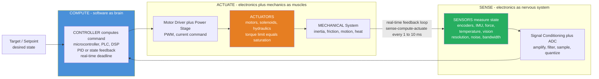

# 🤖 Mechatronics and Automation

> [!abstract] TL;DR
> **Mechatronics** is what happened when mechanical engineering stopped building *dumb* machines and started building *intelligent* ones. It is the **synergistic integration** of four disciplines — **MECHANICAL** hardware (the body), **ELECTRONICS and sensors** (the nervous system), **CONTROL systems** (the reflexes), and **SOFTWARE/computing** (the brain) — into products that **sense, decide, and act**. The term was coined in Japan precisely to name the fact that *the whole is greater than the sum of its parts*: a motor plus an encoder plus a microcontroller plus a control law is not four components bolted together, it is a new kind of thing — a machine that closes a **sense-compute-actuate loop** in real time. Your car's anti-lock brakes, a drone holding position in gusting wind, a camera snapping to autofocus, a robot arm welding a car body, a CNC machine cutting to a micron — every one is mechatronic. Scaled up to the factory floor, mechatronics becomes **industrial automation**: PLCs, SCADA, robotic cells, and the **Industry 4.0** smart factory. This note is the **section-opener** for *Systems, Mechatronics and Frontiers* — the integrative capstone that ties this vault's mechanics, dynamics, thermal, and fluid topics to electronics, control, and computing, and the reason modern mechanical engineering is inseparable from software.

---

## Intuition

**Analogy — a machine grows a nervous system.** A pure mechanical device is like a body with no senses and no brain: a wind-up clock, a hand-cranked drill, a purely mechanical governor. It can only do exactly the one motion its gears and cams were cut to do, and it has no idea whether it succeeded. Now imagine giving that body **senses** (so it can feel where it is and what the world is doing to it), a **brain** (so it can decide what to do about it), and **reflexes** (so it can act on that decision fast enough to matter). Suddenly the machine is not just moving — it is *behaving*. It holds a target, rejects disturbances, adapts, and recovers. That transformation — from a mechanism that merely *moves* to a machine that *senses, decides, and acts* — is exactly what **mechatronics** does.

Concretely: the **sensors** are the nervous system (encoders feeling joint angle, an IMU feeling orientation, a thermocouple feeling heat, a camera seeing the scene); the **microcontroller running a control law** is the brain and spinal reflex arc; and the **actuators** are the muscles (electric motors, solenoids, hydraulic rams). Wire them into a loop and the machine becomes *intelligent* in the engineering sense: your car's **anti-lock brakes** feel a wheel about to lock, decide to release pressure, and pulse the brake dozens of times a second; a **drone** feels itself tipping in the wind and spins up the right rotors before you ever notice. Mechatronics is the discipline that turned dumb machines into smart ones — and it is now everywhere a mechanical thing has to be clever.

---

## How It Works

### Core Mechanics

Mechatronics is best understood not as a list of parts but as a **loop** — the **sense-compute-actuate** cycle — running continuously in real time, with four disciplines contributing to it as one integrated whole.

1. **The physical (MECHANICAL) system — the plant.** At the core is a mechanical thing with dynamics: a rotating shaft, a moving stage, a robot joint, a thermal mass, a fluid loop. Left alone it obeys Newton and thermodynamics; the job of the rest of the loop is to make it do what we *want*, not just what physics leaves it to do. Its mechanical dynamics (inertia, friction, compliance, resonance) set what the control can and cannot achieve.

2. **SENSE — electronics as the nervous system.** **Sensors** measure the physical state: **encoders and resolvers** (position), **tachometers** (velocity), **accelerometers and IMUs** (motion and orientation), **force/torque cells** (contact), **thermocouples and RTDs** (temperature), **pressure transducers**, and **cameras/LiDAR** (vision). Every sensor is a *quantized, noisy, band-limited* shadow of the true quantity — defined by its **resolution**, **noise floor**, and **bandwidth**. Raw signals pass through **signal conditioning** (amplify, filter, and an **ADC** to sample) before the computer can use them; where several sensors overlap, **sensor fusion** combines them into one best estimate.

3. **COMPUTE — software as the brain.** A **controller** — an embedded **microcontroller**, a **DSP**, an industrial **PLC**, or a PC — reads the conditioned sensor values, compares them to the **target/setpoint**, and computes a command using a **control algorithm** (most often **PID**, sometimes state feedback, MPC, or a learned policy). This is where the machine *decides*. Crucially it must do so under **real-time constraints**: the loop fires on a fixed clock (say every 1–10 ms) and *must* finish before the next tick — correctness on average is not enough, it must be correct *on time, every time*.

4. **ACTUATE — electronics and mechanics as the muscles.** The command is turned into physical action by a **power stage / motor driver** (PWM, current control) driving an **actuator**: an electric **motor** (DC, BLDC/PMSM, stepper, servo — tied to motor drives), a **solenoid**, or a **hydraulic/pneumatic** cylinder. Actuators have hard limits — a finite **torque/force ceiling** and slew rate — so the beautiful control command gets **saturated (clipped)** at the physical maximum.

5. **The FEEDBACK loop closes.** The actuator moves the mechanical system, the sensors measure the new state, and the cycle repeats — a closed feedback loop that continuously drives the plant toward the target and rejects disturbances. This closed loop *is* the intelligence: no single component is smart, but the loop as a whole senses, decides, and acts. The design insight that makes mechatronics its own discipline is **co-design** — the mechanical dynamics, the sensor placement, and the control law all interact, so they must be designed *together*, not thrown over the wall between separate mechanical, electrical, and software teams.

Scaled from one machine to a whole factory, the same loop becomes **industrial automation**: **PLCs** and **SCADA** orchestrate lines, **industrial robots** and **CNC** machines run cells, conveyors move material, and the **Industry 4.0 / smart-factory** movement networks it all with IoT sensors, cloud data, AI, **digital twins**, and **predictive maintenance**.

### Flow / Architecture



---

## Key Concepts

### Secondary Level

- **Body, nerves, brain, muscles.** A mechatronic machine has a mechanical **body**, electronic **nerves** (sensors), a software **brain** (the computer), and **muscles** (motors and other actuators). Together they let it *sense, decide, and act* — instead of just blindly running.
- **Sense, decide, act — in a loop.** The machine measures what is happening, works out what to do, does it, then measures again — over and over, many times a second. That repeating loop is what makes it seem intelligent.
- **It is everywhere.** Anti-lock brakes, a self-stabilizing drone, a camera's autofocus, a robot arm, a 3D printer, a washing machine that weighs its load — all are mechatronic. Mechatronics is how "dumb" machines became "smart."
- **The whole beats the sum.** A motor by itself is not clever, and a computer by itself does nothing physical. Joined into one system that senses and reacts, they become something new and capable neither could be alone.

### Undergraduate Level

- **The sense-compute-actuate loop.** The organizing idea: a **sensor** reads the plant state, a **controller** computes a command from the error `e = target - measurement`, and an **actuator** drives the plant, closing a feedback loop. The loop runs at a fixed **sample rate** on a real-time computer.
- **Sensors and their limits.** Position (encoders/resolvers), velocity (tachometers), motion (accelerometers, **IMUs**), force/torque, temperature, pressure, vision. Each is characterized by **resolution** (smallest reportable change), **noise** (random error per reading), and **bandwidth** (how fast it can track). Raw output needs **signal conditioning** — amplification, anti-alias filtering, and analog-to-digital sampling.
- **Actuators and saturation.** Electric **motors** dominate (DC, BLDC, stepper, servo) driven by a power stage, alongside **solenoids** and **hydraulics/pneumatics**. The defining limit is **saturation**: a finite torque/force and slew rate, so any command beyond the ceiling is clipped — the single most common reason a real system is slower than the simulation.
- **The controller.** An embedded **microcontroller**, **DSP**, or industrial **PLC** running a control law. The workhorse is **PID** (proportional + integral + derivative); more advanced loops use state feedback or MPC. Ties directly to embedded systems and to classical control.
- **Real-time constraints.** The loop must finish computing *before the next tick*. Loop rate itself affects stability (too slow a loop can destabilize a controller that works fast), and latency/jitter between measuring and acting eats stability margin — hence dedicated microcontrollers and RTOSes rather than best-effort operating systems.
- **Industrial automation.** Applying mechatronics at scale: **PLCs** (ladder-logic controllers hardened for the factory), **SCADA** (supervisory monitoring), **industrial robots** and robotic cells, **CNC** machines, and conveyor/material-handling systems — the machinery of the modern assembly line.
- **Co-design.** Because mechanical dynamics, sensor placement, and control strategy all interact, a mechatronic system must be designed with mechanical, electrical, and control engineers working *together* from the start.

### Graduate Level

- **Sensor fusion and estimation.** No single sensor is enough: a fast, drift-prone IMU and a slow, absolute vision system are fused (typically with a **Kalman filter** or complementary filter) into one state estimate better than either alone — the perceptual backbone of self-driving cars, drones, and legged robots.
- **Discrete-time and real-time determinism.** Continuous control theory assumes an infinitely fast, precise loop; reality imposes sampling, quantization, latency, and jitter. Serious designs are done directly in the **z-domain** (place discrete poles inside the unit circle), model **actuator saturation** with anti-windup, and prove **worst-case execution time** and schedulability (rate-monotonic / EDF) so the deadline is never missed.
- **The mechatronic design cycle.** Modern practice uses **model-based systems engineering** and the **V-model**: requirements to system architecture, co-simulation of the coupled mechanical-electrical-control model, **hardware-in-the-loop** testing, then integration and verification — with the mechanical, electronic, and software subsystems traced against one set of system requirements.
- **Co-design as an optimization problem.** Choosing gear ratio, actuator size, sensor placement, structural stiffness, and control bandwidth *jointly* — because a stiffer structure raises resonance and permits a faster loop, a lower gear ratio improves force sensing but reduces torque, and so on. Siloed sequential design leaves performance (and safety margin) on the table.
- **Industry 4.0 and the smart factory.** Networked machines and **IoT** sensors stream data to the cloud; **digital twins** mirror physical assets in simulation; **predictive maintenance** uses vibration and current signatures to forecast failures before they happen; **AI/ML** optimizes throughput and quality across the line.
- **The interdisciplinary systems view.** The deepest graduate lesson is that mechatronics is not "mechanical plus some electronics" but a genuinely emergent systems discipline: the machine's behavior lives in the *interaction* of physics, sensing, computation, and control, and can only be understood and designed at the system level.

---

## Python Demo

A complete **mechatronic sense-compute-actuate loop** on a DC-motor **position servo**. The mechanical plant is a motor whose velocity obeys `omega_dot = (Km*u - omega)/tau` and whose position is the integral of velocity. Each control tick, a **SENSOR** reads the position (with optional Gaussian **noise** and encoder **quantization**), a **CONTROLLER** (discrete **PID**) computes a voltage command from the error, and the **ACTUATOR** drives the plant — with an optional voltage **saturation** limit (the torque ceiling). We (a) show the closed loop reaching its target and how sensor **noise** and actuator **saturation** each degrade it, and (b) overlay the three signals of the loop — the sampled **sensor** measurement, the **control effort**, and the true **system response** — the closed loop that makes the machine "intelligent." numpy + matplotlib only.

```python
# A mechatronic feedback loop: DC-motor POSITION SERVO with a discrete PID.
# SENSE (noisy/quantized encoder) -> COMPUTE (PID) -> ACTUATE (saturating motor).
# (a) closed-loop reaching target + effect of sensor NOISE and actuator SATURATION
# (b) overlay the SENSE / COMPUTE / ACTUATE signals for one realistic run.
import numpy as np
import matplotlib.pyplot as plt

def simulate(Kp, Ki, Kd, sensor_noise=0.0, sensor_bits=None, umax=np.inf,
             ref=1.0, Tsim=2.0, loop_rate=200.0, tau=0.15, Km=2.0, seed=0):
    """Continuous motor 'truth' integrated finely; the PID controller fires at
    loop_rate with a zero-order hold. sensor_noise = std of measurement noise [rad];
    sensor_bits = encoder resolution (quantizes one revolution into 2**bits steps);
    umax = actuator voltage/torque saturation limit."""
    rng = np.random.default_rng(seed)
    dt  = 1.0 / 4000.0                      # fine truth-integration step
    N   = int(Tsim / dt)
    t   = np.arange(N) * dt
    theta = np.zeros(N); omega = np.zeros(N)
    u_hist = np.zeros(N); meas_hist = np.zeros(N)
    u = 0.0; integ = 0.0
    e_prev = ref                            # init to avoid derivative kick
    meas = 0.0
    ctrl_dt = 1.0 / loop_rate
    last = -1e9
    for k in range(1, N):
        if t[k] - last >= ctrl_dt - 1e-12:          # controller ticks on a fixed clock
            last = t[k]
            # --- SENSE: read true position through a noisy, quantized encoder ---
            meas = theta[k-1] + sensor_noise * rng.standard_normal()
            if sensor_bits is not None:
                step = 2*np.pi / (2**sensor_bits)   # encoder step over one revolution
                meas = np.round(meas / step) * step
            # --- COMPUTE: discrete PID on the measured error ---
            e = ref - meas
            integ += e * ctrl_dt
            deriv  = (e - e_prev) / ctrl_dt
            e_prev = e
            u = Kp*e + Ki*integ + Kd*deriv
            # --- ACTUATE: saturation (finite torque / voltage ceiling) ---
            u = np.clip(u, -umax, umax)
        # --- MECHANICAL plant integrates continuously with the held command ---
        omega[k] = omega[k-1] + ((Km*u - omega[k-1]) / tau) * dt
        theta[k] = theta[k-1] + omega[k-1] * dt
        u_hist[k] = u
        meas_hist[k] = meas                          # last sampled sensor value (ZOH)
    return t, theta, u_hist, meas_hist

# PID gains (near-critically-damped for this plant)
Kp, Ki, Kd = 6.0, 2.0, 0.8

# (a) three loops: ideal, sensor-noise, actuator-saturation
t, th_ideal, u_ideal, _ = simulate(Kp, Ki, Kd)
_, th_noise, u_noise, m_noise = simulate(Kp, Ki, Kd, sensor_noise=0.02, sensor_bits=10)
_, th_sat,   u_sat,   _       = simulate(Kp, Ki, Kd, umax=3.0)

# (b) one realistic run combining BOTH noise and saturation -> the loop's signals
tR, thR, uR, mR = simulate(Kp, Ki, Kd, sensor_noise=0.02, sensor_bits=10, umax=6.0)

# settling report
def settle_time(t, th, tol=0.02, ref=1.0):
    out = np.where(np.abs(th - ref) > tol)[0]
    return t[out[-1]] if len(out) else 0.0
print("=== mechatronic position servo (target = 1.0 rad) ===")
print(f"  ideal loop        : settles ~ {settle_time(t, th_ideal):.2f} s")
print(f"  + sensor noise     : settles ~ {settle_time(t, th_noise):.2f} s  (jittery command)")
print(f"  + actuator sat 3.0 : settles ~ {settle_time(t, th_sat):.2f} s  (torque-limited)")

# ------------------------------- plotting --------------------------------------
fig, ax = plt.subplots(2, 2, figsize=(14, 9))
fig.suptitle("A Mechatronic Feedback Loop: SENSE - COMPUTE - ACTUATE",
             fontsize=15, fontweight="bold")

# (0,0) closed-loop position response under feedback
ax[0,0].plot(t, th_ideal, color="#27AE60", lw=2, label="ideal loop")
ax[0,0].plot(t, th_noise, color="#8E44AD", lw=1.4, label="+ sensor noise")
ax[0,0].plot(t, th_sat,   color="#C0392B", lw=2, label="+ actuator saturation")
ax[0,0].axhline(1.0, color="k", ls="--", lw=1, label="target")
ax[0,0].set_title("(a) Closed loop reaching the target under feedback")
ax[0,0].set_xlabel("time [s]"); ax[0,0].set_ylabel("position theta [rad]")
ax[0,0].legend(fontsize=8); ax[0,0].grid(alpha=0.3)

# (0,1) control effort -> shows saturation clip and noise jitter
ax[0,1].plot(t, u_ideal, color="#27AE60", lw=2, label="ideal command")
ax[0,1].plot(t, u_noise, color="#8E44AD", lw=1.0, alpha=0.8, label="noisy command")
ax[0,1].plot(t, u_sat,   color="#C0392B", lw=2, label="saturated command")
ax[0,1].axhline(3.0,  color="#C0392B", ls=":", lw=1.2, label="saturation limit")
ax[0,1].axhline(-3.0, color="#C0392B", ls=":", lw=1.2)
ax[0,1].set_title("(a) Control effort: saturation clips, noise jitters")
ax[0,1].set_xlabel("time [s]"); ax[0,1].set_ylabel("actuator command u [V]")
ax[0,1].legend(fontsize=8); ax[0,1].grid(alpha=0.3)

# (1,0) THE INTEGRATION: sampled sensor vs true response vs setpoint (realistic run)
ax[1,0].axhline(1.0, color="k", ls="--", lw=1, label="SETPOINT (target)")
ax[1,0].plot(tR, mR, color="#27AE60", lw=0.8, alpha=0.7, label="SENSOR (sampled, noisy)")
ax[1,0].plot(tR, thR, color="#2980B9", lw=2.2, label="RESPONSE (true position)")
ax[1,0].set_title("(b) Integration: what the machine SENSES vs what it DOES")
ax[1,0].set_xlabel("time [s]"); ax[1,0].set_ylabel("position [rad]")
ax[1,0].legend(fontsize=8); ax[1,0].grid(alpha=0.3)

# (1,1) the ACTUATE signal for the same realistic run
ax[1,1].plot(tR, uR, color="#E67E22", lw=1.4, label="COMPUTE -> ACTUATE (command)")
ax[1,1].axhline(6.0,  color="#C0392B", ls=":", lw=1.2, label="saturation limit")
ax[1,1].axhline(-6.0, color="#C0392B", ls=":", lw=1.2)
ax[1,1].axhline(0.0, color="gray", lw=0.6)
ax[1,1].set_title("(b) The control effort that drives the actuator")
ax[1,1].set_xlabel("time [s]"); ax[1,1].set_ylabel("actuator command u [V]")
ax[1,1].legend(fontsize=8); ax[1,1].grid(alpha=0.3)

plt.tight_layout(rect=[0, 0, 1, 0.95]); plt.show()
```

Running it: the **top-left** panel shows the closed loop driving the motor to its target under feedback — the *ideal* loop settles crisply, adding **sensor noise** makes it hunt slightly and jitter, and imposing an **actuator saturation** limit slows the response because the motor simply cannot deliver the torque the PID asks for. The **top-right** panel exposes *why*: the ideal command overshoots the saturation line freely, the noisy command is a spiky mess (differentiating a noisy encoder amplifies noise straight into the actuator), and the saturated command is flat-topped at the ceiling — clipped. The **bottom row** is the whole point of mechatronics: the machine only ever *sees* the green sampled sensor signal (noisy and quantized), yet the blue true position is smooth and reaches target, because the **control law fuses those imperfect samples into a correct action** — the sense-compute-actuate loop turning noisy measurement and a limited motor into intelligent behavior.

---

## Real-World Applications

> **Example:** **Automotive anti-lock braking (ABS)** is mechatronics in one subsystem. Wheel-speed **sensors** (the nerves) detect a wheel decelerating toward lockup faster than the vehicle; an **embedded controller** (the brain) decides the wheel is about to skid; and hydraulic **solenoid valves** (the muscles) modulate brake-line pressure — releasing and reapplying dozens of times per second — all inside a hard **real-time loop**. The same architecture, scaled and specialized, appears as electronic stability control (ESC), electronic fuel injection (EFI), and the whole ADAS/autonomy stack. A modern car is a rolling network of mechatronic loops.

- **Consumer products.** Camera **autofocus** and image stabilization, inkjet/3D **printers**, hard-disk head positioning, quadcopter **drones**, robotic vacuums, and appliances that sense load and adapt (washing machines weighing laundry) — small, cheap, ubiquitous sense-compute-actuate loops.
- **Robotics.** Industrial arms on assembly lines, mobile warehouse robots, surgical and service robots — mechanisms made intelligent by fusing actuators, sensors, and feedback control (the [[Robotic_Manipulation_and_Grasping]] and [[Actuators_Sensors_and_Embedded_Robotics]] notes deep-dive the robot instance of this note's architecture).
- **Industrial automation / Industry 4.0.** **PLC**- and **SCADA**-driven production lines, robotic welding and pick-and-place cells, **CNC** machining centers, and smart factories where IoT-instrumented machines feed **digital twins** and **predictive-maintenance** models.
- **Aerospace and defense.** Fly-by-wire flight control, actively controlled control surfaces, engine FADEC, and stabilized sensor gimbals — safety-critical mechatronic loops with certified real-time timing.
- **Medical devices.** Infusion pumps, ventilators, robotic prosthetics with force feedback, and MRI-compatible actuators — mechatronics applied to the human body, where the sensing and control must be exquisitely safe.

---

## Common Pitfalls

- **Siloed design (the cardinal sin).** Treating the machine as "mechanical, then bolt on electronics, then write software" defeats the whole premise. Because mechanical dynamics, sensor placement, and control strategy *interact*, they must be **co-designed** by an interdisciplinary team. A structure too flexible caps the achievable loop bandwidth; a poorly placed sensor cannot observe the state the controller needs — problems invisible to any one discipline working alone.
- **Thinking the whole is the sum of the parts.** Mechatronics is **synergistic** — the behavior emerges from the *interaction* of mechanics, electronics, control, and software. A great motor plus a great CPU plus a great sensor can still make a bad machine if the loop timing, sensor bandwidth, and actuator limits do not match. Design and reason at the *system* level.
- **Ignoring sensor noise, resolution, and bandwidth.** The controller never sees the true state, only a noisy, quantized, band-limited sample. Differentiating a coarse encoder amplifies noise into the actuator; a sensor too slow for the dynamics cannot close a fast loop; a missing anti-alias filter folds high-frequency vibration into the control band. Budget resolution/noise/bandwidth per sensor, and use **sensor fusion** where one sensor is not enough.
- **Forgetting actuator saturation.** Real motors have a finite torque and slew rate, so any command beyond the ceiling is clipped — the response is slower than the linear model predicts, and an integral term will **wind up** while saturated and then massively overshoot. Model `umax`, add anti-windup, or use a constraint-aware controller (MPC).
- **Missing real-time deadlines.** A control loop on a best-effort OS can be stalled for tens of milliseconds by a background task or garbage collector; loop rate itself is a stability parameter, and jitter eats margin unpredictably. Hard real-time control belongs on a **microcontroller/DSP/PLC** or an RTOS, not a general-purpose scheduler.
- **Confusing automation with intelligence.** A PLC running fixed ladder logic automates a sequence but does not *sense and adapt*; true mechatronic value comes from **feedback** — measuring the outcome and correcting. Open-loop automation is brittle to disturbances the closed loop would reject.
- **Units, signs, and integration bugs.** Mixing radians and degrees, encoder counts and revolutions, or a wrong feedback sign is the classic reason a bench-tested loop drives hardware into a wall. Verify every conversion and the sign of feedback before closing the loop on real actuators.

---

## Related Concepts

**The core loop and control law**
- [[Feedback_Control_Fundamentals]] — the closed-loop feedback principle at the heart of every mechatronic machine; why sensing the outcome and correcting beats open-loop sequencing.
- [[PID_Control]] — the workhorse control algorithm that runs inside the fixed-rate embedded loop this note describes.
- [[Actuators_Sensors_and_Embedded_Robotics]] — the robotics deep-dive on the same sense-compute-actuate hardware layer: motor limits, sensor specs, and the real-time loop.
- [[Model_Predictive_Control]] — the constraint-aware controller that treats actuator saturation and limits as first-class rather than clipping and hoping.

**Sensing, estimation, and perception**
- [[Kalman_Filtering_and_State_Estimation]] — turns noisy, quantized sensor samples into a usable state estimate; the engine of sensor fusion.
- [[Robot_Perception_and_Sensor_Fusion]] — combining complementary sensors (fast/drift-prone vs slow/absolute) into one best world estimate.

**Actuation and electronics**
- [[Motor_Drives_and_Control]] — the power electronics and drive control behind the electric actuators that dominate mechatronic systems.
- [[Electric_Machines_and_Transformers]] — the motors themselves: how electromechanical energy conversion sets the torque ceiling and bandwidth.
- [[Hydraulics_and_Pneumatics]] — the fluid-power actuators (high force density, compliance) used where electric motors fall short.
- [[Embedded_Systems_and_Microcontrollers]] — the computing substrate that reads sensors, runs the control law, and drives actuators under real-time constraints.
- [[Reinforcement_Learning_for_Control]] — the learning-based alternative to hand-tuned control laws for complex mechatronic behavior.

**Mechanical foundations**
- [[Gears_and_Power_Transmission]] — gearing trades motor speed for torque (and adds backlash and reflected inertia) between actuator and load.
- [[Mechanisms_and_Kinematics]] — the linkages and mechanisms whose motion the mechatronic loop senses and commands.
- [[Mechanical_Engineering_Overview]] — the vault hub; this note is the integrative capstone of its sixth sub-discipline.

---

## Review Questions

**Secondary**
1. Explain, using the "body / nervous system / brain / muscles" picture, what makes a self-stabilizing drone *mechatronic* rather than just mechanical. Name the sensor, the decision-maker, and the actuator, and say what would happen if you removed the sensor.

**Undergraduate**
2. Describe the **sense-compute-actuate** loop for a motor position servo. Then explain two distinct ways the loop degrades on real hardware compared to an ideal simulation — one caused by the **sensor** and one caused by the **actuator** — and how each shows up in the position response and the control command.

**Graduate**
3. A team builds a fast pick-and-place robot by designing the mechanism, then selecting motors and encoders, then writing the controller — each step handed to the next team. The finished machine oscillates and cannot hit its speed target. Argue, from the principle of **co-design**, why the *sequential* process is likely the root cause, and identify at least three specific mechanical/sensor/control *interactions* that a siloed workflow would have missed. How would a model-based, hardware-in-the-loop design cycle have caught them earlier?

---

## Sources

- W. Bolton — *Mechatronics: Electronic Control Systems in Mechanical and Electrical Engineering*, 7th ed. (Pearson, 2018)
- D. G. Alciatore & M. B. Histand — *Introduction to Mechatronics and Measurement Systems*, 5th ed. (McGraw-Hill, 2019)
- C. W. de Silva — *Mechatronics: An Integrated Approach* (CRC Press, 2005)
- M. P. Groover — *Automation, Production Systems, and Computer-Integrated Manufacturing*, 5th ed. (Pearson, 2019)
- D. Shetty & R. A. Kolk — *Mechatronics System Design*, 2nd ed. (Cengage, 2010)

---

Where this section goes next: with mechatronics established as the integrative frame — mechanical body, electronic nerves, software brain, and a real-time sense-compute-actuate loop — the rest of *Systems, Mechatronics and Frontiers* drills into its pieces and its edges. *Control of Mechanical Systems* formalizes the feedback laws that run inside the loop; *Tribology and Surface Engineering* addresses the friction, wear, and lubrication that limit every actuator, bearing, and contact in a real machine; *MEMS and Microengineering* shrinks the same sensor-actuator-control idea onto silicon (the accelerometers and gyros inside every phone and airbag); and *Sustainable and Energy Systems Engineering* asks how these intelligent machines can be built to run on clean, efficient energy. Each inherits this note's central lesson: modern mechanical engineering is no longer about gears alone — it is about machines that sense, decide, and act.

#mechanical-engineering #mechatronics #automation #sensors #actuators
