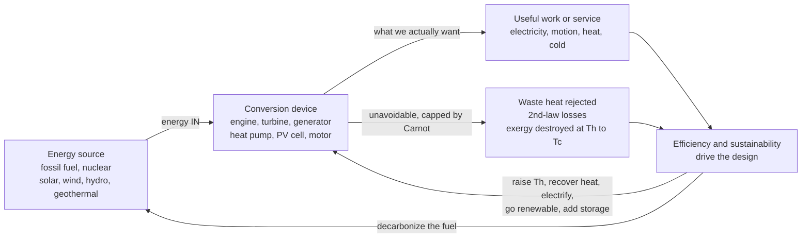

# ♻️ Sustainable and Energy Systems Engineering: Thermodynamics Meets the Planet's Future

> [!abstract] TL;DR
> Nearly **every machine is an energy-conversion device** — an engine turns chemical energy into motion, a power plant turns heat into electricity, a motor turns electricity into torque, a fridge pumps heat "uphill." The **second law of thermodynamics** guarantees none of these conversions is perfect: the **Carnot limit** $\eta_{max} = 1 - T_C/T_H$ caps *any* heat engine by its reservoir temperatures alone, so some energy is **always rejected as low-grade waste heat** — the central, non-negotiable constraint of energy engineering. Sustainable energy engineering is the discipline of doing **more useful work with less fuel and less waste**: squeezing efficiency out of every stage (**source-to-service**, well-to-wheel), tracking not just energy quantity but **exergy** (energy *quality* / available work), **recovering waste heat** (cogeneration, combined cycles), exploiting **heat pumps** that beat "100%" by *moving* heat rather than *making* it ($\text{COP} > 1$), and shifting from **burning fossil fuels to renewables** (solar, wind, hydro, geothermal) — which introduces the **intermittency** problem and its answer, **energy storage** (batteries, pumped hydro, thermal, mechanical). Mechanical engineers built the fossil-fuel machinery of the industrial age; they are now central to **re-engineering it to run clean**, making this the field where thermodynamics meets the defining challenge of the century.

## Intuition

**Analogy:** Every machine that does useful work — an engine, a power plant, a fridge, a jet — is really an **energy-conversion device**, and the second law is a **cruel toll collector** standing at every conversion: each time energy changes form, a portion is skimmed off as **low-grade waste heat** you can never fully get back. You cannot bribe or engineer your way past the toll — it is a law of nature, not a flaw in the hardware. **Sustainable energy engineering is the art of paying the smallest toll possible**: doing more useful work with less fuel and less waste. You do that by squeezing efficiency out of every conversion, capturing the heat that would otherwise escape, cleverly *moving* heat instead of *making* it, and — the biggest lever of all — switching the fuel at the source from burning-things to sunlight, wind, and water.

The twist that makes the field hopeful rather than merely resigned: the toll on a **heat pump runs backwards**. Because a heat pump *relocates* heat rather than generating it, it delivers **three to four units of warmth for every unit of electricity** — it "beats 100%," not by breaking the second law, but by exploiting it. That single insight — plus a grid fed by renewables and buffered by storage — is how mechanical engineers plan to heat buildings, move vehicles, and run industry on a fraction of today's fuel.

---

## How It Works

### Core Mechanics

1. **Almost everything is an energy conversion.** Chemical → mechanical in engines, thermal → electrical in power plants, electrical → mechanical in motors, radiant → electrical in solar PV, mechanical → electrical in wind turbines. The engineer's job is to route energy from a **source** through a **conversion device** to a **useful service** — while the second law skims a mandatory cut as waste heat at every heat-based step.

2. **The second law sets a hard ceiling (Carnot).** No heat engine operating between a hot reservoir $T_H$ and a cold reservoir $T_C$ can exceed $\eta_{max} = 1 - T_C/T_H$. This depends *only on the temperatures*, not the cleverness of the design. Two consequences dominate the whole field: **(i) waste heat is unavoidable** — you *must* dump $Q_C$ to a cold sink; and **(ii) higher $T_H$ helps** — hotter combustion or turbine-inlet temperatures raise the ceiling, which is why the pursuit of efficiency is a pursuit of high-temperature **materials** (single-crystal superalloys, thermal-barrier coatings).

3. **Track exergy, not just energy.** The first law conserves energy *quantity*; the second law degrades its *quality*. **Exergy** (availability) is the maximum useful work a stream can still deliver as it relaxes to the ambient dead state. A joule of 1500 K flame and a joule of 30 °C waste water carry the same energy but wildly different exergy. Exergy is **destroyed** by irreversibility at rate $\dot X_{dest} = T_0\,\dot S_{gen}$ — and honest energy engineering optimizes where exergy is *destroyed*, not merely where energy "goes."

4. **Chase efficiency at every stage and across the whole system.** Losses compound multiplicatively (source → conversion → transmission → end use), so the **systems view** — *well-to-wheel*, *source-to-service* — matters more than any single component's spec sheet. A 60%-efficient combined-cycle plant feeding a 95%-efficient grid and a 90%-efficient motor still only delivers ~51% of the fuel's energy as shaft work.

5. **Recover the waste.** Since the cold-side dump is mandatory, capture it: **cogeneration / CHP** uses "waste" heat for district heating or process steam; **combined cycles** stack a Brayton gas turbine on a Rankine steam bottoming cycle to harvest the exhaust; **waste-heat recovery** (economizers, organic Rankine cycles) scavenges low-grade streams.

6. **Move heat instead of making it (heat pumps).** Run a refrigeration cycle "forwards" for heating and you get $\text{COP}_{HP} = Q_H/W > 1$ — typically 3–5 — because you are *pumping* existing ambient heat, not converting work into heat one-for-one. This makes **electrified heating** far more efficient than combustion or resistance, and is a linchpin of building decarbonization.

7. **Switch the source and solve intermittency.** Shifting from fossil combustion to **renewables** (solar PV & thermal, wind, hydro, geothermal — mechanical and thermal engineering throughout) removes the fuel's carbon but adds **variability**. The answer is **energy storage** (electrochemical batteries, **pumped hydro**, thermal storage, mechanical storage such as flywheels and compressed air), **grid integration**, and **electrification** of transport and heat — all paired with **life-cycle** thinking so that embodied energy and materials, not just operating efficiency, are counted.

### Flow / Architecture



---

## Key Concepts

### Secondary Level

- **Machines convert energy; they never create it.** A car engine turns fuel into motion, a power plant turns heat into electricity, a fridge moves heat from cold to hot. Energy is only *changed in form*, never made from nothing.
- **Some energy is always wasted as heat.** No engine turns all its fuel into useful work — some *must* escape as warm exhaust or hot water. This is a law of nature, not bad engineering, and it is why car engines and power plants throw away most of their fuel.
- **Hotter is better (up to a point).** The hotter you can burn or run the machine, the more of the heat you can turn into work — which is why jet engines and power plants push materials to their melting limits.
- **A heat pump is a magic heater.** Because it *carries* heat in from outside rather than *making* it, a heat pump can deliver three or four times more warmth than the electricity it uses — the cheapest, cleanest way to heat a home.
- **Clean energy comes from the sun, wind, and water.** Solar panels, wind turbines, and hydro dams make electricity without burning anything — but the sun sets and the wind drops, so we must **store** energy for later (in batteries or by pumping water uphill).

### Undergraduate Level

- **The Carnot ceiling.** $\eta_{max} = 1 - T_C/T_H$ (temperatures in kelvin) is the *unbeatable* efficiency of any heat engine between reservoirs $T_H$ and $T_C$. Real engines fall below it because of **irreversibilities** (friction, finite-temperature-difference heat transfer, throttling). Raising $T_H$ raises the ceiling — the thermodynamic reason for high-temperature materials.
- **Efficiency vs COP.** Engines: $\eta = W/Q_{in} < 1$. Refrigerators/heat pumps: $\text{COP}_R = Q_C/W$, $\text{COP}_{HP} = Q_H/W = \text{COP}_R + 1$, routinely **>1**. The Carnot benchmarks are $\text{COP}_{HP,Carnot} = T_H/(T_H - T_C)$ and $\text{COP}_{R,Carnot} = T_C/(T_H - T_C)$ — both *rise* as the temperature **lift** $(T_H - T_C)$ shrinks, which is why heat pumps are so efficient for mild-climate heating and struggle in extreme cold.
- **Exergy (availability).** The *quality* of energy: maximum extractable work relative to the ambient dead state $(T_0, P_0)$. Electricity and high-temperature heat are high-exergy; tepid waste heat is low-exergy. **Matching exergy to task** (don't burn a 2000 K flame just to warm a room to 20 °C) is the second-law design principle.
- **The systems view.** *Well-to-wheel* and *source-to-service* efficiencies multiply stage efficiencies. An EV's true efficiency includes generation, transmission, charging, and motor losses; a "zero-emission" tailpipe is only clean if the upstream grid is.
- **Waste-heat recovery and cogeneration.** Combined heat and power (**CHP**) uses rejected heat for a second purpose, pushing *total* fuel utilization above 80% even when electrical efficiency is ~40%. **Combined cycles** (Brayton + Rankine) reach ~60% electrical efficiency.
- **Renewable conversion is mechanical/thermal engineering.** Wind turbines (aerodynamics, gearboxes, structures), hydro turbines (Pelton, Francis, Kaplan), concentrating solar thermal (heliostats, molten-salt thermal storage), geothermal (binary/ORC plants) — all live squarely in mechanical and thermal engineering.
- **Intermittency and storage.** Variable renewables need buffering: **batteries** (fast, high round-trip efficiency, ~85–95%), **pumped hydro** (~70–85%, ~95% of grid storage energy today), **thermal storage** (molten salt, hot water, phase-change), and **mechanical storage** (flywheels for seconds, compressed-air/CAES for hours).

### Graduate Level

- **Second-law (exergy) efficiency.** $\eta_{II} = \eta_{actual}/\eta_{reversible}$ exposes *where* work potential is squandered. Via **Gouy–Stodola** $\dot X_{dest} = T_0\,\dot S_{gen}$, the largest exergy destruction in a Rankine plant is the **boiler/combustor** (huge $\Delta T$ between flame and steam), in refrigeration it is the **throttle valve**, and across the whole economy it is **low-temperature combustion for heating** — a colossal exergy mismatch that heat pumps largely eliminate.
- **Finite-time thermodynamics.** The Carnot bound assumes zero power (infinitely slow). The **Curzon–Ahlborn** efficiency at maximum power $\eta_{CA} = 1 - \sqrt{T_C/T_H}$ predicts real plant efficiencies far better and quantifies the power-vs-efficiency trade-off inherent to any finite-rate machine.
- **Life-cycle assessment (LCA) and embodied energy.** Sustainability is not just operating efficiency: manufacturing a wind turbine, solar panel, or battery carries **embodied energy** and materials impact. **Energy return on energy invested (EROEI)** and **carbon payback time** decide whether a technology is net-beneficial; cradle-to-grave LCA is the honest accounting frame.
- **The intermittency / storage / grid-flexibility trilemma.** Deep decarbonization must match a variable supply to a variable demand across seconds (frequency regulation — flywheels, inverters), hours (batteries, pumped hydro), and seasons (hydrogen, thermal, synthetic fuels). **Levelized cost of storage** and **duck-curve** dynamics govern the economics; sector coupling (electrify heat and transport, then use them as flexible loads) is a key strategy.
- **Electrification and decarbonization pathways.** Replace combustion with electricity from clean sources: EVs (electrical → mechanical at ~90% vs ~25% for internal combustion), heat pumps for heating, electric arc / hydrogen for industrial heat, and power-to-X (hydrogen, ammonia, e-fuels) for hard-to-electrify sectors (aviation, shipping, steel).
- **Efficiency and the Jevons paradox / rebound.** Improving efficiency lowers the cost of an energy service, which can *increase* consumption (rebound), partially offsetting savings. Sustainability policy therefore couples efficiency with clean supply and, often, demand-side measures — efficiency alone does not guarantee lower total emissions.
- **Exergy-based systems optimization.** Pinch analysis, entropy-generation minimization, and exergoeconomics locate the highest-leverage retrofits in a plant or process network, trading capital against irreversibility — the quantitative backbone of industrial energy efficiency.

---

## Python Demo

```python
# Sustainable & energy systems engineering in one figure: the thermodynamic
# ceiling and the transition opportunity. numpy + matplotlib only.
#
#   (a) EFFICIENCY LIMITS:
#       - the CARNOT ceiling  eta = 1 - Tc/Th  vs hot-side temperature Th:
#         the hard 2nd-law wall on ANY heat engine. Real engines/plants sit
#         BELOW it (waste heat is unavoidable; higher Th raises the ceiling).
#       - overlaid on a twin axis: a HEAT PUMP's Carnot COP = Th/(Th - Tc),
#         which stays ABOVE 1 ("beats 100%") because it MOVES heat, not makes it.
#
#   (b) ENERGY-FLOW / SOURCE COMPARISON:
#       a Sankey-style stacked bar of USEFUL work vs REJECTED waste heat for
#       common conversions -- making the second-law "toll" and the efficiency
#       opportunity visible at a glance.
import numpy as np
import matplotlib.pyplot as plt

Tc = 300.0                       # K, cold reservoir / ambient (fixed)
Th = np.linspace(305, 1800, 400) # K, hot-side temperature

eta_carnot = 1.0 - Tc / Th       # 2nd-law ceiling for a heat engine
cop_hp     = Th / (Th - Tc)      # Carnot COP of a heat pump delivering heat at Th

# Real heat engines / plants: (hot-side T [K], actual thermal efficiency)
engines = {
    "Steam plant":     (810.0, 0.40),
    "Gasoline (Otto)": (1400.0, 0.30),
    "Diesel":          (1500.0, 0.42),
    "Gas turbine":     (1500.0, 0.40),
    "Combined cycle":  (1700.0, 0.60),
}

print("=== (a) CARNOT CEILING vs real machines (Tc = 300 K) ===")
for name, (T, eta) in engines.items():
    ceil = 1.0 - Tc / T
    print(f"  {name:16s} Th={T:6.0f} K  real eta={eta*100:5.1f}%  "
          f"Carnot ceiling={ceil*100:5.1f}%  2nd-law eff={100*eta/ceil:5.1f}%")
# A domestic heat pump: deliver 320 K from a 300 K source (20 K lift)
Th_hp = 320.0
print(f"  Heat pump (deliver {Th_hp:.0f} K from {Tc:.0f} K): "
      f"Carnot COP = {Th_hp/(Th_hp-Tc):.1f}  (real ~3-4, i.e. 300-400% 'efficient')")

# (b) Energy-flow breakdown: fraction of input energy that becomes USEFUL work/service
useful = {
    "Incandescent bulb\n(elec -> light)": 0.05,
    "Car engine\n(fuel -> wheels)":       0.22,
    "Coal steam plant\n(heat -> elec)":   0.38,
    "Nuclear plant\n(heat -> elec)":      0.33,
    "Gas combined cycle\n(fuel -> elec)": 0.60,
    "Electric motor\n(elec -> shaft)":    0.92,
}

# ----------------------------- plotting -----------------------------
fig, (axL, axR) = plt.subplots(1, 2, figsize=(15, 6))
fig.suptitle("Sustainable Energy Engineering: the 2nd law caps engines, "
             "but heat pumps and clean sources change the game",
             fontsize=13, fontweight="bold")

# --- (a) Carnot ceiling + heat-pump COP ---
axL.plot(Th, 100 * eta_carnot, color="#2a9d8f", lw=2.5,
         label="Carnot ceiling  eta = 1 - Tc/Th")
axL.fill_between(Th, 100 * eta_carnot, 100, color="#e76f51", alpha=0.12,
                 label="forbidden by the 2nd law")
for name, (T, eta) in engines.items():
    ceil = 1.0 - Tc / T
    axL.plot([T, T], [100 * eta, 100 * ceil], color="gray", lw=1, ls=":")
    axL.scatter([T], [100 * eta], zorder=5)
    axL.annotate(name, xy=(T, 100 * eta), xytext=(T - 30, 100 * eta - 7),
                 fontsize=7, ha="right")
axL.axhline(100, color="k", lw=1, alpha=0.4)
axL.text(900, 103, "100% (every engine is stuck below this)",
         fontsize=8, color="k")
axL.set_xlabel("hot-side temperature  Th  [K]   (Tc = 300 K)")
axL.set_ylabel("heat-engine efficiency  [percent]", color="#2a9d8f")
axL.set_ylim(0, 130)
axL.set_title("(a) The thermodynamic ceiling -- and the heat-pump loophole",
              fontsize=11)
axL.grid(alpha=0.3)
axL.legend(loc="center right", fontsize=8)

# twin axis: heat-pump COP (moves heat, so it 'beats 1')
axR2 = axL.twinx()
axR2.plot(Th, cop_hp, color="#8338ec", lw=2.2, ls="--",
          label="heat pump COP = Th/(Th - Tc)")
axR2.axhline(1, color="#8338ec", lw=1, alpha=0.5, ls=":")
axR2.scatter([Th_hp], [Th_hp / (Th_hp - Tc)], color="#8338ec", zorder=6)
axR2.annotate("heat pump\nCOP > 1: moves heat,\ndoes not make it",
              xy=(Th_hp, Th_hp / (Th_hp - Tc)), xytext=(600, 9),
              fontsize=8, color="#8338ec",
              arrowprops=dict(arrowstyle="->", color="#8338ec"))
axR2.set_ylabel("heat-pump COP  [heat out / work in]", color="#8338ec")
axR2.set_ylim(0, 14)

# --- (b) energy-flow: useful vs rejected ---
names = list(useful.keys())
u = np.array([useful[k] for k in names]) * 100
w = 100 - u
y = np.arange(len(names))
axR.barh(y, u, color="#2a9d8f", label="useful work / service")
axR.barh(y, w, left=u, color="#e76f51", alpha=0.85, label="rejected waste heat")
for i, (uu, ww) in enumerate(zip(u, w)):
    axR.text(uu / 2, i, f"{uu:.0f}%", va="center", ha="center",
             fontsize=8, color="white", fontweight="bold")
    if ww > 8:
        axR.text(uu + ww / 2, i, f"{ww:.0f}%", va="center", ha="center",
                 fontsize=8, color="white", fontweight="bold")
axR.set_yticks(y)
axR.set_yticklabels(names, fontsize=8)
axR.set_xlabel("share of input energy  [percent]")
axR.set_title("(b) Where the energy goes: useful work vs wasted heat",
              fontsize=11)
axR.set_xlim(0, 100)
axR.legend(loc="lower right", fontsize=8)
axR.grid(alpha=0.3, axis="x")

plt.tight_layout(rect=[0, 0, 1, 0.94])
plt.show()
```

Running this prints the second-law arithmetic and draws two panels. **Panel (a)** is the whole discipline in one chart: the green **Carnot ceiling** $\eta = 1 - T_C/T_H$ rises with hot-side temperature but never reaches 100%, the orange region above it is **forbidden by the second law**, and every real engine (steam, gasoline, diesel, gas turbine, combined cycle) sits *below* its ceiling — the dotted gaps are efficiency lost to irreversibility, and the whole family is pinned under the 100% line. The purple dashed curve is the **heat-pump COP**, which lives *above 1* everywhere: a heat pump delivering 320 K from a 300 K source has a Carnot COP near 16 and a real COP of 3–4 — it "beats 100%" not by breaking the second law but by *moving* heat instead of making it, which is exactly why electrified heating is the efficient path. **Panel (b)** makes the second-law "toll" tangible: for each conversion, green is the useful work/service and orange is the rejected waste heat — an incandescent bulb wastes 95%, a car engine ~78%, a coal plant ~62%, while a combined-cycle plant (60%) and an electric motor (92%) show how much room the transition has to recover. The waste is the opportunity.

---

## Real-World Applications

> **Example — the heat pump, the counterintuitive hero of decarbonization.** A cold-climate air-source heat pump running on a vapor-compression cycle *extracts* heat from outdoor air even at sub-freezing temperatures and delivers it indoors, achieving a seasonal $\text{COP}$ of 3–4: three to four units of heat per unit of electricity. Compared with a gas furnace (~90% of fuel energy, but from combustion) or resistive heating (100% of electricity → heat, one-for-one), the heat pump's advantage is thermodynamic, not incremental — it *pumps* ambient heat rather than *generating* it, so it moves 3–4× more energy than it consumes. Paired with a grid decarbonized by wind and solar, replacing combustion heating with heat pumps is one of the single largest levers for cutting building emissions, which is why they are central to net-zero roadmaps worldwide.

- **Combined-cycle and cogeneration plants.** Stacking a Brayton gas turbine on a Rankine steam bottoming cycle reaches ~60% electrical efficiency; CHP plants reuse the rejected heat for district heating or industrial steam, pushing total fuel utilization above 80% — the second-law principle of *recovering the mandatory waste* made industrial.
- **Wind and hydro turbines.** Horizontal-axis wind turbines (aerodynamics, gearboxes, pitch control, tower dynamics) and hydro turbines (Pelton, Francis, Kaplan) are mechanical-engineering machines converting kinetic and potential energy of fluids into shaft work — renewable conversion is turbomachinery.
- **Concentrating solar thermal with storage.** Heliostat fields focus sunlight to heat molten salt to ~565 °C, driving a Rankine cycle; the hot salt is a **thermal store** that lets the plant generate for hours after sunset — a direct answer to intermittency.
- **Grid-scale energy storage.** Pumped hydro (~95% of installed grid storage energy) moves water uphill when supply is cheap and releases it through turbines at peak; lithium-ion batteries handle fast, short-duration balancing; compressed-air and flywheel systems fill niche timescales — all buffering the variability of renewables.
- **Electric vehicles and electrified transport.** An EV drivetrain converts electricity to motion at ~90%, versus ~25% well-to-wheel for internal combustion, and recovers braking energy — electrification's efficiency edge, contingent on a clean generation mix.
- **Waste-heat recovery and organic Rankine cycles.** ORC units harvest low-grade heat (geothermal brine, industrial exhaust, engine jacket water) too cool for water-steam cycles, turning otherwise-rejected exergy into electricity.

---

## Common Pitfalls

- **Ignoring the second law ("just engineer it to 100%").** The Kelvin–Planck statement forbids converting heat *entirely* into work in a cycle — you *always* need a cold-side dump. The Carnot bound $\eta \le 1 - T_C/T_H$ is a **law of nature**, not a materials limitation; a "waste-free" heat engine is a perpetual-motion machine. Waste heat is mandatory; the lever is *how much* and *how you reuse it*.
- **Counting energy, not exergy.** "Energy is never lost" is technically true and deeply misleading: the first law conserves *quantity*, the second law degrades *quality*. Tepid waste heat and high-voltage electricity carry different **exergy**. Burning a 2000 K flame to warm a room to 20 °C is an exergy catastrophe even if it is "efficient" in first-law terms — the honest currency is available work, not joules.
- **Forgetting the whole system / life cycle.** Optimizing one component while ignoring upstream losses (source-to-service) or downstream reuse leads to false wins; a "zero-emission" EV or heat pump is only clean if the grid is. And **operating** efficiency is not the whole story — **embodied energy** and materials (LCA, EROEI, carbon payback) can dominate for renewables and batteries.
- **Confusing efficiency with COP.** Engine efficiency $\eta < 1$; heat-pump/refrigerator COP > 1. Reporting a heat pump as "400% efficient" is not a violation of energy conservation — it *moves* heat rather than *making* work — but quoting the two metrics as if they were the same number is a classic error.
- **Assuming heat-pump COP is constant.** COP collapses as the temperature **lift** $(T_H - T_C)$ grows, so a unit rated at COP 4 on a mild day can fall to COP 2 in deep cold — a critical design consideration for electrified heating in cold climates.
- **Chasing higher $T_H$ without materials.** Raising the Carnot ceiling means hotter combustion and turbine-inlet temperatures — but that is bounded by creep, oxidation, and melting of the hot-section materials, which is why superalloys, single-crystal blades, and thermal-barrier coatings gate real efficiency gains.
- **Believing efficiency alone cuts emissions (Jevons paradox).** Cheaper energy services can *increase* consumption (rebound), partially offsetting efficiency gains. Sustainability needs efficiency **plus** clean supply **plus**, often, demand management — efficiency is necessary but not sufficient.
- **Treating storage as free or lossless.** Every store has round-trip losses (batteries ~90%, pumped hydro ~75%, hydrogen far less) and its own embodied energy; storage buys firmness at an efficiency and materials cost that must be counted in the system optimization.

*(This frontier note ties together the section's threads. Its thermodynamic backbone is developed in the sibling notes **Engineering_Thermodynamics** (the two laws, exergy) and **Power_and_Refrigeration_Cycles** (Rankine, Brayton, combined cycles, and the reversed heat-pump loop); the turbomachinery that realizes conversion appears in **Pumps_Compressors_and_Turbines**; friction and wear losses that quietly waste exergy are the subject of **Tribology_and_Surface_Engineering**; and the discipline's broader trajectory closes in **The_Reach_and_Future_of_Mechanical_Engineering**.)*

---

## Related Concepts

**Physics foundation — the laws that set the ceiling**
- [[Laws_of_Thermodynamics]] — the first law (energy conservation, $W = Q_{in} - Q_{out}$) that every conversion balances and the second law that forces the waste-heat dump and the Carnot ceiling this whole field lives under
- [[Entropy_and_Second_Law]] — entropy generation is *why* real conversions fall below Carnot and why exergy is destroyed; the microscopic root of the "unavoidable toll"

**Electrical & power engineering — where the work becomes electricity and how the grid copes**
- [[Renewable_Energy_Integration]] — the intermittency, storage, and grid-flexibility challenge of solar and wind on the electrical side, complementing this note's mechanical/thermal view of renewable conversion
- [[Power_Systems_and_the_Grid]] — the shaft work of turbines (and PV output) delivered as electricity; the dispatch, storage, and flexibility layer that a decarbonized energy system depends on

**Climate — why it matters**
- [[Anthropogenic_Climate_Change]] — the driver behind decarbonization: energy systems are the epicenter of the climate challenge, and this note is the engineer's response to it

---

## Review Questions

**Secondary**
1. A friend says, "If engineers were smart enough, they could build a car engine that turns *all* its fuel into motion with zero waste heat." Explain why this is impossible no matter how clever the design, and then explain the surprising fact that a heat pump can deliver *more* heat energy than the electricity it consumes — without breaking the same law.

**Undergraduate**
2. A building is heated in three ways from the same primary energy: (i) a gas furnace burning fuel at 90% first-law efficiency; (ii) an electric resistance heater at 100% (electricity → heat); (iii) an electric heat pump with a seasonal COP of 3.5. (a) If the electricity itself comes from a combined-cycle plant at 55% efficiency, compute the *source-to-service* efficiency of options (ii) and (iii) and compare all three. (b) Explain in exergy terms why using a 2000 K flame (or high-grade electricity) merely to warm a room to 20 °C is thermodynamically wasteful, and why the heat pump largely fixes this. (c) Why does the heat pump's advantage shrink in very cold weather?

**Graduate**
3. A country plans to decarbonize by (i) electrifying transport and heating and (ii) supplying the grid with wind and solar. (a) Explain, using the Carnot/exergy framework, why electrification *raises* end-use efficiency for both transport and heating even before the grid is cleaned. (b) The variable supply now requires storage across seconds, hours, and seasons — match appropriate technologies (flywheels/inverters, batteries, pumped hydro, hydrogen/thermal) to each timescale and discuss the round-trip-efficiency and embodied-energy penalties each introduces. (c) Using the Jevons/rebound idea and life-cycle thinking, argue why "improve efficiency" and "build renewables" are each necessary but neither is sufficient for actually cutting total emissions, and identify what a complete strategy must add.

---

## Sources

- Y. A. Çengel & M. A. Boles — *Thermodynamics: An Engineering Approach*, 9th ed. (McGraw-Hill, 2019) — energy conversion, Carnot limit, exergy, cycles
- M. J. Moran, H. N. Shapiro, D. D. Boettner & M. B. Bailey — *Fundamentals of Engineering Thermodynamics*, 9th ed. (Wiley, 2018)
- D. J. C. MacKay — *Sustainable Energy — Without the Hot Air* (UIT Cambridge, 2008; free at withouthotair.com) — quantitative, no-nonsense energy-transition arithmetic
- J. Tester, E. Drake, M. Driscoll, M. Golay & W. Peters — *Sustainable Energy: Choosing Among Options*, 2nd ed. (MIT Press, 2012)
- A. Bejan — *Advanced Engineering Thermodynamics*, 4th ed. (Wiley, 2016) — exergy and entropy-generation minimization

---

#mechanical-engineering #energy-systems #sustainability #thermodynamics #efficiency
