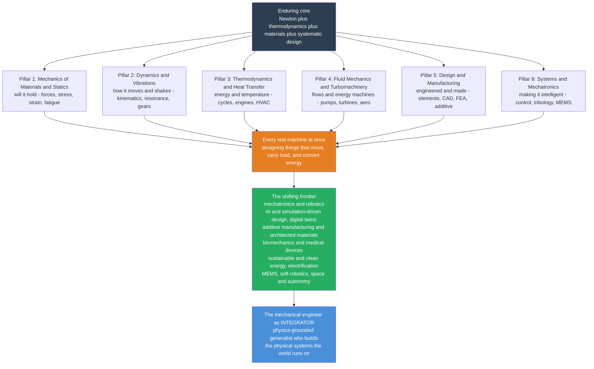

# 🌍 The Reach and Future of Mechanical Engineering

> [!abstract] TL;DR
> **Mechanical engineering** is the **broadest and oldest** branch of engineering — the discipline of *anything that moves, carries a force, or transfers energy*. From the lever and the wheel to jet engines, factory robots, MRI gantries, artificial heart valves, and the Mars rovers, it is the field that turns raw physics into machines you can touch. This capstone zooms all the way out and ties the whole vault together: its **six interlocking pillars** — **mechanics of materials** (will it hold?), **dynamics and vibrations** (how it moves and shakes), **thermodynamics and heat transfer** (energy and temperature), **fluid mechanics and turbomachinery** (flows and energy machines), **design and manufacturing** (how it is engineered and made), and **systems and mechatronics** (making it intelligent) — combine in *every* real machine at once. The **enduring core** (Newton, thermodynamics, materials, systematic design) is permanent; the **frontier** is being redrawn in real time by fusion with computing, biology, and sustainability: robotics and automation, AI and simulation-driven design, additive manufacturing and architected materials, biomechanics, clean energy and electrification, MEMS, and soft robotics. The honest message: mechanical engineering is not "old" or "solved" — it is continually reinvented, and the modern mechanical engineer is an **integrator**, the physics-grounded generalist who builds the physical systems the world runs on.

---

## Intuition

**Analogy — mechanical engineering is the "mother of all engineering."** Every other engineering discipline eventually branched off from it. It is the oldest, because the first engineers were mechanical engineers: whoever levered a stone block up a ramp, cut the first gear, or dammed the first river was doing mechanics of materials, dynamics, and fluid mechanics without the names. And it is the broadest, because its subject matter is defined not by a device or a material but by a *verb*: **anything that moves, carries a load, or transfers energy**. That definition sweeps in almost the entire physical world — the chair you sit on, the engine in your car, the turbine in a power plant, the wing of a plane, the pump under your sink, the robot on the factory floor, the stent in an artery, the rover crawling across Mars. Delete everything a mechanical engineer touched and you are left in a bare cave.

The reason such enormous reach rests on so few ideas is that it flows from just **two foundations**: **Newtonian mechanics** (how forces produce and resist motion) and **thermodynamics** (how energy moves and degrades into heat and work). Hand those two to a curious builder and the entire field unfolds — a beam under load, a crankshaft at 6000 rpm, gas expanding in a cylinder, air over a wing, a feedback-controlled robot joint. This note is the culmination of the vault: it recalls each thread we have pulled — from [[Statics_and_Equilibrium]] and [[Stress_Strain_and_Deformation]] through [[Engineering_Thermodynamics]] and [[Engineering_Fluid_Mechanics]] to [[Mechatronics_and_Automation]] — shows how they weave into one fabric, and casts that fabric forward into where the field is heading.

---

## How It Works

### Core Mechanics

Understand mechanical engineering as **six pillars standing on two foundations, converging into one activity, then reaching toward a shifting frontier**. The two foundations (Newton and thermodynamics) never change; the six pillars are the sub-disciplines this vault is organized around; the convergence is that *every real machine needs several pillars at once*; and the frontier is what happens when those pillars fuse with computing, biology, and sustainability.

1. **Pillar 1 — Mechanics of Materials & Statics: "will it hold?"** Sum the forces and moments ([[Statics_and_Equilibrium]]), follow the internal loads into the material as stress and strain ([[Stress_Strain_and_Deformation]]), through [[Bending_and_Beam_Theory]] and [[Torsion_and_Shafts]], and check the ways a part dies under cyclic and sudden load ([[Failure_Fatigue_and_Fracture]]). This pillar answers whether steel yields or a shaft snaps.

2. **Pillar 2 — Dynamics & Vibrations: "how does it move and shake?"** Once bodies accelerate you need [[Particle_and_Rigid_Body_Dynamics]]; converting and transmitting that motion is the job of [[Mechanisms_and_Kinematics]], [[Cams_and_Linkages]], and [[Gears_and_Power_Transmission]]; and keeping rotating machinery from tearing itself apart at resonance is [[Mechanical_Vibrations]] and [[Balancing_and_Rotordynamics]].

3. **Pillar 3 — Thermodynamics & Heat Transfer: "energy and temperature."** The energy foundation becomes engines and power cycles in [[Engineering_Thermodynamics]], [[Power_and_Refrigeration_Cycles]], and [[Internal_Combustion_Engines]]; the three modes of heat flow — [[Conduction_Heat_Transfer]], [[Convection_and_Radiation]], and their application in [[Heat_Exchangers_and_HVAC]] — decide how fast a chip overheats or a house loses warmth.

4. **Pillar 4 — Fluid Mechanics & Turbomachinery: "flows and energy machines."** The one pillar that draws on *both* foundations at once (momentum and energy): [[Engineering_Fluid_Mechanics]] and [[Internal_and_Pipe_Flow]] set the groundwork; [[Pumps_Compressors_and_Turbines]] and [[Hydraulics_and_Pneumatics]] move energy through fluids; [[External_Flow_and_Aerodynamics]] and [[Compressible_Flow_and_Propulsion]] carry it to wings and jets.

5. **Pillar 5 — Design & Manufacturing: "how is it engineered and made?"** Analysis becomes an artifact through [[Machine_Design_Principles]] and [[Machine_Elements]], realized by [[Manufacturing_Processes]] and [[Additive_and_Subtractive_Manufacturing]], verified against [[GD_and_T_and_Metrology]], and driven by the digital toolchain of [[CAD_CAE_and_Finite_Element_Method]].

6. **Pillar 6 — Systems & Mechatronics: "making it intelligent."** The modern synthesis: [[Mechatronics_and_Automation]] fuses hardware with sensors, control, and software; [[Tribology_and_Surface_Engineering]] governs the friction and wear that limit every contact. This pillar is the launch ramp to the frontier.

**The convergence.** No real machine lives in a single pillar. A jet engine is *thermodynamics and fluids* (the Brayton cycle in its turbomachinery), *materials* (blades that must not creep or fatigue), *dynamics* (rotors balanced to a whisker), *design and manufacturing* (single-crystal castings toleranced to microns), and *control* (the FADEC managing it all) — **all at once**. The mechanical engineer's real skill is not any one pillar but the *integration* of several into a working whole.

**The frontier.** Bolt the enduring core to modern computing, biology, and the climate imperative and the field is redrawn: mechatronics and robotics, AI- and simulation-driven design (generative/topology optimization, **digital twins**, ML surrogate models), additive manufacturing and architected materials, biomechanics and medical devices, sustainable and clean-energy systems, MEMS, soft robotics, and space and autonomous vehicles.

### Flow / Architecture



---

## Key Concepts

### Secondary Level

- **The broadest engineering.** If a thing *moves, carries a force, or transfers energy*, a mechanical engineer helped design it. That single sentence is why the field is so huge — it covers almost everything physical, from bicycles to rockets.
- **The oldest engineering.** The lever, the wheel, the pulley, the water mill — these were mechanical engineering thousands of years before the word existed. Every newer branch (electrical, chemical, aerospace, biomedical) grew out of it.
- **Six big questions.** Will it break? How does it move? How does it handle heat and energy? How does it push fluids around? How do we actually build it? How do we make it smart? Those six questions are the six pillars of this vault.
- **Old but not finished.** People sometimes think machines are a solved problem. They are not: robots, 3D printing, electric cars, and medical devices are all mechanical engineering being reinvented right now.

### Undergraduate Level

- **Two foundations, six pillars.** Everything rests on **Newtonian mechanics** ($\sum \vec F = m\vec a$) and **thermodynamics** (first and second laws). From them fan out the six pillars, each with a governing question and a governing equation family: statics/mechanics of materials ($\sigma = F/A$, $\sigma = My/I$), dynamics/vibrations ($m\ddot x + c\dot x + kx = F(t)$), thermo/heat transfer ($\Delta U = Q - W$, $\eta \le 1 - T_C/T_H$), fluid mechanics ($Re = \rho v L/\mu$, Bernoulli), design/manufacturing (factor of safety $N = \sigma_{allow}/\sigma_{applied}$), and mechatronics (the sense-compute-actuate loop).
- **Real machines are multi-pillar.** A car engine is thermo (its cycle) + dynamics (its crank and valvetrain) + materials (its fatigue life) + fluids (its cooling and intake) + design/manufacturing (its castings and tolerances) + mechatronics (its ECU). Learning the pillars separately is a study convenience; engineering them is always integrated.
- **Analysis vs design vs manufacturing.** Three cross-cutting activities run through all six pillars. *Analysis* predicts behavior (one answer). *Design* creates something that meets requirements (infinitely many answers and trade-offs). *Manufacturing* actually makes it, imposing tolerances, process limits, and cost.
- **The factor of safety threads them together.** Every pillar ends in a margin against uncertainty — in loads, properties, geometry, and model fidelity — chosen for the specific failure mode (yield vs fatigue vs buckling vs resonance vs overheating).

### Graduate Level

- **Continuum mechanics unifies solids and fluids.** The Cauchy stress tensor, the strain-rate tensor, and constitutive laws (Hooke, Newtonian viscosity) all descend from conservation of mass, momentum, and energy — the reason mechanics of materials and fluid mechanics are two faces of one framework, and why [[CAD_CAE_and_Finite_Element_Method]] can simulate both.
- **The enduring core vs the shifting frontier.** The foundations are permanent — Newton, thermodynamics, materials science, and systematic design will still be true in a century. What changes is the *frontier*, redrawn each generation by fusion with adjacent fields. Distinguishing the two is a career skill: master the invariant core so you can absorb whatever frontier arrives.
- **The frontier, concretely.** (1) **Mechatronics, robotics, and automation** — sensor-rich, software-defined machines. (2) **AI and simulation-driven design** — generative and topology-optimized geometry, **digital twins** that mirror a physical asset in real time, and ML surrogate models that replace hours of FEA/CFD with millisecond predictions, shifting engineering from build-and-test toward simulate-and-select. (3) **Additive manufacturing and architected materials** — lattices, metamaterials, and functionally graded parts impossible to machine. (4) **Biomechanics and medical devices** — prosthetics, implants, and surgical robots. (5) **Sustainable and clean energy** — efficiency, renewables, electrification, and EV powertrains, the field's answer to the climate challenge. (6) **MEMS/micro and nano**, **soft and bio-inspired robotics**, and **space and autonomous vehicles**.
- **The mechanical engineer as integrator.** As each pillar deepens and tools automate the routine, the scarce, growing skill is *system integration*: combining physics, computation, sensing, and control into a machine that works. This is a generalist's advantage in a specialist's world — and it is why demand for physics-grounded, build-real-things engineers keeps rising rather than fading.

---

## Python Demo

```python
# "Mechanical engineering in one figure" — a four-panel synthesis dashboard that
# recalls the whole vault, one pillar per panel:
#
#   (a) MECHANICS  -> cantilever-beam deflection      ("will it hold?")
#   (b) VIBRATION  -> resonance / frequency response   ("how does it shake?")
#   (c) THERMO     -> Carnot efficiency vs temperature ("energy & temperature")
#   (d) FLUIDS     -> sphere drag coefficient vs Reynolds number ("flows")
#
# Requires: numpy, matplotlib
import numpy as np
import matplotlib.pyplot as plt

# =====================================================================
# (a) MECHANICS OF MATERIALS  ->  cantilever beam deflection
#     y(x) = P x^2 (3L - x) / (6 E I),  tip deflection = P L^3 / (3 E I)
# =====================================================================
L = 1.0                          # length [m]
E = 200e9                        # Young's modulus [Pa] (steel)
b, h = 0.03, 0.03                # square cross-section [m]
I = b * h**3 / 12.0             # second moment of area [m^4]
x = np.linspace(0.0, L, 200)
loads = [200.0, 500.0, 1000.0]   # tip point loads [N]
defl = {P: (P * x**2 * (3*L - x) / (6*E*I)) * 1000.0 for P in loads}  # [mm]
tip = {P: P * L**3 / (3*E*I) * 1000.0 for P in loads}

# =====================================================================
# (b) VIBRATIONS  ->  frequency-response magnitude of a mass-spring-damper
#     |H(r)| = 1 / sqrt((1 - r^2)^2 + (2 zeta r)^2),  r = omega / omega_n
# =====================================================================
r = np.linspace(0.0, 3.0, 600)
zetas = [0.05, 0.10, 0.20, 0.50, 0.707]
H = {z: 1.0 / np.sqrt((1 - r**2)**2 + (2*z*r)**2) for z in zetas}

# =====================================================================
# (c) THERMODYNAMICS  ->  Carnot efficiency ceiling vs hot-reservoir temp
#     eta_carnot = 1 - T_C / T_H ; a real engine sits below it
# =====================================================================
T_C = 300.0                      # cold reservoir [K]
T_H = np.linspace(320.0, 1500.0, 300)
eta_carnot = 1.0 - T_C / T_H
eta_real = 0.60 * eta_carnot     # ~60% second-law efficiency (typical)

# =====================================================================
# (d) FLUID MECHANICS  ->  sphere drag coefficient vs Reynolds number
#     Cd ~ 24/Re + 6/(1 + sqrt(Re)) + 0.4  (White, valid Re < ~2e5)
# =====================================================================
Re = np.logspace(-1, np.log10(2e5), 400)
Cd = 24.0/Re + 6.0/(1.0 + np.sqrt(Re)) + 0.4

# --------------------------- console summary ---------------------------
print("=== Mechanical engineering in one figure ===")
print("(a) MECHANICS  cantilever tip deflection:")
for P in loads:
    print(f"      P = {P:6.0f} N  ->  tip = {tip[P]:6.2f} mm")
print("(b) VIBRATION  peak amplification at resonance:")
for z in zetas:
    print(f"      zeta = {z:5.3f}  ->  |H|max ~ {H[z].max():6.2f}")
print("(c) THERMO     Carnot ceiling (T_C = 300 K):")
for TH in (600.0, 1200.0):
    print(f"      T_H = {TH:6.0f} K  ->  eta_carnot = {(1-300.0/TH)*100:5.1f} percent")
print("(d) FLUIDS     sphere drag:")
for RE in (1.0, 1e3, 1e5):
    print(f"      Re = {RE:8.0e}  ->  Cd ~ {24/RE + 6/(1+np.sqrt(RE)) + 0.4:6.2f}")

# ------------------------------- plotting ------------------------------
fig, ax = plt.subplots(2, 2, figsize=(14, 10))
fig.suptitle("Mechanical Engineering in One Figure: the Vault's Four Threads",
             fontsize=15, fontweight="bold")

# (a) beam deflection
colors_a = ["#2ca02c", "#1f77b4", "#d62728"]
for P, c in zip(loads, colors_a):
    ax[0,0].plot(x, -defl[P], color=c, lw=2, label=f"P = {P:.0f} N (tip {tip[P]:.1f} mm)")
ax[0,0].axhline(0, color="k", lw=1)
ax[0,0].scatter([0],[0], color="k", s=80, marker="s", zorder=5)
ax[0,0].text(0.01, 0.5, "fixed\nwall", fontsize=8, va="bottom")
ax[0,0].set_title("(a) MECHANICS: cantilever beam deflection  ->  will it hold?")
ax[0,0].set_xlabel("position along beam x [m]")
ax[0,0].set_ylabel("deflection [mm]  (down)")
ax[0,0].legend(fontsize=8, loc="lower left"); ax[0,0].grid(alpha=0.3)

# (b) resonance / frequency response
for z in zetas:
    ax[0,1].plot(r, H[z], lw=2, label=f"zeta = {z:.3f}")
ax[0,1].axvline(1.0, color="gray", ls="--", lw=1)
ax[0,1].text(1.03, 8.5, "resonance\nr = 1", fontsize=8, color="gray")
ax[0,1].set_title("(b) VIBRATION: frequency response  ->  how does it shake?")
ax[0,1].set_xlabel("frequency ratio  r = omega / omega_n")
ax[0,1].set_ylabel("amplification |H|")
ax[0,1].set_ylim(0, 11); ax[0,1].legend(fontsize=8); ax[0,1].grid(alpha=0.3)

# (c) Carnot efficiency
ax[1,0].plot(T_H, eta_carnot*100, color="#d62728", lw=2.5, label="Carnot ceiling")
ax[1,0].plot(T_H, eta_real*100, color="#1f77b4", lw=2, ls="--",
             label="real engine (~60% of Carnot)")
ax[1,0].fill_between(T_H, eta_real*100, eta_carnot*100, color="#d62728", alpha=0.10)
ax[1,0].text(1050, 25, "irreversibility\nlosses", fontsize=8, color="#d62728")
ax[1,0].set_title("(c) THERMO: Carnot efficiency  ->  energy & temperature")
ax[1,0].set_xlabel("hot-reservoir temperature T_H [K]")
ax[1,0].set_ylabel("thermal efficiency [percent]")
ax[1,0].legend(fontsize=8, loc="upper left"); ax[1,0].grid(alpha=0.3)

# (d) drag vs Reynolds (log-log)
ax[1,1].loglog(Re, Cd, color="#8E44AD", lw=2.5)
ax[1,1].loglog(Re, 24.0/Re, color="gray", ls=":", lw=1.5, label="Stokes law 24/Re")
ax[1,1].axhline(0.4, color="#E67E22", ls=":", lw=1.5, label="inertial plateau ~0.4")
ax[1,1].set_title("(d) FLUIDS: sphere drag vs Reynolds  ->  how does it flow?")
ax[1,1].set_xlabel("Reynolds number Re")
ax[1,1].set_ylabel("drag coefficient Cd")
ax[1,1].legend(fontsize=8); ax[1,1].grid(alpha=0.3, which="both")

plt.tight_layout(rect=[0, 0, 1, 0.95])
plt.show()
```

Each panel is a whole section of the vault compressed to one curve. **(a)** the cantilever deflection $y(x) = Px^2(3L-x)/6EI$ recalls [[Bending_and_Beam_Theory]] and the "will it hold?" pillar — double the load, double the deflection, but slenderness ($I$) dominates. **(b)** the resonance peak of $|H(r)| = 1/\sqrt{(1-r^2)^2 + (2\zeta r)^2}$ recalls [[Mechanical_Vibrations]] — light damping means a towering, dangerous peak at $r=1$. **(c)** the Carnot ceiling $\eta = 1 - T_C/T_H$ recalls [[Engineering_Thermodynamics]] — efficiency rises with hot-side temperature but the second law caps it, and a real engine lives in the shaded gap below. **(d)** the sphere-drag curve recalls [[External_Flow_and_Aerodynamics]] — Stokes' $24/Re$ at low Reynolds numbers bending into the inertial plateau near $Cd \approx 0.4$. Four curves, four pillars, one figure: mechanical engineering at a glance.

---

## Real-World Applications

> **Example — a modern jet engine is the whole vault in one object.** Its core is a **Brayton thermodynamic cycle** ([[Power_and_Refrigeration_Cycles]], [[Engineering_Thermodynamics]]) executed by **turbomachinery** — compressor and turbine stages that are pure [[Pumps_Compressors_and_Turbines]] and [[Compressible_Flow_and_Propulsion]]. The turbine blades survive white-hot gas only through [[Failure_Fatigue_and_Fracture]] and creep-resistant single-crystal alloys, cooled by internal [[Conduction_Heat_Transfer]] and [[Convection_and_Radiation]]. The spinning rotor must be balanced to a hair ([[Balancing_and_Rotordynamics]], [[Mechanical_Vibrations]]); the whole assembly is drawn and simulated in [[CAD_CAE_and_Finite_Element_Method]], toleranced with [[GD_and_T_and_Metrology]], and produced by advanced casting and increasingly [[Additive_and_Subtractive_Manufacturing]]. A **FADEC** ([[Mechatronics_and_Automation]]) senses and commands it in real time. Six pillars, one machine.

- **Automobiles and EVs.** An IC-engine car is a dynamics + thermo + fluids + materials + design + control anthology ([[Internal_Combustion_Engines]], [[Gears_and_Power_Transmission]]); electrification shifts the balance toward mechatronics, thermal management of batteries, and sustainable-energy design without leaving mechanical engineering.
- **Robotics and automation.** Industrial arms, mobile warehouse robots, and CNC centers fuse mechanisms, actuators, sensors, and feedback control — the mechatronics frontier that connects to the [[The_Reach_and_Future_of_Robotics_and_Control|robotics vault]] and [[Soft_Robotics_and_Bioinspired_Design]].
- **Energy systems.** Steam and gas turbines, hydro and wind machines, heat pumps and HVAC ([[Heat_Exchangers_and_HVAC]], [[Pumps_Compressors_and_Turbines]]) — the physical hardware of decarbonization and the grid, shared with the [[The_Reach_and_Future_of_Electrical_Engineering|electrical engineering]] discipline.
- **Biomedical devices.** Prosthetics, orthopedic implants, heart valves, stents, and surgical robots apply solid mechanics, fatigue, and fluid mechanics to the human body, drawing on [[Stress_Strain_and_Elastic_Moduli|materials science]].
- **Aerospace and space.** Airframes fought against buckling and fatigue, rocket turbopumps, and Mars rovers whose every joint, wheel, and thermal loop is mechanical engineering operating where no technician can follow.
- **Manufacturing itself.** Machine tools, presses, injection molders, and additive machines are mechanical engineering designing the very means to make everything else ([[Manufacturing_Processes]]).

---

## Common Pitfalls

- **"Mechanical engineering is old and solved."** The single most damaging misconception. The *foundations* are settled; the *field* is not. Robots, 3D printing, digital twins, electric powertrains, soft robotics, and MEMS are all mechanical engineering being actively reinvented. A discipline defined by "anything that moves or transfers energy" cannot be finished while the world keeps building new things that move.
- **Treating the six pillars as separate silos.** Students learn statics, dynamics, thermo, fluids, design, and mechatronics as separate courses and then imagine real machines live in one box. They never do — a pump is fluids + materials + dynamics + control at once. The engineer's value is precisely in *interlocking* the pillars, and reasoning in only one blinds you to the failure modes hiding in the others (a thermally fine design that shakes itself apart; a strong design that cannot be manufactured).
- **Chasing the frontier without the core — or clinging to the core and ignoring the frontier.** Two opposite errors. Learning generative design or ML surrogates without Newton and thermodynamics gives you tools you cannot sanity-check. Mastering only the classical core while dismissing mechatronics, simulation-driven design, and sustainability leaves you unable to build what is now expected. The move is *both*: an invariant core plus a renewed frontier.
- **Believing software and AI are replacing the mechanical engineer.** They are changing the *job*, not removing it. Simulation replaces some prototypes, generative design proposes geometry, and digital twins monitor assets — but someone must frame the physics, judge the results, and integrate the machine. AI raises the value of the integrator, it does not retire them.
- **Confusing analysis with design.** Analysis (given a part, how does it behave?) has one answer; design (what part meets these requirements?) has infinitely many and demands trade-offs, iteration, and manufacturability. Beginners over-trust a single clean analysis and under-invest in the messy, constraint-driven design loop where real engineering happens.
- **Forgetting that a real machine must also be *made*.** An elegant, correctly analyzed design that cannot be cast, machined, tolerated, or assembled is not engineering — it is art. Manufacturing, [[GD_and_T_and_Metrology|tolerancing]], and cost are pillars, not afterthoughts, and the additive revolution is expanding, not eliminating, what "makeable" means.

---

## Related Concepts

**The hub and the two foundations**
- [[Mechanical_Engineering_Overview]] — the vault hub this capstone closes; the two-foundations, six-sub-discipline map.
- [[Newtons_Laws_and_Kinematics]] — the force-and-motion bedrock (Physics vault) beneath statics and dynamics.

**Pillar 1 — Mechanics of Materials & Statics**
- [[Statics_and_Equilibrium]] — force and moment balance, the starting point of every load path.
- [[Stress_Strain_and_Deformation]] — internal loads as stress and strain.
- [[Bending_and_Beam_Theory]] — the beam-deflection panel of the demo.
- [[Torsion_and_Shafts]] — shear and twist in rotating shafts.
- [[Failure_Fatigue_and_Fracture]] — how parts actually die under cyclic and sudden load.
- [[Stress_Strain_and_Elastic_Moduli]] — the materials-science constitutive relations behind "will it hold?".

**Pillar 2 — Dynamics & Vibrations**
- [[Particle_and_Rigid_Body_Dynamics]] — motion under force, the kinetics core.
- [[Mechanical_Vibrations]] — the resonance panel of the demo.
- [[Mechanisms_and_Kinematics]] and [[Cams_and_Linkages]] — converting and shaping motion.
- [[Gears_and_Power_Transmission]] — trading speed for torque.
- [[Balancing_and_Rotordynamics]] — keeping high-speed rotors quiet.

**Pillar 3 — Thermodynamics & Heat Transfer**
- [[Engineering_Thermodynamics]] — the Carnot panel of the demo; first and second laws.
- [[Power_and_Refrigeration_Cycles]] — Rankine, Brayton, vapor-compression loops.
- [[Internal_Combustion_Engines]] — the Otto/Diesel realization.
- [[Conduction_Heat_Transfer]] and [[Convection_and_Radiation]] — the three heat-flow modes.
- [[Heat_Exchangers_and_HVAC]] — thermal systems in buildings and machines.

**Pillar 4 — Fluid Mechanics & Turbomachinery**
- [[Engineering_Fluid_Mechanics]] — continuity, Bernoulli, Reynolds number.
- [[Internal_and_Pipe_Flow]] — pressure loss in networks.
- [[Pumps_Compressors_and_Turbines]] — the machines that move energy through fluids.
- [[External_Flow_and_Aerodynamics]] — the drag-vs-Reynolds panel of the demo.
- [[Compressible_Flow_and_Propulsion]] — high-speed and jet flows.
- [[Hydraulics_and_Pneumatics]] — fluid power actuation.

**Pillar 5 — Design & Manufacturing**
- [[Machine_Design_Principles]] — factor of safety and the design loop.
- [[Machine_Elements]] — shafts, bearings, gears, fasteners, springs.
- [[Manufacturing_Processes]] and [[Additive_and_Subtractive_Manufacturing]] — how parts get made.
- [[GD_and_T_and_Metrology]] — tolerancing and measurement.
- [[CAD_CAE_and_Finite_Element_Method]] — the digital design-and-simulation toolchain.

**Pillar 6 — Systems & Mechatronics, and sibling-discipline capstones**
- [[Mechatronics_and_Automation]] — the sense-compute-actuate synthesis; the launch ramp to the frontier.
- [[Tribology_and_Surface_Engineering]] — friction, wear, and lubrication at every contact.
- [[The_Reach_and_Future_of_Robotics_and_Control]] — the neighboring capstone where mechatronics becomes autonomy.
- [[Soft_Robotics_and_Bioinspired_Design]] — a frontier where mechanical engineering fuses with biology.
- [[The_Reach_and_Future_of_Electrical_Engineering]] — the sibling-discipline capstone; electrons to the mechanical world's forces.

---

## Review Questions

**Secondary**
1. Mechanical engineering is defined as "anything that moves, carries a force, or transfers energy." Pick three very different machines (say a bicycle, a refrigerator, and a drone) and, for each, name which of the six pillars — will-it-break, how-it-moves, heat/energy, fluids, how-it's-made, making-it-smart — you think matters most. Why is this discipline called the "broadest" and "oldest" engineering?

**Undergraduate**
2. Choose one machine (a car engine, a pump, or a wind turbine) and show how it simultaneously involves *at least four* of the vault's six pillars. For each pillar, name the governing question and one specific note from this vault that covers it. Then explain why studying the pillars separately is only a learning convenience, not how engineering is actually practiced.

**Graduate**
3. Argue for and against the claim that "AI and simulation are making the mechanical engineer obsolete." In your answer, distinguish the field's *enduring core* from its *shifting frontier*, explain concretely how digital twins, generative/topology-optimized design, and ML surrogate models change the day-to-day workflow, and defend a position on why the *integrator* skill either grows or shrinks in value as these tools mature.

---

## Sources

- R. G. Budynas & J. K. Nisbett — *Shigley's Mechanical Engineering Design*, 11th ed. (McGraw-Hill, 2020)
- R. C. Hibbeler — *Engineering Mechanics: Statics and Dynamics*, 14th ed. (Pearson, 2016)
- Y. A. Cengel, M. A. Boles & M. Kanoglu — *Thermodynamics: An Engineering Approach*, 9th ed. (McGraw-Hill, 2019)
- M. F. Ashby — *Materials Selection in Mechanical Design*, 5th ed. (Butterworth-Heinemann, 2016)
- National Academy of Engineering — *NAE Grand Challenges for Engineering* and ASME's *Vision 2030 / future of mechanical engineering* reports (nae.edu, asme.org)

---

#mechanical-engineering #capstone #mechatronics #future #synthesis
