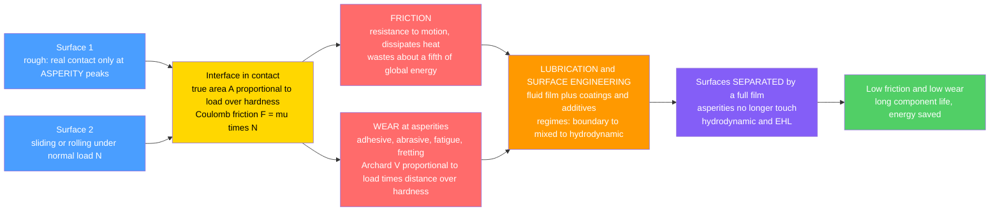

# 🛢️ Tribology and Surface Engineering

> [!abstract] TL;DR
> **Tribology** is the science of **interacting surfaces in relative motion** — everywhere two parts touch and slide or roll (piston in cylinder, bearing, gear tooth, cam, seal, brake, tire, hip implant), three phenomena dominate: **FRICTION** (resistance to motion that wastes energy), **WEAR** (progressive loss of material that destroys the part), and the **LUBRICATION** used to control both. The counterintuitive core is that real surfaces touch only at microscopic **ASPERITY** peaks, so **Coulomb friction** $F=\mu N$ scales with **load** but is roughly **independent of apparent area**, and **Archard's law** makes wear volume $\propto \dfrac{\text{load}\times\text{distance}}{\text{hardness}}$. The master picture of lubrication is the **STRIBECK CURVE** — friction versus a duty parameter (viscosity $\times$ speed / load) that sweeps through **boundary**, **mixed**, and **hydrodynamic/EHL** regimes, where a full fluid film finally **separates** the surfaces and friction and wear collapse. This "unglamorous" field carries **enormous stakes**: friction and wear waste roughly a **fifth of all the energy** humans use and cause most mechanical failures, so better lubricants, **coatings (DLC, nitriding, hard chrome)**, and low-friction designs translate directly into saved energy, money, and CO$_2$.

---

## Intuition — analogy FIRST

**Rub your hands together and they warm up.** That warmth is friction turning your muscular work into heat — energy wasted, never recovered. Now imagine you *kept* rubbing, hard, for hours: your skin would redden, blister, and eventually wear raw. In that single everyday act you have already met the whole field. **Friction** wastes the energy, **wear** destroys the surfaces, and the instinctive fix — spitting on your hands, or reaching for hand cream — is **lubrication**, a slippery film that keeps the surfaces from grinding directly on each other.

Wherever two solid surfaces touch and move — an engine piston in its cylinder, a ball rolling in a bearing, a gear tooth meshing, a hip implant in its socket — those same three villains lurk: **friction** wasting energy, **wear** eating material, and the constant need for **lubrication** to hold the surfaces apart. Tribology is simply the science of these rubbing interfaces, and it is astonishingly important: friction and wear squander a jaw-dropping fraction of the world's energy and cause the **majority of machine failures**. Control the interface — with the right oil, the right film, the right coating — and you save energy and extend life across almost every machine ever built.

---

## How It Works

Two solid surfaces are never as smooth as they look. Under a microscope every "flat" surface is a landscape of peaks and valleys, so when you press two together they touch only at a scattering of **asperity** tips. The **real** area of contact is a tiny fraction of the **apparent** (nominal) area — and, crucially, it grows in **proportion to the load**, because heavier loads flatten more asperities into contact. This single fact (Bowden and Tabor) explains the deceptively simple laws that follow.

### Core relations

1. **Coulomb (Amontons) friction:** $\displaystyle F = \mu N$ — friction force is proportional to the **normal load** $N$ and roughly **independent of the apparent contact area** and of sliding speed. It splits into **static** ($\mu_s$, the force to *start* sliding) and **kinetic** ($\mu_k < \mu_s$, to *keep* sliding).
2. **Why area drops out (real vs apparent contact):** $\displaystyle A_{\text{real}} \approx \frac{N}{H}$ — the true contact area is set by load $N$ and material **hardness** $H$, not by the block's footprint. Friction $F \approx \tau A_{\text{real}} = \tau N/H$ recovers $\mu = \tau/H$, so doubling the footprint at the same weight does **not** change friction.
3. **Archard wear law:** $\displaystyle V = K\,\frac{N\,s}{H}$ — the worn **volume** grows with **load** $N$ and **sliding distance** $s$, and falls with **hardness** $H$; $K$ is the dimensionless wear coefficient set by the wear *mechanism* (adhesive, abrasive, fatigue, corrosive, fretting).
4. **Duty (Hersey) parameter and film ratio:** $\displaystyle \text{Hersey} = \frac{\eta\,U}{P}$ (viscosity $\times$ speed / load) drives the **Stribeck curve**; whether asperities still touch is set by the film ratio $\lambda = h_{\min}/\sigma$ (film thickness over combined roughness).
5. **Lubrication regimes (the Stribeck curve):** as the duty parameter rises, $\mu$ falls steeply from **boundary** (surfaces nearly touching, additives protect, high friction), through **mixed**, to a **minimum**, then **rises** again in the **hydrodynamic / elastohydrodynamic (EHL)** regime where a full fluid film separates the surfaces and friction is pure **viscous drag**.
6. **Hertzian contact stress:** the pressure and sub-surface stress at concentrated (ball-on-race, gear-tooth) contacts follow **Hertz** theory; repeated Hertzian cycling drives **fatigue pitting / spalling** and sets rolling-bearing and gear life.



---

## Key Concepts

### Secondary (intuition)
- **Nothing is truly smooth.** Two surfaces touch only at tiny high spots (**asperities**), like two mountain ranges laid peak-to-peak — so the *real* contact is a fraction of what your eye sees.
- **Friction is the drag when surfaces rub, and it turns motion into heat** (rub your hands). It is why machines run hot and why engines burn extra fuel just to overcome it.
- **Wear is the slow loss of material** as those high spots break off or plow grooves — it is why brake pads, tires, and drill bits eventually wear out.
- **Lubrication is a slippery film** (oil, grease, even a gas) that slips between the surfaces to keep them from grinding — the reason engines need oil and doors need a squirt of WD-40.
- **A surprising law:** a wide, flat block and a narrow one of the *same weight* take about the **same push** to slide — friction cares about **weight, not footprint**.

### Undergraduate (the working theory)
- **Amontons–Coulomb laws.** $F=\mu N$ with $\mu$ nearly independent of apparent area and speed; static $\mu_s$ exceeds kinetic $\mu_k$ (the "stick" before "slip," source of stick-slip squeal). The modern explanation is **real contact area $\propto N/H$** shearing at a junction strength $\tau$.
- **Wear mechanisms and Archard's law.** $V = K\,Ns/H$. The coefficient $K$ encodes the *mechanism*: **adhesive** (junctions weld and tear), **abrasive** (hard asperities/particles plow — two-body vs three-body), **fatigue** (repeated contact → **pitting/spalling** of gears and bearings), **corrosive/tribochemical** (film grows and is rubbed off), and **fretting** (tiny oscillations at "static" joints). Harder surfaces wear less — the motivation for surface hardening.
- **The Stribeck curve and lubrication regimes.** Plot $\mu$ vs the **duty parameter** $\eta U/P$: **boundary** (very thin film, additives carry the load, $\mu \sim 0.1$), **mixed** (partial film, asperities share load), and **hydrodynamic** (full film, $\mu \sim 0.001$–$0.01$, then rising with viscous drag). The **minimum** is the sweet-spot operating point.
- **Hydrodynamic film generation.** A converging gap plus relative sliding pumps lubricant into a **pressure wedge** (Reynolds equation) that lifts the surfaces apart — the basis of the **journal bearing**. In hard, concentrated contacts (gears, ball bearings), pressures are so high the surfaces elastically deform and the oil stiffens — **elastohydrodynamic lubrication (EHL)**, giving films of well under a micron.
- **Surface topography.** Roughness parameters ($R_a$, $\sigma$) and the **film ratio** $\lambda=h_{\min}/\sigma$ decide whether you are in boundary ($\lambda<1$), mixed ($1<\lambda<3$), or full-film ($\lambda>3$) operation — the bridge from the Stribeck curve to real surface finish.
- **Contact mechanics.** **Hertzian** theory gives contact area and peak pressure for spheres/cylinders; the maximum shear sits **below** the surface, seeding sub-surface fatigue cracks that surface as **pits**.

### Graduate (design, mechanisms, systems)
- **The friction paradox, resolved.** Amontons' laws are *emergent*: because $A_{\text{real}}\propto N$ (plastic or elastic multi-asperity contact, Greenwood–Williamson statistics), the interfacial shear force scales with load, not footprint. Departures appear at very high pressures, in elastomers (adhesion/hysteresis, area-dependent), and at the nanoscale (single-asperity AFM, where $\mu$ is not even well-defined).
- **Third bodies and tribofilms.** Real interfaces are rarely two clean solids; **wear debris, transfer films, oxides, and additive-derived tribofilms** (e.g., ZDDP anti-wear glass) form a "**third body**" that governs friction and wear far more than bulk properties. Boundary lubrication is *chemistry*, not just film thickness.
- **Wear maps and regime transitions.** Lim–Ashby **wear-mechanism maps** plot dominant mechanism vs normalized load and speed; mild-to-severe transitions and oxidational wear regimes explain why a small change in load or speed can change wear rate by orders of magnitude.
- **EHL in depth.** Coupled **Reynolds + elasticity + piezo-viscous** (Barus) behavior yields the Dowson–Higginson film-thickness formulas; the pressure spike and dimple set gear/bearing fatigue and scuffing limits. Film ratio $\lambda$ links directly to bearing life modifiers (the $a_{ISO}$ factor).
- **Surface engineering toolbox.** **Coatings** — diamond-like carbon (**DLC**), TiN/CrN, **hard chrome**, MoS$_2$/soft films; **thermochemical treatments** — **nitriding, carburizing** (hard, compressive case); **mechanical** — **shot peening** (residual compression against fatigue); **texturing** — laser dimples that trap oil and boost film formation. Each targets a specific friction or wear mechanism; a coating on the wrong mechanism is wasted.
- **The energy and reliability stakes.** Holmberg and Erdemir estimate ~**20–25% of global energy** is spent overcoming friction, and wear drives the **majority of mechanical failures**; improved tribology (low-friction coatings, optimized lubricants, better bearings) is one of the largest available levers on global energy and CO$_2$ — before you even change the machine's function.
- **Frontiers.** Superlubricity (near-zero friction in graphene/DLC contacts), MEMS/NEMS **stiction** (surface forces dominate at small scale), biotribology of cartilage and implants, space tribology (no liquid oils in vacuum → solid lubricants), and green/ionic lubricants.

---

## Python Demo

```python
# Tribology core laws visualized:
#   (a) STRIBECK CURVE  -- coefficient of friction mu vs the duty (Hersey)
#       parameter  H = viscosity*speed/load, sweeping the three LUBRICATION
#       REGIMES: BOUNDARY (surfaces touch, high mu) -> MIXED -> HYDRODYNAMIC
#       (full fluid film, mu rises again with viscous drag). Mark the minimum.
#   (b) COULOMB FRICTION  F = mu*N  -- linear in LOAD, and (counterintuitively)
#       independent of APPARENT contact AREA; static mu_s > kinetic mu_k.
#   (c) ARCHARD WEAR LAW  V = K*N*s/H  -- wear VOLUME grows with load*distance
#       and falls with HARDNESS (harder -> less wear).
import numpy as np
import matplotlib.pyplot as plt

# =====================================================================
# (a) STRIBECK CURVE : mu(H),  H = eta*U/P  (Hersey / duty number)
#     Simple physical model: boundary term that DECAYS as a film builds
#     + a viscous (hydrodynamic) term that RISES linearly with H.
# =====================================================================
H = np.logspace(-4, 0, 600)              # duty parameter eta*U/P (log scale)
mu_bound = 0.12                          # boundary-regime friction (asperities)
Hc       = 6e-3                          # transition scale (film starts to lift)
c_visc   = 0.06                          # viscous-drag slope in full-film regime

mu = mu_bound * np.exp(-H / Hc) + c_visc * H   # U-shaped Stribeck curve
i_min = np.argmin(mu)                           # minimum-friction operating point
H_min, mu_min = H[i_min], mu[i_min]

print("(a) STRIBECK CURVE")
print(f"    minimum friction mu = {mu_min:.4f} at duty parameter H = {H_min:.2e}")
print(f"    boundary mu ~ {mu_bound:.2f}  ->  full-film mu can drop ~10x lower")

# =====================================================================
# (b) COULOMB FRICTION  F = mu*N  : linear in load, area-independent
# =====================================================================
N = np.linspace(0, 500, 200)             # normal load (N)
mu_s, mu_k = 0.55, 0.40                  # static > kinetic (e.g. dry steel-ish)
F_static  = mu_s * N
F_kinetic = mu_k * N

# Area-independence demo: SAME weight, three different apparent footprints
W = 300.0                                # block weight (N)
areas = np.array([2.0, 6.0, 12.0])       # apparent contact areas (cm^2)
F_area = mu_k * W * np.ones_like(areas)  # friction is the SAME for all footprints
print("(b) COULOMB FRICTION  F = mu*N")
print(f"    static  F(300 N) = {mu_s*W:.0f} N   kinetic F = {mu_k*W:.0f} N")
print(f"    same 300 N weight, areas {areas} cm^2 -> friction {F_area} N (identical)")

# =====================================================================
# (c) ARCHARD WEAR  V = K*N*s/H  : wear volume vs sliding distance & hardness
# =====================================================================
K   = 1e-3                               # dimensionless wear coefficient (mechanism)
s   = np.linspace(0, 1000, 200)          # sliding distance (m)
loads = [50.0, 100.0, 200.0]             # normal loads (N)
Hard  = 2.0e9                            # hardness (Pa)  ~ soft steel
V_dist = {L: K * L * s / Hard * 1e9 for L in loads}   # wear volume (mm^3)

# wear vs HARDNESS at fixed load & distance (harder -> less wear)
Hset = np.linspace(0.5e9, 6.0e9, 200)    # hardness sweep (Pa)
V_hard = K * 150.0 * 500.0 / Hset * 1e9  # wear volume (mm^3)
print("(c) ARCHARD WEAR  V = K*N*s/H")
print(f"    doubling load 50->100 N doubles wear; 3x harder surface -> 1/3 wear")

# ---------------------------------------------------------------------
# Plots
# ---------------------------------------------------------------------
fig, ax = plt.subplots(2, 2, figsize=(13, 10))

# (a) Stribeck curve with the three regimes shaded + minimum marked
ax[0,0].semilogx(H, mu, lw=2.6, color="#4a9eff")
ax[0,0].axvspan(H[0],   1.5e-3, color="#ff6b6b", alpha=0.12)
ax[0,0].axvspan(1.5e-3, 3.0e-2, color="#ffd43b", alpha=0.15)
ax[0,0].axvspan(3.0e-2, H[-1],  color="#51cf66", alpha=0.12)
ax[0,0].text(3e-4, 0.11, "BOUNDARY\n(asperities touch)", fontsize=8, color="#c92a2a")
ax[0,0].text(4e-3, 0.055, "MIXED", fontsize=8, color="#a68a00")
ax[0,0].text(1.2e-1, 0.05, "HYDRODYNAMIC\n(full film, viscous)", fontsize=8, color="#2b8a3e")
ax[0,0].plot(H_min, mu_min, "ko", ms=8)
ax[0,0].annotate("minimum-friction\noperating point",
                 xy=(H_min, mu_min), xytext=(H_min*3, mu_min+0.045),
                 fontsize=8, arrowprops=dict(arrowstyle="->", color="k"))
ax[0,0].set_title("(a) Stribeck curve: friction vs duty parameter eta*U/P")
ax[0,0].set_xlabel("duty (Hersey) parameter  eta*U/P"); ax[0,0].set_ylabel("coefficient of friction mu")
ax[0,0].grid(alpha=0.3, which="both")

# (b) Coulomb friction: linear in LOAD, static vs kinetic
ax[0,1].plot(N, F_static,  lw=2.5, color="#ff9900", label=f"static  mu_s = {mu_s}")
ax[0,1].plot(N, F_kinetic, lw=2.5, color="#845ef7", label=f"kinetic mu_k = {mu_k}")
ax[0,1].set_title("(b) Coulomb friction  F = mu*N  (linear in load)")
ax[0,1].set_xlabel("normal load N (N)"); ax[0,1].set_ylabel("friction force F (N)")
ax[0,1].legend(fontsize=9); ax[0,1].grid(alpha=0.3)

# (b-inset) area independence: same weight, 3 footprints -> same friction
axb = ax[0,1].inset_axes([0.55, 0.12, 0.4, 0.42])
axb.bar(range(len(areas)), F_area, color=["#51cf66","#4a9eff","#ff6b6b"])
axb.set_xticks(range(len(areas)))
axb.set_xticklabels([f"{a:.0f}" for a in areas], fontsize=7)
axb.set_title("same weight,\ndifferent area", fontsize=7)
axb.set_xlabel("apparent area (cm^2)", fontsize=7)
axb.set_ylabel("F (N)", fontsize=7); axb.tick_params(labelsize=6)

# (c) Archard wear volume vs sliding distance for three loads
for L, col in zip(loads, ["#51cf66", "#ff9900", "crimson"]):
    ax[1,0].plot(s, V_dist[L], lw=2.4, color=col, label=f"load N = {L:.0f} N")
ax[1,0].set_title("(c) Archard wear: V = K*N*s/H  (linear in load and distance)")
ax[1,0].set_xlabel("sliding distance s (m)"); ax[1,0].set_ylabel("wear volume V (mm^3)")
ax[1,0].legend(fontsize=9); ax[1,0].grid(alpha=0.3)

# (c) Archard wear vs hardness (harder -> less wear, inverse law)
ax[1,1].plot(Hset/1e9, V_hard, lw=2.6, color="#845ef7")
ax[1,1].set_title("(c) Harder surfaces wear LESS:  V proportional to 1/H")
ax[1,1].set_xlabel("hardness H (GPa)"); ax[1,1].set_ylabel("wear volume V (mm^3)")
ax[1,1].grid(alpha=0.3)

plt.tight_layout(); plt.show()
```

**What it shows:** (a) The **Stribeck curve** is the signature of tribology: friction starts high in the **boundary** regime (asperities in near-contact, only additive films protecting them), plunges through the **mixed** regime as a fluid film builds, reaches a **minimum** — the ideal operating point — and then *climbs again* in the **hydrodynamic/EHL** regime where the surfaces are fully separated and the only resistance left is **viscous drag**. This is exactly why friction depends on **speed and oil viscosity**, and why "more viscous oil" is not always better. (b) **Coulomb friction** rises linearly with **load** ($F=\mu N$), with static friction above kinetic (the stick before slip); the inset drives home the counterintuitive law — the **same weight** spread over a small, medium, or large **footprint** yields the **same** friction, because real contact lives at load-controlled asperities, not the apparent area. (c) **Archard's law** makes wear volume grow **linearly with sliding distance and load**, and fall as **$1/\text{hardness}$** — the quantitative reason surface **hardening and hard coatings** extend component life.

---

## Real-World Applications

- **Engine pistons, rings, cams, and tappets:** the piston-ring/cylinder interface alone accounts for a large share of an engine's friction losses; low-friction **DLC coatings**, honed cylinder textures, and additive-rich oils shift the contact toward the low-friction part of the **Stribeck curve** to save fuel.
- **Rolling and journal bearings:** rolling bearings ride on a **sub-micron EHL film**; plain journal bearings float on a **hydrodynamic wedge** and touch metal only at start/stop. Bearing fatigue **life** is a Hertzian-contact and film-ratio ($\lambda$) story straight out of tribology (ties to *Machine_Elements* selection).
- **Gears and power transmission:** meshing teeth run in the **EHL/mixed** regime; **pitting and spalling** are Hertzian-contact fatigue, and **scuffing** is a boundary-lubrication breakdown — tribology sets the load and speed limits of a gearset (see *Gears_and_Power_Transmission*).
- **Cutting tools and manufacturing:** **tool wear** (abrasive and adhesive) governs tool life and part quality; **TiN/TiAlN coatings** and cutting fluids attack exactly the friction and wear mechanisms at the chip–tool interface.
- **Biomedical implants:** artificial **hip and knee joints** (metal- or ceramic-on-UHMWPE, or ceramic-on-ceramic) are pure biotribology; **wear debris** — not fracture — is a leading cause of loosening, so low-wear pairings and lubricious surfaces determine implant longevity.
- **Brakes, tires, and clutches — friction by design:** here you *want* high, stable friction and controlled wear; pad and tire compounds are engineered so the friction coefficient stays predictable across temperature and speed.
- **MEMS and space mechanisms:** at micro-scale, surface forces cause **stiction**, and in vacuum ordinary oils evaporate — both drive the use of **solid lubricants** (MoS$_2$, DLC) and surface treatments, frontier tribology at the extremes of scale and environment.

---

## Common Pitfalls

- **"More apparent area means more friction."** The classic misconception. Because real contact is at load-controlled **asperities** ($A_{\text{real}}\approx N/H$), Coulomb friction $F=\mu N$ is roughly **independent of the apparent footprint** — a wide pad and a narrow one of equal weight need about the same push. Design for **load and material**, not nominal area.
- **Confusing static and kinetic friction.** $\mu_s>\mu_k$ is what causes **stick-slip**: the surface sticks, force builds, then it suddenly slips — the source of brake squeal, chatter, and jerky motion. Sizing an actuator with $\mu_k$ when breakaway needs $\mu_s$ under-powers the start.
- **Assuming thicker/more viscous oil is always better.** The **Stribeck curve** has a *minimum*. Push viscosity or speed past the sweet spot and you move up the **hydrodynamic** branch, where extra **viscous drag** *raises* friction and churning losses — real energy wasted. Match the lubricant to the duty point.
- **Ignoring the boundary regime and additives.** At start/stop, low speed, or high load the film collapses to **boundary lubrication**, where survival depends on **anti-wear/EP additives** (ZDDP, etc.) forming a protective tribofilm — not on bulk viscosity. Oils are chosen for their chemistry here, not just their grade.
- **Treating "wear" as one thing.** Adhesive, **abrasive**, fatigue (pitting/spalling), corrosive, and **fretting** wear have different mechanisms, different Archard $K$, and different fixes. A coating that beats abrasion may do nothing for contact fatigue. **Diagnose the mechanism first** (read the worn surface), then choose the countermeasure.
- **Skipping run-in.** New surfaces start rough, with high asperity contact; a controlled **running-in** period smooths the peaks (raising $\lambda$) and lowers steady-state friction and wear. Overload a fresh interface and you scuff it before it ever beds in.
- **Confusing hardness with wear resistance blindly.** Archard says harder wears less **for a given mechanism**, but a very hard, brittle surface can crack and **spall** under contact fatigue, and a hard coating on a soft substrate can fail by "eggshell" collapse. Match the **coating-substrate system**, not just peak hardness.
- **Forgetting Hertzian contact fatigue.** Bearing and gear failures are usually **sub-surface fatigue** from cyclic Hertzian stress, not overload. Sizing only for static strength while ignoring contact pressure and film ratio mis-predicts life (ties to *Failure_Fatigue_and_Fracture*).
- **Ignoring the interface entirely.** The most expensive pitfall of all: treating friction and wear as afterthoughts. They waste ~a **fifth of global energy** and cause most machine failures — the interface deserves the same design attention as the bulk part it sits on.

---

## Related Concepts

- [[Viscosity_and_Stress_in_Fluids]] — the lubricant's **viscosity** $\eta$ is the fluid property that generates the hydrodynamic/EHL film and sits at the heart of the Stribeck duty parameter $\eta U/P$; viscous shear *is* the friction on the full-film branch.
- [[Stress_Strain_and_Elastic_Moduli]] — the **elastic moduli** feed **Hertzian contact** mechanics that govern real contact area, EHL film shape, and the sub-surface stresses that seed pitting fatigue.
- [[Fatigue_Creep_and_High_Temperature_Failure]] — **contact/surface fatigue** (pitting, spalling) is the dominant wear-out mode of gears and rolling bearings; Archard fatigue wear and Hertzian cycling are its tribological expression.
- [[Strengthening_Mechanisms_in_Metals]] — **hardness** $H$ is the denominator in both the real-contact ($A\approx N/H$) and Archard ($V\propto Ns/H$) laws; hardening treatments (case, precipitation) are the classic route to wear resistance.
- [[Newtons_Laws_and_Kinematics]] — friction is the tangential **contact force** in Newtonian mechanics; the Coulomb model $F=\mu N$ (static vs kinetic) is the constitutive law that closes sliding-body problems.
- [[Work_Energy_and_Conservation]] — friction is a **non-conservative** force that dissipates mechanical work into heat; the "fifth of global energy" figure is this dissipation summed over all the world's rubbing interfaces.
- [[Nano_Electronics_and_MEMS_NEMS]] — at micro/nano scale surface forces cause **stiction** and single-asperity friction, where the macroscopic Coulomb picture breaks down — a live tribology frontier.

*(Siblings referenced in prose — Machine_Elements, Gears_and_Power_Transmission, Failure_Fatigue_and_Fracture, Mechatronics_and_Automation, and Sustainable_and_Energy_Systems_Engineering — are kept in prose here and will be wikilinked as the Mechanical Engineering sections fill out.)*

---

## Review Questions

1. **(Secondary)** Rub your hands together: explain in plain language where the warmth comes from, what would eventually happen if you kept rubbing for hours, and how a squirt of hand cream changes things. Map each part of that story onto the three pillars of tribology (friction, wear, lubrication).
2. **(Undergraduate)** A steel block weighing $300\ \text{N}$ is dragged across a floor with kinetic friction coefficient $\mu_k=0.4$. (a) Find the friction force. (b) You now rest the block on its *narrow* side, halving the apparent contact area — does the friction force change, and why? (c) Using Archard's law $V=KNs/H$, explain qualitatively how the worn volume changes if you double the load, then separately if you switch to a surface **three times harder**. (d) Sketch the Stribeck curve and mark the regime a slow-starting, heavily loaded bearing sits in at the instant of startup.
3. **(Graduate)** A high-speed gearbox suffers surface **pitting** on the gear flanks after a few thousand hours. (a) Identify the likely wear mechanism and the lubrication regime the teeth operate in, and explain the role of the **film ratio** $\lambda$ and Hertzian sub-surface stress. (b) Propose *three* interventions spanning **lubricant, surface engineering, and geometry** (e.g., additive/viscosity choice, a coating or thermochemical treatment, profile/roughness change), and for each state precisely which term in the tribological picture it improves. (c) Estimate, in words, the energy argument for why the manufacturer might invest in low-friction coatings across its whole product line even before any part fails.

---

## Sources

- Bhushan, B. *Introduction to Tribology* — contact mechanics, friction, wear mechanisms, lubrication regimes, and surface characterization.
- Hutchings, I. M. & Shipway, P. *Tribology: Friction and Wear of Engineering Materials* — Archard wear, wear mechanisms and maps, surface engineering and coatings.
- Stachowiak, G. W. & Batchelor, A. W. *Engineering Tribology* — hydrodynamic and elastohydrodynamic lubrication, boundary lubrication chemistry, bearing and gear tribology.
- Bowden, F. P. & Tabor, D. *The Friction and Lubrication of Solids* — the foundational real-contact-area (asperity) explanation of Amontons–Coulomb friction and adhesive wear.
- Holmberg, K. & Erdemir, A. "Influence of tribology on global energy consumption, costs and emissions" (*Friction*, 2017) — the ~20–25% of global energy spent on friction, and the reliability/CO$_2$ stakes.

---

#mechanical-engineering #tribology #friction #wear #lubrication
