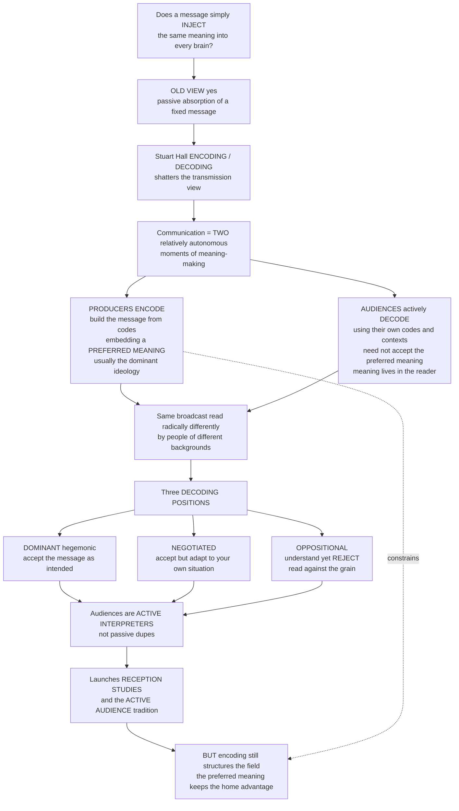

# 📺 Encoding/Decoding and Audience Reception

> [!abstract] TL;DR
> Stuart Hall's encoding/decoding model (1973) marks the pivotal shift in media studies from the "hypodermic needle" view — media inject fixed meanings into passive audiences — to seeing meaning as produced across **two relatively autonomous moments**: producers *encode* a message with a **preferred meaning** reflecting dominant ideology, but active audiences *decode* it with their own codes and can adopt a **dominant**, **negotiated**, or **oppositional** reading. The same broadcast is read radically differently across class, gender, and culture — yet encoding still structures the field, so the preferred meaning keeps the "home advantage."

---

## Intuition

**Analogy:** Does a TV show, an ad, or a news report simply *inject* its intended message into everyone's brain the same way a syringe injects a drug? For a long time media theory assumed roughly that — meaning was thought to live "in" the message, and audiences passively absorbed it. Stuart Hall shattered this with one of the most influential ideas in all of media studies.

His insight: a media message passes through **two separate moments of meaning-making**. First, producers **encode** it — they build it out of codes, loaded with a **preferred meaning** (the interpretation they want you to take, usually reflecting the dominant ideology). But then — the revolutionary part — **audiences actively decode** it, and they do not have to accept the preferred meaning. Because meaning lives in the *reader*, not the message, and because different people bring different backgrounds, values, and experiences, the *same* broadcast can be read in radically different ways.

Hall identified three **decoding positions**. The **dominant/preferred** reading: you accept the message as intended (you watch a patriotic ad and feel patriotic — exactly as designed). The **negotiated** reading: you broadly accept it but adapt it to your own situation (you agree with the general message but make an exception for your own case). The **oppositional** reading: you understand the intended meaning perfectly but *reject* it, reading "against the grain" (you watch that same patriotic ad and see manipulative propaganda).

This was liberating: audiences are not dupes or empty vessels — they are active **interpreters** who can resist, subvert, and remake media meaning. It launched **reception studies** (actually going out and asking real audiences how they interpret media — and finding astonishing diversity across class, gender, and culture). It is the foundation of the **active audience** tradition. But it also raises a tension: if audiences are so free to make their own meanings, does media *power* even exist? The answer: encoding still structures and constrains the field of possible readings — the preferred meaning has the home advantage.

---

## How It Works

### Core Mechanics

1. **Communication as a process, not a pipe.** Against the linear transmission model (sender → message → receiver), Hall reframes mass communication as a *circuit* of distinct, articulated moments: **production/encoding → circulation → consumption/decoding → reproduction**. Each moment has its own conditions, practices, and forms.
2. **Encoding.** Producers construct the message as a **meaningful discourse** using shared codes (language, genre conventions, visual grammar). Their professional routines, technical infrastructure, and frameworks of knowledge — crucially, the **dominant ideology** — get built into the text as a **preferred meaning**: the reading that appears "natural," obvious, or common-sense.
3. **The message is polysemic.** A text can carry many readings (**polysemy**). But polysemy is *structured*, not open — the encoding privileges one reading. Hall calls this **structured polysemy**: audiences are constrained but not determined.
4. **Relative autonomy of the two moments.** Encoding and decoding are **relatively autonomous** — there is *no guarantee* they match. A message must be decoded to have any effect at all, and the decoder uses their *own* codes and social context. Where those codes diverge from the encoder's, "misunderstandings" (or resistances) arise.
5. **Three decoding positions** (Hall's typology):
   - **Dominant-hegemonic:** the viewer decodes inside the dominant code and takes the preferred meaning whole.
   - **Negotiated:** the viewer acknowledges the legitimacy of the dominant code in the abstract but makes exceptions at the level of their own situation and interests (the most common position).
   - **Oppositional/counter-hegemonic:** the viewer understands the preferred meaning but re-reads the message within an alternative frame, decoding it "against the grain."
6. **Meaning is a negotiation.** The upshot: media power is real (encoding structures the terrain and privileges the preferred reading) *and* audiences are active (they can accept, adapt, or reject). Meaning is produced in the encounter between the two.

### Flow / Architecture



---

## Key Concepts

### Secondary (intuitive)
- **Encoding:** the maker of a message packs in the meaning they *want* you to get — the **preferred meaning**.
- **Decoding:** you unpack it your own way, using your own background — so you might not get the meaning they intended.
- **Three ways of reading:** agree with it (**dominant**), half-agree and adjust it (**negotiated**), or understand it but reject it (**oppositional**).
- **Active audience:** viewers are not sponges; they think, argue with, and remake what they watch.

### Undergraduate (mechanistic)
- **From transmission to circulation:** the hypodermic-needle / "magic bullet" model assumed powerful, uniform effects on passive masses; Hall replaces it with a circuit of encoding, circulation, and decoding.
- **Preferred meaning vs polysemy:** texts are polysemic but encode a privileged reading; **structured polysemy** captures that readings are constrained, not free.
- **Relative autonomy:** encoding and decoding are separate practices with no guaranteed correspondence — the source of resistance and "aberrant" readings.
- **Hall's typology in practice:** dominant / negotiated / oppositional as *positions*, not personality types — the same person decodes differently across texts and contexts.
- **Founding text of cultural studies:** written at the Birmingham Centre for Contemporary Cultural Studies (CCCS), it grounded the empirical study of reception.

### Graduate (critical / theoretical)
- **Semiotic base:** meaning is a signifying practice; the message is a "meaningful discourse" whose sign-vehicle circulates but whose meaning is realized only in decoding — Hall fuses Barthesian/Gramscian semiotics with Marxist ideology critique.
- **Empirical reception tradition:** Morley's *Nationwide* study operationalized the three positions across occupational groups; Ang's *Watching Dallas* and Radway's *Reading the Romance* revealed gendered pleasures and resistant readings; Katz & Liebes' cross-cultural *Dallas* study found culture-specific decodings. Fish's **interpretive communities** supply the collective grounding of "individual" readings.
- **The active-audience debate:** critics (e.g., Morley's own later reflections, and the "new revisionism" critique) warn that celebrating audience freedom can let structural power *off the hook* — polysemy has limits, and encoding still shapes the terrain.
- **Digital reframing:** the encode/decode boundary blurs when audiences become **prosumers** — comments, remixes, and memes are *visible* decoding; algorithmic curation is a new, opaque layer of "encoding"; interpretive communities fragment and re-form online.

---

## Python Demo

```python
# Encoding/Decoding as meaning-negotiation, simulated two ways:
#  (a) AUDIENCE DIVERSITY: one encoded message with a preferred meaning is decoded
#      into a DISTRIBUTION of readings (dominant / negotiated / oppositional),
#      and that distribution SHIFTS with the audience's ideological composition.
#  (b) POLYSEMY vs CONSTRAINT ("home advantage"): the preferred meaning is
#      privileged, so readings CLUSTER near it rather than spreading uniformly;
#      greater encoder-decoder ALIGNMENT raises the odds of a dominant reading.
import numpy as np
import matplotlib.pyplot as plt

rng = np.random.default_rng(7)
N = 20000  # audience members

# A decoder's "reading" r in [0,1]: 1 = fully DOMINANT/preferred, 0 = fully OPPOSITIONAL.
# Each member has an ideological ALIGNMENT a in [0,1] with the encoder's dominant code.
# HOME ADVANTAGE H shifts readings toward the preferred meaning (encoding constraint).
def decode(alignment, home_adv, noise=0.12):
    r = alignment + home_adv + rng.normal(0, noise, size=alignment.shape)
    return np.clip(r, 0.0, 1.0)

# Thresholds partition the reading spectrum into Hall's three positions.
T_LOW, T_HIGH = 0.33, 0.66
def positions(r):
    opp = np.mean(r < T_LOW)
    neg = np.mean((r >= T_LOW) & (r < T_HIGH))
    dom = np.mean(r >= T_HIGH)
    return dom, neg, opp

# Two audiences with different ideological composition (Beta shapes).
a_aligned  = rng.beta(5, 2, N)   # mostly aligned with the dominant code
a_divergent = rng.beta(2, 5, N)  # mostly distant from the dominant code
H = 0.10                          # modest home advantage baked in by encoding

r_aligned   = decode(a_aligned,   H)
r_divergent = decode(a_divergent, H)

fig, ax = plt.subplots(2, 2, figsize=(13, 9))

# (a1) Reading-spectrum histograms for the two audiences, with position thresholds.
bins = np.linspace(0, 1, 41)
ax[0, 0].hist(r_divergent, bins=bins, alpha=0.6, color="#c0392b", label="divergent audience")
ax[0, 0].hist(r_aligned,   bins=bins, alpha=0.6, color="#2980b9", label="aligned audience")
for t in (T_LOW, T_HIGH):
    ax[0, 0].axvline(t, color="k", ls="--", lw=1)
ax[0, 0].text(0.10, ax[0, 0].get_ylim()[1]*0.9, "OPP", ha="center")
ax[0, 0].text(0.50, ax[0, 0].get_ylim()[1]*0.9, "NEG", ha="center")
ax[0, 0].text(0.83, ax[0, 0].get_ylim()[1]*0.9, "DOM", ha="center")
ax[0, 0].set_title("(a) One message -> a DISTRIBUTION of readings")
ax[0, 0].set_xlabel("reading  (0 = oppositional  ->  1 = dominant/preferred)")
ax[0, 0].set_ylabel("audience members")
ax[0, 0].legend()

# (a2) Same message, different composition -> different mix of positions.
labels = ["Dominant", "Negotiated", "Oppositional"]
x = np.arange(3)
ax[0, 1].bar(x - 0.2, positions(r_aligned),   width=0.4, color="#2980b9", label="aligned")
ax[0, 1].bar(x + 0.2, positions(r_divergent), width=0.4, color="#c0392b", label="divergent")
ax[0, 1].set_xticks(x); ax[0, 1].set_xticklabels(labels)
ax[0, 1].set_ylabel("share of audience")
ax[0, 1].set_title("Meaning is not fixed by the message")
ax[0, 1].legend()

# (b1) ALIGNMENT sweep: as encoder-decoder alignment rises, P(dominant) rises.
means = np.linspace(0.1, 0.9, 25)
P = np.array([positions(decode(np.clip(rng.normal(m, 0.15, N), 0, 1), H)) for m in means])
ax[1, 0].plot(means, P[:, 0], "-o", ms=3, color="#2980b9", label="P(dominant)")
ax[1, 0].plot(means, P[:, 1], "-o", ms=3, color="#f39c12", label="P(negotiated)")
ax[1, 0].plot(means, P[:, 2], "-o", ms=3, color="#c0392b", label="P(oppositional)")
ax[1, 0].set_xlabel("mean ideological alignment with the dominant code")
ax[1, 0].set_ylabel("probability of position")
ax[1, 0].set_title("(b) Alignment tilts the odds")
ax[1, 0].legend()

# (b2) POLYSEMY vs CONSTRAINT: no home advantage -> spread (free polysemy);
#      with home advantage -> readings cluster toward the preferred meaning.
a_neutral = rng.uniform(0, 1, N)  # fully open ideological field
r_free      = decode(a_neutral, home_adv=0.00)  # pure polysemy
r_structured = decode(a_neutral, home_adv=0.25)  # encoding privileges preferred
ax[1, 1].hist(r_free,       bins=bins, alpha=0.6, color="#7f8c8d", label="polysemy (no constraint)")
ax[1, 1].hist(r_structured, bins=bins, alpha=0.6, color="#27ae60", label="structured polysemy (home advantage)")
ax[1, 1].axvline(1.0, color="k", ls="--", lw=1)
ax[1, 1].set_xlabel("reading  (1 = preferred meaning)")
ax[1, 1].set_ylabel("audience members")
ax[1, 1].set_title("Preferred meaning has the 'home advantage'")
ax[1, 1].legend()

plt.tight_layout()
plt.savefig("encoding_decoding_reception.png", dpi=120)
print("Aligned  audience  (dom, neg, opp):", np.round(positions(r_aligned), 3))
print("Divergent audience (dom, neg, opp):", np.round(positions(r_divergent), 3))
print("Mean reading  free polysemy vs structured:",
      round(float(r_free.mean()), 3), "vs", round(float(r_structured.mean()), 3))
```

Running it shows the core claim quantitatively: the *same* encoded message yields a **spread** of dominant/negotiated/oppositional readings; that spread **shifts** with audience composition and encoder–decoder alignment; and the home-advantage term makes readings **cluster** toward the preferred meaning rather than distributing uniformly — polysemy that is real but *structured*.

---

## Real-World Applications

- **Political advertising and campaign messaging.** A campaign encodes an ad with a preferred emotional frame (patriotism, fear, hope). Focus groups and reception research reveal dominant, negotiated, and oppositional readings across demographics — which is exactly why the *same* ad is A/B-tested and re-cut for different audiences.
- **News framing and "the same event, two stories."** Two viewers watch identical coverage and reach opposite conclusions. Encoding/decoding explains this without assuming either viewer is irrational: they decode within different codes and interpretive communities.
- **Brand and cultural marketing.** Advertisers *want* dominant decodings but routinely face oppositional ones (boycotts, culture-jamming, "brandalism"). Understanding decoding positions is core to reputation and crisis communication.
- **Media literacy education.** Teaching students to recognize the preferred meaning and to read "against the grain" is applied oppositional decoding — a direct pedagogical descendant of Hall.
- **Platforms, memes, and remix culture.** User comments, duets, reaction videos, and memes are decoding made *visible* and public; algorithmic recommendation acts as a new, opaque layer of encoding that curates which messages you even receive.
- **Audience and UX research.** Reception ethnography (interviews, diary studies, watch-alongs) is the methodological grandchild of Morley's *Nationwide* study, now used across streaming platforms and public broadcasters.

---

## Common Pitfalls

- **Collapsing decoding positions into personality types.** Dominant/negotiated/oppositional are *positions relative to a specific text and moment*, not fixed traits. The same person reads one program dominantly and another oppositionally.
- **Treating the model as three neat boxes.** Real decoding is a **spectrum** and often mixed within a single viewing; the three positions are heuristics, not exhaustive categories.
- **Over-celebrating the "active audience."** If any reading is possible, media power seems to vanish. This is the central critique: polysemy has limits, and encoding *structures* the field — the preferred meaning keeps the home advantage.
- **Forgetting encoding still constrains.** Symmetric-sounding "encode/decode" tempts people to treat producer and audience as equal. They are not: producers set the terrain, control circulation, and privilege one reading.
- **Assuming oppositional = misunderstanding.** An oppositional reader *understands* the preferred meaning perfectly and rejects it — that is a competent, not a failed, decoding.
- **Applying it only to TV.** The model generalizes to any coded message — advertising, journalism, games, feeds — but each medium changes *who* encodes, *how* circulation works, and *how visible* decoding becomes.

---

## Related Concepts

- [[The_Reader_and_Reception]] — the literary-studies parallel: Iser, Jauss, and Fish locate meaning in the act of reading and in interpretive communities, the same move Hall makes for mass media.
- [[Hermeneutics_and_Interpretation]] — the deeper theory of interpretation and the reader's horizon that underwrites why decoding is never a neutral read-off.
- [[Media_Culture_and_Cultural_Industries]] — the sociology of who controls the machinery of encoding and whose interests the preferred meaning serves.
- [[Culture_Norms_Values_and_Ideology]] — the concept of dominant ideology that the preferred meaning typically encodes, and that oppositional decoding contests.
- [[Discourse_Analysis]] — the linguistic study of how codes, framing, and context shape meaning in situated communication, complementing Hall's semiotic account.
- [[Schemas_and_Mental_Models]] — the cognitive frameworks decoders bring to a message, explaining *why* backgrounds produce divergent readings.

This note is one of the foundations of the Media and Communication Studies vault. It should be read alongside its siblings (to be created): **Media_and_Communication_Studies_Overview** (the map of the field), **Models_of_Communication** (the transmission/hypodermic-needle view this concept overturns), **Signs_Codes_and_Semiotics** (where meaning-in-the-reader comes from), **Cultural_Studies_and_Representation** (the Birmingham/CCCS tradition Hall founded), and **Media_Audiences_and_Reception** (the empirical active-audience research this launched).

---

## Review Questions

1. **(Secondary)** Explain the difference between *encoding* and *decoding* in your own words, and give an everyday example of a dominant, a negotiated, and an oppositional reading of the same advertisement.
2. **(Undergraduate)** Hall calls media texts "structured polysemy." What does *polysemy* mean, and how is it *structured*? Why does this phrase capture the middle ground between "the message controls meaning" and "any reading is possible"?
3. **(Undergraduate/Graduate)** Given a public-service announcement encoded to promote vaccination, sketch how audiences from different class and cultural backgrounds might occupy dominant, negotiated, and oppositional positions. Which social factors would you expect to structure the distribution of readings, and why?
4. **(Graduate)** The "active audience" tradition has been criticized for letting media power "off the hook." State this critique precisely, then explain how Hall's own model already answers it via the concept of the *preferred meaning* and the "home advantage."
5. **(Graduate)** In the digital era, audiences become *prosumers* and algorithms curate what we see. Does encoding/decoding still hold when the encode/decode boundary blurs? Identify what counts as "encoding" and "the preferred meaning" in an algorithmic feed, and where oppositional decoding becomes visible.

---

## Sources

- Hall, Stuart. "Encoding/Decoding." In *Culture, Media, Language: Working Papers in Cultural Studies, 1972–79*, edited by Stuart Hall et al., 128–138. London: Hutchinson, 1980. (Originally CCCS stencilled paper, 1973.)
- Morley, David. *The 'Nationwide' Audience: Structure and Decoding*. London: British Film Institute, 1980.
- Ang, Ien. *Watching Dallas: Soap Opera and the Melodramatic Imagination*. London: Methuen, 1985.
- Radway, Janice. *Reading the Romance: Women, Patriarchy, and Popular Literature*. Chapel Hill: University of North Carolina Press, 1984.
- Fish, Stanley. *Is There a Text in This Class? The Authority of Interpretive Communities*. Cambridge, MA: Harvard University Press, 1980.

---

#media-studies #encoding-decoding #stuart-hall #active-audience #reception-studies
