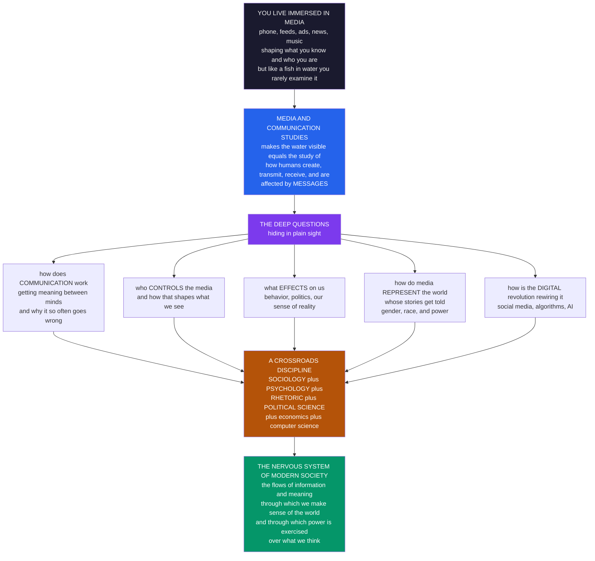

# 📡 Media and Communication Studies — An Overview

> [!abstract] TL;DR
> **Media and communication studies** is the interdisciplinary field that makes the *water we swim in* visible — the systematic study of how humans **create, transmit, receive, and are affected by messages**, especially through the mass and digital media that saturate modern life. It fuses two objects: **communication** (the process of creating and sharing **meaning**) and **media** (the channels, technologies, and institutions that mediate it — from print, radio, and television to platforms, algorithms, and AI). Using Lasswell's classic scaffold — *"who says **what**, in which **channel**, to **whom**, with what **effect**"* — the field asks a handful of deep questions hiding in plain sight: **how does communication actually work** (how does meaning cross between minds, and why does it so often go wrong)? **Who controls the media**, and how does that shape what we see? **What effects** do media have on our behavior, politics, and sense of reality? **How do media represent the world**, and thereby construct our understanding of gender, race, and power? And **how is the digital revolution** of social media, algorithms, and AI **rewiring all of it**? A genuine crossroads discipline, it borrows from **sociology** (media and society), **psychology** (media effects on the mind), **rhetoric** and **linguistics** (how messages persuade and mean), **political science** (media and democracy), economics (media industries), and computer science (computational communication). Because media shape elections, spread misinformation, forge and fracture communities, and are increasingly made **by machines**, understanding media and communication is understanding the **nervous system of modern society** — the flows of information and meaning through which we collectively make sense of the world, and through which power over what we think is exercised. This note is the **map**; the vault's six sections are the territory.

---

## Intuition

**Analogy:** *"There are these two young fish swimming along, and they meet an older fish swimming the other way, who nods at them and says 'Morning, boys, how's the water?' And the two young fish swim on for a bit, and then eventually one of them looks over at the other and goes 'What the hell is water?'"* (David Foster Wallace). You spend most of your waking life immersed in **media** — your phone the moment you wake, streaming, news feeds, ads, group chats, music, the ambient hum of screens — a constant ocean of *mediated communication* that shapes what you know, what you want, what you believe, and even who you think you **are**. But like a fish that has never noticed water, we rarely stop to examine the ocean we swim in. We treat "the news," "the feed," "the algorithm" as simply *how the world is*, not as **manufactured surfaces** curated by specific institutions with specific interests.

**Media and communication studies is the field that makes the water visible.** It steps back from the immersion to ask how the whole system works: how a message gets from one mind to another (and why it so reliably distorts on the way), who owns the pipes and the presses and the servers, what all this exposure is doing to us, whose stories get told and whose get erased, and how the shift to algorithmic and AI-generated media is quietly rewiring the entire ocean. It is the discipline that treats the most taken-for-granted thing in your life — **communication itself** — as a problem worth studying.

---

## How It Works

The field is best understood not as one theory but as a **cluster of questions** aimed at a single, ubiquitous object: the **mediated message**. Harold Lasswell's 1948 formula gives the enduring scaffold — *"Who says **what**, in which **channel**, to **whom**, with what **effect**?"* — and each clause opens a whole research tradition. **Who** points to the communicator, ownership, and control (political economy). **What** points to content, meaning, signs, and representation (semiotics and cultural studies). **Channel** points to the medium itself and its biases (medium theory, McLuhan). **Whom** points to audiences and reception (how meaning is *decoded*). **Effect** points to influence and consequences (media effects). Add a sixth clause the digital age forces on us — *with what **feedback**, and through which **algorithm**?* — and you have the modern field.

### The core questions (the vault's six sections)

1. **Foundations of Communication.** How does communication *work* at all? Transmission models (Shannon–Weaver: source, encoder, channel, noise, decoder, receiver), signs and meaning (Saussure and Peirce's **semiotics** — how a signifier evokes a signified), and reception (Stuart Hall's **encoding/decoding** — that audiences actively *produce* meaning rather than passively receive it). This is where the field's *history* lives too — the long march from oral culture through writing, print, and broadcasting to the network.
2. **Mass Communication Theory (media effects).** *Do media change us, and how much?* The pendulum of effects research: from the **hypodermic needle** (media inject attitudes into passive masses) to **limited effects** and the **two-step flow** (Katz and Lazarsfeld: influence flows through opinion leaders, not directly) to modern *cumulative* theories — **agenda-setting** (media tell us what to think *about*), **framing**, **cultivation** (heavy TV viewers absorb TV's version of reality), and **uses and gratifications** (audiences actively *use* media for their own needs).
3. **Media Institutions and Political Economy.** *Who controls the media, and in whose interest?* Ownership and concentration, journalism and the newsroom, advertising and the "attention economy," public-service versus commercial models, and the relationship between media and **democracy** — the **public sphere** where citizens deliberate.
4. **Culture, Representation, and Identity.** *How do media construct reality?* The **cultural studies** tradition (Hall, Williams, the Birmingham School): ideology, **hegemony**, and how representation of gender, race, class, and nation shapes our sense of what is normal, natural, and possible — plus audiences, fandom, and popular culture.
5. **Digital Media and Networks.** *How is the network rewiring everything?* New media, social platforms, **algorithms** and recommendation, convergence, participatory culture, echo chambers and filter bubbles, and the digital divide — the collapse of the neat sender-to-mass-receiver model into a many-to-many, machine-curated flow.
6. **Media Power, Ethics, and Frontiers.** *What now?* Misinformation and disinformation, surveillance and privacy, **media literacy**, platform governance, and AI-generated media — the ethical and political stakes of an information environment increasingly authored by machines.

### The interdisciplinary roots

Media and communication studies is a **confluence**, not a pure spring. It draws its *society-level* questions from **sociology** (the Chicago School on communication and community, the Frankfurt School on the "culture industry"), its *mind-level* questions from **psychology** (persuasion, cognition, media effects), its *meaning-level* tools from **rhetoric** and **linguistics** (semiotics, discourse, how messages persuade and signify), its *power-level* questions from **political science** (public opinion, propaganda, media and democracy), its *industry-level* analysis from **economics**, and, increasingly, its *methods* from **computer and data science** (computational communication, network analysis of how content spreads). It also carries two temperamentally different traditions in permanent tension: the **quantitative / social-scientific** tradition (measuring effects, testing hypotheses, the American "administrative" school) and the **qualitative / critical-cultural** tradition (interpreting meaning, critiquing power, the European critical school).

### The field, in one picture



---

## Key Concepts

### Secondary Level

**What the field studies.** Think about how much of your day is spent looking at a screen — messaging friends, scrolling a feed, watching videos, seeing ads, reading news. All of that is **media**: channels that carry **messages** between people. **Communication** is what happens when someone tries to share an idea, a feeling, or a fact, and someone else receives it. **Media and communication studies** is the field that steps back and studies this whole process: how messages are made, how they travel, how we make sense of them, and how they change us.

**The basic communication model.** The simplest way to picture communication is a chain:

| Part | What it is | Everyday example |
|---|---|---|
| **Sender** | The one with the message | A friend texting you |
| **Message** | The idea being sent | "Party at 8" |
| **Channel** | The medium carrying it | The messaging app |
| **Noise** | Anything that distorts it | Autocorrect changes "8" to "ate" |
| **Receiver** | The one who gets it | You, reading the text |
| **Feedback** | The reply back | You send a thumbs-up |

**The big questions in kid-simple form.** *How does a message get from one head to another (and why do misunderstandings happen so much)? Who decides what shows up in your feed or on the news? What is all this screen time doing to us? Whose stories get told and whose get left out? And how are phones and apps and AI changing all of it?* Those five questions are basically the whole field.

**Why it matters.** Media shape what you think is normal, what you worry about, who you vote for, and what you buy — often without you noticing. Learning to *see* the water (who made this message, why, and what it wants from me) is one of the most useful skills for living in a world made of screens.

### Undergraduate Level

#### Communication and media, defined

**Communication** is the process of creating and sharing **meaning** through the exchange of symbols. **Media** are the technological and institutional systems that *mediate* communication across space and time — extending it beyond face-to-face reach. The field spans a spectrum: **interpersonal** communication (two people), **group** and **organizational** communication, and **mass** communication (one source to a large, dispersed audience) — with **digital / networked** communication now scrambling those neat categories into a many-to-many hybrid.

#### From transmission to meaning: three models of communication

1. **Transmission model (Shannon–Weaver, 1949).** Communication as *signal engineering*: a **source** encodes a **message**, sends it through a **channel** subject to **noise**, where a **receiver** decodes it. Elegant and hugely influential, but it treats meaning as a package to be delivered intact — it under-theorizes interpretation.
2. **Semiotic / meaning model (Saussure, Peirce).** Communication as *signification*. A **sign** couples a **signifier** (the sound, word, or image) with a **signified** (the concept). Meaning is not transmitted but *constructed* from shared codes; the same signifier ("red") signifies danger, communism, or love depending on the code. This is the foundation of the field's *representation* tradition.
3. **Encoding/decoding model (Stuart Hall, 1973).** Communication as a *circuit* with a twist: producers **encode** messages within a "preferred" ideological frame, but audiences **decode** from their own social positions — producing **dominant** (accept the frame), **negotiated** (partly accept), or **oppositional** (reject) readings. Audiences are *active*, not passive vessels. This is the death of the "hypodermic needle."

#### The media-effects pendulum

The single most-revised idea in the field is *how powerful media are*:

| Era | Model | Claim |
|---|---|---|
| 1920s–40s | **Hypodermic needle / magic bullet** | Media directly inject attitudes into passive masses (WWI propaganda fears) |
| 1940s–60s | **Limited effects / two-step flow** | Media effects are *weak* and *mediated* by opinion leaders and social ties (Katz & Lazarsfeld) |
| 1970s–90s | **Cumulative / constructivist** | Media are powerful *over time* and at the level of *what we attend to*: agenda-setting, framing, cultivation |
| 2000s– | **Networked / algorithmic** | Effects are personalized, interactive, and shaped by recommendation systems and feedback loops |

**Agenda-setting** (McCombs & Shaw, 1972) is the pivotal middle position: media may not tell us *what to think*, but they are "stunningly successful in telling us what to think **about**." **Cultivation theory** (Gerbner) adds that heavy exposure gradually shifts our baseline sense of reality (e.g. the "mean world syndrome"). **Uses and gratifications** flips the causal arrow: audiences actively *choose* media to satisfy needs (information, identity, integration, entertainment).

#### The medium itself: McLuhan

Marshall McLuhan's provocation — **"the medium is the message"** — argues that a medium's *form* (not its content) is its deepest effect: print fosters linear, individual, rational thought; electric/broadcast media re-tribalize us into a "global village"; each medium is an *extension* of a human sense that reshapes the "ratio" of our perception. Medium theory reminds us that switching from newspaper to television to TikTok changes cognition and society regardless of what any particular story says.

#### The public sphere

Jürgen Habermas's **public sphere** names the arena — historically the coffee houses and newspapers of the 18th century — where private citizens come together as a *public* to debate matters of common concern, forming **public opinion** that can hold power accountable. It is the normative ideal against which we measure the health (or decay) of the media system: a well-functioning democracy needs a public sphere; a fragmented, commercialized, or manipulated media environment corrodes it.

### Graduate Level

#### The two traditions: administrative vs critical

The field is structurally split. The **administrative / empirical tradition** (Lazarsfeld, the Columbia school, much US mass-communication research) is *quantitative, behavioral, and problem-solving* — it measures effects, tests hypotheses, and often serves the institutions (advertisers, campaigns, broadcasters) that fund it. The **critical / cultural tradition** (the Frankfurt School's Adorno and Horkheimer, the Birmingham Centre's Hall and Williams, political economists like Schiller and Garnham) is *qualitative, interpretive, and emancipatory* — it critiques how media reproduce ideology and power. Lazarsfeld himself named the tension in 1941 ("Remarks on Administrative and Critical Communications Research"). The mature field holds both: you cannot understand media by *only* counting effects or *only* critiquing power. This mirrors the CSS-era rapprochement between measurement and theory.

#### The strong-vs-limited-effects debate, reconsidered

The "limited effects" consensus of the 1950s was partly an artifact of **method and timeframe**: short-run persuasion studies on stable attitudes will *always* find small effects, because attitudes are anchored in social identity and selective exposure. The later "return of powerful media" (Noelle-Neumann's **spiral of silence**; cultivation; agenda-setting) came from asking different questions — *long-run*, *systemic*, *cognitive* (what is salient, what is sayable, what is "normal") rather than *short-run persuasion*. The lesson is epistemological: **the answer to "how powerful are media?" depends entirely on the level of analysis** — individual attitude vs collective agenda vs cultural common sense. Digital media reopen the debate with *micro-targeting* and *algorithmic curation*, where effects are simultaneously personalized (hard to see) and systemic (echo chambers, affective polarization).

#### Political economy vs cultural studies

A defining internal fault line. **Political economy** (Smythe, Schiller, Garnham, Mosco) insists that *ownership and the commodity form* determine media output: broadcasting's real product is the **audience** sold to advertisers (Smythe's "audience commodity"), and concentration structures what can be said. **Cultural studies** (Hall, Fiske) insists that *meaning is produced at reception* and audiences can *resist* — a corrective to economic determinism, but one that critics (Andrejevic) charge with romanticizing consumption. The productive synthesis reads them as levels: political economy sets the *conditions of production* (what gets made and funded); cultural studies analyzes the *contestation of meaning* (what audiences do with it). Neither alone is sufficient.

#### Medium theory and the digital rupture

McLuhan and the Toronto School (Innis's *bias of communication* — media biased toward *time* vs *space* structure whole civilizations) argued that communication technology is a deep cause of social order. The digital transition is the strongest test: the shift from **broadcast** (few-to-many, editorial gatekeeping, scarce channels) to **networked / platform** media (many-to-many, algorithmic gatekeeping, infinite channels) restructures the entire Lasswell chain. The single "**effect**" clause fragments into *feedback loops* (the audience's behavior retrains the algorithm that shapes the audience); the "**who**" becomes ambiguous (users are producers — *produsage*); and, at the frontier, generative AI makes the "**who**" a *machine*, collapsing the human-source assumption baked into a century of theory. This is why the field's newest frontier — **computational communication** and the study of misinformation, platforms, and AI media — is where its classic questions get their hardest workout.

#### Representation as world-making

The critical tradition's deepest claim is that media do not merely *reflect* a pre-existing reality but *constitute* it. Representation is **performative**: repeated media images of who is a criminal, a leader, a victim, or a "normal" family become the taken-for-granted background against which real people are judged. Hall's work on the "spectacle of the other," feminist and postcolonial media theory, and Gerbner's cultivation all converge on this: the media's power is less to change specific opinions than to *furnish the categories* through which we perceive gender, race, nation, and power at all. This is the field's most consequential and most contested thesis.

---

## Python Demo

```python
import numpy as np
import matplotlib
matplotlib.use("Agg")            # headless-safe; drop for interactive use
import matplotlib.pyplot as plt

# =====================================================================
# MEDIA & COMMUNICATION STUDIES, in four pictures (numpy + matplotlib):
#   (1) DIFFUSION      -> a message "goes viral": an independent-cascade
#                         spread on a social network yields the S-CURVE
#                         of adoption (the math of "going viral")
#   (2) MEDIA DIET     -> the shifting share of daily attention across
#                         media forms over ~150 years (print, radio, TV,
#                         internet, social/mobile): the historical relay
#   (3) TWO-STEP FLOW  -> Katz & Lazarsfeld: influence flows media ->
#                         opinion leaders -> the public, not directly
#   (4) FIELD MAP      -> the discipline as a network of its six core
#                         questions (Lasswell scaffold) plus the
#                         disciplines it draws on
# =====================================================================
rng = np.random.default_rng(7)

# ---------------------------------------------------------------------
# (1) INFORMATION DIFFUSION -> the S-curve of "going viral"
#     Build two random social networks (well-connected vs sparse), seed
#     a few adopters, and let a behavior spread by INDEPENDENT CASCADE:
#     each step every adopter converts each un-adopted neighbor with
#     probability q. Cumulative adoption traces the classic S-curve --
#     dense network ignites, sparse network fizzles.
# ---------------------------------------------------------------------
def er_graph(n, p, seed):
    r = np.random.default_rng(seed)
    A = (r.random((n, n)) < p).astype(int)
    A = np.triu(A, 1)
    return A + A.T

def cascade(A, seeds, q, steps=30, seed=0):
    r = np.random.default_rng(seed)
    n = A.shape[0]
    adopted = np.zeros(n, dtype=bool)
    adopted[seeds] = True
    newly = adopted.copy()
    hist = [adopted.mean()]
    for _ in range(steps):
        activate = np.zeros(n, dtype=bool)
        for i in np.where(newly)[0]:
            for j in np.where(A[i] == 1)[0]:
                if not adopted[j] and r.random() < q:
                    activate[j] = True
        newly = activate & ~adopted
        adopted |= activate
        hist.append(adopted.mean())
        if not newly.any():
            break
    return np.array(hist)

N = 70
seeds = [0, 1, 2]
A_dense = er_graph(N, 0.10, 1)      # well-connected -> viral
A_sparse = er_graph(N, 0.030, 2)    # sparse -> dies out
viral = cascade(A_dense, seeds, 0.14, seed=10)
fizzle = cascade(A_sparse, seeds, 0.14, seed=11)

# ---------------------------------------------------------------------
# (2) MEDIA DIET over ~150 years -> share of daily attention by form.
#     Each medium rises and (except social/mobile) falls on a logistic
#     schedule; we normalize columns so shares sum to 1 each year.
# ---------------------------------------------------------------------
years = np.arange(1880, 2031)
def logi(x, x0, k):
    return 1.0 / (1.0 + np.exp(-k * (x - x0)))

print_s    = (1 - logi(years, 1935, 0.05)) + 0.05
radio_s    = logi(years, 1925, 0.18) * (1 - 0.75 * logi(years, 1958, 0.10))
tv_s       = logi(years, 1955, 0.16) * (1 - 0.85 * logi(years, 2005, 0.11))
internet_s = logi(years, 1999, 0.22) * (1 - 0.70 * logi(years, 2014, 0.16))
social_s   = logi(years, 2011, 0.30)
stack = np.vstack([print_s, radio_s, tv_s, internet_s, social_s])
stack = stack / stack.sum(axis=0, keepdims=True)     # normalize to shares
media_labels = ["Print", "Radio", "Television", "Internet (web)", "Social / mobile"]
media_colors = ["#6b7280", "#0e7490", "#b45309", "#2563eb", "#dc2626"]

# ---------------------------------------------------------------------
# (3) TWO-STEP FLOW node coordinates: media -> opinion leaders -> public
# ---------------------------------------------------------------------
media_xy = (0.0, 0.5)
ol_xy = [(0.5, y) for y in (0.20, 0.50, 0.80)]
pub_xy = [(1.0, y) for y in np.linspace(0.05, 0.95, 9)]
# assign each public node to nearest opinion leader (by y)
pub_to_ol = [int(np.argmin([abs(py - oy) for _, oy in ol_xy])) for _, py in pub_xy]

# ---------------------------------------------------------------------
# (4) FIELD MAP: center node + 6 core questions (circle) + disciplines
# ---------------------------------------------------------------------
questions = ["Communication\n(how meaning moves)", "Media effects\n(do media change us)",
             "Political economy\n(who controls media)", "Representation\n(whose reality)",
             "Digital & networks\n(algorithms, platforms)", "Ethics & frontiers\n(misinfo, AI)"]
disciplines = ["Sociology", "Psychology", "Rhetoric &\nLinguistics", "Political\nScience"]
qa = np.linspace(np.pi / 2, np.pi / 2 + 2 * np.pi, len(questions), endpoint=False)
q_xy = np.column_stack([np.cos(qa), np.sin(qa)]) * 1.0
da = np.linspace(np.pi / 4, np.pi / 4 + 2 * np.pi, len(disciplines), endpoint=False)
d_xy = np.column_stack([np.cos(da), np.sin(da)]) * 2.05

# ============================ REPORT ==================================
print("=" * 66)
print("MEDIA & COMMUNICATION STUDIES -- toy models")
print("=" * 66)
print(f"(1) DIFFUSION : dense network reached {viral[-1]:.0%} of the "
      f"network in {len(viral)-1} steps (VIRAL)")
print(f"                sparse network reached only {fizzle[-1]:.0%} "
      f"(FIZZLED)")
print(f"(2) MEDIA DIET: in {years[0]} print held "
      f"{stack[0,0]:.0%} of attention; by {years[-1]} social/mobile "
      f"held {stack[4,-1]:.0%}")
print(f"(3) TWO-STEP  : 1 media source -> {len(ol_xy)} opinion leaders "
      f"-> {len(pub_xy)} public members")
print(f"(4) FIELD MAP : {len(questions)} core questions drawing on "
      f"{len(disciplines)} parent disciplines")

# ============================ FIGURE =================================
fig, axes = plt.subplots(2, 2, figsize=(14, 10.5))
fig.suptitle("Media and Communication Studies: diffusion, media diet, "
             "two-step flow, and the field map",
             fontsize=13, fontweight="bold")

# Panel A: diffusion S-curves
axA = axes[0, 0]
axA.plot(viral, "-o", color="#dc2626", lw=2, ms=4,
         label=f"well-connected network (viral, {viral[-1]:.0%})")
axA.plot(fizzle, "-o", color="#6b7280", lw=2, ms=4,
         label=f"sparse network (fizzles, {fizzle[-1]:.0%})")
axA.fill_between(range(len(viral)), viral, alpha=0.12, color="#dc2626")
axA.set_title("(1) A message 'goes viral': the S-curve of diffusion",
              fontsize=10)
axA.set_xlabel("time step"); axA.set_ylabel("fraction who adopted")
axA.set_ylim(0, 1.02); axA.legend(fontsize=8, loc="center right")
axA.grid(alpha=0.25)

# Panel B: media diet stacked area
axB = axes[0, 1]
axB.stackplot(years, stack, labels=media_labels, colors=media_colors,
              alpha=0.9)
axB.set_title("(2) The shifting media diet, 1880 to 2030\n"
              "share of daily attention by media form", fontsize=10)
axB.set_xlabel("year"); axB.set_ylabel("share of attention")
axB.set_xlim(years[0], years[-1]); axB.set_ylim(0, 1)
axB.legend(fontsize=7.5, loc="center left", framealpha=0.9)

# Panel C: two-step flow
axC = axes[1, 0]
for (ox, oy) in ol_xy:                       # media -> opinion leaders
    axC.annotate("", xy=(ox, oy), xytext=media_xy,
                 arrowprops=dict(arrowstyle="->", color="#2563eb", lw=1.6))
for (px, py), oi in zip(pub_xy, pub_to_ol):  # opinion leaders -> public
    ox, oy = ol_xy[oi]
    axC.annotate("", xy=(px, py), xytext=(ox, oy),
                 arrowprops=dict(arrowstyle="->", color="#9ca3af", lw=1.0))
axC.scatter(*media_xy, s=900, color="#b45309", edgecolors="black", zorder=3)
axC.text(media_xy[0], media_xy[1], "MEDIA", ha="center", va="center",
         color="white", fontsize=8, fontweight="bold", zorder=4)
for (ox, oy) in ol_xy:
    axC.scatter(ox, oy, s=520, color="#dc2626", edgecolors="black", zorder=3)
axC.text(0.5, 0.97, "opinion\nleaders", ha="center", va="center",
         fontsize=8, color="#dc2626", fontweight="bold")
for (px, py) in pub_xy:
    axC.scatter(px, py, s=140, color="#059669", edgecolors="black", zorder=3)
axC.text(1.0, 1.02, "the public", ha="center", va="center",
         fontsize=8, color="#059669", fontweight="bold")
axC.set_title("(3) The two-step flow of influence\n"
              "media -> opinion leaders -> the public (Katz & Lazarsfeld)",
              fontsize=10)
axC.set_xlim(-0.15, 1.2); axC.set_ylim(-0.05, 1.1)
axC.set_xticks([]); axC.set_yticks([])

# Panel D: field map
axD = axes[1, 1]
for (qx, qy) in q_xy:                         # center -> questions
    axD.plot([0, qx], [0, qy], color="#7c3aed", lw=1.4, zorder=1)
for (dx, dy) in d_xy:                          # center -> disciplines (dashed)
    axD.plot([0, dx], [0, dy], color="#9ca3af", lw=1.0, ls="--", zorder=1)
axD.scatter(0, 0, s=1500, color="#2563eb", edgecolors="black", zorder=3)
axD.text(0, 0, "MEDIA &\nCOMMS\nSTUDIES", ha="center", va="center",
         color="white", fontsize=7.5, fontweight="bold", zorder=4)
for (qx, qy), q in zip(q_xy, questions):
    axD.scatter(qx, qy, s=170, color="#7c3aed", edgecolors="black", zorder=3)
    axD.text(qx * 1.28, qy * 1.28, q, ha="center", va="center", fontsize=7)
for (dx, dy), d in zip(d_xy, disciplines):
    axD.scatter(dx, dy, s=150, color="#059669", edgecolors="black", zorder=3)
    axD.text(dx * 1.16, dy * 1.16, d, ha="center", va="center", fontsize=7.5,
             fontstyle="italic", color="#065f46")
axD.set_title("(4) The field map: six core questions,\n"
              "drawing on its parent disciplines", fontsize=10)
axD.set_xlim(-2.7, 2.7); axD.set_ylim(-2.7, 2.7)
axD.set_aspect("equal"); axD.set_xticks([]); axD.set_yticks([])

plt.tight_layout(rect=[0, 0, 1, 0.95])
plt.savefig("media_and_communication_studies_overview.png", dpi=110,
            bbox_inches="tight")
plt.show()
```

**What the demo shows:**

- **Panel A (diffusion / "going viral").** The same **independent-cascade** message spread on two networks. On the *well-connected* network it ignites into the classic **S-curve** — slow start, explosive middle, saturation — the actual mathematics of "going viral"; on the *sparse* network the identical seed fizzles. This is the field's core insight that *reach depends on network structure*, not just message quality — the engine behind virality, influence, and contagion.
- **Panel B (the media diet).** A stacked-area history of *where attention goes*: print dominates the 19th century, radio and then television take over the 20th, and internet then social/mobile devour the 21st. Each new medium does not simply *add* — it *reallocates* a finite attention budget, the concrete version of McLuhan's point that a change of medium restructures the whole system.
- **Panel C (two-step flow).** Katz and Lazarsfeld's correction to the hypodermic needle: a single media source rarely reaches the public *directly*. Influence flows **media to opinion leaders to the public** — mediated by socially embedded intermediaries. The picture prefigures today's "influencers" as opinion leaders at platform scale.
- **Panel D (the field map).** The discipline drawn as a network: a central hub connected to its **six core questions** (the vault's six sections) and, in dashed lines, to the **parent disciplines** (sociology, psychology, rhetoric/linguistics, political science) it borrows from — a literal picture of a *crossroads* field.

The takeaway: **spread, attention, mediation, and interdisciplinarity** — four faces of one object, the mediated message, rendered from nothing but toy models.

---

## Real-World Applications

> **Political communication and elections.** Every modern campaign is an applied media-and-communication operation: agenda-setting and framing to control which issues are salient, micro-targeted advertising on platforms, and rapid-response management of the news cycle. The 2016 US election and the **Cambridge Analytica** scandal turned the field's abstractions — persuasion, targeting, the public sphere — into front-page stakes, and made *computational* study of political messaging essential. This connects directly to [[Media_Propaganda_and_Political_Communication]] and [[Public_Opinion_and_Political_Socialization]].

> **Misinformation and the "infodemic."** During COVID-19 the WHO named misinformation a parallel epidemic. Studying *how* false claims spread (faster and farther than true ones, per Vosoughi et al. in *Science*), *why* they persist (motivated reasoning, repetition, source cues), and *what* interventions work (prebunking, friction, labels) is a flagship application — and the direct concern of the vault's frontier section and of [[Misinformation_Polarization_and_the_Online_Public_Sphere]].

> **Advertising, marketing, and the attention economy.** The entire ad-funded internet is built on communication theory operationalized: the **audience commodity** (Smythe) sold to advertisers, persuasion models (the Elaboration Likelihood Model) guiding creative, and recommendation systems optimizing engagement. Media and communication research supplies both the persuasive playbook and its critique.

> **Journalism and platform governance.** Newsrooms apply agenda-setting and framing daily; platforms apply content-moderation policy that is, in effect, editorial power without editorial accountability. The field informs debates over press freedom, public-service media, algorithmic ranking, and who should govern the digital public sphere — territory shared with [[Media_Culture_and_Cultural_Industries]] and [[Online_Social_Networks_and_Platforms]].

> **Public health and development communication.** From HIV-prevention "edutainment" to vaccine campaigns, the diffusion-of-innovations and two-step-flow models are used to design messages that actually change behavior — deliberately routing information through trusted opinion leaders rather than blasting it at a passive mass.

> **Computational communication and AI media.** The newest application turns the field's own methods on its object: network analysis of how content spreads, NLP to measure framing and sentiment across millions of articles, and the study of **generative AI** as a *source* of media — deepfakes, synthetic influencers, and machine-written news — a frontier shared with [[Computational_Social_Science_Overview]] and [[Contagion_and_Diffusion_in_Social_Networks]].

---

## Common Pitfalls

- **The hypodermic-needle fallacy.** Assuming media "inject" messages into passive audiences who simply absorb them. Nearly a century of research — from the two-step flow to Hall's encoding/decoding to active-audience studies — shows that people interpret, resist, and re-appropriate media from their own social positions. Effects are *real but mediated* by networks, prior beliefs, and interpretive resources. Beware both this fallacy *and* its opposite (the naive "media have no effect" reading of limited-effects research).
- **Confusing the medium with the content.** Analyzing only *what* a message says while ignoring *how the medium itself* shapes cognition and society. McLuhan's point stands: the shift from print to broadcast to feed changes us regardless of any particular story. Conversely, over-applying "the medium is the message" into pure technological determinism (the medium *alone* explains everything) ignores economics, politics, and human agency.
- **Effects questions without a level of analysis.** "How powerful are media?" is unanswerable in the abstract. Short-run persuasion of stable attitudes shows *weak* effects; long-run agenda-setting and cultivation show *strong* ones. Always specify: effect on *whom*, on *what* (attitude, salience, behavior, cultural common sense), over *what timeframe*. Sloppy debate conflates these and talks past itself.
- **Economic determinism vs textual idealism.** The political-economy trap is assuming ownership *mechanically dictates* audience belief; the cultural-studies trap is celebrating "oppositional readings" as if resistant *interpretation* equals real *power*. Buying an anti-capitalist T-shirt is not revolution. Hold both levels: production sets conditions, reception contests meaning, and neither alone determines outcomes.
- **Generalizing from unrepresentative platforms.** Treating "what happens on X/Twitter" as "what the public thinks." Platform users are demographically skewed and algorithmically shaped; big engagement data is *not* a representative sample of opinion (the "big data ≠ good data" problem the computational tradition emphasizes).
- **Importing broadcast-era theory to platforms unchanged.** Two-step flow, agenda-setting, and cultivation were built for *scarce, one-to-many, editorially gatekept* media. Platforms are *abundant, many-to-many, algorithmically gatekept* with feedback loops that retrain on audience behavior. The classic theories still illuminate — but applied uncritically they miss personalization, produsage, and machine-authored content.
- **Ignoring the material and infrastructural layer.** "The cloud" and "virtual" discourse hides data centers, undersea cables, moderation labor, and the legal jurisdictions in which "global" platforms actually sit. Media are material systems; who owns the infrastructure shapes who can communicate.

---

## Related Concepts

**Media and society — the sociological substance (Sociology):**

- [[Media_Culture_and_Cultural_Industries]] — the sibling sociology note on the culture industry, hegemony, encoding/decoding, and surveillance capitalism; the deepest single companion to this hub.
- [[Digital_Society_and_Online_Communities]] — the digital-social world that generates the platform data and networked communication this field now studies.
- [[Social_Networks_and_Social_Ties]] — the network structure (weak ties, opinion leaders) through which the two-step flow and diffusion actually operate.
- [[Culture_Norms_Values_and_Ideology]] — the ideology and shared-meaning concepts underlying representation and cultural studies.

**Media, power, and democracy (Political Science):**

- [[Media_Propaganda_and_Political_Communication]] — the political-communication core: agenda-setting, framing, propaganda, and media's role in democracy; a direct sibling of this hub.
- [[Public_Opinion_and_Political_Socialization]] — how media help form the public opinion that the public sphere is supposed to aggregate.
- [[Democratic_Backsliding_and_Polarization]] — the polarization and democratic erosion that a fractured, misinformation-laden media system can accelerate.

**Meaning, persuasion, and discourse (Rhetoric and Linguistics):**

- [[Persuasion_and_Audience]] — the rhetorical theory of how messages move audiences, the persuasion side of media effects.
- [[Political_and_Public_Rhetoric]] — public address and rhetoric, the pre-media ancestor of political communication.
- [[The_Reader_and_Reception]] — reception theory, the literary cousin of Hall's active-audience decoding.
- [[Classical_Rhetoric_and_Aristotle]] — ethos, pathos, and logos, the 2,300-year-old foundation of persuasion the field still uses.
- [[Discourse_Analysis]] — the linguistic method for analyzing how language in media constructs meaning and power.
- [[Pragmatics_and_Speech_Acts]] — how utterances *do things* in context, the linguistic grounding of "communication as action."
- [[Language_Identity_and_Power]] — how language and media construct identity and encode power, central to representation.
- [[Structuralism_and_Narratology]] — Saussure's semiotics and structural analysis of signs, the backbone of the field's meaning tradition.

**Media in the mind (Psychology):**

- [[Attitudes_and_Persuasion]] — the Elaboration Likelihood Model and the psychology of how media messages change (or fail to change) attitudes.
- [[Social_Influence_and_Conformity]] — social proof and normative influence, the micro-mechanisms behind manufactured consensus and virality.
- [[Observational_Learning]] — Bandura's modeling, the psychological basis of media-effects claims about imitation of on-screen behavior.
- [[Cognitive_Biases]] — motivated reasoning, confirmation bias, and the illusory-truth effect that make misinformation stick.
- [[Group_Dynamics]] — group polarization, the social-psychological engine of online echo chambers.

**Media at scale — the computational turn (Computational Social Science):**

- [[Computational_Social_Science_Overview]] — the sibling field supplying network analysis, text-as-data, and simulation for studying media at population scale.
- [[Misinformation_Polarization_and_the_Online_Public_Sphere]] — the computational study of the exact frontier problems (misinformation, polarization) this field's ethics section addresses.
- [[Contagion_and_Diffusion_in_Social_Networks]] — the formal diffusion models behind the "going viral" S-curve in this note's demo.
- [[Online_Social_Networks_and_Platforms]] — the platform structures that reshape gatekeeping, audiences, and effects.

**In-vault siblings (this vault, forthcoming — prose references, not yet written):** This overview is the entry point to the vault's six sections. *Foundations of Communication* is drilled by **Models of Communication** (transmission, semiotic, and encoding/decoding models), **Signs, Codes, and Semiotics** (Saussure and Peirce on how signs mean), **Encoding, Decoding, and Audience Reception** (Hall's active audience), and **The History of Media and Communication** (oral to print to broadcast to network). Later anchors carry the remaining questions: **Mass Communication and Media Effects** (agenda-setting, cultivation, uses and gratifications), **Media and Democracy: the Public Sphere** (Habermas, journalism, propaganda), **Cultural Studies and Representation** (ideology, hegemony, gender and race), **The Digital Revolution and New Media** (platforms, algorithms, convergence), **Misinformation, Disinformation, and Fake News** (the post-truth information environment), and **The Reach and Future of Media and Communication** (AI media, surveillance, and media literacy). Those notes are the territory this map frames.

---

## Review Questions

### Secondary

1. Explain the "fish in water" analogy in your own words: what is the "water" in media and communication studies, and why is it hard to notice? Give one example from your own daily media use.
2. Draw the basic communication model (sender, message, channel, noise, receiver, feedback) and use it to explain one real time a message you sent got *misunderstood*. Where in the chain did the meaning break down?
3. Name three of the field's big questions (about *control*, *effects*, or *representation*) and, for one of them, describe something you have personally seen on a feed or in the news that raises that question.

### Undergraduate

1. Contrast the **transmission model** (Shannon–Weaver) with Stuart Hall's **encoding/decoding model**. What does each get right, and why does the encoding/decoding model imply audiences are *not* passive? Give an example of a dominant, negotiated, and oppositional reading of one media text.
2. Trace the **media-effects pendulum** from the hypodermic needle to limited effects to agenda-setting and cultivation. Why did researchers conclude effects were "limited" in the 1950s, and why did "powerful media" return? What does the swing tell you about how the *question was asked* each time?
3. Explain the **two-step flow** and the concept of **opinion leaders**. In what ways are social-media "influencers" analogous to Katz and Lazarsfeld's opinion leaders, and in what sociologically important ways does the platform-mediated relationship differ?

### Graduate

1. The field is split between an **administrative/empirical** tradition and a **critical/cultural** tradition. Characterize each (questions, methods, funding, politics), explain why the split persists, and argue for how a mature analysis of a contemporary case (e.g. algorithmic amplification of outrage) needs *both*.
2. "How powerful are the media?" is unanswerable without specifying a **level of analysis**. Using individual attitude change, collective agenda-setting, and cultural common sense as three levels, show how the same media system can be simultaneously "weak" and "powerful," and explain how *micro-targeting* and *algorithmic curation* reopen the strong-vs-limited-effects debate.
3. Evaluate the claim that the digital/platform transition constitutes a genuine **rupture** in the Lasswell chain rather than a continuation. Address the fragmentation of the "effect" clause into feedback loops, the ambiguity of the "who" under produsage, and the frontier case of generative AI as a *machine source*. Which classic theories survive the transition, and which need replacement?

---

## Sources

- [Denis McQuail & Mark Deuze, *McQuail's Media and Mass Communication Theory* (7th ed., SAGE, 2020)](https://uk.sagepub.com/en-gb/eur/mcquails-media-and-mass-communication-theory/book252369)
- [Stuart Hall, "Encoding/Decoding," in *Culture, Media, Language* (Hutchinson, 1980)](https://www.worldcat.org/title/culture-media-language/oclc/7105816)
- [Marshall McLuhan, *Understanding Media: The Extensions of Man* (McGraw-Hill, 1964; MIT Press ed. 1994)](https://mitpress.mit.edu/9780262631594/understanding-media/)
- [Harold D. Lasswell, "The Structure and Function of Communication in Society," in *The Communication of Ideas*, ed. Lyman Bryson (Harper, 1948)](https://www.worldcat.org/title/communication-of-ideas/oclc/558648)
- [Elihu Katz & Paul F. Lazarsfeld, *Personal Influence: The Part Played by People in the Flow of Mass Communications* (Free Press, 1955)](https://www.worldcat.org/title/personal-influence/oclc/410814)

---

#media-studies #communication #mass-media #media-effects #digital-media
