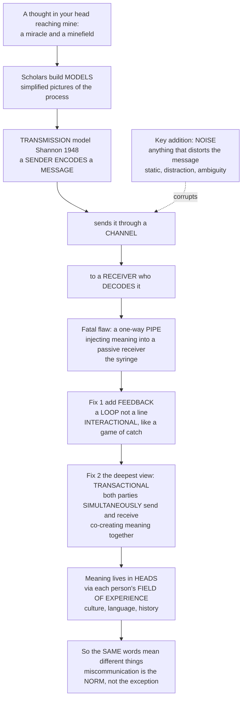

# 📡 Models of Communication

> [!abstract] TL;DR
> A communication model is a simplified picture of how meaning does — or fails to — pass between minds. The field evolved through three families: the **transmission (linear) model** (Shannon–Weaver, Lasswell) pictures a **sender** who **encodes** a **message**, sends it down a **channel** corrupted by **noise**, to a **receiver** who **decodes** it; the **interactional model** (Osgood–Schramm) adds **feedback**, making communication a two-way loop between people with overlapping **fields of experience**; and the **transactional model** (Barnlund) makes it **simultaneous and mutual** — people are concurrently senders and receivers **co-creating** meaning. The deep lesson underneath all three is that **meaning resides in people, not in messages**, which is why the same words mean different things to different minds and why miscommunication is the norm, not the exception.

---

## Intuition

**Analogy — how does a thought in *your* head end up in *mine*?** Communication feels effortless, but it is actually a small miracle and a permanent minefield: you have a private thought, and somehow, by pushing air past your teeth, you get a *version* of it to reappear inside my skull. Scholars built simple **models** to understand this everyday magic trick, and each captures a different truth.

The first and most famous model came from an *engineer*. Claude Shannon was working on telephone signals, and he pictured communication as a **pipeline**: a **sender encodes** a message and sends it through a **channel** to a **receiver** who **decodes** it. His brilliant addition was **noise** — anything that distorts the message on the way: static on the line, yes, but also distraction, ambiguity, and background chatter. This "sender → message → receiver" picture is intuitive and useful, and it still shapes how most people think about "getting your point across."

But it has a fatal flaw: it treats communication as a **one-way pipe** pushing information into a *passive* receiver — like a **syringe injecting meaning** straight into your head. Reality is messier. The next models fixed this by adding **feedback**: the receiver responds, so communication is a **loop, not a line** — a game of catch, thrown back and forth (the **interactional** model). But even that is not quite right, because it still implies people take *turns*. The deepest model, the **transactional** model, says communication is not sender-*then*-receiver but both people **simultaneously** sending and receiving, continuously **co-creating** meaning: you are nodding, frowning, and reacting *while* I speak, shaping what I say in real time.

And here is the crucial twist: **meaning does not live in the message.** It is constructed inside each person's head from their **field of experience** — their culture, language, and personal history. That is why the *same* words mean different things to different people, and why miscommunication is not a bug in the system but its default state. Understanding these models is understanding the surprisingly deep machinery behind the ordinary act of "making yourself understood" — and why it so reliably fails.

---

## How It Works

Communication models get progressively more honest about the messiness of real exchange: a **line** becomes a **loop** becomes a **shared field**. The flow below traces that story — from the engineer's pipeline, through its fatal flaw, to feedback and finally to simultaneous co-creation.



**Reading the diagram:** each downward step is a *correction* of the step above. The transmission model is not wrong so much as *incomplete* — it perfectly describes a fax machine and badly describes a conversation. Feedback turns the arrow into a cycle; simultaneity dissolves the sender/receiver roles entirely; and the field of experience relocates meaning from the wire into the two minds at its ends.

---

## Key Concepts

### Secondary Level

- **A model is a simplified map.** It strips communication down to its essential parts — who, what, how, to whom — so we can reason about where it goes right and wrong. Like any map, it is useful *because* it leaves things out.
- **The sender–message–receiver picture.** The oldest intuition: one person has an idea, packages it into words (**encoding**), sends it, and another person unpacks it (**decoding**). This is the **transmission** or **linear** model.
- **Noise is anything that distorts the message.** Not just literal static — a bad phone line — but also a mumbled word, an unfamiliar term, a distracted listener, or a noisy café. Noise is why messages arrive garbled.
- **Feedback makes it a two-way street.** In real life the receiver responds — a nod, a puzzled look, a reply — and the sender adjusts. This turns a one-way line into a **loop** (the **interactional** model).
- **Meaning is in people, not words.** The same sentence ("I'm fine") can mean opposite things depending on tone, context, and who is speaking. Words are just triggers; the meaning is built inside each listener's head.

### Undergraduate Level

**The Shannon–Weaver model (1948).** Borrowed directly from telecommunications (see [[Information_Theory_Overview]]), it lays out six elements in a line:

| Element | Role |
|---------|------|
| **Information source** | Originates the message (the mind with the idea) |
| **Transmitter / encoder** | Converts the message into a signal (mouth, keyboard, camera) |
| **Message / signal** | The encoded content travelling through the channel |
| **Channel** | The medium carrying the signal (air, wire, fibre, paper) |
| **Noise source** | Corrupts the signal in transit |
| **Receiver / decoder → destination** | Reconstructs the signal into a message for the recipient's mind |

Warren Weaver, popularizing Shannon, distinguished three levels of communication problems: the **technical** (how accurately can the signal be transmitted?), the **semantic** (how precisely does the transmitted signal convey the intended meaning?), and the **effectiveness** (how well does the received meaning change conduct?). Correspondingly, communication scholars split **noise** into **technical/physical noise** (static, dropped packets, bad handwriting), **semantic noise** (jargon, ambiguity, mistranslation), and **psychological noise** (prejudice, emotion, inattention). The formal treatment of channels and noise lives in [[Discrete_Channels_and_the_Binary_Symmetric_Channel]].

**Redundancy and fidelity.** Shannon's cure for noise is **redundancy** — deliberately repeating or over-specifying so the message survives corruption ("Bravo–Alpha–Kilo–Echr… I mean B-A-K-E"). Human language is naturally ~50% redundant, which is why you can read txt wth vwls rmvd. This is exactly the trade Shannon formalized in the [[Channel_Capacity_and_the_Noisy_Channel_Theorem]]: add structured redundancy to buy reliability over a noisy channel.

**Lasswell's model (1948).** A verbal checklist for mass communication: *"Who says What in Which channel to Whom with what Effect."* Each clause names a field of study — communicator analysis, content analysis, media analysis, audience analysis, and effects analysis. Its virtue is simplicity; its vice is that it assumes a clear, one-directional effect and omits feedback and noise.

**The critique — the "transmission fallacy" and the conduit metaphor.** All linear models share a hidden assumption: that meaning is a *thing* the sender packs into a message and ships to a passive receiver, who simply unpacks it — the **conduit metaphor** (Reddy 1979). This underwrote the early "**hypodermic needle**" or "**magic bullet**" theory of media: inject a message into the public and produce a direct, uniform effect. Both the metaphor and the theory badly overstate the sender's control and understate the receiver's active role in making meaning.

**The interactional model (Osgood–Schramm, DeFleur).** Wilbur Schramm redrew the line as a **circle**: each party continuously **encodes, interprets, and decodes**, taking turns as sender and receiver, with **feedback** closing the loop. His key addition is the **field of experience** — communication succeeds only where the sender's and receiver's frames of reference (language, culture, knowledge) **overlap**. Where the fields do not overlap, the message cannot be decoded as intended. This model is still **turn-based**, however: it alternates the sender and receiver roles rather than merging them.

**The transactional model (Barnlund 1970).** The most realistic view: communication is **simultaneous, continuous, and mutual.** Participants are *concurrently* senders **and** receivers — you interpret my facial reactions to your words while you are still speaking. Meaning is **negotiated and co-created**, not transmitted; context (physical, cultural, relational) and noise are treated as integral, not add-ons. Communication becomes **constitutive**: it does not merely describe pre-existing relationships and realities — it *creates* them.

**Information vs meaning.** Shannon's "information" is a *measurable statistical* quantity — the resolution of uncertainty in bits (see [[Entropy_and_Information_Content]]) — and deliberately *excludes* semantics. Communication models are ultimately about **meaning**, which is *interpretation*, not signal. Conflating the two is the single most common error in reading these models.

### Graduate Level

**Watzlawick's axioms (Palo Alto school).** Watzlawick, Beavin, and Jackson (1967) reframed communication around interaction and relationship. Their most quoted axiom: **"One cannot not communicate."** In the presence of another, *all* behaviour — silence, posture, refusal to answer — is message-bearing. They further distinguished the **content** level (the literal information) from the **relationship** level (what the message says about the relationship between the parties, the *metacommunication*), and noted that communication can be **symmetrical** (mirroring, between equals) or **complementary** (differentiated, e.g., doctor–patient). These moves finish the job of dissolving the passive receiver.

**Carey's ritual vs transmission views.** James Carey (1975) argued the transmission model — communication as *sending information across space for control* — is only half the story, and a peculiarly modern, technological, American half. He counterposed a **ritual view**: communication as the **sharing, participation, and maintenance of a common culture across time** — a religious service, a shared newspaper-reading, a national ritual. Under the ritual view, we read the morning news not (only) to acquire information but to participate in a communal drama that confirms a shared world. This is the "**communication as culture**" reframe: models are not just about transferring bits but about **constructing and maintaining reality**.

**Encoding/decoding and the active audience.** Stuart Hall's encoding/decoding model (developed in the vault's [[The_Reader_and_Reception]] tradition and the sibling *Encoding_Decoding_and_Audience_Reception*) is the natural successor to the transactional turn: producers **encode** meaning within a **dominant** code, but audiences **decode** it from their own social position — accepting the **preferred reading**, taking a **negotiated** one, or mounting an **oppositional** one. Meaning is a site of struggle, not a delivered package. This is the theoretical death of the hypodermic needle.

**Why meaning resides in people (the semiotic grounding).** Because a **sign** only relates to its **object** through an **interpretant** in a mind (Peirce), the *same* signal is necessarily decoded differently by minds carrying different codes and experiences. Pragmatics makes the same point empirically: hearers routinely recover more than, and different content from, what a sentence literally encodes (see [[Pragmatics_and_Speech_Acts]] and [[Semantic_Theory]]). "Meaning is in people, not messages" is therefore not a slogan but a structural consequence of how signs and interpretation work.

**Limits for networked, many-to-many communication.** All three classical families model **one-to-one** (interpersonal) or **one-to-many** (mass) flows. Digital and social media are **many-to-many, networked, and recombinant**: messages are forwarded, remixed, algorithmically ranked, and stripped of context ("context collapse"). Feedback is quantified (likes, shares, view counts) and fed back into the *production* of messages; noise now includes algorithmic filtering and coordinated manipulation. Network and information-cascade models increasingly supplement — rather than replace — the sender/receiver framework for these settings, an important qualification when analysing platforms and virality.

---

## Python Demo

Three panels, one per model family. **(a) Transmission model** — noise degrades a message's fidelity, and **redundancy** (a repetition code decoded by majority vote — exactly Shannon's trick) restores reliability. **(b) Interactional / field-of-experience** — the probability of correct interpretation rises with the **overlap** between the sender's and receiver's frames of reference, and longer messages need *more* overlap. **(c) Transactional** — a one-shot transmission stays stuck at a low level of shared understanding, while **feedback** loops converge on it, the transactional (continuous) exchange fastest of all.

```python
# Models of communication, quantified.
# (a) Transmission: noise vs fidelity, and how redundancy restores it (a la Shannon).
# (b) Interactional: correct interpretation vs field-of-experience overlap.
# (c) Transactional: shared understanding converging via feedback vs one-shot.
import numpy as np
import matplotlib.pyplot as plt
from math import comb

rng = np.random.default_rng(0)

# ----------------------------------------------------------------------
# (a) TRANSMISSION MODEL: noise, fidelity, and redundancy
# ----------------------------------------------------------------------
# A message is MSG_BITS bits sent over a binary symmetric channel that flips
# each transmitted bit with probability p (the "noise" level). A repetition
# code of odd length n sends each bit n times; the receiver takes a MAJORITY
# vote. Redundancy n = 1 is the naive one-shot transmission.
def bit_success(p, n):
    """P(a single message bit decoded correctly) under an n-repetition majority vote."""
    # correct iff fewer than n/2 of the n copies flip
    thresh = n // 2
    return sum(comb(n, k) * p**k * (1 - p)**(n - k) for k in range(thresh + 1))

MSG_BITS = 20
p_noise = np.linspace(0.0, 0.5, 100)          # channel noise level
redundancies = [1, 3, 5, 7]                    # 1 = no redundancy

# Whole-message fidelity = P(every bit correct) = bit_success ** MSG_BITS
msg_fidelity = {
    n: np.array([bit_success(p, n) for p in p_noise]) ** MSG_BITS
    for n in redundancies
}

# ----------------------------------------------------------------------
# (b) INTERACTIONAL MODEL: field-of-experience overlap
# ----------------------------------------------------------------------
# A message uses K concepts. A concept lands in the receiver's frame with
# probability = overlap o; if it does, it is understood; if not, it is
# guessed correctly only with baseline b. Whole-message understanding needs
# ALL K concepts to land -> (o + (1-o)*b) ** K. Bigger K demands more overlap.
overlap = np.linspace(0.0, 1.0, 100)
baseline = 0.10                                # chance of an accidental correct read
concept_counts = [1, 3, 10]
understanding = {
    K: (overlap + (1 - overlap) * baseline) ** K
    for K in concept_counts
}

# ----------------------------------------------------------------------
# (c) TRANSACTIONAL MODEL: feedback convergence on shared meaning
# ----------------------------------------------------------------------
# Intended meaning = 1.0. Receiver understanding U starts at U0 < 1 (an
# imperfect first decode). Each feedback round closes the gap by gain g,
# with a little residual noise. Transmission = no feedback (g = 0, flat).
# Interactional = turn-based feedback (moderate g). Transactional =
# simultaneous, continuous feedback (higher effective g -> fastest convergence).
rounds = np.arange(0, 12)
U0 = 0.40
def converge(g, noise_sd):
    U = np.empty(len(rounds)); U[0] = U0
    for t in range(1, len(rounds)):
        step = g * (1 - U[t - 1]) + rng.normal(0, noise_sd)
        U[t] = np.clip(U[t - 1] + step, 0, 1)
    return U

traj_transmission  = np.full(len(rounds), U0)          # one-shot, no feedback
traj_interactional = converge(g=0.35, noise_sd=0.02)   # turn-based feedback
traj_transactional = converge(g=0.60, noise_sd=0.02)   # continuous, simultaneous

# ----------------------------------------------------------------------
# Plot
# ----------------------------------------------------------------------
fig, ax = plt.subplots(1, 3, figsize=(18, 5.2))

# (a)
for n in redundancies:
    lbl = "no redundancy (n=1)" if n == 1 else f"repetition code n={n}"
    ax[0].plot(p_noise, msg_fidelity[n], lw=2, label=lbl)
ax[0].set_title("(a) Transmission model\nNoise degrades fidelity; redundancy restores it",
                fontsize=11, fontweight="bold")
ax[0].set_xlabel("Channel noise level  p  (bit-flip probability)")
ax[0].set_ylabel(f"P(entire {MSG_BITS}-bit message correct)")
ax[0].legend(fontsize=9); ax[0].grid(alpha=0.3)

# (b)
for K in concept_counts:
    ax[1].plot(overlap, understanding[K], lw=2, label=f"message of {K} concept(s)")
ax[1].set_title("(b) Interactional model\nUnderstanding rises with field-of-experience overlap",
                fontsize=11, fontweight="bold")
ax[1].set_xlabel("Overlap of sender & receiver frames  (field of experience)")
ax[1].set_ylabel("P(message interpreted as intended)")
ax[1].legend(fontsize=9); ax[1].grid(alpha=0.3)

# (c)
ax[2].plot(rounds, traj_transmission,  "o--", lw=2, label="Transmission (one-shot, no feedback)")
ax[2].plot(rounds, traj_interactional, "s-",  lw=2, label="Interactional (turn-based feedback)")
ax[2].plot(rounds, traj_transactional, "^-",  lw=2, label="Transactional (continuous feedback)")
ax[2].axhline(1.0, color="gray", ls=":", label="shared meaning achieved")
ax[2].set_title("(c) Transactional model\nFeedback converges on co-created meaning",
                fontsize=11, fontweight="bold")
ax[2].set_xlabel("Exchange round")
ax[2].set_ylabel("Shared understanding  (0 = talking past, 1 = aligned)")
ax[2].set_ylim(0, 1.05); ax[2].legend(fontsize=9); ax[2].grid(alpha=0.3)

plt.suptitle("Three Models of Communication, Quantified", fontsize=13, fontweight="bold")
plt.tight_layout()
plt.savefig("models_of_communication.png", dpi=150, bbox_inches="tight")
plt.show()

# ----------------------------------------------------------------------
# Key printed takeaways
# ----------------------------------------------------------------------
p_demo = 0.15
print("(a) At noise p = 0.15, whole-message fidelity:")
for n in redundancies:
    print(f"    redundancy n={n}: {bit_success(p_demo, n)**MSG_BITS:.3f}")
print("    -> redundancy buys reliability back from noise (Shannon's trick).\n")

print("(b) At overlap = 0.5, probability the whole message is understood:")
for K in concept_counts:
    print(f"    {K:2d} concept(s): {(0.5 + 0.5*baseline)**K:.3f}")
print("    -> the SAME half-shared message is understood far less as it grows.\n")

print("(c) Shared understanding after 11 rounds:")
print(f"    transmission (one-shot): {traj_transmission[-1]:.3f}")
print(f"    interactional          : {traj_interactional[-1]:.3f}")
print(f"    transactional          : {traj_transactional[-1]:.3f}")
print("    -> only feedback converges on co-created meaning; the pipe stays stuck.")
```

**What you see:**

- **(a)** With no redundancy, whole-message fidelity **collapses** as soon as noise appears (20 bits give noise 20 chances to strike). Adding a repetition code (n = 3, 5, 7) pushes the reliability curve up and to the right — *structured redundancy buys reliability back from noise*, which is precisely the transmission model's insight and Shannon's theorem in miniature.
- **(b)** Understanding rises with the **overlap** of the two fields of experience, and a longer message (more concepts) demands *far* more overlap to survive intact. At only 50% shared frame, a 10-concept message is understood barely a fifth of the time — a numerical picture of why strangers, experts talking to novices, or cross-cultural exchanges "talk past" each other.
- **(c)** The one-shot **transmission** trajectory is flat: fire the message once and hope. **Feedback** loops climb toward full shared understanding, and the **transactional** (continuous, simultaneous) exchange converges fastest — meaning is *built up over rounds*, not delivered in one shot.

---

## Real-World Applications

> **Interpersonal and organizational communication.** Managers are trained to "close the loop" — solicit feedback, paraphrase back ("so what I'm hearing is…"), and reduce semantic and psychological noise — because the interactional and transactional models predict that a one-way memo (transmission) reliably under-communicates. Active listening, clarifying questions, and confirmation are the field-of-experience overlap being deliberately widened in real time.

> **Mass media and the evolution of feedback.** Early mass communication was near-pure transmission: a broadcaster to a passive audience, with feedback limited to slow, sparse letters and ratings. Digital media collapsed that latency — comments, likes, shares, and analytics are instantaneous, quantified feedback that flows *back into* what gets produced next. The shift from "audience as target" to "audience as co-producer" is exactly the transmission-to-transactional move, now industrialized by recommendation algorithms.

> **Human–computer and voice interfaces.** Designing Siri, Alexa, or a chatbot forces the transmission model's limits into the open: parsing the words correctly (technical + semantic decoding) is not enough if the system misses the *illocutionary force* or the user's field of experience. Good conversational UX explicitly engineers feedback ("Did you mean…?", confirmations, error recovery) — building an interactional loop rather than a one-shot pipe.

> **Reliable machine communication.** The literal engineering descendants of the transmission model — error-correcting codes in Wi-Fi, 5G, QR codes, deep-space probes, and SSDs — apply redundancy to defeat noise exactly as panel (a) shows, governed by the [[Channel_Capacity_and_the_Noisy_Channel_Theorem]]. The everyday-communication and the telecommunications senses of "noise" and "redundancy" are the *same idea* at different scales.

> **Crisis and health communication.** Public-health messaging failures are usually *not* technical (the message reached people) but **semantic and field-of-experience** failures: the same words ("herd immunity," "viral load") decode differently across communities with different frames. Effective risk communication treats miscommunication as the default, pre-tests messages against target audiences' fields of experience, and builds in feedback channels — a direct application of the interactional and transactional critiques of the hypodermic needle.

---

## Common Pitfalls

- **Treating the transmission model as *the* model.** Its pipeline picture is so intuitive that people forget it is a *special case* — accurate for fax machines and telemetry, misleading for conversation. Defaulting to "I sent the message, so I communicated" is the conduit-metaphor trap: sending is not the same as being understood.
- **Confusing information with meaning.** Shannon's information is a statistical quantity that *excludes* semantics (see [[Entropy_and_Information_Content]]); communication models are about *interpretation*. A perfectly transmitted signal can be perfectly misunderstood. Do not import Shannon's "the message got through" as "the meaning got through."
- **Assuming feedback alone makes it transactional.** Feedback upgrades the linear model to the **interactional** model, but that is still *turn-based*. The transactional insight is **simultaneity** — both parties sending and receiving at once and co-creating meaning. Ping-pong is not the same as a shared dance.
- **Believing a message has one true meaning.** Because meaning resides in people and their fields of experience, "what the message *really* means" is under-defined. There is the encoder's intended meaning, the signal, and each decoder's constructed meaning — treating these as identical guarantees blaming the receiver ("you misread it") for structurally normal divergence.
- **Thinking more channels or louder signals cure noise.** Redundancy helps against *technical* noise (panel a), but **semantic** and **psychological** noise are not fixed by repetition or volume — repeating jargon louder does not close a field-of-experience gap. Diagnose *which kind* of noise before "fixing" it.
- **Reading the models as competitors rather than lenses.** Transmission, interactional, and transactional are not a tournament with one winner; they are increasingly rich lenses, each apt for different situations (telemetry vs a negotiation vs a networked feed). Carey's ritual view is a *further* lens, not a refutation. Pick the model that fits the phenomenon.

---

## Related Concepts

This note is the entry point for the vault's *01 Foundations of Communication* section; its siblings — *Media_and_Communication_Studies_Overview*, *Signs_Codes_and_Semiotics*, *Encoding_Decoding_and_Audience_Reception*, *Verbal_Nonverbal_and_Interpersonal_Communication*, and *Mass_Communication_and_Media_Effects* — extend the ideas introduced here into semiotics, reception, interpersonal channels, and effects.

- [[Information_Theory_Overview]] — the engineering source of the transmission model; Shannon's five-part communication system and the separation of information from meaning are the direct ancestors of the sender–channel–receiver picture.
- [[Discrete_Channels_and_the_Binary_Symmetric_Channel]] — the formal model of a channel corrupted by noise; the mathematical backbone of panel (a) and of "noise" as a technical concept.
- [[Channel_Capacity_and_the_Noisy_Channel_Theorem]] — proves that structured redundancy buys reliable communication over a noisy channel — the theorem behind the demo's repetition codes and the everyday notion of "saying it twice to be sure."
- [[Entropy_and_Information_Content]] — defines information as measurable surprise in bits, sharpening the crucial distinction between *information* (signal) and *meaning* (interpretation) that communication models turn on.
- [[Pragmatics_and_Speech_Acts]] — the linguistic proof that meaning resides in people: hearers routinely recover more than, and different content from, what a sentence literally encodes, exactly as the transactional model predicts.
- [[Semantic_Theory]] — how sentences encode literal, context-invariant meaning; the "message content" layer that the field of experience and context then transform into communicated meaning.
- [[Discourse_Analysis]] — extends models beyond single utterances to how meaning is co-constructed across turns and embedded in social context — the empirical study of the transactional loop in action.
- [[Classical_Rhetoric_and_Aristotle]] — arguably the *first* communication model (speaker → speech → audience, via ethos/pathos/logos); Lasswell's "with what effect" is the rhetorical concern with persuasion made into a component.
- [[Persuasion_and_Audience]] — Lasswell's effect clause and the "magic bullet" critique connect directly to how audiences actively resist, negotiate, or accept persuasive messages.
- [[The_Reader_and_Reception]] — the literary parallel to encoding/decoding: meaning is completed by an active reader, the death of the passive receiver in another discipline.
- [[Social_Cognition_and_Theory_of_Mind]] — the cognitive prerequisite for the transactional model: co-creating meaning requires each party to model the other's mental states in real time.
- [[Mental_Representation]] — the "field of experience" formalized as internal representations; why the same signal is decoded differently by minds carrying different representations.

---

## Review Questions

### Secondary

1. Draw the transmission (sender–message–receiver) model and label where **noise** enters. Give one example each of physical noise, semantic noise, and psychological noise from a normal school day.
2. Your friend texts "fine." Explain, using the idea that *meaning is in people, not messages*, how the same word could be reassuring in one situation and alarming in another.
3. What does adding **feedback** change about the transmission model, and why is a phone call usually clearer than a one-way announcement?

### Undergraduate

1. Shannon's model was built for telephone engineering. Identify two features of a real face-to-face conversation that the linear transmission model *cannot* capture, and explain how the interactional and transactional models each address one of them.
2. Distinguish the **interactional** model from the **transactional** model precisely. Feedback appears in both — so what exactly is the additional claim the transactional model makes, and why does it matter for analysing a heated argument versus an exchange of letters?
3. Explain the "**conduit metaphor**" and the "**hypodermic needle**" theory, and show how they are two expressions of the same underlying assumption. What evidence from audience-reception research undermines that assumption?

### Graduate

1. Carey contrasts a **transmission** view of communication with a **ritual** view. Take a concrete contemporary case — e.g., people compulsively refreshing a news feed during a crisis — and analyse it under *both* views. What does each lens reveal that the other misses, and is the ritual view a competitor to, or a complement of, the transactional model?
2. All three classical model families were built for one-to-one or one-to-many communication. Specify three properties of **networked, many-to-many** digital communication (e.g., context collapse, algorithmic ranking, quantified feedback) that strain the sender/receiver framework, and argue whether the transactional model can be *extended* to cover them or must be *supplemented* by network/cascade models.
3. "Meaning resides in people, not in messages" is presented as a slogan but has a structural justification. Using the sign–object–interpretant relation and evidence from pragmatics, construct the strongest argument that miscommunication is *structurally* the default state of communication rather than a failure of skill — then state the best objection to that argument.

---

## Sources

- Shannon, C. E., & Weaver, W. (1949). *The Mathematical Theory of Communication.* University of Illinois Press.
- Schramm, W. (Ed.) (1954). *The Process and Effects of Mass Communication.* University of Illinois Press.
- Carey, J. W. (1989). *Communication as Culture: Essays on Media and Society.* Unwin Hyman.
- Watzlawick, P., Beavin, J. H., & Jackson, D. D. (1967). *Pragmatics of Human Communication.* W. W. Norton.
- Lasswell, H. D. (1948). The structure and function of communication in society. In L. Bryson (Ed.), *The Communication of Ideas.* Harper & Row.

---

#media-studies #communication-models #shannon-weaver #transactional-model #noise
