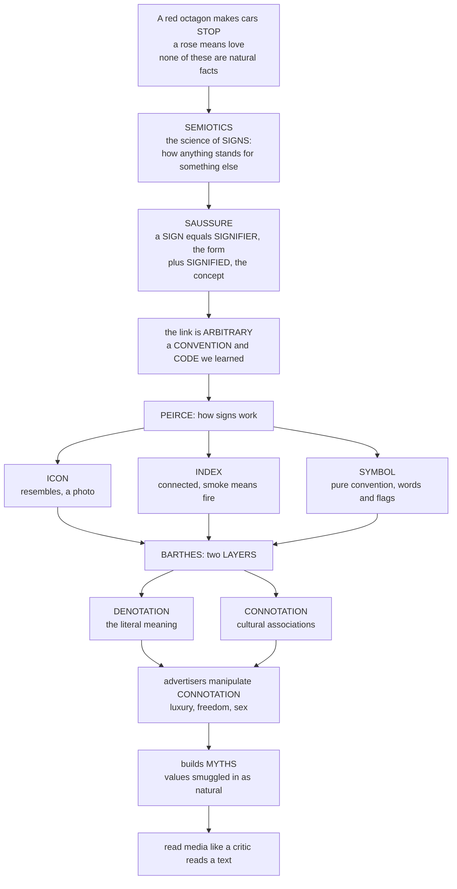

# 🚦 Signs, Codes, and Semiotics

> [!abstract] TL;DR
> **Semiotics** (Saussure's *semiology*) is the science of **signs** — the study of how anything (a word, an image, a color, a gesture, a logo) comes to *stand for* something else and carry meaning ("semiosis"). Saussure split the sign into an arbitrary **signifier** (the physical form) and a **signified** (the mental concept), showing that meaning is a learned social **code**, not a natural fact. Peirce sorted *how* signs signify into **icon** (resemblance), **index** (physical connection), and **symbol** (pure convention). Barthes gave media analysis its sharpest tool — the split between **denotation** (literal meaning) and **connotation** (cultural associations) — and showed how connotation hardens into **myth**, smuggling a culture's values and ideology in as though they were "natural." Together they form the essential toolkit for reading media and culture as *texts to be decoded*, and thus for seeing how meaning — and manipulation — actually work.

---

## Intuition

**Analogy — the red octagon and the rose.** How does a red octagon on a pole make two tons of steel come to a full halt? There is nothing in the physics of red, or of eight-sidedness, that *causes* stopping. And how does a single rose, handed across a table, say *I love you* — when a rose is just a flower, a reproductive organ of a shrub? Or how does a small fruit-shaped logo make you think *a trillion-dollar company* rather than *an apple*? None of these are natural facts. Yet you read the meaning instantly, unconsciously, without translating anything — because you have absorbed a **code**.

Semiotics is the discipline that makes that invisible reading visible. Its founding move (Saussure) is to see that a **sign** has two inseparable halves: the **signifier** — the material form, the sound "rose," the shape of the octagon — and the **signified** — the concept it triggers in your mind. The radical part is that the bond between them is **arbitrary**: there is no natural reason the sound "dog" means a dog (French says *chien*, German *Hund*). Meaning is a **convention** a community has agreed to and each of us has *learned*. This is exactly why media literacy matters: media are woven entirely out of codes we decode without noticing we are doing it.

The other founder (Peirce) adds a crucial question — *how* does a sign point? Some signs **resemble** what they mean (an **icon**: a photo, a portrait, a map). Some are **physically connected** to it (an **index**: smoke means fire, a footprint means a walker, a fever means infection). Some are **pure convention** (a **symbol**: words, flags, the red light). And the most powerful idea for reading media is Barthes' pair of **layers**: **denotation**, the flat literal meaning (*this is a photograph of a soldier saluting*), versus **connotation**, the deeper cultural charge it fires off (*patriotism, duty, national glory*). Advertisers, filmmakers, and propagandists are master manipulators of connotation: a product shot a certain way, in certain colors and light, silently whispers *luxury*, *freedom*, or *sex*. When those connotations set hard enough to feel like plain common sense, Barthes calls it **myth** — how a culture's values and power relations get smuggled into images that seem simply "natural." To learn semiotics is to learn to read media the way a critic reads a text: to see the code, and therefore to see how meaning is made and manipulated.

---

## How It Works

**Semiosis** is the process by which a signifier gets bound to a signified through a shared code, decoded by an interpreter, and — in media — layered with connotation until it hardens into myth.



### The mechanism, step by step

1. **A sign unites two halves (Saussure).** The *signifier* is the perceptible form; the *signified* is the concept. Critically, the signified is **not** the real-world object (the *referent*) — it is a mental concept. The sign is a two-sided coin, not a label stuck on a thing.
2. **The bond is arbitrary and relational.** Nothing links "tree" to trees except convention. Worse (and deeper): a sign has no positive content of its own — it means what it means only by **difference** from other signs. "Hot" carves out its meaning against "cold," "warm," "cool." Language is a **system of differences**; change the system and the value of every sign shifts.
3. **Signs signify in three ways (Peirce).** An **icon** works by resemblance, an **index** by physical or causal connection, a **symbol** by learned rule. Most real media signs are *mixtures* — a photograph in a news story is iconic (it looks like the scene), indexical (light really bounced off that event onto film), *and* symbolic (its framing and caption trigger conventional meanings).
4. **Codes make signs readable.** A **code** is the shared system of conventions — linguistic, visual, genre, dress, gestural — that lets a community pair signifiers with signifieds. You can only *decode* a message if you already share the code that *encoded* it. No shared code, no communication.
5. **Meaning stacks into layers (Barthes).** First-order **denotation** is the obvious, "what-is-literally-there" meaning. Second-order **connotation** loads the sign with cultural and emotional associations. When a connotation is so widely shared that it passes for nature — when the image *seems* to state a plain fact while actually asserting an ideology — it has become **myth**.
6. **Text steers image.** Barthes' **anchorage** (a caption that fixes which of an image's many possible meanings you take) and **relay** (words and image advancing a story together) show how media guide your decoding rather than leaving it free.

---

## Key Concepts

### Secondary (explain it to a beginner)
- **Sign** — anything that stands for something else and carries meaning to someone.
- **Signifier / signified** — the *form* of a sign (the word, the picture) versus the *idea* it triggers in your head.
- **Arbitrariness** — there is usually no natural reason a signifier means what it does; we *learned* the link. "Dog" and *chien* prove it.
- **Icon / index / symbol** — a sign that *looks like* its object (photo), is *connected to* it (smoke → fire), or means it *by convention* (a word, a flag).
- **Denotation vs connotation** — the literal meaning (a rose is a flower) versus the cultural feelings it fires off (love, romance).

### Undergraduate (needs some theory)
- **Semiotics vs semiology** — two founding traditions: Saussure's *dyadic*, linguistics-based **semiology** (signifier + signified) and Peirce's *triadic*, philosophy-based **semiotics** (representamen + object + **interpretant**, the effect the sign has on a mind).
- **Langue vs parole** — the shared abstract system of a language/code (*langue*) versus any individual concrete utterance (*parole*).
- **Value by difference** — a sign's meaning comes from its position in the whole system, not from a private link to a thing.
- **Encoding / decoding** — messages are *encoded* against a code by producers and *decoded* against it by audiences; mismatch of codes produces misreading.
- **Myth (Barthes)** — naturalized connotation; ideology dressed as common sense. His classic reading of a *Paris Match* cover of a Black soldier saluting the French flag: denotation = a soldier salutes; myth = *French imperiality is natural and colonized subjects love it*.
- **Anchorage and relay** — the two ways captions and text discipline the meaning of images.
- **Paradigm and syntagm** — the two axes of any media text: **paradigm** = the *selection* (which shot, which word, which color, chosen against alternatives) and **syntagm** = the *combination* (how the chosen elements are sequenced or arranged).

### Graduate (system-level and critical)
- **Social / multimodal semiotics (Kress & van Leeuwen)** — extends semiotics beyond language to a "grammar of visual design": vectors, gaze, framing, salience, modality, and the meaning-potential of layout, color, and typography across images, film, and interfaces.
- **Barthes' five codes** (*S/Z*) — hermeneutic, proairetic, semic, symbolic, and cultural/referential codes running simultaneously through every text; with the **Death of the Author**, meaning relocates from intention to the reader's decoding.
- **Intertextuality** — no sign or text means in isolation; every media text draws its meaning from the web of other texts it echoes, quotes, and parodies.
- **Ideology and hegemony** — semiotics as critique: because media are built entirely from learned codes decoded unconsciously, they can *naturalize* a dominant group's worldview; reading the code exposes how "obvious" meanings encode power.
- **The unstable signifier (post-structuralism)** — Derrida's critique that signifieds are never finally fixed; meaning is endlessly deferred (*différance*), so the neat signifier/signified coin is itself an idealization.
- **Peirce's unlimited semiosis** — each interpretant becomes a new sign to be interpreted, so meaning-making never terminates in a final "real" meaning.

---

## Python Demo

Three computational views of how signs make meaning: (A) connotation modeled as a **spreading-activation network** where one signifier lights up a cluster of learned associations; (B) the **arbitrariness** of the sign, where many unrelated signifiers across languages map to one signified; and (C) Peirce's **icon/index/symbol** trichotomy positioned by resemblance versus physical connection.

```python
# Semiotics, computationally: three views of how signs carry meaning.
#   Panel A  Denotation vs connotation as a SPREADING-ACTIVATION network
#            (one signifier ignites a web of learned associations).
#   Panel B  Arbitrariness of the sign (many signifiers -> one signified;
#            no natural link, only a convention a community must learn).
#   Panel C  Peirce's trichotomy: icon / index / symbol, placed by
#            resemblance-to-object vs physical/causal connection-to-object.
import numpy as np
import matplotlib.pyplot as plt

fig, (axA, axB, axC) = plt.subplots(1, 3, figsize=(18, 6))

# ---------------------------------------------------------------
# Panel A: SPREADING ACTIVATION -- "rose" -> web of connotations
# ---------------------------------------------------------------
axA.set_title("A. Denotation vs Connotation\n(spreading activation)", fontsize=11)
sx, sy = 0.12, 0.5          # signifier node
dx, dy = 0.40, 0.5          # denotation node
axA.scatter([sx], [sy], s=2600, c="#1f77b4", zorder=3)
axA.text(sx, sy, "signifier:\n'rose'", ha="center", va="center",
         color="white", fontsize=9, zorder=4)
axA.scatter([dx], [dy], s=2200, c="#2ca02c", zorder=3)
axA.text(dx, dy, "denotation:\na flower", ha="center", va="center",
         color="white", fontsize=8, zorder=4)
axA.plot([sx, dx], [sy, dy], color="#555555", lw=2, zorder=1)

# connotation concept -> activation strength (how strongly it is evoked)
connotations = {"love": 1.00, "romance": 0.92, "passion": 0.85,
                "Valentine": 0.80, "beauty": 0.70, "secrecy": 0.45}
labels = list(connotations.keys())
acts = np.array(list(connotations.values()))
angles = np.linspace(-0.9, 0.9, len(labels))
cxs = 0.80 + 0.05 * np.cos(angles)
cys = 0.5 + 0.42 * np.sin(angles)
for lab, a, cx, cy in zip(labels, acts, cxs, cys):
    axA.plot([dx, cx], [dy, cy], color="#d62728",
             lw=1 + 4 * a, alpha=0.30 + 0.55 * a, zorder=1)
    axA.scatter([cx], [cy], s=500 + 1600 * a,
                c=[[0.84, 0.15, 0.16, float(a)]], edgecolors="#d62728", zorder=3)
    axA.text(cx, cy, f"{lab}\n{a:.2f}", ha="center", va="center", fontsize=8, zorder=4)
axA.set_xlim(0, 1); axA.set_ylim(0, 1); axA.axis("off")

# ---------------------------------------------------------------
# Panel B: ARBITRARINESS -- many signifiers -> one signified
# ---------------------------------------------------------------
axB.set_title("B. Arbitrariness of the Sign\n(no natural link, only convention)", fontsize=11)
words = ["dog (EN)", "chien (FR)", "Hund (DE)", "perro (ES)",
         "inu (JP)", "sobaka (RU)", "kutta (HI)"]
mx, my = 0.5, 0.52
axB.scatter([mx], [my], s=5200, c="#9467bd", zorder=3)
axB.text(mx, my, "signified:\nthe CONCEPT\n'domestic dog'", ha="center",
         va="center", color="white", fontsize=9, zorder=4)
ang = np.linspace(0, 2 * np.pi, len(words), endpoint=False)
wx = mx + 0.37 * np.cos(ang)
wy = my + 0.35 * np.sin(ang)
for w, x, y in zip(words, wx, wy):
    axB.plot([mx, x], [my, y], color="#9467bd", ls="--", lw=1.5, alpha=0.6, zorder=1)
    axB.scatter([x], [y], s=1700, c="#ff7f0e", zorder=3)
    axB.text(x, y, w, ha="center", va="center", fontsize=8, zorder=4)
axB.text(0.5, 0.02, "same concept, unrelated sound-forms -> the link is learned",
         ha="center", va="center", fontsize=8, style="italic")
axB.set_xlim(0, 1); axB.set_ylim(0, 1); axB.axis("off")

# ---------------------------------------------------------------
# Panel C: PEIRCE'S TRICHOTOMY -- icon / index / symbol
# ---------------------------------------------------------------
# x = resemblance to object (iconicity); y = physical/causal connection (indexicality)
signs = {
    "photograph": (0.95, 0.55, "icon"), "portrait": (0.88, 0.12, "icon"),
    "map": (0.72, 0.18, "icon"), "onomatopoeia": (0.58, 0.10, "icon"),
    "smoke -> fire": (0.15, 0.95, "index"), "footprint": (0.25, 0.88, "index"),
    "fever": (0.10, 0.80, "index"), "pointing finger": (0.12, 0.68, "index"),
    "word 'tree'": (0.08, 0.08, "symbol"), "national flag": (0.14, 0.16, "symbol"),
    "red light": (0.10, 0.05, "symbol"), "dollar sign": (0.06, 0.12, "symbol"),
}
colors = {"icon": "#2ca02c", "index": "#d62728", "symbol": "#1f77b4"}
axC.set_title("C. Peirce's Trichotomy\nicon vs index vs symbol", fontsize=11)
seen = set()
for name, (x, y, kind) in signs.items():
    axC.scatter([x], [y], s=280, c=colors[kind], edgecolors="black", zorder=3,
                label=(kind if kind not in seen else None))
    seen.add(kind)
    axC.annotate(name, (x, y), textcoords="offset points", xytext=(6, 6), fontsize=7)
axC.axhline(0.4, color="gray", ls=":", lw=0.8)
axC.axvline(0.4, color="gray", ls=":", lw=0.8)
axC.text(0.03, 0.30, "SYMBOL\npure convention", fontsize=8, color="#1f77b4")
axC.text(0.66, 0.32, "ICON\nresemblance", fontsize=8, color="#2ca02c")
axC.text(0.03, 0.58, "INDEX\nconnection", fontsize=8, color="#d62728")
axC.set_xlabel("resemblance to the object  (iconicity)")
axC.set_ylabel("physical / causal connection  (indexicality)")
axC.set_xlim(-0.05, 1.12); axC.set_ylim(-0.05, 1.12)
axC.legend(loc="upper right", fontsize=8, title="sign type")

plt.tight_layout()
plt.savefig("semiotics_signs.png", dpi=120)
plt.show()
```

**What the plot shows.** Panel A visualizes *why a "simple" sign is never simple*: the signifier "rose" is bound to a thin denotation (a flower) but ignites a rich, weighted web of connotations — exactly the layer advertisers target. Panel B makes arbitrariness concrete: seven unrelated sound-forms all converge on one concept, so the link cannot be natural — it must be learned. Panel C operationalizes Peirce: signs sort into three zones by *how* they point, and most media images live on the boundaries, mixing iconic, indexical, and symbolic force at once.

---

## Real-World Applications

- **Advertising.** The canonical semiotic analyses are ad readings — Barthes' dissection of a **Panzani** pasta ad (the red/green/white and fresh vegetables connote *Italianicity*), and the **Marlboro cowboy**, whose lone rider and open range connote *rugged freedom and masculinity*, welding those values to a cigarette. Every ad is a machine for transferring connotation onto a product.
- **Branding and logos.** A logo is a **symbol** engineered to carry maximum connotation with minimum form — the swoosh, the bitten apple, the golden arches. Brand work is applied semiotics: choosing signifiers whose learned associations do the persuading.
- **Photojournalism and news images.** A news photo trades on its **indexical** authority ("this really happened") while its **framing, cropping, and caption** (anchorage) steer connotation. The same protest can read as *heroic uprising* or *dangerous mob* depending on the code invoked.
- **Film and television.** Lighting, color grading, shot scale, and mise-en-scène are visual codes; low-key lighting connotes menace, warm gold connotes nostalgia. Genre itself is a code the audience must share to decode.
- **Propaganda.** The deliberate construction of **myth** — making a contested ideology look like natural common sense through repeated, "obvious"-seeming imagery.
- **Fashion and everyday objects.** Barthes' *The Fashion System* reads clothing as a sign system; a suit, a wedding ring, a national costume all signify by convention, not utility.
- **UX and interface design.** Icons (trash can, floppy-disk "save"), affordance cues, and color codes (red = danger) are semiotic systems users must have learned to navigate a screen.

---

## Common Pitfalls

- **Mistaking the sign for the thing (map ≠ territory).** The signified is a *concept*, not the real-world referent. Treating a media image as reality itself — rather than as a coded representation *of* it — is the primary error semiotics exists to correct.
- **Assuming connotation is universal or natural.** Connotations are *code-dependent*: a color, gesture, or animal can mean opposite things in different cultures. Reading your own culturally-specific decoding as the sign's "true" meaning re-commits the very naturalization (myth) that critique should expose.
- **Semiotic paranoia / over-reading.** Because signs *can* mean, it is tempting to declare that every detail *does* mean, and mean intentionally. Rigor requires evidence that a code is actually shared and in play, not just an ingenious reading the analyst invented.
- **Collapsing Saussure and Peirce.** They are different models: Saussure is *dyadic* (signifier/signified) and excludes the referent; Peirce is *triadic* and adds the **interpretant**. Blurring them (e.g., calling the signified the "referent") muddles the analysis.
- **Assuming encoded meaning equals decoded meaning.** Producers encode a preferred reading, but audiences decode with their own codes — dominant, negotiated, or oppositional. Meaning is completed at reception, not fixed at transmission.
- **Ignoring the syntagm.** Fixating on individual signs (paradigm) while ignoring how they are *combined and sequenced* (syntagm) misses where much media meaning is actually manufactured — in juxtaposition, montage, and layout.

---

## Related Concepts

This note is the **media-analysis view** of semiotics; it deliberately links *to* the sign-theory notes elsewhere in the vault rather than duplicating them. Within this vault it sits beside the sibling foundations notes on the *Media and Communication Studies Overview*, *Models of Communication*, *Encoding, Decoding, and Audience Reception*, *Cultural Studies and Representation*, and *Ideology, Hegemony, and Media* — semiotics supplies the decoding toolkit those notes build on.

- [[Semiotics_and_Symbolic_Communication]] — the **anthropological** treatment of the same Saussure–Peirce–Barthes framework, extended to ritual, kinship, and everyday objects as culture.
- [[Iconography_and_Semiotics_of_Art]] — semiotics applied to images and paintings; Panofsky's three levels and the "grammar" of visual design; the closest art-history sibling.
- [[Semantic_Theory]] — the **linguistic** study of meaning (sense/reference, truth conditions, compositionality); the formal cousin to Saussure's account of how words mean.
- [[Structuralism_and_Narratology]] — Saussure's relational method applied to stories and texts (Propp, Greimas, Genette, Barthes' codes); shows semiotics scaling up from the sign to the whole narrative.
- [[Metaphor_Symbol_and_Imagery]] — literary symbolism, where a signifier is chosen precisely for its connotative charge.
- [[Intertextuality_and_Allusion]] — how texts and signs mean only against the web of other texts they echo.
- [[Art_and_Meaning]] — the broader aesthetic question of how artworks carry and communicate meaning at all.
- [[Intentionality_and_Mental_Content]] — the philosophy-of-mind account of "aboutness," the deeper puzzle of how any mental state or sign manages to be *about* something.

---

## Review Questions

**Secondary**
1. Using the example of a rose (or a red traffic light), explain what the **signifier** and the **signified** are, and why the link between them is called **arbitrary**.
2. Classify each of these as **icon**, **index**, or **symbol**, and say why: a passport photo; a knock at the door; the word "danger."

**Undergraduate**
3. A cosmetics ad photographs a perfume bottle in soft golden light beside white orchids. Distinguish its **denotation** from its **connotation**, and explain how the ad "sells" without stating a single claim.
4. What does Barthes mean by **myth**, and how does the concept turn semiotics from a descriptive method into a tool of ideological **critique**? Use a concrete media example.

**Graduate**
5. Saussure's model is *dyadic* and brackets the referent; Peirce's is *triadic* and centers the **interpretant**. What can Peirce's model explain about media signification (e.g., the authority of a news photograph) that Saussure's cannot, and what does Saussure capture that Peirce underplays?
6. Given the encoding/decoding gap and the post-structuralist claim that the signified is never finally fixed, is a "correct" reading of a media text possible? Argue for a position, using the notions of preferred, negotiated, and oppositional readings.

---

## Sources

- Ferdinand de Saussure, *Course in General Linguistics* (1916) — the foundational statement of the sign, arbitrariness, and value-by-difference.
- Roland Barthes, *Mythologies* (1957) — connotation, myth, and the classic close readings of ads, wrestling, and everyday objects.
- Roland Barthes, *Elements of Semiology* (1964) — the systematic vocabulary: denotation/connotation, langue/parole, syntagm/paradigm, anchorage/relay.
- Daniel Chandler, *Semiotics: The Basics* (3rd ed., 2017) — the standard modern introduction, including Peirce's trichotomy and the interpretant.
- Gunther Kress & Theo van Leeuwen, *Reading Images: The Grammar of Visual Design* (2nd ed., 2006) — social/multimodal semiotics for images and media.

---

#media-studies #semiotics #signs #denotation-connotation #codes
