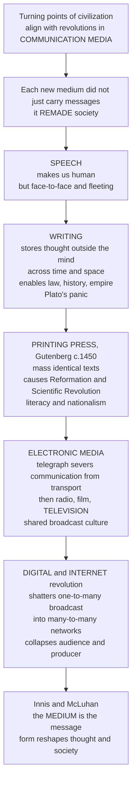

# 📜 The History of Media and Communication

> [!abstract] TL;DR
> The great turning points of human civilization line up almost exactly with revolutions in **communication media** — the technologies we use to store and transmit information. Speech made us human but was fleeting; **writing** stored thought outside the mind and enabled law, history, and empire; the **printing press** mass-produced identical texts and helped cause the Reformation, the Scientific Revolution, mass literacy, and nationalism; **electronic media** from the telegraph to television severed communication from transportation and built a shared broadcast culture; and the **digital revolution** is now shattering the one-to-many broadcast model into a many-to-many network that collapses the very distinction between audience and producer. The medium theorists (Innis, McLuhan, Ong) argued the provocative core lesson: **the medium is the message** — a medium's *form* reshapes how we think and how society is organized, independent of its content.

---

## Intuition

**Analogy:** Imagine trying to read the history of a civilization not from its kings and battles but from the machines in its libraries. Every time a new machine for storing and copying words appears — a clay tablet, a phonetic alphabet, a printing press, a telegraph key, a television, a smartphone — the entire society reorganizes itself around it, the way iron filings snap into a new pattern the instant you move the magnet. The words on the page barely change; the *machine that carries them* is what remakes the world.

That is the central, disorienting claim of media history. A medium is not a neutral pipe that delivers content untouched. Its physical form — whether it is fleeting or permanent, cheap or costly, one-to-many or many-to-many, portable across space or durable across time — quietly reshapes what can be remembered, who can speak, how power is held, and even how people think. When Plato worried that writing would ruin human memory, he was staging the very first "new media panic," and every generation since has restaged it: the novel, the telegraph, the radio, the television, the internet. Understanding media history means seeing our own disorienting digital moment not as unique, but as merely the latest turn in a very long sequence of medium revolutions.

---

## How It Works

### The core thesis

Human social change is deeply shaped by transformations in the technologies of storing and transmitting information. Each successive medium overcomes a limitation of the last — but in overcoming it, imposes a new *bias* (Innis's word) on the culture built around it. The pattern recurs: a new medium appears, elites panic, adoption accelerates, and within a generation the medium has quietly rewired memory, authority, and community. Trace the sequence and the story of civilization itself comes into focus.



### Reading the diagram

Each arrow is a *medium revolution*, not merely a new gadget. The vertical spine is a ratchet: writing does not replace speech, print does not replace writing, and digital does not replace broadcast — each new layer sits atop the old ones and refashions them (a process later theorists call **remediation**). The final node is the interpretive key: the sequence matters less for *what* was communicated at each stage than for *how the form itself* reorganized cognition, culture, and power.

---

## Key Concepts

### Secondary — the five media eras

The whole history can be held in mind as five great stages, each defined by what it could do that the previous one could not:

1. **Speech (orality).** The foundational human capacity. Knowledge lives only in memory and vanishes the instant it is spoken; communication is face-to-face and communal.
2. **Writing (c. 5,000+ years ago).** Thought is stored *outside* the mind and can travel across time and space — enabling records, law, history, and administration.
3. **Print (c. 1450).** Gutenberg's press mass-produces *identical* copies, cheaply — spreading literacy and ideas at unprecedented scale.
4. **Electronic / broadcast (c. 1840s onward).** The telegraph, then radio, film, and television move information faster than any person can travel and pipe the *same* images into millions of homes at once.
5. **Digital / networked (c. 1970s onward).** Computers, the internet, and smartphones turn the one-to-many broadcast into a many-to-many network where anyone can publish.

### Undergraduate — medium theory and the great revolutions

- **Medium theory / the Toronto School.** A tradition (Harold **Innis**, Marshall **McLuhan**, Walter **Ong**, later Joshua **Meyrowitz**) arguing that a medium's *form and materiality* — not just its content — shapes cognition, culture, and social organization. McLuhan compressed this into two slogans: **"the medium is the message"** (the scale and pattern a medium introduces into human affairs matters more than any single message it carries) and media as **"the extensions of man"** (each medium extends a human faculty — writing extends memory, the wheel the foot, electric media the nervous system).
- **Innis and the bias of communication.** Innis distinguished **time-binding** media (heavy, durable, hard to move — clay, stone, parchment — which favor tradition, hierarchy, and religion) from **space-binding** media (light, portable — papyrus, paper, print — which favor administration over distance, expansion, and empire). Every medium carries a *bias* toward controlling either time or space, and that bias tilts the society that depends on it.
- **Primary orality (Ong).** In cultures with no writing, thought must be *memorable* to survive, so knowledge is stored in formulas, rhythm, proverbs, and narrative; it is additive, situational, communal, and evanescent. Ong called the shift to writing "the technologizing of the word" — a reshaping of consciousness itself.
- **The writing revolution.** From cuneiform and hieroglyphs to the phonetic **alphabet**, writing externalized memory and made possible accumulation, abstraction, accounting, law codes, history, and bureaucracy. Scholars such as Jack Goody argued literacy restructured cognition (enabling lists, tables, and the syllogism). Plato's *Phaedrus* records the archetypal objection — that writing would weaken memory and give only the *appearance* of wisdom.
- **The print revolution.** Elizabeth **Eisenstein** ("*The Printing Press as an Agent of Change*") identified print's transformative powers: **preservation** (knowledge stops decaying with each recopy), **dissemination** (mass reach), and **comparison/correction** (competing editions side by side create a self-correcting knowledge system). Consequences: the Protestant Reformation (vernacular Bibles and viral pamphlets), the Scientific Revolution (fixed, shareable, cumulative data and diagrams), mass literacy, standardized vernaculars, private silent reading and the modern individual, newspapers and the public sphere, and — via Benedict Anderson — the **"imagined communities"** of print-capitalism that underwrite nationalism.
- **The electronic revolution.** James **Carey** highlighted the **telegraph** (the "Victorian internet") as the moment communication was, for the first time, *severed from transportation* — information could move faster than a person or a train. Photography, film, radio, and **television** then created **mass / broadcast** media: one-to-many, simultaneous, visual, building a shared national experience and, in McLuhan's phrase, a **"global village."**
- **The digital revolution.** Computing, the internet and Web, mobile devices, and social media shifted the structure from **one-to-many broadcast** to **many-to-many networked** communication, with **digitization and convergence** collapsing the once-separate worlds of mass media and interpersonal media, and of producer and consumer.

### Graduate — the debates and cross-cutting patterns

- **Technological determinism vs the social shaping of technology.** The sharpest critique of medium theory is that it can slide into **technological determinism** — treating media as autonomous forces that *drive* history. The opposing school (**Social Construction of Technology / SST**, e.g. Bijker, MacKenzie, Raymond Williams) insists media are themselves *shaped by* social, economic, and political choices; the telegraph and television could have developed very differently. The mature position treats media and society as **co-evolving**, each conditioning the other.
- **Remediation (Bolter and Grusin).** New media rarely erase old ones; they *refashion* them — the webpage remediates the newspaper, the podcast the radio show, streaming the cinema. History is layered, not linear.
- **Media panics as a recurring structure.** From Plato on writing, to eighteenth-century fears of the novel, to twentieth-century panics over comic books, television, and video games, to today's anxieties about smartphones and AI, each new medium provokes a predictable **moral panic**. Recognizing the pattern is itself a form of historical perspective on the present.
- **The erosion of place (Meyrowitz).** In "*No Sense of Place*," Joshua Meyrowitz argued electronic media dissolve the link between physical location and social "situation," reshaping authority, childhood, and gender roles by exposing backstage behaviors to everyone.
- **Convergence culture (Jenkins).** In the digital era, the collapse of the audience/producer distinction produces participatory, cross-platform "convergence," where amateurs and institutions co-create meaning.

---

## Python Demo

```python
# Media history in two views:
#   (1) the ACCELERATION of media revolutions and their adoption speed
#   (2) the structural shift from ONE-TO-MANY BROADCAST to MANY-TO-MANY NETWORK
import numpy as np
import matplotlib.pyplot as plt

rng = np.random.default_rng(7)
fig, ax = plt.subplots(2, 2, figsize=(13, 9))

# ---- (1a) Gaps between successive media revolutions shrink dramatically ----
media = ["Speech", "Writing", "Alphabet", "Printing", "Telegraph", "Photography",
         "Telephone", "Film", "Radio", "Television", "Internet", "Web",
         "Social media", "Smartphone", "Generative AI"]
year = np.array([-100000, -5000, -3000, 1450, 1837, 1839, 1876, 1895,
                 1906, 1927, 1969, 1991, 2004, 2007, 2022], dtype=float)
gap = np.diff(year)                       # years between one revolution and the next
ax[0, 0].plot(range(1, len(media)), gap, "o-", color="#7c3aed", lw=2)
ax[0, 0].set_yscale("log")
ax[0, 0].set_xticks(range(1, len(media)))
ax[0, 0].set_xticklabels(media[1:], rotation=60, ha="right", fontsize=7)
ax[0, 0].set_ylabel("Years since previous revolution (log)")
ax[0, 0].set_title("Media revolutions are accelerating")
ax[0, 0].grid(True, which="both", alpha=0.3)

# ---- (1b) Time for each medium to reach mass adoption keeps shrinking ----
ad_media = ["Print book", "Newspaper", "Telephone", "Radio",
            "Television", "Internet/Web", "Smartphone", "Social media"]
ad_years = np.array([200, 100, 75, 38, 13, 7, 4, 3], dtype=float)  # illustrative
colors = plt.cm.viridis(np.linspace(0, 0.9, len(ad_media)))
ax[0, 1].bar(ad_media, ad_years, color=colors)
ax[0, 1].set_ylabel("Approx. years to mass adoption")
ax[0, 1].set_title("Each new medium spreads faster")
ax[0, 1].set_xticklabels(ad_media, rotation=60, ha="right", fontsize=7)
ax[0, 1].grid(True, axis="y", alpha=0.3)

# ---- (2a) BROADCAST: one hub -> a passive mass audience (star / one-to-many) ----
n = 12
theta = np.linspace(0, 2 * np.pi, n, endpoint=False)
rx, ry = np.cos(theta), np.sin(theta)
for x, y in zip(rx, ry):
    ax[1, 0].plot([0, x], [0, y], color="#94a3b8", lw=1, zorder=1)
ax[1, 0].scatter(rx, ry, s=140, color="#2563eb", zorder=2, label="Passive audience")
ax[1, 0].scatter([0], [0], s=420, color="#dc2626", zorder=3, label="Producer / hub")
ax[1, 0].set_title("One-to-many BROADCAST (star)")
ax[1, 0].legend(loc="upper right", fontsize=7)
ax[1, 0].set_aspect("equal"); ax[1, 0].axis("off")

# ---- (2b) NETWORK: everyone a node, producer AND receiver (mesh / many-to-many) ----
m = 12
th = np.linspace(0, 2 * np.pi, m, endpoint=False)
nx, ny = np.cos(th), np.sin(th)
edges = 0
for i in range(m):
    for j in range(i + 1, m):
        if rng.random() < 0.35:          # sparse random peer-to-peer links
            ax[1, 1].plot([nx[i], nx[j]], [ny[i], ny[j]],
                          color="#94a3b8", lw=0.8, alpha=0.7, zorder=1)
            edges += 1
ax[1, 1].scatter(nx, ny, s=200, color="#059669", zorder=2,
                 label="Node = producer AND receiver")
ax[1, 1].set_title(f"Many-to-many NETWORK (mesh, {edges} links)")
ax[1, 1].legend(loc="upper right", fontsize=7)
ax[1, 1].set_aspect("equal"); ax[1, 1].axis("off")

fig.suptitle("The History of Media: acceleration + the broadcast-to-network shift",
             fontsize=13, weight="bold")
fig.tight_layout()
plt.savefig("media_history.png", dpi=120)
print(f"Oldest gap: {gap.max():,.0f} yrs  |  Newest gap: {gap.min():,.0f} yrs")
print(f"Broadcast: 1 producer -> {n} receivers   Network: {edges} peer links among {m} nodes")
```

Running this prints the collapse from a ~95,000-year gap (speech to writing) down to a handful of years between the latest revolutions, and contrasts a single-hub broadcast star against a dense peer-to-peer mesh — the structural signature of the digital turn.

---

## Real-World Applications

- **Understanding the internet as history rhyming.** Media history reframes the internet's disruption of newspapers, TV, and record labels as a replay of print's disruption of the scribal Church monopoly. The same three-part pattern recurs: a broadcast gatekeeper loses control as a cheaper, faster, more distributed medium routes around it.
- **Diagnosing "media panics."** Editors, educators, and policymakers use the recurring-panic pattern (Plato → novels → radio → TV → social media → AI) to separate genuine harms from reflexive moral panic when evaluating a new technology.
- **Platform and product design.** Recognizing the shift from one-to-many to many-to-many explains why platforms like YouTube, TikTok, Substack, and Wikipedia succeeded by *collapsing* the producer/consumer distinction — turning the former audience into the supply of content.
- **Nation-building and propaganda analysis.** Anderson's print-capitalism thesis and the broadcast era's shared-culture effect give analysts a framework for how mass media forge (and fracture) national identity — from vernacular newspapers to state radio to fragmented social feeds.
- **Digital-preservation strategy.** Innis's time-bias vs space-bias distinction is a live concern for archivists: digital media are extraordinarily space-binding (instant global reach) but alarmingly *time-fragile* (bit rot, format obsolescence, dead links), inverting the durability of clay and stone.

---

## Common Pitfalls

- **Technological determinism** — Treating media as autonomous forces that single-handedly "cause" the Reformation or the Arab Spring. The disciplined view is co-evolutionary: media enable and constrain, but economics, politics, and social choices shape which possibilities are realized. Print did not *require* Luther; it made a Luther possible at scale.
- **Reading history as a clean replacement sequence** — Assuming print killed writing or TV killed radio. New media *remediate* old ones; speech, writing, print, and broadcast all persist inside the digital layer. History is cumulative, not a relay race.
- **Presentism and chronological snobbery** — Believing our digital disruption is unprecedented. Every prior medium felt equally world-ending to its contemporaries; the telegraph and printing press provoked panics fully as intense as those around AI today.
- **Confusing content with medium** — Debating only *what* a medium carries (violence on TV, misinformation online) while ignoring McLuhan's point that the medium's *form* — its pace, scale, and structure — may reshape society more than any message it delivers.
- **Eurocentric origin stories** — Crediting Gutenberg with "inventing printing." Woodblock printing and movable type existed in East Asia centuries earlier; Gutenberg engineered a *practical integrated system* suited to the alphabet, not the bare idea.

---

## Related Concepts

**Within this vault (planned siblings, referenced in prose):** this note is the historical spine of *Media and Communication Studies Overview*; the broadcast-to-network shift is formalized in *Models of Communication* and *Mass Communication and Media Effects*; print's role in the public sphere is developed in *Media and Democracy: the Public Sphere*; and the final medium revolution is the subject of *The Digital Revolution and New Media*.

**Cross-vault (Glob-verified):**

- [[The_Printing_Revolution]] — the History-vault deep dive on Gutenberg, Eisenstein, and the print cascade that this note treats as one stage in a longer sequence.
- [[Cuneiform_and_the_Code_of_Hammurabi]] — the writing revolution in action: externalized memory turned into law codes, administration, and empire.
- [[The_Scientific_Revolution_Overview]] — how print's fixed, shareable, correctable texts made cumulative science possible.
- [[Science_Technology_and_Society]] — the technological-determinism vs social-shaping debate that is the key caveat to medium theory.
- [[The_Computing_and_Information_Revolution]] — the deep history behind the digital/networked stage of media.
- [[The_Information_Age]] — the broader socio-economic transformation the digital media revolution sits within.
- [[Language_Evolution_and_Origins]] — the origins of the very first medium, speech, that all later media extend.
- [[Language_and_Linguistics_Overview]] — the study of language, the substrate every communication medium encodes.

---

## Review Questions

1. **(Secondary)** Name the five great eras of communication media in order, and for each state the one thing it could do that the previous era could not.
2. **(Secondary)** What did Plato worry writing would do, and why is his worry called the first "media panic"?
3. **(Undergraduate)** Explain McLuhan's slogan "the medium is the message." Give one concrete example where the *form* of a medium mattered more for society than the specific content it carried.
4. **(Undergraduate)** Using Innis's distinction between time-binding and space-binding media, classify clay tablets, papyrus, and the printing press, and explain how each bias tilts the society that relies on it.
5. **(Undergraduate → scenario)** The telegraph is said to have "severed communication from transportation." What exactly changed, and why did Carey consider this a turning point comparable to print?
6. **(Graduate)** A critic says medium theory is "technological determinism in disguise." Reconstruct the strongest version of that objection, then defend a co-evolutionary account using a specific medium as evidence.
7. **(Graduate — trade-off)** Digital media are intensely space-binding but time-fragile. What does this inversion of durability imply for cultural memory over the next century, compared with the parchment-and-stone record of earlier civilizations?

---

## Sources

- McLuhan, M. (1964). *Understanding Media: The Extensions of Man*. McGraw-Hill.
- Innis, H. A. (1951). *The Bias of Communication*. University of Toronto Press.
- Eisenstein, E. (1979). *The Printing Press as an Agent of Change*. Cambridge University Press.
- Ong, W. J. (1982). *Orality and Literacy: The Technologizing of the Word*. Methuen.
- Carey, J. W. (1989). *Communication as Culture: Essays on Media and Society*. Unwin Hyman.

---

#media-studies #media-history #printing-press #medium-theory #mcluhan
