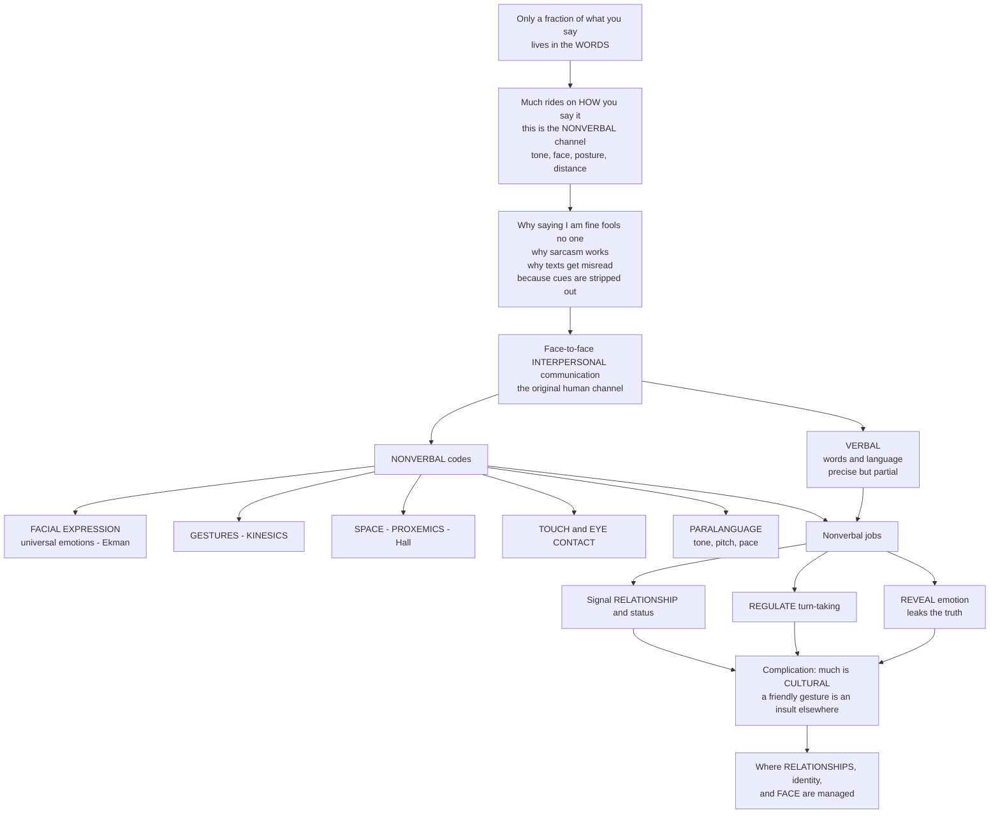

# 🗣️ Verbal, Nonverbal, and Interpersonal Communication

> [!abstract] TL;DR
> Interpersonal communication — the face-to-face exchange between people — is the original and most fundamental human channel, from which all media derive. Only a fraction of any message lives in the **words** (the verbal channel); a huge share rides on **how** they are said — tone, face, posture, eye contact, and distance (the **nonverbal** channel). The nonverbal system reveals emotion, regulates turn-taking, and signals relationships, yet much of it is culturally specific, which is why "I'm fine" fools no one, why sarcasm works by pitting words against tone, and why cue-stripped text messages are so easily misread.

---

## Intuition

**Analogy:** Think of a conversation as a song, not a transcript. The **lyrics** are the words — precise and quotable — but the **melody, tempo, and volume** carry the feeling. You can sing "I'm fine" with a bright rising melody and mean it, or drag it out flat and low so everyone in the room knows you are not fine at all. The lyrics are identical; the music tells the truth. That "music of speech" plus the face, the hands, the posture, and the distance between two people is the **nonverbal channel** — and it usually wins.

This is why **sarcasm** exists: the words say one thing and the tone says the opposite, and we believe the tone. It is why a **text message** is so easy to misread — stripping out the melody leaves only ambiguous lyrics. And it is why psychologists say emotion "leaks": you can control your words far more easily than your micro-expressions. Communication scholars study this rich, layered process of **interpersonal communication** — the foundational human connection where we do not merely trade information but build relationships, manage identity, and protect our public self-image, or **face**.

---

## How It Works

### Core mechanics

1. **Two channels, unequal loads.** The **verbal** channel is words, grammar, and meaning — powerful for abstraction, precision, and *displacement* (talking about what is absent or hypothetical), but only part of the message. The **nonverbal** channel runs in parallel and carries most of the emotional and relational content.
2. **Nonverbal codes.** *Kinesics* (gesture, posture, body movement), *facial expression* (Ekman's basic emotions appear broadly universal; micro-expressions leak concealed feeling), *oculesics* (eye contact, gaze, attention), *proxemics* (Hall's use of space — intimate, personal, social, public zones), *haptics* (touch), *paralanguage / vocalics* (tone, pitch, pace, volume, pauses), and *chronemics* (use of time), plus appearance and environment.
3. **Nonverbal functions.** These cues *reveal* emotion (often more truthfully than words), *regulate* interaction (turn-taking, feedback, backchannels), *define* relationships (intimacy, liking, dominance), and interact with the verbal by complementing, accenting, substituting for, or **contradicting** it — and when verbal and nonverbal conflict, receivers usually trust the nonverbal.
4. **Culture is baked in.** Most nonverbal codes are learned, not universal: a friendly gesture in one country is an obscene insult in another, eye contact signals respect in the West but can signal disrespect in parts of Asia, and personal-space bubbles differ dramatically. Hall's **high-context vs low-context** distinction predicts how much meaning rides on the unstated.
5. **Relationships and face.** Interpersonal communication is where relationships form (self-disclosure) and identity is managed. Goffman's **dramaturgy** frames every interaction as a performance with a front stage and back stage; politeness theory (Brown & Levinson) treats much of talk as **face-work** protecting our own and others' public image.
6. **Mediation strips cues.** As we move from face-to-face to video to voice to text, channels carry progressively fewer nonverbal cues (**media richness**). Leaner channels breed ambiguity — which is why emoji and emoticons evolved as nonverbal substitutes to restore tone.

### Flow / architecture



---

## Key Concepts

### Secondary (foundational)
- **Verbal vs nonverbal.** Verbal = the words; nonverbal = everything else you communicate with (face, hands, posture, distance, tone).
- **Body language (kinesics).** Gestures, posture, and movement carry meaning. A shrug, a nod, crossed arms — all say something.
- **Tone of voice (paralanguage).** The same sentence can be a joke, a threat, or a comfort depending on tone, pitch, and pace.
- **Personal space (proxemics).** How close you stand signals intimacy or threat, and the "right" distance varies by culture.
- **When words and tone disagree,** we believe the tone — this is how sarcasm and "I'm fine" work.

### Undergraduate (mechanisms and theory)
- **Ekman's basic emotions.** A small set of facial expressions (happiness, sadness, fear, anger, surprise, disgust) appear broadly cross-cultural; **display rules** govern when we show them, and **micro-expressions** briefly leak concealed feeling.
- **Hall's proxemic zones.** Intimate (under ~0.45 m), personal (~0.45–1.2 m), social (~1.2–3.6 m), public (beyond ~3.6 m); zones are culturally variable, and **high-context** cultures rely more on unstated nonverbal meaning than **low-context** ones.
- **Speech acts and pragmatics.** Utterances *do* things (promise, command, apologize); meaning depends on context, and hearers infer far more than the literal words (Grice's implicature).
- **Functions of nonverbal cues.** Complementing, accenting, regulating, substituting, and contradicting the verbal message.
- **The disputed 7-38-55 figures.** Mehrabian's oft-quoted percentages apply only to *incongruent messages about feelings and attitudes* — they are widely misapplied as "93% of communication is nonverbal," which is false in general.

### Graduate (frameworks and debates)
- **Universality vs cultural relativity of emotion.** The Ekman "basic emotions" program versus constructionist critiques (Barrett) that emotion categories are learned and context-dependent.
- **Goffman's dramaturgy and face-work.** Front stage / back stage, impression management, and the collaborative maintenance of *face* as the engine of interaction ritual; extended by Brown & Levinson's politeness theory.
- **Media richness and cues-filtered-out vs adaptation.** Daft & Lengel's richness hierarchy and reduced-cues theories predict impoverished mediated interaction; Walther's SIP and hyperpersonal models counter that people *adapt*, using timing, emoji, and language to reconstruct relational cues online.
- **Interaction management.** Conversation analysis of turn-taking systems, repair, and backchannels as the fine-grained machinery of coordinated talk.
- **Interpersonal deception and leakage.** Why controlling the whole nonverbal system is hard, and why leakage cues are noisy and unreliable lie-detectors.

---

## Python Demo

```python
# Interpersonal communication: (a) how meaning is distributed across the
# verbal and nonverbal channels (agreement vs conflict / sarcasm), and
# (b) proxemics comfort curves + (c) cue-loss across mediated channels.
import numpy as np
import matplotlib.pyplot as plt

# --- Model (a): verbal + nonverbal integration ---------------------------
# Valence runs from -1 (very negative) to +1 (very positive).
# For emotional / relational messages, receivers weight the nonverbal
# channel (tone, face) more heavily than the words. NOTE: these weights are
# illustrative, NOT the misquoted universal "7-38-55" figures.
w_verbal, w_nonverbal = 0.3, 0.7
nonverbal = np.linspace(-1, 1, 200)

def perceived(verbal_valence):
    return w_verbal * verbal_valence + w_nonverbal * nonverbal

verbal_levels = {"words say +0.6 (I'm fine)": 0.6,
                 "words neutral 0.0": 0.0,
                 "words say -0.6": -0.6}

# --- Model (b): proxemics comfort curve across cultures ------------------
distance = np.linspace(0.1, 4.0, 300)          # metres between two people
def comfort(preferred, width):
    # comfort peaks at a culturally preferred distance; too close feels
    # invasive, too far feels disengaged (a Gaussian around the preference).
    return np.exp(-((distance - preferred) ** 2) / (2 * width ** 2))
cultures = {"contact culture (pref 0.5 m)": (0.5, 0.35),
            "moderate culture (pref 0.9 m)": (0.9, 0.45),
            "non-contact culture (pref 1.3 m)": (1.3, 0.55)}

# --- Model (c): cue-loss / media richness --------------------------------
channels = ["Text", "Email", "Voice\ncall", "Video\ncall", "Face-to\n-face"]
cue_types = np.array([1, 1, 2, 4, 5])          # nonverbal cue channels carried
richness = cue_types / cue_types.max()
misread_rate = 0.55 * (1 - richness) + 0.05    # ambiguity falls as richness rises

# --- Plot ----------------------------------------------------------------
fig, ax = plt.subplots(1, 3, figsize=(16, 5))

for label, v in verbal_levels.items():
    ax[0].plot(nonverbal, perceived(v), label=label, linewidth=2)
ax[0].axhline(0, color="k", lw=0.8)
ax[0].axvspan(-1, 0, alpha=0.06, color="red")
ax[0].fill_between(nonverbal, -1, 1,
                   where=(perceived(0.6) < 0), alpha=0.12, color="red",
                   label="sarcasm zone: words +, message -")
ax[0].set_title("(a) Verbal + nonverbal integration\nconflict -> trust the tone")
ax[0].set_xlabel("nonverbal signal (tone / face valence)")
ax[0].set_ylabel("perceived message valence")
ax[0].legend(fontsize=8, loc="upper left")

for label, (pref, width) in cultures.items():
    ax[1].plot(distance, comfort(pref, width), label=label, linewidth=2)
for edge, name in [(0.45, "intimate"), (1.2, "personal"), (3.6, "social")]:
    ax[1].axvline(edge, color="grey", ls="--", lw=0.8)
    ax[1].text(edge, 1.02, name, rotation=90, fontsize=7, va="bottom")
ax[1].set_title("(b) Proxemics: comfort vs distance\n(Hall's zones, shifts by culture)")
ax[1].set_xlabel("interpersonal distance (metres)")
ax[1].set_ylabel("perceived comfort")
ax[1].legend(fontsize=8, loc="upper right")

bars = ax[2].bar(channels, richness, color="steelblue", alpha=0.75,
                 label="nonverbal cue richness")
ax[2].plot(channels, misread_rate, "o-", color="crimson", linewidth=2,
           label="misinterpretation rate")
ax[2].set_title("(c) Cue-loss across channels\nleaner channel -> more misreads")
ax[2].set_ylabel("normalised value")
ax[2].legend(fontsize=8, loc="upper right")

plt.tight_layout()
plt.savefig("interpersonal_communication.png", dpi=120)
print("Perceived valence when words say +0.6 but tone = -0.8:",
      round(w_verbal * 0.6 + w_nonverbal * (-0.8), 3),
      "-> message read as NEGATIVE (nonverbal wins).")
```

**What it shows:** In panel (a), a positive sentence ("I'm fine") flips to a *negative* perceived message the moment the tone turns negative — the receiver trusts the nonverbal channel, which is exactly how sarcasm and emotional leakage operate. Panel (b) shows that comfort peaks at a culturally *preferred* distance and drops off when someone stands too close or too far — and the whole curve shifts between contact and non-contact cultures, a recipe for cross-cultural friction. Panel (c) shows misinterpretation rising as channels shed nonverbal cues, from face-to-face down to text.

---

## Real-World Applications

- **Video conferencing design (Zoom, Teams).** Product teams add reactions, "raise hand," and larger video tiles precisely to restore the kinesic and oculesic cues that lean channels strip out; the exhaustion of missing natural gaze and turn-taking cues is a documented cost of mediated interaction.
- **Emoji and tone in messaging (WhatsApp, Slack).** Emoji, emoticons, punctuation, and typographic emphasis function as engineered **nonverbal substitutes** — restoring paralanguage to otherwise cue-stripped text so a message reads as playful rather than curt.
- **Cross-cultural business and diplomacy.** Training in proxemics, eye contact, gesture, and high- vs low-context norms prevents costly misreads — a comfortable conversational distance or a "friendly" hand sign in one culture can read as aggression or insult in another.
- **Clinical and negotiation practice.** Therapists, physicians, negotiators, and interviewers are trained to read incongruence between a person's words and their nonverbal leakage, and to manage their own nonverbal signals to build rapport.
- **Human-computer interaction and avatars.** Virtual agents, social robots, and VR avatars deliberately reproduce facial expression, gaze, gesture, and interpersonal distance because users read machine nonverbals with the same instincts they apply to people.

---

## Common Pitfalls

- **The "93% is nonverbal" myth.** Mehrabian's 7-38-55 figures apply only to *incongruent messages about feelings and attitudes*, not to communication in general. Repeating them as a universal law is the single most common error in this area.
- **Treating nonverbal cues as a reliable lie detector.** Leakage is real but noisy; there is no single "tell." Confidently reading deception from crossed arms or averted gaze produces false accusations, not truth.
- **Assuming nonverbal codes are universal.** Beyond a few facial emotions, most gestures, distances, and eye-contact norms are *learned*. Exporting your own body language as "natural" is a chief source of cross-cultural offense.
- **Reading isolated cues out of context.** A single gesture means little; meaning comes from clusters of cues plus verbal content and situation. Cherry-picking one signal is pseudoscience.
- **Forgetting that mediation impoverishes the channel.** Firing off a terse text and expecting warmth to survive ignores that the channel deleted your tone and face. Match channel richness to message sensitivity.
- **Confusing information transfer with relationship management.** Interpersonal communication is transactional and relational; optimizing only for "getting the point across" ignores the identity- and face-work that actually sustains the relationship.

---

## Related Concepts

Sibling foundations in this vault (to be written) develop the surrounding picture in prose: **Media and Communication Studies Overview** situates interpersonal communication as the root of all media; **Models of Communication** formalizes the transactional view used here; **Signs, Codes, and Semiotics** analyzes how verbal and nonverbal signs carry meaning; **Social Media and Networked Communication** and **The History of Media and Communication** trace how mediated channels extend and impoverish this original face-to-face channel.

- [[Emotion_Theories]] — Ekman's basic emotions and appraisal theory underpin the facial-expression and emotional-leakage side of the nonverbal channel.
- [[Pragmatics_and_Speech_Acts]] — the verbal side: how context, speech acts, and Gricean implicature let hearers infer far more than the literal words.
- [[Prosody_and_Suprasegmentals]] — the linguistic account of paralanguage: the "musical layer" of tone, pitch, stress, and intonation that carries emotion and intent.
- [[Identity_Stigma_and_Impression_Management]] — Goffman's dramaturgy, front/back stage, and face-work: how interpersonal interaction manages identity and public self-image.
- [[Symbolic_Interactionism_and_Microsociology]] — the sociological frame in which meaning is constructed moment-to-moment in face-to-face interaction.
- [[Social_Cognition_and_Theory_of_Mind]] — the cognitive machinery that reads others' mental states from their nonverbal cues.

---

## Review Questions

**Secondary.** Give two everyday examples where the *tone* of a message contradicts the *words*, and explain which one a listener usually believes and why.

**Undergraduate.** Using Hall's proxemic zones and the idea of cultural variation, explain why the same conversational distance can feel friendly to one person and threatening to another. What breaks down when two people from "contact" and "non-contact" cultures converse?

**Graduate.** A colleague claims "93% of communication is nonverbal, so wording barely matters in email." Diagnose exactly what is wrong with this claim using the origin of the 7-38-55 figures, then argue — with reference to media richness versus adaptation theories — how relational meaning actually survives (or fails to survive) in cue-lean channels.

---

## Sources

- Goffman, Erving. *The Presentation of Self in Everyday Life* (1959) — dramaturgy, front/back stage, impression management, and face.
- Hall, Edward T. *The Hidden Dimension* (1966) — proxemics and the intimate/personal/social/public zones; high- vs low-context culture.
- Ekman, Paul. *Emotions Revealed* (2003) — basic emotions, facial expression, display rules, and micro-expression leakage.
- Knapp, Mark L. & Hall, Judith A. *Nonverbal Communication in Human Interaction* — comprehensive survey of the nonverbal codes and their functions.
- Mehrabian, Albert. *Silent Messages* (1971) — the source of the widely misapplied 7-38-55 figures for incongruent affective messages.

---

#media-studies #nonverbal-communication #interpersonal-communication #proxemics #paralanguage
