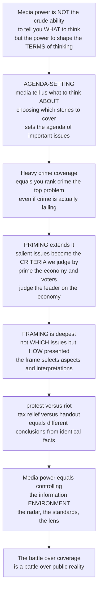

# 📰 Agenda-Setting, Priming, and Framing

> [!abstract] TL;DR
> These three related cognitive theories capture the *subtle* but enormous power of the media — not the crude power to tell you *what* to think (which mostly fails), but the deeper power to shape the very *terms* of your thinking by controlling the **information environment**. **Agenda-setting** (McCombs & Shaw, 1972): the press "may not be successful in telling us what to think, but it is stunningly successful in telling us what to think *about*" — by choosing which stories to cover heavily and which to ignore, the news sets the **agenda** of issues the public deems important, even when those priorities diverge from objective reality. **Priming** (Iyengar & Kinder): by making certain issues salient, media set the **standards** by which we judge leaders and events — prime the economy before an election and voters judge the president mainly on the economy. **Framing** (Entman, 1993), the deepest of the three: not *which* issues but *how* they are presented — the same event framed as "protest" vs "riot," a policy as "tax relief" vs "handout," yields entirely different conclusions from **identical facts**. Together they explain why the endless battle over what gets covered and how it is labeled is really a battle over the shape of public reality itself.

---

## Intuition

**Analogy — the radar screen, the yardstick, and the tinted window.** Imagine your picture of the world as a room you never leave; the media are your only window onto everything outside it. That window does three things, each more subtle and more powerful than the last.

First, it is a **radar screen** that only shows a few blips at a time. There are millions of things happening in the world, but attention is scarce, so the news lights up a handful of them and leaves the rest dark. Whatever the radar keeps lighting up, you come to believe *matters* — if the news covers crime relentlessly, you will rank crime as a top national problem *even if crime is actually falling*, because the media's priorities silently become your priorities. That is **agenda-setting**: the media rarely tell you *what* to conclude, but they are stunningly good at telling you what to think *about*.

Second, whatever is glowing brightest on that radar quietly becomes the **yardstick** you measure everything by. If the news has been saturated with the economy right before you evaluate the president, you judge him mostly on the economy — whatever else he has done fades. The most *accessible* issue becomes the *criterion* of judgment. That is **priming**: agenda-setting's evaluative sting.

Third — and deepest — the window itself is **tinted glass**, and the tint decides what the scene *means*. The very same street gathering, seen through one tint, is a "protest"; through another, a "riot." The same policy is "tax relief" or a "handout to the rich"; the same border story is a "security threat" or a "humanitarian crisis." Not one fact has changed, yet you reach opposite conclusions. That is **framing**: the selection and emphasis in *how* a reality is presented, which organizes its very meaning. Radar, yardstick, tint — what is on your mental screen (agenda), the standards you judge by (priming), and the lens you see through (framing). Media power is not brainwashing. It is control of the room's only window.

---

## How It Works

### Core mechanics

1. **The common root — selection and salience.** All three theories are about **choosing** what to make prominent. The press cannot cover everything, so every act of coverage is an act of selection, and selection creates **salience** — the perceived importance or prominence of an object or an attribute. These are *cognitive* effects (they shape what is in mind and how it is organized), not the old "persuasion" model of directly changing attitudes. This is why the trio is often called the **"return of powerful effects"** after decades in which scholars thought media effects were minimal.

2. **Agenda-setting — transfer of salience (McCombs & Shaw, 1968 Chapel Hill study).** The core claim is a **transfer of salience from the media agenda to the public agenda**: issues the press ranks as important (by volume of coverage) become the issues the public ranks as important. Empirically it appears as a strong **correlation** between how much coverage each issue gets and how important the public rates it — with the public agenda *lagging and following* the media agenda over time. Two levels: **first-level** agenda-setting concerns which *objects* (issues) are salient; **second-level (attribute) agenda-setting** concerns which *attributes* of an object are salient — the bridge toward framing.

3. **Priming — the evaluative extension (Iyengar & Kinder, *News That Matters*).** Drawn from the cognitive psychology of **accessibility**: information made salient and recently activated is more *accessible* in memory, so it weighs more heavily in later judgments. When the news makes an issue prominent, that issue becomes the **standard** by which people evaluate leaders and events — the "yardstick effect." Coverage of an issue therefore does not just raise its importance; it raises its *weight in evaluations of the president*.

4. **Framing — organizing meaning (Entman, 1993).** "To frame is to **select** some aspects of a perceived reality and make them more salient... to promote a particular problem definition, causal interpretation, moral evaluation, and/or treatment recommendation." Two flavors: **equivalence frames** present logically identical information differently (a gain vs a loss frame — the direct link to prospect theory), while **emphasis (issue) frames** highlight different *considerations* about a topic. Framing works on **applicability** (which considerations are relevant), not just accessibility.

5. **The accessibility vs applicability distinction (Scheufele & Tewksbury, 2007).** Agenda-setting and priming operate by **accessibility** — making a topic easy to retrieve. Framing operates by **applicability** — shaping which interpretation is deemed to *apply*. This is the leading argument that framing is a *distinct* process rather than merely "second-level agenda-setting."

6. **Frame-building vs frame-setting.** *Frame-building* is who constructs frames upstream — sources, PR, politicians, journalists' norms. *Frame-setting* is the downstream effect on audiences. Frames rarely arrive alone: real politics is **frame competition**, and outcomes depend on which frame is stronger, more repeated, and more credible.

### Flow / architecture



---

## Key Concepts

### Secondary (intuitive foundations)
- **Agenda-setting:** the news cannot cover everything, so what it *does* cover heavily becomes what people think is important. The media's priorities become the public's priorities.
- **"What to think *about*":** media rarely change your opinion directly, but they powerfully decide *which topics* are on your mind at all.
- **Framing:** the *same* event described in different words leads to different conclusions — "protest" vs "riot," "used car" vs "pre-owned vehicle." How something is said matters as much as what is said.
- **Why it matters:** whoever decides what gets covered, and how it is labeled, has quietly shaped what everyone else argues about.

### Undergraduate (mechanisms and evidence)
- **The Chapel Hill study (McCombs & Shaw, 1968/1972):** compared the issues emphasized in the news with the issues undecided voters called important — an almost perfect rank-order correlation launched the theory.
- **Transfer of salience** and the **public-agenda time lag:** the public agenda mirrors and *follows* the media agenda; media salience precedes public salience.
- **First-level vs second-level (attribute) agenda-setting:** salience of *issues* vs salience of *attributes* of an issue — the conceptual bridge to framing.
- **Priming (Iyengar & Kinder):** making an issue salient makes it the **standard** for evaluating leaders — the accessibility-based "yardstick."
- **Equivalence vs emphasis frames:** gain/loss (logically identical) vs highlighting different considerations ("death tax" vs "estate tax," "climate change" vs "global warming").
- **Episodic vs thematic frames (Iyengar):** episodic frames (a single person's story) push audiences to attribute responsibility to individuals; thematic frames (trends and context) push them toward societal/structural responsibility.
- **Need for orientation:** people high in relevance and uncertainty about an issue are *most* susceptible to agenda-setting.

### Graduate (theory, contestation, and the digital turn)
- **Accessibility vs applicability (Scheufele & Tewksbury, 2007):** the core theoretical fault line — are agenda-setting/priming (accessibility) and framing (applicability) one family or genuinely distinct processes? The "fractured paradigm" debate.
- **Frame-building vs frame-setting** and **frame competition:** framing as a strategic contest among sources, journalists, and elites, whose outcome depends on frame strength, repetition, and credibility.
- **Lippmann's "pictures in our heads":** the pre-history — media construct the pseudo-environment we act within because the real environment is too large to know directly.
- **"Return of powerful effects":** how this trio revived strong-effects thinking after the "minimal effects" era, by relocating power from *attitude change* to *information environment construction*.
- **Strategic exploitation:** spin, framing wars, and PR as institutionalized frame-building; implications for the public sphere, political economy of media, and *whose* issues and frames dominate.
- **Digital-era transformation:** algorithmic agenda-setting and recommender systems, fragmented and personalized agendas, intermedia agenda-setting (who sets whose agenda), and framing through memes and social media — plus the misinformation implications.

---

## Python Demo

```python
# Agenda-setting, priming, and framing — three demonstrations:
#   (a) transfer of salience: MEDIA agenda vs PUBLIC agenda correlate strongly
#   (b) the time lag: public concern FOLLOWS media coverage and both can
#       diverge from OBJECTIVE reality (a falling crime rate)
#   (c) a FRAMING effect: identical facts under competing frames -> different support
import numpy as np
import matplotlib.pyplot as plt

rng = np.random.default_rng(7)

# ------------------------------------------------------------------ #
# (a) AGENDA-SETTING: transfer of salience from MEDIA to PUBLIC agenda
# ------------------------------------------------------------------ #
issues = ["Crime", "Economy", "Immigration", "Healthcare",
          "Climate", "Education", "Foreign\npolicy", "Corruption"]
media_agenda  = np.array([28, 22, 16, 12, 8, 6, 5, 3], dtype=float)  # % of coverage
# the public agenda largely mirrors the press, plus a little noise
public_agenda = np.clip(media_agenda + rng.normal(0, 2.0, media_agenda.size), 0, None)
r = np.corrcoef(media_agenda, public_agenda)[0, 1]

# ------------------------------------------------------------------ #
# (b) TIME LAG: public concern is a lagged, smoothed copy of coverage,
#     while the OBJECTIVE crime rate quietly falls all year
# ------------------------------------------------------------------ #
weeks = np.arange(52)
media_crime = 20 + 55 * np.exp(-((weeks - 20) ** 2) / (2 * 6.0 ** 2))  # a "crime wave"
lag = 3
shifted = np.concatenate([np.full(lag, media_crime[0]), media_crime[:-lag]])
public_concern = 0.6 * np.convolve(shifted, np.ones(4) / 4, mode="same")  # lagged + smoothed
crime_rate = 60 - 0.4 * weeks                                             # objective reality falls

# ------------------------------------------------------------------ #
# (c) FRAMING EFFECT: same facts, two competing frames, different support
# ------------------------------------------------------------------ #
frames   = ["Policy\ngain vs loss", "Vaccine\n95% safe vs 5% risk",
            "Event\nprotest vs riot", "Tax\nrelief vs handout"]
favorable = np.array([72, 80, 65, 68], dtype=float)  # support under the favorable frame
adverse   = np.array([41, 47, 33, 39], dtype=float)  # support under the adverse frame

# ------------------------------------------------------------------ #
# Plot
# ------------------------------------------------------------------ #
fig, ax = plt.subplots(1, 3, figsize=(16, 4.6))

# (a) scatter: media vs public salience
ax[0].scatter(media_agenda, public_agenda, s=70, color="#2c3e50", zorder=3)
lo, hi = 0, media_agenda.max() + 5
ax[0].plot([lo, hi], [lo, hi], "--", color="#e74c3c", label="perfect transfer")
for x, y, lab in zip(media_agenda, public_agenda, issues):
    ax[0].annotate(lab.replace("\n", " "), (x, y), fontsize=7,
                   xytext=(4, 4), textcoords="offset points")
ax[0].set_xlabel("Media agenda (% of coverage)")
ax[0].set_ylabel("Public agenda (% 'most important')")
ax[0].set_title(f"(a) Transfer of salience  (r = {r:.2f})")
ax[0].legend(fontsize=8)

# (b) time lag + divergence from reality
ax[1].plot(weeks, media_crime,    color="#2980b9", lw=2, label="Media crime coverage")
ax[1].plot(weeks, public_concern, color="#27ae60", lw=2, label="Public concern (lagged)")
ax[1].plot(weeks, crime_rate,     color="#e74c3c", lw=2, ls="--", label="Actual crime rate (falling)")
ax[1].set_xlabel("Week")
ax[1].set_ylabel("Index")
ax[1].set_title("(b) Concern FOLLOWS coverage, not reality")
ax[1].legend(fontsize=8)

# (c) framing effect
x = np.arange(len(frames)); w = 0.38
ax[2].bar(x - w/2, favorable, w, color="#16a085", label="Favorable frame")
ax[2].bar(x + w/2, adverse,   w, color="#c0392b", label="Adverse frame")
ax[2].set_xticks(x); ax[2].set_xticklabels(frames, fontsize=7)
ax[2].set_ylabel("Support (%)")
ax[2].set_title("(c) Framing: identical facts, different support")
ax[2].legend(fontsize=8)

plt.tight_layout()
plt.savefig("agenda_priming_framing.png", dpi=120)
print(f"Media–public agenda correlation r = {r:.2f}")
print("Mean framing gap (favorable − adverse):",
      f"{(favorable - adverse).mean():.0f} percentage points")
```

Panel (a) reproduces the classic agenda-setting result — the media agenda and the public agenda track almost one-to-one (`r ≈ 0.99`). Panel (b) shows the **time lag** and the striking divergence: public concern is a delayed echo of coverage even as the objective crime rate falls all year. Panel (c) is the framing effect — the *same* underlying facts yield roughly a 30-point swing in support depending on the frame, the identical-facts/different-conclusions signature that connects framing to prospect theory.

---

## Real-World Applications

- **Election coverage and priming:** when a campaign is dominated by economic news, voters weight the economy most heavily in evaluating incumbents; a foreign-policy crisis re-primes the electorate toward security. Campaigns fight to make *their* strong issue the salient one, because the primed issue becomes the ballot-box yardstick.
- **The "crime wave" that wasn't:** repeated coverage of violent incidents drives public fear and "tough on crime" demand even during periods of falling crime — a textbook agenda-setting/priming gap between perception and reality.
- **Framing wars in policy language:** "death tax" vs "estate tax," "climate change" vs "global warming," "pro-life" vs "anti-abortion," "undocumented worker" vs "illegal alien," "collateral damage" vs "civilian deaths." Each side invests heavily in installing its frame because control of the terms pre-decides much of the debate.
- **Episodic vs thematic framing of poverty:** covering poverty through one struggling individual (episodic) leads audiences to blame personal choices; covering it through economic trends (thematic) shifts blame to structural causes — with direct consequences for policy support.
- **Public relations and crisis communication:** corporate and government PR is institutionalized frame-building — an oil spill framed as "an accident under investigation" vs "criminal negligence," a layoff as "rightsizing" vs "mass job cuts."
- **Algorithmic agenda-setting:** recommender and trending systems now shape which stories become salient at scale, fragmenting the single national agenda into many personalized agendas — and letting memes and hashtags carry compact, viral frames.

---

## Common Pitfalls

- **Confusing agenda-setting with persuasion.** The theory's whole point is that media are *weak* at changing opinions but *strong* at setting the topics and terms. Claiming "the media told people what to think" overstates and misstates the mechanism.
- **Treating correlation as proof of causation.** Media–public agenda correlation is consistent with reverse causation (the press covering what the public already cares about). The evidence for media→public direction comes from the **time lag** and from experiments, not the correlation alone.
- **Collapsing framing into agenda-setting.** "Second-level agenda-setting" (attribute salience/accessibility) and framing (applicability/interpretation) overlap but are not identical; ignoring the accessibility-vs-applicability distinction erases what makes framing distinctive.
- **Assuming a single, monolithic agenda.** In a fragmented, algorithmically curated media system, audiences inhabit different agendas; the classic "one national agenda" picture is weaker than in the broadcast era.
- **Ignoring frame competition and audience resistance.** Frames rarely land unopposed, and prior beliefs, source credibility, and counter-frames all moderate effects — real audiences are not blank slates.
- **Overstating durability.** Priming and framing effects can fade quickly once coverage recedes; treating a poll bump as a permanent shift misreads the transience of accessibility effects.

---

## Related Concepts

- [[Agenda_Setting_and_Framing]] — the **public-policy** treatment of the same ideas: agenda-setting as the scarce-attention gateway to the policy process, framing as problem definition, plus the "second face of power" (non-decision-making). This note is the **media-effects / communication** companion.
- [[Media_Propaganda_and_Political_Communication]] — the political-communication view of how media, propaganda, and algorithmic systems shape belief; agenda-setting/priming/framing are the core mechanisms it invokes.
- [[Public_Opinion_and_Political_Socialization]] — how mass opinion forms and is measured; agenda-setting and priming are among the chief media forces acting on it.
- [[Prospect_Theory]] — the origin of **equivalence (gain/loss) framing**; the same facts as a gain or a loss produce systematically different choices, the psychological engine beneath framing effects.
- [[Reference_Dependence_and_Framing]] — the behavioral-economics mechanism (evaluation relative to a reference point) that explains *why* framing shifts judgments.
- [[Political_and_Public_Rhetoric]] — the rhetorical craft of naming, emphasis, and persuasion that overlaps with strategic frame-building.

Within this vault, agenda-setting, priming, and framing sit alongside the broader survey in *Mass_Communication_and_Media_Effects*, and complement *Cultivation_Theory_and_Media_Reality* (long-run reality construction), *Spiral_of_Silence_and_Public_Opinion* (opinion climates and silencing), *Propaganda_and_Persuasion* (deliberate influence), and *Journalism_and_News_Production* (the newsroom routines that build agendas and frames upstream).

---

## Review Questions

1. **(Secondary)** Explain the difference between the media telling you *what* to think and telling you *what to think about*. Give an everyday example of agenda-setting from the news.
2. **(Secondary)** Give two examples of the *same* event or policy that would lead to different conclusions depending on how it is framed. Which words do the framing work?
3. **(Undergraduate)** How does priming differ from agenda-setting, and how does the concept of *accessibility* connect them? Illustrate with how issue salience before an election can shape the criteria voters use to judge an incumbent.
4. **(Undergraduate)** A survey finds public fear of crime rising while the official crime rate falls. Using agenda-setting and priming, explain how this gap can open — and what evidence would show the media *caused* it rather than merely reflected concern.
5. **(Graduate)** Scheufele and Tewksbury argue framing is distinct from agenda-setting because it works through *applicability* rather than *accessibility*. Defend or challenge this claim, and explain what is at stake in calling framing "second-level agenda-setting."
6. **(Graduate)** How does an algorithmically curated, fragmented media system change the classical agenda-setting model? Discuss intermedia agenda-setting, personalized agendas, and framing via memes, and what this implies for a shared public reality.

---

## Sources

- McCombs, M. E., & Shaw, D. L. (1972). *The Agenda-Setting Function of Mass Media.* Public Opinion Quarterly, 36(2), 176–187.
- Iyengar, S., & Kinder, D. R. (1987). *News That Matters: Television and American Opinion.* University of Chicago Press. (Priming.)
- Entman, R. M. (1993). *Framing: Toward Clarification of a Fractured Paradigm.* Journal of Communication, 43(4), 51–58.
- Scheufele, D. A., & Tewksbury, D. (2007). *Framing, Agenda Setting, and Priming: The Evolution of Three Media Effects Models.* Journal of Communication, 57(1), 9–20.
- Iyengar, S. (1991). *Is Anyone Responsible? How Television Frames Political Issues.* University of Chicago Press. (Episodic vs thematic framing.)

---

#media-studies #agenda-setting #framing #priming #media-effects
