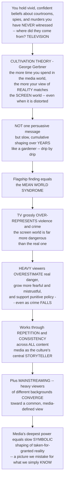

# 📺 Cultivation Theory and Media Reality

> [!abstract] TL;DR
> George Gerbner's **cultivation theory** claims that long-term, cumulative exposure to media (especially **television**) slowly shapes — *cultivates* — viewers' conceptions of social **reality** toward the world as it is *portrayed on screen*, even when that portrayal is systematically distorted. Media do not persuade with any single message (the discredited "magic bullet"); they act as the culture's central **storyteller**, drip by drip. The flagship finding is the **mean world syndrome**: because TV grossly over-represents violence, **heavy viewers** come to believe the real world is far more dangerous than it is — more fearful, more mistrustful, more punitive — even as actual crime falls. Through **mainstreaming**, the worldviews of diverse audiences converge toward a common, media-defined "mainstream." Media's deepest power may be this quiet, symbolic construction of the reality we think we simply *know*.

---

## Intuition

**Analogy:** You have never been inside a courtroom, met a spy, or witnessed a murder — yet you hold vivid, confident beliefs about all three. Where did they come from? Overwhelmingly, from **television and media**. Now ask: if almost everything you "know" about worlds you have never entered arrives through a screen, what happens when that screen shows you a systematically distorted world, year after year?

Cultivation theory makes a profound claim: the **more time** people spend immersed in media, the more their picture of **reality** comes to match the world as depicted on screen. Crucially, this is *not* the old, failed "magic bullet" idea that a single powerful message injects an opinion into your head. Instead media work like a **gardener** slowly shaping a plant — imperceptibly, drip by drip, over years of exposure. No single show changes your mind; a *lifetime* of consuming a distorted media reality **cultivates** a distorted picture of the real one.

The most famous consequence is the **mean world syndrome**. Because TV massively over-represents violence and crime — the screen world is far more dangerous than the street outside your door — **heavy** viewers come to believe the real world is far more dangerous than it actually is. They overestimate their chance of becoming a crime victim, feel more fearful and mistrustful, and support more punitive, security-obsessed policies — *even as real crime falls*. It is not that one scary program frightened them; it is that immersion in a violent symbolic world cultivated a "mean world" outlook.

Cultivation works through **repetition and consistency across all content**. Gerbner saw media as the culture's central storyteller — the ritualized, shared narrator that, in modern life, has displaced religion, family, and community as the source of common stories about how the world *is*. And through **mainstreaming**, heavy viewers of very different backgrounds gradually **converge** toward a common, media-defined view of reality; the medium homogenizes. The deep insight: media's greatest power may be this slow **symbolic** shaping of our taken-for-granted assumptions — how common violence is, what families look like, who holds power, what counts as normal — a media-constructed picture we mistake for reality itself. To understand cultivation is to understand how media, over time, do not merely tell us stories but quietly **construct the reality we think we simply know**.

---

## How It Works

### Core Mechanics

1. **Long-term, cumulative, cultural effects — not short-term persuasion.** Cultivation belongs to a different paradigm than the classic attitude-change tradition (which asks whether a specific message shifts a specific opinion). Its unit is *years of immersion*, and its outcome is a whole **conception of reality**. Media power lies in slow, cumulative **symbolic socialization** (enculturation), not single-message persuasion.
2. **Television as the central storyteller.** Gerbner treated TV as a **ritualized, consistent symbolic environment** — a shared story-system watched largely non-selectively, "by the clock" rather than by title. Because its recurrent patterns are remarkably uniform across genres, immersion in *any* of it exposes the viewer to the same underlying lessons about violence, power, gender, and social order.
3. **Message-system analysis (the content side).** The **Cultural Indicators** project performed systematic **content analysis** of the media world to document its recurrent patterns — most famously the **violence profile**: how much violence appears, who commits it, and who its victims are. The screen world is far more violent, and its demographics far more skewed, than the real one.
4. **Cultivation analysis (the audience side).** Surveys compare **light** versus **heavy** viewers' beliefs about reality, statistically controlling for age, education, income, sex, and other factors. The residual gap — heavy viewers giving answers closer to the "TV answer" — is the **cultivation differential**.
5. **The mean world syndrome (flagship finding).** Because TV over-represents danger, heavy viewers overestimate crime and victimization risk, express more **fear and interpersonal mistrust** ("most people cannot be trusted / would take advantage of you"), and favor more **punitive** policy — the "scary world" and its political consequences.
6. **Two refining mechanisms.**
   - **Mainstreaming:** heavy viewing **blurs and converges** the otherwise divergent outlooks of different social groups toward a common, TV-defined "mainstream" — a homogenizing effect. Differences that are large among light viewers shrink among heavy viewers.
   - **Resonance:** when the media message **matches lived experience** (e.g., living in a high-crime area *and* watching violent TV), the effect is amplified — a "double dose."
7. **First-order vs second-order cultivation.** *First-order* effects are distorted **statistical estimates** of the world (how much crime, what percent of men have violent jobs). *Second-order* effects are shifts in **attitudes and values** (generalized fear, mistrust, the sense that the world is mean).

### Flow / Architecture



---

## Key Concepts

### Secondary (intuitive)
- **Cultivation:** watching a lot of TV slowly grows a picture of the world inside your head that looks like the world *on TV*.
- **Mean world syndrome:** because TV shows so much violence, heavy viewers think the real world is scarier and more dangerous than it really is.
- **Drip, not injection:** no single show changes you; it is thousands of hours, a little at a time, that add up.
- **Light vs heavy viewers:** researchers compare people who watch a little with people who watch a lot — and the heavy watchers give more "TV-like" answers about reality.

### Undergraduate (mechanistic)
- **Cultivation differential:** the measured gap between light and heavy viewers *after* controlling for other variables — the core evidence for a cultivation effect.
- **Message-system analysis vs cultivation analysis:** content analysis documents the media world's recurrent patterns (the **violence profile**); surveys then test whether heavy viewers' beliefs drift toward those patterns.
- **Mainstreaming:** heavy viewing *reduces the spread* of opinion across social groups, pulling divergent subcultures toward a shared "mainstream."
- **Resonance:** congruence between screen content and lived experience amplifies the effect (a "double dose").
- **First-order vs second-order:** distorted factual estimates of the world vs distorted attitudes and values about it.
- **A long-term, cultural theory:** it explicitly contrasts with the short-term, attitude-change ("magic bullet" / limited-effects) paradigm — media's power is *symbolic socialization over time*.

### Graduate (critical / theoretical)
- **The Cultural Indicators tradition:** Gerbner's three-pronged program — institutional process analysis (how messages get made), message-system analysis (what patterns recur), and cultivation analysis (what audiences infer) — framing TV as a mechanism of cultural **enculturation** rather than persuasion.
- **Cognitive mechanism (Shrum's account):** cultivation operates through **heuristic processing** and the **availability heuristic** — heavy viewers, when asked snap judgments about frequency and risk, retrieve more accessible, vivid media exemplars, inflating their estimates. This locates cultivation within memory-and-accessibility models rather than treating it as a black box.
- **Methodological debates:** correlation vs causation, adequacy of statistical controls, typically **small effect sizes**, selective/genre-specific viewing, and possible **reverse causation** (fearful people watch more TV). Hirsch's re-analyses and the "nonmonotonicity" critiques sharpened the standards.
- **The monolith assumption under fragmentation:** cultivation assumed a *shared, non-selective* symbolic world. High-choice cable, streaming, on-demand, niche, and algorithmically curated media challenge the premise of a common storyteller — reopening the question of whether we still share *one* symbolic reality or fracture into many (filter bubbles, echo chambers).
- **Extensions:** genre-specific cultivation, and cultivation by **new media** — video games, social platforms, streaming — cultivating perceptions of body image, materialism, crime, and political and racial attitudes.

---

## Python Demo

```python
# Cultivation theory, simulated two ways:
#  (a) MEAN WORLD / CULTIVATION DIFFERENTIAL: perceived danger is pulled from the
#      (low) REAL crime rate toward the (high) SCREEN-world rate as media EXPOSURE
#      rises. Heavy viewers systematically OVERESTIMATE real danger; the
#      light-vs-heavy gap is the "cultivation differential" -- overlaying the
#      actual (much lower) rate exposes the distortion.
#  (b) MAINSTREAMING + DRIP: viewers from divergent subcultures CONVERGE toward a
#      common media-defined view as viewing rises (mainstreaming), and a tiny
#      per-exposure shift ACCUMULATES over years into a large worldview change
#      (the drip-drip model) while a single message merely fades.
import numpy as np
import matplotlib.pyplot as plt

rng = np.random.default_rng(42)

REAL_RATE   = 0.02   # actual annual chance of violent victimization (~2 percent)
SCREEN_RATE = 0.50   # the "screen world" is drenched in violence (~50 percent)

def perceived_danger(exposure_hrs, toward=SCREEN_RATE, real=REAL_RATE, lam=0.28):
    # Saturating pull from the real rate toward the media rate as exposure grows.
    pull = 1.0 - np.exp(-lam * np.asarray(exposure_hrs, dtype=float))
    return np.clip(real + (toward - real) * pull, 0, 1)

# ---- (a) Mean-world curve + cultivation differential ------------------------
exposure = np.linspace(0, 10, 200)          # TV hours per day
curve = perceived_danger(exposure)

light_hrs, heavy_hrs = 2.0, 7.0
p_light = float(perceived_danger(light_hrs))
p_heavy = float(perceived_danger(heavy_hrs))
differential = p_heavy - p_light

# ---- (b1) Mainstreaming: three subcultures converge as viewing rises --------
baselines = {"group A": 0.05, "group B": 0.20, "group C": 0.38}  # zero-TV worldviews
def mainstreamed(exposure_hrs, baseline, mainstream=0.35, lam=0.30):
    w = 1.0 - np.exp(-lam * np.asarray(exposure_hrs, dtype=float))  # pull to mainstream
    return baseline * (1 - w) + mainstream * w
spread = np.std([mainstreamed(exposure, b) for b in baselines.values()], axis=0)

# ---- (b2) Drip-drip accumulation vs a single decaying message ---------------
n = np.arange(0, 2000)                       # daily exposures over ~5+ years
drip_cumulative = np.clip(0.00025 * n, 0, 0.45)   # tiny nudge each time, accumulating
single_message  = 0.05 * np.exp(-n / 30.0)        # one big hit that fades away

# ---------------------------------------------------------------------------
fig, ax = plt.subplots(2, 2, figsize=(13, 9))

# (a) Cultivation curve toward the screen world
ax[0, 0].plot(exposure, curve, color="#8e44ad", lw=2.5, label="perceived danger")
ax[0, 0].axhline(REAL_RATE,   color="#27ae60", ls="--", lw=1.8, label="ACTUAL crime rate")
ax[0, 0].axhline(SCREEN_RATE, color="#c0392b", ls="--", lw=1.8, label="SCREEN-world rate")
ax[0, 0].scatter([light_hrs, heavy_hrs], [p_light, p_heavy], color="k", zorder=5)
ax[0, 0].annotate("light viewer", (light_hrs, p_light),
                  textcoords="offset points", xytext=(8, -16))
ax[0, 0].annotate("heavy viewer", (heavy_hrs, p_heavy),
                  textcoords="offset points", xytext=(-34, 10))
ax[0, 0].annotate("", xy=(heavy_hrs, p_heavy), xytext=(heavy_hrs, p_light),
                  arrowprops=dict(arrowstyle="<->", color="#e67e22", lw=2))
ax[0, 0].text(heavy_hrs + 0.2, (p_light + p_heavy) / 2,
              "cultivation\ndifferential\n= %.2f" % differential,
              color="#e67e22", va="center", fontsize=9)
ax[0, 0].set_title("(a) Mean World: perception drifts toward the screen")
ax[0, 0].set_xlabel("media exposure  (TV hours per day)")
ax[0, 0].set_ylabel("perceived chance of victimization")
ax[0, 0].legend(loc="center right", fontsize=8)

# (a2) The distortion gap: perceived vs actual vs screen
labels = ["Actual\nrate", "Light\nviewer", "Heavy\nviewer", "Screen\nworld"]
vals   = [REAL_RATE, p_light, p_heavy, SCREEN_RATE]
cols   = ["#27ae60", "#2980b9", "#8e44ad", "#c0392b"]
ax[0, 1].bar(labels, vals, color=cols)
ax[0, 1].set_ylabel("estimated danger level")
ax[0, 1].set_title("Heavy viewing distorts reality upward")
for i, v in enumerate(vals):
    ax[0, 1].text(i, v + 0.012, "%.2f" % v, ha="center", fontsize=9)

# (b1) Mainstreaming: divergent groups converge
for name, b in baselines.items():
    ax[1, 0].plot(exposure, mainstreamed(exposure, b), lw=2, label=name)
ax[1, 0].axhline(0.35, color="k", ls=":", lw=1, label="media mainstream")
ax[1, 0].fill_between(exposure, 0, spread, color="#bdc3c7", alpha=0.4,
                      label="cross-group spread")
ax[1, 0].set_title("(b) Mainstreaming: divergent groups CONVERGE")
ax[1, 0].set_xlabel("media exposure  (TV hours per day)")
ax[1, 0].set_ylabel("perceived danger")
ax[1, 0].legend(fontsize=8)

# (b2) Drip-drip accumulation beats the single message
ax[1, 1].plot(n, drip_cumulative, color="#8e44ad", lw=2.5,
              label="drip-drip cumulative effect")
ax[1, 1].plot(n, single_message, color="#7f8c8d", lw=2,
              label="single message (decays)")
ax[1, 1].set_title("A tiny nudge, repeated for years, wins")
ax[1, 1].set_xlabel("number of exposures  (days of viewing)")
ax[1, 1].set_ylabel("worldview shift")
ax[1, 1].legend(fontsize=8)

plt.tight_layout()
plt.savefig("cultivation_theory.png", dpi=120)

print("Light viewer perceived danger:  %.3f" % p_light)
print("Heavy viewer perceived danger:  %.3f" % p_heavy)
print("Cultivation differential:       %.3f" % differential)
print("Actual rate: %.3f  |  Screen-world rate: %.3f" % (REAL_RATE, SCREEN_RATE))
print("Cross-group spread  low vs high viewing: %.3f -> %.3f" % (spread[0], spread[-1]))
```

Running it makes the theory quantitative: perceived danger **climbs from the real rate toward the screen-world rate** as exposure rises, so heavy viewers overshoot reality and the light-vs-heavy **cultivation differential** is large; the **actual** rate sits far below, exposing the distortion. In panel (b), three groups that start far apart **converge** on the media mainstream (the shaded cross-group spread collapses toward zero — *mainstreaming*), and a per-exposure nudge of just 0.00025 **accumulates** into a ~0.45 worldview shift over years, while a single message decays to nothing — the "drip-drip" logic that single-message persuasion research keeps missing.

---

## Real-World Applications

- **Fear of crime and punitive politics.** The best-documented application: heavy news and crime-drama viewers overestimate crime rates and victimization risk and back tougher sentencing, more policing, and self-protection (alarms, weapons) — persisting even as official crime statistics decline. This "scary world" feeds law-and-order political appeals.
- **Local TV news and the "if it bleeds, it leads" loop.** Crime-heavy local news is a potent cultivator of the mean world outlook precisely because its violence profile is dense and its framing episodic — a real-world message system that content analysis can measure.
- **Body image, materialism, and lifestyle norms.** Cultivation extends well beyond violence: heavy exposure to idealized bodies, affluence, and consumption cultivates distorted norms about how common wealth, thinness, and certain lifestyles are — with documented links to body dissatisfaction and materialist values.
- **Political and racial attitudes.** Skewed on-screen demographics and role portrayals cultivate second-order attitudes about which groups are dangerous, powerful, or marginal — connecting cultivation to representation and stereotyping research.
- **Health and risk perception.** Medical dramas and pandemic coverage cultivate beliefs about disease prevalence, treatment success rates, and the dangers of everyday life, shaping public risk estimates that diverge from epidemiological reality.
- **Video games and social media.** Modern cultivation research asks whether heavy gaming cultivates aggression-tolerant or hostile-world beliefs, and whether algorithmic feeds cultivate perceptions of political polarization, danger, and social norms — porting Gerbner's logic into interactive, high-choice, personalized media.

---

## Common Pitfalls

- **Confusing cultivation with the "magic bullet."** Cultivation is the *opposite* of single-message persuasion: it denies that any one program matters much and insists the effect is **slow, cumulative, and cultural**. Treating it as "TV made him do it" misreads the whole theory.
- **Reading correlation as proof of causation.** Light-vs-heavy differences are correlational; fearful people may watch *more* TV (reverse causation), and uncontrolled variables can masquerade as cultivation. The **cultivation differential** is suggestive, not a clean causal estimate.
- **Ignoring effect size.** Even where real, cultivation effects are typically **small**. Overselling them ("TV determines your worldview") invites the backlash the literature has already absorbed.
- **Assuming a monolithic audience and medium.** Classic cultivation presumed *non-selective, uniform* viewing of a shared symbolic world. In a fragmented, high-choice, on-demand, algorithmic environment that premise weakens — cultivation must be re-specified for genres, platforms, and personalized feeds.
- **Forgetting mainstreaming and resonance.** Cultivation is not uniform across people: it *converges* divergent groups (mainstreaming) and *amplifies* where content matches lived experience (resonance). Reporting a single average effect hides these patterned differences.
- **Collapsing first-order and second-order effects.** Distorted *frequency estimates* (how much crime there is) and distorted *values* (generalized fear and mistrust) are different outcomes with different mechanisms; conflating them muddies both measurement and interpretation.

---

## Related Concepts

- [[Cognitive_Biases]] — the **availability heuristic** is the cognitive engine Shrum proposes for cultivation: heavy viewers retrieve vivid media exemplars more easily, inflating their frequency and risk estimates.
- [[Schemas_and_Mental_Models]] — second-order cultivation is essentially media *building the schemas* through which we judge "how the world is," so that a media-constructed template is mistaken for direct knowledge of reality.
- [[Socialization_and_the_Self]] — cultivation is a form of **enculturation**: Gerbner cast television as a socializing agent teaching the "facts" of the world, rivaling family, school, and religion.
- [[Symbolic_Interactionism_and_Microsociology]] — the social-construction-of-reality lineage: cultivation is a mass-media account of how a shared symbolic environment builds our taken-for-granted sense of what is normal and real.
- [[Media_Culture_and_Cultural_Industries]] — the sociology of who *produces* the recurrent stories (the message system) whose patterns cultivation then traces into audience beliefs.
- [[Public_Opinion_and_Political_Socialization]] — the downstream political payoff: cultivated fear and mistrust feed public opinion on crime, security, and punitive policy, linking media reality to governance.

Within this vault, cultivation is best read alongside its siblings (some to be created): **Mass_Communication_and_Media_Effects** (the broad map of effects paradigms, including the discredited "magic bullet" that cultivation was defined against, and the "uses and gratifications" active-audience counterpoint), **Agenda_Setting_Priming_and_Framing** (the complementary claim that media tell us *what to think about* and *how*, where cultivation says media build our sense of *how the world is*), **Gender_Race_and_Identity_in_Media** (the representation patterns that cultivation shows have real attitudinal consequences), **The_Digital_Revolution_and_New_Media** (whether a fragmented, on-demand, streaming environment still supports a common cultivating storyteller), and **Attention_Filter_Bubbles_and_Echo_Chambers** (algorithmic, personalized cultivation of divergent — rather than mainstreamed — realities).

---

## Review Questions

1. **(Secondary)** In your own words, what is the "mean world syndrome," and why does cultivation theory say it happens *even when* real crime is going down? Give one everyday example of a belief you might hold about a world you have never actually experienced.
2. **(Undergraduate)** Distinguish **message-system analysis** from **cultivation analysis**, and explain what the **cultivation differential** measures. Why is controlling for variables like age, education, and income essential before claiming a cultivation effect?
3. **(Undergraduate)** Explain **mainstreaming** and **resonance**. Using the demo's convergence plot, describe what should happen to the *spread* of opinion across social groups as viewing increases, and why that pattern is stronger evidence for cultivation than a single average effect.
4. **(Graduate)** State the case that cultivation is really the **availability heuristic** at work (Shrum). What predictions does this cognitive account make — about *how questions are asked* and *how fast people answer* — that a black-box "cultivation just happens" account does not?
5. **(Graduate)** Classic cultivation assumed a shared, non-selective symbolic world dominated by broadcast TV. In a high-choice, streaming, algorithmically curated environment, does cultivation *strengthen*, *weaken*, or *transform*? Argue whether personalized feeds produce *mainstreaming* (one convergent reality) or its opposite — many fragmented, filter-bubbled realities — and what evidence would settle it.

---

## Sources

- Gerbner, George, and Larry Gross. "Living with Television: The Violence Profile." *Journal of Communication* 26, no. 2 (1976): 172–199.
- Gerbner, George, Larry Gross, Michael Morgan, Nancy Signorielli, and James Shanahan. "Growing Up with Television: Cultivation Processes." In *Media Effects: Advances in Theory and Research*, edited by Jennings Bryant and Dolf Zillmann, 2nd ed., 43–67. Mahwah, NJ: Lawrence Erlbaum, 2002.
- Morgan, Michael, and James Shanahan. "The State of Cultivation." *Journal of Broadcasting & Electronic Media* 54, no. 2 (2010): 337–355.
- Shrum, L. J. "Assessing the Social Influence of Television: A Social Cognition Perspective on Cultivation Effects." *Communication Research* 22, no. 4 (1995): 402–429.
- Hirsch, Paul M. "The 'Scary World' of the Nonviewer and Other Anomalies: A Reanalysis of Gerbner et al.'s Findings on Cultivation Analysis, Part I." *Communication Research* 7, no. 4 (1980): 403–456.

---

#media-studies #cultivation-theory #mean-world-syndrome #gerbner #media-reality
