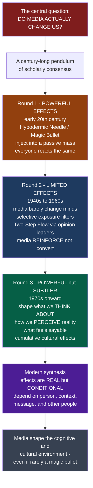

# 📡 Mass Communication and Media Effects

> [!abstract] TL;DR
> **Mass communication** is the process by which a few institutional producers transmit messages to large, dispersed, heterogeneous, anonymous audiences through mass media, and the field's central question is **media effects**: do the media actually change us? A century of research has swung like a pendulum — from an early faith in **powerful, direct effects** (the "hypodermic needle" injecting uniform messages into a passive mass), to the deflating discovery of **limited effects** (media mostly reinforce existing beliefs, filtered through selective attention and the **two-step flow** of influence through trusted people), and back to a return of **powerful but subtler effects** (media rarely change *what* we think yet profoundly shape *what we think about*, how we perceive reality, and what feels socially sayable). The modern synthesis: media effects are **real but conditional** — powerful shapers of our cognitive and cultural environment even when they seldom act as a magic bullet on any individual.

---

## Intuition

**Analogy:** Imagine a doctor arguing about how a drug works. **Version 1:** the drug is a hypodermic injection — one dose enters the bloodstream and *everyone* who gets it reacts the same, immediately and strongly. **Version 2:** most patients turn out to metabolize it away before it does anything; it only moves the needle in the few who were already susceptible, and even then it mostly *reinforces* their existing condition rather than curing or reversing it. **Version 3:** the drug doesn't cure the disease you were measuring at all — but taken daily for years it quietly reshapes the whole body's baseline chemistry in ways your short "did-it-cure-the-cold?" trials never detected.

That is the entire history of media effects research in one metaphor. The single biggest question in all of media studies is deceptively simple — **do the media actually change us?** Do violent games make kids violent, does advertising control what we buy, did TV rot our brains, is social media wrecking democracy? Scholars first assumed the injection model (all-powerful media), then discovered the metabolism model (limited effects — people filter media through what they already believe and through the people they trust), and finally realized the media were doing the *slow baseline-reshaping* the whole time. The honest answer to "how much power do the media have over us?" is subtle: **it's complicated — real but conditional.**

---

## How It Works

### Core Mechanics

**What "mass communication" means.** Unlike a face-to-face conversation, mass communication has distinctive features: *institutional production* (organizations, not individuals, make the messages), *technological mediation* (print, broadcast, cable, internet carry them one-to-many and often simultaneously), a *mass audience* that is large, dispersed, heterogeneous, and anonymous to the sender, and a *public* character. The question that defines the field is **media effects** — the influence of media on individuals and society across cognitive, attitudinal, behavioral, and cultural dimensions.

**The pendulum — four phases of effects theory.**

1. **Phase 1 — Powerful / direct effects (early 20th c.).** The **hypodermic needle** / **magic bullet** / stimulus-response model: media inject uniform, immediate, powerful effects into a passive, atomized *mass*. Rooted in the shock of WWI propaganda, mass-society theory, and the panic over the "War of the Worlds" radio broadcast. It was largely a *retrospective straw man* — few scholars ever stated it so crudely — but it framed everything that followed.
2. **Phase 2 — Limited effects (1940s–60s).** The empirical turn (Lazarsfeld, Berelson, Hovland, Klapper) found the opposite: media *mostly reinforce rather than convert*. Influence is filtered through **selective exposure, perception, and retention** and flows through interpersonal networks — the **two-step flow** (media → opinion leaders → public; Katz & Lazarsfeld, *Personal Influence*). Klapper's "phenomenistic" synthesis cast media as *one influence among many*, working through pre-existing predispositions. The needle was a myth.
3. **Phase 3 — The return of powerful effects (1970s+).** Researchers realized the old attitude-change paradigm had been measuring the wrong thing. Media *do* have big effects — just **subtle, cumulative, long-term, cognitive, and indirect** ones: **agenda-setting** (what we think *about*), **cultivation** (our perception of social reality), the **spiral of silence** (which opinions feel sayable), plus knowledge gaps, framing, priming, and socialization.
4. **Phase 4 — Negotiated / conditional & active-audience models.** Uses-and-gratifications and encoding/decoding reframed the question from "what media do to people" to "what people do with media" — and the digital era swung the pendulum *back* toward powerful-effects concerns (algorithmic curation, misinformation, engagement optimization).

**Types & dimensions of effects.** Cognitive (knowledge, agenda, perception) vs attitudinal (opinions, persuasion) vs behavioral (action, imitation) vs cultural (values, worldviews); short-term vs long-term; individual vs societal; intended vs unintended; and — crucially — **direct vs conditional/contingent**, where the effect size depends on *moderators*: individual differences, social context, and message factors.

**The modern synthesis.** Effects are **real but conditional** — often modest and heterogeneous at the individual level yet significant at the aggregate and cultural level. The "how powerful?" debate never fully closes (media violence, advertising, political persuasion, social-media effects tend to show *small average effects* that are nonetheless *consequential in aggregate*), and it is dogged by hard methodological problems: measuring effects, establishing causality, and disentangling self-selection.

### Flow / Architecture



---

## Key Concepts

**Secondary (high-school level).**
- **Mass communication** — a few producers sending the same message to a huge, scattered audience through media like TV, radio, and the internet.
- **Media effects** — the basic question of whether, and how much, the media change what people know, believe, and do.
- **Hypodermic needle / magic bullet** — the early idea that media "inject" messages and everyone reacts the same way. Mostly a myth, but a useful starting point.
- **Reinforcement vs conversion** — media usually *strengthen* what you already think far more often than they *flip* your mind.

**Undergraduate.**
- **The pendulum of effects theory** — powerful (1920s) → limited (1940s–60s) → powerful-but-subtle (1970s+) → conditional / active-audience & algorithmic (today). Each phase revised rather than erased the last.
- **Two-step flow & opinion leadership** — media influence often travels *media → opinion leaders → public*, so interpersonal networks mediate mass messages (Katz & Lazarsfeld).
- **Selective processes** — selective *exposure* (we seek agreeable content), *perception* (we read it through our biases), and *retention* (we remember what fits) all blunt direct effects.
- **Klapper's limited-effects synthesis** — media are one influence among many, operating through pre-existing predispositions and social context.
- **Cognitive/subtle-effects theories (overview)** — agenda-setting, cultivation, spiral of silence, framing, priming, knowledge gaps, and social learning/modeling (Bandura).
- **Dimensions of effects** — cognitive vs attitudinal vs behavioral vs cultural; short- vs long-term; individual vs societal; intended vs unintended.

**Graduate.**
- **Conditional / contingent effects** — the payoff of the modern synthesis: effect size is a *function of moderators* (prior attitude strength, message–audience alignment, social embedding), not a constant. "It depends" is the theory, not a cop-out.
- **Aggregate vs individual paradox** — average individual effects can be small yet aggregate/cultural effects large and consequential (the "minimal-effects" debate revival in political communication).
- **Methodological core** — causal identification under self-selection, ecological validity of lab persuasion studies, effect-size estimation, and the gap between short-run experiments and long-run cumulative influence.
- **Structural / algorithmic turn** — from "what people do with media" back to the structural power of platforms: recommender systems, engagement optimization, and the reconstitution of "powerful effects" concerns at scale.
- **Mass-society theory & its critique** — the atomized-mass premise underlying the hypodermic model, dismantled by the discovery of resilient interpersonal networks.

---

## Python Demo

```python
# Simulates the two great debates of media-effects theory:
#   (a) HYPODERMIC vs LIMITED / TWO-STEP FLOW models of opinion change
#   (b) CONDITIONAL effects (effect shrinks as prior attitudes strengthen)
#       and the historical PENDULUM of estimated effect size across eras.
import numpy as np
import matplotlib.pyplot as plt

rng = np.random.default_rng(42)
N = 6000

# Prior attitudes on a -1 (oppose) to +1 (support) scale, most people moderate.
prior = np.clip(rng.normal(0.0, 0.40, N), -1, 1)
msg_strength = 0.60  # nominal push of a pro-message toward +1

# --- Model A: HYPODERMIC / MAGIC BULLET ---------------------------------
# Every isolated individual receives the message directly and shifts identically.
post_hypo = np.clip(prior + msg_strength, -1, 1)

# --- Model B: LIMITED EFFECTS + SELECTIVE PROCESSING + TWO-STEP FLOW -----
# 1. Only ~10% are opinion leaders who actually attend to mass media.
# 2. Selective processing: resistance grows with the strength of the prior
#    attitude, so strong priors barely move; the persuadable move most.
# 3. Leaders relay a diluted signal to their contacts (the crucial second step).
is_leader = rng.random(N) < 0.10
susceptibility = 1 - np.abs(prior)               # weak priors = persuadable
leader_shift = msg_strength * susceptibility * is_leader
relay = 0.30                                      # diluted, second-hand signal
follower_shift = msg_strength * relay * susceptibility * (~is_leader)
post_limited = np.clip(prior + leader_shift + follower_shift, -1, 1)

print(f"Mean opinion  | prior={prior.mean():+.3f}  "
      f"hypodermic={post_hypo.mean():+.3f}  limited={post_limited.mean():+.3f}")

# ----------------------------- Plots ------------------------------------
fig, ax = plt.subplots(1, 3, figsize=(16, 4.6))

# (1) Distribution of opinion before vs after, under each model
bins = np.linspace(-1, 1, 41)
ax[0].hist(prior,        bins=bins, alpha=0.55, label="Before")
ax[0].hist(post_hypo,    bins=bins, alpha=0.55, label="Hypodermic (uniform shift)")
ax[0].hist(post_limited, bins=bins, alpha=0.55, label="Limited / two-step")
ax[0].axvline(prior.mean(),        ls="--", lw=1)
ax[0].set_title("(a) Hypodermic vs Limited effects")
ax[0].set_xlabel("Opinion  (-1 oppose ... +1 support)")
ax[0].set_ylabel("Number of people"); ax[0].legend(fontsize=8)

# (2) CONDITIONAL effect: how much a person moves vs the strength of their prior
prior_strength = np.linspace(0, 1, 100)          # |prior|
conditional_effect = msg_strength * (1 - prior_strength)
ax[1].plot(prior_strength, conditional_effect, lw=2.5, color="#065f46")
ax[1].fill_between(prior_strength, conditional_effect, alpha=0.2, color="#065f46")
ax[1].set_title("(b) Conditional effects: strong priors resist")
ax[1].set_xlabel("Strength of prior attitude  |prior|")
ax[1].set_ylabel("Achievable opinion change")

# (3) The PENDULUM of effects theory across the 20th-21st century
eras = ["1920s-30s\nPowerful", "1940s-60s\nLimited",
        "1970s-90s\nSubtle /\nCumulative", "2010s+\nAlgorithmic\nPowerful?"]
effect_estimate = [0.90, 0.20, 0.55, 0.78]        # scholarly consensus on "how powerful"
ax[2].plot(range(len(eras)), effect_estimate, "-o", lw=2.5, ms=10, color="#4c1d95")
ax[2].set_xticks(range(len(eras))); ax[2].set_xticklabels(eras, fontsize=8)
ax[2].set_ylim(0, 1)
ax[2].set_title("(c) The pendulum of 'how powerful?'")
ax[2].set_ylabel("Estimated media effect size")

plt.tight_layout()
plt.savefig("media_effects_demo.png", dpi=120)
print("Saved media_effects_demo.png")
```

The first panel shows the crux: the hypodermic model slides the *entire* audience distribution uniformly toward the message, while the limited/two-step model leaves aggregate opinion almost unchanged — movement concentrates in the persuadable minority. Panel (b) makes the modern synthesis quantitative: effect size *declines* with the strength of the prior attitude, so effects are real but contingent. Panel (c) traces the century-long pendulum from "powerful" to "limited" and back to "powerful-but-subtle."

---

## Real-World Applications

> **Political campaigns.** Lazarsfeld's Erie County voting studies (the origin of *The People's Choice* and the two-step flow) found that campaign media rarely converted voters; social contacts and opinion leaders did the persuading. Modern campaigns still budget accordingly — investing in field organizing, endorsements, and micro-influencers rather than expecting a TV ad to flip minds.

> **Media-violence & advertising debates.** The century-old "do violent media cause violent behavior?" question is the media-effects framework in miniature: laboratory studies (Bandura's Bobo doll, social-learning/modeling) show short-term imitation effects, but field evidence shows *small, heterogeneous, conditional* average effects — exactly what "real but conditional" predicts. The same logic governs how we read claims that advertising "controls" what we buy.

> **Platform algorithms & misinformation.** The digital-era return of powerful-effects concerns — filter bubbles, engagement optimization, and computational propaganda — is Phase 4 in action: structural/algorithmic power reshaping the information *environment* even when any single post has a tiny individual effect. This is why platform researchers measure *cumulative* and *aggregate* exposure, not one-shot persuasion.

---

## Common Pitfalls

- **Treating the hypodermic needle as a real historical theory.** It is largely a *retrospective straw man*; almost no serious scholar defended crude uniform injection. Presenting it as the naive belief everyone once held misreads the history and flatters the "limited effects" correction.
- **Confusing "no effect" with "limited effect."** Limited-effects research did *not* find media powerless — it found media mostly *reinforce* and work *through* predispositions and networks. Reading Klapper as "media don't matter" is the error that Phase 3 spent decades undoing.
- **Ignoring the aggregate/individual paradox.** A small average individual effect can still be socially enormous once multiplied across millions and accumulated over years. Dismissing media power because per-person effects are modest is a level-of-analysis mistake.
- **Assuming uniform audiences.** The whole modern synthesis is *conditional* — effects depend on the person, message, context, and social network. Any claim of the form "media make people X" that omits moderators is suspect.
- **Mistaking selection for effect.** People who watch a channel often already agreed with it; self-selection masquerades as persuasion. Failing to address this confound is the single most common causal error in media-effects claims.
- **Freezing the pendulum.** Declaring either "media are all-powerful" or "media barely matter" as the settled truth ignores that consensus has swung repeatedly and is genuinely contingent on medium, era, and method.

---

## Related Concepts

This note is the S02 section-opener for **Mass Communication Theory**. The specific mechanisms sketched here get full treatment in sibling notes in this section — the section overview *Media and Communication Studies Overview*, *Agenda Setting, Priming and Framing* (what we think about), *Cultivation Theory and Media Reality* (perceptions of social reality), *Uses and Gratifications and Active Audiences* (what people do with media), and *Propaganda and Persuasion* (intended influence).

Cross-vault links (Glob-verified):

- [[Media_Propaganda_and_Political_Communication]] — the Political Science treatment of the same effects pendulum, applied to campaigns, propaganda, and algorithmic filter bubbles.
- [[Public_Opinion_and_Political_Socialization]] — how mediated messages feed into opinion formation and the long-run socialization the cultural-effects paradigm emphasizes.
- [[Attitudes_and_Persuasion]] — the psychology of attitude change (Elaboration Likelihood Model, Cialdini) that underlies the central/peripheral routes of media persuasion.
- [[Social_Influence_and_Conformity]] — the interpersonal-influence machinery behind the two-step flow and the spiral of silence.
- [[Observational_Learning]] — Bandura's social-learning / modeling account, the mechanism behind media-imitation (media-violence) effects.
- [[Media_Culture_and_Cultural_Industries]] — the sociological view of media as institutions producing culture, complementing the individual-effects lens here.
- [[Social_Networks_and_Social_Ties]] — the network structure through which opinion leaders relay and filter mass messages.
- [[Collective_Behavior_and_Crowds]] — the mass-society premise that the hypodermic model assumed and the two-step flow dismantled.

---

## Review Questions

1. **(Secondary)** In your own words, what is the difference between the "hypodermic needle" idea of media effects and the "limited effects" finding? Give one everyday example where media *reinforced* what someone already believed rather than changing their mind.
2. **(Undergraduate)** Explain the two-step flow of communication. Why did the discovery that influence passes through opinion leaders undermine the mass-society assumption behind the magic-bullet model?
3. **(Undergraduate)** The pendulum of effects theory swung from "powerful" to "limited" and back to "powerful but subtle." What did Phase 3 theories (agenda-setting, cultivation, spiral of silence) measure that the Phase 2 attitude-change studies missed?
4. **(Graduate)** A study reports that a political ad campaign produced only a 1.5-percentage-point average shift in vote intention. One analyst calls this proof that "media don't matter"; another calls it a decisive, election-winning effect. Using the aggregate/individual distinction and the idea of conditional effects, argue how both can be defensible.
5. **(Graduate)** Given the claim "social media is wrecking democracy," design a critique that identifies the moderators, the aggregate-vs-individual level of analysis, and the self-selection confound an honest evaluation would have to address. What kind of evidence would move you toward "real but conditional" versus "powerful magic bullet"?

---

## Sources

- Katz, E. & Lazarsfeld, P. F. (1955). *Personal Influence: The Part Played by People in the Flow of Mass Communications.* Free Press. (Origin of the two-step flow.)
- Klapper, J. T. (1960). *The Effects of Mass Communication.* Free Press. (The limited-/"phenomenistic"-effects synthesis.)
- McQuail, D. & Deuze, M. (2020). *McQuail's Media and Mass Communication Theory* (7th ed.). SAGE.
- Bryant, J. & Oliver, M. B. (eds.) (2009). *Media Effects: Advances in Theory and Research* (3rd ed.). Routledge.
- Lazarsfeld, P. F., Berelson, B. & Gaudet, H. (1944). *The People's Choice.* Columbia University Press. (Erie County voting study; reinforcement over conversion.)

---

#media-studies #media-effects #hypodermic-needle #two-step-flow #limited-effects
