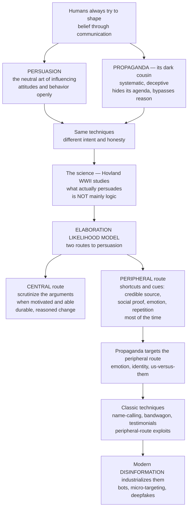

# 📢 Propaganda and Persuasion

> [!abstract] TL;DR
> **Persuasion** is the broad, ethically-neutral art of shaping attitudes, beliefs, and behavior through communication; **propaganda** (Jowett & O'Donnell: *"the deliberate, systematic attempt to shape perceptions, manipulate cognitions, and direct behavior to achieve a response that furthers the desired intent of the propagandist"*) is its dark cousin — one-sided, often deceptive, source-concealing, and manipulative. Both use the *same tools*; they differ in **intent and honesty**. Decades of research (starting with Hovland's WWII morale-film studies) show that what actually moves people is usually *not* logic. The key framework is the **Elaboration Likelihood Model**: the effortful **central route** (scrutinizing arguments, when motivation and ability are high) yields durable change, but most of the time we travel the **peripheral route** — swayed by cues like source credibility, social proof, emotion, and sheer repetition. Propaganda's classic techniques (name-calling, bandwagon, glittering generalities) are essentially peripheral-route exploits — and modern **disinformation** industrializes them at massive scale through bots, micro-targeting, and deepfakes.

---

## Intuition

**Analogy — the same lockpick, in a locksmith's hand or a burglar's.** From ancient orators in the agora, to WWII recruitment posters, to today's micro-targeted political ads and social-media influence operations, humans have always tried to *systematically shape what others believe and do* through communication. The set of tools is remarkably stable — a credible voice, a repeated slogan, a fear appeal, an in-group flag. What changes is who holds them and why.

**Persuasion** is the neutral craft: a doctor convincing you to quit smoking, a lawyer arguing a case, an ad selling shoes. Ideally it appeals to your reason and interests *openly*. **Propaganda** is that craft turned manipulative — it *hides* its agenda, *conceals* its source, *bypasses* your reason, and *exploits* your emotions and biases to serve the propagandist rather than you. The technique alone cannot tell the two apart; the difference is **intent and honesty**.

What makes this a *science*? During WWII, Carl Hovland's team studied whether the U.S. Army's *Why We Fight* films actually changed soldiers' attitudes — and mapped, experimentally, what makes a message persuasive. The uncomfortable finding: it is usually *not* the strength of the argument. The most important framework to emerge, the **Elaboration Likelihood Model** (Petty & Cacioppo), says people process persuasive messages by two "routes." On the **central route** you think hard about the actual arguments — used only when you are *motivated and able* to concentrate — and the resulting attitude change is durable and reasoned. But most of the time you are on the **peripheral route**: you do not scrutinize the argument at all; you are nudged by shortcuts — *who* is speaking (a credible, attractive, authoritative source), *how many others* agree (social proof), *how it makes you feel* (fear, anger, hope), and *how often you have heard it* (repetition).

This is exactly *why propaganda works*: it aims at the peripheral route — emotion, identity, us-versus-them, endless repetition — rather than at argument. The classic propaganda devices (name-calling, bandwagon, glittering generalities, testimonials, card-stacking, transfer, plain-folks) are, in modern terms, peripheral-route exploits. And it is more relevant than ever: computational propaganda industrializes these age-old techniques at massive scale and personalized precision. Understanding propaganda and persuasion is understanding the *mechanics of influence* — how minds are moved by communication, for good and for ill — and it is the essential armor for resisting manipulation.

---

## How It Works

Persuasion research asks *which variables make a message change attitudes*, and organizes them along Lasswell's classic line — **who** says **what** to **whom**:

1. **Source factors** — **credibility** (expertise + trustworthiness), attractiveness, authority, and similarity. High-credibility sources persuade more — but the **sleeper effect** shows that over time a message can detach from a discounted source and *gain* impact.
2. **Message factors** — one-sided versus two-sided appeals, **fear appeals** (which help up to a point, then backfire without an actionable remedy), emotional versus rational framing, order effects (primacy/recency), and above all **repetition**.
3. **Audience/receiver factors** — prior attitudes, personal involvement, **need for cognition**, and susceptibility. The *same* message persuades different people through different routes.

The unifying engine is the **dual-process** account. The **Elaboration Likelihood Model** (and its sibling, the Heuristic-Systematic Model) says a receiver's **elaboration likelihood** — their *motivation and ability* to think hard — decides which route dominates. High elaboration engages the **central route**, where **argument quality** is decisive: strong arguments persuade and produce resistant change; weak arguments *boomerang*. Low elaboration engages the **peripheral route**, where **cues** decide: source credibility and likability, social proof, message length, emotion, and repetition move you regardless of argument quality — producing change that is faster but weaker and less stable. **Cialdini's six principles of influence** — reciprocity, commitment/consistency, social proof, authority, liking, scarcity — are, in effect, six reliable peripheral-route triggers.

**Propaganda** deliberately engineers *low elaboration* and then floods the peripheral route: it raises emotion and tribal identity (so you *cannot* think coolly), lowers ability (via speed, volume, and complexity), and repeats until the claim feels true — the **illusory-truth effect**. Its transparency is classified by source: **white** (openly attributed), **grey** (source unclear), and **black** (falsely attributed to a hidden or enemy source).



---

## Key Concepts

### Secondary (intuitive level)
- **Persuasion** = trying to change what someone thinks or does through messages; a normal, neutral human activity (ads, speeches, everyday requests).
- **Propaganda** = persuasion turned manipulative — one-sided, often deceptive, and hiding who is really behind it and why.
- They use the *same tricks*; what separates them is **honesty and intent**.
- We are moved less by logic than by **who says it, how many agree, how it makes us feel, and how often we hear it**.
- Classic propaganda devices: **name-calling, bandwagon** ("everyone's doing it"), **glittering generalities** (vague noble words), **testimonials, plain-folks, card-stacking** (cherry-picking facts), **transfer**.

### Undergraduate (working level)
- **Two routes to persuasion (ELM):** the **central route** (effortful scrutiny of argument quality → durable, resistant attitudes) versus the **peripheral route** (cues and heuristics → fast, fragile change). Which one operates depends on the receiver's **motivation and ability** to elaborate.
- **Source–Message–Receiver variables:** source **credibility** = expertise + trustworthiness; the **sleeper effect**; the **fear-appeal curve**; one- versus two-sided messages; primacy/recency.
- **Cialdini's six principles:** reciprocity, commitment/consistency, social proof, authority, liking, scarcity — reliable peripheral-route levers.
- **Attitude-change theory:** cognitive dissonance (Festinger), balance theory, and **inoculation theory** (a weakened counter-argument builds resistance — the basis of "prebunking").
- **White / grey / black propaganda** classified by source transparency; **illusory-truth effect** (repetition raises perceived truth regardless of accuracy).

### Graduate (theoretical level)
- **Dual-process integration:** ELM versus the Heuristic-Systematic Model; multiple roles of a single variable (a source cue can serve as argument, peripheral cue, *or* bias elaboration depending on context) — the core theoretical subtlety of Petty & Cacioppo's framework.
- **Historiography of the field:** the "magic bullet / hypodermic needle" era and its overturning by limited-effects research; Lippmann's *Public Opinion* and Lasswell's propaganda analysis; Bernays and the professionalization of PR; the Institute for Propaganda Analysis and its seven devices; the Yale (Hovland) attitude-change program as the birth of *experimental* persuasion science.
- **Modern computational propaganda:** astroturfing, troll farms, bot amplification, micro-targeted messaging, and generative deepfakes as *industrialization* of peripheral-route exploitation at scale and precision; the **firehose of falsehood** and **whataboutism** as volume/relativization strategies.
- **Defenses as applied theory:** inoculation/prebunking (attitudinal immunization), media literacy, fact-checking, and friction — and their limits (the continued-influence effect, backfire debates, and the asymmetry between producing and refuting falsehoods — Brandolini's law).
- **Ethics:** the autonomy-based line between legitimate persuasion and manipulation (bypassing versus engaging rational agency); deception, consent, and the differing status of propaganda in democracies versus authoritarian regimes.

---

## Python Demo

```python
# Propaganda & persuasion, quantified two ways:
#   (a) ELM TWO ROUTES: for HIGH-elaboration receivers, argument STRENGTH drives
#       persuasion (steep line); for LOW-elaboration receivers, argument quality
#       barely matters — persuasion is set by a PERIPHERAL cue (source credibility),
#       producing near-flat lines that CROSS the central-route line.
#   (b) ILLUSORY-TRUTH / REPETITION: repeated exposure raises a claim's PERCEIVED
#       truth regardless of accuracy — why repetition is propaganda's core tool —
#       and how inoculation/prebunking flattens the false claim's rise.
import numpy as np
import matplotlib.pyplot as plt

# ---------- (a) Elaboration Likelihood Model: central vs peripheral -----------
arg = np.linspace(0.0, 1.0, 200)          # argument strength: weak (0) -> strong (1)

# High elaboration: persuasion tracks ARGUMENT STRENGTH (steep slope)
high_elab = 0.50 + 0.55 * (arg - 0.5)

# Low elaboration: persuasion is nearly FLAT in argument strength; its LEVEL is
# set by the peripheral SOURCE-CREDIBILITY cue.
low_elab_credible    = 0.72 + 0.05 * (arg - 0.5)   # credible source -> high, flat
low_elab_noncredible = 0.30 + 0.05 * (arg - 0.5)   # non-credible source -> low, flat

# ---------- (b) Illusory-truth effect: perceived truth vs repetitions ----------
n = np.arange(0, 11)                       # number of exposures to the claim

def perceived_truth(exposures, baseline, k=0.45, ceiling=0.95):
    """Saturating rise in perceived truth with repeated exposure."""
    return baseline + (ceiling - baseline) * (1 - np.exp(-k * exposures))

true_claim       = perceived_truth(n, baseline=0.45)              # a TRUE claim
false_claim      = perceived_truth(n, baseline=0.15)              # a FALSE claim, uncorrected
false_inoculated = 0.15 + (0.40 - 0.15) * (1 - np.exp(-0.45 * n)) # prebunked: muted ceiling

# ---------- Plots -------------------------------------------------------------
fig, ax = plt.subplots(1, 2, figsize=(12, 4.6))

ax[0].plot(arg, high_elab, color="#059669", lw=2.4,
           label="High elaboration (central: argument strength rules)")
ax[0].plot(arg, low_elab_credible, color="#d97706", lw=2.4,
           label="Low elaboration + credible source (peripheral)")
ax[0].plot(arg, low_elab_noncredible, color="#b45309", lw=2.0, ls="--",
           label="Low elaboration + non-credible source (peripheral)")
# crossover: where strong arguments overtake a credible-source cue
cross = arg[np.argmin(np.abs(high_elab - low_elab_credible))]
ax[0].axvline(cross, color="gray", ls=":")
ax[0].annotate("crossover: strong arguments\nbeat the source cue",
               xy=(cross, 0.75), xytext=(0.18, 0.88),
               arrowprops=dict(arrowstyle="->"), fontsize=8)
ax[0].set_title("ELM: two routes to persuasion")
ax[0].set_xlabel("argument strength (weak -> strong)")
ax[0].set_ylabel("attitude change / persuasion")
ax[0].set_ylim(0, 1); ax[0].legend(fontsize=7.5, loc="lower right")

ax[1].plot(n, true_claim,  color="#2563eb", lw=2.4, marker="o", label="True claim")
ax[1].plot(n, false_claim, color="#dc2626", lw=2.4, marker="s",
           label="False claim (uncorrected)")
ax[1].plot(n, false_inoculated, color="#7c3aed", lw=2.0, ls="--", marker="^",
           label="False claim + inoculation / prebunk")
ax[1].set_title("Illusory-truth effect: repetition raises perceived truth")
ax[1].set_xlabel("number of exposures (repetition)")
ax[1].set_ylabel("perceived truth of the claim")
ax[1].set_ylim(0, 1); ax[1].legend(fontsize=7.5, loc="lower right")

plt.tight_layout()
plt.show()

# Key readings:
#  - Left: for WEAK arguments the credible-source (peripheral) receiver is MORE
#    persuaded than the argument-scrutinizing (central) receiver; only STRONG
#    arguments let the central route overtake the source cue -> the ELM crossover.
#  - Right: a FALSE claim's perceived truth climbs with sheer repetition, nearly
#    tracking a true claim -> exactly the mechanism propaganda exploits; prebunking
#    (inoculation) lowers the ceiling of that rise.
print(f"ELM crossover at argument strength ~ {cross:.2f}")
print(f"False claim perceived truth: {false_claim[0]:.2f} at 0 reps "
      f"-> {false_claim[-1]:.2f} at 10 reps")
```

The left panel makes the ELM's signature *interaction* concrete: argument quality dominates only for **high-elaboration** receivers, while **low-elaboration** receivers are moved by the **source cue** almost independently of how good the arguments are. The right panel shows why **repetition** is propaganda's workhorse — a *false* claim gains believability with every exposure, nearly shadowing a true one, unless the audience has been **inoculated** in advance.

---

## Real-World Applications

- **Advertising and PR.** Edward Bernays applied his uncle Freud's psychology to sell products and ideas — reframing bacon-and-eggs as "the all-American breakfast" via doctors' testimonials (source-credibility cue) and cigarettes as women's "torches of freedom" (identity appeal). Modern brand advertising runs almost entirely on the peripheral route: attractive spokespeople, celebrity liking, and repetition.
- **Wartime and state propaganda.** The U.S. *Why We Fight* films (studied by Hovland), Britain's "Keep Calm and Carry On," Nazi Germany's Goebbels apparatus, and Soviet agitprop all engineered emotion, identity, and repetition rather than argument — canonical black/grey/white propaganda.
- **Political campaigns.** Slogans engineered for repetition, fear-and-hope framing, endorsement (authority) cues, and bandwagon "momentum" narratives are peripheral-route persuasion at national scale — the media/psychology counterpart to political communication.
- **Computational propaganda and influence operations.** Troll farms (e.g., the Internet Research Agency), bot amplification, and micro-targeted messaging industrialize the classic devices: astroturfing manufactures fake social proof, deepfakes fabricate source credibility, and the "firehose of falsehood" weaponizes volume and repetition (illusory truth) at personalized precision.
- **Public-health and anti-manipulation defenses.** Inoculation "prebunking" games (e.g., *Bad News*, *Go Viral!*) deliberately expose people to weakened doses of manipulation techniques to build resistance — attitude-change theory turned into a vaccine against propaganda.

---

## Common Pitfalls

- **Treating "propaganda" as merely "messages I disagree with."** Propaganda is defined by its *systematic, deceptive, source-concealing, one-sided* character serving the sender's agenda — not by whether *you* like the conclusion. True statements can be propaganda (selective card-stacking), and disagreeable messages can be honest persuasion. Judge by intent and honesty, not by side.
- **Assuming better arguments always win.** The ELM shows argument quality matters *only* when the audience is motivated and able to think. For low-elaboration audiences — the majority, most of the time — a credible or likable source, social proof, and repetition dominate. Debunking with facts alone often fails.
- **Believing you are immune ("third-person effect").** People systematically judge propaganda as affecting *others* more than themselves, which lowers their guard. Peripheral cues work precisely because they operate *below* deliberate scrutiny.
- **Overrating a single exposure; underrating repetition.** The illusory-truth effect means a falsehood repeated across sources and time gains believability even when initially disbelieved and even when you *know better*. Volume and familiarity, not novelty, are propaganda's compounding tools.
- **Assuming fact-checking automatically fixes belief.** The *continued-influence effect* means corrections often fail to fully erase a false belief, and by Brandolini's law refuting nonsense costs far more effort than producing it — which is why *prebunking* (inoculation) frequently beats debunking.
- **Collapsing persuasion and manipulation.** Not all influence is illegitimate. The ethical line is autonomy: persuasion that *engages* your reason respects you; manipulation that *bypasses* it — through concealment, emotional exploitation, or false urgency — does not.

---

## Related Concepts

- [[Media_Propaganda_and_Political_Communication]] — the political-science / political-communication view of propaganda (state messaging, campaigns, framing of public opinion); this note is the complementary *media and psychology of persuasion* view.
- [[Persuasion_and_Audience]] — the rhetorical tradition (ethos/pathos/logos, audience adaptation) that persuasion science later operationalized; propaganda techniques are rhetoric turned manipulative.
- [[Political_and_Public_Rhetoric]] — how public oratory and political speech deploy persuasive appeals; the ancestral form of modern political propaganda.
- [[Classical_Rhetoric_and_Aristotle]] — Aristotle's ethos (source credibility), pathos (emotion), and logos (argument) map directly onto ELM's peripheral cues versus central route.
- [[Attitudes_and_Persuasion]] — the psychology of attitude change, the ELM, cognitive dissonance, and Cialdini's principles in full; the mechanistic core beneath propaganda.
- [[Social_Influence_and_Conformity]] — conformity, obedience, and social proof — the group-level forces propaganda mobilizes (bandwagon, us-versus-them).
- [[Cognitive_Biases]] — the mental shortcuts (availability, anchoring, confirmation) that peripheral-route persuasion and propaganda exploit.
- [[Confirmation_Bias_and_Motivated_Reasoning]] — why identity-consistent propaganda is accepted uncritically while counter-evidence is resisted.

Within this vault, propaganda and persuasion connect in prose to the sibling topics of mass communication and media effects, agenda-setting/priming/framing, advertising and the attention economy, misinformation/disinformation and fake news, and media literacy and critical consumption — together forming the study of how mediated messages move minds and how audiences can defend against manipulation.

---

## Review Questions

**Tier 1 — Conceptual (explain to a peer):**
1. Two messages use the exact same technique — a celebrity endorsement. One is an honest ad; one is covert propaganda. If the technique is identical, what actually distinguishes persuasion from propaganda? Give the defining features.
2. Explain the difference between the **central** and **peripheral** routes of the Elaboration Likelihood Model, and why propaganda usually targets the peripheral route.

**Tier 2 — Applied (analyze / reason):**
3. A campaign floods social media with a catchy, repeated false slogan attributed to no clear source, amplified by bot accounts. Name the specific mechanisms in play (source concealment, social proof, illusory truth) and, using the ELM, predict *which* audiences it will most effectively move and why.
4. You must design a countermeasure to a viral piece of disinformation. Compare **debunking** (fact-checking after the fact) with **inoculation/prebunking**. Which does research favor, and why does the continued-influence effect matter to your choice?

**Tier 3 — Theoretical (deep understanding):**
5. In the ELM, a single variable (say, an expert source) can act as a peripheral cue, as an argument, *or* as a factor that biases elaboration — depending on context. Construct an example of each role for the *same* source, and explain what this multiplicity implies for predicting a message's effect.
6. Where, precisely, is the ethical line between legitimate persuasion and manipulation? Defend an autonomy-based criterion, then test it against a hard case (e.g., a fear-based public-health campaign that saves lives by bypassing careful deliberation).

---

## Sources

- Jowett, G. S. & O'Donnell, V. (2018). *Propaganda & Persuasion* (7th ed.). SAGE. (source of the standard definition of propaganda and the white/grey/black taxonomy)
- Petty, R. E. & Cacioppo, J. T. (1986). *Communication and Persuasion: Central and Peripheral Routes to Attitude Change.* Springer-Verlag. (the Elaboration Likelihood Model)
- Cialdini, R. B. (2021). *Influence: The Psychology of Persuasion* (new & expanded ed.). Harper Business. (the six principles of influence)
- Pratkanis, A. R. & Aronson, E. (2001). *Age of Propaganda: The Everyday Use and Abuse of Persuasion* (rev. ed.). Henry Holt. (propaganda techniques and defenses)
- Hovland, C. I., Lumsdaine, A. A. & Sheffield, F. D. (1949). *Experiments on Mass Communication* (Studies in Social Psychology in World War II, Vol. 3). Princeton University Press. (the *Why We Fight* attitude-change studies that founded persuasion science)

---

#media-studies #propaganda #persuasion #elaboration-likelihood-model #influence
