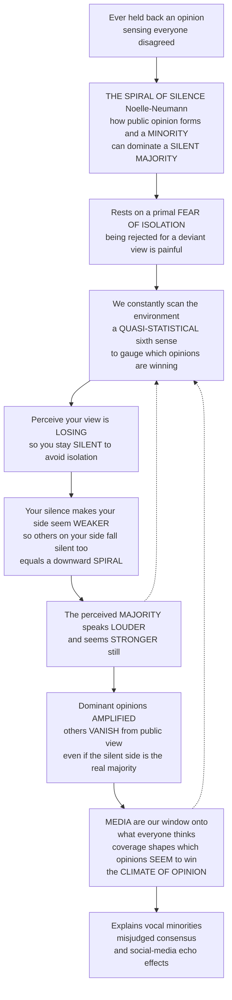

# 🤐 Spiral of Silence and Public Opinion

> [!abstract] TL;DR
> The **spiral of silence** (Elisabeth Noelle-Neumann, 1974) is a theory of how public opinion forms — and how a *vocal minority can come to dominate discourse while a silent majority hides*. It rests on one deep fact about human nature: we carry a primal **fear of isolation**, so we constantly, half-consciously scan our social surroundings with a **quasi-statistical sense** to gauge which opinions are winning and which are falling out of favor. If you perceive your view to be in the **minority or declining**, you tend to fall **silent** to avoid rejection — and your silence makes your side *look* even weaker, which silences others on your side too, in a self-reinforcing **spiral**. Meanwhile the perceived majority, feeling safe, speaks up *more* loudly and seems stronger still. The result: publicly dominant opinions get amplified and others vanish from view *even when the silent side is the real majority*. And because the **mass media** are our main window onto "what everyone thinks," media coverage powerfully shapes the perceived **climate of opinion** that triggers the whole spiral — which is why this is a foundational theory of media power over public opinion.

---

## Intuition

**Analogy — the party where nobody admits they hate the music.** Have you ever held back an opinion in a group because you sensed everyone else disagreed, and you did not want to be the odd one out? Imagine a party where, in truth, most guests dislike the blaring music — but each *thinks* they are the only one. A few enthusiastic fans keep cheering, so everyone looks around, sees the cheering, assumes "the room loves this," and quietly says nothing. Their silence is itself a signal: it makes the room look even more pro-music, which makes the doubters even *less* willing to be the first to complain. The music stays on all night, "by popular demand" — a demand that never actually existed. That is the **spiral of silence** in miniature.

Now scale that party up to an entire society, and add a loudspeaker — the **mass media** — that tells everyone what "the room" supposedly thinks. We have a **primal fear of isolation**: being socially rejected for an unpopular view is genuinely painful, so we run a constant, unconscious survey of our environment — Noelle-Neumann's **quasi-statistical sense**, a kind of social sixth sense — to read which way the wind is blowing. Feel your side *winning* and you speak up; feel it *losing* and you go quiet. Multiply that individual instinct across millions of people, all reading the same media-shaped climate, and you get a runaway feedback loop in which the *perceived* majority grows louder and the *perceived* minority disappears from public view — regardless of what people privately believe.

---

## How It Works

### Core mechanics

1. **The engine — fear of isolation.** Noelle-Neumann grounds the theory in a fundamental social motive documented by conformity research: people fear the pain of social rejection more than they value being right. Holding a *deviant* opinion out loud risks isolation, and the threat of isolation is enough to shape behavior even before any real punishment arrives. This is the theory's non-negotiable premise — take away the fear of isolation and the spiral does not turn.

2. **The sensor — the quasi-statistical sense.** To know *when* their view is safe to express, individuals continuously monitor the social environment, estimating the **distribution and the trend** of opinion: which views are majority vs minority, and — crucially — which are *gaining* vs *losing* ground. This "quasi-statistical" organ is impressionistic and error-prone, but it is running all the time, mostly below awareness.

3. **The decision — willingness to speak.** Expression is conditional on that reading. Those who perceive their view as **dominant or rising** speak out with confidence; those who perceive it as **minority or declining** engage in **self-censorship** and stay silent. Note the theory is about *public expression*, not private belief: opinions do not change, but which ones are *voiced* does.

4. **The spiral — a positive feedback loop.** Here is the runaway step. The silence of the perceived-minority removes their voices from the environment, so the *next* person who scans the climate sees their side as weaker still — and falls silent too. Simultaneously the perceived-majority, feeling emboldened, speaks *more*, appearing even stronger. Silence begets silence; loudness begets loudness. One opinion becomes publicly dominant and the other publicly muted, and the gap widens each round — a self-reinforcing spiral, not a stable balance.

5. **The twist — the loud side may not be the real majority.** Because everyone reads the *voiced* climate rather than the true distribution, the process can crown a **perceived majority that is actually a minority**, while the genuine majority sits silent (a state overlapping with **pluralistic ignorance** — everyone privately disagrees yet each thinks they are alone).

6. **The brake — the "hard core" and the avant-garde.** Not everyone is equally afraid. A committed **hard core** — activists, zealots, the avant-garde — speak *regardless* of the climate because they are immune to (or defiant of) isolation. A sufficiently visible hard core can keep a minority view alive and even **seed a counter-spiral** that reverses the whole process.

7. **The amplifier — the mass media.** Most people cannot poll society directly; they *infer* "what everyone thinks" largely from the media. So the media supply the raw material for the quasi-statistical sense. Three media properties make this decisive: **articulation** (media give people the words and the sense of who is winning), **consonance** (different outlets speaking with one voice, so the same climate is seen everywhere), and **cumulation** (relentless repetition over time). Together they let media portray a **climate of opinion** that can *trigger and steer* the spiral — potentially manufacturing a perceived consensus.

### Flow / architecture



---

## Key Concepts

### Secondary (intuitive foundations)
- **Fear of isolation:** we do not like being the odd one out, so we often keep an unpopular opinion to ourselves rather than risk rejection.
- **The spiral:** when your side seems to be *losing*, you go quiet; your quietness makes your side seem to be losing even more, so more people go quiet — round and round.
- **Loud vs true majority:** the opinion that *looks* most popular is just the one people are most willing to *say* out loud — it may not be what most people actually believe.
- **Public opinion vs private belief:** what a society is *willing to say* can differ sharply from what its members privately think.
- **Media as the loudspeaker:** because we learn "what everyone thinks" mostly from the news and social media, whoever shapes the coverage shapes which opinions seem to be winning.

### Undergraduate (mechanisms and evidence)
- **Public opinion as social control (Noelle-Neumann's conception):** opinions are "public" in the sense that they can be *expressed in public without risking isolation*; public opinion is the set of views one may voice safely, and it functions as a mechanism of social control that pressures deviants toward conformity or silence.
- **The quasi-statistical sense:** the perceptual organ by which people estimate the *distribution* and, above all, the *trend* of opinion — the direction of change matters more than the current level.
- **Willingness to speak out:** the classic operationalization was the **"train test"** — would you discuss this issue with a stranger on a long train ride? — used to measure how climate perception governs expression.
- **The dual climate:** people track two things at once — the *current* majority and the *future* trend. When these conflict, the perceived *trend* tends to win, which is why a rising minority can embolden its supporters.
- **Hard core and avant-garde:** the isolation-immune committed few who keep speaking and can nucleate a reversal — the theory's built-in escape valve.
- **Media articulation, consonance, and cumulation:** the three properties through which mass media set the perceived climate and give the silent a language (or deny them one).

### Graduate (theory, contestation, and the digital turn)
- **Pluralistic ignorance and false consensus:** the spiral produces (and is fed by) systematic *misperception* — pluralistic ignorance (privately common views mistaken for rare) and false-consensus effects (overprojecting one's own view). Lippmann's "**pictures in our heads**" is the pre-history: we act on a media-built *pseudo-environment*, not reality itself.
- **Boundary conditions and the "issue" problem:** effects are strongest for **moral/controversial** issues with a clear normative charge, and weakest for technical or taste issues; strength also depends on the availability of supportive **reference groups**.
- **Individual-difference critiques:** meta-analyses find modest, inconsistent effects. Willingness to speak is heavily moderated by **issue involvement, personality, communication apprehension, and reference-group support** — for many people these matter more than a universal isolation fear, and some speak *regardless* of climate.
- **Cross-cultural variation:** the isolation motive and its threshold vary across cultures (individualist vs collectivist), complicating any claim to a universal law.
- **Methodological debates:** reliance on hypothetical willingness-to-speak measures, the direction of causation, and whether *perceived* climate is measured independently of one's own opinion (the "looking-glass perception," where people project their own view onto the majority).
- **Refinements and the digital turn:** the theory's *core* — expression conditioned on perceived climate — has proven durable and now anchors research on **online self-censorship**, echo chambers, and manufactured consensus.

---

## Python Demo

```python
# The spiral of silence as a positive-feedback opinion dynamic.
#
#   (a) THE RUNAWAY SPIRAL: with true opinion near 50-50 (here the silent side is
#       actually the MAJORITY), a small initial perceived edge for one side spirals
#       into near-total public dominance -- VOICED opinion diverges from TRUE opinion.
#   (b) MEDIA CLIMATE TIPPING: the SAME true 50-50 split spirals toward whichever
#       side the MEDIA portray as winning -- media tip the spiral either way.
#   (c) HARDCORE HOLDOUTS: a committed minority that speaks regardless of climate
#       can halt and even REVERSE a spiral (seed a counter-spiral).
import numpy as np
import matplotlib.pyplot as plt

def simulate_spiral(N=4000, p_A_true=0.50, rounds=30, init_climate=0.50,
                    media_signal=None, media_weight=0.0,
                    hardcore_A=0.0, hardcore_B=0.0, seed=0):
    """Return (voiced_A_over_rounds, true_A) for a spiral-of-silence run.

    o        : true opinion, 1 = side A, 0 = side B (p_A_true = fraction on A).
    theta    : each person's ISOLATION THRESHOLD -- they speak only if the PERCEIVED
               support for their OWN side is at least theta (fear of isolation ->
               silence when your side seems to be losing).
    climate  : perceived fraction VOICING side A, updated each round from what is
               actually SAID (not from the true distribution).
    media    : if media_signal is set, blend it into the perceived climate with
               weight media_weight (the media-portrayed 'climate of opinion').
    hardcore : a fraction of each side who speak REGARDLESS of the climate.
    """
    rng = np.random.default_rng(seed)
    o = (rng.random(N) < p_A_true).astype(int)
    theta = rng.uniform(0.20, 0.80, N)                 # spread of isolation tolerance

    hardcore = np.zeros(N, dtype=bool)
    idx_A, idx_B = np.where(o == 1)[0], np.where(o == 0)[0]
    hardcore[rng.choice(idx_A, int(hardcore_A * idx_A.size), replace=False)] = True
    hardcore[rng.choice(idx_B, int(hardcore_B * idx_B.size), replace=False)] = True

    true_A = o.mean()
    climate = init_climate
    history = []
    for _ in range(rounds):
        perceived_A = climate if media_signal is None \
            else (1 - media_weight) * climate + media_weight * media_signal
        # perceived support for each person's OWN side
        perceived_own = np.where(o == 1, perceived_A, 1.0 - perceived_A)
        speaks = (perceived_own >= theta) | hardcore
        n_voiced = speaks.sum()
        voiced_A = (o[speaks] == 1).mean() if n_voiced > 0 else climate
        climate = voiced_A                              # feedback: climate <- what was said
        history.append(voiced_A)
    return np.array(history), true_A

fig, ax = plt.subplots(1, 3, figsize=(16, 4.6))
r = np.arange(1, 31)

# (a) Runaway spiral: silent side is the TRUE MAJORITY, yet loses the public square
voiced, true = simulate_spiral(p_A_true=0.45, init_climate=0.60, seed=1)
ax[0].plot(r, voiced, color="#c0392b", lw=2.5, label="VOICED support for A")
ax[0].axhline(true, color="#2c3e50", ls="--", lw=2, label=f"TRUE support for A = {true:.2f}")
ax[0].axhline(1 - true, color="#7f8c8d", ls=":", lw=1.5, label="TRUE support for B (real majority)")
ax[0].set_ylim(0, 1); ax[0].set_xlabel("Round"); ax[0].set_ylabel("Fraction voicing A")
ax[0].set_title("(a) Runaway spiral: loud minority buries\na silent majority")
ax[0].legend(fontsize=7, loc="center right")

# (b) Media tips an EXACTLY 50-50 society either way
v_up,  _ = simulate_spiral(p_A_true=0.50, init_climate=0.50,
                           media_signal=0.80, media_weight=0.30, seed=2)
v_dn,  _ = simulate_spiral(p_A_true=0.50, init_climate=0.50,
                           media_signal=0.20, media_weight=0.30, seed=2)
ax[1].plot(r, v_up, color="#2980b9", lw=2.5, label="Media portray A as winning")
ax[1].plot(r, v_dn, color="#16a085", lw=2.5, label="Media portray B as winning")
ax[1].axhline(0.50, color="#2c3e50", ls="--", lw=2, label="TRUE split = 50-50 (both runs)")
ax[1].set_ylim(0, 1); ax[1].set_xlabel("Round"); ax[1].set_ylabel("Fraction voicing A")
ax[1].set_title("(b) Media climate tips the SAME\n50-50 society either way")
ax[1].legend(fontsize=7, loc="center right")

# (c) A hardcore minority halts and reverses the spiral
v_none, _ = simulate_spiral(p_A_true=0.50, init_climate=0.70, hardcore_B=0.00, seed=3)
v_hard, _ = simulate_spiral(p_A_true=0.50, init_climate=0.70, hardcore_B=0.30, seed=3)
ax[2].plot(r, v_none, color="#c0392b", lw=2.5, label="No hardcore: A dominates")
ax[2].plot(r, v_hard, color="#8e44ad", lw=2.5, label="B hardcore 30%: spiral reverses")
ax[2].axhline(0.50, color="#2c3e50", ls="--", lw=1.5, label="TRUE split = 50-50")
ax[2].set_ylim(0, 1); ax[2].set_xlabel("Round"); ax[2].set_ylabel("Fraction voicing A")
ax[2].set_title("(c) A committed hardcore can\nseed a counter-spiral")
ax[2].legend(fontsize=7, loc="center right")

plt.tight_layout()
plt.savefig("spiral_of_silence.png", dpi=120)
print("Panel (a) final voiced A:", round(float(voiced[-1]), 3),
      "| true A:", round(float(true), 3))
print("Panel (b) final voiced A  up/down:", round(float(v_up[-1]), 3),
      "/", round(float(v_dn[-1]), 3))
print("Panel (c) final voiced A  none/hardcore:", round(float(v_none[-1]), 3),
      "/", round(float(v_hard[-1]), 3))
```

Panel (a) is the core result: even though side B is the *true* 55% majority, a small initial perceived edge for A spirals into near-total public dominance for A — the **voiced** opinion pulls sharply away from the **true** opinion, and the real majority goes silent. Panel (b) shows the media's power: an *exactly* 50-50 society is a knife-edge, and the media-portrayed climate tips it decisively toward whichever side the coverage frames as winning. Panel (c) shows the escape valve — a committed **hard core** of 30% on side B, speaking regardless of the climate, halts the spiral and seeds a counter-spiral that reverses it, while without them side A runs away to dominance.

---

## Real-World Applications

- **Vocal minorities dominating discourse:** on contested issues, a small, intense, isolation-immune faction can make its view *seem* to be the consensus, while a larger, more ambivalent majority stays quiet — the spiral explains how "the loudest voices in the room" become mistaken for the room.
- **Misjudging how common your views are:** the theory predicts systematic **pluralistic ignorance** — students overestimating peers' comfort with heavy drinking, employees each privately doubting a strategy but assuming everyone else supports it, citizens misreading how many neighbors share their (actually common) opinion.
- **Election and referendum "bandwagons":** perceived momentum in polls and coverage feeds willingness to declare support; late deciders drift toward whoever looks to be *winning*, and "shy" voters under-report unpopular preferences — a spiral-of-silence reading of polling error.
- **Social media and self-censorship:** studies of online expression find people withhold opinions they believe are minority views, especially fearing **pile-ons, backlash, or "cancellation."** Visible metrics (likes, retweets, follower counts) supercharge the quasi-statistical sense, so a few viral extreme posts can manufacture a *false impression of consensus* while moderate majorities stay silent.
- **Astroturfing and manufactured climates:** because the spiral keys off *perceived* rather than real support, coordinated bots, sock-puppets, and paid "grassroots" campaigns can fake a winning climate to trigger a genuine spiral — weaponizing the theory.
- **Newsroom and platform design:** whether outlets report opinion as settled ("most experts agree") or contested, and whether platforms surface engagement counts, materially shapes which side feels safe to speak — a direct lever on the climate of opinion.

---

## Common Pitfalls

- **Treating the loud majority as the real majority.** The theory's central warning is that *voiced* opinion can diverge sharply from *held* opinion; reading public silence as agreement (or public noise as consensus) is exactly the error the spiral produces.
- **Forgetting the hard core.** Spirals are not destiny. A committed, isolation-immune minority can hold ground and reverse the trend; models and pundits that omit hard cores overpredict runaway consensus.
- **Assuming a universal, constant fear of isolation.** Effects are moderated by issue type (strong for moral/controversial issues, weak for technical ones), personality, culture, and the availability of supportive reference groups — the mechanism is conditional, not a physical law.
- **Confusing the spiral of silence with simple conformity.** Asch-style conformity is about *changing (or reporting)* a judgment under pressure; the spiral is specifically about *withholding expression* based on the perceived **trend** of opinion, aggregated into a society-level feedback loop over time.
- **Ignoring the looking-glass bias in the measurement.** People tend to project their own opinion onto the perceived majority (false consensus), so studies that infer "climate perception" carelessly can mistake projection for perception and inflate the effect.
- **Assuming digital media only amplify silence.** Anonymity, niche communities, and the ease of finding like-minded others can *embolden* minority voices and break spirals — online, the theory cuts both ways, and which direction wins is an empirical question, not a given.

---

## Related Concepts

- [[Public_Opinion_and_Political_Socialization]] — the **political-science** treatment of how mass opinion forms, is measured, and is socialized; this note is the **media/communication** companion, focused specifically on the *expression* dynamics and the media-built climate that the political-science view brackets.
- [[Media_Propaganda_and_Political_Communication]] — how media, propaganda, and platforms shape political belief; the spiral of silence is one of its key mechanisms for *manufacturing* a perceived consensus.
- [[Social_Influence_and_Conformity]] — the Asch/social-proof foundations; the fear of isolation that powers the spiral is the same social force studied as conformity, but here aggregated into a society-wide feedback loop.
- [[Group_Dynamics]] — groupthink, majority/minority influence, and the social pressures on dissent that operate at the small-group scale beneath the mass-society spiral.
- [[Cognitive_Biases]] — the **false-consensus effect** and looking-glass perception through which individuals misjudge the true distribution of opinion, both feeding and resulting from the spiral.
- [[Collective_Behavior_and_Crowds]] — the sociology of bandwagons, cascades, and emergent norms that share the spiral's self-reinforcing, climate-driven logic.
- [[Culture_Norms_Values_and_Ideology]] — how norms exert social control and mark some views as "sayable" and others as deviant — the normative substrate that decides what a silence is *about*.
- [[Feedback_Loops_and_Causality]] — the spiral is a textbook **positive (reinforcing) feedback loop**; this note supplies the general systems grammar for why small perturbations run away.
- [[Bifurcations_and_Tipping_Points]] — the 50-50 knife-edge in the demo is an unstable equilibrium; a tiny media nudge tips the system into one basin or the other, the dynamical-systems view of the spiral.

Within this vault, the spiral of silence sits alongside the broader survey in *Mass_Communication_and_Media_Effects* and complements *Agenda_Setting_Priming_and_Framing* (the media set *which* issues and *how* they are framed; the spiral governs *who dares to speak* about them). It also connects to *Media_and_Democracy_the_Public_Sphere* (a distorted climate of opinion corrodes deliberation), *Attention_Filter_Bubbles_and_Echo_Chambers* (algorithmic curation reshapes the perceived climate), and *Social_Media_and_Networked_Communication* (visible metrics and pile-ons as a modern engine of self-censorship).

---

## Review Questions

1. **(Secondary)** In your own words, explain why one person staying silent about an unpopular opinion can make *other* people with the same opinion also stay silent. Why can the opinion that seems most popular be different from what most people actually believe?
2. **(Secondary)** Give an everyday example (school, work, or social media) where you think a "spiral of silence" is operating. Who is the loud side, who is the silent side, and what would break it?
3. **(Undergraduate)** State Noelle-Neumann's three core assumptions (fear of isolation, the quasi-statistical sense, and climate-conditioned willingness to speak) and explain how they combine into a *self-reinforcing* spiral rather than a stable balance.
4. **(Undergraduate)** Why are the mass media central to the theory? Define **articulation, consonance,** and **cumulation**, and explain how a "climate of opinion" portrayed by the media could trigger a spiral even when the underlying distribution of belief is evenly split.
5. **(Graduate)** Meta-analyses find the spiral-of-silence effect to be modest and inconsistent across studies. Identify three moderators (issue type, personality/involvement, reference groups, or culture) and explain how each could reconcile a real mechanism with weak average effects.
6. **(Graduate)** Does social media *amplify* or *weaken* the spiral of silence? Build the strongest case for each side — visible metrics, pile-ons, and manufactured consensus vs anonymity, niche communities, and emboldened minorities — and specify what evidence would decide it.

---

## Sources

- Noelle-Neumann, E. (1974). *The Spiral of Silence: A Theory of Public Opinion.* Journal of Communication, 24(2), 43–51.
- Noelle-Neumann, E. (1993). *The Spiral of Silence: Public Opinion — Our Social Skin* (2nd ed.). University of Chicago Press.
- Scheufele, D. A., & Moy, P. (2000). *Twenty-Five Years of the Spiral of Silence: A Conceptual Review and Empirical Outlook.* International Journal of Public Opinion Research, 12(1), 3–28.
- Lippmann, W. (1922). *Public Opinion.* Harcourt, Brace. (The "pictures in our heads" and the pseudo-environment.)
- Glynn, C. J., Hayes, A. F., & Shanahan, J. (1997). *Perceived Support for One's Opinions and Willingness to Speak Out: A Meta-Analysis of Survey Studies on the "Spiral of Silence."* Public Opinion Quarterly, 61(3), 452–463.

---

#media-studies #spiral-of-silence #public-opinion #fear-of-isolation #climate-of-opinion
