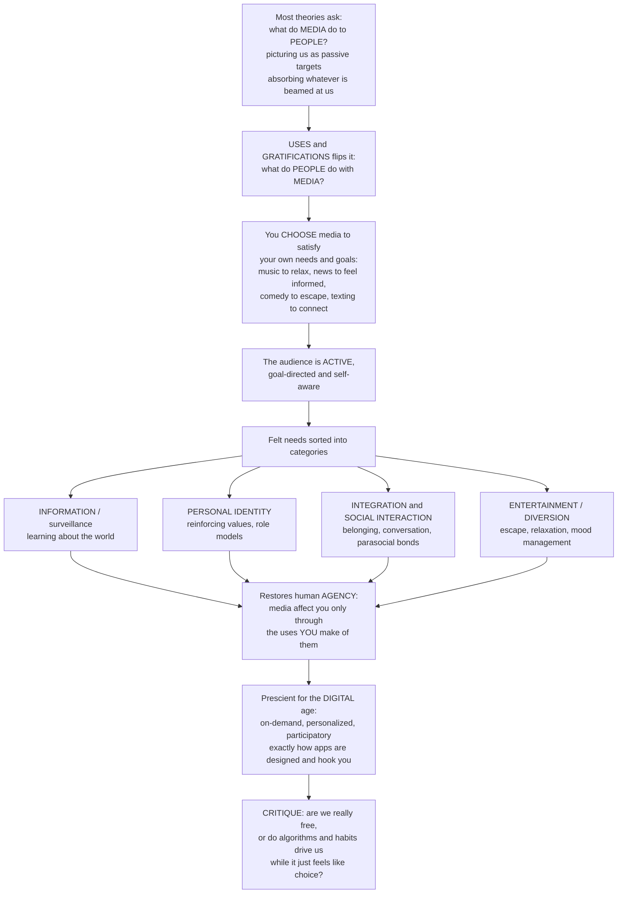

# 🎛️ Uses and Gratifications and Active Audiences

> [!abstract] TL;DR
> Where most media theory asks *"what do **media** do to **people**?"* (imagining us as passive targets absorbing whatever is beamed at us), **uses and gratifications** (U&G) theory flips the question: *"what do **people** do with **media**?"* Audiences are **active, goal-directed, and self-aware**: we *select* media purposefully to gratify our own needs — **information/surveillance**, **personal identity**, **integration and social interaction** (including **parasocial** bonds with media figures who feel like friends), and **entertainment/diversion**. This restored human **agency** to media study and is strikingly prescient for a digital age built on user control — but it carries a sharp critique: are our "free" choices really rational need-satisfaction, or are they engineered and compelled by **algorithms, notifications, and variable rewards** while merely *feeling* like choice?

---

## Intuition

**Analogy:** Picture the difference between being **rained on** and **drinking from a tap**. Most classic media theories treat you like someone standing in the rain — media pour messages down, and you get wet whether you like it or not (the "powerful media / passive audience" picture). Uses and gratifications says: no, you are standing at a **tap**, and *you* decide when to turn it on, how much to pour, and which need it is quenching. You are not a sponge soaking up whatever falls on you — you are a thirsty, purposive chooser reaching for exactly the drink you want.

Think about a single ordinary day. You put on music to **relax**. You doom-scroll the news to feel **informed** (or, honestly, to feel anxious). You watch a comedy to **escape**. You text friends to feel **connected**. You binge a drama for the **emotional ride**. You open an app out of sheer **boredom**. Notice the pattern: in every case *you* are doing something with media to satisfy a felt need — the medium does not act on you so much as you *use* it. That obvious-but-overlooked truth is the entire theory. The audience is **active**, **goal-directed**, and **self-aware** enough to (mostly) tell you why it reached for the phone.

Scholars catalogued these needs into a few big families: **information/surveillance** (learning about the world, reducing uncertainty), **personal identity** (reinforcing your values, finding role models, insight into yourself), **integration and social interaction** (belonging, having something to talk about, and even *parasocial* one-sided bonds with hosts, streamers, and influencers who feel like friends), and **entertainment/diversion** (escape, relaxation, emotional release, mood management, killing time). Media only "affect" you *through the uses you make of them* — which is why the same violent film is catharsis for one viewer and a nightmare for another.

This was a healthy corrective. It rescued the ordinary viewer from being treated as a dupe, and it turns out to be **prescient**: modern media are *all about* giving users control — on-demand, personalized, interactive, participatory — so "what need is this person trying to satisfy?" is precisely how Netflix, TikTok, Spotify, and every app is designed (and how they hook you). But that success exposes the theory's soft underbelly: is the audience **really** so free and rational, or does it just *feel* that way while habits, moods, and recommendation algorithms actually drive the choices? Are you *using* TikTok to satisfy a need — or is TikTok using your dopamine system? Understanding uses and gratifications means understanding media from the **audience's side**: why we reach for media, and both the reality and the limits of the agency with which we do.

---

## How It Works

### Core Mechanics

1. **The paradigm flip.** Effects research asks *what media do to a passive audience* (the hypodermic-needle / magic-bullet legacy). Katz, Blumler, and Gurevitch invert it: begin with the **audience** and ask what people *do with* media. Media use becomes a *dependent* variable to be explained by needs, not an all-powerful independent cause.
2. **Needs originate in the person's social and psychological situation.** Loneliness, curiosity, boredom, a stressful week, an identity in flux — these generate **felt needs** and **expectations** of media (and of other, non-media sources).
3. **Media compete to satisfy those needs.** Crucially, media are one option among many: a lonely person can call a friend, go to a bar, *or* watch a companionable talk show. Media are chosen only when they are the most available or rewarding satisfier — a **functional** framing.
4. **Active, purposive selection.** The audience selects media and content **goal-directedly**, guided by expected gratifications. Different people bring different needs, so audiences are **heterogeneous** — the "mass" audience dissolves into individuals with distinct motives.
5. **Gratifications are obtained (or not).** Consumption yields **gratifications obtained**, which may match, exceed, or fall short of the **gratifications sought**. The comparison feeds **satisfaction**.
6. **A feedback loop builds habit and loyalty.** When obtained meets or beats sought, the person repeats and the medium becomes a reliable, habitual go-to; when it disappoints, they switch. Over time this **expectancy–value** loop shapes stable media diets — and, critically, the loop can harden into habit that runs *without* conscious need.
7. **The active-audience corollary.** Because effects are mediated by the uses people make of content, media power is real but **conditional**: a message only "works" to the extent it serves a need the audience already brings. This is the same "active audience" premise that Stuart Hall's encoding/decoding tradition reaches from the *meaning* side.

### Flow / Architecture



---

## Key Concepts

### Secondary (intuitive)
- **Flip the question:** don't ask what media *do to you* — ask what *you do with* media.
- **You choose for a reason:** music to relax, news to feel informed, comedy to escape, chat to feel connected — each satisfies a **need**.
- **Four big needs:** learn about the world (**information**), figure out who you are (**identity**), connect with others (**social**), and have fun or unwind (**entertainment**).
- **Parasocial friends:** you can feel a real bond with a streamer, host, or celebrity who does not know you exist — media satisfy the *need to belong* even one-sidedly.
- **The catch:** it *feels* like free choice, but sometimes you keep scrolling out of habit, not need.

### Undergraduate (mechanistic)
- **The five core assumptions of U&G:** the audience is **active**; media use is **goal-directed** (linking need to media choice); media **compete** with other need-satisfiers; people are **self-aware** enough to report their motives; and value judgments about content should be **suspended** (people's own uses are what count).
- **The needs typology** (Katz, Gurevitch & Haas; McQuail): **surveillance/information**, **personal identity**, **integration and social interaction**, and **entertainment/diversion** — often traced to broader **cognitive, affective, integrative, and tension-release** needs.
- **Gratifications sought vs obtained (GS/GO):** the *expectancy–value* refinement (Palmgreen & Rayburn) separates what you *expected* from what you *got*; the gap predicts satisfaction, switching, and loyalty.
- **Parasocial interaction (PSI):** Horton & Wohl's concept of one-sided intimacy with media personae — a specific mechanism inside the *social interaction* need, now central to influencer and streaming culture.
- **Functionalism:** U&G is a functionalist, individual-level, psychological account — media persist because they *serve functions* for audiences.

### Graduate (critical / theoretical)
- **Positioning against strong-effects.** U&G is the classic "**limited-effects / active-audience**" corrective to hypodermic-needle and magic-bullet models; it shares the active-audience premise with cultural-studies reception (encoding/decoding) but from a *functionalist-psychological* rather than *semiotic-ideological* angle.
- **The rationality critique.** People cannot reliably introspect motives; much use is driven by **habit, mood, impulse, and situational availability** rather than deliberate need-satisfaction. LaRose's reframing folds U&G into **social-cognitive** terms (deficient self-regulation, habit strength) — a bridge to accounts of compulsive and "addictive" use.
- **The individualist / apolitical critique.** By starting from individual needs and *suspending judgment on content*, U&G brackets **structural media power**: who owns the channels, whose interests content serves, and — decisively — how needs *themselves* are **shaped** by media and society (the political-economy and ideology objection). It risks **functionalist circularity**: use is explained by needs that are inferred from use.
- **Methodological reliance on self-report.** Typologies of gratifications are built from surveys of what audiences *say*; this makes GS/GO measures vulnerable to rationalization and social desirability.
- **The digital resurgence — and its dilemma.** U&G thrives online because media became literally **user-driven** (on-demand, personalized, interactive, participatory), and it now explains platform choice (connection, self-presentation, information, entertainment, FOMO) and grounds **engagement-driven design**. But the same design — recommendation, notifications, variable-ratio rewards, infinite scroll — reopens the core question: in the **attention economy**, is the audience *freely* gratifying needs, or are its "choices" **engineered and compelled**? The theory's premise (a free active chooser) is exactly what addictive design puts in doubt.

---

## Python Demo

```python
# Uses & Gratifications, simulated two ways:
#  (a) NEEDS-DRIVEN MEDIA SELECTION: each medium offers a PROFILE of gratifications
#      across four needs (information, identity, social, entertainment). A person with
#      a current NEED state selects the medium that best matches the active need -- and
#      the SAME person picks DIFFERENT media as their needs shift.
#  (b) SOUGHT vs OBTAINED (habit loop)  +  ACTIVE vs ALGORITHM-DRIVEN consumption:
#      satisfaction and repeat use build when obtained meets sought (a feedback loop),
#      but an algorithm/habit regime keeps consumption high after the need is met --
#      questioning how "active" the audience really is.
import numpy as np
import matplotlib.pyplot as plt

rng = np.random.default_rng(7)
needs = ["Information", "Identity", "Social", "Entertainment"]

# Media gratification profiles (rows = media, cols = needs), each in [0, 1].
media  = ["News", "Music", "Comedy", "Social media", "Drama"]
profile = np.array([
    [0.90, 0.30, 0.30, 0.20],  # News        -> mostly information/surveillance
    [0.10, 0.45, 0.20, 0.90],  # Music       -> mood management / entertainment
    [0.10, 0.25, 0.30, 0.95],  # Comedy      -> escape / diversion
    [0.50, 0.60, 0.95, 0.65],  # Social media -> connection + a bit of everything
    [0.20, 0.75, 0.45, 0.85],  # Drama       -> identity + emotional ride
])

# Need states (rows = scenarios), the person's currently active needs in [0, 1].
scenarios = ["bored", "uninformed", "want escape", "lonely", "seeking identity"]
need = np.array([
    [0.20, 0.20, 0.60, 0.80],  # bored           -> pull toward social/entertainment
    [0.95, 0.20, 0.20, 0.10],  # uninformed      -> pull toward news
    [0.10, 0.30, 0.20, 0.95],  # want escape     -> pull toward comedy
    [0.20, 0.40, 0.95, 0.30],  # lonely          -> pull toward social media
    [0.20, 0.90, 0.40, 0.55],  # seeking identity-> pull toward drama
])

# MATCH = how well a medium's gratifications serve the currently weighted needs.
match = need @ profile.T                      # (scenarios x media)
choice = match.argmax(axis=1)                 # the selected medium per scenario

# ----- (b) sought vs obtained habit loop -----
sessions = np.arange(1, 31)
sought = 0.6
# A gratifying medium delivers >= sought; a disappointing one falls short.
obtained_good = np.clip(0.72 + rng.normal(0, 0.05, sessions.size), 0, 1)
obtained_bad  = np.clip(0.45 + rng.normal(0, 0.05, sessions.size), 0, 1)
def repeat_prob(obtained, sought, lr=0.25):
    h = 0.5
    out = []
    for o in obtained:                        # habit strength updates on GS/GO gap
        h = np.clip(h + lr * (o - sought), 0.02, 0.98)
        out.append(h)
    return np.array(out)
rp_good = repeat_prob(obtained_good, sought)
rp_bad  = repeat_prob(obtained_bad,  sought)

# ----- (b) active chooser vs algorithm/habit-driven consumption -----
t = np.arange(0, 60)
need_level = np.exp(-t / 12.0)                 # the felt need is satisfied over time
active   = need_level                          # rational chooser: use tracks need, then stops
algo     = 0.15 + 0.85 * np.exp(-t / 45.0)     # feed + variable reward: use stays high

# ================= plots =================
fig, ax = plt.subplots(2, 2, figsize=(13, 9))

# (a1) media gratification profiles as a heatmap
im = ax[0, 0].imshow(profile, cmap="viridis", vmin=0, vmax=1, aspect="auto")
ax[0, 0].set_xticks(range(len(needs)));  ax[0, 0].set_xticklabels(needs, rotation=25, ha="right")
ax[0, 0].set_yticks(range(len(media)));  ax[0, 0].set_yticklabels(media)
ax[0, 0].set_title("(a) Media each offer a PROFILE of gratifications")
for i in range(profile.shape[0]):
    for j in range(profile.shape[1]):
        ax[0, 0].text(j, i, f"{profile[i, j]:.2f}", ha="center", va="center",
                      color="w" if profile[i, j] < 0.6 else "k", fontsize=8)
fig.colorbar(im, ax=ax[0, 0], fraction=0.046, label="gratification offered")

# (a2) match scores per scenario; the winning (selected) medium is starred
im2 = ax[0, 1].imshow(match, cmap="magma", aspect="auto")
ax[0, 1].set_xticks(range(len(media)));     ax[0, 1].set_xticklabels(media, rotation=25, ha="right")
ax[0, 1].set_yticks(range(len(scenarios))); ax[0, 1].set_yticklabels(scenarios)
ax[0, 1].set_title("Same person, shifting needs -> different SELECTION")
for i, j in enumerate(choice):
    ax[0, 1].scatter(j, i, marker="*", s=260, color="cyan", edgecolor="k", zorder=3)
fig.colorbar(im2, ax=ax[0, 1], fraction=0.046, label="need-medium match")

# (b1) sought vs obtained -> repeat-use / habit strength
ax[1, 0].axhline(sought, color="k", ls="--", lw=1, label="gratifications sought")
ax[1, 0].plot(sessions, rp_good, "-o", ms=3, color="#27ae60", label="obtained >= sought  (habit forms)")
ax[1, 0].plot(sessions, rp_bad,  "-o", ms=3, color="#c0392b", label="obtained < sought  (user drifts away)")
ax[1, 0].set_xlabel("session"); ax[1, 0].set_ylabel("repeat-use probability")
ax[1, 0].set_title("(b) Sought vs obtained drives loyalty")
ax[1, 0].set_ylim(0, 1); ax[1, 0].legend(fontsize=8)

# (b2) active chooser vs algorithm-driven: the compulsion gap
ax[1, 1].plot(t, need_level, color="#2c3e50", lw=2, label="felt need (being satisfied)")
ax[1, 1].plot(t, active, color="#2980b9", lw=2, ls="--", label="active chooser: use tracks need")
ax[1, 1].plot(t, algo,   color="#e67e22", lw=2, label="algorithm / habit-driven use")
ax[1, 1].fill_between(t, need_level, algo, where=(algo > need_level),
                      color="#e67e22", alpha=0.25, label="compulsion gap")
ax[1, 1].set_xlabel("time (minutes)"); ax[1, 1].set_ylabel("consumption intensity")
ax[1, 1].set_title("How 'active' is the audience, really?")
ax[1, 1].legend(fontsize=8)

plt.tight_layout()
plt.savefig("uses_and_gratifications.png", dpi=120)
for s, c in zip(scenarios, choice):
    print(f"When {s:<16s} -> selects {media[c]}")
print("Final repeat-use (gratifying vs disappointing):",
      round(float(rp_good[-1]), 2), "vs", round(float(rp_bad[-1]), 2))
```

Running it makes the theory concrete: the **same person** selects *News* when uninformed, *Comedy* to escape, and *Social media* when lonely — media choice is **needs-driven and heterogeneous**. The habit panel shows loyalty building only when **gratifications obtained meet those sought**. And the final panel visualizes the modern critique: an **active chooser's** use falls as the need is met, while an **algorithm/habit-driven** pattern keeps consumption high long after — the shaded **compulsion gap** is exactly what puts the word "active" in question.

---

## Real-World Applications

- **Why people use each platform (audience research).** Streamers, publishers, and social apps survey and cluster users by *gratifications sought*: connection and social currency (messaging, Stories), information and surveillance (news feeds), identity and self-presentation (profiles, curated posts), and diversion (short-form video). U&G is the standard lens for "why do users come here?"
- **Engagement-driven product design.** Netflix's rows and autoplay serve *diversion and mood management*; LinkedIn serves *identity and information*; TikTok's For-You feed serves *diversion + FOMO*. Designers explicitly map features to needs — and then optimize the *sought-vs-obtained* loop to build habit.
- **The influencer and streaming economy runs on parasocial gratification.** Livestream chats, memberships, and "para-friend" hosts satisfy the *integration/social* need one-sidedly; understanding PSI explains subscriptions, donations, and loyalty better than content quality alone.
- **Political communication and news diets.** People select outlets that gratify *surveillance* and *identity-reinforcement* needs — a U&G reading of selective exposure and partisan media loyalty.
- **Media literacy and digital-wellbeing tools.** Screen-time dashboards, "you're all caught up" markers, and grayscale modes are interventions on the *compulsion gap* — nudging use back toward conscious need and away from habit-driven scrolling.
- **Games and second-screen behavior.** Achievement, escape, social play, and competence needs explain genre preferences and why players return; the same typology guides live-service retention design.

---

## Common Pitfalls

- **Assuming the audience is fully rational and self-transparent.** People often *cannot* introspect why they opened an app; treating every use as deliberate need-satisfaction ignores habit, mood, and impulse — the theory's single biggest weakness.
- **Functionalist circularity.** "People watch because it meets a need; we know the need because they watch." Guard against inferring needs *only* from the behavior they are meant to explain — measure needs independently.
- **Ignoring structural power.** U&G brackets *who shapes needs and controls channels*. Needs are not exogenous givens; advertising and platforms *cultivate* the very wants they then satisfy. Pair U&G with a political-economy or ideology lens.
- **Reading "gratification obtained" as "good for you."** A medium can gratify a need (escape, connection) while producing anxiety, polarization, or compulsion. Satisfaction is not welfare.
- **Confusing active with free.** "Active" (goal-directed selection) is not the same as "free" (uncoerced, unmanipulated). Recommendation systems can make heavily engineered consumption *feel* self-directed.
- **Over-relying on self-report typologies.** Survey categories of gratifications are useful but vulnerable to rationalization; triangulate with behavioral and log data.
- **Treating the four need categories as fixed or exhaustive.** They are heuristics from the 1970s; new media generate new gratifications (self-presentation, FOMO relief, algorithmic novelty) that resist neat boxing.

---

## Related Concepts

- [[Encoding_Decoding_and_Audience_Reception]] — the *other* pillar of the active-audience tradition; Hall reaches audience agency from the **meaning/semiotic** side (dominant/negotiated/oppositional readings), U&G from the **needs/functional** side.
- [[Theories_of_Motivation]] — U&G is essentially a **motivation theory of media choice**; drives, intrinsic/extrinsic motivation, and self-determination underpin why a felt need becomes a media selection.
- [[Maslows_Hierarchy]] — the canonical needs taxonomy whose tiers (belonging, esteem, self-actualization) map closely onto U&G's social-integration, identity, and information gratifications.
- [[Media_Culture_and_Cultural_Industries]] — the sociological counterpoint: the **structural power** U&G brackets — who owns the channels, and how the industries *shape* the very needs audiences then "freely" satisfy.
- [[Attention_and_Selection]] — the cognitive machinery of selective attention behind the **attention economy**; how feeds compete for and capture the scarce resource U&G assumes the audience controls.
- [[Present_Bias_and_Self_Control]] — the behavioral-economics engine of the modern critique: variable rewards, habit, and self-control failure explain why "active" choice can shade into engineered compulsion.

This note anchors the Mass Communication Theory section and should be read alongside its vault siblings (to be created): **Mass_Communication_and_Media_Effects** (the "powerful media / passive audience" tradition U&G reacts against), **Encoding_Decoding_and_Audience_Reception** (the reception-studies wing of the active audience), **Cultivation_Theory_and_Media_Reality** (a *long-term effects* counterweight that treats heavy viewers as shaped by exposure), **Social_Media_and_Networked_Communication** (where U&G resurges as user-driven, participatory media), and **Media_Audiences_and_Reception** (the empirical study of who audiences are and how they use media).

---

## Review Questions

1. **(Secondary)** In your own words, how does uses and gratifications *flip* the usual media question? Give three media you used in the last day and name the specific need each one satisfied.
2. **(Secondary/Undergraduate)** What is a *parasocial* relationship, and which of U&G's four need categories does it serve? Why has it become so central to influencer and streaming culture?
3. **(Undergraduate)** Distinguish *gratifications sought* from *gratifications obtained*. Using the sought-vs-obtained loop, explain why a person becomes loyal to one podcast and abandons another after two episodes.
4. **(Undergraduate/Graduate)** U&G assumes audiences are "active." State two distinct critiques of this assumption (one about rationality/self-awareness, one about structural power), and explain how each limits what the theory can claim.
5. **(Graduate)** A design team says their infinite-scroll feed "just gives users what they want." Using both U&G and its critics, argue whether the resulting consumption reflects *free need-satisfaction* or *engineered compulsion* — and identify what evidence would let you tell the two apart.

---

## Sources

- Katz, Elihu, Jay G. Blumler, and Michael Gurevitch. "Uses and Gratifications Research." *Public Opinion Quarterly* 37, no. 4 (1973–74): 509–523.
- Blumler, Jay G., and Elihu Katz, eds. *The Uses of Mass Communications: Current Perspectives on Gratifications Research*. Beverly Hills, CA: Sage, 1974.
- McQuail, Denis. *McQuail's Mass Communication Theory*. 6th ed. London: Sage, 2010. (Typology of media-person needs.)
- Rubin, Alan M. "The Uses-and-Gratifications Perspective on Media Effects." In *Media Effects: Advances in Theory and Research*, edited by Jennings Bryant and Mary Beth Oliver, 3rd ed., 165–184. New York: Routledge, 2009.
- Horton, Donald, and R. Richard Wohl. "Mass Communication and Para-Social Interaction: Observations on Intimacy at a Distance." *Psychiatry* 19, no. 3 (1956): 215–229.

---

#media-studies #uses-and-gratifications #active-audience #parasocial #media-motivations
