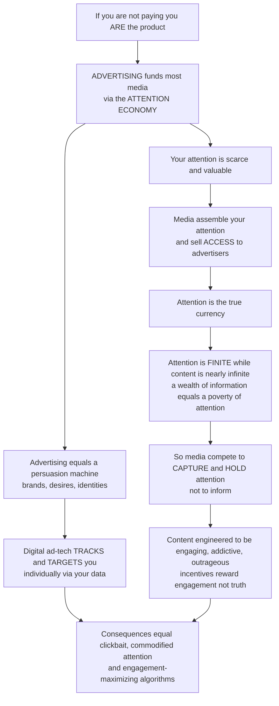

# 👁️ Advertising and the Attention Economy

> [!abstract] TL;DR
> **"If you're not paying for the product, you *are* the product."** That one line captures the engine funding most of modern media: **advertising**, and the **attention economy** it created. Your attention is a *scarce, valuable resource*, and a trillion-dollar industry exists to capture it and resell **access** to advertisers who want to influence you. Because human attention is **finite** (only so many eyeball-hours per day) while the content competing for it is nearly **infinite**, we live in an economy where — as Herbert Simon put it — *"a wealth of information creates a poverty of attention."* The consequence is decisive: media compete not primarily to **inform** you but to **capture and hold** your attention long enough to monetize it, which is why so much content is engineered to be maximally engaging, outrageous, or addictive — **the incentives reward engagement, not truth or value.** Advertising itself is a sophisticated **persuasion machine** (brands, desires, identities); digital **ad-tech** has industrialized it by **tracking and targeting** individuals through harvested personal data (behavioral / surveillance advertising), with profound consequences for the content we get, the commodification of our time and inner lives, and the engagement-maximizing algorithms now implicated in distorting our politics and mental health.

---

## Intuition

**Analogy — the "free" lunch where *you* are on the menu.** Walk into a bar that hands out free peanuts. The peanuts are salty; the salt makes you thirsty; the thirst makes you buy drinks. The peanuts were never the business — they were **bait** to assemble thirsty customers the bar could sell drinks to. Now swap the peanuts for "free" TV, a "free" news site, or a "free" app. The content is the salty peanuts; **you** are the thirsty customer; and the drink being sold — to *someone else entirely* — is **access to your attention.** You never paid a cent, because you were never the customer. You were the **product**: the media assembled your attention and sold it to advertisers. As the saying goes, *"if you're not paying for the product, you are the product."*

This reframes everything about media. In a world drowning in content, the truly scarce resource is not information — it is **your attention**. There are only about sixteen waking eyeball-hours in anyone's day, and every article, video, notification, and ad on Earth is fighting over that fixed pool. Herbert Simon saw this in 1971: *"a wealth of information creates a poverty of attention."* Because attention is **finite** while content is **nearly infinite**, attention becomes the **currency** — the thing everyone competes for and the thing that gets bought and sold. Tim Wu calls the businesses built on this the **attention merchants**: enterprises whose real product is *human attention harvested and resold*.

Here is the uncomfortable payoff. If attention is the prize, then media are **not** mainly optimized to *inform* you well — they are optimized to **capture and hold** you. Truth, depth, and your long-term wellbeing are, at best, incidental; what the incentive structure actually rewards is **engagement** — clicks, watch-time, shares, time-on-site. So content drifts toward whatever is stickiest: the emotionally charged, the outrageous, the cliffhanger, the infinite scroll. Advertising, meanwhile, is the **persuasion machine** that pays for it all — not merely informing you a product exists, but wrapping it in desire, identity, and aspiration (Raymond Williams called advertising a "magic system" that sells lifestyles, not soap). And in the digital era, ad-tech **industrialized** this: instead of one billboard for a million people, your personal data is harvested to **track and target you individually**, predicting and nudging what you will click and buy (behavioral / surveillance advertising). Understanding advertising and the attention economy is understanding the fundamental **commercial logic of media** — how your attention became the most fought-over resource of the digital age, and exactly who profits from capturing it.

---

## How It Works

The system runs on a **three-sided deal you have unknowingly signed**: media give you content for "free"; you give the media your attention (and now your data); the media sell that attention and data to advertisers. Follow the money and the mechanism falls out in steps:

1. **Attention is the scarce resource.** Content is nearly infinite and its production cost is collapsing; the human attention available to consume it is fixed. Scarcity confers value — so attention, not content, is what commands a price. This is Simon's "poverty of attention."
2. **Media are attention factories.** A commercial outlet's core operation is to *manufacture and aggregate* attention — assemble an audience, measure it (ratings, impressions, clicks, dwell-time), and package it as a sellable good. In political-economy terms the audience itself is the **commodity** being produced and sold (Dallas Smythe's "audience commodity").
3. **Advertisers buy access, not just space.** What an advertiser purchases is a *probability of influence* — a chance to reach and persuade a mind. Historically this was **mass** and untargeted (one message, everyone). The advertiser pays; the media are funded; you get "free" content. This is advertising as the dominant **revenue model** of commercial media.
4. **Advertising works by persuasion, not just information.** Beyond "this product exists," advertising builds **brands** — bundles of meaning, identity, and emotion attached to a product (transformational, not merely informational, advertising). It manufactures desire and aspiration, selling lifestyles and identities. Edward Bernays' "engineering of consent" turned this into a profession; a culture of mass **consumption** was, in part, deliberately built to absorb mass **production**.
5. **Ad-tech industrializes targeting.** Digital media replaced broadcast with **programmatic, data-driven** advertising. Your behavior is **tracked** (cookies, device IDs, pixels, cross-site profiles), aggregated into a profile, and used to **target** you individually. The more precise the targeting, the higher the expected return per impression — which is *why your personal data is monetized* (behavioral / surveillance advertising).
6. **A real-time auction prices your attention.** When a page loads, an **ad exchange** runs a **real-time bidding (RTB)** auction in milliseconds: **demand-side platforms (DSPs)** bid on behalf of advertisers for *this specific user*, informed by data brokers; the highest bid wins the impression. A duopoly (Google and Meta) dominates the pipes. Your attention is literally auctioned, per view, per person.
7. **The engagement turn closes the loop.** To maximize sellable attention, platforms optimize for **engagement** — time-on-site, clicks, shares — using recommendation algorithms and "persuasive design" (variable rewards, infinite scroll, notifications: the "hooked" model). Because engagement, not accuracy or wellbeing, is the target, the system selects for the **sticky**: clickbait, outrage, sensationalism — a race to the bottom with well-documented side effects on discourse, politics, and mental health.



---

## Key Concepts

### Secondary (intuitive level)
- **You are the product.** "Free" media are paid for by **advertisers**, who are buying **your attention** — the media assemble it and sell access to it.
- **Attention is scarce.** There are only so many hours you can watch, read, or scroll; endless content fights over that fixed time. The scarce thing is *your attention*, not information.
- **Media compete to grab you, not teach you.** Because attention is what pays, content is designed to be *engaging* — exciting, emotional, outrageous, hard to stop — even when that is not what is *good* or *true*.
- **Advertising sells feelings, not facts.** A good ad attaches a **brand** — a mood, an identity, a lifestyle — to a product, so you want *who you'd be* with it, not just the object.
- **Online, ads follow you.** Websites and apps **track** what you do and use it to **target** ads at you personally — that is why the ad for the shoes you looked at keeps reappearing.

### Undergraduate (working level)
- **The attention economy (Simon; Davenport & Beck; Wu).** In an information-abundant world, **attention** is the scarce, valuable resource; media are reframed as competing for *finite human attention* rather than to inform. Attention is a **commodity** harvested and resold — the "attention merchants" business model.
- **Advertising as the revenue model / audience commodity (Smythe).** The dominant funding source of commercial media is advertising; the true product sold is the **audience's attention** (and now data). "Watching" is, in this analysis, unpaid *labor* producing an audience commodity.
- **Persuasion, branding, and the "magic system" (Williams; Bernays).** Distinguish **informational** advertising (facts about a product) from **transformational / emotional** advertising (associations, identity, aspiration). **Branding** builds symbolic value and loyalty; advertising manufactures **wants** — the critique of consumerism and the culture of consumption.
- **The AIDA funnel.** A classic model of the persuasion sequence — **A**ttention → **I**nterest → **D**esire → **A**ction — with *attention* as the gateway everything else depends on.
- **Digital ad-tech.** The shift from **mass broadcast** to **targeted, programmatic** advertising: the **RTB / ad-exchange / DSP-SSP** ecosystem, the Google-Meta **duopoly**, and **behavioral / surveillance** advertising (cookies, tracking, profiling, micro-targeting). **Native advertising** and **influencer marketing** blur the line between ads and content.

### Graduate (theoretical level)
- **Surveillance capitalism (Zuboff).** A political-economic order in which human experience is unilaterally claimed as free raw material, rendered into **behavioral data**, and processed into **prediction products** traded in "behavioral futures markets." The frontier is not just *predicting* behavior but **modifying** it at scale — the deepest critique of the attention/ad-tech complex.
- **Engagement optimization as objective misalignment.** Recommender systems maximize a **proxy** (watch-time, clicks) that is *correlated with but not equal to* truth, quality, or wellbeing. Optimizing the proxy under selection pressure drives content toward sensational, polarizing, and low-quality equilibria — a media instance of Goodhart's law and reward misspecification, feeding filter bubbles, echo chambers, and misinformation dynamics.
- **Persuasive / addictive design.** Variable-ratio **reinforcement schedules**, infinite scroll, autoplay, streaks, and social-validation notifications engineered against known cognitive vulnerabilities (present bias, loss aversion, intermittent reward) — the "hooked" habit-formation model and its critique by the "time well spent" / humane-technology movement.
- **Attention as commodity and as labor.** The theoretical status of attention: a scarce good that is *rivalrous* (spent here, not there) yet *manufactured* by the very platforms that sell it; the audience-labor debate; and the commodification of time and inner life — attention as the terrain where economy meets subjectivity.
- **The funding crisis and the political economy of news.** Ad-supported journalism's collapse as ad revenue migrated to platforms that capture attention without producing accountability content; the tension between an **attention** market (rewarding virality) and a **democratic** need for informing publics; and regulatory / counter-movements (GDPR, ePrivacy, ad-blockers, cookie deprecation, "attention activism").

---

## Python Demo

```python
# Advertising & the attention economy, quantified two ways:
#   (a) ATTENTION SCARCITY / COMPETITION: a FIXED pool of audience attention is
#       fought over by a GROWING number of content items. As content explodes,
#       attention-per-item collapses -> a zero-sum scramble. Producers who optimize
#       for ENGAGEMENT (stickiness/outrage) capture a disproportionate share,
#       creating evolutionary pressure toward ever more sensational content.
#   (b) TARGETED-AD VALUE: an advertiser's expected value per impression rises
#       steeply with TARGETING PRECISION (better data -> higher click & conversion
#       probability). This is WHY personal data is monetized -- and why a privacy
#       cap on precision destroys a large slice of that value.
import numpy as np
import matplotlib.pyplot as plt

# ---------- (a) Attention scarcity & the engagement advantage ------------------
TOTAL_ATTENTION = 1000.0                 # fixed pool of "attention units" (finite)
N = np.arange(2, 200)                    # number of content items competing

avg_per_item = TOTAL_ATTENTION / N       # equal-split baseline: collapses as ~1/N

# One ENGAGEMENT-OPTIMIZED item has stickiness weight e; the rest have weight 1.
# Attention is shared in proportion to weight -> optimizer wins more than its share.
e = 4.0
optimizer_share  = e / (e + (N - 1))                     # fraction of the pool
optimizer_attn   = TOTAL_ATTENTION * optimizer_share     # what the optimizer gets
average_attn     = TOTAL_ATTENTION * 1.0 / (e + (N - 1)) # what an ordinary item gets

# ---------- (b) Value of targeting: eCPM vs targeting precision -----------------
p = np.linspace(0.0, 1.0, 200)           # targeting precision: 0 = mass/random, 1 = perfect
ctr  = 0.002 + (0.050 - 0.002) * p       # click-through prob improves with targeting
conv = 0.010 + (0.080 - 0.010) * p       # conversion prob improves with targeting
VALUE_PER_CONVERSION = 40.0              # dollars an advertiser earns per conversion

# expected revenue per 1000 impressions (eCPM) = CTR * conversion * value * 1000
ecpm = ctr * conv * VALUE_PER_CONVERSION * 1000.0
PRIVACY_CAP = 0.5                        # e.g. regulation limits how precisely you can be tracked
ecpm_capped = np.where(p <= PRIVACY_CAP, ecpm, ecpm[np.argmin(np.abs(p - PRIVACY_CAP))])

# ---------- Plots --------------------------------------------------------------
fig, ax = plt.subplots(1, 2, figsize=(12, 4.7))

ax[0].plot(N, avg_per_item, color="#6b7280", lw=2.4,
           label="Attention per item (equal split ~ 1/N)")
ax[0].plot(N, optimizer_attn, color="#dc2626", lw=2.4,
           label=f"Engagement-optimized item (stickiness x{e:.0f})")
ax[0].plot(N, average_attn, color="#2563eb", lw=2.0, ls="--",
           label="An ordinary item")
ax[0].set_title("Attention scarcity: more content -> less attention each\n"
                "(engagement-optimizers capture disproportionate share)")
ax[0].set_xlabel("number of content items competing for attention")
ax[0].set_ylabel("attention captured (units)")
ax[0].set_ylim(0, 220); ax[0].legend(fontsize=8, loc="upper right")

ax[1].plot(p, ecpm, color="#059669", lw=2.6, label="Ad value (eCPM) vs targeting")
ax[1].plot(p, ecpm_capped, color="#7c3aed", lw=2.2, ls="--",
           label="Value lost above a privacy cap")
ax[1].axvline(PRIVACY_CAP, color="gray", ls=":")
ax[1].annotate("privacy regulation\ncaps precision here",
               xy=(PRIVACY_CAP, ecpm[np.argmin(np.abs(p - PRIVACY_CAP))]),
               xytext=(0.10, ecpm.max() * 0.75),
               arrowprops=dict(arrowstyle="->"), fontsize=8)
ax[1].set_title("Why your data is monetized:\nad value climbs with targeting precision")
ax[1].set_xlabel("targeting precision (mass 0 -> perfectly targeted 1)")
ax[1].set_ylabel("expected revenue per 1000 impressions ($)")
ax[1].legend(fontsize=8, loc="upper left")

plt.tight_layout()
plt.show()

# Key readings:
#  - Left: as the number of content items grows, average attention per item collapses
#    toward zero (finite pool / infinite content). An item engineered for engagement
#    (stickiness x4) holds a persistently larger slice than an ordinary one -> a
#    selection pressure rewarding sensational, "sticky" content.
#  - Right: expected ad value per impression rises sharply as targeting improves,
#    which is exactly why personal data is harvested and sold; a privacy cap that
#    limits precision lops off the high-value tail of that curve.
print(f"Avg attention/item at N=10 -> {TOTAL_ATTENTION/10:.1f}; at N=100 -> {TOTAL_ATTENTION/100:.1f}")
print(f"eCPM at mass (p=0): ${ecpm[0]:.2f}  ->  at perfect targeting (p=1): ${ecpm[-1]:.2f}")
```

The left panel makes the attention economy's defining asymmetry concrete: with a **fixed pool of attention** and an **exploding number of content items**, attention-per-item collapses toward zero — a genuinely **zero-sum scramble** — while the item **engineered for engagement** retains a disproportionate slice, which is precisely the evolutionary pressure that pushes media toward ever more sticky, sensational content. The right panel shows the demand side: an advertiser's expected value per impression **rises steeply with targeting precision**, which is the whole economic reason your personal data is harvested and auctioned — and why a **privacy cap** that limits tracking precision destroys the high-value tail of that curve (the business core of the GDPR / cookie-deprecation fights).

---

## Real-World Applications

- **The Google-Meta duopoly and programmatic RTB.** Roughly half of all global ad spending flows to two firms whose products are *your attention and data*. Every ad you see on a modern site is typically the winner of a **real-time bidding** auction that ran in ~100 ms when the page loaded — DSPs bidding for *you specifically*, priced by your profile. This is the attention economy's clearing mechanism made literal.
- **The "free" social feed.** Facebook, Instagram, TikTok, YouTube, and X charge users nothing and monetize attention. Recommendation algorithms optimize **engagement** (watch-time, interactions); the resulting incentive to surface the emotionally arousing and outrageous is the documented driver behind clickbait, rage-bait, and the amplification of sensational content — the engagement turn in production.
- **Persuasive design and the "hooked" loop.** Pull-to-refresh (a slot-machine **variable reward**), infinite scroll, autoplay, streaks, and red-dot notifications are deliberately engineered against human attention. Former designers (the "time well spent" / Center for Humane Technology movement) publicly named this as the deliberate manufacture of compulsive use.
- **Surveillance advertising and micro-targeting.** Cross-site tracking assembles behavioral profiles used to micro-target commercial *and political* messages (the Cambridge Analytica episode being the notorious case), raising manipulation, privacy, and democratic-autonomy concerns — Zuboff's surveillance-capitalism thesis in practice.
- **Native ads and influencer marketing.** As banner ads lost effectiveness and ad-blockers spread, spending shifted to advertising **disguised as content** — sponsored articles, product placement, and influencers whose posts blur the ad/content boundary, extending the persuasion machine into forms that evade our "this is an ad" defenses.
- **The response layer.** Ad-blockers, Apple's App Tracking Transparency, third-party-cookie deprecation, and regulation (**GDPR**, ePrivacy, the EU Digital Services / Markets Acts) are direct counter-moves against the tracking-and-targeting economy — each a fight over exactly the value shown collapsing under the "privacy cap" in the demo above.

---

## Common Pitfalls

- **Thinking "free" means free.** The absence of a price tag hides the real transaction: you pay in **attention and data**, and the actual customer is the advertiser. Mistaking yourself for the *customer* rather than the *product* leads you to misread every design choice a "free" platform makes.
- **Assuming the algorithm is trying to inform or serve you.** Engagement-maximizing systems optimize a **proxy** (time, clicks), not truth or wellbeing. Expecting them to surface what is *true* or *good for you* misunderstands the objective function — they surface what *holds attention*, which is often the opposite.
- **Confusing engagement with value.** High engagement (a viral outrage post) can be low or negative value (misleading, corrosive), while high-value content (a careful explainer) may draw little. Because the market prices attention, not value, "what's popular" is a poor proxy for "what's good or true."
- **Believing you are immune to advertising.** People routinely claim ads "don't work on them," yet branding operates on the **peripheral / emotional** route below deliberate scrutiny, and behavioral targeting is calibrated on *your revealed behavior*, not your self-image. Self-reported immunity is itself a documented bias.
- **Treating targeting as merely "relevance."** Framing surveillance advertising as a helpful convenience obscures the machinery: pervasive tracking, profiling, data brokerage, and the shift from *predicting* to *shaping* behavior. The "relevant ad" is the visible tip of an invisible data economy.
- **Ignoring the externalities.** The attention economy's costs — degraded journalism, distraction and mental-health effects, polarization, privacy erosion — fall on individuals and society, not on the platform's balance sheet. Analyzing it purely as a "great free service" omits the ledger's other side.

---

## Related Concepts

- [[Reinforcement_Schedules]] — variable-ratio reinforcement is the exact psychological engine behind slot-machine-style engagement design (pull-to-refresh, notifications, infinite scroll); the attention economy weaponizes intermittent reward.
- [[Attention_and_Cognitive_Load]] — the cognitive-psychology basis of *why attention is scarce*: it is a limited-capacity, selective resource — the finite quantity the whole industry competes to capture.
- [[Attitudes_and_Persuasion]] — the mechanics of attitude change (central vs peripheral routes, source and emotion cues) that advertising exploits to build brands and manufacture desire.
- [[Present_Bias_and_Self_Control]] — why engagement/persuasive design so reliably overrides our intentions: it targets our present bias, converting "just one more scroll" into compulsive use.
- [[Nudges_and_Choice_Architecture]] — advertising and platform UX are choice architecture aimed at the seller's benefit; "dark patterns" are its manipulative cousin, the mirror image of pro-user nudging.
- [[Monopolistic_Competition]] — the market structure in which heavy advertising and **product differentiation** are rational: firms compete on brand image, not just price, which is the micro-foundation of a brand-driven ad economy.
- [[Price_Discrimination]] — behavioral targeting is the data infrastructure that also enables personalized pricing; the same profiles that price your *attention* can price the *products* sold to you.
- [[Happiness_and_Wellbeing]] — the wellbeing ledger of the attention economy: distraction, comparison, and compulsive use are the human-cost side of engagement maximization.

Within this vault, advertising and the attention economy connect in prose to the sibling topics of **media industries and political economy** (advertising as the dominant revenue model and the audience-commodity thesis), **propaganda and persuasion** (advertising as the commercial branch of the persuasion machine), **platforms, algorithms and curation** (engagement-optimizing recommendation as the modern attention harvester), **attention, filter bubbles and echo chambers** (the discourse-level side effects of engagement optimization), **surveillance, privacy and datafication** (the tracking-and-targeting infrastructure and surveillance capitalism), and **popular culture and the culture industry** (advertising's manufacture of consumer desire and standardized, engagement-shaped culture) — together mapping how mediated attention is captured, priced, and monetized.

---

## Review Questions

**Tier 1 — Conceptual (explain to a peer):**
1. Explain the slogan "if you're not paying for the product, you are the product" using the three-sided deal between audience, media, and advertisers. In that deal, what exactly is being *bought and sold*?
2. Simon wrote that "a wealth of information creates a poverty of attention." Restate this in your own words and explain why it makes *attention*, rather than information, the scarce resource that media compete for.

**Tier 2 — Applied (analyze / reason):**
3. A video platform switches its recommender's objective from "predicted user rating" to "predicted watch-time." Using the engagement-vs-value distinction, predict how the *content mix* on the platform will change and why, and name two plausible societal side effects.
4. A new privacy regulation forbids cross-site tracking, capping how precisely advertisers can target. Using the targeting-value curve from the demo, explain who loses revenue and why, and predict how ad-funded media might respond (e.g., contextual ads, subscriptions, first-party data).

**Tier 3 — Theoretical (deep understanding):**
5. Zuboff argues surveillance capitalism moves from *predicting* behavior to *modifying* it. Distinguish "selling access to attention" from "shaping behavior at scale," and argue whether the second is a difference of degree or of kind — with implications for autonomy and democracy.
6. Frame engagement-maximizing algorithms as an instance of objective misalignment (optimizing a proxy that diverges from truth/wellbeing). What structural interventions — regulatory, economic, or design — could realign the incentive without simply banning advertising, and what are the trade-offs of each?

---

## Sources

- Wu, T. (2016). *The Attention Merchants: The Epic Scramble to Get Inside Our Heads.* Knopf. (the history of businesses built on harvesting and reselling attention)
- Simon, H. A. (1971). "Designing Organizations for an Information-Rich World." In M. Greenberger (Ed.), *Computers, Communications, and the Public Interest.* Johns Hopkins Press. (the origin of "a wealth of information creates a poverty of attention")
- Zuboff, S. (2019). *The Age of Surveillance Capitalism: The Fight for a Human Future at the New Frontier of Power.* PublicAffairs. (behavioral data, prediction products, and behavior modification)
- Williams, R. (1980). "Advertising: The Magic System." In *Problems in Materialism and Culture.* Verso. (advertising as a system selling meanings and identities, not products)
- Davenport, T. H. & Beck, J. C. (2001). *The Attention Economy: Understanding the New Currency of Business.* Harvard Business School Press. (attention as the scarce currency organizations must manage)

---

#media-studies #advertising #attention-economy #surveillance-capitalism #ad-tech
