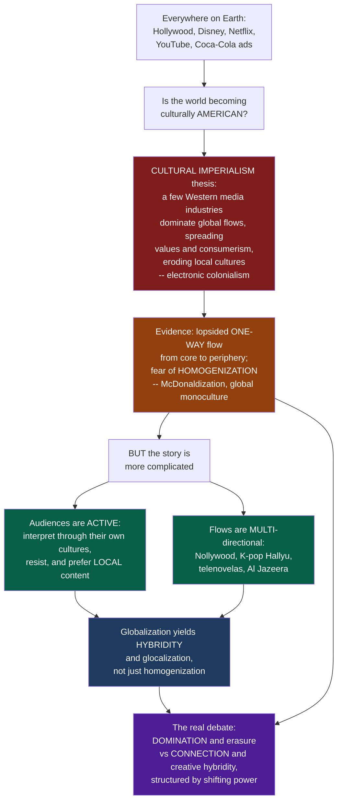

# 🌐 Global Media and Cultural Imperialism

> [!abstract] TL;DR
> Travel almost anywhere on Earth and you meet Hollywood films, American TV formats, Disney characters, Coca-Cola ads, and now Netflix, YouTube, and Instagram — raising the central worry of **cultural imperialism**: the thesis (Schiller, Nordenstreng) that a few powerful, mostly Western and especially US media and culture industries dominate lopsided, historically **one-way** global media flows, exporting their values and **consumerism** while eroding local cultures — a kind of **electronic colonialism** that continues old power imbalances by other means, fueling fears of a **homogenized** global monoculture ("McDonaldization"). But the story is far more complicated than domination: audiences are **active** interpreters who filter foreign media through their own cultures, resist and repurpose it, and prefer local content when available; flows have become **multi-directional** (Nollywood, the Korean Wave / Hallyu, telenovelas, Al Jazeera); and globalization breeds not only homogenization but **hybridity** and **glocalization**. The real debate — Western domination and cultural erasure versus global connection and creative hybridity — is most likely a tangled mix of both, structured by real but shifting power.

---

## Intuition

**Analogy:** Land in a city you have never visited — in Nairobi, Jakarta, São Paulo, or Warsaw — and look around. On the billboards: Coca-Cola and a Marvel poster. On the hotel TV: a Hollywood film dubbed into the local language, and a local version of *MasterChef*. In every teenager's hand: Netflix, YouTube, TikTok, Instagram. It can feel as if the whole planet is quietly tuning to the same channel, and that channel broadcasts, more or less, from Los Angeles. So ask the question that launched an entire field: **does this global flood of media mean the world is slowly becoming culturally... American?**

That worry has a name — **cultural imperialism**. Its picture is stark and, at first glance, convincing. Media production and export are hugely lopsided: the US and a handful of rich countries produce most of the world's exported film, TV, news, and music, and the flow runs mostly **one-way**, from a wealthy "core" to a dependent "periphery." Critics such as Herbert Schiller argued this is not innocent entertainment but **electronic colonialism** — the export of Western values, worldview, and above all **consumerism**, overwhelming and eroding the world's rich diversity of local cultures, languages, and ways of life. The nightmare is **homogenization**: a bland global monoculture — "McDonaldization," "Coca-colonization," "Disneyization" — replacing thousands of distinct cultures with one.

But here is where it gets genuinely interesting, because the evidence complicates the thesis at every turn. First, **audiences are active, not passive** — people around the world do not simply swallow foreign media; they interpret it through their own cultural frameworks (this is exactly Hall's encoding/decoding), often resist or repurpose it, and, given the choice, **prefer local content** (the "cultural discount" on foreign media). Second, the flows are increasingly **multi-directional**: India's Bollywood, Nigeria's Nollywood, the globe-spanning **Korean Wave** ("Hallyu" — K-pop, K-drama), Latin American **telenovelas**, and Al Jazeera prove the "periphery" now exports too — sometimes back into the core. Third, globalization produces not just homogenization but **hybridity** — the mixing of global and local into new blends, which is why the same format becomes a *local* show everywhere it lands ("glocalization"). So the real debate is rich: is global media a force of Western **domination** and cultural erasure, or of global **connection**, exchange, and creative **hybridity** — or, most likely, a tangled mix of both, structured by real but shifting power imbalances? To understand global media is to understand how communication shapes **culture, identity, and power on a planetary scale** — the media dimension of globalization itself.

---

## How It Works

The field runs a debate in stages — from the sharp original charge to the complications that reshaped it:

1. **The global village versus uneven flows.** McLuhan imagined electronic media collapsing the world into a "global village." The critical retort: the village exists, but its microphone is held by a few. **Global media** — the worldwide flow of content, formats, technologies, and institutions, carried by transnational conglomerates — is a central *driver and dimension of globalization*, but the flows are radically **uneven**.
2. **The cultural imperialism thesis.** Schiller and Nordenstreng argue that a few dominant, mostly Western/US media and culture industries **control** global production and distribution, exporting content, values, ideology, and consumerism, thereby **dominating and eroding** local cultures — "media/cultural imperialism," "electronic colonialism," the continuation of colonial relations by cultural means.
3. **The political-economy grounding.** The thesis rests on **ownership**, **one-way flows**, and structural **dependency** (dependency theory; **core-periphery**). The core exports; the periphery consumes and grows dependent — the same logic as economic dependency, applied to culture.
4. **The evidence of asymmetry.** Historically lopsided one-way flows of film, TV, news, and music; Western dominance of exports and of the big news agencies. The Global South's response was the **NWICO** debate — the New World Information and Communication Order and the **MacBride Report** — demands for a fairer, less one-sided information order.
5. **The homogenization fear.** If a few produce for all, cultures converge toward a **monoculture** — "McDonaldization" (Ritzer), "Coca-colonization," "Americanization" — displacing cultural and linguistic **diversity**.
6. **The active-audience rebuttal.** Cultural studies pushes back: audiences are **active**, decoding foreign media through their own frameworks (encoding/decoding), often resisting or repurposing meaning — the Liebes & Katz cross-cultural *Dallas* study is the classic demonstration — and they prefer **culturally proximate** content when it exists (Straubhaar's *cultural proximity*; the "cultural discount" on foreign media). Domination is not automatic.
7. **Contra-flows and hybridity.** Multi-directional flows and non-Western media powers rise — Bollywood, **Nollywood**, the **Korean Wave (Hallyu)**, **telenovelas**, Al Jazeera, and regional media capitals. Theory moves *beyond* imperialism: Appadurai's disjunctive **"scapes,"** Pieterse's **hybridity/creolization**, Robertson's **glocalization** (global formats localized — franchised TV formats), and cosmopolitanism. The debate crystallizes as **homogenization vs heterogenization/hybridization vs shifting power imbalance**.
8. **The digital and platform era.** Global streaming and platforms (Netflix, YouTube, TikTok) pose the question anew: do global platforms **deepen** US/Western and now Big-Tech dominance ("platform imperialism," "data colonialism"), or **enable** unprecedented contra-flows and niche/local content to travel (K-content going global on Netflix, sudden global virality)? The digital divide and access shape who gets a voice — and the enduring questions of power, diversity, and voice return in a networked form.

### Flow / Architecture



---

## Key Concepts

### Secondary Level

**Cultural imperialism, in one worry.** A small number of powerful countries — above all the United States — make most of the films, shows, and music the world watches, and it flows mostly *outward*, from them to everyone else. The fear: this slowly pushes their values, brands, and way of life onto the rest of the world, wearing away local cultures. Some call it "electronic colonialism" — a new empire made of media instead of armies.

**Homogenization: the fear of one global culture.** If everyone watches the same shows and eats at the same chains, do all cultures start to blur into one? "McDonaldization" and "Coca-colonization" are nicknames for this fear that the world's astonishing variety of cultures and languages is being flattened into a single, mostly American, monoculture.

**Why it is not that simple.** People are not sponges. Around the world, viewers understand foreign shows in *their own way*, laugh at different parts, disagree with the values, and — when they can choose — usually **prefer content from their own culture and language**. And more and more, the "rest of the world" is doing the exporting: Nigerian films (Nollywood), Korean pop and dramas (the Korean Wave), Latin American telenovelas, and Al Jazeera news all travel globally now.

**Hybridity: mixing, not just copying.** When global media meet local culture, they often *blend* into something new rather than simply replacing it — a local version of a global cooking show, hip-hop reinvented in dozens of languages. This mixing is called **hybridity**, and adapting a global format to local taste is **glocalization**.

### Undergraduate Level

**The thesis and its architecture.** Cultural imperialism (Schiller, *Mass Communications and American Empire*, 1969; Nordenstreng) claims a few Western/US media and culture industries **control** global media production and flows, exporting content, ideology, and consumerism and thereby dominating local/indigenous cultures. Its grounding is **political economy** — concentrated ownership plus structurally **one-way flows** — mapped onto **dependency theory** and the **core-periphery** model: the media dimension of a wider global inequality.

**The evidence of asymmetry — and NWICO.** Empirically, twentieth-century flows of film, TV, news, and music were sharply lopsided, with US/Western export dominance and a handful of Western agencies (AP, Reuters, AFP) dominating world news. In the 1970s-80s the Global South, through UNESCO, demanded a **New World Information and Communication Order (NWICO)**; the **MacBride Report** (*Many Voices, One World*, 1980) diagnosed the imbalance and called for a fairer order — a demand fiercely resisted by the US and UK.

**The active-audience critique.** The cultural-studies rebuttal: reception is not absorption. Hall's encoding/decoding shows audiences occupy dominant, negotiated, or **oppositional** positions; Liebes & Katz's cross-cultural study of *Dallas* found viewers in different cultures decoded the *same* show through radically different frames. Audiences also show **local preference** — Straubhaar's **cultural proximity**: given a choice, viewers gravitate to culturally and linguistically close content, and foreign media suffer a **"cultural discount"** (they lose appeal across cultural distance).

**Contra-flows and non-Western media powers.** Flows are now **multi-directional**: Bollywood, **Nollywood** (Nigeria's high-volume film industry), the **Korean Wave / Hallyu** (K-pop, K-drama, now globally dominant), Latin American **telenovelas** exported worldwide, and **Al Jazeera** as a Global-South news voice. Regional "media capitals" (Miami for Latin content, Hong Kong, Mumbai, Seoul, Lagos) anchor these contra-flows.

**Beyond imperialism: three globalization theories.**

| Framework | Core idea | Verdict on global media |
|---|---|---|
| **Cultural imperialism** (Schiller) | Core dominates periphery via one-way flows | Domination and erasure |
| **Homogenization** (Ritzer's McDonaldization) | Standardized global forms spread everywhere | Convergence toward monoculture |
| **Hybridity / glocalization** (Pieterse; Robertson; Appadurai) | Global and local mix into new blends; flows are disjunctive | Heterogenization and creative fusion |

**Glocalization and formats.** Robertson's **glocalization** — the simultaneous universalizing and particularizing — is visible in the global **TV format** trade: *Big Brother*, *MasterChef*, *The Voice*, and *Idol* are sold as templates and re-shot with local hosts, contestants, and sensibilities. Global structure, local flesh.

### Graduate Level

**Appadurai's scapes and disjuncture.** Appadurai (*Modernity at Large*, 1996) replaces the core-periphery pipeline with five overlapping, **disjunctive** flows — **ethnoscapes, mediascapes, technoscapes, financescapes, ideoscapes** — that move at different speeds and do not align. Culture is not pushed down a single channel from a single center; it is assembled by locally situated **imaginations** working on globally circulating materials. This dissolves the tidy directionality on which the imperialism thesis depends.

**Hybridity, creolization, and their critics.** Pieterse frames globalization as **hybridization** — cultural forms as ongoing recombination (creolization, mélange). Critics warn that celebrating hybridity can **depoliticize** power: not all mixing is symmetrical, and asymmetry in the *terms* of mixing (whose template, whose capital, whose language) reinstates the very domination hybridity seems to dissolve. The mature position holds hybridity and power *together* — hybridity happens, but on an uneven field.

**The reductionism problem, twice.** The original thesis is charged with **two** reductions: reading cultural effect off ownership and flow (economic/media determinism), and assuming audiences are passive. The reception tradition answers the second; the political-economy tradition (see the sibling *Media Industries and Political Economy* note) insists the first critique can go too far — active audiences and contra-flows do not abolish the enduring **structural** advantages of capital, infrastructure, language (English), and distribution control. Power is *reconfigured*, not erased.

**Platform imperialism and data colonialism.** In the digital turn, the debate migrates to infrastructure. **Platform imperialism** (Jin) argues that global streaming and social platforms re-center dominance in US Big Tech, which owns the pipes, the algorithms, and the ad markets — a deeper control than owning any single catalogue. **Data colonialism** (Couldry & Mejias) extends the frame: the appropriation of human life as data for capital echoes historical colonial extraction. Yet the same platforms enabled the **contra-flow of K-content** (Netflix's global reach was decisive for *Squid Game* and K-drama), sudden global virality of peripheral creators, and unprecedented niche circulation — the tension is unresolved and structural.

**The unresolved synthesis.** The field no longer asks "domination *or* freedom?" but "**which powers, over which layers** (production, distribution, infrastructure, data, language), with **what room for local agency and contra-flow**?" Homogenization, heterogenization, and shifting-but-real power imbalance coexist. Global media is best read as a *stratified, contested field* — the media face of globalization, and its politics.

---

## Python Demo

```python
# Global media as communication, culture, and power on a planetary scale.
# Two mechanisms of the cultural-imperialism debate, in numpy + matplotlib.
#
#   (A) ASYMMETRIC, ONE-WAY FLOWS becoming MULTI-DIRECTIONAL over time.
#       Model global content exports as a flow matrix E[i, j] (region i -> j)
#       via a gravity rule: exporter strength x consumer market x proximity.
#       Early on the US/West dominates and flows run one-way (core -> periphery);
#       as contra-flow centers (Nollywood, Hallyu, Bollywood, telenovelas) rise,
#       export concentration (HHI) and a one-way asymmetry index both FALL.
#
#   (B1) LOCAL PREFERENCE / CULTURAL DISCOUNT. As domestic production capacity
#        grows, local content reclaims audience share from imports, which lose
#        appeal across cultural distance (the "cultural discount").
#   (B2) HOMOGENIZATION vs HYBRIDITY. A homogenizing pull shrinks between-culture
#        variance (convergence), yet cultures accumulate hybrid blends so total
#        cultural VARIETY rises (glocalization) -- two divergent trajectories.

import numpy as np
import matplotlib.pyplot as plt

rng = np.random.default_rng(42)

# =====================================================================
# (A) Asymmetric flows -> multi-directional flows
# =====================================================================
regions = ["US/West", "Europe", "Lat.Am.", "Africa", "E.Asia", "S.Asia"]
n = len(regions)
market = np.array([1.0, 0.9, 0.8, 0.7, 1.0, 1.1])          # consumer market size

# cultural / linguistic proximity (gravity weights; closer -> more trade)
prox = np.array([
    [0.0, 0.9, 0.6, 0.4, 0.4, 0.4],
    [0.9, 0.0, 0.5, 0.5, 0.4, 0.4],
    [0.6, 0.5, 0.0, 0.3, 0.3, 0.3],
    [0.4, 0.5, 0.3, 0.0, 0.3, 0.4],
    [0.4, 0.4, 0.3, 0.3, 0.0, 0.5],
    [0.4, 0.4, 0.3, 0.4, 0.5, 0.0],
])

T = 40
t = np.arange(T)
def logistic(t, start, cap, rate, mid):
    return start + (cap - start) / (1.0 + np.exp(-rate * (t - mid)))

# exporter strength over time: US/West starts dominant; contra-flow centers rise
strength = np.zeros((T, n))
strength[:, 0] = logistic(t, 1.00, 0.90, 0.12, 20)   # US/West: high throughout
strength[:, 1] = logistic(t, 0.55, 0.60, 0.10, 20)   # Europe: steady
strength[:, 2] = logistic(t, 0.10, 0.45, 0.25, 18)   # Latin America (telenovelas)
strength[:, 3] = logistic(t, 0.03, 0.40, 0.30, 24)   # Africa (Nollywood)
strength[:, 4] = logistic(t, 0.08, 0.75, 0.30, 22)   # East Asia (Hallyu)
strength[:, 5] = logistic(t, 0.12, 0.50, 0.25, 20)   # South Asia (Bollywood)

def flow_matrix(s):
    E = np.outer(s, market) * prox            # exports from i to j (i != j)
    return E

def hhi_exporters(E):
    S = E.sum(axis=1)                         # total exports by region i
    share = S / S.sum()
    return float(np.sum(share ** 2))          # 0..1 concentration

def oneway_asymmetry(E):
    num = np.abs(E - E.T).sum()               # net imbalance in bilateral flows
    den = (E + E.T).sum()
    return float(num / den)                   # 0 = fully reciprocal, 1 = one-way

HHI  = np.array([hhi_exporters(flow_matrix(strength[k]))  for k in range(T)])
ASYM = np.array([oneway_asymmetry(flow_matrix(strength[k])) for k in range(T)])
E_early, E_late = flow_matrix(strength[0]), flow_matrix(strength[-1])

# =====================================================================
# (B1) Local preference / cultural discount
# =====================================================================
L = np.linspace(0.0, 3.0, 200)                # domestic production capacity
imports = 1.0                                 # fixed foreign supply
def local_share(L, discount):
    eff_foreign = (1.0 - discount) * imports  # foreign appeal discounted
    return L / (L + eff_foreign + 1e-9)

# =====================================================================
# (B2) Homogenization vs hybridity
# =====================================================================
Ncult, steps = 25, 60
centroids = rng.normal(0.0, 1.0, (Ncult, 2))  # cultural positions
attractor = np.array([2.5, 2.5])              # global (Western) pull
pull = 0.05
between_var = np.zeros(steps)                  # spread across cultures -> homogenization
variety = np.zeros(steps)                      # total distinct forms -> hybridity
repertoire = np.ones(Ncult)
for k in range(steps):
    centroids += pull * (attractor - centroids)            # converge (homogenize)
    centroids += rng.normal(0.0, 0.03, centroids.shape)    # local drift
    repertoire += (rng.random(Ncult) < 0.5).astype(float)  # absorb + recombine -> new blends
    between_var[k] = float(centroids.var(axis=0).sum())
    variety[k] = float(repertoire.sum())
between_var /= between_var[0]
variety /= variety[0]

# =====================================================================
# Plot
# =====================================================================
fig, ax = plt.subplots(2, 3, figsize=(16, 9))
fig.suptitle("Global Media: One-Way Dominance vs Multi-Directional Flows, "
             "Local Preference, and Homogenization vs Hybridity",
             fontsize=13, fontweight="bold")

vmax = max(E_early.max(), E_late.max())
for a, E, ttl in [(ax[0, 0], E_early, "Early: ONE-WAY dominance (core -> periphery)"),
                  (ax[0, 1], E_late,  "Later: MULTI-directional contra-flows")]:
    im = a.imshow(E, cmap="magma", vmin=0, vmax=vmax)
    a.set_xticks(range(n)); a.set_xticklabels(regions, rotation=45, ha="right", fontsize=8)
    a.set_yticks(range(n)); a.set_yticklabels(regions, fontsize=8)
    a.set_ylabel("EXPORTER"); a.set_xlabel("consumer")
    a.set_title(ttl, fontsize=10)
    fig.colorbar(im, ax=a, fraction=0.046, pad=0.04)

# concentration + asymmetry falling over time
ax[0, 2].plot(t, HHI,  color="#7f1d1d", lw=2.5, label="export concentration (HHI)")
ax[0, 2].plot(t, ASYM, color="#4c1d95", lw=2.5, label="one-way asymmetry index")
ax[0, 2].set_title("Contra-flows shrink concentration and one-way-ness", fontsize=10)
ax[0, 2].set_xlabel("time (rise of Nollywood, Hallyu, Bollywood...)")
ax[0, 2].set_ylabel("index value"); ax[0, 2].legend(fontsize=8)

# local preference / cultural discount
for d, c in [(0.0, "#94a3b8"), (0.3, "#0891b2"), (0.6, "#065f46")]:
    ax[1, 0].plot(L, local_share(L, d), lw=2.5, color=c,
                  label=f"cultural discount = {d:.1f}")
ax[1, 0].axhline(0.5, ls="--", color="gray", alpha=0.6)
ax[1, 0].set_title("Local content reclaims audience as home production grows", fontsize=10)
ax[1, 0].set_xlabel("domestic production capacity")
ax[1, 0].set_ylabel("local share of audience"); ax[1, 0].legend(fontsize=8)

# homogenization vs hybridity
ax[1, 1].plot(range(steps), between_var, color="#7f1d1d", lw=2.5,
              label="between-culture variance (HOMOGENIZATION)")
ax[1, 1].plot(range(steps), variety, color="#065f46", lw=2.5,
              label="total cultural variety (HYBRIDITY)")
ax[1, 1].set_title("Two divergent trajectories at once", fontsize=10)
ax[1, 1].set_xlabel("time under global exposure")
ax[1, 1].set_ylabel("normalized metric"); ax[1, 1].legend(fontsize=8)

# exporter shares early vs late
share_early = E_early.sum(axis=1) / E_early.sum()
share_late  = E_late.sum(axis=1) / E_late.sum()
x = np.arange(n)
ax[1, 2].bar(x - 0.2, share_early * 100, width=0.4, color="#92400e", label="early")
ax[1, 2].bar(x + 0.2, share_late  * 100, width=0.4, color="#1e3a5f", label="later")
ax[1, 2].set_xticks(x); ax[1, 2].set_xticklabels(regions, rotation=45, ha="right", fontsize=8)
ax[1, 2].set_title("Export share: dominance dilutes as periphery exports", fontsize=10)
ax[1, 2].set_ylabel("share of world exports"); ax[1, 2].legend(fontsize=8)

plt.tight_layout(rect=[0, 0, 1, 0.96])
plt.show()

# =====================================================================
# Summary
# =====================================================================
print("=== (A) From one-way dominance to multi-directional flows ===")
print(f"Export concentration HHI : {HHI[0]:.3f} -> {HHI[-1]:.3f}  (falling)")
print(f"One-way asymmetry index  : {ASYM[0]:.3f} -> {ASYM[-1]:.3f}  (falling)")
print(f"US/West export share      : {share_early[0]*100:.0f}pct -> {share_late[0]*100:.0f}pct")
print()
print("=== (B) Local preference and the homogenization-hybridity tension ===")
print(f"Local audience share at low vs high home production (discount 0.6): "
      f"{local_share(0.2, 0.6):.2f} -> {local_share(3.0, 0.6):.2f}")
print(f"Between-culture variance : {between_var[0]:.2f} -> {between_var[-1]:.2f}  (homogenization)")
print(f"Total cultural variety   : {variety[0]:.2f} -> {variety[-1]:.2f}  (hybridity)")
```

Running it shows the debate quantitatively. Panel A: the early export matrix is a near-empty grid with one bright **row** (the US/West exporting to everyone) — one-way dominance — while the later matrix lights up across many rows as contra-flow centers export too; correspondingly the **export-concentration (HHI)** and **one-way asymmetry** indices both fall, and the US/West's export *share* dilutes even though its absolute output stays high. Panel B: as domestic production capacity grows, **local content reclaims the audience** from imports (more so the larger the cultural discount on foreign media); and under a homogenizing global pull, **between-culture variance falls** (homogenization) while **total cultural variety rises** (hybridity) — the two trajectories the debate keeps colliding over, happening at the same time.

---

## Real-World Applications

> **The Korean Wave (Hallyu) — contra-flow made undeniable.** K-pop (BTS, BLACKPINK), K-drama, and film (*Parasite*'s Best Picture Oscar; *Squid Game* as Netflix's biggest launch) show the "periphery" exporting *into* the core — and doing so partly *through* a US platform. Hallyu is the standing counter-example to a simple one-way cultural-imperialism story, while also illustrating how global platform infrastructure both enables and shapes contra-flow.

> **Nollywood — a high-volume industry outside the West.** Nigeria's film industry became one of the world's largest by output, serving African audiences and diasporas across the continent and beyond in local languages and idioms. It embodies **cultural proximity**: audiences preferring culturally close content, and a production center arising precisely where Hollywood does *not* speak to local life.

> **Global TV formats and glocalization.** *Big Brother*, *MasterChef*, *The Voice*, and *Idol* are traded as **formats** — templates re-shot with local hosts, contestants, food, and humor in dozens of countries. The structure is global; the flesh is local. It is Robertson's glocalization operationalized as a business model, and a direct challenge to the "identical monoculture" fear.

> **Al Jazeera and the NWICO legacy.** Al Jazeera (and its English channel) gave a Global-South and Arab-world perspective global reach, contesting the historical dominance of Western news agencies. It is a partial, market-era realization of the NWICO/MacBride demand for a more plural international information order — a "contra-flow" in *news*, not just entertainment.

> **Netflix's global catalogue and the platform question.** Netflix commissioning and distributing non-English content worldwide (K-drama, Spanish *Money Heist*, Indian, Nigerian, Turkish series) shows platforms carrying contra-flows at scale. Yet the pipes, algorithms, data, and ad markets remain concentrated in US Big Tech — the exact tension named by "platform imperialism": does the platform democratize distribution or re-center control at a deeper layer?

---

## Common Pitfalls

- **Treating audiences as passive dupes** — The single biggest error of the strong thesis. Reception research (Liebes & Katz's *Dallas*; Hall's encoding/decoding) shows audiences actively negotiate, resist, and repurpose foreign media, and prefer culturally proximate content. Exposure is not absorption; availability is not adoption.
- **Reading cultural effect straight off ownership and flow** — Media/economic determinism: inferring homogenized minds from concentrated production. Ownership and flow set *structural pressures*, not guaranteed effects; local decoding, professional norms, and contra-flow all mediate.
- **Mistaking presence for dominance** — A Coca-Cola sign or a Hollywood poster in a foreign city is vivid but weak evidence. Ubiquity of a few brands says little about what most people actually watch (often local), how they interpret it, or what it displaces.
- **Assuming the flow is still purely one-way** — The twentieth-century asymmetry was real, but Nollywood, Hallyu, telenovelas, Bollywood, and Al Jazeera make contemporary flows multi-directional. Freezing the 1970s picture misdescribes the present.
- **Over-celebrating hybridity and forgetting power** — The opposite error: treating all mixing as symmetric, joyful fusion. Hybridity happens on an *uneven field* — whose format, whose capital, whose language (English), whose distribution. Depoliticized hybridity smuggles domination back in.
- **Conflating homogenization and hybridization as either/or** — They co-occur. Global exposure can compress between-culture differences *and* generate new local blends simultaneously; the demo shows both trajectories at once. The honest verdict is "both, unevenly," not "pick one."
- **Ignoring the platform/infrastructure layer** — Debating catalogues while missing that power has migrated to who owns the *pipes, algorithms, and data*. Platform imperialism and data colonialism are where the twenty-first-century version of the argument actually lives.

---

## Related Concepts

> Sibling notes in this section and vault — *Media_Industries_and_Political_Economy* (the ownership and one-way-flow grounding of the imperialism thesis), *Encoding_Decoding_and_Audience_Reception* (the active-audience rebuttal that complicates domination), *Cultural_Studies_and_Representation* (the Birmingham tradition behind reception and resistance), *Popular_Culture_and_the_Culture_Industry* (the Frankfurt-School homogenization critique this note globalizes), *Platforms_Algorithms_and_Curation* (the platform-imperialism / global-streaming turn), and *Digital_Divide_and_Media_Access* (who can produce and receive in the networked order) — extend this note across the field and are referenced here in prose.

- [[Globalization_and_Social_Change]] — The sociology of globalization; global media is the communicative and cultural dimension of the same process of time-space compression and interconnection.
- [[Globalization_and_Cultural_Change]] — The anthropology of cultural diffusion, change, and creolization; supplies hybridity, glocalization, and the fieldwork-based critique of top-down homogenization.
- [[Globalization_and_Its_Discontents]] — The political conflicts of globalization; cultural imperialism and the NWICO debate are the media-and-information front of those discontents.
- [[Global_Order_and_Hegemony]] — Hegemony and soft power in the international order; cultural imperialism is, in part, the media exercise of US soft power and hegemony.
- [[Global_Inequality_and_Development]] — Core-periphery and dependency theory; the structural inequality that the imperialism thesis maps onto media flows.
- [[Media_Culture_and_Cultural_Industries]] — The sociology-of-media companion (culture industry, hegemony, encoding/decoding, platform capitalism) that supplies the cultural-theory half of this debate.

---

## Review Questions

### Secondary

1. Walking through a foreign city you see Coca-Cola ads, a Hollywood poster, and Netflix on the hotel TV. Explain the worry called "cultural imperialism," and then give **two** reasons someone might argue the world is *not* simply becoming culturally American.

2. What does "homogenization" mean, and why do critics use nicknames like "McDonaldization"? Give one real example (such as Nollywood, K-pop, or a local version of a global show) that pushes back against the fear of a single global culture.

### Undergraduate

3. Explain the cultural-imperialism thesis and its grounding in **political economy** and **dependency theory / core-periphery**. Then explain how the **active-audience** critique and the concept of **cultural proximity** ("cultural discount") complicate it. Use the *Dallas* reception study in your answer.

4. Distinguish **homogenization**, **hybridization/glocalization**, and **continued-but-shifting power imbalance** as three readings of global media. Using a concrete case (the global TV format trade, or the Korean Wave), argue which reading best fits and why.

5. What was **NWICO** and the **MacBride Report**, and what problem were they responding to? How do contemporary contra-flows (Al Jazeera, Nollywood, Hallyu) relate to the fairer-information-order goal NWICO demanded?

### Graduate

6. Appadurai's **"scapes"** and Pieterse's **hybridity** were offered as alternatives to the imperialism thesis. Reconstruct how each dissolves the core-periphery *directionality*, then state the strongest objection — that celebrating hybridity **depoliticizes power** — and adjudicate it.

7. Does the platform era represent the **deepening** of Western/Big-Tech dominance ("platform imperialism," "data colonialism") or its **disruption** by unprecedented contra-flows and niche circulation? Argue the case with reference to Netflix's global catalogue and the Korean Wave, and specify *which layer* (production, distribution, infrastructure, data, language) your verdict applies to.

8. Design a study to test whether exposure to imported media causally **homogenizes** cultural values in a receiving country. Specify your exposure and outcome measures, your identification strategy, and how you would rule out the confounds the active-audience and hybridity traditions would press on you (local preference, oppositional decoding, and simultaneous hybridization).

---

## Sources

- [Herbert I. Schiller, *Mass Communications and American Empire* (Beacon Press, 1969; Westview 2nd ed. 1992)](https://www.routledge.com/Mass-Communications-And-American-Empire/Schiller/p/book/9780813312811)
- [John Tomlinson, *Cultural Imperialism: A Critical Introduction* (Johns Hopkins University Press, 1991)](https://www.bloomsbury.com/us/cultural-imperialism-9780826450135/)
- [Arjun Appadurai, *Modernity at Large: Cultural Dimensions of Globalization* (University of Minnesota Press, 1996)](https://www.upress.umn.edu/book-division/books/modernity-at-large)
- [Joseph Straubhaar, *World Television: From Global to Local* (Sage, 2007)](https://us.sagepub.com/en-us/nam/world-television/book226550)
- [Sean MacBride et al., *Many Voices, One World* (The MacBride Report, UNESCO, 1980)](https://unesdoc.unesco.org/ark:/48223/pf0000040066)

---

#media-studies #global-media #cultural-imperialism #media-globalization #glocalization
