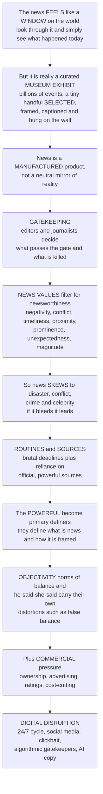

# 📰 Journalism and News Production

> [!abstract] TL;DR
> The news *feels* like a transparent **window on the world** — you look through it and simply see "what happened today." It is really a heavily curated **museum exhibit**: out of the billions of things that happened, a tiny handful were **selected**, framed, captioned, and hung on the wall while everything else stayed in storage. The study of news production shows that news is **not a neutral mirror** of reality but a *manufactured product*, shaped at every step by human choices, organizational routines, and structural constraints. Four forces do the shaping: **gatekeeping** (at each stage editors decide what passes the gate and what is killed), **news values** (shared criteria — negativity, conflict, timeliness, proximity, prominence, unexpectedness, magnitude — that make the news skew toward disaster, crime, and celebrity: *"if it bleeds, it leads"*), **routines and sources** (deadline-driven reliance on official, powerful sources who get to define what counts as news), and **objectivity norms** (balance and "he said/she said" that carry their own distortions, like false balance). Add commercial pressure, and the digital disruption of 24/7 cycles, clickbait, and algorithmic gatekeepers, and you can explain *why the news looks the way it does* — without resorting to conspiracy. Understanding news production is understanding how the "first draft of history" is actually written.

---

## Intuition

**Analogy — the window that is really a museum exhibit.** Picture the news as a window you stand at every morning to see the world outside. You look through the glass and you feel like you are simply *seeing what happened* — the window is transparent, honest, neutral. That feeling is the great illusion of journalism. What you are actually looking at is not a window at all but a **museum exhibit**. Out of the billions of events that occurred today — every quiet kindness, every mundane commute, every slow structural trend, every ordinary life — a curator walked through the vast warehouse of reality and pulled out a tiny handful of objects. Those few were cleaned up, put behind glass, given a caption, and hung on the wall in a particular order under particular lighting. Everything else stayed in storage, unseen, as if it had never happened. The exhibit is not a lie — the objects on the wall are real. But it is a **selection**, and the act of selecting *is* the act of shaping what you believe the world contains.

So the real question of news production is not "is the news true?" but **"how does the curation happen — and why does the exhibit look the way it does?"** The answer has four moving parts. First, **gatekeeping**: at every stage — the reporter's notebook, the editor's desk, the front-page meeting — someone decides what passes through the gate and what gets killed, and *most of the world never makes it through*. Second, **news values**: journalists select, often unconsciously, by a shared set of criteria for what makes something "newsworthy" — negativity, conflict, timeliness, proximity, prominence (elites and celebrities), unexpectedness, magnitude, human interest. This is *why* the exhibit is dominated by disasters, wars, crime, and famous people; it is not a conspiracy, it is a filter — which is exactly why *"if it bleeds, it leads."* Third, **routines and sources**: news is manufactured on brutal deadlines by organizations that lean heavily on official, powerful sources (governments, corporations, police, PR) who are easy to reach and *sound* authoritative — so the powerful quietly get to define what is news and how it is framed, a structural bias toward official versions of reality. Fourth, **objectivity norms**: journalism's professional ideal of neutrality produces practices — balance, attribution, "he said/she said" — that have their *own* distortions, most notoriously **false balance**, where a 97-to-3 scientific consensus gets staged as a 50-50 debate. Layer on commercial pressure and the digital earthquake reshaping who curates, and you understand why the window on the world is really a constructed frame.

---

## How It Works

### Core mechanics

1. **News is constructed, not collected.** The foundational insight (Gaye Tuchman, *Making News*) is that there is a difference between an **event** and **news**: an event is something that happens in the world; news is an *account* of it, produced by an organization. "News is what newspapers make it." Reporters do not *find* stories lying around fully formed; they *manufacture* them out of raw happenings using professional conventions. News is therefore a **social construction of reality**, not a transparent recording of it.

2. **Gatekeeping — the chain of gates.** The metaphor (Kurt Lewin; David Manning White's classic "Mr. Gates" study of a wire editor) is that information flows through channels punctuated by **gates**, and at each gate a person or process **selects a few items and rejects the rest**. Most of reality is filtered out before it ever reaches an audience. Gatekeeping is not one decision but a cascade: what a source discloses, what a reporter notices, what an editor approves, what fits the news hole, what leads the broadcast.

3. **The hierarchy of influences.** Gatekeeping operates on *nested levels* (Shoemaker & Reese, *Mediating the Message*): the **individual** journalist's judgments; **routines** (deadlines, beats, the inverted pyramid, "objectivity"); the **organization** (owner, budget, editorial line); **extra-media / institutional** forces (advertisers, sources, government, PR); and **ideological** forces (the taken-for-granted worldview). Any single story is the joint product of all five levels — which is why blaming (or crediting) an individual reporter usually misreads the system.

4. **News values decide what is "newsworthy."** Journalists select events by a shared, largely tacit set of criteria (Galtung & Ruge's pioneering taxonomy; updated by Harcup & O'Neill): **negativity** (bad news), **conflict**, **timeliness / recency**, **proximity**, **prominence** (elite people and elite nations), **unexpectedness**, **continuity** (a running story), **magnitude / threshold**, **human interest**, **celebrity**, and **entertainment**. These filters systematically over-represent conflict, crime, disaster, elites, and drama — the structural reason for the **negativity bias** and *"if it bleeds, it leads."*

5. **Routines and the source relationship.** News is produced under **deadline and resource constraints**, so newsrooms build a **beat system** and a **news net** cast over institutions that reliably generate events (city hall, courts, police). To fill the net cheaply, journalists rely on **official, institutional sources** who provide "information subsidies" (press releases, briefings, staged events). This gives powerful institutions a **structural advantage**: they become the **"primary definers"** of issues (Stuart Hall et al.), and elite debate gets **"indexed"** — the range of opinion in the news tracks the range of opinion among officials, not the public (W. Lance Bennett). The result is a subtle, non-conspiratorial bias toward the powerful — sharpened by the general **"PR-ization"** of news as newsrooms shrink and PR expands.

6. **Objectivity as a strategic ritual.** Objectivity is journalism's professional **ideology**, but its practices are also defensive **rituals** (Tuchman) that let reporters deflect criticism: quote both sides, attribute every claim, present conflicting truth-claims without adjudicating. These rituals produce real pathologies — **false balance / "bothsidesism,"** *he-said/she-said* stalemates, over-reliance on sources to carry the story, and the "view from nowhere" that hides the reporter's own framing choices. Objectivity coexists with journalism's self-image as the **fourth estate** and democratic **watchdog**.

7. **Commercial and structural pressure.** Ownership, advertising, ratings, and cost-cutting push toward **infotainment, tabloidization, and soft news**, and away from expensive **foreign and investigative reporting**. The collapse of the advertising model has hollowed out **local news** ("news deserts"). This is where news production meets **political economy**.

8. **The digital disruption.** The whole machine is being rebuilt: the **24/7 cycle** and real-time metrics reward speed and **clickbait**; **social media** is now a sourcing *and* distribution layer; **citizen journalism / user-generated content** widen who can produce news; and **algorithmic gatekeepers** — platform feeds and recommender systems — increasingly decide what news reaches whom. Add **automated / AI-generated** copy and a crisis of **trust, misinformation, and "post-truth,"** and the foundations of who decides what is news are shifting.

### Flow / architecture



---

## Key Concepts

### Secondary (intuitive foundations)
- **News is made, not found.** Journalists do not simply *report* everything that happens; they *choose* a tiny fraction and turn it into stories. The news is a selection, not a mirror.
- **Gatekeeping:** at every step, an editor or reporter decides what gets in and what gets thrown out. Most of what happens in the world never becomes news.
- **News values / "if it bleeds, it leads":** stories get chosen because they are dramatic, negative, surprising, close to home, or about famous people — which is why the news is full of disasters, crime, and celebrities even when daily life is mostly calm.
- **Why it matters:** whoever decides what is covered — and how it is described — quietly shapes what everyone thinks is going on in the world.

### Undergraduate (mechanisms and evidence)
- **Event vs news (Tuchman):** the social construction of news — "making" news out of raw happenings via professional conventions; news as a "frame" placed on reality.
- **The gatekeeping tradition:** Lewin's channels-and-gates model; White's "Mr. Gates" study showing how *personal* an early gate could be, and later work showing how *routine* and predictable gatekeeping really is.
- **Galtung & Ruge's news values** and the **Harcup & O'Neill** update: the taxonomy of newsworthiness (negativity, conflict, proximity, prominence, unexpectedness, threshold, continuity, human interest, celebrity, follow-up, exclusivity, entertainment).
- **The negativity and episodic bias:** why bad news dominates, and why coverage of a single dramatic case ("episodic") crowds out slow structural trends ("thematic").
- **The beat system and the news net:** how newsrooms organize coverage around institutions, and why that makes official sources so central.
- **Information subsidies and primary definers:** how governments, corporations, and PR *supply* pre-packaged material that the deadline-pressed newsroom absorbs, giving the powerful a structural advantage in defining issues.
- **Objectivity as practice:** attribution, balance, the inverted pyramid — and their failure mode, **false balance**.

### Graduate (theory, contestation, and the digital turn)
- **Hierarchy of influences (Shoemaker & Reese):** the multi-level model — individual, routines, organization, institutional/extra-media, ideological — as an integrative theory of what shapes content, and debates over which level dominates.
- **Indexing (Bennett) vs the manufacturing-consent / propaganda model (Herman & Chomsky):** two accounts of source power. Indexing: coverage tracks the *range of elite debate*, expanding and contracting with official disagreement. The propaganda model: structural "filters" (ownership, advertising, sourcing, flak, ideology) systematically screen news to serve elite interests. Compare their mechanisms and testability.
- **Objectivity as a strategic ritual (Tuchman) and the "view from nowhere":** objectivity as an epistemology *and* an occupational defense; critiques from standpoint and interpretive traditions; the tension between neutrality and accountability journalism.
- **Field theory and the sociology of journalism (Bourdieu):** the journalistic field, its autonomy vs heteronomy, and how commercial and political poles bend coverage; pack journalism and homogenization.
- **Political economy of news:** ownership concentration, advertising dependence, and the collapse of the business model; tabloidization, the decline of investigative/foreign reporting, and the local-news crisis as structural, not moral, outcomes.
- **Algorithmic gatekeeping and platformization:** feeds and recommender systems as the *new* gates; the reconfiguration of sourcing and distribution; automated journalism; and the entanglement with misinformation, trust collapse, and the "post-truth" information environment.

---

## Python Demo

```python
# Journalism and news production — two demonstrations:
#   (a) THE GATEKEEPING FUNNEL and the NEWS-VALUES BIAS
#       model a day's pool of "events", each with news-value attributes;
#       compute a newsworthiness score; only the top tiny fraction passes
#       the gate -> show (1) the funnel and (2) how the PUBLISHED set
#       massively over-represents negativity/conflict vs the base rate.
#   (b) FALSE BALANCE
#       a 97-to-3 expert consensus staged as equal-time "debate" distorts
#       what the audience believes the consensus is.
import numpy as np
import matplotlib.pyplot as plt

rng = np.random.default_rng(42)

# ------------------------------------------------------------------ #
# (a) GATEKEEPING FUNNEL + NEWS-VALUE SELECTION BIAS
# ------------------------------------------------------------------ #
N = 20000                          # a day's pool of potential "events"
values = ["negativity", "conflict", "timeliness", "proximity",
          "prominence", "magnitude", "unexpectedness"]

# real life is mostly mundane: each news value is usually LOW
# (Beta(1.5, 6) is skewed toward zero -> most events are not dramatic)
E = rng.beta(1.5, 6.0, size=(N, len(values)))

# journalists weight negativity and conflict most heavily
w = np.array([0.28, 0.24, 0.14, 0.10, 0.12, 0.08, 0.04])
w = w / w.sum()
score = E @ w                      # newsworthiness score per event

# the news hole is tiny: only the top 100 events get published
n_published = 100
thresh = np.sort(score)[-n_published]
published = score >= thresh

# build a funnel via cumulative gates on the score distribution
p = np.percentile(score, [0, 60, 90, 99])          # successive gates
stages = ["World events", "Reach a beat/reporter",
          "Pass reporter", "Pass editor", "Published (news hole)"]
counts = [N,
          int((score >= p[1]).sum()),
          int((score >= p[2]).sum()),
          int((score >= p[3]).sum()),
          int(published.sum())]

# BIAS: mean news-value profile of ALL events vs PUBLISHED stories
base_profile = E.mean(axis=0)
pub_profile  = E[published].mean(axis=0)

# ------------------------------------------------------------------ #
# (b) FALSE BALANCE: 97/3 evidence staged as 50/50 coverage
# ------------------------------------------------------------------ #
consensus_pro, consensus_con = 97, 3               # share of expert weight
coverage_pro, coverage_con   = 50, 50              # equal-time "balance"
# audiences infer consensus roughly from the airtime each side gets
audience_pro = coverage_pro
audience_con = coverage_con

# ------------------------------------------------------------------ #
# Plot
# ------------------------------------------------------------------ #
fig, ax = plt.subplots(1, 3, figsize=(16, 4.8))

# (a1) the gatekeeping funnel (log scale: 20000 -> 100)
y = np.arange(len(stages))[::-1]
ax[0].barh(y, counts, color="#2c3e50")
for yi, c in zip(y, counts):
    ax[0].text(c * 1.15, yi, f"{c:,}", va="center", fontsize=9)
ax[0].set_yticks(y); ax[0].set_yticklabels(stages, fontsize=9)
ax[0].set_xscale("log")
ax[0].set_xlabel("Number of items (log scale)")
ax[0].set_title("(a1) The gatekeeping funnel")

# (a2) news-value bias: base rate vs published
x = np.arange(len(values)); bw = 0.4
ax[1].bar(x - bw/2, base_profile, bw, color="#95a5a6", label="All events (base rate)")
ax[1].bar(x + bw/2, pub_profile,  bw, color="#c0392b", label="Published news")
ax[1].set_xticks(x)
ax[1].set_xticklabels(values, rotation=40, ha="right", fontsize=8)
ax[1].set_ylabel("Mean attribute intensity")
ax[1].set_title("(a2) News over-represents negativity/conflict")
ax[1].legend(fontsize=8)

# (b) false balance
groups = ["Scientific\nevidence", "Balanced\ncoverage", "Audience\nperception"]
pro = [consensus_pro, coverage_pro, audience_pro]
con = [consensus_con, coverage_con, audience_con]
gx = np.arange(len(groups))
ax[2].bar(gx, pro, color="#16a085", label="Consensus / mainstream side")
ax[2].bar(gx, con, bottom=pro, color="#e67e22", label="Fringe / dissenting side")
ax[2].set_xticks(gx); ax[2].set_xticklabels(groups, fontsize=9)
ax[2].set_ylabel("Share of weight / airtime / belief")
ax[2].set_title("(b) False balance distorts perceived consensus")
ax[2].legend(fontsize=8, loc="lower center")

plt.tight_layout()
plt.savefig("news_production.png", dpi=120)

pass_rate = 100 * published.sum() / N
print(f"Only {published.sum()} of {N:,} events published "
      f"({pass_rate:.2f}% pass the gate)")
print("Negativity intensity  — base rate: "
      f"{base_profile[0]:.2f}  vs  published: {pub_profile[0]:.2f}  "
      f"({pub_profile[0]/base_profile[0]:.1f}x)")
print("Conflict intensity    — base rate: "
      f"{base_profile[1]:.2f}  vs  published: {pub_profile[1]:.2f}  "
      f"({pub_profile[1]/base_profile[1]:.1f}x)")
```

Panel **(a1)** is the gatekeeping funnel: 20,000 daily happenings collapse to roughly 100 published stories — a fraction of a percent survives the chain of gates. Panel **(a2)** is the news-values bias: because journalists weight negativity and conflict most heavily, the *published* set has far higher average negativity and conflict than the world's actual base rate (typically several-fold), so the news systematically paints reality as more violent and adversarial than it is — the mechanics behind *"if it bleeds, it leads."* Panel **(b)** is false balance: a 97-to-3 expert consensus, staged as equal airtime under the objectivity norm of "balance," is read by audiences as a genuine 50-50 controversy — the same facts, distorted into a manufactured debate.

---

## Real-World Applications

- **The "crime wave" during falling crime.** Because negativity, conflict, and unexpectedness are strong news values, saturation coverage of violent incidents drives public fear and "tough on crime" demand even as official crime rates decline — a textbook consequence of the news-values filter rather than any change in reality.
- **Disaster and "parachute" coverage.** A distant famine or war becomes news only when it crosses a **magnitude threshold** or gains an elite/celebrity hook; the same suffering at lower intensity, or without a Western angle, stays in storage — Galtung & Ruge's proximity and prominence filters in action.
- **Government by press release.** Reduced newsrooms increasingly run PR "information subsidies" nearly verbatim; corporate and state communications teams now outnumber journalists, so the **primary definers** get their framing into print with minimal friction — the "PR-ization" of news.
- **Indexing in war coverage.** When elites agree (e.g., the run-up to a broadly bipartisan war), critical framing nearly vanishes from mainstream news; when elites split, dissent reappears — coverage indexed to the *range of official debate*, not to public opinion or ground truth.
- **False balance on climate and vaccines.** For decades, "balanced" coverage paired an overwhelming scientific consensus with a fringe skeptic as if the two were equal, manufacturing a public sense of live controversy where the evidence was lopsided — the classic pathology of the objectivity norm.
- **Algorithmic gatekeeping and the local-news collapse.** Platform feeds now decide which stories reach whom (the new gate), while the advertising model that funded local reporting has cratered, producing "news deserts" where whole communities lose the watchdog function entirely.

---

## Common Pitfalls

- **Mistaking selection bias for conspiracy.** The signature error is inferring that skewed coverage proves coordinated deception. News values, deadlines, and sourcing routines produce systematic distortion *structurally* — no one has to conspire for "if it bleeds, it leads" to hold. Reaching for conspiracy hides the more powerful, mundane explanation.
- **Treating objectivity as the opposite of bias.** Objectivity is a set of *practices*, and those practices have their own distortions — false balance, source-driven stories, the "view from nowhere." Assuming a "balanced" report is therefore an *accurate* report ignores that balancing unequal evidence is itself a distortion.
- **Blaming the individual journalist.** Because content is a product of nested levels (routines, organization, ownership, ideology), attributing a story purely to one reporter's choices misreads the system. The interesting variance usually lives in the *routines and structures*, not personalities.
- **Assuming more sources means more diversity.** Newsrooms clustered on the same beats, drawing on the same officials and wire feeds, produce **pack journalism** and homogenized coverage — many outlets, one story. Volume of coverage is not variety of perspective.
- **Reading the news as a population sample.** The published set is a *heavily filtered, non-random* draw from reality. Estimating base rates (of crime, risk, group behavior) from news frequency is a category error — the news is engineered to over-sample the rare and dramatic.
- **Thinking digital gatekeeping removed the gates.** Platforms did not abolish gatekeeping; they *relocated* it into opaque algorithms optimized for engagement. The gate still exists — it is just less visible, less accountable, and tuned to metrics rather than editorial judgment.

---

## Related Concepts

- [[Media_Propaganda_and_Political_Communication]] — the political-communication view of how media shape belief and power; news production supplies the *upstream machinery* (gatekeeping, sourcing, indexing) that propaganda models such as Herman & Chomsky's build on.
- [[Public_Opinion_and_Political_Socialization]] — mass opinion forms around whatever the news makes salient; the news-values filter and source relationship help determine *what* the public ends up with opinions about.
- [[Media_Culture_and_Cultural_Industries]] — the sociology of media as a culture industry; treats news as a commodity produced under commercial logic, complementing the newsroom-level account here.
- [[Work_Organizations_and_Bureaucracy]] — news is manufactured inside bureaucratic organizations under deadlines and routines; the sociology of organizations explains *why* beats, news nets, and standardized formats emerge.
- [[Media_Literacy_and_Source_Evaluation]] — the reader-side counterpart: once you know news is curated and source-driven, evaluating provenance, framing, and evidentiary weight becomes a critical-thinking skill.
- [[Political_and_Public_Rhetoric]] — the craft of naming, emphasis, and persuasion that sources and journalists use in frame-building; the rhetorical dimension of how news is worded.

Within this vault, *Journalism_and_News_Production* is the **institutional/production** engine sitting beneath the effects theories — it explains where the agendas and frames analyzed in *Agenda_Setting_Priming_and_Framing* are *built*. It complements *Media_Industries_and_Political_Economy* and *Media_Ownership_and_Regulation* (the commercial and structural constraints on the newsroom), *Media_and_Democracy_the_Public_Sphere* (news as the fourth estate and the raw material of democratic deliberation), *Misinformation_Disinformation_and_Fake_News* (what happens when the production and trust systems break down), and *Platforms_Algorithms_and_Curation* (the algorithmic gatekeepers now reshaping who decides what is news).

---

## Review Questions

1. **(Secondary)** Explain, using the museum-exhibit analogy, why the news is not a "window on the world." Give one everyday example of a story that got covered because of its news values, and one important thing that probably went uncovered because it lacked them.
2. **(Secondary)** What does *"if it bleeds, it leads"* mean, and which news values does it reflect? Why can the news make crime feel like it is rising even when it is falling?
3. **(Undergraduate)** Define gatekeeping and describe the chain of gates a story passes through from happening to headline. Why do scholars argue gatekeeping is more *routine* than *personal*, despite White's "Mr. Gates"?
4. **(Undergraduate)** Explain how deadline pressure and the beat system lead newsrooms to rely on official sources, and how that hands the powerful a structural advantage as "primary definers." What is an "information subsidy"?
5. **(Graduate)** Compare Bennett's *indexing* hypothesis with Herman & Chomsky's *propaganda model* as accounts of source power in the news. What mechanism does each propose, what does each predict about coverage of an elite-consensus war, and how would you test them?
6. **(Graduate)** Objectivity is described by Tuchman as a "strategic ritual." Explain what that means, use *false balance* to illustrate how an objectivity practice can distort, and assess whether algorithmic gatekeeping makes the objectivity ideal more or less relevant.

---

## Sources

- Tuchman, G. (1978). *Making News: A Study in the Construction of Reality.* Free Press.
- Galtung, J., & Ruge, M. H. (1965). *The Structure of Foreign News.* Journal of Peace Research, 2(1), 64–91. — with Harcup, T., & O'Neill, D. (2001). *What Is News? Galtung and Ruge Revisited.* Journalism Studies, 2(2), 261–280.
- Shoemaker, P. J., & Reese, S. D. (2014). *Mediating the Message in the 21st Century: A Media Sociology Perspective* (3rd ed.). Routledge. (Hierarchy of influences.)
- Herman, E. S., & Chomsky, N. (1988). *Manufacturing Consent: The Political Economy of the Mass Media.* Pantheon.
- Bennett, W. L. (1990). *Toward a Theory of Press-State Relations in the United States.* Journal of Communication, 40(2), 103–127. (Indexing.)

---

#media-studies #journalism #news-values #gatekeeping #news-production
