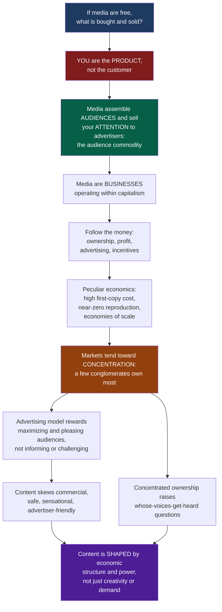

# Media Industries and Political Economy

> [!abstract] TL;DR
> The political economy of communication studies media not as neutral carriers of culture but as **industries** shaped by ownership, market structure, profit motives, advertising, and labour. Its unsettling starting point: when media are "free," you are not the customer but the **product** — media companies assemble audiences and sell your attention (and now your data) to advertisers. To understand what media *do*, follow the money. Because media's peculiar economics (high first-copy costs, near-zero reproduction) drive markets toward **concentration**, and because the advertising model rewards maximizing and pleasing audiences rather than informing them, content is powerfully shaped by the economic structures and power relations of its production — not creativity or demand alone.

---

## Intuition

**Analogy:** You settle in to watch a "free" TV show or scroll a "free" social feed. Ask the one question that unlocks the entire political economy of media: *if it's free, what is really being bought and sold, and who profits?* The answer is jarring. **You** are not the customer — you are the merchandise. The real transaction happening while you relax is that a media company is assembling an **audience** (you and millions like you) and selling your **attention** to advertisers. Dallas Smythe called this the *audience commodity*: the true product of commercial broadcasting is not programmes but audiences, delivered to advertisers by the ratings point.

Once you see media as businesses operating inside capitalism rather than as innocent storytellers, everything shifts. Media have peculiar economics — it costs a fortune to make the *first* copy of a film or newspaper, but almost nothing to make the millionth. That single fact (high first-copy costs, near-zero reproduction, economies of scale) means bigger is cheaper and winners take most, so media markets tend to **concentrate** into a handful of giant conglomerates. And because the money comes from advertisers, the incentive is to maximize audiences and keep them agreeable — pushing content toward the commercially safe, the sensational, and the advertiser-friendly, while starving unprofitable-but-vital fare like local news and investigative journalism. The deep lesson of political economy is that media content is the output of an **industrial machine**, and to read the messages you must first understand the ownership, money, and power that manufacture them.

---

## How It Works

The critical political economy tradition (Smythe; Golding & Murdock; Mosco; Herman & Chomsky; McChesney) asks a chain of questions that runs from the "free lunch" to the shaping of culture:

1. **Follow the free lunch.** If a good is given away, the exchange lies elsewhere. Commercial media give away content to *assemble* audiences and sell those audiences to advertisers — a **two-sided market** (content attracts audiences; audiences are sold to advertisers).
2. **Treat media as businesses.** Media firms are capitalist enterprises seeking profit, and information goods have peculiar economics: **high first-copy costs**, near-zero marginal reproduction cost, **public-good** (non-rival) character, and radical demand uncertainty ("nobody knows" which hit will land).
3. **Derive concentration.** Falling average cost with scale (economies of scale and scope) means large firms undercut small ones; markets **tip toward oligopoly**, achieved through horizontal, vertical, and cross-media integration into conglomerates.
4. **Trace the commercial imperative.** Advertising revenue rewards *maximizing* audiences (or maximizing advertiser-valued audiences) and keeping them content — steering output toward the safe, formulaic, and sensational, and marginalizing content that does not deliver profitable audiences.
5. **Ask whose voices.** Concentrated ownership raises the democratic question of who gets amplified and who is ignored — the terrain of the **propaganda model** and of debates over diversity, pluralism, and the public sphere.

### Flow / Architecture



---

## Key Concepts

### Secondary Level

**Media are businesses, not just storytellers.** The political economy approach begins by refusing to take media at face value. A newspaper is a company; a streaming service is a company; a social platform is one of the most profitable companies on Earth. Whatever cultural or civic role media play, they play it while trying to make money — and their money-making structure shapes what they produce.

**The "free lunch" and the audience commodity.** Broadcast television, ad-supported radio, most websites, and social feeds are "free" to you because someone else pays: **advertisers**. What advertisers buy is *access to your attention*. So the media company's real job is to assemble the largest (or most valuable) audience it can and rent that audience out. Dallas Smythe's phrase — the **audience commodity** — captures the reversal: the audience is not the consumer of the product, the audience *is* the product.

**Concentration: a few own most.** Look at who owns what and a pattern jumps out: a small number of conglomerates own a huge share of what we watch, read, and hear. Media markets tend to consolidate rather than fragment. That raises a democratic worry — if few hands control the pipes of public conversation, whose interests get amplified and whose get left out?

**The commercial imperative.** Because revenue depends on audiences and advertisers, media are pulled toward whatever reliably attracts eyeballs and keeps sponsors comfortable: the sensational, the formulaic, the reassuring, the celebrity-driven. Content that matters democratically but does not pay — local council coverage, months-long investigations, minority-interest programming — tends to get cut. This is not (usually) a conspiracy; it is the logic of the balance sheet.

### Undergraduate Level

**The peculiar economics of information goods.** Media and information goods behave unlike apples or haircuts:

| Property | Meaning | Consequence |
|---|---|---|
| **High first-copy cost** | Enormous fixed cost to produce copy #1 (film, newspaper edition, game) | Small producers cannot amortize the cost; scale is decisive |
| **Near-zero marginal cost** | Copy #2 to #1,000,000 costs almost nothing (broadcast, streaming, PDF) | Average cost keeps falling as audience grows |
| **Public-good character** | Non-rival: my consumption does not diminish yours | Hard to exclude/charge; supports the ad-funded model |
| **Experience / credence good** | Value known only after consuming (or never verifiable) | Branding, stars, franchises reduce buyer uncertainty |
| **Demand uncertainty ("nobody knows")** | No reliable way to predict hits | Risk-spreading: blockbusters, sequels, portfolios, windowing |

Together these produce strong **economies of scale and scope**, and hence a structural drift toward concentration, blockbuster strategies, and **windowing** (releasing the same title across theatrical, streaming, and licensing windows to price-discriminate over time). They also sustain the tension between **hit-driven** logic and the **long tail** of niche content.

**Revenue models.** Media monetize through **advertising**, **subscription**, **licensing/syndication**, **direct sale** (box office, downloads), **public funding** (license fees, taxation — the BBC, PBS), and increasingly **data**. Each model bends incentives differently: advertising rewards maximizing reach and dwell time; subscription rewards retention and perceived quality; public funding (in principle) rewards service to citizens rather than consumers.

**Two-sided markets and Smythe's audience commodity.** Ad-funded media are classic **two-sided platforms**: content is the loss-leader that draws the audience on side one; the audience's attention is the product sold on side two. Smythe (1977) argued this makes *audience labour* — the "work" of watching, generating ratings and now data — the hidden engine of the media economy.

**Ownership and its measurement.** Concentration takes several forms: **horizontal integration** (owning many outlets of the same type), **vertical integration** (owning production, distribution, and exhibition), **cross-media ownership** (press + broadcast + online), and full **conglomeration** (a diversified empire). It is measured with the **Herfindahl-Hirschman Index (HHI)** — the sum of squared market shares — and **concentration ratios** (e.g. CR4, the combined share of the top four firms). Rising HHI/CR4 is the quantitative signature of an oligopolizing market.

**Herman & Chomsky's propaganda model.** *Manufacturing Consent* (1988) models how structurally, not conspiratorially, corporate media filter news through five **filters**: (1) concentrated **ownership** and profit orientation; (2) **advertising** as the primary income source; (3) reliance on official **sourcing** (government, business, "experts"); (4) **flak** (organized negative responses that discipline coverage); and (5) a unifying **ideology** (anti-communism then, market/national-security framing now). The claim: without any central censor, these filters systematically narrow the range of acceptable debate.

### Graduate Level

**The tradition and its stakes.** Critical political economy of communication (Smythe; Garnham; Golding & Murdock; Mosco; McChesney) insists that to explain media *content and effects* you must analyze the economic and structural conditions of **production** — ownership, market structure, the labour process, state policy — not just texts (as in purely textual analysis) or audiences (as in reception studies). Mosco frames the field around three entry-processes: **commodification** (turning content, audiences, and labour into saleable commodities), **spatialization** (the stretching of media across space via conglomeration and global distribution), and **structuration** (how class, gender, and race relations are reproduced through media institutions).

**The PE-versus-cultural-studies debate.** Political economy has been criticized — notably from cultural studies — for **economic reductionism**: reading content off ownership, underplaying audience agency, textual polysemy, and the real pleasures and meanings media generate. Golding & Murdock reply that political economy does not claim ownership *determines* content mechanically; it maps the **structural pressures and limits** within which meaning is made. The productive synthesis treats production structures and interpretive practices as complementary rather than rival — political economy explains the *conditions*, cultural studies the *contest over meaning* within them.

**Labour and precarity.** The culture industries are also *workplaces*. Behind the glamour lies a labour process marked by project-based, freelance, and **precarious** work, unpaid internships, winner-take-all reward distributions, and — in the platform era — vast quantities of unwaged "prosumer" labour (users generating the content and data that platforms monetize). Political economy foregrounds who creates media value and who captures it.

**The digital turn: platform capitalism.** The framework has surged in relevance. **Platform capitalism** (Srnicek) and **surveillance capitalism** (Zuboff) describe a new terrain in which **data** — not merely attention — is the commodity, extracted via **datafication** and refined by algorithms into prediction and behavioural-modification products. Ownership has re-concentrated around **Big Tech / GAFAM** (Google, Apple, Meta, Amazon, Microsoft), whose network effects and increasing returns produce even sharper tipping toward dominance than legacy media. Meanwhile the **attention economy** intensifies the audience-commodity logic, and the digital advertising duopoly (Google + Meta) captures the revenue that once funded newspapers — helping collapse **legacy-media business models** and hollow out local and investigative journalism ("news deserts"). The old questions — ownership, profit, incentives, whose voices — return in a more powerful and more opaque form.

---

## Python Demo

```python
# The industrial machine behind the messages: two mechanisms of the
# political economy of media, in numpy + matplotlib.
#
#   (A) MARKET CONCENTRATION driven by scale economies:
#       high first-copy cost + near-zero reproduction cost => average cost
#       FALLS with audience => big firms undercut small => market tips to
#       oligopoly. We show the falling average-cost curve and the resulting
#       concentrated share distribution (with HHI and CR4).
#
#   (B) THE AUDIENCE-COMMODITY / COMMERCIAL IMPERATIVE:
#       ad revenue rises with audience, so the profit-maximizing content
#       choice maximizes AUDIENCE, not informational/civic VALUE. We plot
#       the divergence between the ad-revenue-maximizing and the
#       value-maximizing content strategies.

import numpy as np
import matplotlib.pyplot as plt

rng = np.random.default_rng(7)

# ----------------------------------------------------------------------
# (A) Economies of scale => falling average cost
# ----------------------------------------------------------------------
audience = np.linspace(1, 100, 500)          # audience reached (millions)
first_copy_cost = 500.0                        # HIGH fixed cost of copy #1
marginal_cost = 1.0                            # near-zero reproduction cost
avg_cost = (first_copy_cost + marginal_cost * audience) / audience  # AC falls

# Two firms: a small niche outlet vs a large conglomerate
q_small, q_large = 8.0, 80.0
ac_small = (first_copy_cost + marginal_cost * q_small) / q_small
ac_large = (first_copy_cost + marginal_cost * q_large) / q_large

# ----------------------------------------------------------------------
# (A cont.) Increasing-returns dynamics => the market tips to oligopoly
#   bigger share -> lower cost -> lower price -> attracts more audience.
#   Model as preferential attachment with exponent alpha > 1 (increasing
#   returns). Start from near-equal shares; iterate to the attractor.
# ----------------------------------------------------------------------
n_firms = 8
shares = np.ones(n_firms) / n_firms + rng.normal(0, 0.002, n_firms)
shares = np.clip(shares, 1e-6, None)
shares /= shares.sum()
alpha = 1.7                                    # >1 => scale advantage compounds
for _ in range(250):
    w = shares ** alpha
    shares = w / w.sum()
shares = np.sort(shares)[::-1]                 # descending

HHI = float(np.sum(shares ** 2) * 10_000)      # 0..10000 (US DOJ scale)
CR4 = float(np.sum(shares[:4]) * 100)          # top-4 concentration ratio (%)

# ----------------------------------------------------------------------
# (B) Audience commodity + commercial imperative
#   content spectrum c in [0,1]: 0 = civic/informational, 1 = maximally
#   commercial/sensational. Audience RISES with commercial tilt; civic
#   value FALLS. Ad revenue = cpm * audience.
# ----------------------------------------------------------------------
c = np.linspace(0.0, 1.0, 500)
A_max = 100.0
audience_of_c = A_max * (0.20 + 0.80 * c ** 0.7)   # audience grows w/ commercial tilt
civic_value = 1.0 - c                               # informational value declines
cpm = 15.0                                           # revenue per unit audience
ad_revenue = cpm * audience_of_c

c_star_rev = c[np.argmax(ad_revenue)]               # revenue-maximizing content
c_star_val = c[np.argmax(civic_value)]              # value-maximizing content

# ----------------------------------------------------------------------
# Plot
# ----------------------------------------------------------------------
fig, ax = plt.subplots(2, 2, figsize=(13, 9))
fig.suptitle("The Political Economy of Media: Scale, Concentration, and the Commercial Imperative",
             fontsize=13, fontweight="bold")

# Panel 1: falling average cost (economies of scale)
ax[0, 0].plot(audience, avg_cost, color="#1e3a5f", lw=2.5)
ax[0, 0].scatter([q_small, q_large], [ac_small, ac_large],
                 color=["#e63946", "#2a9d8f"], zorder=5, s=70)
ax[0, 0].annotate(f"small outlet\nAC = {ac_small:.1f}", (q_small, ac_small),
                  textcoords="offset points", xytext=(30, 5), color="#e63946")
ax[0, 0].annotate(f"conglomerate\nAC = {ac_large:.1f}", (q_large, ac_large),
                  textcoords="offset points", xytext=(-20, 30), color="#0b6e5f")
ax[0, 0].set_title("High first-copy cost => average cost falls with audience")
ax[0, 0].set_xlabel("Audience reached (millions)")
ax[0, 0].set_ylabel("Average cost per viewer")

# Panel 2: resulting concentrated share distribution
firm_ids = [f"F{i+1}" for i in range(n_firms)]
ax[0, 1].bar(firm_ids, shares * 100, color="#92400e")
ax[0, 1].set_title(f"Market tips to oligopoly  (HHI = {HHI:.0f}, CR4 = {CR4:.0f}%)")
ax[0, 1].set_ylabel("Market share (%)")
ax[0, 1].axhline(100 / n_firms, ls="--", color="gray", alpha=0.6,
                 label="equal-share benchmark")
ax[0, 1].legend()

# Panel 3: ad revenue rises with audience (the audience commodity)
ax[1, 0].plot(audience_of_c, ad_revenue, color="#065f46", lw=2.5)
ax[1, 0].fill_between(audience_of_c, ad_revenue, alpha=0.15, color="#065f46")
ax[1, 0].set_title("Audience commodity: ad revenue = cpm x audience sold to advertisers")
ax[1, 0].set_xlabel("Audience delivered to advertisers (millions)")
ax[1, 0].set_ylabel("Advertising revenue")

# Panel 4: commercial-imperative divergence
ax[1, 1].plot(c, ad_revenue / ad_revenue.max(), color="#e63946", lw=2.5,
              label="ad revenue (normalized)")
ax[1, 1].plot(c, civic_value, color="#1e40af", lw=2.5,
              label="informational / civic value")
ax[1, 1].axvline(c_star_rev, ls="--", color="#e63946", alpha=0.8)
ax[1, 1].axvline(c_star_val, ls="--", color="#1e40af", alpha=0.8)
ax[1, 1].axvspan(min(c_star_val, c_star_rev), max(c_star_val, c_star_rev),
                 color="gray", alpha=0.12)
ax[1, 1].set_title("Commercial imperative: profit optimum diverges from civic optimum")
ax[1, 1].set_xlabel("Content tilt:  0 = civic/informational   ->   1 = commercial/sensational")
ax[1, 1].set_ylabel("Normalized objective")
ax[1, 1].legend(loc="center left")

plt.tight_layout(rect=[0, 0, 1, 0.96])
plt.show()

# ----------------------------------------------------------------------
# Summary
# ----------------------------------------------------------------------
print("=== (A) Scale economies and concentration ===")
print(f"Average cost at small outlet (q={q_small:.0f}): {ac_small:.2f}")
print(f"Average cost at conglomerate (q={q_large:.0f}): {ac_large:.2f}")
print(f"  -> the large firm's per-viewer cost is {ac_small/ac_large:.1f}x lower.")
print(f"Herfindahl-Hirschman Index (HHI): {HHI:.0f}  "
      f"({'highly concentrated' if HHI > 2500 else 'moderately concentrated' if HHI > 1500 else 'competitive'})")
print(f"Top-4 concentration ratio (CR4): {CR4:.0f}%")
print()
print("=== (B) Commercial imperative ===")
print(f"Ad-revenue-maximizing content tilt c* = {c_star_rev:.2f} (commercial extreme)")
print(f"Civic-value-maximizing content tilt  c* = {c_star_val:.2f} (informational extreme)")
print("  -> profit and public interest point in opposite directions:")
print("     the market rewards the sensational; the civic optimum is starved.")
```

Running this shows (A) the average-cost curve collapsing as audience grows, so the conglomerate serves each viewer far more cheaply than the niche outlet and can undercut it — driving the share distribution into an oligopoly with a high HHI and CR4; and (B) that because advertising revenue climbs with audience, the profit-maximizing content choice sits at the commercial/sensational extreme while the civic-value optimum sits at the opposite end. The shaded gap between the two vertical lines *is* the commercial imperative — the structural wedge between what pays and what informs.

---

## Real-World Applications

> **The Walt Disney Company — conglomeration, vertical integration, and windowing.** Disney owns production (Marvel, Lucasfilm, Pixar, 20th Century), distribution and exhibition (Disney+, Hulu, theatrical), and broadcast/cable (ABC, ESPN). The same intellectual property is *windowed* across theatrical, streaming, licensing, merchandise, and theme-park experiences — a textbook demonstration of scale economies and vertical integration that structurally advantages conglomerate IP over independent production.

> **The Google-Meta digital advertising duopoly — the audience commodity, industrialized.** Two firms capture the majority of global digital ad spend by refining Smythe's audience commodity into targeted, data-driven, real-time attention markets. The "customer" is the advertiser; the user's behavioural data is the raw material of prediction products. This is the surveillance-capitalist extension of the two-sided market — and its revenue capture is a direct cause of legacy news outlets' collapse.

> **Sinclair Broadcast Group — concentration and homogenization of local news.** Sinclair's ownership of local US TV stations let it push identical "must-run" segments and centrally produced commentary across dozens of markets, producing a viral 2018 montage of local anchors reading the *same* script word-for-word. It is a vivid illustration of how cross-market ownership concentration can homogenize ostensibly "local" voices — the whose-voices question made concrete.

> **News deserts and hedge-fund newspaper ownership.** As advertising migrated to platforms, the local-newspaper business model collapsed; financial owners such as Alden Global Capital acquired chains and cut newsrooms to extract remaining cash flow. The predictable casualty is exactly the unprofitable-but-vital content political economy predicts is marginalized: municipal accountability reporting and long-form investigative journalism, leaving "news deserts."

> **Netflix — data-driven, hit-and-portfolio economics.** Netflix embodies the peculiar economics of information goods: enormous first-copy production costs, near-zero streaming reproduction cost, and radical demand uncertainty managed through a large portfolio, data-informed commissioning, and global scale. Its subscription model bends incentives toward *retention* and completion metrics rather than advertiser-pleasing reach — a useful contrast case for how revenue model reshapes the commercial imperative.

---

## Common Pitfalls

- **Economic reductionism / ownership determinism** — Concluding that ownership *dictates* content in a one-to-one way. Political economy maps structural *pressures and limits*, not a mechanical stamp; audiences, journalists' professional norms, and textual meaning all mediate. The mature position (Golding & Murdock) treats production structures and interpretive practice as complementary, not rival.
- **Conflating concentration with a uniform effect** — High HHI raises the *probability* that a narrow set of interests structures discourse, but does not guarantee any specific attitude in any specific audience. Structure and effect are distinct levels of analysis; both are needed, neither is sufficient alone.
- **Believing "free" is free** — Ad-funded and platform media are not gifts; the price is your attention and data. Missing the audience-commodity/two-sided structure makes the whole industry unintelligible.
- **Equating market success with the public interest** — Ratings, engagement, and profit measure delivered audiences, not informational value or democratic contribution. The commercial imperative can maximize the former while starving the latter.
- **Treating platforms as neutral pipes** — Framing Google/Meta/TikTok as mere carriers ignores that their design, ranking, and monetization choices are editorial and economic decisions with distributional consequences — political economy applies to them *more* forcefully, not less.
- **Applying legacy political economy unchanged to platforms** — The 1940s-1980s critique targeted mass standardization and audience attention. Platform capitalism adds *data extraction and behavioural modification* and even sharper increasing-returns concentration — a related but distinct mechanism that needs updated analysis, not copy-paste.

---

## Related Concepts

> Sibling notes in this section — *Media_and_Communication_Studies_Overview*, *Journalism_and_News_Production*, *Media_Ownership_and_Regulation*, *Advertising_and_the_Attention_Economy*, *Global_Media_and_Cultural_Imperialism*, *Ideology_Hegemony_and_Media*, and *Popular_Culture_and_the_Culture_Industry* — extend this opener into news production, ownership/regulation, the attention economy, cultural imperialism, ideology, and the culture industry respectively; they are referenced here in prose and linked once created.

- [[Media_Culture_and_Cultural_Industries]] — The sociology-of-media companion: the Frankfurt School culture industry, Gramscian hegemony, Hall's encoding/decoding, and platform/surveillance capitalism. It supplies the cultural-theory half of the debate whose political-economy half this note anchors.
- [[Political_Economy_and_Market_State_Relations]] — The general political-economy framework (markets are politically constructed; varieties of capitalism) that this note specializes to the media sector.
- [[Media_Propaganda_and_Political_Communication]] — The political-communication dimension — agenda-setting, framing, propaganda — that the propaganda model here links to media's economic structure.
- [[Oligopoly]] — The market structure media markets tip toward; supplies the formal analysis of few-firm competition, HHI, and concentration ratios used here.
- [[Public_Goods]] — Formalizes the non-rival, hard-to-exclude character of information goods that underlies the advertising-funded "free lunch."
- [[Returns_to_Scale]] — The producer-theory engine of concentration: high fixed plus low marginal cost yields increasing returns and falling average cost with audience size.
- [[Increasing_Returns_and_Path_Dependence]] — The complexity-economics account of why scale advantages compound and markets tip to winner-take-most — the dynamic behind media concentration and platform dominance.

---

## Review Questions

### Secondary

1. A friend says a social media app is "free." Using the idea of the *audience commodity*, explain who is really the customer, what is being sold, and who profits. Why does this reframing change how you evaluate the app?

2. Media markets tend to consolidate into a few large companies rather than many small ones. Give one economic reason (think about the cost of making the *first* copy versus later copies) and one democratic concern this raises.

### Undergraduate

3. Explain how "high first-copy costs and near-zero reproduction cost" lead, via economies of scale, to market concentration. How do HHI and CR4 let you *measure* that concentration, and what would each look like for a competitive versus an oligopolistic media market?

4. Outline Herman & Chomsky's five filters. Choose one contemporary news event and analyze how *advertising* and *sourcing* filters might have shaped its coverage — without invoking a deliberate conspiracy.

5. The "commercial imperative" predicts that ad-funded media skew toward the sensational and starve local/investigative journalism. Using the audience-commodity model, explain the incentive mechanism, and identify one revenue model that partially breaks it and why.

### Graduate

6. Critics charge political economy with *economic reductionism* for underplaying audience agency and textual meaning. Reconstruct Golding & Murdock's reply and assess whether political economy and cultural studies are genuine rivals or complementary levels of analysis. Use a concrete case.

7. Does the shift from the *attention* commodity to the *data* commodity (surveillance/platform capitalism) represent a genuinely new economic logic, or the extension of Smythe's audience commodity to the digital sphere? Argue the case and draw out the regulatory implications of each position.

8. Design a research project to test whether ownership concentration in a national media market causally reduces content diversity. Specify your unit of analysis, concentration measure, diversity measure, identification strategy, and the confounds (audience agency, professional norms, competitive information environments) that political economy critics would press you on.

---

## Sources

- [Vincent Mosco, *The Political Economy of Communication* (Sage, 2nd ed. 2009)](https://uk.sagepub.com/en-gb/eur/the-political-economy-of-communication/book231370)
- [Robert W. McChesney, *The Political Economy of Media: Enduring Issues, Emerging Dilemmas* (Monthly Review Press, 2008)](https://monthlyreview.org/product/political_economy_of_media/)
- [Robert W. McChesney, *Rich Media, Poor Democracy: Communication Politics in Dubious Times* (University of Illinois Press, 1999; New Press, 2015)](https://www.press.uillinois.edu/books/?id=p069360)
- [Edward S. Herman and Noam Chomsky, *Manufacturing Consent: The Political Economy of the Mass Media* (Pantheon, 1988)](https://www.penguinrandomhouse.com/books/168040/manufacturing-consent-by-edward-s-herman-and-noam-chomsky/)
- [Dallas W. Smythe, "Communications: Blindspot of Western Marxism," *Canadian Journal of Political and Social Theory* 1(3), 1977](https://journals.uvic.ca/index.php/ctheory/article/view/15573)

---

#media-studies #political-economy #media-industries #audience-commodity #media-concentration
