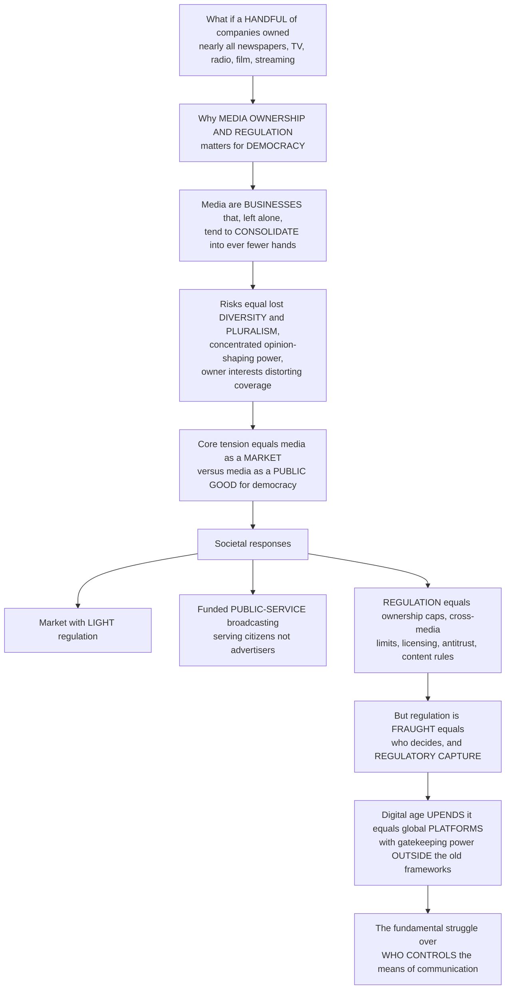

# 🏛️ Media Ownership and Regulation

> [!abstract] TL;DR
> **Media ownership and regulation** is the central drama of media policy: the struggle over *who controls the means of communication* and how societies keep that power compatible with democracy. Democracy depends on media for the diverse information and debate that self-government requires — yet media are also **businesses** that, left to the market, tend to **consolidate** into ever fewer hands. Concentrated ownership threatens to shrink the **diversity** and **pluralism** of voices, hand enormous **opinion-shaping power** to a few unaccountable corporations, and let owners' commercial and political interests distort coverage. This tension — media as a profit-seeking **market** versus media as a **public good** essential to citizenship — has produced three broad responses: **light-touch commercial** systems, funded **public-service broadcasting** (PSB) built to serve citizens rather than advertisers, and **regulatory tools** (ownership caps, cross-media limits, licensing, antitrust, content obligations) meant to protect diversity and competition. But regulation itself is fraught — *who* decides, and can regulators be **captured** by the industries they oversee? And the digital age has upended the whole framework: a handful of global **platforms** (Google, Meta, Amazon, Apple) now wield gatekeeping power no broadcaster ever held, largely *outside* the old rules — making the question of who owns and governs our media one of the most urgent and politically charged issues in media studies.

---

## Intuition

**Analogy — the town's water supply.** Imagine every home in a country drinks from the same water system, and that "water" is *information* — the news, arguments, images, and stories people need to govern themselves. Now imagine that instead of many independent wells, springs, and utilities, the entire supply is owned by a handful of companies. Even if they never *poison* the water, they decide which streams to open and which to let run dry, what gets filtered out, and what gets pumped hardest. You would probably want *some* rules about this — not because the owners are villains, but because a democracy cannot afford to have the substance of its public conversation flow from just a few private taps.

That is the whole problem of media ownership and regulation. Media are simultaneously two things that pull in opposite directions. As **businesses**, they follow the ordinary logic of markets — and left alone, that logic drives toward **consolidation**, because bigger firms enjoy economies of scale, cross-promotion, and bargaining power, so the many independent owners of one generation become the few conglomerates of the next. But as the **infrastructure of democracy**, media are supposed to give citizens a *diverse* range of voices, viewpoints, and sources — the raw material of informed debate. When a few conglomerates own most of what people see and hear, we risk losing that **diversity** and **pluralism**, concentrating the power to shape public opinion in a few unelected corporate hands, and letting owners' interests quietly bend the coverage.

Societies have answered this tension in different ways. Some lean on the **market** with light regulation, trusting competition and press freedom *from* the state. Others build strong **public-service broadcasting** — a BBC-style institution funded to serve citizens rather than advertisers, with a mandate for universality and public-interest content the market underprovides. Most use **regulation**: ownership caps, cross-media limits, licensing of scarce airwaves, and antitrust to keep the market plural and competitive. Yet regulation is never innocent — *who* gets to decide, and what stops regulators from being **captured** by the very industries they police? And now the digital age has scrambled every assumption: the old rules were built for scarce broadcast spectrum, but a few global **platforms** exert gatekeeping power no broadcaster ever had, largely *beyond* the reach of the old frameworks. Understanding media ownership and regulation is understanding the fundamental struggle over who controls the means of communication — and how a free society tries to keep that power from swallowing its own democracy.

---

## How It Works

### Core mechanics

1. **The democratic stakes.** Self-government requires citizens to be informed and able to debate — a function media perform as the *infrastructure of the public sphere*. But the same media are private firms operating in markets. The entire field lives in the gap between **media as a market** (private property, efficiency, and a press *free from* government) and **media as a public good** whose benefits — an informed citizenry, a functioning democracy — spill over to everyone and are *underprovided* by pure market logic. **Diversity** and **pluralism** — of ownership, voices, viewpoints, and sources — are the core values regulation exists to protect.

2. **Why markets consolidate.** Media have high fixed costs and near-zero marginal costs (the first copy of a film or article is expensive; the millionth is nearly free), producing powerful **economies of scale**. Add **synergy** (a studio, a network, a streaming service, and a news channel cross-promoting each other), **vertical integration** (owning production *and* distribution), and **horizontal integration** (buying up rivals in the same segment), and the market logic points relentlessly toward **conglomeration** — a handful of global giants and a long tail of dependents.

3. **Measuring concentration.** Analysts quantify it with **concentration ratios** (the combined market share of the top *N* firms, e.g. CR4), the **Herfindahl-Hirschman Index** (HHI, the sum of squared market shares — higher means more concentrated), and **diversity indices** such as the *effective number of independent voices* (roughly the reciprocal of the HHI). These turn the vague worry "too few owners" into numbers a regulator can act on.

4. **What concentration threatens.** Fewer owners can mean fewer distinct **viewpoints and sources** and more homogenized content; excessive **power over public opinion and the political agenda** in few unaccountable hands; **owner interference** and commercial or political **bias** (editorial pressure, self-censorship, conflicts of interest); higher **barriers to entry** that silence alternative and minority voices; and the erosion of **localism** and public-interest content. Whether — and how much — ownership actually shapes content is an active empirical debate, but the *structural risk* is what policy targets.

5. **Models of media systems.** Comparative work (Hallin & Mancini) maps systems onto a spectrum: the **liberal/market model** (US-leaning, commercial dominance, light regulation), the **democratic-corporatist model** (strong commercial *and* strong public-service media, e.g. Northern Europe), and the **polarized-pluralist model** (weaker professionalization, closer state-media ties). Cross-cutting this: the **market/commercial** approach, robust **public-service broadcasting** (PSB), and outright **state-controlled** media — a spectrum from free-market to public-service to authoritarian control.

6. **The regulatory toolkit.** *Why* regulate: historically **spectrum scarcity** (only so many broadcast frequencies), plus **market failure**, the **public interest**, **diversity**, and **competition**. The **tools**: **ownership caps** and **cross-media ownership limits**, **licensing** and spectrum allocation, **antitrust / competition law** and **merger review**, **must-carry / access** rules, **public-interest and content obligations**, and the **funding of PSB and community media**. Regulators — the FCC in the US, Ofcom in the UK — administer these against a permanent **press-freedom-versus-public-interest** tension.

7. **The politics of regulation.** Rules are not written in a vacuum. **Regulatory capture** — regulators coming to serve the industries they oversee — is a standing danger, driven by lobbying, the revolving door, and information asymmetry. Deregulation waves (the 1996 US Telecommunications Act loosened ownership limits and unleashed mergers) show how the *rules themselves* are political prizes. Free-speech and First-Amendment tensions constrain content rules, and "diversity" and "the public interest" are notoriously hard to define and measure.

8. **The digital disruption.** The internet dissolved **spectrum scarcity** as a rationale, and a few global **platform gatekeepers** — Google, Meta, Amazon, Apple — now curate, rank, and monetize communication at a scale and with a data advantage no broadcaster ever had, largely *outside* the old broadcast frameworks. This reopens everything: **net neutrality**, **platform antitrust** and "break up Big Tech," **content moderation and liability** (Section 230 in the US, the EU's Digital Services Act and Digital Markets Act), and a worldwide scramble to build new rules for the digital public sphere.

### Flow / architecture



---

## Key Concepts

### Secondary (intuitive foundations)
- **Media ownership:** who actually *owns* the newspapers, TV channels, radio stations, studios, and streaming services — and whether that is many independent owners or a few big companies.
- **Concentration:** the trend of media falling into fewer and fewer hands as big companies buy up smaller ones.
- **Why it matters for democracy:** people rely on media to learn about the world and debate. If only a few owners control what everyone sees, the range of voices shrinks and a few companies gain huge power over public opinion.
- **Public-service broadcasting:** media (like the BBC) funded by the public to serve *citizens* rather than to make a profit for advertisers — meant to provide trustworthy, universal, public-interest content.
- **Regulation:** rules governments make to keep media diverse and fair — for example, limiting how much one company can own.

### Undergraduate (mechanisms and evidence)
- **Market versus public good:** the core tension. Markets reward efficiency and protect the press *from* the state, but democracy needs media to supply an informed citizenry — a benefit the market **underprovides**, the classic public-good and market-failure logic.
- **Forms of ownership:** private/commercial, public/state, community/non-profit, and mixed systems — each with different incentives.
- **Integration types:** **horizontal** (buying rivals in the same market), **vertical** (owning production *and* distribution), and **cross-media / cross-sector** (owning across newspapers, TV, radio, and online), plus **conglomeration** into diversified giants.
- **Measurement:** **concentration ratios** (CR4), the **HHI** (sum of squared shares), and **diversity indices** (effective number of independent voices ≈ 1/HHI).
- **The concerns, specified:** reduced viewpoint/source diversity and homogenization; concentrated agenda-setting power; owner interference, commercial/political bias, and self-censorship; barriers to entry silencing minority voices; erosion of localism.
- **Comparative media systems (Hallin & Mancini):** liberal/market, democratic-corporatist, and polarized-pluralist models — different mixes of commercial media, public-service media, and state involvement.
- **The regulatory tools:** ownership caps, cross-media limits, licensing and spectrum allocation, antitrust/merger review, must-carry/access rules, public-interest content obligations, and PSB/community-media funding.
- **Regulators and their tension:** the FCC (US) and Ofcom (UK) balancing a **libertarian / press-freedom** claim against a **public-interest** mandate.

### Graduate (theory, contestation, and the digital frontier)
- **The critical political economy tradition (McChesney, Bagdikian):** *Rich Media, Poor Democracy* and *The New Media Monopoly* argue that concentrated, advertiser-funded, profit-maximizing media systematically produce **hyper-commercialism, depoliticized content, and a democracy deficit** — locating the problem in the *structure of ownership and finance*, not individual bias.
- **The empirical content-effects debate:** how much does ownership actually shape output? Evidence is mixed and method-dependent (chain versus independent ownership, common-owner slant, endogenous market entry) — a live contest between structural-determinist and market-response accounts.
- **PSB theory:** universality, independence, and the **citizen-versus-consumer** distinction; funding models (licence fee, public grant) and their vulnerabilities; the "market-failure" versus "citizenship / merit-good" justifications for public funding.
- **Regulatory capture and public-choice analysis:** why regulators drift toward the regulated (concentrated benefits, diffuse costs, the revolving door), and the political economy of **deregulation** (the 1996 Telecommunications Act; ownership-cap rollbacks).
- **Napoli's *Foundations of Communications Policy* framing:** communications policy as the contested pursuit of **diversity, competition, and localism** under shifting technological and First-Amendment constraints, and the difficulty of operationalizing "the public interest."
- **The obsolescence of spectrum scarcity:** the rationale that justified broadcast licensing collapses online — raising the question of what, if anything, replaces it as a basis for regulating abundant digital speech.
- **Platform gatekeeping and the new political economy:** attention markets, data extraction, network effects, and **two-sided market** dynamics give Google/Meta/Amazon/Apple structural gatekeeping power; debates over **platform antitrust**, **net neutrality**, **Section 230 / intermediary liability**, and the EU's **DSA/DMA** as attempts to build a new regulatory paradigm for the **digital public sphere** — including emerging questions about AI-mediated media.

---

## Python Demo

```python
# Media ownership & regulation — three demonstrations:
#   (a) CONSOLIDATION over time: distinct owners fall as mergers accumulate,
#       and an OWNERSHIP CAP preserves more owners than an unregulated market
#   (b) CONCENTRATION (HHI) rising over time, unregulated vs capped
#   (c) VIEWPOINT DIVERSITY vs CONCENTRATION: effective number of independent
#       voices falls as HHI rises — and a funded PUBLIC-SERVICE broadcaster
#       (PSB) sustains a diversity FLOOR the market underprovides
import numpy as np
import matplotlib.pyplot as plt

rng = np.random.default_rng(42)

def hhi(shares):
    # Herfindahl-Hirschman Index on a 0..1 scale (1.0 = pure monopoly)
    return float(np.sum(shares ** 2))

def simulate(init_shares, cap=None, years=30, mergers_per_year=2, seed=1):
    """Repeated mergers shrink the owner count; a cap blocks any merger whose
    combined market share would exceed 'cap' (a regulatory ownership limit)."""
    r = np.random.default_rng(seed)
    shares = init_shares.copy()
    owners_hist, hhi_hist = [len(shares)], [hhi(shares)]
    for _ in range(years):
        for _ in range(mergers_per_year):
            if len(shares) <= 3:
                break
            i, j = r.choice(len(shares), size=2, replace=False)
            combined = shares[i] + shares[j]
            if cap is not None and combined > cap:
                continue                      # regulator blocks the merger
            shares[i] = combined
            shares = np.delete(shares, j)
        owners_hist.append(len(shares))
        hhi_hist.append(hhi(shares))
    return np.array(owners_hist), np.array(hhi_hist, dtype=float)

# a common starting market: 40 independent owners with uneven shares
init = rng.random(40) + 0.2
init /= init.sum()

owners_u, hhi_u = simulate(init, cap=None,  seed=1)   # unregulated
owners_c, hhi_c = simulate(init, cap=0.25,  seed=1)   # 25% ownership cap
years = np.arange(owners_u.size)

# (c) diversity-vs-concentration curve: effective independent voices ~ 1/HHI
conc = np.linspace(hhi_u.min() * 0.9, 0.9, 200)       # concentration axis
voices_market = 1.0 / conc                            # market-only
psb_floor = 4.0                                        # PSB adds guaranteed voices
voices_psb = 1.0 / conc + psb_floor                    # market + public-service

fig, ax = plt.subplots(1, 3, figsize=(16, 4.6))

# (a) number of distinct owners over time
ax[0].step(years, owners_u, where="post", color="#c0392b", lw=2,
           label="Unregulated market")
ax[0].step(years, owners_c, where="post", color="#2980b9", lw=2,
           label="With 25% ownership cap")
ax[0].set_xlabel("Year"); ax[0].set_ylabel("Number of distinct owners")
ax[0].set_title("(a) Consolidation: owners falling")
ax[0].legend(fontsize=8)

# (b) concentration (HHI) over time
ax[1].plot(years, hhi_u, color="#c0392b", lw=2, label="Unregulated market")
ax[1].plot(years, hhi_c, color="#2980b9", lw=2, label="With 25% ownership cap")
ax[1].axhline(0.25, color="#7f8c8d", ls=":", lw=1, label="'highly concentrated'")
ax[1].set_xlabel("Year"); ax[1].set_ylabel("HHI (0..1, higher = concentrated)")
ax[1].set_title("(b) Concentration rising")
ax[1].legend(fontsize=8)

# (c) viewpoint diversity vs concentration, with PSB floor
ax[2].plot(conc, voices_market, color="#c0392b", lw=2, label="Market only")
ax[2].plot(conc, voices_psb,    color="#16a085", lw=2, label="Market + public-service")
ax[2].scatter([hhi_u[-1]], [1.0 / hhi_u[-1]], s=80, color="#c0392b", zorder=3,
              label="Unregulated endpoint")
ax[2].scatter([hhi_c[-1]], [1.0 / hhi_c[-1]], s=80, color="#2980b9", zorder=3,
              label="Capped endpoint")
ax[2].set_xlabel("Concentration (HHI)")
ax[2].set_ylabel("Effective independent voices")
ax[2].set_title("(c) Diversity falls as concentration rises")
ax[2].legend(fontsize=8)

plt.tight_layout()
plt.savefig("media_ownership_regulation.png", dpi=120)
print(f"Owners: unregulated {owners_u[-1]}  vs  capped {owners_c[-1]}")
print(f"Final HHI: unregulated {hhi_u[-1]:.3f}  vs  capped {hhi_c[-1]:.3f}")
print(f"Effective voices: unregulated {1/hhi_u[-1]:.1f}  vs  capped {1/hhi_c[-1]:.1f}")
```

Panel (a) shows the historical arc of **consolidation**: an unregulated market grinds from dozens of owners down to a handful as mergers accumulate, while a **25% ownership cap** blocks the mergers that would create dominant firms and so **preserves more owners**. Panel (b) traces the same process as a rising **HHI** — the unregulated market races past the "highly concentrated" threshold while the capped market plateaus below it. Panel (c) makes the democratic payoff explicit: the **effective number of independent voices** (≈ 1/HHI) collapses as concentration rises, so the unregulated endpoint sits far lower than the capped one — and a funded **public-service broadcaster** lifts the whole curve by a guaranteed **diversity floor**, supplying the plural, public-value content the market underprovides.

---

## Real-World Applications

- **The BBC and public-service broadcasting:** funded by a licence fee to serve citizens rather than advertisers, with a universality-and-public-interest mandate — the archetypal answer to "media as a public good." Its independence, funding, and remit are perennially fought over precisely because it embodies the non-market model.
- **The 1996 US Telecommunications Act and the merger wave:** by loosening national radio and TV ownership caps, it unleashed rapid consolidation (Clear Channel's radio empire; the Disney/ABC, Viacom/CBS, and later AT&T/Time Warner and Disney/Fox mega-deals) — a live case study in deregulation, conglomeration, and the politics of ownership limits.
- **FCC and Ofcom rule-making:** ownership caps, cross-media limits, licence renewals, and merger reviews (e.g. the FCC's contested cross-ownership and national audience-reach rules; Ofcom's media-plurality assessments of deals such as the Fox/Sky bid) — regulation of diversity and competition in practice.
- **Antitrust against Big Tech:** the US v. Google search and ad-tech cases, the FTC's action against Meta, and the EU's **Digital Markets Act** designating platform "gatekeepers" — the migration of media-concentration concern from broadcasters to platforms.
- **Content moderation and intermediary liability:** debates over **Section 230** in the US and the EU's **Digital Services Act** governing what platforms must police and what they are liable for — the frontier where ownership, regulation, and speech collide.
- **Net neutrality fights:** whether ISPs may prioritize or throttle traffic — a distribution-layer analogue of must-carry rules, and a direct battle over gatekeeping in the digital public sphere.

---

## Common Pitfalls

- **Assuming ownership *mechanically* dictates content.** Concentration is a **structural risk**, not a guarantee of biased output; empirical effects are real but contingent and method-dependent. Overclaiming "the owners decide every story" is as wrong as denying any influence.
- **Confusing press freedom *from* the state with the absence of any rules.** The market and the state are not the only threats to a free press; unchecked private concentration can silence voices just as effectively — the "freedom of the press belongs to those who own one" problem.
- **Treating "diversity" and "the public interest" as self-evident.** They are genuinely hard to define and measure (diversity of owners? outlets? viewpoints? sources? formats?), which is why regulation over these values is perpetually contested and litigated.
- **Applying broadcast-era logic to platforms.** The **spectrum-scarcity** rationale that justified licensing does not transfer to abundant digital speech; assuming old tools fit new gatekeepers (or that platforms need no rules because scarcity is gone) both miss the mark.
- **Ignoring regulatory capture.** Rules are only as good as the regulators enforcing them; lobbying, the revolving door, and information asymmetry can turn ownership limits into paper tigers or bend deregulation toward incumbents.
- **Forgetting the funding model.** *Who pays* shapes what media do — advertiser funding pulls toward audiences-as-product and hyper-commercialism, while public funding pulls toward citizenship but raises independence and capture concerns of its own. Ownership without finance is only half the picture.

---

## Related Concepts

- [[Media_Propaganda_and_Political_Communication]] — the political-communication view of how media shape belief and the agenda; concentrated ownership is what makes that opinion-shaping power dangerous when held in few hands.
- [[Public_Opinion_and_Political_Socialization]] — how mass opinion forms and is measured; diverse, plural media are the input this process depends on, which is exactly what concentration threatens.
- [[Political_Economy_and_Market_State_Relations]] — the broader market-versus-state framework in which the "media as market versus media as public good" tension sits.
- [[Monopoly]] — the microeconomics of single-firm dominance: pricing power, deadweight loss, and barriers to entry — the market-structure engine behind media concentration.
- [[Oligopoly]] — a few interdependent firms controlling a market; the standard structure of consolidated national media systems, and the target of much competition policy.
- [[Market_Failures]] — the general logic of why unregulated markets underprovide certain goods; media diversity and an informed citizenry are textbook cases justifying intervention.
- [[Public_Goods]] — the non-rival, non-excludable character of an informed democratic public that markets underprovide — the economic core of the case for public-service broadcasting.
- [[Regulation_and_Regulatory_Economics]] — the general theory of *why* and *how* states regulate, including natural monopoly, the public interest, and **regulatory capture** — directly applied here to media.
- [[Administrative_Law_and_Regulation]] — the legal machinery of regulators (rule-making, licensing, judicial review) through which bodies like the FCC and Ofcom actually operate.
- [[Rights_and_Civil_Liberties]] — free-speech and free-press protections (the First-Amendment tension) that both empower and constrain what media regulation may do.
- [[Agenda_Setting_Priming_and_Framing]] — the media-effects mechanisms that translate control of coverage into influence over public reality; concentration determines *whose* agenda and frames dominate.
- [[Propaganda_and_Persuasion]] — the deliberate-influence end of the spectrum that concentrated, state- or owner-controlled media make easier to deploy.

Within this vault, media ownership and regulation is the institutional-and-political-economy backbone of the section: it grounds *Media_Industries_and_Political_Economy* (the market structure and conglomeration it analyzes), sets the conditions for *Journalism_and_News_Production* (whose newsroom autonomy and resources depend on ownership and funding), supplies the structural stakes for *Media_and_Democracy_the_Public_Sphere* (the diversity and pluralism a democratic public sphere requires), migrates directly into *Platforms_Algorithms_and_Curation* (the new gatekeepers and the digital-regulation frontier), overlaps with *Media_Ethics_and_Regulation* (the normative and content-rule dimension), and connects to *Global_Media_and_Cultural_Imperialism* (concentration and ownership at the transnational scale).

---

## Review Questions

1. **(Secondary)** In your own words, why might it matter for democracy if only a few companies owned most of the newspapers, TV channels, and streaming services in a country? Give one example of a rule a government might use to prevent that.
2. **(Secondary)** What is public-service broadcasting, and how does being funded to serve *citizens* rather than *advertisers* change what such a broadcaster is expected to do?
3. **(Undergraduate)** Explain the core tension between media "as a market" and media "as a public good." How do ownership caps, antitrust, and public-service funding each respond to a different part of that tension?
4. **(Undergraduate)** Using the HHI and the idea of an "effective number of independent voices," explain how you would measure whether a media market has become dangerously concentrated — and what an ownership cap would do to those numbers.
5. **(Graduate)** Critical political economists (McChesney, Bagdikian) argue concentrated, advertiser-funded media produce a "democracy deficit." Evaluate this structural claim against the empirical debate over whether ownership actually shapes content. What evidence would settle it?
6. **(Graduate)** The spectrum-scarcity rationale for broadcast regulation has collapsed online, yet a few platforms now wield unprecedented gatekeeping power. What new *justifications* and *tools* (antitrust, net neutrality, Section 230/DSA reform) could ground a legitimate regulatory framework for the digital public sphere — and how would you guard it against regulatory capture?

---

## Sources

- Hallin, D. C., & Mancini, P. (2004). *Comparing Media Systems: Three Models of Media and Politics.* Cambridge University Press.
- McChesney, R. W. (1999). *Rich Media, Poor Democracy: Communication Politics in Dubious Times.* University of Illinois Press.
- Bagdikian, B. H. (2004). *The New Media Monopoly.* Beacon Press.
- Napoli, P. M. (2001). *Foundations of Communications Policy: Principles and Process in the Regulation of Electronic Media.* Hampton Press.
- Ofcom. *Measurement Framework for Media Plurality* and FCC media-ownership rule-making records (regulatory policy sources on ownership limits, cross-media rules, and public-interest obligations).

---

#media-studies #media-ownership #media-regulation #media-pluralism #public-service-broadcasting
