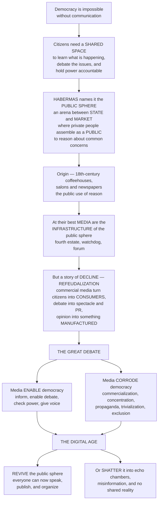

# 🏛️ Media and Democracy: the Public Sphere

> [!abstract] TL;DR
> **Democracy is impossible without communication.** For citizens to govern themselves, they need somewhere to learn what is happening, debate the issues, form public opinion, and hold power accountable — a shared space for public reasoning. Jürgen **Habermas** gave this space a name: the **public sphere** — an arena distinct from the *state* and the *market*, where private citizens assemble as a **public** to discuss matters of common concern and form public opinion through rational-critical debate. He located its origin in the 18th-century **coffeehouses, salons, and newspapers** of the rising bourgeoisie, where — in principle — people bracketed their status and reasoned together, a "public use of reason" that could check rulers. This became the yardstick for judging media's democratic role: at their best, **media are the infrastructure of the public sphere** — the **fourth estate**, the watchdog, the forum, the way a scattered society talks to itself. But Habermas's story is also a tragedy of **decline** ("refeudalization"): as media became big commercial businesses, the public sphere was corrupted — citizens turned into passive **consumers**, debate into spectacle and PR, public opinion into something *manufactured* rather than freely formed. This frames the enduring debate: media can **enable** democracy (informing, debating, checking power, giving voice) or **corrode** it (commercialization, concentration, propaganda, trivialization, exclusion). And in the digital age it frames the urgent question — did the internet **revive** the public sphere (everyone can now speak!) or **shatter** it (into polarized echo chambers and misinformation, with no shared reality)? The health of our media is inseparable from the health of our democracy.

---

## Intuition

**Analogy — the town square, the coffeehouse, and the loudspeaker.** Imagine a small town whose people must decide something together. If they never talk — if there is no square, no notice-board, no café where they gather, no newspaper carrying what the council is doing — then "the people ruling themselves" is an empty phrase. They cannot know what is being decided in their name, cannot argue it out, cannot notice when a leader is lying or stealing. **Self-government literally runs on a shared space for talk.** Now picture that space filling up: strangers set their rank aside, someone reads the news aloud, an argument breaks out, and out of the back-and-forth a rough *sense of the town* emerges — a public opinion the council cannot simply ignore. That café-plus-newspaper is the thing the philosopher Jürgen **Habermas** named the **public sphere**: an arena sitting *between* the government (the state) and the shop (the market), where private people come together *as a public* to reason about their common affairs.

Habermas traced this to a real historical moment — the **coffeehouses of 18th-century London, the salons of Paris, the moral and political journals** — where an emerging middle class practiced the "public use of reason," and where critical publicity first became a force that absolute rulers had to answer to. That ideal became the **measuring stick** for the media ever since: at their best, newspapers, broadcasters, and platforms are the *infrastructure* of that square — the **fourth estate** watching over the other three branches of power, the forum where diverse voices meet, the mirror in which a huge, scattered society sees and debates itself. But here is the twist that makes the concept a *tragedy*, not a fairy tale. Habermas's book is titled the **Structural Transformation** of the public sphere because he watched it **decay**. As media grew into giant advertising-funded businesses, the loudspeaker was captured: the café conversation was replaced by a **managed spectacle**, the reasoning citizen became a passive **consumer** and spectator, and public opinion stopped being something *formed* by the public and became something *manufactured for* the public by PR and marketing. He called this backward slide "**refeudalization**" — a return to the old world where power *displays* itself before a passive audience rather than *justifying* itself to reasoning citizens.

This gives us the single framework into which every "media and politics" question plugs. Media can **enable** democracy — inform the electorate, host the debate, expose the wrongdoing, amplify the voiceless — or they can **corrode** it — through commercialization, ownership concentration, propaganda, trivialization, and the quiet exclusion of everyone who never had access to "the public" in the first place. And feminist and postcolonial critics (Nancy Fraser above all) add a sharp correction: *the* public sphere was never really open to all — women, workers, and colonized peoples were shut out — so real societies always contain many contending **counterpublics**, not one polite consensus. Hold all of this in mind and the great contemporary question comes into focus: did the internet, by letting *everyone* publish and organize, finally build the inclusive public sphere Habermas dreamed of — or did it **shatter** the shared square into a thousand walled gardens of outrage, filter bubbles, and lies with no common reality left to reason about? Understanding the public sphere is understanding the fragile, essential wire connecting **communication** to **self-government**.

---

## How It Works

The public sphere is best read as a *normative model* — an idealized picture of how democratic communication is *supposed* to work — that also functions as a *historical narrative of rise and decline* and a *diagnostic tool* for what has gone wrong.

### Core mechanics

1. **Three separated domains.** Habermas maps social life into the **state** (public authority, law, coercion), the **market/economy** and the **private/intimate** sphere (family, self-interest, needs), and — crucially — a distinct **public sphere** that mediates between citizen and state. It is *of* society but points *at* the state: a space where private people, on their own initiative, discuss public matters and address power. Its lifeblood is **civil society** — the voluntary associations, press, and meeting-places that are neither government nor business.

2. **A public formed by reasoning, not by birth or wealth.** What turns a crowd into a **public** is a specific practice: **rational-critical debate** in which, ideally, (a) participation is **inclusive**, (b) social **status is bracketed** — the argument, not the rank of the arguer, is supposed to decide — (c) claims must be defended with **reasons** anyone could in principle accept, and (d) participants have **access to information** about public affairs. The output is **public opinion** understood not as an aggregate of private preferences (a poll) but as the *considered judgment of a public that has argued things through* — a judgment that can legitimate or delegitimate the use of power.

3. **The historical rise — the bourgeois public sphere.** In 18th-century Europe, coffeehouses, salons, and the periodical press (moral weeklies, political journals) created, for the first time, a space of **critical publicity** where the reading bourgeoisie subjected the exercise of power to public scrutiny. "Publicity" flipped from meaning *the ruler displaying his majesty* to meaning *the citizen shining light on the ruler's conduct* — the seed of the **fourth estate**.

4. **The normative role of the media.** Democratic theory then asks what media *ought* to do. The standard functions: the **watchdog / fourth estate** (holding power accountable, exposing abuse); the **information function** (an informed electorate); the **forum function** (a space for diverse, deliberative debate); **representation and voice** (letting all groups be heard); and **mobilization** (spurring participation). Different **models of democracy** demand different things of media — the *liberal/representative* model wants a neutral watchdog and information provider; the *deliberative* model (Habermas's own) wants a genuine forum for reasoned exchange; the *participatory/republican* model wants media that activate an engaged citizenry.

5. **The decline — refeudalization.** Habermas's darker thesis: the **commercialization and massification** of media transformed the public sphere from a forum of debate into a stage for **managed spectacle**. Advertising, public relations, and the concentration of media into big businesses turned the citizen-participant into a **consumer-spectator**, and public opinion from something *formed by* the public into something *manufactured for* it — the "**manufacture of consent**." "Refeudalization" names the return to a politics of *display* and staged image rather than of reasoned accountability.

6. **The critiques and extensions.** Nancy **Fraser** shows the bourgeois public sphere was constitutively **exclusionary** — women, workers, and minorities were shut out — so instead of one polite public we find multiple, unequal, contending **counterpublics** (subaltern publics that form their own arenas). Others attack the **rationality bias** (privileging cool argument over emotion, protest, storytelling, and identity), and the myth of a **single unified** public sphere. The upshot: any *actual* public sphere must be judged on its **adequacy** — how inclusive, how egalitarian, how genuinely open.

7. **The digital transformation — the central contemporary debate.** Did the internet **revive** or **destroy** the public sphere? The **optimists** see a networked, **many-to-many, participatory** public sphere that lowers barriers to speech, publishing, and organizing, gives voice to the excluded, and hatches new counterpublics and movements. The **pessimists** see **fragmentation** into echo chambers and filter bubbles (loss of a shared reality), **misinformation and propaganda at scale**, platform **gatekeeping** and algorithmic/commercial control of the new square, and a slide into incivility, polarization, and "**post-truth**." The truth is a *reconfigured, contested* digital public sphere that is doing both at once.

### Flow / architecture



---

## Key Concepts

### Secondary (intuitive foundations)
- **The public sphere:** a shared space — cafés, newspapers, and now the internet — where ordinary people, not the government and not businesses, talk about public issues and form opinions together.
- **Why it matters for democracy:** you cannot rule yourself if you cannot find out what is happening, argue about it, and check the people in power. Communication is the machinery of self-government.
- **The fourth estate / watchdog:** the press as an unofficial "fourth branch" that watches the other branches and exposes wrongdoing.
- **Enable vs corrode:** media can *help* democracy (inform, debate, hold power to account) or *hurt* it (lies, distraction, control by the rich and powerful).
- **The big worry:** when media become giant profit-driven businesses, they can start treating citizens as **customers to entertain** rather than **citizens to inform** — turning news into spectacle.
- **The internet question:** did going online give everyone a voice (good) or split us into hostile bubbles arguing over different "facts" (bad)? Both are happening.

### Undergraduate (mechanisms and models)
- **Habermas's structural map:** the public sphere as a domain distinct from the **state**, the **market/economy**, and the **private/intimate** sphere, mediating between society and public authority; grounded in **civil society**.
- **The normative ideal:** inclusivity, the **bracketing of status** (rank set aside), argument by public reasons, and access to information — producing **public opinion** as *considered* judgment, not just polled preference.
- **The bourgeois public sphere and critical publicity:** the 18th-century coffeehouse/salon/press world; publicity as scrutiny of power rather than display of power.
- **The functions of democratic media:** watchdog, information, forum, representation/voice, mobilization — and how the **liberal, deliberative, participatory,** and **republican** models of democracy weight them differently.
- **Refeudalization:** the decline thesis — advertising, PR, and commercialized mass media convert reasoned debate into managed spectacle and the citizen into a consumer; the **manufacture of consent** (Lippmann; later Herman & Chomsky).
- **Fraser's counterpublics:** the exclusions of "the" public sphere and the reality of multiple, unequal **subaltern counterpublics** (feminist, working-class, minority publics).
- **The market-vs-citizen tension:** the structural conflict between media as *business* (maximizing audience/attention for advertisers) and media as *civic institution* (serving an informed public).

### Graduate (theory, contestation, and the digital turn)
- **Genealogy and revisions:** *Structural Transformation* (1962) as a critical-theory / Frankfurt School work; the *idealization* critiques (Was the bourgeois sphere ever this rational or open?); Habermas's own later shift toward **discourse ethics** and the "**two-track**" model (informal opinion-formation in civil society feeding formal decision-making institutions).
- **The rationality bias debate:** critics (Mouffe's **agonistic** pluralism, feminist and affect theorists) argue the deliberative ideal wrongly excludes **emotion, protest, rhetoric, storytelling, and identity**, privileging a bourgeois-masculine style of "reason"; deliberation may mask rather than neutralize power.
- **Public sphere vs public opinion vs public:** distinguishing the *arena* (public sphere), the *product* (public opinion as normatively rich vs the pollster's aggregate), and the *agent* (a self-constituting public, per Warner's "publics and counterpublics").
- **The democratic pathologies:** ownership **concentration** and commercialization narrowing debate; **propaganda** and manufactured consent; **infotainment/trivialization** (Postman's *Amusing Ourselves to Death* — the medium of entertainment reshaping public discourse into show business); **agenda-control** and the marginalization of dissent; systematic exclusion of the powerless — the **structural** (not merely bad-actor) corruption of the sphere.
- **Adequacy and the transnational turn:** how to assess any *actual* public sphere's adequacy (inclusion, equality, autonomy from state and capital); the problem of a **post-national / transnational** public sphere when democracy is national but power is global (Fraser's later work).
- **The digital public sphere — optimist vs pessimist:** the *networked public sphere* (Benkler) and participatory culture vs **fragmentation/cyberbalkanization** (Sunstein's echo chambers and "Republic.com"), **filter bubbles** (Pariser), **platform gatekeeping** and algorithmic curation as a new, privately-owned, commercially-driven public sphere, **computational propaganda**, and the "**post-truth**" / shared-reality crisis. The synthesis: not revival *or* destruction but a **reconfigured, unequal, contested** hybrid.

---

## Python Demo

```python
# The public sphere & democracy, quantified three ways:
#
#   (a) INFORMED ELECTORATE (Condorcet): a diverse public of INDEPENDENT, well-
#       informed reasoners aggregates into far better collective decisions than any
#       individual -- the democratic pay-off of a healthy public sphere. But a
#       DEGRADED sphere (low information + CORRELATED/manipulated opinion, e.g.
#       everyone echoing one propaganda signal) destroys that pay-off: aggregation
#       stops working and collective accuracy collapses toward a coin flip.
#
#   (b) FRAGMENTATION / SHARED REALITY: as media choice & personalization rise, one
#       SHARED public sphere splinters into many private sub-publics. We measure the
#       shrinking "informational commons" -- the average overlap between two random
#       citizens' media diets -- i.e. the loss of a shared reality.
#
#   (c) INCLUSION / EXCLUSION: Habermas's ideal brackets status so every voice counts
#       equally. Reality skews participation by wealth/status/access. Lorenz curves
#       show how "whose voice actually enters the public sphere" departs from the
#       egalitarian ideal as that skew grows.
import numpy as np
import matplotlib.pyplot as plt

rng = np.random.default_rng(42)

# ---------- (a) Condorcet: informed electorate vs manipulated/correlated public ----
def collective_accuracy(p, N=101, trials=6000, rho=0.0, seed=0):
    """P(the public's MAJORITY vote is correct).
    p   = individual competence = information quality (P a citizen judges correctly).
    rho = probability a citizen just follows a SHARED signal (correlation /
          manipulation) instead of reasoning independently -> a degraded sphere.
    """
    r = np.random.default_rng(seed)
    common_correct = r.random(trials) < p                 # the one shared signal
    follow = r.random((trials, N)) < rho                  # who echoes it
    indep  = r.random((trials, N)) < p                    # independent judgements
    votes  = np.where(follow, common_correct[:, None], indep)
    return (votes.sum(axis=1) > N / 2).mean()

comp = np.linspace(0.35, 0.85, 26)                        # information quality axis
healthy  = np.array([collective_accuracy(p, rho=0.0, seed=1) for p in comp])
degraded = np.array([collective_accuracy(p, rho=0.75, seed=1) for p in comp])

# ---------- (b) Fragmentation: shrinking shared informational commons --------------
def shared_reality(alpha, n_agents=140, M=60, seed=7):
    """Average pairwise overlap of citizens' media DIETS.
    alpha = personalization: 0 -> everyone shares one mass agenda (high shared
            reality); 1 -> everyone has their own private feed (fragmented).
    """
    r = np.random.default_rng(seed)
    shared = r.random(M); shared /= shared.sum()          # the common mass agenda
    diets = np.empty((n_agents, M))
    for i in range(n_agents):
        personal = r.random(M); personal /= personal.sum()
        d = (1 - alpha) * shared + alpha * personal
        diets[i] = d / d.sum()
    tot = cnt = 0.0
    for i in range(n_agents):                             # histogram-intersection
        inter = np.minimum(diets[i], diets[i + 1:]).sum() # sum_t min(p_i, p_j)
        tot += inter; cnt += (n_agents - 1 - i)
    return tot / cnt

alphas = np.linspace(0.0, 1.0, 26)
commons = np.array([shared_reality(a) for a in alphas])

# ---------- (c) Inclusion/exclusion: whose voice enters the public sphere ----------
def lorenz(beta, n=6000, seed=3):
    """Lorenz curve of PUBLIC VOICE. status ~ lognormal inequality;
    voice = status**beta.  beta=0 -> equal voice (egalitarian ideal, the diagonal);
    larger beta -> voice concentrates among high-status citizens (exclusion)."""
    r = np.random.default_rng(seed)
    voice = np.sort(r.lognormal(0.0, 1.0, n) ** beta)
    cum = np.concatenate([[0.0], np.cumsum(voice) / voice.sum()])
    x = np.linspace(0.0, 1.0, n + 1)
    gini = 1 - 2 * np.trapz(cum, x)                       # 0 = equality, 1 = monopoly
    return x, cum, gini

# ---------- Plots -----------------------------------------------------------------
fig, ax = plt.subplots(1, 3, figsize=(17, 5))

ax[0].plot(comp, healthy, color="#1a7f37", lw=2.6,
           label="Healthy sphere: independent, informed")
ax[0].plot(comp, degraded, color="#c0392b", lw=2.6,
           label="Degraded: correlated / manipulated")
ax[0].axhline(0.5, color="gray", ls=":", lw=1.2, label="coin flip")
ax[0].axvline(0.5, color="gray", ls="--", lw=1.0)
ax[0].set_title("(a) Informed electorate\n(Condorcet aggregation)")
ax[0].set_xlabel("citizens' information quality (competence)")
ax[0].set_ylabel("collective decision accuracy")
ax[0].set_ylim(0, 1.02); ax[0].legend(fontsize=8, loc="lower right")

ax[1].plot(alphas, commons, color="#2563eb", lw=2.8)
ax[1].fill_between(alphas, commons, color="#2563eb", alpha=0.12)
ax[1].set_title("(b) Fragmentation:\nthe shrinking shared reality")
ax[1].set_xlabel("media personalization / choice")
ax[1].set_ylabel("shared informational commons (diet overlap)")
ax[1].annotate("one shared\npublic sphere", xy=(0.03, commons[0]),
               xytext=(0.20, commons[0] * 0.92), fontsize=8,
               arrowprops=dict(arrowstyle="->"))
ax[1].annotate("shattered\nsub-publics", xy=(0.97, commons[-1]),
               xytext=(0.55, commons[0] * 0.55), fontsize=8,
               arrowprops=dict(arrowstyle="->"))

for beta, c in zip([0.0, 1.0, 2.0, 3.0], ["#111827", "#f59e0b", "#ea580c", "#991b1b"]):
    x, cum, g = lorenz(beta)
    lbl = "egalitarian ideal (beta=0)" if beta == 0 else f"skew beta={beta:.0f}  Gini={g:.2f}"
    ax[2].plot(x, cum, color=c, lw=2.4, ls="--" if beta == 0 else "-", label=lbl)
ax[2].set_title("(c) Inclusion / exclusion:\nwhose voice enters the sphere")
ax[2].set_xlabel("share of citizens (poorest -> richest)")
ax[2].set_ylabel("cumulative share of public voice")
ax[2].legend(fontsize=8, loc="upper left")

plt.tight_layout()
plt.savefig("media_and_democracy_public_sphere.png", dpi=120)
plt.show()

print("(a) collective accuracy at competence 0.60 -- "
      f"healthy: {healthy[np.argmin(abs(comp-0.60))]:.2f}  "
      f"degraded: {degraded[np.argmin(abs(comp-0.60))]:.2f}")
print(f"(b) shared commons: {commons[0]:.2f} (alpha=0) -> {commons[-1]:.2f} (alpha=1)")
print("(c) voice Gini -- ideal beta=0: %.2f, skewed beta=3: %.2f"
      % (lorenz(0.0)[2], lorenz(3.0)[2]))
```

Panel **(a)** is the democratic case *for* the public sphere: when citizens are even modestly informed (competence just above 0.5) and reason **independently**, majority aggregation drives collective accuracy toward near-certainty — a mathematical statement of "the wisdom of an informed, diverse, deliberating public." The *same* citizens in a **degraded** sphere — where a shared propaganda signal makes their judgments correlated — get almost no aggregation benefit, and collective accuracy sags toward a coin flip: this is precisely why an *informative, pluralistic, independence-preserving* media matters for self-government. Panel **(b)** models the digital "shattering": as personalization rises, the **shared informational commons** — the overlap between two random citizens' media diets — steadily erodes, quantifying the loss of a common reality on which deliberation depends. Panel **(c)** models Habermas's ideal versus its betrayal: the egalitarian ideal is the diagonal (equal voice for all), but as participation skews with wealth/status/access, the Lorenz curve bows downward and the "voice Gini" climbs — the powerless are quietly **excluded** from the "public" that supposedly speaks for everyone.

---

## Real-World Applications

- **Investigative journalism as fourth estate.** Watergate (the *Washington Post*), the Pentagon Papers, the Panama Papers, and *Spotlight*'s Boston Archdiocese exposé are the watchdog function in action — media surfacing hidden abuses of power into public scrutiny, the mechanism by which publicity holds rulers accountable.
- **Public-service broadcasting as designed public sphere.** The BBC, NPR/PBS, and Germany's ARD/ZDF were built explicitly to serve *citizens over consumers* — a deliberate institutional attempt to insulate the forum-and-information functions from purely commercial pressure (the market-vs-citizen tension made into policy).
- **Refeudalization in practice.** Cable-news infotainment, the horse-race framing of elections, staged "photo-op" politics, and the blurring of news into entertainment (reality-TV politics) illustrate Postman's *Amusing Ourselves to Death* and Habermas's spectacle thesis — public discourse reshaped by the logic of the show.
- **Counterpublics and movement media.** The Black press, feminist zines, LGBTQ+ publications, samizdat under authoritarianism, and today's activist hashtags (MeToo, Black Lives Matter, the Arab Spring's networked organizing) are Fraser's **subaltern counterpublics** building their own arenas when excluded from the mainstream sphere.
- **The digital public sphere, both faces at once.** Social platforms *lowered* barriers to speech and organizing (revival) while their engagement-optimizing algorithms, private ownership, and content-moderation power reconstituted the public sphere as a commercial, gate-kept space prone to echo chambers, viral misinformation, and polarization (shattering) — the central real-world case study of the whole concept.
- **Media-policy debates.** Net neutrality, platform regulation (the EU's Digital Services Act), antitrust against media/tech concentration, and journalism-subsidy and public-media funding fights are all, at bottom, arguments about how to keep an *adequate* public sphere alive under market conditions.

---

## Common Pitfalls

- **Mistaking the ideal for a description.** Habermas's public sphere is a *normative model*, not a snapshot of any real society. Treating the 18th-century coffeehouse as an actually-inclusive utopia ignores that it excluded women, the poor, and the colonized from the start — Fraser's core correction.
- **Assuming one unified public.** Real democracies contain **many** overlapping, unequal publics and **counterpublics** in tension, not a single polite consensus. "The public" is always a contested construction, and asking *whose* public sphere is often more revealing than asking whether "the" public sphere is healthy.
- **Over-privileging "rational" debate.** The deliberative ideal can smuggle in a bias against emotion, protest, testimony, and identity-based claims — styles of communication that are democratically legitimate and often the only route for the marginalized. Excluding "unreasonable" voices can reproduce the very power it claims to neutralize.
- **Romantic declinism (a lost golden age).** The "media used to be great and are now degraded" story flattens history: the past press was also partisan, sensational, and exclusionary. The point is *structural adequacy over time*, not nostalgia.
- **Treating commercialization as merely bad actors.** The corrosion Habermas describes is **structural** — it flows from advertising funding, audience-maximization, and ownership concentration, not just from unethical individuals. Fixing it requires changing incentives and institutions, not only scolding journalists.
- **Cyber-utopianism or cyber-dystopianism.** Declaring the internet the savior *or* the death of the public sphere both overshoot. It simultaneously empowers new voices and fragments shared reality; the honest verdict is a *reconfigured, contested* sphere whose net effect depends on design, regulation, and use.
- **Conflating public opinion with polling.** Habermasian public opinion is the *considered judgment of a deliberating public*, not the momentary aggregate of private preferences a survey captures — a poll can register a manufactured or uninformed "opinion" that the normative concept would not honor.

---

## Related Concepts

- [[Democracy_Types_and_Electoral_Systems]] — the political-science account of the models of democracy (representative, deliberative, participatory) whose media requirements the public sphere concept specifies; this note supplies the *communicative* precondition those models assume.
- [[Political_Participation_and_Civil_Society]] — **civil society** is the associational bedrock of the public sphere; this note explains *why* a dense civil society and active participation are the raw material from which public opinion is formed.
- [[Public_Opinion_and_Political_Socialization]] — the political-science treatment of how mass opinion forms and is measured; the public sphere reframes public opinion normatively, as *considered* judgment rather than polled aggregate.
- [[Media_Propaganda_and_Political_Communication]] — the "manufacture of consent," propaganda, and managed spectacle are exactly the pathologies of a **corroded** public sphere; the enabling/corroding debate is this note's spine.
- [[Democratic_Backsliding_and_Polarization]] — a fragmented, misinformation-saturated public sphere with no shared reality is a leading mechanism of backsliding and polarization; this note supplies the communicative diagnosis.
- [[Marx_and_Critical_Theory]] — Habermas is a second-generation **Frankfurt School** theorist; the culture-industry critique (Adorno & Horkheimer) is the ancestor of the refeudalization/commercialization thesis this note develops.
- [[Media_Culture_and_Cultural_Industries]] — the sociology of the culture industry and commercialized media; the structural, market-driven mechanism behind the public sphere's decline into consumer spectacle.
- [[Political_Sociology_and_Social_Power]] — how power operates through communication and institutions; the public sphere is where power is (ideally) held publicly accountable, and where its corruption is a form of domination.
- [[Political_Ethics_and_Civil_Disobedience]] — free expression, the ethics of protest and dissent, and the normative case for an inclusive forum in which even "unreasonable" or disobedient voices can be heard.

Within this vault, media and the public sphere is the political-institutional keystone that ties the mass-communication theories together. It grounds the *political economy* siblings — *Media_Industries_and_Political_Economy* (the commercial structure that drives refeudalization), *Media_Ownership_and_Regulation* (concentration narrowing debate, and the policy tools to widen it), and *Journalism_and_News_Production* (the fourth estate at the level of the newsroom). It supplies the democratic stakes for *Spiral_of_Silence_and_Public_Opinion* (a distorted climate of opinion corrodes deliberation) and for the digital pathologies analyzed in *Attention_Filter_Bubbles_and_Echo_Chambers* (the shattering of shared reality), *Misinformation_Disinformation_and_Fake_News* (propaganda at scale), and *Social_Media_and_Networked_Communication* (the reconfigured, platform-gate-kept public sphere).

---

## Review Questions

**Tier 1 — Conceptual (explain to a peer):**
1. In your own words, why is a "public sphere" necessary for democracy at all? What would go wrong in a society that had free elections but no shared space to learn, debate, and check those in power?
2. What does it mean to say media are "the infrastructure of the public sphere"? Name three things the media are supposed to do for democracy, and give an everyday example of each.

**Tier 2 — Applied (analyze / reason):**
3. Habermas argues that commercialized mass media caused a "refeudalization" that turns citizens into consumers and debate into spectacle. Using a concrete example (cable news, election coverage, or a social platform), explain how a *profit* motive can structurally corrode the *democratic* functions of media — and whether public-service or regulatory design could counteract it.
4. Nancy Fraser argues "the" bourgeois public sphere was never truly inclusive, generating **counterpublics**. Pick a real excluded group and show how it built its own counterpublic. What does this reveal about judging any public sphere's *adequacy* rather than just its existence?

**Tier 3 — Theoretical (deep understanding):**
5. Did the internet **revive** or **shatter** the public sphere? Build the strongest case for each side — participatory many-to-many voice and new counterpublics vs fragmentation, filter bubbles, misinformation, and platform gatekeeping — then defend a synthesis and specify what evidence would move you between them.
6. Critics charge that the deliberative ideal privileges cool "rational" argument and thereby excludes emotion, protest, and identity claims (Mouffe's agonistic critique). Is a public sphere built on *rational-critical debate* a neutral democratic good or a covert form of power? Argue a position, and say what a *more adequate* model of democratic communication would include.

---

## Sources

- Habermas, J. (1989 [1962]). *The Structural Transformation of the Public Sphere: An Inquiry into a Category of Bourgeois Society* (T. Burger, Trans.). MIT Press. (the founding text; the bourgeois public sphere and its refeudalization)
- Fraser, N. (1990). *Rethinking the Public Sphere: A Contribution to the Critique of Actually Existing Democracy.* Social Text, 25/26, 56–80. (the counterpublics critique)
- Postman, N. (1985). *Amusing Ourselves to Death: Public Discourse in the Age of Show Business.* Viking. (trivialization / infotainment and the medium reshaping public discourse)
- Curran, J. (2011). *Media and Democracy.* Routledge. (the normative roles of media and the enabling-vs-corroding debate)
- Dahlgren, P. (2009). *Media and Political Engagement: Citizens, Communication, and Democracy.* Cambridge University Press. (civic cultures and the digital public sphere)

---

#media-studies #public-sphere #media-and-democracy #habermas #fourth-estate
