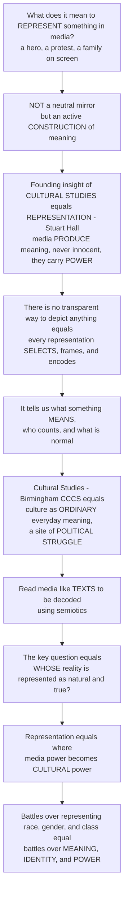

# 🖼️ Cultural Studies and Representation

> [!abstract] TL;DR
> **Cultural Studies** — born at Birmingham's **CCCS** (Richard Hoggart, Raymond Williams, Stuart Hall) — took "culture" seriously not as high art but as the **ordinary**, everyday meanings and practices through which people make sense of life, and insisted that culture is a **site of political struggle** where groups fight over meaning. Its central concept, **representation** (Stuart Hall), delivers the founding insight of this whole section: when media depict anything — a hero, a protest, a family — they are **not neutrally reflecting** a pre-existing reality but actively **constructing** a version of it, **producing meaning** through choices of image, word, and frame that are **never innocent** because they carry values, assumptions, and **power**. There is no transparent, natural way to depict anything: every representation **selects, frames, and encodes**, telling us not just what something *is* but what it *means*, who counts, and what is "normal." So the field reads media like **texts to be decoded** and asks the political question that runs through the rest of this vault — **whose** version of reality gets represented as natural and true? Representation is **where media power becomes cultural power**.

---

## Intuition

**Analogy — the window that is really a painter.** We like to imagine media as a **window**: a clean pane of glass we look *through* to see the world simply as it is. But think about what a window actually is. It has a **frame** that cuts off everything outside its edges. Its glass **tints** the light. And somebody chose *where in the wall to put it* and *which way it faces*. Media are less like a window and much more like a **painter of a landscape**. The painter picks the viewpoint, decides what to include and what to leave out of the canvas, chooses what to foreground and what to blur into background, selects the palette and the light. The finished painting is *not* the landscape — it is a **version** of it, saturated with the painter's choices and values. And here is the trick: a really skilled painting can look so lifelike that we forget a hand made every stroke, and mistake the picture for the view.

That is exactly Stuart Hall's move. When a film gives us a hero, a news report gives us a protest, or an ad gives us a "family," it is *painting*, not photocopying. It **selects, frames, and encodes** — and in doing so it makes **meaning**: it tells us who is admirable and who is dangerous, whose suffering counts, what a "normal" family or a "beautiful" or a "threatening" person looks like. None of this is a natural fact sitting out in the world waiting to be mirrored; it is **produced** in the act of representing. This is why Hall rejects the old "reflectionist" idea that media hold a mirror up to reality. Meaning does not exist *before* representation and then get copied; **there is no meaning outside representation** — the meaning is *made* in the depicting.

And because meaning is *made*, the crucial question is always **whose** meaning wins. Cultural studies — Williams' great slogan is "**culture is ordinary**" — refused to treat culture as a museum of masterpieces and instead studied the everyday: pop songs, soap operas, adverts, tabloids, subcultures, the meanings ordinary people live by. But it never treated culture as innocent or neutral. Culture is a **battlefield**: a terrain where competing groups struggle to make *their* picture of the world look like plain **common sense**. The groups who control how the world is represented shape how *everyone* understands reality and their own place in it. That is why fights over media representation — of race, gender, class, sexuality, nation, disability — are so ferocious. They are not squabbles about accuracy. They are **battles over meaning, identity, and power itself**. To grasp cultural studies and representation is to see media for what they really are: a **meaning-making machine** — and to hold the master key to this entire section on how media shape culture, identity, and our taken-for-granted sense of how the world *is* and *ought to be*.

---

## How It Works

### Core mechanics

1. **Representation produces meaning; it does not reflect it.** Hall lays out three theories of how representation works. The **reflective** ("mimetic") theory says language and images just *mirror* a meaning already fixed in the world. The **intentional** theory says meaning is whatever the *author intended*. Cultural studies rejects both for the **constructionist** theory: meaning is **constructed** in and through representation, using the shared **codes** and "maps of meaning" of a culture. Things and events do not *have* meanings in themselves; we *make* meaning about them.
2. **Every representation selects and encodes.** There is no neutral, transparent depiction. To represent is to choose a viewpoint, a frame, a word, a shot — and every choice **includes some things and excludes others**, foregrounds some and naturalizes others. The work of turning reality into a message is **encoding** (see the sibling *Signs, Codes, and Semiotics* and *Encoding, Decoding, and Audience Reception*).
3. **Culture is redefined as ordinary and as struggle.** Against Matthew Arnold's "**high culture**" ("the best that has been thought and said"), Williams and Hoggart redefined culture as a **whole way of life** — the everyday, ordinary meanings and practices of real people. Hall added the sharp political edge: culture is a **site of struggle** where dominant and subordinate groups contest whose meanings become dominant.
4. **Read media as texts to be decoded.** Cultural studies borrows **semiotics** (Saussure, Barthes) and **structuralism** to treat any cultural object — an ad, a news bulletin, a pop song — as a **text** whose codes can be analyzed, denaturalizing the "obvious" and exposing its **connotations** and **myths**.
5. **The politics of representation asks: whose reality?** Because representation is where meaning is made, it is where **power** operates. The key question is: **whose** version of reality gets represented as **natural, normal, and true**? The power to **define and classify** — who is hero or villain, whose pain matters, what a "normal" family looks like — is the power to shape everyone's sense of reality.
6. **Stereotyping is a representational practice (Hall).** Stereotyping **reduces** people to a few essentialized traits, **naturalizes** those traits as fixed, and **splits** the acceptable "normal" from the excluded "abnormal" **Other** — exercising **symbolic power** (the power to mark, to classify, to render invisible). It typically operates where there are gross inequalities of power.
7. **Representation, identity, and power form a circuit.** Hall's **circuit of culture** links representation to **identity**, **production**, **consumption**, and **regulation** — meaning is made and remade as it moves around the loop; audiences **decode** actively (dominant, negotiated, or oppositional readings), so meaning is never simply fixed at the point of transmission.

### The flow



---

## Key Concepts

### Secondary (explain it to a beginner)
- **Representation** — the way media *stand in for* the world by making pictures and stories of it. The picture is never the same as the thing; someone made choices.
- **The mirror myth** — the false belief that media just "show things as they really are." They always select, frame, and leave things out.
- **Culture is ordinary** — culture is not only opera and old paintings; it is everyday life — the songs, shows, ads, and slang through which people make sense of things.
- **Stereotype** — reducing a whole group to a few fixed traits ("all X are Y"), which then get treated as natural and normal.
- **Whose story?** — the same event (a protest, a family) can be shown in very different ways, and *who gets to choose* the way has real power.

### Undergraduate (needs some theory)
- **The Birmingham School / CCCS** — the Centre for Contemporary Cultural Studies (Univ. of Birmingham, founded 1964): **Richard Hoggart**, **Raymond Williams**, **Stuart Hall**, and later work on subcultures, media, gender, and race that founded the field.
- **Three theories of representation (Hall)** — **reflective** (media mirror a pre-given meaning), **intentional** (meaning is the author's intention), and the accepted **constructionist** view (meaning is *made* through shared codes). "There is no meaning outside representation."
- **Encoding / the code** — meaning is built by encoding reality against a culture's shared "maps of meaning"; you can only decode what you already share the code for (link to *Signs, Codes, and Semiotics*).
- **Denotation, connotation, myth (Barthes)** — literal meaning versus layered cultural associations; when connotation hardens into apparent "nature," it becomes **myth** — ideology dressed as common sense.
- **The politics of representation** — representation as a site of **power**: whose meanings get **naturalized**; the power to **define and classify**; the stakes of representing race, gender, class, sexuality, nation, and disability.
- **Stereotyping and the Other** — Hall's account: **reduce, essentialize, naturalize, and fix** difference; **split** the "normal" from the excluded "Other"; exercise **symbolic power**. Note the **"burden of representation"** — when a group is so rarely shown that each portrayal is forced to stand for the whole.
- **Encoding/decoding and the active audience (Hall)** — audiences are not passive: they read texts in **dominant**, **negotiated**, or **oppositional** positions (link to *Encoding, Decoding, and Audience Reception*).

### Graduate (system-level and critical)
- **Ideology and hegemony (Gramsci)** — culture is where **consent** and **common sense** are manufactured; **hegemony** is rule by winning consent rather than by force, and it is *never finished* — it must be continually won and can be contested. Cultural studies is largely a theory of hegemony in the media.
- **Interpellation (Althusser)** — ideology "hails" us as subjects; representations *address* us in ways that position us to recognize ourselves and accept a place in the social order.
- **Discourse and the regime of representation (Foucault)** — representation as **discourse**: knowledge and power are fused (**power/knowledge**); a "regime of truth" governs what can be said and shown, and about whom.
- **Orientalism and the Other (Said)** — the West's discursive **construction** of the "Orient" as its exotic, inferior Other; the founding move of postcolonial critique of representation.
- **Articulation and the circuit of culture (Hall, du Gay)** — meaning is not fixed but **articulated** — temporarily linked — and can be re-articulated; the **circuit of culture** ties representation to identity, production, consumption, and regulation.
- **The intellectual marriage** — cultural studies fused **Marxism** (link to *Marx and Critical Theory*), **semiotics/structuralism**, and later **feminism**, **postcolonialism**, and **queer theory**; the shift from studying media **effects** to studying media **meanings**.
- **Internal debates** — the **"cultural populism"** critique (celebrating audience pleasure and resistance while losing sight of power), the drift **away from political economy** (who *owns* the means of representation), and **textualism vs materialism**; plus the field's entanglement in **identity politics** and the **culture wars**.

---

## Python Demo

Two computational views of the core claims. **(A)** *Representation vs reality* — media are modeled as a **systematically skewed sample** of the social world: who gets to be the hero, and how each group's screen presence compares to its real-world share, exposing a measurable **representation gap** (over- and under-representation) — the symbolic world audiences absorb as "normal." **(B)** *Meaning is not fixed but fought over* — a **struggle-over-meaning** model where two competing frames of the *same* event contend for cultural dominance, and a power asymmetry (who controls the channels of representation) drives one framing to become **hegemonic "common sense"**; plus a **relational-meaning** panel showing how "the Other" is coded by **opposition** to "the Norm" along connotative dimensions.

```python
# Cultural Studies & Representation, computationally.
#   Panel A1  REPRESENTATION vs REALITY: each group's real population share vs
#             its share of on-screen HERO roles -> media is a SKEWED sample.
#   Panel A2  THE REPRESENTATION GAP (media minus reality): who is systematically
#             OVER- or UNDER-represented -- the distortion audiences absorb as normal.
#   Panel B1  STRUGGLE OVER MEANING: two rival frames of ONE event compete for
#             cultural dominance; a POWER asymmetry pushes one to "common sense"
#             (hegemony) -- meaning is fought over, not fixed.
#   Panel B2  RELATIONAL MEANING: "the Other" gets its meaning by OPPOSITION to
#             "the Norm" across connotative dimensions (a semantic differential).
import numpy as np
import matplotlib.pyplot as plt

rng = np.random.default_rng(7)

# ---------------------------------------------------------------
# A. REPRESENTATION vs REALITY  (the "representation gap")
# ---------------------------------------------------------------
groups       = ["Group A", "Group B", "Group C", "Group D"]
reality      = np.array([0.40, 0.30, 0.20, 0.10])   # actual share of the population
media_hero   = np.array([0.66, 0.19, 0.10, 0.05])   # share of on-screen HERO roles
gap          = media_hero - reality                 # + = over-represented
x            = np.arange(len(groups))

fig, ax = plt.subplots(2, 2, figsize=(14, 10))

w = 0.38
ax[0, 0].bar(x - w/2, reality,    w, label="share of REALITY", color="#2ca02c")
ax[0, 0].bar(x + w/2, media_hero, w, label="share of HERO roles", color="#8e44ad")
ax[0, 0].set_xticks(x); ax[0, 0].set_xticklabels(groups)
ax[0, 0].set_ylabel("proportion")
ax[0, 0].set_title("A1. Media is a SKEWED sample of the world\n(who gets to be the hero?)")
ax[0, 0].legend(fontsize=9)
for xi, r, m in zip(x, reality, media_hero):
    ax[0, 0].text(xi - w/2, r + 0.01, f"{r:.0%}", ha="center", fontsize=8)
    ax[0, 0].text(xi + w/2, m + 0.01, f"{m:.0%}", ha="center", fontsize=8)

colors = ["#c0392b" if g > 0 else "#2980b9" for g in gap]
ax[0, 1].bar(groups, gap, color=colors)
ax[0, 1].axhline(0, color="k", lw=1)
ax[0, 1].set_title("A2. The REPRESENTATION GAP\n(media share minus real share)")
ax[0, 1].set_ylabel("over  (+)   /   under  (-)  representation")
for xi, g in zip(x, gap):
    ax[0, 1].text(xi, g + (0.01 if g >= 0 else -0.03),
                  f"{g:+.0%}", ha="center", fontsize=9,
                  color=("#c0392b" if g > 0 else "#2980b9"))

# ---------------------------------------------------------------
# B1. STRUGGLE OVER MEANING  (replicator / logistic contest of frames)
# ---------------------------------------------------------------
# Two frames of the SAME protest compete for share of "common sense".
# dp/dt = r * p * (1 - p);  r > 0 favours the frame backed by media POWER.
steps = np.arange(0, 60)
def frame_share(p0, r):
    p = np.empty(steps.size); p[0] = p0
    for t in range(1, steps.size):
        p[t] = np.clip(p[t-1] + r * p[t-1] * (1 - p[t-1]), 0, 1)
    return p

# start EVEN, but the "dangerous riot" frame is amplified by who owns the channels
p_riot  = frame_share(p0=0.50, r=0.16)     # backed by dominant media -> wins consent
p_upris = 1.0 - p_riot                       # the "heroic uprising" frame recedes
ax[1, 0].plot(steps, p_riot,  color="#c0392b", lw=2.5,
              label='frame: "dangerous RIOT" (media-backed)')
ax[1, 0].plot(steps, p_upris, color="#2ca02c", lw=2.5,
              label='frame: "heroic UPRISING"')
ax[1, 0].axhline(0.5, color="gray", ls=":", lw=1)
cross = np.argmax(p_riot >= 0.5)
ax[1, 0].axvline(cross, color="k", ls="--", lw=1)
ax[1, 0].text(cross + 1, 0.55, "becomes\n'common sense'\n(hegemony)", fontsize=8)
ax[1, 0].set_title("B1. Struggle over meaning:\none framing becomes COMMON SENSE")
ax[1, 0].set_xlabel("cultural circulation over time")
ax[1, 0].set_ylabel("share of public 'common sense'")
ax[1, 0].legend(fontsize=8, loc="center right")

# ---------------------------------------------------------------
# B2. RELATIONAL MEANING  (the Other defined by OPPOSITION to the Norm)
# ---------------------------------------------------------------
dims = ["safe /\ndangerous", "rational /\nemotional", "normal /\ndeviant",
        "familiar /\nalien", "beautiful /\nugly"]
# connotative coding on a -1 (positive pole) .. +1 (negative/Other pole) scale
norm  = np.array([-0.8, -0.7, -0.85, -0.75, -0.7])   # "Us / the Norm"
other = np.array([ 0.75, 0.6,  0.8,   0.7,   0.5 ])   # "Them / the Other"
y = np.arange(len(dims))
ax[1, 1].barh(y - 0.2, norm,  0.4, color="#2980b9", label="the NORM (Us)")
ax[1, 1].barh(y + 0.2, other, 0.4, color="#e67e22", label="the OTHER (Them)")
ax[1, 1].axvline(0, color="k", lw=1)
ax[1, 1].set_yticks(y); ax[1, 1].set_yticklabels(dims, fontsize=8)
ax[1, 1].set_xlim(-1, 1)
ax[1, 1].set_xlabel("connotative coding  (positive pole  <->  Other pole)")
ax[1, 1].set_title("B2. Relational meaning: the OTHER\ndefined by opposition to the NORM")
ax[1, 1].legend(fontsize=8, loc="lower right")

plt.tight_layout()
plt.savefig("cultural_studies_representation.png", dpi=120)

print("Reality share   :", dict(zip(groups, [f"{v:.0%}" for v in reality])))
print("Hero-role share :", dict(zip(groups, [f"{v:.0%}" for v in media_hero])))
print("Representation gap:", dict(zip(groups, [f"{v:+.0%}" for v in gap])))
print(f"'Riot' frame reaches majority 'common sense' at step {cross}.")
```

**What the demo shows.** In **A1/A2**, media are not a mirror but a **skewed sample**: Group A occupies 40% of the population yet 66% of hero roles (a +26-point over-representation), while Groups C and D are pushed to the margins — the distorted **symbolic world** that audiences absorb as "how things normally are" (this is the representation engine behind *Cultivation Theory*). In **B1**, two framings of the *same* event start evenly matched, but the frame backed by those who **control the channels of representation** grows until it crosses 50% and becomes the taken-for-granted **common sense** — Gramsci's **hegemony** as a dynamic, winnable contest. In **B2**, meaning is shown to be **relational**: "the Other" carries no fixed essence — its meaning is manufactured by **opposition** to "the Norm" along connotative dimensions, exactly Hall's account of stereotyping as the splitting of *us* from *them*.

---

## Real-World Applications

- **Film and television representation.** *Who* gets to be the hero, the villain, the sidekick, the love interest, or the victim — and *who is simply absent*. Audits like the **Bechdel test**, USC Annenberg's inclusion studies, and **GLAAD** reports quantify the representation gap for gender, race, and sexuality in Hollywood; casting controversies are fights over who gets to be represented and how.
- **News framing of protests and social movements.** The same crowd is a "heroic uprising" or a "dangerous riot" depending on the code invoked. Studies of the **"protest paradigm"** in journalism show how routine framing choices delegitimize dissent by foregrounding disruption over grievance — Hall's *Policing the Crisis* (the analysis of the "mugging" panic) is the classic case.
- **Advertising and the "normal" family.** Ads sell not just products but a **naturalized world**: what a family, a home, a beautiful body, or a good life looks like. Decades of advertising taught audiences to read particular arrangements as "normal," making the exclusions invisible.
- **Body image and beauty norms.** Media over-representation of narrow body and beauty ideals cultivates distorted norms of what is normal and desirable — a representation problem with documented effects on self-image.
- **National identity and heritage.** Flags, anthems, museums, heritage sites, and history documentaries are **representational machines** that construct "the nation" and its story — deciding whose past counts as the shared past.
- **Orientalism and the representation of the "Other."** Said's analysis of how film, news, and fiction construct entire regions and peoples as exotic, dangerous, or backward — still central to critiques of coverage of the Global South and of migrants.
- **Algorithmic and platform representation.** Image-search results, autocomplete, recommendation feeds, generative-AI outputs, and content-moderation rules are the **new regime of representation** — encoding whose faces, names, and stories appear as default and "normal," and reproducing (or amplifying) old representation gaps at platform scale. This is where the field's core question — *who controls meaning?* — becomes a question about who controls the models and the feeds.

---

## Common Pitfalls

- **Reflectionism (the mirror fallacy).** Believing media simply "reflect" a reality that exists independently. The whole point of cultural studies is that representation **constructs** the reality it appears to report; treating a portrayal as a neutral copy re-hides the choices that made it.
- **Intentionalism.** Assuming a text's meaning is whatever its author *intended*. Meaning is completed at **reception** through shared (and contested) codes; producers can encode a preferred reading, but audiences decode in dominant, negotiated, or **oppositional** ways.
- **Textual determinism (ignoring the audience).** The opposite error: analyzing the text as if its "message" is automatically absorbed. Hall's encoding/decoding model exists precisely to block this — the circuit is not complete until an active audience makes meaning.
- **"Positive images" as the whole solution.** Assuming that simply adding more or "nicer" portrayals fixes representation. This ignores the **burden of representation** (forcing one image to stand for a whole group), leaves the underlying **codes and power** untouched, and can substitute visibility for structural change.
- **Cultural populism.** Celebrating audience pleasure, resistance, and creative decoding so enthusiastically that you lose sight of **power** — treating every act of consumption as subversive and forgetting who owns and controls the means of representation.
- **Dropping political economy.** A textualist focus on *reading meanings* that never asks **who owns the studios, platforms, and channels**. Representation and political economy are two halves of one analysis (link to the sibling *Media Industries and Political Economy*).
- **Essentializing the very groups you defend.** Critiquing stereotypes while smuggling in your own fixed idea of what a group "really" is. Cultural studies treats identity as **constructed and articulated**, not as a natural essence to be accurately mirrored.

---

## Related Concepts

This note is the **S04 section opener** — the master frame for how media make meaning about culture and identity. Its in-vault **siblings are referenced in prose** (not wikilinked, to keep the section-opener light): the *Media and Communication Studies Overview* sets the field; *Signs, Codes, and Semiotics* supplies the decoding toolkit this note assumes; *Encoding, Decoding, and Audience Reception* is Hall's companion theory of the active audience; *Ideology, Hegemony, and Media* deepens the Gramscian core; *Gender, Race, and Identity in Media* applies representation to specific groups; *Popular Culture and the Culture Industry* debates high vs ordinary culture; and *Media Audiences and Reception* extends the decoding side.

Cross-vault links (Glob-verified) — this vault deliberately uses **distinct basenames** that complement, rather than duplicate, the culture-and-meaning notes elsewhere:

- [[Culture_Symbols_and_Meaning]] — the **anthropological** account of culture as webs of symbols and meaning (Geertz's "thick description"); the disciplinary parent of cultural studies' idea that culture *is* the meanings people live by.
- [[Media_Culture_and_Cultural_Industries]] — the **sociological** view of who *produces* culture at scale; the political-economy counterweight that keeps representation analysis honest about ownership and power.
- [[Culture_Norms_Values_and_Ideology]] — the sociology of **ideology** and shared meaning; the ground on which hegemony and "common sense" are contested.
- [[Structuralism_and_Narratology]] — the **structuralist/semiotic method** (Saussure, Barthes, Greimas) that cultural studies borrowed to read media as texts and decode their codes.
- [[The_Reader_and_Reception]] — **reader-response and reception theory** in literary studies; the humanities cousin of Hall's active, meaning-making audience.
- [[Marx_and_Critical_Theory]] — the **Marxist and Frankfurt School** roots (ideology, the culture industry, base and superstructure) that cultural studies both inherited and revised via Gramsci.

---

## Review Questions

1. **(Secondary)** Using the "window / painter" analogy, explain what it means to say that a news photo of a protest does not simply *show* the protest but *constructs* a version of it. Give one concrete choice the photographer or editor made.
2. **(Secondary)** What did Raymond Williams mean by "**culture is ordinary**," and how is that different from thinking of culture as only great art and literature?
3. **(Undergraduate)** Distinguish Hall's **reflective**, **intentional**, and **constructionist** theories of representation. Why does cultural studies insist that "there is no meaning outside representation," and what does that imply about the idea of a "biased" versus an "unbiased" portrayal?
4. **(Undergraduate)** Explain **stereotyping** as a representational *practice* (reduce, essentialize, naturalize, split the Other) and connect it to the demo's "relational meaning" panel: in what sense does "the Other" have no meaning of its own?
5. **(Graduate)** Using Gramsci's **hegemony** and the demo's "struggle over meaning" model, argue whether a dominant framing of an event (e.g., a protest as a "riot") is ever permanently secured. What would it take for an **oppositional** reading to become the new common sense?
6. **(Graduate)** Cultural studies has been accused of **"cultural populism"** and of drifting from **political economy**. State both critiques, then argue whether analyzing *representation* (meaning) and analyzing *ownership* (who controls the channels) can be integrated — and what an analysis of **algorithmic/platform representation** would need from each.

---

## Sources

- Stuart Hall (ed.), *Representation: Cultural Representations and Signifying Practices* (1997) — the definitive statement of the constructionist theory of representation, the politics of representation, and stereotyping.
- Raymond Williams, *Culture and Society, 1780–1950* (1958) and the essay "Culture Is Ordinary" (1958) — the redefinition of culture as a whole way of life.
- Simon During (ed.), *The Cultural Studies Reader* (3rd ed., 2007) — the standard anthology mapping the field from Hoggart and Hall to postcolonial, feminist, and queer cultural studies.
- Chris Barker, *Cultural Studies: Theory and Practice* (5th ed., 2016) — the leading textbook synthesis of representation, ideology, identity, and the circuit of culture.
- Stuart Hall, "Encoding/Decoding" (1973/1980), in *Culture, Media, Language* — the foundational essay on preferred, negotiated, and oppositional readings.

---

#media-studies #cultural-studies #representation #stuart-hall #meaning-making
