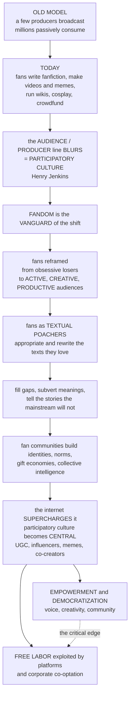

# 🎭 Fandom and Participatory Culture

> [!abstract] TL;DR
> For most of media history the model was **broadcast**: a few big producers made content and millions of us passively consumed it — a one-way pipe. **Participatory culture** (Henry Jenkins) names the collapse of that pipe: ordinary people now actively *make, remix, and circulate* media rather than merely receiving it, and **fandom is the vanguard**. Fans — once dismissed as obsessive losers — are active, skilled, and **productive audiences** whom Jenkins called **"textual poachers"**: they appropriate the media they love and rewrite it (fanfiction, vids, wikis, cosplay), filling gaps, subverting meanings, and telling stories the mainstream will not, while building communities with shared identities, **gift economies**, and **collective intelligence**. The internet supercharged this into the *central logic* of contemporary media (UGC, influencers, memes) — but with a critical edge: is it genuine **empowerment and democratization**, or **free labor** exploited by platforms and brands that profit from our "participation" and increasingly try to co-opt it?

---

## Intuition

**Analogy:** Think of old media as a **cinema**: a handful of studios up front project a finished film, and rows of us sit in the dark and watch. Now picture what audiences actually do today — someone in row 12 writes a whole new story about the villain's backstory, three people two rows over cut the footage into a music video, a cluster in the balcony builds an encyclopedia of the fictional universe, others sew the costumes and wear them, and a few thousand crowdfund a sequel the studio refused to make. The screen is still there, but the **wall between the projector and the seats has come down**. That is participatory culture: media has become something people *do*, not just something they *receive*.

Fans are the ones who tore the wall down first. Media studies used to pathologize them — obsessive, deviant, "get a life." Then Henry Jenkins reframed them as something remarkable: **active, creative, productive audiences** who take the raw material of mass culture and make it their *own*. Borrowing Michel de Certeau's image, Jenkins called fans **"textual poachers"** — nomads who trespass on the media texts they love and carry off characters and worlds to rewrite for their own pleasures. They fill the gaps a story leaves open, they read *against the grain* (queer readings, unlikely pairings, alternate universes), and they tell the stories the mainstream won't. This is the exact opposite of a passive audience — it is the same active-reception move Stuart Hall made for decoding, pushed all the way into *production*. Around this activity fans build rich social worlds: shared norms and identities, a **gift economy** (works created and shared for free — for love, reputation, and community, *not* money), and **collective intelligence** (pooling knowledge in wikis and spoiler-hunts). The digital revolution handed all of this cheap tools for creation, remix, and global distribution, so a subculture became the *default* — user-generated content, memes, influencers, audiences as co-creators and marketers. But the sting in the tail is real: when a platform or a brand harvests all that unpaid enthusiasm, is your "participation" empowerment, or is it **free labor** feeding someone else's attention economy?

---

## How It Works

### Core Mechanics

1. **The participatory turn.** The starting point is the **broadcast / one-to-many** model — active producers, passive mass audiences, meaning flowing one way. Jenkins's **participatory culture** describes a culture with *low barriers* to creative expression and civic engagement, strong informal support for creating and sharing, mentorship from experienced to novice members, and — crucially — members who *believe their contributions matter* and feel socially connected. The **producer/consumer distinction blurs**: Alvin Toffler's **"prosumer,"** Axel Bruns's **"produsage,"** and Jay Rosen's **"the people formerly known as the audience."**
2. **The rehabilitation of the fan.** Fan studies' founding move (Jenkins, Camille Bacon-Smith, Constance Penley) rejected the pathologizing stereotype and treated fandom as a **mode of reception, a community, and an identity** — audiences who are skilled interpreters *and* prolific makers.
3. **Textual poaching and fan productivity.** Fans **appropriate** mass-culture texts and rework them. John Fiske's typology distinguishes **semiotic** productivity (making private meanings), **enunciative** productivity (talk, shared interpretation), and **textual** productivity (creating circulated artifacts): **fanfiction, fan art, vidding, filk, cosplay, wikis, fan theories, and the archive**. Characteristic practices include filling narrative gaps, **"shipping,"** **slash** and queer readings, and alternate universes — often producing the inclusive, marginalized-centered representation the mainstream omits.
4. **Community and its culture.** Fandom is a social world with shared norms and a **gift economy** — works are given freely, and status flows from generosity and skill, not sales. Pierre Lévy's **collective intelligence** describes how dispersed fans pool knowledge (wikis, decoding puzzles). **Affective investment** binds it together, and **fan activism** mobilizes it ("Save our show" campaigns, charity drives, organized pressure on producers).
5. **The digital explosion.** Web 2.0 supplied cheap creation, remix, and global distribution, turning a subculture into a mainstream **logic**: **user-generated content**, platforms *built on* participation (YouTube, TikTok, Twitch, Wattpad, AO3, Reddit, Discord), memes and remix culture, virality, influencer/creator culture, and audiences as distributors. Jenkins's **convergence culture** and **spreadability** ("if it doesn't spread, it's dead") capture how content now moves through participatory circulation rather than top-down broadcast.
6. **The critical edge.** Two readings compete. The optimistic one: genuine **democratization and empowerment** — voice, creativity, community, and a challenge to gatekeepers. The critical one: an *illusion* masking exploitation — Tiziana Terranova's and Mark Andrejevic's **"free labor" / digital-labor** critique (platforms and brands profiting from unpaid participation and behavioral data), **participation inequality** (the 90-9-1 rule: most lurk, few create), corporate **co-optation** of fandom (courting, controlling, and monetizing fan energy; strategic "fan service"), platform dependence and precarity, and **toxic fandom** and harassment. The tension between *resistance* and *commodification* recurs from the older popular-culture debate.

### Flow / Architecture



---

## Key Concepts

### Secondary (intuitive)
- **Broadcast vs participation:** old media = a few make it, millions watch; new media = ordinary people *also* make, remix, and share it.
- **Fandom:** loving a show/game/band so much you *create* around it — stories, art, videos, costumes, wikis — and join others who do the same.
- **Textual poaching:** fans "borrow" characters and worlds from the media they love and rewrite them for their own stories.
- **Gift economy:** fans make and share their work **for free** — for love, friendship, and reputation, not money.

### Undergraduate (mechanistic)
- **Participatory culture (Jenkins):** low barriers to creation, strong sharing/mentorship, and members who feel their contributions matter and feel connected.
- **Prosumer / produsage / "people formerly known as the audience":** the collapse of the producer/consumer divide (Toffler, Bruns, Rosen).
- **Fan productivity (Fiske):** semiotic, enunciative, and textual productivity — the spectrum from private meaning to public artifact (fic, vids, cosplay, wikis).
- **Collective intelligence (Lévy) and spreadability (Jenkins/Ford/Green):** communities pool knowledge; content survives only if audiences choose to circulate it.
- **Fan activism:** organized fan pressure — save-our-show campaigns, charity, and social/political mobilization.

### Graduate (critical / theoretical)
- **De Certeau's "poaching":** reading as a tactical, nomadic raid by the weak on the terrain of the powerful — Jenkins's theoretical anchor for reading *against the grain*.
- **The free-labor / digital-labor critique (Terranova, Andrejevic):** participation as value production — unpaid affective and immaterial labor and behavioral data captured by platforms; the audience-commodity thesis extended to Web 2.0.
- **Participation inequality:** contributions follow a heavy-tailed power law (the "90-9-1" rule); "democratized" production is empirically *highly uneven*, concentrated in a super-participant minority.
- **Co-optation and precarity:** the incorporation of fan and creator labor into brand strategy; platform dependence, algorithmic gatekeeping, demonetization, and creator burnout — resistance versus commodification, unresolved.
- **Toxic fandom and boundary policing:** entitlement, harassment campaigns, and gatekeeping expose participation's dark side and complicate the emancipatory narrative.

---

## Python Demo

```python
# Fandom & participatory culture, quantified two ways:
#  (a) PARTICIPATION INEQUALITY (the "90-9-1" rule): contributions to an online/fan
#      community follow a heavy-tailed POWER LAW -- a tiny minority of "producers"
#      create most content, a few contribute occasionally, the vast majority LURK.
#      We plot the skewed rank-contribution curve (log-log) and the Lorenz curve.
#  (b) GIFT ECONOMY vs FREE LABOR: a fan work spreads peer-to-peer through the
#      community (diffusion WITHOUT money -- shared for love, reputation, community),
#      yet the same unpaid "participation" creates economic value a PLATFORM captures
#      (the free-labor / audience-as-producer critique).
import numpy as np
import matplotlib.pyplot as plt

rng = np.random.default_rng(42)

# ----- (a) PARTICIPATION INEQUALITY -------------------------------------------
N = 10_000                              # members of a fan community
# Zipf-distributed activity, minus 1 so many members contribute 0 posts (LURKERS)
# and a heavy tail of "super-participants" produces the bulk of the content.
activity = rng.zipf(1.8, N) - 1
activity = np.clip(activity, 0, 5000)   # cap absurd tail values

total = activity.sum()
order = np.sort(activity)[::-1]         # descending
cum   = np.cumsum(order) / total
top1_share = cum[int(0.01 * N)]                     # share made by top 1% of members
top9_share = cum[int(0.10 * N)] - top1_share        # next 9%
rest_share = 1 - cum[int(0.10 * N)]                 # bottom 90%
lurker_frac = np.mean(activity == 0)

# Lorenz curve + Gini (standard sorted formula, no deprecated integrators).
asc = np.sort(activity)
lorenz = np.insert(np.cumsum(asc) / total, 0, 0)
pop = np.linspace(0, 1, len(lorenz))
idx = np.arange(1, N + 1)
gini = (2 * np.sum(idx * asc) / (N * asc.sum())) - (N + 1) / N

# ----- (b) GIFT-ECONOMY DIFFUSION + FREE-LABOR VALUE --------------------------
T = 60
POP = 200_000                           # potential audience reached by a fan work
beta = 0.30                             # peer-to-peer sharing rate (word of mouth)
reached = np.zeros(T); reached[0] = 20  # seed: the creator posts the work
for t in range(1, T):
    new = beta * reached[t-1] * (1 - reached[t-1] / POP)   # logistic contagion
    reached[t] = reached[t-1] + new

# Free-labor value: each new engagement generates ad/data value V; the platform
# captures the lion's share, the creator returns almost nothing in cash.
V = 0.004
new_engage = np.diff(np.insert(reached, 0, 0))
value = new_engage * V
platform_share = 0.85
cum_platform = np.cumsum(value * platform_share)
cum_creator  = np.cumsum(value * (1 - platform_share))

# ----- PLOTS ------------------------------------------------------------------
fig, ax = plt.subplots(2, 2, figsize=(13, 9))

# (a1) rank-contribution on log-log: a power law is a straight line.
nz = order[order > 0]
ranks = np.arange(1, len(nz) + 1)
ax[0, 0].loglog(ranks, nz, color="#8e44ad")
ax[0, 0].set_title("(a) Participation inequality: a heavy-tailed power law")
ax[0, 0].set_xlabel("member rank  (1 = biggest contributor)")
ax[0, 0].set_ylabel("content contributed")
ax[0, 0].text(0.05, 0.08, f"{lurker_frac*100:.0f}% of members lurk",
              transform=ax[0, 0].transAxes)

# (a2) Lorenz curve of contributions.
ax[0, 1].plot(pop, lorenz, color="#8e44ad", lw=2, label="fan contributions")
ax[0, 1].plot([0, 1], [0, 1], "k--", lw=1, label="perfect equality")
ax[0, 1].fill_between(pop, lorenz, pop, alpha=0.15, color="#8e44ad")
ax[0, 1].set_title(f"Lorenz curve   Gini = {gini:.2f}")
ax[0, 1].set_xlabel("cumulative share of members")
ax[0, 1].set_ylabel("cumulative share of content")
ax[0, 1].legend(loc="upper left")

# (b1) gift-economy diffusion: an S-curve of peer-to-peer spread, no money changes hands.
ax[1, 0].plot(np.arange(T), reached / 1000, color="#16a085", lw=2)
ax[1, 0].set_title("(b) Gift economy: a fan work spreads peer-to-peer")
ax[1, 0].set_xlabel("time step")
ax[1, 0].set_ylabel("people reached  (thousands)")

# (b2) free labor: the same unpaid participation accrues value, captured above.
ax[1, 1].stackplot(np.arange(T), cum_creator, cum_platform,
                   labels=["value to creators", "value captured by platform"],
                   colors=["#f1c40f", "#c0392b"], alpha=0.85)
ax[1, 1].set_title("Free labor: unpaid participation, value captured above")
ax[1, 1].set_xlabel("time step")
ax[1, 1].set_ylabel("cumulative value  (arb. units)")
ax[1, 1].legend(loc="upper left")

plt.tight_layout()
plt.savefig("fandom_participatory_culture.png", dpi=120)
print(f"Lurkers who make nothing: {lurker_frac*100:.1f}% of members")
print(f"Top 1% of members produce {top1_share*100:.1f}% of all content")
print(f"Next 9% produce {top9_share*100:.1f}%; bottom 90% produce {rest_share*100:.1f}%")
print(f"Contribution Gini = {gini:.3f}")
print(f"Platform captures {platform_share*100:.0f}% of the value from unpaid participation")
```

The output makes both halves of the story concrete. Panel **(a)** shows that "everyone can participate" does *not* mean everyone does: contributions form a near-straight line on log-log axes (a power law), the vast majority of members lurk, and the Lorenz curve bows far from equality (a high Gini) — participation is real but **profoundly uneven**. Panel **(b)** shows the same enthusiasm from two angles: a fan work spreads as a peer-to-peer **S-curve** with no money changing hands (the gift economy), yet the aggregate unpaid engagement it generates accrues real economic value — most of which the **platform** captures rather than the creators (the free-labor critique).

---

## Real-World Applications

- **Archive of Our Own (AO3) and fanfiction.** A volunteer-run, non-commercial archive hosting millions of fan works is the gift economy at industrial scale — built, moderated, and coded by fans, explicitly refusing monetization; it won a Hugo Award in 2019, formally recognizing fan labor as culture.
- **Fandom wikis and collective intelligence.** Community-built wikis (Fandom.com, Wikipedia-style episode guides, lore encyclopedias) show Lévy's collective intelligence: thousands of dispersed fans pooling knowledge no single viewer could hold.
- **Fan activism and "save our show" campaigns.** Organized fandoms have reversed cancellations, funded charities in a star's name, and pressured studios over plot and representation — participatory culture as political mobilization.
- **Creator platforms and the influencer economy.** YouTube, TikTok, Twitch, and Wattpad monetize participation directly: the "creator economy" is participatory culture commodified, and the free-labor debate is its central controversy (who profits from the unpaid audience that made the creator big?).
- **Memes, remix, and spreadability.** Viral formats, duets, edits, and reaction videos are decoding made public and productive; brands now court this energy deliberately, seeding "organic" participation and running fan-service marketing.
- **Transmedia franchises and co-creation.** Studios increasingly design worlds *for* fan elaboration (theories, ARGs, expanded lore) — courting fan energy while also trying to manage and contain it, the co-optation tension in action.

---

## Common Pitfalls

- **Assuming participation is democratized and equal.** The 90-9-1 power law is the reality check: a tiny minority produces most content while most people lurk. "Anyone can participate" is not "everyone does."
- **Romanticizing the gift economy while ignoring value capture.** Fans may share for love, but a platform can still convert that love into ad revenue and data. The free-labor critique is not cynicism — it is asking *who profits*.
- **Confusing consumption with production.** Watching, liking, and scrolling are participation of a thin kind; conflating them with fanfiction, vidding, or wiki-building inflates how creative the average user really is.
- **Treating fans as either dupes or heroes.** Fandom is neither pure resistance nor pure commodification — it is both at once. Toxic fandom, harassment, and gatekeeping are part of the same phenomenon as creativity and community.
- **Ignoring co-optation.** When a brand runs a "fan-made" contest or a studio seeds "organic" theories, participation can be *managed from above*. Distinguish grassroots creativity from astroturfed engagement.
- **Assuming the tools guarantee empowerment (technological determinism).** Cheap creation and distribution *enabled* participatory culture, but ownership, algorithms, and monetization decide who actually benefits.

---

## Related Concepts

- [[Digital_Society_and_Online_Communities]] — the sociology of the online communities where fandom now lives: identity, norms, belonging, and community formation on the internet.
- [[Online_Social_Networks_and_Platforms]] — the platform architectures (YouTube, TikTok, Reddit, Discord) whose affordances shape *how* participation, virality, and creator economies work.
- [[Contagion_and_Diffusion_in_Social_Networks]] — the mechanics of peer-to-peer spread modeled in the demo: how a fan work, meme, or campaign propagates through a community without top-down broadcast.
- [[Simulating_Collective_Behavior_and_Social_Movements]] — the collective-action lens on fan activism, mobilization, and coordinated campaigns.
- [[Network_Science_Fundamentals]] — the network structure (hubs, degree distributions, power laws) underlying both participation inequality and collective intelligence.
- [[Group_Dynamics]] — the social-psychology of shared identity, in-group belonging, norms, and the affective bonds that hold fan communities together.

Within this vault, this note is the participatory-turn counterpart to its **prose-referenced siblings** (to be created or already present): **Cultural_Studies_and_Representation** (the Birmingham tradition and the fan-created inclusive representation fandom generates), **Encoding_Decoding_and_Audience_Reception** (the active-audience/"reading against the grain" foundation that fan poaching pushes into production), **Popular_Culture_and_the_Culture_Industry** (the resistance-versus-commodification debate fandom re-stages), **Media_Audiences_and_Reception** (the empirical audience research this extends), **Social_Media_and_Networked_Communication** (the networked infrastructure of contemporary participation), **Media_Convergence_and_Transmedia** (spreadability and convergence culture), and **Advertising_and_the_Attention_Economy** (where free labor, data, and value capture are theorized).

---

## Review Questions

1. **(Secondary)** In your own words, what is the difference between a "broadcast" model of media and a "participatory" one? Give two concrete things fans *do* that a passive audience does not.
2. **(Secondary/Undergraduate)** What does Jenkins mean by calling fans "textual poachers"? Describe one example of fans filling a narrative gap or telling a story the mainstream would not.
3. **(Undergraduate)** Explain the "gift economy" of fandom. Why do people create and share fan works for free, and what do they receive in return if not money?
4. **(Undergraduate/Graduate)** The "90-9-1" rule says participation is highly unequal. How does this complicate the claim that digital media "democratized" cultural production? Reference the power-law/Lorenz picture from the demo.
5. **(Graduate)** State the "free labor" critique (Terranova, Andrejevic) precisely. Given a creator-economy platform that hosts fan works for free and sells ads against them, argue *both* that participation is empowerment *and* that it is exploitation. Which factors decide which reading is more accurate in a specific case?

---

## Sources

- Jenkins, Henry. *Textual Poachers: Television Fans and Participatory Culture*. New York: Routledge, 1992.
- Jenkins, Henry. *Convergence Culture: Where Old and New Media Collide*. New York: New York University Press, 2006.
- Jenkins, Henry, Sam Ford, and Joshua Green. *Spreadable Media: Creating Value and Meaning in a Networked Culture*. New York: New York University Press, 2013.
- Terranova, Tiziana. "Free Labor: Producing Culture for the Digital Economy." *Social Text* 18, no. 2 (2000): 33–58.
- Fiske, John. "The Cultural Economy of Fandom." In *The Adoring Audience: Fan Culture and Popular Media*, edited by Lisa A. Lewis, 30–49. London: Routledge, 1992.

---

#media-studies #fandom #participatory-culture #textual-poaching #convergence-culture
