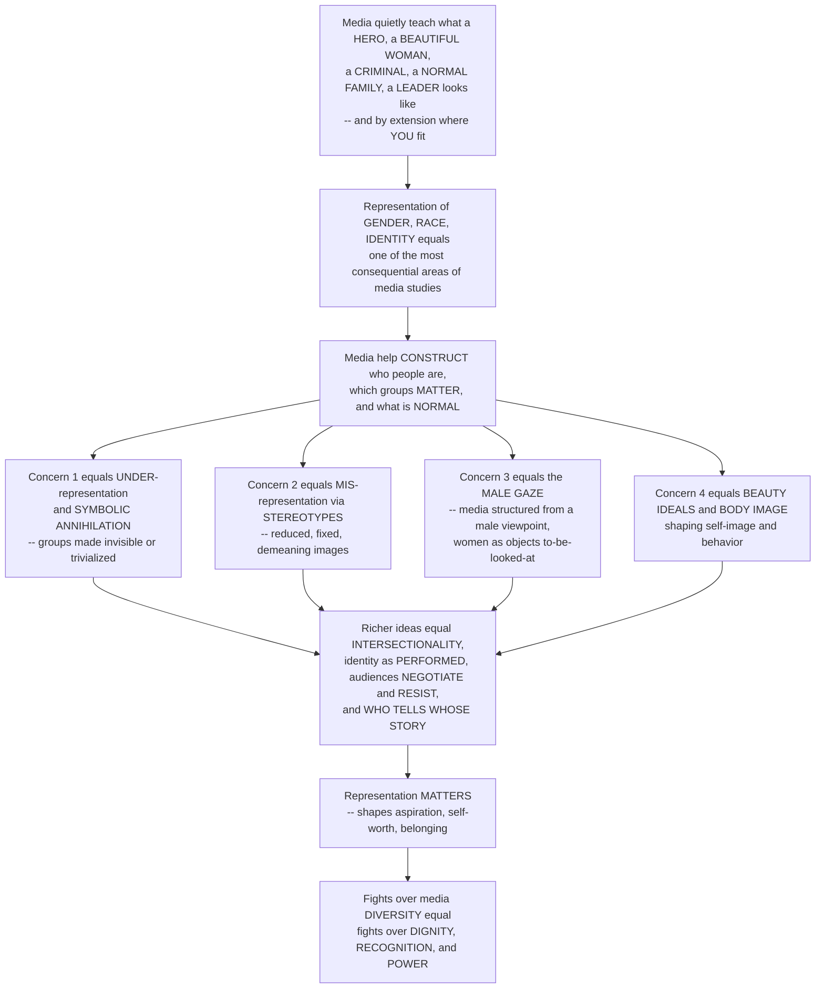

# 🪞 Gender, Race and Identity in Media

> [!abstract] TL;DR
> Media do not merely entertain — they **construct and circulate** the meanings of **gender**, **race**, sexuality, class, disability, and nation through which we understand who people are, which groups matter, and what counts as "normal." The field names two central problems: **under-representation** (the *symbolic annihilation* of groups made invisible, trivialized, or condemned) and **mis-representation** (the reductive, fixed, demeaning **stereotype**). It shows that even the *form* of media can encode power — Laura Mulvey's **male gaze** structures classical cinema around a heterosexual male viewpoint, positioning women as objects "to-be-looked-at" — and that media-built beauty ideals shape self-image with real consequences. But the field has moved beyond *counting* stereotypes toward richer ideas: **intersectionality** (identities compound), identity as **performed** rather than fixed, **active audiences** who negotiate and resist, and the politics of **who gets to tell whose story**. Representation genuinely matters — "you can't be what you can't see" — so fights over media diversity are fights over dignity, recognition, and belonging.

---

## Intuition

**Analogy:** Think back to growing up on a diet of TV shows, films, ads, games, and now feeds. Without anyone teaching you a single lesson out loud, the media you consumed quietly taught you what a **"hero"** looks like, what a **"beautiful woman"** looks like, what a **"criminal"**, a **"normal family"**, or a **"leader"** looks like — and, by silent extension, *where you fit* in that picture. That quiet, cumulative lesson is why the media representation of **gender**, **race**, and **identity** is one of the most consequential areas of media studies: because media help **construct** our sense of who people are, which groups matter, and what is normal.

Once you see that media are *constructing* social categories rather than neutrally reflecting them, the core concerns become stark and well-documented. The **first** concern is patterns of representation and **mis-representation**: *who* gets to appear, in *what* roles, and *how*? Historically, media have systematically **under-represented** women, people of color, LGBTQ+ people, disabled people, and others — the **symbolic annihilation** of groups rendered invisible — and **mis-represented** them through **stereotypes**: the reduced, fixed, often demeaning images (women as decorative or domestic; racial minorities as criminals or sidekicks). The **second** concern is that even the *form* of media encodes power: Laura Mulvey's **male gaze** shows how classical Hollywood is structured to present the world from a heterosexual male viewpoint, positioning women as objects "to-be-looked-at." The **third** concern is that media construct **beauty ideals, body image, and gender norms** that shape self-image and behavior, with real effects on mental health, aspiration, and inequality.

But — crucially — this field has moved beyond just *counting* and criticizing stereotypes toward richer ideas: **intersectionality** (race, gender, class, and sexuality intersect, so combined-category groups are erased far more than any single axis reveals), identity as something **performed and constructed** rather than natural or fixed, **audiences** who negotiate, resist, and appropriate representations, and the **politics of voice** — who gets to tell whose story. And representation genuinely **matters**: seeing (or *not* seeing) people like yourself as heroes, leaders, and full human beings shapes aspiration, self-worth, and social possibility. This is why fights over media diversity are fights over dignity, power, and belonging — and why understanding gender, race, and identity in media *is* understanding how media shape the social categories and hierarchies through which we understand ourselves and each other.

---

## How It Works

### Core Mechanics

1. **Media as a site of construction, not reflection.** The premise (from cultural studies and the theory of *representation*) is that media are powerful **agents that construct and circulate meaning** about gender, race, ethnicity, sexuality, class, disability, age, and nation. Identity is treated as **socially constructed, represented, and performed** — not natural or fixed — where media are a key place we learn "who we are" and "who *they* are."
2. **Problem 1 — under-representation / symbolic annihilation.** Following Tuchman and Gerbner, groups can be **absent, trivialized, or condemned** on screen. Invisibility itself is a form of **symbolic power**: to be systematically left out of a culture's stories is to be told, implicitly, that you do not fully count.
3. **Problem 2 — mis-representation via stereotyping.** When groups *do* appear, they are often **reduced, fixed, and essentialized** into recurrent images: gendered stereotypes (women as domestic, decorative, emotional), racial and ethnic **"controlling images"** (Collins), the racialized **Other** and **Orientalism** (Said), LGBTQ+ tropes, and disability tropes — compounded by **tokenism**, **whitewashing**, and the "burden of representation" placed on the few who *do* appear.
4. **The male gaze — power in the form.** Laura Mulvey's **male gaze** shows that mis-representation is not only about *content* but about *structure*: classical cinema organizes the look itself — camera, editing, narrative — around a heterosexual male spectator, splitting the screen into an active male bearer of the look and a passive female image of **"to-be-looked-at-ness"** (scopophilia). The very grammar of the medium can encode a power relation.
5. **Beauty ideals and self-image.** Media construct and normalize **beauty myths, body ideals, and gender norms**, cultivating distorted senses of what is normal or desirable — with documented effects on body satisfaction, mental health, aspiration, and behavior.
6. **Beyond counting — the richer frameworks.** The field advances past "count the stereotypes" to: **intersectionality** (Crenshaw — single-axis analysis misses compounded marginalization); identity as **performed and fluid** (Butler's performativity; Hall's cultural identity as a "becoming"); the **active audience** that negotiates, resists, and appropriates (oppositional and subcultural readings, fan re-workings); and the **politics of production and voice** — who gets to represent whom.
7. **Why it matters — the real effects.** Representation shapes **self-image and aspiration** ("you can't be what you can't see"), **social attitudes and prejudice** (cultivating stereotypes), and the **distribution of dignity, recognition, and power** (recognition and *misrecognition* — Fraser, Taylor). Representation is thus a matter of social justice, belonging, and epistemic power.
8. **Contemporary and digital developments.** The push for **diversity and inclusion** (and its debates: representation vs tokenism vs structural change; #OscarsSoWhite; "woke" backlash), **self-representation** on social media (identity performance, selfies, influencers), marginalized groups building **counter-narratives** (Black Twitter, LGBTQ+ creators), and **algorithmic bias** in media and AI representation — the ongoing culture wars over identity.

### Flow / Architecture



---

## Key Concepts

### Secondary (intuitive)
- **Representation:** the images and stories media give us of different kinds of people — and those images teach us what is "normal."
- **Symbolic annihilation:** when a group is barely shown at all, or only shown in a bad light, it is as if the culture is saying that group does not really matter.
- **Stereotype:** a reduced, fixed, one-note image of a whole group (all X are Y), repeated until it feels natural.
- **The male gaze:** many films and ads are shot as if a man is looking, turning women into something *to be looked at* rather than someone who acts.
- **"You can't be what you can't see":** it is harder to imagine yourself as a scientist, a leader, or a hero if you never see anyone like you being one on screen.

### Undergraduate (mechanistic)
- **Representation as construction (Stuart Hall):** meaning is *produced*, not reflected; media **encode** preferred meanings of race and gender, and stereotyping is a *signifying practice* that fixes "difference" and splits the normal from the Other ("The Spectacle of the Other").
- **Symbolic annihilation (Tuchman, Gerbner):** absence, trivialization, and condemnation as three modes by which media symbolically erase groups; measured through **content analysis** (representation audits, speaking-time, the **Bechdel test** heuristic).
- **The male gaze (Mulvey):** classical cinema's structuring of the look — **scopophilia** and **"to-be-looked-at-ness"** — showing mis-representation in the *form*, not only the content.
- **Controlling images and Othering (Collins, Said):** recurrent racialized stereotypes as instruments of power; **Orientalism** as the West representing "the East" into subordinate difference; **whiteness** as the invisible, unmarked norm.
- **Postfeminism and "empowerment" advertising:** the co-optation of feminist language to sell products and re-package the gaze as choice (Gill), plus women's under-representation *behind* the camera and in the newsroom.
- **Active audience:** representations are **negotiated** — audiences produce dominant, negotiated, or oppositional readings, resist, and re-work meanings (fandom, subcultures).

### Graduate (critical / theoretical)
- **Intersectionality (Crenshaw):** race, gender, class, and sexuality **intersect**, so single-axis "count the women" or "count the minorities" analysis systematically **misses compounded marginalization** — the erasure of, e.g., women of color exceeds what either axis predicts alone.
- **Performativity (Butler) and identity as "becoming" (Hall):** gender and cultural identity are not pre-given essences that media merely *depict* but are **produced through repeated performance and representation** — media are constitutive, not just reflective.
- **Recognition vs redistribution (Fraser, Taylor):** representation as a politics of **recognition** — misrecognition inflicts real harm on status and dignity — in tension and interplay with material **redistribution**; "positive images" alone can leave structures intact.
- **The politics of voice, authorship, and appropriation:** who gets to represent whom; self-representation and counter-cinema vs extraction and appropriation; bell hooks's "oppositional gaze" — the refusal to look as the text demands.
- **Post-broadcast fragmentation and algorithmic representation:** self-representation on networked platforms, marginalized counter-publics (Black Twitter, LGBTQ+ creators), and **algorithmic bias** in recommendation, image generation, and AI — representation reshaped by code, data, and platform economics.
- **From content to structure to political economy:** representation is downstream of *who owns and staffs* media; diversity in front of the camera without change behind it reproduces the same gaze (links to the political economy of media industries).

---

## Python Demo

```python
# Gender, race and identity in media, simulated three ways:
#  (a) REPRESENTATION AUDIT / SYMBOLIC ANNIHILATION: compare each group's
#      POPULATION share against its share of MEDIA presence. The representation
#      index = media_share / pop_share; values below 1 flag under-representation
#      ("symbolic annihilation"), above 1 flag over-representation.
#  (b) ROLE-QUALITY GAP: it is not only HOW MANY appear but in WHAT roles.
#      Compare the distribution over Lead / Supporting / Background / Stereotyped
#      roles -- marginalized groups get "ghettoized" into narrow, negative slots.
#  (c) INTERSECTIONALITY: break representation down by the INTERSECTION of two
#      axes (race x gender). Doubly-marginalized cells are far more erased than
#      either single axis predicts -- a 2D heatmap of representation ratio.
#  (d) "YOU CAN'T BE WHAT YOU CAN'T SEE": a dose-response where more on-screen
#      representation raises a group's measured aspiration, while heavier exposure
#      to a narrow beauty ideal lowers body satisfaction.
import numpy as np
import matplotlib.pyplot as plt

rng = np.random.default_rng(7)

# ---- (a) Representation audit -------------------------------------------------
groups   = ["Majority\nmen", "Majority\nwomen", "Men of\ncolor",
            "Women of\ncolor", "LGBTQ+", "Disabled"]
pop      = np.array([0.34, 0.35, 0.13, 0.13, 0.07, 0.15])  # population shares
pop      = pop / pop.sum()
media    = np.array([0.46, 0.30, 0.10, 0.06, 0.05, 0.03])  # share of screen presence
media    = media / media.sum()
rep_index = media / pop                                     # 1.0 == parity

# ---- (b) Role quality: rows=groups, cols=[Lead, Support, Background, Stereotyped]
roles = np.array([
    [0.45, 0.30, 0.15, 0.10],   # Majority men  -- many leads
    [0.28, 0.34, 0.20, 0.18],   # Majority women
    [0.18, 0.28, 0.26, 0.28],   # Men of color  -- pushed to background/stereotype
    [0.12, 0.24, 0.30, 0.34],   # Women of color -- most ghettoized
    [0.16, 0.26, 0.28, 0.30],   # LGBTQ+
    [0.10, 0.22, 0.34, 0.34],   # Disabled
])
role_labels = ["Lead", "Supporting", "Background", "Stereotyped"]

# ---- (c) Intersectionality: race (rows) x gender (cols) representation ratio --
race_axis   = ["White", "Black", "Latinx", "Asian", "Indigenous"]
gender_axis = ["Men", "Women"]
# marginal representation ratios (media / population) along each axis
race_marg   = np.array([1.35, 0.70, 0.55, 0.65, 0.30])
gender_marg = np.array([1.20, 0.82])
# naive "independent" expectation vs an ACTUAL joint that punishes double-margins
expected = np.outer(race_marg, gender_marg)                 # if axes were independent
penalty  = np.array([[1.00, 0.95],                          # White
                     [1.00, 0.72],                          # Black women hit hardest
                     [1.00, 0.70],                          # Latinx
                     [1.00, 0.78],                          # Asian
                     [1.00, 0.60]])                         # Indigenous women erased most
actual   = expected * penalty

# ---- (d) Dose-response: aspiration up, body satisfaction down -----------------
exposure = np.linspace(0, 10, 200)
aspiration = 0.30 + 0.60 * (1 - np.exp(-0.45 * exposure))   # see yourself -> aspire
body_sat   = 0.85 - 0.55 * (1 - np.exp(-0.40 * exposure))   # narrow ideal -> dissatisfaction

# ------------------------------------------------------------------------------
fig, ax = plt.subplots(2, 2, figsize=(13, 10))

# (a) population vs media share + parity line
x = np.arange(len(groups))
w = 0.38
ax[0, 0].bar(x - w/2, pop,   w, label="population share", color="#2980b9")
ax[0, 0].bar(x + w/2, media, w, label="media presence",   color="#c0392b")
ax[0, 0].set_xticks(x); ax[0, 0].set_xticklabels(groups, fontsize=8)
ax[0, 0].set_ylabel("share of total")
ax[0, 0].set_title("(a) Representation audit: who appears vs who exists")
for i, r in enumerate(rep_index):
    tag = "erased" if r < 0.6 else ("under" if r < 0.9 else "")
    ax[0, 0].text(i, max(pop[i], media[i]) + 0.01,
                  "idx %.2f\n%s" % (r, tag), ha="center", fontsize=7,
                  color="#c0392b" if r < 0.9 else "#333")
ax[0, 0].legend(fontsize=8)

# (b) role-quality stacked bars
bottom = np.zeros(len(groups))
palette = ["#27ae60", "#2980b9", "#f39c12", "#c0392b"]
for j, rl in enumerate(role_labels):
    ax[0, 1].bar(x, roles[:, j], 0.7, bottom=bottom, label=rl, color=palette[j])
    bottom += roles[:, j]
ax[0, 1].set_xticks(x); ax[0, 1].set_xticklabels(groups, fontsize=8)
ax[0, 1].set_ylabel("share of that group's roles")
ax[0, 1].set_title("(b) Role quality: ghettoized into narrow slots")
ax[0, 1].legend(fontsize=7, ncol=2, loc="lower center")

# (c) intersectional heatmap
im = ax[1, 0].imshow(actual, cmap="RdYlGn", vmin=0.3, vmax=1.4, aspect="auto")
ax[1, 0].set_xticks(range(len(gender_axis))); ax[1, 0].set_xticklabels(gender_axis)
ax[1, 0].set_yticks(range(len(race_axis)));   ax[1, 0].set_yticklabels(race_axis)
ax[1, 0].set_title("(c) Intersectionality: race x gender representation ratio")
for i in range(len(race_axis)):
    for j in range(len(gender_axis)):
        ax[1, 0].text(j, i, "%.2f" % actual[i, j], ha="center", va="center",
                      color="black", fontsize=9)
fig.colorbar(im, ax=ax[1, 0], fraction=0.046, label="media / population ratio")

# (d) dose-response
ax[1, 1].plot(exposure, aspiration, color="#27ae60", lw=2.5,
              label="aspiration (see yourself as a hero/leader)")
ax[1, 1].plot(exposure, body_sat, color="#c0392b", lw=2.5,
              label="body satisfaction (narrow beauty ideal)")
ax[1, 1].set_xlabel("on-screen exposure to that representation")
ax[1, 1].set_ylabel("measured outcome (0 to 1)")
ax[1, 1].set_title("(d) 'You can't be what you can't see' -- both directions")
ax[1, 1].legend(fontsize=8)

plt.tight_layout()
plt.savefig("gender_race_identity_media.png", dpi=120)

# ---- console summary ---------------------------------------------------------
print("Representation index (media / population), <1 = under-represented:")
for g, r in zip([g.replace("\n", " ") for g in groups], rep_index):
    print("  %-16s %.2f" % (g, r))
print("\nWomen-of-color intersectional ratio: %.2f" % actual[1, 1],
      "  vs naive independent expectation: %.2f" % expected[1, 1])
print("Indigenous-women ratio (most erased): %.2f" % actual[4, 1])
print("\nAspiration at zero vs high exposure:  %.2f -> %.2f"
      % (aspiration[0], aspiration[-1]))
print("Body satisfaction at zero vs high:    %.2f -> %.2f"
      % (body_sat[0], body_sat[-1]))
```

Running it makes the argument quantitative. Panel **(a)** shows several groups with a **representation index below 1** — media presence lags population share — with "women of color", "LGBTQ+", and "disabled" flagged as effectively **erased** (symbolic annihilation), while the majority group is *over*-represented. Panel **(b)** shows the second, subtler problem: even where marginalized groups appear, their roles are **ghettoized** — a small "lead" slice and a large "background / stereotyped" slice — the qualitative face of mis-representation. Panel **(c)** is the intersectional payoff: the **women-of-color cell is lower than the naive product of the race and gender margins**, and the **Indigenous-women cell is the most erased of all** — exactly the compounded marginalization single-axis counting hides. Panel **(d)** shows why it matters in *both* directions: rising representation lifts **aspiration** ("you can't be what you can't see"), while heavier exposure to a **narrow beauty ideal** depresses body satisfaction. The numbers are illustrative, but the *shapes* — under-representation, role-ghettoization, intersectional compounding, and dose-response effects — mirror decades of content-analysis and audience research.

---

## Real-World Applications

- **Diversity audits and the Bechdel test.** Studios, broadcasters, and watchdogs (e.g., the Geena Davis Institute, GLAAD's annual reports) run **content-analysis audits** of screen time, speaking roles, and role quality by gender, race, LGBTQ+ status, and disability — operationalizing symbolic annihilation and the representation index into industry metrics.
- **Advertising and body image.** The **male gaze** and manufactured beauty ideals are most concentrated in advertising; "empowerment" and "real beauty" campaigns (and the postfeminist critique of them) show the field's insights being fought over in the marketplace, alongside documented links to body dissatisfaction and disordered eating.
- **Casting, #OscarsSoWhite, and diverse storytelling.** Campaigns over whitewashing, tokenism, and who wins awards — and the commercial success of films that center previously marginalized identities — are live tests of "positive images" vs deeper **structural change** behind the camera.
- **News framing of race and crime.** Which groups appear as **criminals, victims, or experts** in news cultivates public attitudes and feeds prejudice — a direct pipeline from mis-representation to policy and policing.
- **Social media self-representation and counter-narratives.** Influencers, selfies, and identity performance let marginalized groups **represent themselves** and build counter-publics (Black Twitter, LGBTQ+ and disability creators), bypassing gatekeepers — while also intensifying beauty-ideal pressure via filters and curated feeds.
- **Algorithmic and AI representation.** Recommendation systems, image search, and generative AI **reproduce and amplify** stereotypes from their training data (e.g., "CEO" returning mostly white men), making representation a machine-learning fairness problem as much as a creative one.

---

## Common Pitfalls

- **Treating media as a mirror.** Assuming media simply *reflect* a pre-existing reality misses the whole point: representation **constructs** the categories and hierarchies it appears to describe. The question is never "is this accurate?" alone but "what does this image *do*?"
- **Counting bodies and stopping there.** Head-count diversity ("we added a Black character") ignores **role quality** (ghettoization, tokenism, stereotyping) and the male gaze in the *form*. Presence without power or authorship is often mis-representation with better optics.
- **Single-axis analysis.** Analyzing gender *or* race separately hides **intersectional** erasure: "women" audits dominated by white women, "minority" audits dominated by men, leaving women of color invisible in both — the failure Crenshaw named.
- **The passive-audience assumption.** Treating audiences as blank recipients ignores **negotiated, oppositional, and appropriative readings** — real people resist, mock, and re-work representations rather than absorbing them whole.
- **"Positive images" as the whole solution.** Swapping demeaning stereotypes for flattering ones can leave **structural** power — ownership, hiring, whose stories get greenlit — untouched, and can impose a new "burden of representation" on the few included (recognition without redistribution).
- **Essentializing the very identities under study.** Assuming there is one "authentic" way to represent a group re-fixes identity as natural rather than **performed and plural**, reproducing the essentialism the field set out to critique.

---

## Related Concepts

- [[Intersectionality]] — Crenshaw's framework is the analytic backbone here: representation must be read across intersecting axes (race x gender x class x sexuality), because single-axis counting hides compounded erasure.
- [[Gender_Sex_and_Patriarchy]] — the sociology of gendered power that feminist media studies (the male gaze, beauty myth, postfeminism) applies to screens; media are one institution that reproduces patriarchal norms.
- [[Race_Ethnicity_and_Racism]] — supplies the concepts of racialization, Othering, and whiteness-as-norm that racial mis-representation and "controlling images" operationalize in media.
- [[Gender_Sexuality_and_the_Body]] — the anthropological view that gender, sexuality, and the body are culturally constructed and *performed*, grounding identity-as-performativity in cross-cultural evidence rather than screen examples alone.
- [[Discourse_Power_and_Identity]] — the linguistic-anthropology account of how discourse constructs identity and encodes power, complementing Hall's "representation as a signifying practice."
- [[Identity_Stigma_and_Impression_Management]] — Goffman's micro-sociology of stigma and self-presentation maps directly onto self-representation, the "burden of representation," and identity performance on social media.
- [[Prejudice_and_Discrimination]] — the social-psychology mechanisms (stereotyping, in-group/out-group bias) that media stereotypes cultivate and reinforce at the level of individual attitudes.
- [[Acculturation_and_Identity]] — how people negotiate identity across cultural contexts, illuminating diaspora and minority audiences' negotiated readings and their search for on-screen recognition.
- [[Media_Culture_and_Cultural_Industries]] — the sociology of *who produces* media, situating representation downstream of ownership, staffing, and the political economy that decides whose stories get told.
- [[Distributive_Justice_and_Inequality]] — the ethics of fair distribution against which the politics of **recognition vs redistribution** (Fraser, Taylor) is framed: representation as a claim about dignity and status, not only material goods.

Within this vault, this note sits alongside its siblings (some to be created): **Cultural_Studies_and_Representation** (the parent theory of how meaning is produced and encoded), **Ideology_Hegemony_and_Media** (how representation naturalizes dominant worldviews as "common sense"), **Encoding_Decoding_and_Audience_Reception** (the active audience that negotiates, resists, and re-works representations), **Cultivation_Theory_and_Media_Reality** (the evidence that skewed representation has measurable attitudinal effects over time), **Popular_Culture_and_the_Culture_Industry** (the mass production of the images and stereotypes at issue), and **Social_Media_and_Networked_Communication** (self-representation, counter-narratives, and algorithmic identity in the networked era).

---

## Review Questions

1. **(Secondary)** Explain "symbolic annihilation" in your own words and give one example of a group you rarely see on screen — or only see in a narrow, negative role. Why might that absence matter for a young person in that group?
2. **(Undergraduate)** Distinguish **under-representation** from **mis-representation**, and explain how the **male gaze** shows that mis-representation can live in the *form* of a film, not just its content. Use the demo's role-quality panel to explain why adding characters is not the same as fixing representation.
3. **(Undergraduate)** What does the **Bechdel test** measure, and what does it *fail* to capture? Design one better metric for the *quality* of a group's representation and say what data you would need to compute it.
4. **(Graduate)** Using the intersectionality heatmap, explain why single-axis analysis (counting "women" and counting "minorities" separately) can make women of color invisible in *both* audits. How would you re-design a diversity study to surface compounded marginalization?
5. **(Graduate)** Nancy Fraser distinguishes a politics of **recognition** from a politics of **redistribution**. Argue whether adding diverse faces on screen ("positive images") delivers real recognition, or whether it can function as **tokenism** that leaves structural power — ownership, hiring, authorship — untouched. What evidence would decide the case?

---

## Sources

- Mulvey, Laura. "Visual Pleasure and Narrative Cinema." *Screen* 16, no. 3 (1975): 6–18.
- Hall, Stuart, ed. *Representation: Cultural Representations and Signifying Practices*. London: Sage, 1997 (esp. "The Spectacle of the Other" and "The Work of Representation").
- hooks, bell. *Black Looks: Race and Representation*. Boston: South End Press, 1992.
- Gill, Rosalind. *Gender and the Media*. Cambridge: Polity Press, 2007.
- Crenshaw, Kimberlé. "Mapping the Margins: Intersectionality, Identity Politics, and Violence against Women of Color." *Stanford Law Review* 43, no. 6 (1991): 1241–1299.

---

#media-studies #representation #gender-and-media #race-and-media #media-identity
