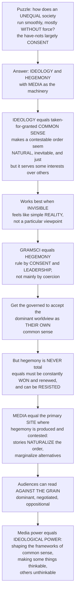

# 🎭 Ideology, Hegemony and Media

> [!abstract] TL;DR
> A deeply unequal society mostly runs smoothly *without* force — with the "have-nots" largely **consenting** to an order that disadvantages them. The critical tradition explains this through **ideology** (the taken-for-granted "common sense" that makes a particular, contestable social order seem natural, inevitable, and just — working best when it is **invisible**) and **hegemony** (Antonio Gramsci: dominant groups rule not mainly by **coercion** but by winning the **consent** of the governed to the dominant worldview as their own common sense). **Media are the key machinery**: through the endless flow of news, stories, ads, and entertainment they largely **naturalize** the dominant order and marginalize alternatives — yet, crucially, hegemony is never total or permanent, so it must be constantly **won**, and audiences can read **against the grain** and resist. Whether framed as Marx's "ruling ideas," Althusser's Ideological State Apparatuses, Gramsci's negotiated hegemony, or the Frankfurt School's culture industry, the shared insight is that **media power is ultimately ideological power** — the power to shape the frameworks of common sense that make some things thinkable and others unthinkable.

---

## Intuition

**Analogy — how does a deeply unequal society keep running smoothly, mostly without force?** Imagine a kingdom where a few own almost everything and most own almost nothing. You would expect constant revolt — chains, guards, and violence everywhere. Yet real unequal societies mostly *do not* look like that. They run smoothly, day after day, with the disadvantaged largely **going along** with an order that disadvantages them. Why? Not mainly because of soldiers in the streets, but because of something in people's *heads*: a shared sense that "this is just how things are." That invisible glue is **ideology**, and the process of keeping it in place is **hegemony** — and media are the machine that manufactures it.

**Ideology** here does *not* just mean "political opinions." It means the taken-for-granted ideas, images, and "common sense" that make a particular social order feel **natural, inevitable, and just** — when it is actually historical, contingent, and serves some interests over others. Think of "common sense" beliefs that success comes purely from individual hard work, that endless economic growth is normal and good, or that some groups are naturally suited to certain roles. Each quietly reproduces existing hierarchies while feeling like plain reality. Ideology works best precisely when it is **invisible**: when a particular, contestable way of seeing the world feels like "the way things are" rather than one viewpoint among many.

**Antonio Gramsci's** concept of **hegemony** names the mechanism. Ruling groups maintain power not primarily through **coercion** (force, police, prisons) but through **leadership** — winning the **consent** of the governed, getting them to accept the dominant worldview *as their own common sense*. And here is the crucial part: hegemony is never total or permanent. It must be constantly **won, maintained, and renewed** through culture, and it can be **resisted** and contested. This is where media become central. Media are a **primary site** where hegemony is produced and struggled over — through news, ads, films, and entertainment that mostly **naturalize** the dominant order and **marginalize** alternatives (manufacturing consent), but which audiences can also read against the grain and resist.

Different thinkers frame the same insight differently — **Marx's** "ruling ideas are the ideas of the ruling class," **Althusser's** "Ideological State Apparatuses" (media, schools, and family as institutions that shape us into compliant subjects), **Gramsci's** negotiated hegemony, the **Frankfurt School's** culture industry — but they converge on something profound: **media power is ultimately ideological power** — the power to shape the very frameworks of "common sense" through which we understand society, making some things thinkable and others literally unthinkable. Understanding ideology and hegemony *is* understanding how media help reproduce, and sometimes challenge, the social order itself.

---

## How It Works

The critical account moves in a chain: from the *puzzle* of consent, to ideology as invisible common sense, to Gramsci's hegemony as rule by consent, to media as the terrain where that consent is manufactured *and* contested.

1. **The puzzle.** Order in an unequal society is maintained far more by consent than by force. Force is expensive, brittle, and breeds resentment; durable rule needs the ruled to *believe in* the order.
2. **Ideology = naturalized common sense.** Ideology takes what is historical, made, and interest-serving and makes it appear **natural, universal, and eternal**. Roland Barthes called this operation **myth**: ideology "goes without saying" because it has emptied history out of an image and refilled it with "nature."
3. **False consciousness → material practice.** Marx and Engels located the "ruling ideas" in the ruling class and used the **camera obscura** metaphor (ideology inverts reality). Later theorists shifted from "false consciousness in people's heads" to ideology as a **lived, material practice** embedded in institutions and rituals.
4. **Althusser: interpellation and ISAs.** Ideology is our **imaginary relation to real conditions**; it "**hails**" or **interpellates** us into subject-positions ("Hey, you there — consumer, citizen, worker"), and the **Ideological State Apparatuses** — media, education, family, religion — reproduce the relations of production far more efficiently than the police ever could.
5. **Gramsci: hegemony as rule by consent.** Domination has two faces — **coercion** (the state, force) and **hegemony** (consent, moral and intellectual **leadership** in **civil society**). Hegemony wins the subordinate over to the dominant worldview as *common sense*. Because it is never guaranteed, politics becomes a **war of position** — a slow cultural struggle — waged by **organic intellectuals** on both sides.
6. **Media as the hegemonic apparatus.** News, entertainment, and advertising set the limits of "common sense" and acceptable debate, naturalize dominant values (capitalism, consumerism, individualism, nationalism, dominant race and gender norms), and delegitimize alternatives — what Herman and Chomsky called **manufacturing consent**.
7. **Resistance and the limits of ideology.** Audiences are **not** dupes. Stuart Hall's **encoding/decoding** shows readings can be **dominant, negotiated, or oppositional**; texts are **polysemic**; subcultures and counter-hegemonic movements contest the common sense. Hegemony is therefore an **unstable equilibrium** that can tip.



---

## Key Concepts

### Secondary (intuitive level)
- **Ideology** = the "common sense" ideas that make the way society is organized feel **normal, natural, and fair** — even when it isn't. It works best when you don't even notice it.
- **Hegemony** (Gramsci) = staying in charge by getting people to **agree** with your way of seeing the world, instead of forcing them. **Consent, not coercion.**
- **Media are the machine**: TV, news, ads, and films quietly repeat "the way things are" until it feels obvious — and push other views to the edges.
- But people are **not sheep**: audiences can see through it, argue back, and read "against the grain" — so the dominant order is never *totally* secure.
- Key slogan: **"manufacturing consent"** — winning agreement to a system rather than imposing it by force.

### Undergraduate (working level)
- **Ideology (critical sense):** ideas that serve **power** by making the historical and contingent look **natural, universal, and eternal** — Barthes' **myth** and **naturalization**; contrast with the neutral "science of ideas" origin of the word.
- **Marx and Engels:** the **ruling ideas** are the ideas of the ruling class; the **camera obscura**/false-consciousness metaphor; the **base/superstructure** model (economic base shaping the ideological superstructure).
- **Althusser:** ideology as the **imaginary relation to real conditions**; **interpellation** ("hailing" subjects); the **Ideological State Apparatuses** (ISAs — media, education, family, religion) versus the Repressive State Apparatus; the **relative autonomy** of ideology.
- **Gramsci's hegemony:** consent + coercion; **common sense**; **civil society** as hegemony's terrain; **war of position** vs **war of maneuver**; **organic intellectuals**; hegemony as **never complete, always contested** (counter-hegemony).
- **Manufacturing consent** (Herman & Chomsky): a **propaganda model** in which ownership, advertising, sourcing, "flak," and a unifying ideology filter news toward elite interests — the political-economy version of media hegemony.
- **Encoding/decoding** (Stuart Hall): **dominant / negotiated / oppositional** readings; **polysemy**; the active audience — the built-in limit on ideological power.

### Graduate (theoretical level)
- **From false consciousness to lived ideology:** the shift (via Althusser, Hall, Voloshinov) from ideology as *illusion in the head* to ideology as a **material, semiotic practice** enacted in institutions, rituals, and discourse — dissolving the base/superstructure economism.
- **The dominant-ideology thesis and its critics:** Abercrombie, Hill & Turner argue the "dominant ideology" is often **incoherent, contested, and more important for uniting elites than pacifying the masses**; compliance may rest on the "dull compulsion of economic relations" as much as on belief. This reframes the structure (ideological power) vs agency (resistance) debate.
- **Hall's conjunctural analysis:** "The Rediscovery of Ideology" and "The Great Moving Right Show" read **Thatcherism** as a **hegemonic project** that welded free-market economics to authoritarian populism as new "common sense" — a model for analyzing neoliberalism.
- **Frankfurt School / culture industry:** Adorno & Horkheimer's **culture industry** thesis — standardized mass culture as **ideological mass deception** producing passive, conformist consumers; the pessimistic pole against which Gramscian and cultural-studies work reasserts audience agency and struggle.
- **Gramsci's specificity:** hegemony as **moral and intellectual leadership**, historically won by a **historic bloc** of allied class fractions; distinct from crude "manipulation" — it involves **real concessions** and the partial incorporation of subordinate demands (a *negotiated* order).
- **Poststructural pressures:** Foucault's **power/knowledge** and **discourse** partly displace "ideology" (no outside, no simple false/true), while Laclau & Mouffe radicalize hegemony as the contingent **articulation** of floating signifiers — theorizing counter-hegemony without a guaranteed class subject.

---

## Python Demo

```python
# Ideology & Hegemony, quantified two ways.
#
# (a) CONSENT vs COERCION — Gramsci's core claim that hegemony (rule by manufactured
#     CONSENT) is cheaper and far MORE STABLE than domination by FORCE. As ideological
#     legitimacy rises, the coercion needed to hold the order falls, the maintenance
#     COST falls, and the DURABILITY of the order rises.
#
# (b) COUNTER-HEGEMONIC STRUGGLE — hegemony as a DYNAMIC, UNSTABLE equilibrium. The
#     dominant frame's share of "common sense" is continually naturalized/renewed by
#     media yet eroded by counter-hegemonic challenge. A bistable "war of position":
#     above a contested THRESHOLD the dominant frame consolidates toward 1; below it,
#     counter-hegemony wins and the order TIPS. Hegemony must be actively held above
#     the line -- it is never guaranteed.
import numpy as np
import matplotlib.pyplot as plt

# ---------- (a) consent-vs-coercion: cost & durability of order ----------------
c = np.linspace(0.0, 1.0, 200)      # share of order carried by CONSENT (0=pure force, 1=pure hegemony)

# Order needs total "compliance" = 1. Consent covers c; coercion must cover (1-c).
# Coercion is EXPENSIVE per unit (police, surveillance, repression); consent is cheap
# (media, schooling already run). Cost of maintaining order:
k_force, k_consent = 1.0, 0.15
cost = k_force * (1 - c) + k_consent * c            # falls as consent rises

# Durability: force-based order is brittle (collapses when force wavers, breeds revolt);
# consent-based order is self-reproducing. Sigmoid rising with consent.
durability = 1.0 / (1.0 + np.exp(-8.0 * (c - 0.5)))

# ---------- (b) counter-hegemonic struggle: bistable war of position -----------
theta = 0.5          # contested THRESHOLD (unstable equilibrium of common sense)
k = 3.0              # intensity of cultural struggle
dt, T = 0.02, 8.0
steps = int(T / dt)
t = np.linspace(0, T, steps)

def simulate(h0):
    # dh/dt = k * h * (1-h) * (h - theta): bistable "war of position"
    h = np.empty(steps); h[0] = h0
    for i in range(1, steps):
        h_prev = h[i-1]
        dh = k * h_prev * (1 - h_prev) * (h_prev - theta)
        h[i] = np.clip(h_prev + dh * dt, 0.0, 1.0)
    return h

starts = [0.30, 0.45, 0.49, 0.51, 0.55, 0.70]   # dominant frame's initial cultural share

# ---------- plots -------------------------------------------------------------
fig, ax = plt.subplots(1, 2, figsize=(12, 4.8))

ax[0].plot(c, cost, color="#dc2626", lw=2.6, label="Cost to maintain order")
ax[0].plot(c, durability, color="#059669", lw=2.6, label="Durability / stability of order")
ax[0].axvspan(0.0, 0.25, color="#dc2626", alpha=0.07)
ax[0].axvspan(0.75, 1.0, color="#059669", alpha=0.07)
ax[0].annotate("DOMINATION\nby force:\ncostly & brittle", xy=(0.12, 0.55),
               ha="center", fontsize=8, color="#991b1b")
ax[0].annotate("HEGEMONY\nby consent:\ncheap & durable", xy=(0.88, 0.45),
               ha="center", fontsize=8, color="#065f46")
ax[0].set_title("(a) Consent vs coercion: Gramsci's wager")
ax[0].set_xlabel("share of order carried by CONSENT (ideological legitimacy)")
ax[0].set_ylabel("cost  /  durability  (normalized)")
ax[0].set_ylim(0, 1.05); ax[0].legend(fontsize=8, loc="center right")

for h0 in starts:
    h = simulate(h0)
    end = "consolidates (hegemony holds)" if h[-1] > 0.5 else "tips (counter-hegemony wins)"
    color = "#2563eb" if h[-1] > 0.5 else "#d97706"
    ax[1].plot(t, h, lw=2.2, color=color, alpha=0.9)
ax[1].axhline(theta, color="gray", ls=":", lw=1.6)
ax[1].annotate("contested threshold\n(unstable equilibrium)", xy=(4.2, theta),
               xytext=(3.0, 0.30), fontsize=8,
               arrowprops=dict(arrowstyle="->", color="gray"))
ax[1].annotate("dominant frame consolidates -> 1", xy=(6.5, 0.93), fontsize=8, color="#1e40af")
ax[1].annotate("counter-hegemony wins -> 0", xy=(6.5, 0.05), fontsize=8, color="#92400e")
ax[1].set_title("(b) War of position: hegemony as unstable equilibrium")
ax[1].set_xlabel("time (cultural struggle)")
ax[1].set_ylabel("dominant frame's share of 'common sense'")
ax[1].set_ylim(-0.02, 1.02)

plt.tight_layout()
plt.show()

# Key readings:
#  - (a) As CONSENT rises, the COST of holding the order falls while its DURABILITY
#        climbs -> rule by force is expensive and brittle; rule by consent (hegemony)
#        is cheap and self-reproducing. That is Gramsci's wager in one picture.
#  - (b) Two trajectories starting a hair APART (0.49 vs 0.51) diverge to opposite
#        fates: hegemony is NOT guaranteed. The dominant frame must be actively pushed
#        ABOVE the contested threshold (by media naturalization); let it slip below and
#        counter-hegemony wins. Hegemony must be constantly WON.
print(f"Unstable threshold theta = {theta}")
print("Below theta -> order tips to counter-hegemony; above -> dominant frame consolidates.")
```

The left panel makes **Gramsci's wager** concrete: as the order rests more on manufactured **consent**, the **cost** of maintaining it falls and its **durability** rises — force is expensive and brittle, hegemony is cheap and self-reproducing. The right panel shows why hegemony must be **constantly won**: two "common-sense" trajectories starting a whisker apart (0.49 vs 0.51) diverge to opposite fates around the **contested threshold** — the dominant frame consolidates only if media keep pushing it *above* the line; let it slip and **counter-hegemony** tips the order.

---

## Real-World Applications

- **News framing that naturalizes the order.** Routine coverage that treats markets as forces of nature ("the economy reacted nervously"), frames strikes as disruptions rather than labor asserting rights, or reports on inequality as a technical problem rather than a political choice — all set the limits of "common sense" and keep the dominant order looking inevitable. This is hegemony operating through everyday journalism, not conspiracy.
- **Advertising and consumer ideology.** The endless flow of ads does not just sell products; it naturalizes **consumerism** itself — the equation of the good life with buying, of identity with brands, of endless growth with progress — interpellating audiences as consumers before citizens.
- **Manufacturing consent in foreign policy.** Herman and Chomsky's propaganda model — and cases from the Gulf War to the 2003 Iraq invasion — show how ownership, advertising dependence, elite sourcing, "flak," and a unifying (e.g., national-security) ideology filter news so that the range of debate stays inside elite consensus, marginalizing dissent as unserious.
- **Neoliberalism as hegemonic "common sense."** Stuart Hall analyzed Thatcherism, and later scholars analyzed the wider neoliberal turn, as **hegemonic projects** that made "there is no alternative," privatization, and market logic feel like plain reality — a textbook **war of position** won across media, think tanks, and popular culture.
- **Platform and algorithmic ideology.** The framing of the "free" internet, Big Tech's technological utopianism ("connection," "disruption," "there is no alternative to the platform"), and algorithmic feeds that present ranked, commercially shaped content as neutral "relevance" are contemporary sites where a dominant order gets naturalized — and where **memes** and online movements wage counter-hegemonic struggle over common sense in the "culture wars."

---

## Common Pitfalls

- **Reducing ideology to "opinions I disagree with."** In the critical sense, ideology is not a party platform but the **invisible common sense** that frames debate itself — including your own. Treating it as "their propaganda vs our truth" misses that ideology works best precisely when it feels like neutral reality.
- **Confusing hegemony with brainwashing or a conspiracy.** Hegemony is **negotiated leadership**, not a puppet-master injecting beliefs. It involves **real concessions**, partial incorporation of subordinate demands, and genuine consent — which is exactly why it is durable. There need be no coordinating villain.
- **Assuming the audience is a passive dupe.** The Frankfurt School's culture-industry pessimism, taken alone, erases agency. Hall's encoding/decoding, polysemy, and subcultures show audiences **negotiate and oppose** meanings. Ideological power is real but **never total**.
- **Overstating the "dominant ideology."** Abercrombie et al. warn that the dominant ideology is often incoherent and contested, and may matter more for **uniting elites** than for pacifying the masses, whose compliance can rest on economic necessity rather than belief. Do not assume consent proves ideological capture.
- **Treating hegemony as a finished state.** It is an **unstable equilibrium** that must be continually renewed and defended; ignoring the struggle, resistance, and tipping points (the "war of position") turns a dynamic process into a static conspiracy.
- **Collapsing coercion and consent.** Real orders mix both. Focusing only on force misses ideology; focusing only on consent misses that hegemony is always **backed** by coercion "in the last instance."

---

## Related Concepts

- [[Marx_and_Critical_Theory]] — the origin point: the "ruling ideas" thesis, base/superstructure, false consciousness, and the Frankfurt School critical theory that this media tradition extends. *(Philosophy vault)*
- [[Socialism_Marxism_and_Communism]] — the Marxist political tradition within which ideology-critique and Gramsci's hegemony are theorized as tools of class analysis and struggle. *(Political Science vault)*
- [[Culture_Norms_Values_and_Ideology]] — the sociological treatment of ideology, dominant values, and the reproduction of the social order; the disciplinary sibling to this media-focused note. *(Sociology vault)*
- [[Conflict_Theory_and_Critical_Theory]] — the conflict/critical framework (power, domination, contestation) that underwrites the whole ideology-and-hegemony problematic. *(Sociology vault)*
- [[Political_Sociology_and_Social_Power]] — power, legitimacy, and the state; the consent-vs-coercion distinction and the manufacture of legitimacy in sociological terms. *(Sociology vault)*
- [[Media_Propaganda_and_Political_Communication]] — the political-science companion on state messaging, propaganda, and political communication; complements this note's cultural-ideological angle. *(Political Science vault)*
- [[Discourse_Power_and_Identity]] — the linguistic-anthropological view of how discourse encodes power and shapes subject-positions, echoing Althusser's interpellation and Foucault's power/knowledge. *(Anthropology vault)*
- [[Political_Anthropology_and_Power]] — cross-cultural analysis of how power and consent are produced and legitimated, a comparative counterpoint to media-centric hegemony. *(Anthropology vault)*

Within this Media & Communication Studies vault, ideology and hegemony connect in prose to the sibling topics of **cultural studies and representation** (the politics of who gets represented and how), **encoding/decoding and audience reception** (the built-in limit on ideological power through oppositional readings), **popular culture and the culture industry** (the Frankfurt School's mass-deception thesis), **propaganda and persuasion** (the engineering of consent at the message level), **gender, race and identity in media** (how dominant norms are naturalized), and **media industries and political economy** (the ownership and advertising structures behind "manufacturing consent") — together forming the critical account of how mediated meaning reproduces, and sometimes challenges, the social order.

---

## Review Questions

**Tier 1 — Conceptual (explain to a peer):**
1. In this critical tradition, "ideology" does not just mean "political opinions." What *does* it mean, and why is the claim that ideology "works best when it is invisible" central to the whole idea?
2. Explain Gramsci's distinction between **coercion** and **hegemony**. Why does he argue that winning **consent** is a more durable basis for power than relying on force?

**Tier 2 — Applied (analyze / reason):**
3. Take a specific everyday media artifact — a news bulletin, an ad, or a hit TV show. Identify one way it **naturalizes** some feature of the current social order (makes the historical look natural) and one way an audience could produce an **oppositional** reading of it.
4. Herman and Chomsky call it "manufacturing consent"; Gramsci calls it "hegemony." Compare the two accounts. Does the propaganda model's emphasis on ownership and advertising *complement* or *conflict with* Gramsci's emphasis on negotiated cultural leadership?

**Tier 3 — Theoretical (deep understanding):**
5. If audiences can decode media oppositionally (Hall) and the "dominant ideology" may be incoherent and contested (Abercrombie et al.), in what sense does media *power* still exist? Reconstruct the strongest case for ideological media power that survives the "active audience" critique.
6. Foucault's "power/knowledge" and Laclau & Mouffe's radicalized "hegemony" both pressure the classical concept of ideology (with its implied true/false and a guaranteed class subject). Assess whether "ideology" remains a useful concept for media analysis, or whether "discourse"/"articulation" should replace it — and what is gained or lost either way.

---

## Sources

- Gramsci, A. (1971). *Selections from the Prison Notebooks* (Q. Hoare & G. Nowell Smith, Eds. & Trans.). International Publishers. (hegemony, common sense, war of position, civil society)
- Althusser, L. (1970/2014). "Ideology and Ideological State Apparatuses." In *On the Reproduction of Capitalism*. Verso. (interpellation, ISAs, the imaginary relation)
- Hall, S. (1982). "The Rediscovery of 'Ideology': Return of the Repressed in Media Studies." In M. Gurevitch et al. (Eds.), *Culture, Society and the Media*. Methuen. (the ideological turn in media studies)
- Adorno, T. W. & Horkheimer, M. (1944/2002). "The Culture Industry: Enlightenment as Mass Deception." In *Dialectic of Enlightenment*. Stanford University Press. (the culture-industry thesis)
- Herman, E. S. & Chomsky, N. (1988). *Manufacturing Consent: The Political Economy of the Mass Media*. Pantheon. (the propaganda model)

---

#media-studies #ideology #hegemony #gramsci #media-power
