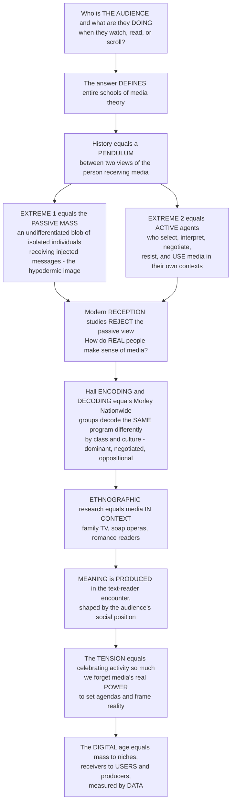

# 📺 Media Audiences and Reception

> [!abstract] TL;DR
> Ask the deceptively deep question — *who exactly is "the audience," and what are they actually **doing** when they watch, read, or scroll?* — and you find that the answer defines entire schools of media theory. The history of audience research is a **pendulum** between two pictures of the person on the receiving end: at one extreme the **passive mass** (an undifferentiated blob of isolated individuals absorbing whatever media *inject* — the old hypodermic image), at the other the **active agent** who selects, interprets, negotiates, resists, and *uses* media in their own context. Modern **reception studies** decisively rejected the passive-mass view and went out to study *real people in real living rooms*: Stuart Hall's **encoding/decoding**, David Morley's demonstration that different social groups decode the *same* program in systematically different ways (**dominant, negotiated, oppositional** readings), and ethnographic work on how families actually watch TV and how women use soap operas and romance — all revealing that **meaning is not *in* the text but produced in the encounter between text and reader**, shaped by social position. Yet a crucial tension warns: celebrate audience activity *too* much and you forget media's real **power** to set agendas, frame reality, and structure the very choices audiences have — and the digital age transforms the audience yet again, from a mass into fragmented niches and from receivers into tracked, datafied **users and producers**.

---

## Intuition

**Analogy — the injection versus the recipe.** Picture two very different images of "the audience." In the **first**, the audience is a crowd lined up for the same shot: a message is loaded into a syringe and pushed into every arm identically, and whatever was in the needle is now in the person — same dose, same effect, no questions asked. This is the old "**hypodermic**" or "magic bullet" picture of a **passive mass**: a huge, undifferentiated blob of isolated individuals who simply *receive* whatever media inject into them. In the **second** image, a media text is not an injection but a **recipe**. The producer writes the recipe — encoding a *preferred* dish they hope you will make — but the meal that actually appears on the table depends on the **cook**: their kitchen, their pantry, their skill, their taste, who else is in the house, and what they feel like eating tonight. Hand the *same* recipe to a hundred kitchens and you get a hundred different meals. Some cooks follow it faithfully (a **dominant** reading), some substitute an ingredient or two (a **negotiated** reading), and some read the recipe and deliberately cook something else entirely (an **oppositional** reading).

The whole modern field of audience and reception studies is the discovery that the second image is the true one. **Meaning is not sitting *inside* the media text** waiting to be swallowed whole; it is *produced* in the encounter between the text and a particular reader in a particular context. The same news bulletin, sitcom, or TikTok is genuinely a different object depending on who is decoding it and from where. This is why David Morley, studying viewers of the BBC current-affairs show *Nationwide*, found that a group of bank managers, a group of apprentices, and a group of trade-union shop stewards watched the identical episode and decoded it in **systematically different** ways — not randomly, but according to their **class, culture, and social position**. The meaning was co-produced, every time, by the meeting of text and viewer.

And once you go looking at *real* audiences, you find they are never the neat "mass" the injection picture imagined. They watch television in **living rooms** where someone controls the remote (usually, Morley found, the man of the house), where the set is on for company while nobody watches, where a soap opera is woven into the rhythms of housework and gossip. Janice Radway sat with women who read romance novels and found they were not passive dupes escaping into fantasy but **active** readers *using* the books to carve out a scrap of time and identity for themselves. Ien Ang wrote to *Dallas* viewers and found a complex, self-aware pleasure in melodrama. Media consumption, it turns out, is **embedded in everyday life** — in domestic space, gender relations, identity, and the small negotiations of the household — not beamed into a vacuum.

But here is the tension that keeps the field honest. If we get *too* excited about the active, clever, resisting audience, we risk forgetting that somebody still writes the recipes, stocks the only supermarket in town, and decides which dishes are even *on the menu*. Audiences are active — but active **within constraints not of their own choosing**. Celebrating every act of interpretation as heroic "resistance" can quietly let media's real structural **power** — to set the agenda, frame reality, and limit the available texts — slip out of view. And the digital age scrambles the picture once more: the "mass" splinters into a **long tail** of niche and micro-audiences, "receivers" become interactive **users and producers**, and every click is now **measured, tracked, and datafied** in granular detail. Understanding audiences and reception is understanding the *other half* of communication — not what media do to people, but what people do with, and make of, media.

---

## How It Works

### Core Mechanics

1. **Start from the audience, not the message.** Effects research asks *what media do to a passive receiver*. Reception studies inverts the question: *how do real people make sense of media?* The audience becomes the thing to be *studied* — its interpretive work is the phenomenon, not an afterthought.
2. **Meaning is produced, not transmitted.** Following Stuart Hall's **encoding/decoding** model, a producer *encodes* a text with a "**preferred meaning**," but that meaning is only realized when an audience **decodes** it. Because encoding and decoding use codes that are not perfectly shared, the message received is never guaranteed to be the message sent. Meaning lives in the **encounter**, not in the text alone.
3. **Texts are polysemic; readers occupy reading positions.** A media text is **polysemic** — open to more than one reading — but not infinitely so (it has a *structured* preferred reading). Hall named three hypothetical **decoding positions**: **dominant-hegemonic** (accept the preferred meaning), **negotiated** (broadly accept it but bend it to fit one's own situation), and **oppositional** (understand the preferred code but read *against* it).
4. **Decoding varies with social position.** Which reading a viewer produces is not random: it is patterned by **class, culture, discourse, and cultural competence** ("cultural capital"). Morley's *Nationwide* study gave this empirical teeth — different socio-demographic groups decoded the same program along predictable lines.
5. **Study media in context (the ethnographic turn).** Reception is not an isolated act of interpretation but a practice **embedded in everyday life** — in the home, the family, and domestic power relations. Morley's *Family Television* showed viewing shaped by **gendered control** of the set; Radway and Ang showed media woven into women's identity, pleasure, and daily routine. Media are **domesticated** into the texture of ordinary life.
6. **Meaning is co-produced; audiences form interpretive communities.** No single viewer decodes alone — readings are shared and stabilized within **interpretive communities** that supply the frames, competences, and codes a reader brings to the text.
7. **Hold agency and structure together.** Audiences are **active**, but their activity operates **within a choice set structured from above**. The field's central discipline is to affirm interpretive freedom *without* forgetting media's structural **power** to set agendas, frame reality, and control which texts exist at all.
8. **Two audiences, not one.** There is the **lived, interpretive** audience that reception studies pursues — and the **measured, institutional** audience the industry constructs through ratings, shares, and demographics, then sells to advertisers as an "**audience commodity**." The digital era makes this measured audience astonishingly granular even as it fragments the mass into niches, users, and producers.

### Flow / Architecture



---

## Key Concepts

### Secondary (explain it to a beginner)
- **The audience is not a blob.** The old picture imagined everyone getting the *same* message the same way, like a crowd getting the same injection. Real audiences are made of different people who make sense of things differently.
- **Meaning is made, not received.** A TV show is like a **recipe**, not a finished meal — what you actually "cook" from it depends on you, your background, and your situation.
- **Three ways to read.** You can *agree* with what a show wants you to think (**dominant**), *partly* agree and bend it to your life (**negotiated**), or understand it and *disagree on purpose* (**oppositional**).
- **Watching happens somewhere.** People watch TV in real living rooms — someone holds the remote, someone half-watches while cooking. *Where and with whom* you watch changes what watching means.
- **Active, but not all-powerful.** Audiences are clever and choosy, but they can only pick from what's on offer — and someone else decides what's on offer.

### Undergraduate (needs some theory)
- **The passive-to-active pendulum.** The history of audience conceptions swings from the **mass-society / hypodermic-needle** image of a passive mass, through the **limited-effects** turn and **uses and gratifications** (the audience as active need-satisfiers), to the fully **active, meaning-making** audience of cultural and reception studies. "Active audience" is the field's central — and contested — idea.
- **Encoding/decoding (Hall) and the three reading positions.** Meaning is not fixed in the text but produced in decoding; the **dominant-hegemonic, negotiated,** and **oppositional** positions are the theoretical foundation of reception analysis.
- **The *Nationwide* audience (Morley).** The landmark empirical study: different socio-demographic groups (managers, apprentices, shop stewards, students) decoded the *same* program differently, along lines of **class, culture, and discourse** — showing decoding is *socially patterned*, not idiosyncratic.
- **The ethnographic turn.** Studying media consumption **in context**: Morley's *Family Television* (viewing and **domestic power** — gendered control of the remote and viewing styles), Radway's *Reading the Romance* (women's active, meaningful use of romance novels), Ang's *Watching Dallas* (pleasure and the "melodramatic imagination"), and **fan studies**.
- **Polysemy and interpretive communities.** Texts are open to multiple readings (but not infinitely); readers decode within **interpretive communities** that supply shared codes and competences. Compare the **reader-response / reception** tradition in literary theory.
- **Cultural competence / cultural capital.** The *ability* to decode particular codes is unevenly distributed by education and social position — decoding is a **skill**, not a reflex.

### Graduate (system-level and critical)
- **The question of the audience itself.** Is "the audience" a real collectivity, an **institutional construct** produced by measurement, or a **discursive fiction**? Ien Ang's *Desperately Seeking the Audience* argues the "audience" the industry chases is largely a **construct** it needs to sell to advertisers, forever slipping away from the lived viewers it claims to represent.
- **Meaning as co-produced (text + reader + context).** The decisive theoretical claim: meaning is **not a property of the text** but an emergent product of the interaction between an encoded text, a socially positioned reader, and a context of use. This dissolves the old text-centric analysis.
- **The "active audience" debate and its critics.** Has the celebration of audience activity, resistance, and pleasure gone **too far**? Jim McGuigan's charge of "**cultural populism**" and James Curran's "**new revisionism**" critique warn that romanticizing "resistant" readings **obscures media's structural power** — who owns the channels, sets the agenda, and controls the available texts. The task is **reconciling agency and structure**: audiences are active, but *within constraints not of their choosing*.
- **The audience commodity and the political economy of measurement.** Dallas Smythe's argument that the media's real product is the **audience** itself — assembled by content and **sold to advertisers**. Ratings, shares, and demographics *construct* the "measured audience," which never quite matches the **lived, interpretive** audience; the gap is itself a site of power.
- **The datafied audience.** The digital shift replaces sampled ratings with **granular datafication** — analytics, tracking, A/B tests, and algorithmic profiling — remaking the audience as an "**audience of one**" through personalization, even as the mass fragments into a **long tail** of niches. Old questions (activity, power, meaning) return in networked form.
- **From audiences to users and producers.** Interactivity and participation blur the receiver/producer line (**prosumers**, "**produsage**," participatory culture), so "reception" now includes commenting, remixing, sharing, and rating — activity that is simultaneously genuine agency *and* free labor captured by platforms.

---

## Python Demo

Two computational views of the field's core claims. **(A) Differential decoding** models a *single* media text — carrying an encoded **preferred meaning** at the dominant-hegemonic pole — decoded by audience segments occupying different **social positions**. Each segment produces a *distribution* of readings (dominant / negotiated / oppositional) that varies **systematically** with its position, so the *same* text yields different meaning-distributions across groups (Morley's finding): meaning is co-produced, not fixed in the text. **(B) Fragmentation and bounded agency** models the historical **mass-to-niche** splintering of the audience (average outlet share collapsing as media choice explodes into a long tail), and the **active-audience-versus-power** balance (interpretive activity is real but operates *within* a choice set structured from above, so realized freedom shrinks as structural control rises).

```python
# Media Audiences & Reception, computationally.
#   A1  DIFFERENTIAL DECODING: one text (preferred meaning at the dominant pole)
#       decoded by three social segments -> each yields a DISTRIBUTION over
#       {dominant, negotiated, oppositional}. Same text, different meanings.
#   A2  Decoding varies SYSTEMATICALLY with social position (a continuous sweep).
#   B1  MASS -> NICHE: outlets explode, average share collapses (the long tail).
#   B2  BOUNDED AGENCY: audiences stay active, but realized interpretive freedom
#       falls as structural control of the agenda (media power) rises.
import numpy as np
import matplotlib.pyplot as plt

rng = np.random.default_rng(11)

# ---------------------------------------------------------------
# (A) DIFFERENTIAL DECODING -- the SAME text, different positions
# ---------------------------------------------------------------
# The text encodes a preferred (dominant) meaning at +1. A reader's decoding is
# drawn toward one of three reading-position prototypes; the closer a segment's
# social position sits to a prototype, the more likely that reading.
readings   = ["Dominant", "Negotiated", "Oppositional"]
prototypes = np.array([1.0, 0.0, -1.0])     # reading-position anchors
sigma      = 0.6                            # interpretive latitude

segments = ["Managers\n(dominant code)", "Apprentices\n(mid position)",
            "Shop stewards\n(oppositional)"]
seg_pos  = np.array([0.8, 0.0, -0.8])       # each segment's social position

def reading_dist(pos):
    aff = np.exp(-(pos - prototypes) ** 2 / (2 * sigma ** 2))
    return aff / aff.sum()

dist = np.array([reading_dist(p) for p in seg_pos])   # (segments x readings)

# continuous sweep: P(each reading) as social position slides from -1 to +1
grid  = np.linspace(-1, 1, 200)
sweep = np.array([reading_dist(p) for p in grid])     # (grid x readings)

# ---------------------------------------------------------------
# (B) FRAGMENTATION + BOUNDED AGENCY
# ---------------------------------------------------------------
years     = np.arange(1950, 2026, 5)
n_out     = 3 * np.exp((years - 1950) / 18.0)         # outlets grow ~exponentially
avg_share = 1.0 / n_out                               # average audience share (1/N)
top_share = 0.9 / (1 + (years - 1950) / 9.0)          # biggest outlet's share

control      = np.linspace(0, 1, 200)                 # structural control of agenda
activity     = 0.85 - 0.10 * control                  # interpretive activity stays high
choice_range = 1.00 - 0.90 * control                  # range of available meanings
realized     = activity * choice_range                # realized interpretive freedom

# ================= plots =================
fig, ax = plt.subplots(2, 2, figsize=(13, 10))
colors = ["#2ca02c", "#f39c12", "#c0392b"]

# A1: stacked reading distribution per segment
bottom = np.zeros(len(segments))
xs = np.arange(len(segments))
for k, r in enumerate(readings):
    ax[0, 0].bar(xs, dist[:, k], 0.6, bottom=bottom, label=r, color=colors[k])
    bottom += dist[:, k]
ax[0, 0].set_xticks(xs); ax[0, 0].set_xticklabels(segments, fontsize=8)
ax[0, 0].set_ylabel("share of readings")
ax[0, 0].set_title("A1. SAME text, different decodings\n(Morley's 'Nationwide' finding)")
ax[0, 0].legend(fontsize=8, loc="upper center", ncol=3)
ax[0, 0].set_ylim(0, 1.25)

# A2: reading probabilities as a continuous function of social position
for k, r in enumerate(readings):
    ax[0, 1].plot(grid, sweep[:, k], color=colors[k], lw=2, label=r)
for p, name in zip(seg_pos, ["managers", "apprentices", "shop stewards"]):
    ax[0, 1].axvline(p, color="gray", ls=":", lw=1)
    ax[0, 1].text(p, 1.02, name, rotation=90, va="bottom", ha="center", fontsize=7)
ax[0, 1].set_xlabel("audience social position  (oppositional  <->  dominant)")
ax[0, 1].set_ylabel("probability of reading")
ax[0, 1].set_title("A2. Decoding varies SYSTEMATICALLY with position\nmeaning is co-produced, not fixed in the text")
ax[0, 1].set_ylim(0, 1.15); ax[0, 1].legend(fontsize=8, loc="center right")

# B1: mass -> niche fragmentation
axb = ax[1, 0]
axb.plot(years, avg_share, "-o", ms=3, color="#2980b9", label="average outlet share (1/N)")
axb.plot(years, top_share, "-s", ms=3, color="#8e44ad", label="biggest outlet's share")
axb.set_xlabel("year"); axb.set_ylabel("share of total audience")
axb.set_title("B1. Mass -> niche: the audience FRAGMENTS")
axb.legend(fontsize=8, loc="upper right")
axb2 = axb.twinx()
axb2.plot(years, n_out, "--", color="#7f8c8d", lw=1.5)
axb2.set_ylabel("number of outlets (dashed)")

# B2: active audience vs media power (bounded agency)
ax[1, 1].plot(control, activity,     color="#27ae60", lw=2,  label="audience activity (within set)")
ax[1, 1].plot(control, choice_range, color="#c0392b", lw=2,  label="range of available meanings")
ax[1, 1].plot(control, realized,     color="#2c3e50", lw=2.5, ls="--", label="realized interpretive freedom")
ax[1, 1].fill_between(control, realized, activity, color="#c0392b", alpha=0.15)
ax[1, 1].set_xlabel("structural control of the agenda  (media power)")
ax[1, 1].set_ylabel("level")
ax[1, 1].set_title("B2. Active audience vs media POWER\nactivity is real but BOUNDED by the choice set")
ax[1, 1].legend(fontsize=8, loc="upper right")

plt.tight_layout()
plt.savefig("media_audiences_and_reception.png", dpi=120)

for name, d in zip(["Managers", "Apprentices", "Shop stewards"], dist):
    print(f"{name:<13s} -> " + ", ".join(f"{r}:{p:.0%}" for r, p in zip(readings, d)))
print(f"Outlets 1950 -> 2025 : {n_out[0]:.0f} -> {n_out[-1]:.0f}")
print(f"Avg share 1950 -> 2025: {avg_share[0]:.0%} -> {avg_share[-1]:.1%}")
print(f"Realized freedom (open vs controlled agenda): {realized[0]:.2f} -> {realized[-1]:.2f}")
```

**What the demo shows.** In **A1**, the *identical* text produces three different reading-distributions: the managers (who share the dominant code) mostly return **dominant** readings, the apprentices cluster on **negotiated**, and the shop stewards on **oppositional** — Morley's core result that decoding is *socially patterned*. **A2** makes the mechanism continuous: as social position slides from the oppositional to the dominant pole, the probability of a dominant reading rises smoothly and the oppositional reading falls — meaning is **co-produced** by the meeting of text and position, not stamped into the text. **B1** visualizes the digital-era **fragmentation**: as outlets multiply, the average share collapses toward the long tail and even the biggest outlet's share shrinks — the "mass" dissolves into niches. **B2** stages the field's central tension: audience **activity stays high** across the whole range, but as structural control of the agenda tightens, the **range of available meanings** collapses, so **realized interpretive freedom** (their product) falls — active audiences, bounded by media power.

---

## Real-World Applications

- **Audience research inside media companies.** Broadcasters, streamers, and publishers run focus groups, diary studies, and panels to learn not just *how many* watched but *what viewers made of* a show — the direct descendant of reception analysis, now fused with behavioral log data.
- **News framing and reception.** The same protest coverage lands as "legitimate grievance" or "dangerous disorder" depending on the viewer's position and interpretive community — reception research explains why identical bulletins polarize rather than persuade, complementing agenda-setting and framing effects.
- **Fandom, participatory culture, and "produsage."** Fan communities are the ultimate active audience: they decode, debate, remix, and rewrite texts (fan fiction, edits, wikis, memes), turning reception into production and blurring the receiver/producer line that platforms then monetize.
- **Ratings, shares, and the audience commodity.** Nielsen ratings, BARB panels, and streaming "completion" metrics *construct* the measured audience that is sold to advertisers — an institutional audience that never fully matches the lived one, exactly Ang's "desperately seeking the audience" problem.
- **Platform analytics and the datafied "audience of one".** Recommendation systems, A/B tests, watch-time optimization, and algorithmic profiling replace sampled ratings with granular, per-user tracking — reception measured in real time, and personalization that atomizes the mass into micro-audiences.
- **Media literacy education.** Teaching students to recognize the **preferred meaning** encoded in a text, to read **oppositionally**, and to notice their own position as decoders is applied reception theory — turning passive consumption into critical, active reading.
- **Advertising and audience segmentation.** Demographic and psychographic segmentation assumes that different social positions decode and respond to the *same* ad differently — the industry's operational version of differential decoding.

---

## Common Pitfalls

- **Reviving the passive-mass fallacy.** Talking about "the audience" as a single, uniform mass that "absorbs" messages. Real audiences are heterogeneous, socially positioned, and active — the injection picture is precisely what reception studies overturned.
- **Text-centric analysis (ignoring reception).** Analyzing a text's "message" as if it is automatically received as encoded. The encoding/decoding model exists to block this: the circuit is not complete until an active, positioned audience makes meaning.
- **Cultural populism (over-celebrating activity).** Reading *every* act of consumption as heroic "resistance" and every decoding as empowering. This is McGuigan's warning — romanticizing audience activity while losing sight of who owns the channels and sets the agenda.
- **Dropping structure for agency (or vice versa).** Collapsing the debate to one pole. The disciplined position holds both: audiences are genuinely active *and* bounded by a choice set structured from above (the demo's B2 panel). Neither "all-powerful media" nor "all-powerful audience" is defensible.
- **Confusing "active" with "free."** Selecting, interpreting, and even resisting are forms of *activity*, not proof of *freedom*. Datafied, personalized, engagement-optimized media can make heavily engineered consumption *feel* self-directed.
- **Mistaking the measured audience for the lived one.** Treating ratings, shares, and analytics as *the* audience. These are institutional constructs built to be sold; the interpreting, meaning-making audience is a different thing, and the gap between them is where much power hides.
- **Romanticizing "resistance" and ignoring effects.** Emphasizing oppositional readings so heavily that you deny media any influence at all — which ignores the equally real evidence (cultivation, agenda-setting, framing) that heavy, patterned exposure shapes what audiences take to be reality.

---

## Related Concepts

This note sits in the **Culture, Representation, and Identity** section and studies the *other half* of communication — what people do with, and make of, media. Its in-vault **siblings are referenced in prose** (not wikilinked, to keep the section web light): *Encoding, Decoding, and Audience Reception* supplies Hall's theoretical foundation and the three reading positions this note builds on; *Uses and Gratifications and Active Audiences* is the functional-psychological wing of the same active-audience tradition; *Cultural Studies and Representation* is the parent frame (meaning is made, not mirrored); *Popular Culture and the Culture Industry* debates the value and power of the everyday texts audiences consume; *Fandom and Participatory Culture* extends reception into production; *Cultivation Theory and Media Reality* is the long-term-effects counterweight that keeps the "active audience" honest about media power; and *Social Media and Networked Communication* is where the datafied, fragmented, producer-audience of the digital age lives.

Cross-vault links (Glob-verified) — this vault uses **distinct basenames** that complement, not duplicate, the audience-and-meaning notes elsewhere:

- [[The_Reader_and_Reception]] — the **reader-response and reception theory** of literary studies (Iser, Jauss, Fish's interpretive communities); the humanities cousin of Hall's active, meaning-making audience, and where the "meaning is produced in reading" idea was first developed.
- [[Media_Culture_and_Cultural_Industries]] — the **sociological** account of who *produces* culture at scale and owns the channels; the political-economy counterweight that keeps active-audience celebration honest about power.
- [[Family_Marriage_and_Kinship]] — the sociology of the **household and domestic power** that Morley's *Family Television* studied: media are consumed inside real families, and the remote is an instrument of gendered authority.
- [[Gender_Sex_and_Patriarchy]] — the gender relations at the heart of ethnographic reception work (Radway's romance readers, Ang's *Dallas* viewers, gendered viewing styles); reception is shaped by, and reshapes, gender and identity.
- [[Schemas_and_Mental_Models]] — the **cognitive machinery of interpretation**: the schemas, frames, and mental models a reader brings to a text are what make decoding *systematically* vary with prior knowledge and social position.

---

## Review Questions

1. **(Secondary)** Using the "injection versus recipe" analogy, explain why two people can watch the exact same TV program and come away understanding it completely differently. What does this say about where "meaning" lives?
2. **(Secondary/Undergraduate)** Name and briefly describe Hall's three **reading positions** (dominant, negotiated, oppositional). Give a concrete example of each for a single advertisement of your choice.
3. **(Undergraduate)** What did David Morley's *Nationwide* study demonstrate that a purely textual analysis of the program could not? Why is it important that the different decodings were *patterned* by class and culture rather than random?
4. **(Undergraduate)** Explain the "ethnographic turn" in audience research using Morley's *Family Television* or Radway's *Reading the Romance*. What does studying media "in context" reveal that a lab experiment on "media effects" would miss?
5. **(Graduate)** State the "**cultural populism**" / "new revisionism" critique of the active-audience tradition. Using the demo's *bounded agency* panel, argue how one can affirm that audiences are active while still taking media's structural **power** seriously.
6. **(Graduate)** Contrast the **lived/interpretive** audience with the **measured/institutional** audience (ratings, the "audience commodity," datafied analytics). How does the digital shift from a "mass" to fragmented, datafied **users and producers** transform Ang's problem of "desperately seeking the audience"?

---

## Sources

- Hall, Stuart. "Encoding/Decoding." In *Culture, Media, Language*, edited by Stuart Hall et al., 128–138. London: Hutchinson, 1980. (The foundational model of preferred, negotiated, and oppositional readings.)
- Morley, David. *The 'Nationwide' Audience: Structure and Decoding*. London: British Film Institute, 1980. — and *Family Television: Cultural Power and Domestic Leisure*. London: Comedia, 1986.
- Radway, Janice A. *Reading the Romance: Women, Patriarchy, and Popular Literature*. Chapel Hill: University of North Carolina Press, 1984.
- Ang, Ien. *Desperately Seeking the Audience*. London: Routledge, 1991. — and *Watching Dallas: Soap Opera and the Melodramatic Imagination*. London: Methuen, 1985.
- Abercrombie, Nicholas, and Brian Longhurst. *Audiences: A Sociological Theory of Performance and Imagination*. London: Sage, 1998. (Surveys the passive-to-active pendulum and the "spectacle/performance" paradigm.)

---

#media-studies #audience-studies #reception-theory #active-audience #ethnographic-research
