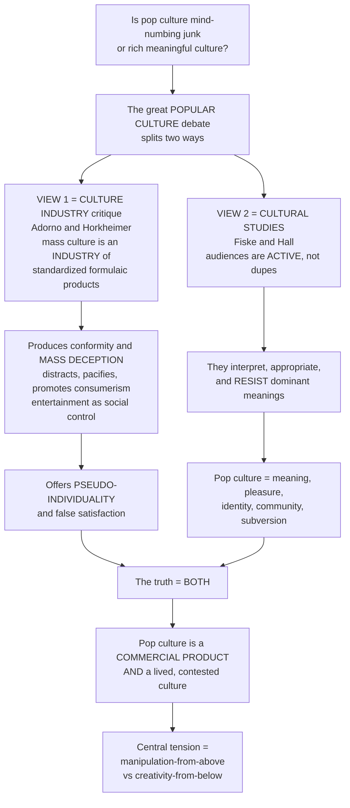

# 🎭 Popular Culture and the Culture Industry

> [!abstract] TL;DR
> Is the pop music, blockbuster cinema, reality TV, and viral content of everyday life **mind-numbing junk that keeps us docile** or a **rich, meaningful culture full of pleasure and resistance**? This is the central drama of studying popular culture, and it splits into two opposed poles. The Frankfurt School's **culture industry** critique (Adorno & Horkheimer) says mass culture is not real culture but an *industry* — churning out **standardized, formulaic products** under a veneer of **pseudo-individuality**, producing conformity, "mass deception," and passive consumers reconciled to the status quo. The **cultural studies** rehabilitation (Fiske, Hall) says this elitism misses what audiences actually *do*: people **actively make meaning, pleasure, and identity**, decoding, appropriating, and even **resisting** popular culture. The mature answer is that **both are true** — popular culture is simultaneously a **commercial commodity** shaped by profit and standardization *and* a **lived, contested culture** of real pleasure and sometimes subversion. Is mass culture something done **to** us, or something we **do**? The honest answer is: both at once.

---

## Intuition

**Analogy:** Think of a fast-food chain versus a home kitchen. The culture-industry view sees popular culture as the **fast-food chain**: every outlet serves the same engineered burger, tuned by focus groups to hit the reliable pleasure buttons of salt, fat, and sugar; the "seasonal specials" and "build-your-own" menus are **fake variety** — the same patty in a new wrapper — designed to keep you eating without thinking, coming back, and never asking who profits. The cultural-studies view says: watch what people actually *do* with that food. They remix it, meme it, turn a cheap meal into a ritual with friends, invent off-menu hacks, and load it with private meanings the corporation never intended. The **kitchen is theirs even if the ingredients are not**.

Technically: one pole treats popular culture as a **product manufactured for you** — standardized commodities that pacify and reproduce domination (link the concept of ideology). The other treats it as a **practice performed by you** — an active audience decoding, appropriating, and repurposing mainstream texts for its own meaning, pleasure, and identity (link encoding/decoding, fandom, and subcultures). The whole field lives in the tension between **manipulation-from-above** and **creativity-from-below** — and refusing to collapse that tension is the point.

---

## How It Works

### Core Mechanics

1. **Defining "popular culture."** The term is slippery. It can mean *quantitatively* the culture widely liked and consumed by "the people"; *industrially* the mass-produced commercial culture of the modern media economy; or *residually* whatever is left once "high culture" is subtracted. The **folk / mass / high** distinctions carry old class anxieties — from Matthew Arnold and F. R. Leavis defending cultivated "high culture" against the "levelling" masses, to Raymond Williams's counter that **culture is ordinary** and the everyday is a legitimate object of study.

2. **The culture-industry pole (the pessimists).** In "The Culture Industry: Enlightenment as Mass Deception" (1944), Adorno & Horkheimer argue mass culture is an **industry** producing **standardized** goods. Beneath surface novelty lies the "always the same"; **pseudo-individualization** supplies cosmetic differences (a new star, a fresh hook) that mask deep sameness. The industry functions as an **instrument of ideological control** — manufacturing **passive, conformist consumers**, atrophying critical and imaginative capacities, promoting consumerism, and reconciling people to the status quo through **distraction** ("bread and circuses"). Adorno's essay on the "regression of listening" reads standardized popular music as training in passive, infantile consumption. Culture becomes **commodity** (link political economy and ideology). Adjacent strands: mass-society theory, Marcuse's *one-dimensional man*, and Postman's critique of amusement.

3. **The cultural-studies pole (the optimists).** The Birmingham tradition (Stuart Hall, then John Fiske) rejects this elitism and pessimism. Popular culture is a **legitimate terrain of meaning, pleasure, and identity**. The **active audience** does not passively absorb: it interprets, negotiates, appropriates, and *uses* culture (link encoding/decoding and reception). Fiske's *Understanding Popular Culture* argues popular culture is **made by the people out of the resources the culture industry provides** — it is **polysemic**, open to **semiotic resistance**, and its pleasures can be **subversive or empowering**. Subcultures and fans creatively repurpose mainstream texts (link fandom and participatory culture). Following Gramsci and Hall, popular culture is a site of **hegemonic struggle** — neither pure domination nor pure freedom, but an ongoing contest over meaning.

4. **The synthesis and the "cultural populism" debate.** Each pole captures a real half. Popular culture is **at once** an industrially produced commodity shaped by profit, standardization, and power **and** a lived, meaningful, contested culture of genuine pleasure and occasional resistance. Jim McGuigan's critique of **"cultural populism"** warns the optimists can **romanticize consumption and "resistance"** while ignoring economic power and real domination — a call to reconnect audience studies to political economy. The debate turns on the classic **structure-vs-agency** and **pleasure-vs-power** tensions.

5. **Taste, distinction, and value.** Pierre Bourdieu's *Distinction* shows **taste is not innocent**: cultural preferences function as **class markers** and a mechanism of social distinction, and **cultural capital** is transmitted like economic capital (link Bourdieu and the sociology of class). The high/low hierarchy is now eroding — **poptimism**, "guilty pleasures," and the blurring of highbrow and lowbrow complicate any simple ranking of cultural worth.

6. **Digital and platform popular culture.** In the platform age, **user-generated content, memes, virality, and participatory culture** blur producer and consumer into the **"prosumer."** The "long tail" of niche production coexists with **algorithmic hit-making** and platform concentration; streaming rebuilds the culture industries; global pop culture (K-pop and beyond) circulates at planetary scale. The open question renews the old debate: do digital media **democratize** cultural production or **intensify** its commodification and control?

### Flow / Architecture



---

## Key Concepts

### Secondary (intuitive)
- **Culture industry:** the idea that pop songs, movies, and shows are *manufactured* like any factory product — the same formula sold over and over.
- **Standardization + pseudo-individuality:** products are basically the same underneath, dressed up with surface differences so each feels "new."
- **Active audience:** people are not sponges — they think about, argue with, joke about, and remix what they watch, sometimes turning it against its makers.
- **The big question:** is mass culture something done **to** us (to keep us quiet and buying) or something **we do** (to make meaning and have fun)? The grown-up answer is *both*.

### Undergraduate (mechanistic)
- **Adorno & Horkheimer's thesis:** mass culture as commodified, formulaic, ideologically pacifying; "mass deception," distraction, the "regression of listening"; culture as an instrument that reproduces the status quo.
- **Fiske's rehabilitation:** popular culture is *made from* the culture industry's resources; **polysemy** and **semiotic resistance** mean the same text yields many readings and can be repurposed; popular pleasures can be empowering.
- **Hall and hegemony:** popular culture as a **contested field** where dominant meanings are won, negotiated, and resisted — not simply imposed (Gramscian hegemony, not crude manipulation).
- **The cultural-populism critique (McGuigan):** celebrating "resistance" can drift into romanticizing consumption and forgetting that **economic power and standardization are real** — reconnect to political economy.
- **Bourdieu's Distinction:** taste as class-coded; **cultural capital**; the high/low hierarchy as a mechanism of social sorting rather than neutral aesthetic ranking.

### Graduate (critical / theoretical)
- **Commodity fetishism to the culture industry:** Adorno extends Marx's analysis of the commodity into the aesthetic sphere; exchange-value colonizes cultural form, and "individuality" itself becomes a manufactured effect. The critique is *dialectical*, not merely dismissive — it holds a genuine longing for autonomy against its capitalist capture.
- **Structure vs agency, pleasure vs power:** the field's core antinomy. Over-reading agency dissolves domination (the "new revisionism" worry); over-reading structure denies audiences any competence or joy. Mature work (Morley's later reflections, Kellner's "critical media culture") holds both.
- **Polysemy and its limits:** semiotic resistance is real but **structured** — encoding privileges preferred meanings, ownership concentrates, and algorithmic curation shapes the field of the sayable. "Resistance" at the level of interpretation may leave material power untouched.
- **The prosumer and platform capitalism:** participatory culture blurs production/consumption, but "free labor" (Terranova) and datafication mean user creativity is itself **monetized**. The digital renews rather than resolves the Adorno/Fiske dispute — democratization and commodification advance *together*.
- **Global circulation and hybridity:** cultural-imperialism theses (one-way flow from the metropole) meet reception evidence of local appropriation, "glocalization," and reverse flows (K-pop, telenovelas), complicating any simple domination model (link global media).

---

## Python Demo

```python
# Popular Culture and the Culture Industry, simulated two ways:
#  (a) CULTURE-INDUSTRY SIDE  -- Adorno's "standardization + pseudo-individualization":
#      mass-culture products are nearly identical in DEEP structure (a few profitable
#      formulas) yet spread out in SURFACE features (cosmetic novelty). Over time a
#      hit-driven market CONCENTRATES on fewer formulas -- true diversity COLLAPSES
#      even as the NUMBER of releases (the illusion of choice) keeps rising.
#  (b) CULTURAL-STUDIES SIDE  -- the ACTIVE AUDIENCE:
#      (b1) POLYSEMY: one popular text is decoded into a DISTRIBUTION of meanings
#           (dominant / negotiated / oppositional) across a population.
#      (b2) SEMIOTIC RESISTANCE: a subculture repurposes the text's meaning AWAY
#           from its intended, commercial reading.
import numpy as np
import matplotlib.pyplot as plt

rng = np.random.default_rng(42)

# ----- (a) STANDARDIZATION + PSEUDO-INDIVIDUALIZATION -----------------------
N = 4000                      # cultural products (songs / films)
K = 5                         # number of profitable "formulas"
formula = rng.integers(0, K, N)
centroids = np.linspace(-2.0, 2.0, K)          # deep-structure formula centers
core    = centroids[formula] + rng.normal(0, 0.12, N)   # DEEP: tight -> low true diversity
surface = rng.normal(0, 1.0, N)                          # SURFACE: wide -> high pseudo-variety

# ----- (a2) HIT-DRIVEN HOMOGENIZATION OVER TIME ----------------------------
years   = np.arange(1, 21)
ranks   = np.arange(1, K + 1)
def effective_number(shares):                   # exp(Shannon entropy) = "real" diversity
    s = shares[shares > 0]
    return np.exp(-np.sum(s * np.log(s)))
true_div, releases = [], []
for i, _ in enumerate(years):
    skew   = 0.20 + 0.20 * i                     # market skew grows: rich get richer
    w      = 1.0 / ranks ** skew
    shares = w / w.sum()
    true_div.append(effective_number(shares))    # falls: fewer real formulas dominate
    releases.append(30 + 9 * i)                  # rises: more titles = illusion of choice

# ----- (b1) POLYSEMY: one text -> many readings ----------------------------
M = 20000
alignment = rng.beta(2, 2, M)                    # ideological closeness to dominant code
reading   = np.clip(alignment + rng.normal(0, 0.14, M), 0, 1)   # 1=dominant .. 0=oppositional
T_LOW, T_HIGH = 0.33, 0.66
dom = np.mean(reading >= T_HIGH)
neg = np.mean((reading >= T_LOW) & (reading < T_HIGH))
opp = np.mean(reading < T_LOW)

# ----- (b2) SEMIOTIC RESISTANCE: subculture shifts the meaning --------------
intended = 0.80                                  # commercial / preferred meaning
mainstream = np.clip(rng.normal(intended, 0.10, M), 0, 1)
subculture = np.clip(rng.normal(0.30, 0.10, M), 0, 1)   # repurposed, oppositional meaning

# ----- PLOTS ---------------------------------------------------------------
fig, ax = plt.subplots(2, 2, figsize=(13, 9))

# (a1) surface variety (wide) vs deep sameness (K tight bands)
sc = ax[0, 0].scatter(core, surface, c=formula, cmap="tab10", s=8, alpha=0.5)
for c in centroids:
    ax[0, 0].axvline(c, color="k", ls=":", lw=0.8)
ax[0, 0].set_title("(a1) Standardization vs pseudo-individualization")
ax[0, 0].set_xlabel("DEEP formula axis  -> only ~5 tight clusters (low true diversity)")
ax[0, 0].set_ylabel("SURFACE novelty axis  -> wide spread (illusion of variety)")

# (a2) true diversity collapses while release count climbs (illusion of choice)
ax2 = ax[0, 1].twinx()
l1, = ax[0, 1].plot(years, true_div, "-o", ms=3, color="#c0392b",
                    label="true diversity (effective formulas)")
l2, = ax2.plot(years, releases, "-s", ms=3, color="#2980b9",
               label="number of releases")
ax[0, 1].set_title("(a2) Hit-driven homogenization")
ax[0, 1].set_xlabel("time (years)")
ax[0, 1].set_ylabel("effective number of formulas", color="#c0392b")
ax2.set_ylabel("releases per year", color="#2980b9")
ax[0, 1].legend(handles=[l1, l2], loc="center left")

# (b1) polysemy: one text -> dominant / negotiated / oppositional readings
bins = np.linspace(0, 1, 41)
ax[1, 0].hist(reading, bins=bins, color="#8e44ad", alpha=0.75)
for t in (T_LOW, T_HIGH):
    ax[1, 0].axvline(t, color="k", ls="--", lw=1)
top = ax[1, 0].get_ylim()[1]
ax[1, 0].text(0.16, top * 0.9, f"OPP\n{opp:.0%}", ha="center")
ax[1, 0].text(0.50, top * 0.9, f"NEG\n{neg:.0%}", ha="center")
ax[1, 0].text(0.83, top * 0.9, f"DOM\n{dom:.0%}", ha="center")
ax[1, 0].set_title("(b1) Active audience: one text -> many readings")
ax[1, 0].set_xlabel("reading  (0 = oppositional  ->  1 = dominant/preferred)")
ax[1, 0].set_ylabel("audience members")

# (b2) semiotic resistance: subculture pulls meaning away from the intended one
ax[1, 1].hist(mainstream, bins=bins, alpha=0.6, color="#16a085", label="intended / commercial")
ax[1, 1].hist(subculture, bins=bins, alpha=0.6, color="#e67e22", label="subcultural repurposing")
ax[1, 1].axvline(intended, color="k", ls="--", lw=1.2)
ax[1, 1].text(intended, ax[1, 1].get_ylim()[1] * 0.92, "intended meaning", ha="right")
ax[1, 1].set_title("(b2) Semiotic resistance")
ax[1, 1].set_xlabel("meaning attributed to the same product")
ax[1, 1].set_ylabel("audience members")
ax[1, 1].legend()

plt.tight_layout()
plt.savefig("popular_culture_and_culture_industry.png", dpi=120)
print("True diversity  year 1 -> year 20:", round(true_div[0], 2), "->", round(true_div[-1], 2))
print("Releases        year 1 -> year 20:", releases[0], "->", releases[-1])
print("Readings  dominant / negotiated / oppositional:",
      round(dom, 3), round(neg, 3), round(opp, 3))
```

Running it dramatizes both poles at once. On the **culture-industry** side, panel (a1) shows products collapsing into a handful of tight formula-clusters on the deep axis while spraying widely on the surface axis — *standardization dressed as variety*; panel (a2) shows **true diversity falling** even as **releases climb** — the illusion of choice. On the **cultural-studies** side, panel (b1) shows the *same* text fracturing into dominant, negotiated, and oppositional readings, and (b2) shows a subculture **pulling the meaning away** from its intended commercial reading. The market really does homogenize *and* audiences really do diverge — both graphs are true.

---

## Real-World Applications

- **The streaming-era formula machine.** Data-driven commissioning (Netflix, Spotify) is Adorno updated: recommender systems optimize toward proven patterns — the "Netflix algorithm show," the loudness-and-hook Spotify hit — while marketing frames each as fresh and personal. Panel (a2) is essentially the greenlighting logic of a risk-averse studio.
- **Reality TV and manufactured "authenticity."** Formats are franchised and cloned worldwide (the same competition template, localized) — pseudo-individualization at industrial scale — yet fan communities read them ironically, camp them up, and build parasocial and meme cultures around them (active audience in action).
- **Memes, remix, and culture-jamming.** Brand mascots repurposed into oppositional memes, ads subverted by "brandalism," pop songs recontextualized in protest — textbook **semiotic resistance** (panel b2), and a core reason marketers A/B-test for oppositional decodings.
- **Fandom and participatory culture.** Fan fiction, cosplay, edits, and stan Twitter show audiences *producing* culture from industry raw material — evidence for Fiske and Jenkins, and a live test of whether platforms empower creators or extract free labor.
- **Poptimism and the erosion of high/low.** Critical rehabilitation of pop, hip-hop, and genre film as serious culture — Bourdieu's hierarchy visibly loosening, even as new distinction games (obscure taste, "poptimist" credentials) replace the old ones.
- **Media literacy and cultural policy.** Teaching students to spot the preferred meaning and read "against the grain" operationalizes oppositional decoding; debates over public-service broadcasting and cultural subsidy are debates over whether to trust or correct the culture industry.

---

## Common Pitfalls

- **Reading Adorno as a snob who "just hated pop."** The culture-industry thesis is a *dialectical* critique of commodification, not a taste verdict — it mourns lost autonomy, and it indicts the *system*, not the people who enjoy its products. Dismissing it as elitism misses its argument about power.
- **Romanticizing "resistance" (cultural populism).** Celebrating every meme and reading as subversion — McGuigan's warning — lets **economic power off the hook**. Interpretive resistance is not the same as material change; polysemy has limits and ownership is concentrated.
- **Collapsing the debate into one winner.** The field's whole value is holding the tension. "The industry manipulates us" and "audiences are free" are each half-truths; the mature position is **both at once** (structure *and* agency, pleasure *and* power).
- **Treating "standardization" as literal identicalness.** The claim is about deep formulaic sameness beneath real surface variety — not that no song differs from another. Panel (a1) is the precise picture: tight core, wide surface.
- **Confusing popularity with worth (in either direction).** "Popular therefore debased" and "popular therefore democratic/good" are both non-sequiturs. Commercial success is evidence about distribution and marketing, not automatically about value or about audience passivity.
- **Ignoring political economy when studying meaning.** Reception and pleasure are real, but who owns the studios, who sets the algorithm, and who captures the data still structure the field. Meaning-making happens *inside* an industry.

---

## Related Concepts

- [[Encoding_Decoding_and_Audience_Reception]] — Hall's model is the engine of the active-audience pole: the same text decoded dominant / negotiated / oppositional, the mechanism behind polysemy and semiotic resistance in panel (b1).
- [[Media_Industries_and_Political_Economy]] — the ownership, profit, and standardization pressures that give the culture-industry critique its teeth, and that cultural populism is accused of forgetting.
- [[Media_Culture_and_Cultural_Industries]] — the sociology sibling that traces the arc from Adorno's culture industry through Gramscian hegemony to algorithmic "surveillance capitalism"; the institutional machinery behind this note's debate.
- [[Marx_and_Critical_Theory]] — the Frankfurt School's home: commodity fetishism, ideology, and base/superstructure supply the theoretical foundation of Adorno & Horkheimer's mass-deception thesis.
- [[Beauty_and_Taste]] — Bourdieu's *Distinction* and the high/low hierarchy: why taste is class-coded and how the guilty-pleasure/poptimism debate erodes the old cultural ranking.
- [[Social_Class_and_Stratification]] — cultural capital as class reproduction; the material substrate beneath taste, distinction, and access to cultural production.

Within this vault, this note is the hinge of the culture-and-identity section and should be read alongside its siblings (prose-only here, to avoid dangling links): **Cultural_Studies_and_Representation** (the Birmingham tradition and how meaning is made), **Ideology_Hegemony_and_Media** (the domination-vs-struggle axis of the debate), **Encoding_Decoding_and_Audience_Reception** (the active-audience mechanism), **Fandom_and_Participatory_Culture** (audiences as producers and semiotic poachers), **Media_Audiences_and_Reception** (the empirical evidence on active interpretation), **Media_Industries_and_Political_Economy** (the commercial and standardizing pressures), and **Global_Media_and_Cultural_Imperialism** (whether global pop culture is domination, hybridity, or both).

---

## Review Questions

1. **(Secondary)** In your own words, explain what Adorno meant by calling pop culture an "industry," and give one everyday example of "pseudo-individuality" — surface variety hiding deep sameness — from music, film, or social media.
2. **(Secondary/Undergraduate)** The culture-industry view says mass culture is done *to* us; the cultural-studies view says it is something *we do*. Pick a single popular text (a hit song, a viral video, a franchise film) and describe how each view would analyze it.
3. **(Undergraduate)** What does John Fiske mean when he says popular culture is "made by the people out of the resources of the culture industry"? How do **polysemy** and **semiotic resistance** support his claim, and what does the Python demo's panel (b) illustrate about it?
4. **(Undergraduate/Graduate)** Jim McGuigan warns against "cultural populism." State the critique precisely: how can celebrating audience resistance let economic power "off the hook," and why does reconnecting to political economy (and to Bourdieu's *Distinction*) answer it?
5. **(Graduate)** In the platform age the audience becomes a "prosumer" and algorithms curate what we see. Argue whether digital media *democratize* cultural production or *intensify* commodification and control — and explain why the Adorno/Fiske debate may be renewed rather than resolved by the "free labor" and datafication of participatory culture.

---

## Sources

- Adorno, Theodor W., and Max Horkheimer. "The Culture Industry: Enlightenment as Mass Deception." In *Dialectic of Enlightenment*, translated by Edmund Jephcott. Stanford: Stanford University Press, 2002. (Originally 1944/1947.)
- Fiske, John. *Understanding Popular Culture*. London: Routledge, 1989.
- Storey, John. *Cultural Theory and Popular Culture: An Introduction*. 8th ed. London: Routledge, 2018.
- Bourdieu, Pierre. *Distinction: A Social Critique of the Judgement of Taste*. Translated by Richard Nice. Cambridge, MA: Harvard University Press, 1984. (Originally 1979.)
- McGuigan, Jim. *Cultural Populism*. London: Routledge, 1992.

---

#media-studies #popular-culture #culture-industry #frankfurt-school #active-audience
