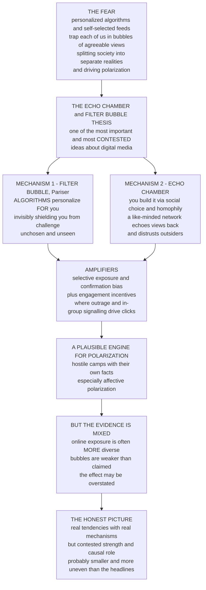

# 🫧 Attention, Filter Bubbles and Echo Chambers

> [!abstract] TL;DR
> A common fear about digital media goes like this: personalized **algorithms** and self-selected feeds trap each of us in a **bubble** where we only ever see views we already agree with, splitting society into isolated tribes that inhabit separate realities — driving the **polarization** tearing democracies apart. This is the **echo chamber** and **filter bubble** thesis, one of the most important — and most **contested** — ideas about digital media. Two mechanisms are proposed. A **filter bubble** (Eli Pariser) is built *for* you by **algorithms**: recommendation systems, chasing engagement, personalize your feed until you are surrounded by agreeable content and *invisibly* shielded from challenge — a bubble you did not choose and cannot see. An **echo chamber** is something you help build *yourself* through **social choice**: you follow like-minded people, join congenial communities, and (via **homophily** — "birds of a feather") end up in a network where the same views echo back and forth, amplified and unchallenged, while dissent is filtered out and outsiders are distrusted. Layer on the human tendencies of **selective exposure** and **confirmation bias**, plus the outrage-rewarding incentives of the attention economy, and you have a plausible engine for **polarization** — groups drifting into hostile, mutually-unintelligible camps with their own facts. **But** — and this is crucial — the empirical evidence is genuinely mixed and hotly debated: many careful studies find people online encounter *more* diverse, cross-cutting views than offline, that most media diets are fairly varied, and that the "bubbles" are weaker than the popular narrative claims — so the effect may be overstated and polarization may be driven more by elite dynamics and partisan identity. The honest picture is nuanced: filter bubbles and echo chambers are **real tendencies with real mechanisms**, but their strength, prevalence, and causal role in polarization are **contested** and probably smaller and more uneven than the alarming headlines suggest.

---

## Intuition

**Analogy — the hall of mirrors versus the crowded street.** Imagine two rooms you might spend your days in. The first is a **hall of mirrors**: everywhere you turn you see reflections of *your own face*, thrown back at you from every angle, louder and more flattering each time — and the glass is angled so cleverly that you never even notice there is a wall, let alone a world of other faces behind it. That is the fear about digital media. The second room is a **crowded street**: you did not pick the strangers around you, and as you walk you overhear scraps of a hundred conversations you never sought out — the neighbour's odd politics, a coworker's holiday photos, an old classmate's angry repost. That is the counter-claim: that social feeds, by dragging in the varied opinions of your loose acquaintances, actually expose you to *more* difference than the small, like-minded circle you would choose face-to-face.

The whole debate is a fight over **which room you are actually in**. The alarming story says the internet is a hall of mirrors: **filter bubbles** that algorithms build around you, and **echo chambers** you build around yourself, both sealing you inside agreeable views until society fractures into tribes with separate realities. Two mechanisms drive it. A **filter bubble** is *unchosen and invisible* — recommendation systems, trying to show what you will click, quietly filter out anything challenging until your feed is a mirror. An **echo chamber** is *self-built* — you follow people like you, join communities like you (homophily), and the same opinions bounce around a closed group, amplified, while dissent is excluded and the other side is dismissed as untrustworthy. Human nature helps: **selective exposure** (we seek agreeable information) and **confirmation bias** (we favour what fits our beliefs), stirred by platform incentives that reward outrage and in-group signalling.

Here is the twist that makes this one of the *trickiest* questions in media studies: **the evidence for the hall of mirrors is genuinely mixed.** Careful studies keep finding the crowded street — that people online meet *more* cross-cutting views than offline, that most people's media diets are moderate and varied, that only a small minority live in true bubbles, and that where polarization is rising it may owe more to elite cue-giving and partisan identity than to any algorithm. So the intellectually honest position is not "bubbles are a myth" and not "we are all trapped," but the harder middle: **filter bubbles and echo chambers are real tendencies with real mechanisms, whose strength and causal weight are contested and probably smaller and more uneven than the headlines say.** Learning to hold that nuance *is* the lesson.

---

## How It Works

The thesis has a clear logical structure: a **worry**, two proposed **mechanisms**, a set of **amplifiers**, a claimed **consequence**, and a crucial **empirical caveat**. Walk it in steps.

1. **The shift that started the worry.** Mass media once offered a few **shared channels** — an informational commons where a nation watched roughly the same evening news and read a handful of papers (the theme of the sibling note *Media and Democracy: the Public Sphere*). Digital media replaced that with **fragmented, personalized, self-selected** diets (the concern of *Social Media and Networked Communication*). The fear: without a common set of facts, a shared **public sphere** dissolves and social cohesion frays.

2. **Mechanism 1 — the filter bubble (Pariser): built *for* you, by algorithms.** Personalization systems in search, feeds, and recommendations (the machinery of *Platforms, Algorithms and Curation*) predict what will keep you engaged and serve *more of it*. Iterated, this **systematically filters out** disagreeable or challenging content and encloses you in agreeable material — **without your choice and without your awareness**. The signature features are that it is **algorithmic**, **involuntary**, and **invisible**: you never see the articles you were not shown.

3. **Mechanism 2 — the echo chamber: built *by* you, through social choice.** Even with no algorithm, people **follow like-minded voices**, **join congenial communities**, and — through **homophily** ("birds of a feather," the network segregation of *Homophily, Selection and Influence*) — assemble a social graph in which the same views **echo back and forth**, amplified, while dissent is excluded. Sunstein's *#Republic* calls this "the daily me" and "cyberbalkanization." Crucially, C. Thi Nguyen distinguishes two things often conflated: an **epistemic bubble** merely *omits* other voices (fixable by exposure), whereas a true **echo chamber** actively **discredits** outsiders — it is a structure of **trust**, not just exposure, so simply "showing people the other side" can fail or backfire.

4. **The amplifiers — psychology plus platform incentives.** Two human tendencies do a lot of work: **selective exposure** (we preferentially seek attitude-consistent information — Festinger's dissonance-reduction) and **confirmation bias / motivated reasoning** (we interpret ambiguous evidence to fit our priors, and reason to *defend identity*, not to be accurate). These interlock with the **engagement incentives** of the attention economy (the sibling *Advertising and the Attention Economy*): **moral-emotional and out-group-hostile content spreads fastest**, so platforms optimizing for clicks amplify exactly the outrage and tribal signalling that harden a chamber.

5. **The claimed consequence — polarization.** The proposed causal chain runs: fragmentation and bubbles → selective exposure → attitude **extremity** and, especially, **affective polarization** (disliking and distrusting the *other side*, not just disagreeing on issues — Iyengar) → democratic dysfunction. The internal engine is **group polarization** (Sunstein): like-minded groups deliberating together drift toward *more extreme* versions of their shared view, compounded by **false consensus** and **misperception** of the out-group.

6. **The caveat — the evidence is mixed (this is not a footnote).** Many careful studies find bubbles **weaker, rarer, or more nuanced** than the popular story: social media often *increases* exposure to diverse and cross-cutting views (weak ties and **incidental exposure** — Bakshy et al.; Barberá), most people have **moderate, varied** diets, only a **small minority** inhabit true bubbles, and *offline* networks can be *more* homogeneous than online ones. Whether **algorithms or human choice** drive selectivity is disputed, as is whether media *cause* polarization or merely *correlate* with it (elite polarization, partisan sorting, and a few hyper-engaged users are rival explanations). Boxell–Gentzkow–Shapiro find polarization rising *fastest among the least-online*; Bail's field experiments find cross-exposure can *harden* views. The emerging consensus: **real but overstated and uneven.**



---

## Key Concepts

### Secondary (intuitive level)

- **Filter bubble = a bubble made *for* you.** Apps guess what you like and quietly show you more of it, hiding the stuff you might disagree with. You did not ask for the bubble, and you cannot see its edges — you never notice the posts you were *not* shown.
- **Echo chamber = a bubble you make *yourself*.** By following friends who think like you and joining groups that agree with you, you end up in a place where the same opinions keep bouncing back, louder each time — and the "other side" gets treated as not worth trusting.
- **Why it might happen.** People naturally look for stuff they already agree with (**selective exposure**) and believe things that fit what they already think (**confirmation bias**). Apps that want your clicks feed this by pushing the most exciting, angriest posts.
- **The worry.** If everyone lives in a different bubble, we stop sharing the same facts, split into rival teams that dislike each other, and democracy gets harder — this is **polarization**.
- **The big surprise.** It might be *weaker than it sounds*. Online you often bump into the varied opinions of people you barely know — more difference, not less. So the scary version may be overstated.

### Undergraduate (working level)

- **Filter bubble (Pariser, 2011).** The claim that **personalization algorithms** create a *unique, invisible, algorithmically-curated* information universe per user, filtering *out* challenge without the user's choice or awareness. The distinctive properties: **algorithmic, involuntary, invisible**. Key critique: users retain **agency** (they click, follow, and search), and personalization also *introduces* diversity, so the pure-algorithm story is incomplete.
- **Echo chamber and "the daily me" (Sunstein).** Self-constructed enclosure through **social and choice** mechanisms — following, joining, homophily — plus **group polarization** (like-minded deliberation pushes groups to extremes). "Cyberbalkanization": the splintering of a shared public into isolated enclaves.
- **Epistemic bubble vs echo chamber (Nguyen).** A **crucial distinction**. An *epistemic bubble* simply **leaves out** contrary voices (a coverage gap — fixable by adding exposure). An *echo chamber* actively **discredits** outside sources (a **trust** structure — members hear the other side and *reject* it). This is why "just show people the other side" is not a reliable fix — and can backfire.
- **Selective exposure and confirmation bias.** The psychological drivers: **selective exposure** (Festinger, cognitive dissonance) is *seeking* attitude-consistent information; **confirmation bias / motivated reasoning** is *processing* information to protect priors and identity. Together they mean people *build their own* bubbles even without algorithms.
- **Issue vs affective polarization.** **Issue (ideological) polarization** is positions on questions diverging; **affective polarization** is growing *dislike and distrust of the other side*. The two can move independently, and the **affective** form — hostility, not disagreement — is the one most clearly rising in many democracies and most plausibly linked to fragmented media.

### Graduate (theoretical level)

- **The contested-evidence frontier (give it real weight).** The popular thesis outruns the data. **Bakshy, Messing & Adamic (2015)** find that on Facebook, *individual choice* filters cross-cutting content **more** than the algorithm does, and users still see substantial ideological diversity. **Barberá** and others document that **weak ties and incidental exposure** on social media *raise* cross-cutting exposure relative to homogeneous offline networks. **Boxell–Gentzkow–Shapiro** find affective polarization rising *fastest among the least-online* demographics — awkward for a pure-algorithm account. **Bail's** *Breaking the Social Media Prism* shows deliberate cross-exposure can **backfire**, hardening views (consistent with Nguyen's echo-chamber-as-trust). The methodological difficulties are severe: defining a "bubble," measuring *exposure* vs *consumption* vs *effect*, and separating **selection** from **influence** (do bubbles cause polarization, or do polarized people build bubbles?).
- **Selection vs influence, and co-evolution.** Opinions and ties **co-evolve** in a feedback loop: we choose ties to match our views (**selection / homophily**) and shift views to match our ties (**influence**). This confound — the substance of *Homophily, Selection and Influence* — makes causal claims about "the algorithm" hard, because the same segregated, polarized end-state can arise from either mechanism, and cross-sectional snapshots cannot identify which.
- **Rival explanations for polarization.** Even granting rising polarization, media may be a **minor** cause. Leading alternatives: **elite-driven** polarization (party leaders and cable news providing clearer, more hostile cues), **partisan sorting** (ideology and identity aligning so cross-cutting ties vanish), and a **small, hyper-active minority** generating most of the toxic content the majority never posts. Platform field experiments (e.g., the 2020 U.S. Facebook–Instagram studies) find algorithmic feeds shape **exposure** strongly but move **attitudes** modestly — the exposure-effect gap.
- **Design and policy responses, and their limits.** Interventions include **diversity-aware recommenders**, **bridging algorithms** (rank content that earns approval *across* groups, not within one), **friction** (nudges before sharing), **exposure to cross-cutting content**, and **media literacy** (the sibling *Media Literacy* / *Misinformation, Disinformation and Fake News*). But the limits are real: "**just show people the other side**" can *increase* animosity (Bail); exposure fixes an *epistemic bubble* but not an *echo chamber's* broken trust (Nguyen). The frontier is **relational** — rebuilding cross-cutting trust — not merely informational.
- **The emerging nuanced consensus.** Filter bubbles and echo chambers are **real, mechanistically grounded tendencies**, but their empirical strength is **modest, uneven, and heterogeneous** across people and platforms; a minority inhabit genuine chambers while most do not; and media are **one factor among several** in polarization, not the master cause. The intellectually careful stance treats "personalization drives polarization" as a **hypothesis under active test**, not a settled fact — a caution mirrored in *Opinion_Dynamics_and_Polarization* and *Misinformation_Polarization_and_the_Online_Public_Sphere*.

---

## Python Demo

```python
# Filter bubbles & echo chambers, modeled two ways:
#
#   PART A -- ECHO-CHAMBER FORMATION (opinion dynamics on a co-evolving network):
#     Agents hold opinions in [-1, 1] on a social graph. Each step they (1) are
#     INFLUENCED toward like-minded neighbors within a confidence gap, and (2)
#     REWIRE via HOMOPHILY -- cutting a "too-different" tie and reconnecting to a
#     similar stranger. The network SEGREGATES: cross-cutting ties collapse and
#     opinions fragment into two echo chambers.  (The self-built mechanism.)
#
#   PART B -- THE CONTESTED-EVIDENCE ANGLE (filter bubble vs weak ties):
#     Track a user's EXPOSURE DIVERSITY over iterations under two regimes.
#       * BUBBLE: an engagement/similarity FILTER + reinforcement narrows the
#         window of viewpoints shown -> diversity COLLAPSES (Pariser's fear).
#       * WEAK TIES: half the feed comes from diverse acquaintances (incidental,
#         cross-cutting exposure) -> diversity STAYS HIGH (Bakshy/Barberá counterpoint).
#     Same person, opposite conclusions -> why the science is genuinely contested.
import numpy as np
import matplotlib
matplotlib.use("Agg")
import matplotlib.pyplot as plt

rng = np.random.default_rng(7)

# ====================== PART A: echo-chamber formation ========================
N, STEPS = 80, 40
EPS        = 0.35    # confidence: influenced only by neighbors within this gap
MU         = 0.25    # influence strength (drift toward like-minded neighbors)
REWIRE_FRAC= 0.30    # fraction of agents rewiring one tie per step (homophily)
CUT_THRESH = 0.60    # a neighbor farther than this in opinion is "too different"

x  = rng.uniform(-1, 1, N)          # initial opinions, spread across the scale
x0 = x.copy()

# initial random (Erdos-Renyi) network, symmetric, no self-loops
A = (rng.random((N, N)) < 0.08).astype(float)
A = np.triu(A, 1); A = A + A.T; np.fill_diagonal(A, 0)

def cross_cutting_fraction(A, x):
    """Fraction of edges that BRIDGE opposite-sign opinions (the moderating ties)."""
    iu = np.triu_indices(len(x), 1)
    edges = A[iu] > 0
    if edges.sum() == 0:
        return 0.0
    opp = (np.sign(x)[iu[0]] != np.sign(x)[iu[1]]) & (np.sign(x)[iu[0]] != 0)
    return (edges & opp).sum() / edges.sum()

traj  = [x.copy()]
cross = [cross_cutting_fraction(A, x)]
for _ in range(STEPS):
    # (1) INFLUENCE: bounded-confidence averaging over current neighbors
    xnew = x.copy()
    for i in range(N):
        nb = np.where(A[i] > 0)[0]
        close = nb[np.abs(x[nb] - x[i]) <= EPS]
        if close.size:
            xnew[i] = x[i] + MU * (x[close].mean() - x[i])
    x = np.clip(xnew, -1, 1)
    # (2) HOMOPHILY REWIRING: cut a too-different tie, add a similar one
    for i in rng.choice(N, size=int(REWIRE_FRAC * N), replace=False):
        nb  = np.where(A[i] > 0)[0]
        far = nb[np.abs(x[nb] - x[i]) > CUT_THRESH]
        if far.size == 0:
            continue
        j = rng.choice(far)                              # sever this bridge
        cand = np.where(A[i] == 0)[0]; cand = cand[cand != i]
        sim  = cand[np.abs(x[cand] - x[i]) <= EPS]       # like-minded strangers
        if sim.size == 0:
            continue
        k = rng.choice(sim)
        A[i, j] = A[j, i] = 0
        A[i, k] = A[k, i] = 1                            # reconnect to the similar
    traj.append(x.copy()); cross.append(cross_cutting_fraction(A, x))
traj  = np.array(traj)
cross = np.array(cross)

# ============ PART B: filter-bubble narrowing vs weak-ties diversity ==========
ROUNDS, POOL, K, user = 30, 500, 20, 0.3

# --- BUBBLE regime: similarity filter + engagement reinforcement narrows window
center, window = user, 3.0
div_bubble = []
for _ in range(ROUNDS):
    pool  = rng.normal(center, window, POOL)             # recommender's candidates
    shown = pool[np.argsort(np.abs(pool - center))[:K]]  # K most similar to center
    div_bubble.append(shown.std())
    center  = 0.7 * center + 0.3 * shown.mean()           # engagement pulls center
    window *= 0.85                                        # window narrows each round
shown_bubble = shown

# --- WEAK-TIES regime: half the feed = diverse acquaintances (incidental exposure)
div_weak = []
for _ in range(ROUNDS):
    weak  = rng.normal(0.0, 1.0, K // 2)                  # society's varied views
    pool  = rng.normal(user, 1.0, POOL)
    filt  = pool[np.argsort(np.abs(pool - user))[:K - K // 2]]
    shown = np.concatenate([weak, filt])
    div_weak.append(shown.std())
shown_weak = shown
div_bubble, div_weak = np.array(div_bubble), np.array(div_weak)

# ------------------------------- REPORT --------------------------------------
frac_extreme = np.mean(np.abs(traj[-1]) > 0.7)
print("=" * 68)
print("FILTER BUBBLES & ECHO CHAMBERS")
print("=" * 68)
print(f"A: cross-cutting ties {cross[0]:.2f} -> {cross[-1]:.2f} "
      f"(bridges across the divide collapse)")
print(f"A: {frac_extreme:.0%} of agents ended at an extreme opinion pole")
print(f"B: exposure diversity  BUBBLE {div_bubble[0]:.2f} -> {div_bubble[-1]:.2f} "
      f"(collapses)")
print(f"B: exposure diversity  WEAK-TIES {div_weak[0]:.2f} -> {div_weak[-1]:.2f} "
      f"(stays high -- the empirical counterpoint)")

# ------------------------------- FIGURE --------------------------------------
fig, ax = plt.subplots(2, 2, figsize=(14, 9))
fig.suptitle("Filter bubbles & echo chambers: a real mechanism (top) "
             "whose empirical strength is contested (bottom)",
             fontsize=14, fontweight="bold")

# (a) opinion trajectories fragmenting into two chambers
t = np.arange(STEPS + 1)
for i in range(N):
    ax[0, 0].plot(t, traj[:, i],
                  color="#dc2626" if traj[-1, i] > 0 else "#2563eb",
                  lw=0.5, alpha=0.35)
ax[0, 0].axhline(0, color="black", lw=0.8, ls=":")
ax[0, 0].set_title("(a) ECHO-CHAMBER FORMATION\nopinions fragment into two poles")
ax[0, 0].set_xlabel("time step"); ax[0, 0].set_ylabel("opinion in [-1, 1]")
ax[0, 0].set_ylim(-1.05, 1.05); ax[0, 0].grid(alpha=0.2)

# (b) cross-cutting ties collapse as the network segregates
ax[0, 1].plot(t, cross, color="#7c3aed", lw=2.4)
ax[0, 1].fill_between(t, cross, alpha=0.15, color="#7c3aed")
ax[0, 1].set_title("(b) HOMOPHILY SEGREGATES THE NETWORK\n"
                   "cross-cutting (bridging) ties vanish")
ax[0, 1].set_xlabel("time step")
ax[0, 1].set_ylabel("fraction of ties bridging the two sides")
ax[0, 1].set_ylim(0, max(cross) * 1.15 + 0.01); ax[0, 1].grid(alpha=0.2)

# (c) exposure diversity: bubble collapses, weak ties stay diverse
r = np.arange(ROUNDS)
ax[1, 0].plot(r, div_bubble, color="#dc2626", lw=2.6,
              label="filter bubble (algorithmic narrowing)")
ax[1, 0].plot(r, div_weak, color="#059669", lw=2.6,
              label="weak ties (incidental cross-exposure)")
ax[1, 0].set_title("(c) THE CONTESTED CORE\nsame user, opposite exposure paths")
ax[1, 0].set_xlabel("feed iteration")
ax[1, 0].set_ylabel("diversity of viewpoints shown (std)")
ax[1, 0].legend(fontsize=9); ax[1, 0].grid(alpha=0.2)

# (d) the viewpoints actually shown, final round
bins = np.linspace(-4, 4, 30)
ax[1, 1].hist(shown_weak, bins=bins, color="#059669", alpha=0.6,
              edgecolor="black", label="weak-ties feed (broad)")
ax[1, 1].hist(shown_bubble, bins=bins, color="#dc2626", alpha=0.7,
              edgecolor="black", label="bubble feed (narrow)")
ax[1, 1].axvline(user, color="black", ls=":", lw=1.2, label="the user")
ax[1, 1].set_title("(d) WHAT THE USER SEES (final round)\n"
                   "a mirror, or a crowded street?")
ax[1, 1].set_xlabel("viewpoint shown"); ax[1, 1].set_ylabel("count")
ax[1, 1].legend(fontsize=9); ax[1, 1].grid(alpha=0.2, axis="y")

plt.tight_layout(rect=[0, 0, 1, 0.95])
plt.savefig("attention_filter_bubbles_and_echo_chambers.png", dpi=110,
            bbox_inches="tight")
plt.show()
```

**What the demo shows.** **Panels (a)–(b)** enact the *self-built* echo-chamber mechanism: with **influence toward the like-minded** plus **homophily rewiring**, the population's opinions **fragment into two poles** (a) while the **cross-cutting ties that once bridged the two sides collapse toward zero** (b) — a segregated network in which each side hears only itself. This is the mechanism at full strength. **Panels (c)–(d)** stage the *contested-evidence* debate for the very same user. Under the **filter-bubble** regime an engagement/similarity filter plus reinforcement narrows the window each round, and **exposure diversity collapses** — Pariser's hall of mirrors. Under the **weak-ties** regime, where half the feed is incidental content from varied acquaintances, **diversity stays high** — the crowded street of Bakshy and Barberá. Panel (d) makes it concrete: the bubble feed is a narrow spike around the user; the weak-ties feed is broad and cross-cutting. **The mechanism is real (top), but which world a real user inhabits — and therefore how strong the effect is — depends on modelling assumptions that the empirical literature is still fighting over (bottom).** That gap *is* the topic.

---

## Real-World Applications

- **Personalized feeds and recommenders.** Facebook/Instagram, TikTok's "For You," YouTube's up-next, and search personalization are the concrete filter-bubble machinery (the sibling *Platforms, Algorithms and Curation*): systems that infer preference from behaviour and serve more of the same, with the *documented* effect on **exposure** far larger than the effect on **attitudes**.
- **Partisan media enclaves and "the daily me."** Self-selected news diets — a follow list of congenial outlets, a subreddit or Telegram channel of the like-minded — are echo chambers in Sunstein's sense: **group polarization** and **cyberbalkanization** operating through *choice*, not algorithm. Nguyen's point bites here: some are mere epistemic bubbles, but the corrosive ones are **trust** structures that actively discredit mainstream sources.
- **Affective polarization and democracy.** The stakes are democratic (the sibling *Media and Democracy: the Public Sphere*): rising **affective polarization** — partisans disliking and distrusting each other — erodes the shared reality and mutual toleration that self-government needs, and interacts with misinformation dynamics (*Misinformation, Disinformation and Fake News*) and the pressure to self-censor (*Spiral of Silence and Public Opinion*).
- **Engagement incentives that reward outrage.** Because moral-emotional, out-group-hostile content spreads fastest, the attention economy (*Advertising and the Attention Economy*) *rewards* exactly the tribal signalling that hardens chambers — a design-level driver independent of any individual's intent.
- **Design and policy interventions.** Real programs test **bridging-based ranking** (surfacing content approved *across* divides — as in community-notes-style systems), **diversity-aware recommenders**, sharing **friction**, and **media literacy** curricula. Their mixed results — and Bail's finding that naive cross-exposure can backfire — are the applied face of the "just show the other side doesn't work" caution.

---

## Common Pitfalls

- **Treating the thesis as proven.** The single most common error is asserting "algorithms trap us in bubbles that cause polarization" as established fact. The mechanism is plausible and partly real, but the **magnitude and causal role are contested**; careful studies find weaker, rarer, more uneven effects. Treat it as a hypothesis under test, not a settled premise.
- **Conflating filter bubbles with echo chambers.** They are **distinct mechanisms**: the filter bubble is **algorithmic, involuntary, invisible** (built *for* you); the echo chamber is **social, chosen, homophily-driven** (built *by* you). They call for different remedies and different evidence. Blurring them muddies both the science and the fix.
- **Ignoring Nguyen's bubble-vs-chamber distinction.** An **epistemic bubble** (a coverage gap) is fixable by adding exposure; a true **echo chamber** (a broken-trust structure) is not — members *hear* the other side and reject it. Prescribing "more exposure" for a trust problem is why interventions backfire.
- **Assuming exposure equals effect.** Platforms shape what you are *shown*; that is not the same as what you *consume*, *believe*, or *act on*. The exposure-effect gap is large: feeds move exposure strongly but attitudes modestly. Measuring bubbles by exposure alone overstates their consequences.
- **Confusing selection with influence.** A segregated, polarized end-state can arise because bubbles *caused* it (influence) or because already-polarized people *built* the bubbles (selection). Cross-sectional data cannot tell them apart, so "the algorithm did it" is frequently an unidentified causal claim.
- **Blaming media for elite- and identity-driven polarization.** Where polarization is rising, much of it may trace to **elite cue-giving**, **partisan sorting**, and a **small hyper-active minority** — not personalization. Attributing it wholesale to filter bubbles both overstates media's role and misdirects remedies.

---

## Related Concepts

- [[Opinion_Dynamics_and_Polarization]] — the formal computational toolkit (bounded confidence, repulsion, group polarization) that turns "who-influences-whom" micro-rules into consensus, fragmentation, or polarization; this note is its media-studies application.
- [[Misinformation_Polarization_and_the_Online_Public_Sphere]] — the twin online-public-sphere problem: false-belief spread runs on the *same* homophily, biased-assimilation, and echo-chamber mechanics.
- [[Homophily_Selection_and_Influence]] — the network engine of echo chambers ("birds of a feather") and the crucial selection-vs-influence confound that makes causal claims about bubbles so hard.
- [[The_Strength_of_Weak_Ties_and_Social_Capital]] — the empirical *counterpoint*: weak ties and incidental exposure are exactly why social feeds can deliver *more* cross-cutting views than homogeneous offline circles.
- [[Online_Social_Networks_and_Platforms]] — the platforms and algorithmic curation that would build filter bubbles, and where the field experiments on exposure-vs-attitude effects are run.
- [[Confirmation_Bias_and_Motivated_Reasoning]] — the cognitive driver of biased assimilation: why the *same* evidence hardens both sides and why "showing the other side" can backfire.
- [[Cognitive_Biases]] — the broader family (including selective exposure) whose interaction with personalization the thesis relies on.
- [[Group_Dynamics]] — the psychology of **group polarization**: like-minded deliberation pushing groups toward more extreme shared views, the internal engine of an echo chamber.
- [[Attitudes_and_Persuasion]] — how attitudes form and resist change (central vs peripheral routes), the substrate on which selective exposure and reinforcement act.
- [[Feedback_Loops_and_Causality]] — the reinforcing selection-and-influence feedback loop by which a mild lean can spiral into a sealed chamber.

Within this vault, the topic connects in prose to the sibling notes on **Social Media and Networked Communication** (the fragmented, self-selected diets that replaced a shared informational commons), **Platforms, Algorithms and Curation** (the personalization machinery that would build a filter bubble), **Advertising and the Attention Economy** (the engagement incentives that reward the outrage which hardens chambers), **Media and Democracy: the Public Sphere** (the democratic stakes of a fractured shared reality), **Misinformation, Disinformation and Fake News** (the belief-spread problem echo chambers amplify), **Media Literacy** (a proposed remedy and its limits), and **Spiral of Silence and Public Opinion** (the perceived-climate pressures that interact with self-selected feeds).

---

## Review Questions

### Secondary

1. In your own words, what is the difference between a **filter bubble** and an **echo chamber**? For each, say *who* builds it — an app, or you.
2. Name two ordinary human habits that could put someone in a bubble even if *no* algorithm existed, and explain how each one works.
3. Give one reason the "we're all trapped in bubbles" story might be **exaggerated** — what could you see online that you would *not* run into in your own small circle of friends?

### Undergraduate

1. Distinguish Pariser's **filter bubble** from Sunstein's **echo chamber** on at least three properties (who builds it, voluntariness, visibility, mechanism). Why does the distinction matter for *how you would try to fix* each?
2. Explain Nguyen's distinction between an **epistemic bubble** and an **echo chamber**, and use it to explain why the intervention "just expose people to the other side" can succeed for one and *fail (or backfire)* for the other.
3. Summarize the **contested evidence**: cite two findings suggesting online exposure is *more* diverse than the popular narrative claims, and explain what they imply about whether filter bubbles are the main driver of polarization.

### Graduate

1. You observe a highly **segregated, polarized** online network and a rise in affective polarization. Lay out the **selection-vs-influence identification problem**: what data (over-time dynamics, network structure, exogenous variation) would you need to argue that the *bubble* caused the polarization rather than the reverse — and why is a cross-sectional snapshot insufficient?
2. Critically assess the claim "personalization algorithms are the main cause of rising political polarization." Marshal specific evidence on **both** sides (Bakshy et al. choice-vs-algorithm; Boxell–Gentzkow–Shapiro age patterns; Bail's backfire; platform field experiments' exposure-vs-attitude gap) and state what a **defensible** causal conclusion would actually require.
3. Design a **depolarizing intervention** that respects Nguyen's echo-chamber-as-trust insight (i.e., does *not* rely on naive cross-exposure). Specify the mechanism (e.g., bridging-based ranking, cross-cutting trust-building), predict how it could still fail, and describe the experiment you would run to evaluate it.

---

## Sources

- Pariser, E. (2011). *The Filter Bubble: What the Internet Is Hiding from You.* Penguin Press. (the origin of the "filter bubble" — algorithmic, invisible, involuntary personalization)
- Sunstein, C. R. (2017). *#Republic: Divided Democracy in the Age of Social Media.* Princeton University Press. (echo chambers, "the daily me," cyberbalkanization, and group polarization)
- [Bakshy, E., Messing, S. & Adamic, L. A. (2015). "Exposure to Ideologically Diverse News and Opinion on Facebook." *Science* 348(6239), 1130–1132](https://doi.org/10.1126/science.aaa1160) (individual choice filters cross-cutting content more than the algorithm; substantial diversity remains)
- [Nguyen, C. T. (2020). "Echo Chambers and Epistemic Bubbles." *Episteme* 17(2), 141–161](https://doi.org/10.1017/epi.2018.32) (the crucial distinction between a coverage gap and a trust structure)
- Bail, C. (2021). *Breaking the Social Media Prism: How to Make Our Platforms Less Polarizing.* Princeton University Press. (field experiments showing naive cross-exposure can backfire)

---

#media-studies #echo-chambers #filter-bubbles #polarization #selective-exposure
