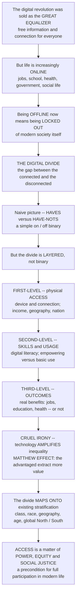

# 📶 Digital Divide and Media Access

> [!abstract] TL;DR
> The digital revolution was supposed to be the **great equalizer** — free information and connection for everyone. But in a world where jobs, education, healthcare, government services, and social life increasingly happen **online**, being on the wrong side of the technology gap means being **locked out of modern society itself**. This is the **digital divide** — the gap between those who have effective access to digital information and communication technologies (**ICTs**) and those who don't. The naive picture is a simple binary of **"haves vs have-nots,"** but scholars quickly found the divide is far deeper and **layered**: a **first-level** divide of physical **access** (device and connection — shaped by income, geography, age, and nation), a **second-level** divide of **skills and usage** (digital literacy — empowering vs merely basic use), and a **third-level** divide of **outcomes** (whether people gain real benefits — jobs, education, health, civic participation). The cruel irony is that digital technology, far from automatically equalizing, tends to **amplify** existing inequalities: the advantaged extract far more value from the same tools — the **Matthew effect** — so the digital divide **maps onto and reinforces** existing divides of class, race, geography, age, gender, and the global **North/South**. Access is now less an on/off switch than a **spectrum** of quality, skill, and benefit — and the stakes keep rising as more of life goes **digital-by-default** (the pandemic made this brutally clear). The digital divide reveals that the media and information society is **not automatically inclusive**: access to communication technology is a matter of **power, equity, and social justice**, and a precondition for full participation in modern life.

---

## Intuition

**Analogy — the town where the roads only go to the well-off neighborhoods.** Imagine a town that builds a wonderful new road network. The town council promises it will connect *everyone* to jobs, schools, clinics, and the market square. But look closer. First, the roads are **paved to the rich hillside suburbs and skip the poor valley and the outlying villages entirely** — some households have a highway at their door, others have a dirt track or nothing (that is the **first-level** gap: physical access). Second, even where a road reaches, **not everyone owns a car or knows how to drive well** — some cruise to opportunities across the region, others can only shuffle to the corner shop (that is the **second-level** gap: skills and use). Third, and cruelest, **the families who already had money, education, and contacts turn the same road into far more** — new businesses, better schools, specialist doctors — while a struggling family uses it mostly to reach the same low-wage work they always had (that is the **third-level** gap: outcomes). The road that was supposed to level the town ends up **widening the gap between the hillside and the valley**, because the advantaged squeeze more value out of exactly the same infrastructure. That is the digital divide.

Now name the shifts precisely rather than waving at "some people have the internet and some don't." The **first and most obvious** layer is **physical access** — do you have a device and a connection, and is it fast and reliable or a shared, throttled, mobile-only trickle? This gap tracks **income, geography** (rural vs urban, region), **age** (the "grey divide"), **education**, **race and ethnicity**, **gender**, **disability**, and above all **nation** — the vast chasm between rich and poor countries (link *global inequality*). But researchers like Jan van Dijk and Eszter Hargittai showed the divide does not close when you hand everyone a connection. A **second layer** opens up: **digital skills and the quality of use**. Among people who are all "online," some use technology in **capital-enhancing**, empowering ways — learning, job-hunting, managing health and finances, participating in civic life — while others are confined to basic consumption and entertainment (link *media literacy*). And beneath that sits a **third layer**: **outcomes**. Do people actually convert their use into tangible **benefits** — a better job, a qualification, a diagnosis, a louder political voice — or not? The returns to the same click are wildly unequal.

The deepest and most counter-intuitive point is that digital technology does **not** automatically equalize — it frequently **amplifies** the inequalities that already exist. The mechanism is the **Matthew effect** ("to those who have, more will be given"): the people with more education, income, skills, and social capital extract disproportionately more benefit from the *same* technology, so the gap between them and everyone else *grows*. This echoes the older **knowledge gap hypothesis** (Tichenor, Donohue & Olien): when information floods into a social system, higher-status groups absorb it faster, so the information gap between rich and poor *widens* rather than closes. The upshot is that the digital divide **maps onto and reinforces existing social stratification** — class, race, geography, age, gender, and the global North/South (link *inequality*, *stratification*). Access has become less a binary on/off than a **spectrum** of quality, skill, and benefit, and the stakes climb every year as more of life becomes **digital-by-default** — a reality made brutally visible when the pandemic sent school "home" and children without home internet simply could not attend (the **"homework gap"**, link *education and social reproduction*). To understand the digital divide is to understand that the media and information society is **not automatically inclusive** — that access to communication technology is a question of **power, equity, and social justice**.

---

## How It Works

The digital divide is best read as a **cascade**: a first-level gap in access filters who is even in the game; a second-level gap in skills filters who among them can use technology effectively; a third-level gap in outcomes filters who actually benefits — and a Matthew effect running through the whole chain means the same technology *widens* the underlying inequality instead of closing it.

1. **Start from the equalizer promise — and its collapse.** The internet was framed as an emancipatory, democratizing force: free information, a level playing field, everyone a publisher. The digital-divide research program is the disciplined refutation of that techno-optimism — it shows that access to ICTs is **unequally distributed and unequally productive**, tracking and compounding existing social divides.
2. **First-level divide — physical access.** Do you have a device and a connection, and of what **quality** (bandwidth, reliability, data allowance, shared vs personal, mobile-only vs fixed broadband)? This gap is structured by **income, geography, age, education, race, gender, disability, and nation**. The **global** divide — stark international gaps in penetration and infrastructure — is the largest single fault line.
3. **Second-level divide — skills and usage.** Among those with access, **digital literacy and competences** diverge sharply, as does the **type and quality of use**: **capital-enhancing** activity that builds economic, educational, and civic advantage versus basic, consumptive, entertainment-only use (van Dijk; Hargittai's "digital inequality").
4. **Third-level divide — outcomes.** The payoff question: does use translate into **tangible benefits** — economic, educational, health, civic? Two people with identical access and similar skills can still reap very different **returns**, because returns depend on the social, economic, and institutional resources they bring.
5. **The Matthew effect / knowledge gap — the amplifier.** Because each level correlates with socioeconomic status, advantages **compound multiplicatively** down the cascade. The already-advantaged extract disproportionately more value from the same technology, so ICTs **reinforce** rather than reduce inequality (link *wealth and income inequality dynamics*).
6. **Mapping onto stratification.** The divide is not a free-standing "tech problem" — it **overlays** existing structures of class, race, geography, age, gender, and global North/South, both a **consequence** of inequality and a **cause** of its persistence (link *social class and stratification*).
7. **Normalization vs stratification — the diffusion debate.** As a technology diffuses, does the gap **close** (normalization — laggards catch up, the divide is temporary) or **persist and shift** to newer/higher-quality technologies (stratification — the divide is a permanent, moving target)? Usually it does both: old gaps narrow while new ones open at the frontier.
8. **Access as spectrum, not binary; and rising stakes.** "Connected" spans everything from a shared, data-capped smartphone to symmetric gigabit fibre plus high skills — **meaningful connectivity**, not a yes/no. And as services go **digital-by-default** (school, work, banking, government, health), exclusion becomes more consequential every year.



---

## Key Concepts

### Secondary — the gap, and why it is not just "having the internet"

- **What it is.** The **digital divide** is the gap between people who can get online and use digital tools well, and people who can't. It matters because more and more of life — school, jobs, doctors, government, friends — happens **online**, so being cut off means being **left out**.
- **It is not just on/off.** The simple idea is **"haves vs have-nots."** But even people who are "online" are not equal: some have a fast home connection and a good laptop, others share one old phone on a tiny data plan. **Access has levels of quality.**
- **Three gaps, not one.**
  1. **Access** — do you have a device and a connection at all?
  2. **Skills** — do you know how to use it well, for useful things, not just games and scrolling?
  3. **Benefit** — do you actually get ahead from it — a better job, better grades, better health?
- **Who is on the wrong side.** People with **less money**, in the **countryside**, who are **older**, less **educated**, or in **poorer countries** are more likely to be shut out.
- **The unfair twist.** Technology was supposed to make things equal. Instead, the people who were **already ahead** often get **even more** out of it — so the gap can grow, not shrink.
- **The "homework gap."** When school moved online during **COVID-19**, kids without home internet or a computer simply **could not do their schoolwork** — a stark, real example of the divide (link *education and social reproduction*).

### Undergraduate — the three levels and the amplification insight

- **First-level divide — access ("haves vs have-nots").** Device ownership, connectivity, and **bandwidth/quality**. Its **social correlates**: **income**, **geography** (rural/urban, region), **age** (the "grey divide"), **education**, **race/ethnicity**, **gender**, **disability**, and **language**. The **global divide** — international gaps in penetration and infrastructure — is the largest fault line, with the **Global South**, the **"next billion,"** and **data/affordability** gaps at its centre (link *global inequality and development*).
- **Second-level divide — skills and usage (Hargittai; van Dijk).** Even with access, people differ in **digital literacy/competences** and in the **type and quality of use**: **capital-enhancing** use (information-seeking, learning, work, finance, civic engagement) vs **entertainment/consumptive** use. Hargittai's studies of "who benefits" showed that skills, not mere access, predict advantageous outcomes — this is **"digital inequality."**
- **Third-level divide — outcomes/returns.** Whether use yields **tangible benefits** — economic, educational, health, civic. Two users with the same access and skills can extract different **returns** because returns depend on wider social and economic resources.
- **The amplification of inequality.** ICTs often **reinforce** rather than reduce inequality via:
  - the **Matthew effect** — "the rich get richer": the advantaged extract more benefit from the same technology (van Dijk);
  - the **knowledge gap hypothesis** (Tichenor, Donohue & Olien, 1970) — as information flows into a system, higher-SES groups acquire it **faster**, so gaps **widen**;
  - **cumulative advantage** — small early edges compound across the access→skills→outcomes cascade (link *wealth and income inequality dynamics*).
- **The normalization vs stratification debate.** **Normalization** (van Dijk's optimists): the divide is a temporary lag that **closes** as technology diffuses to laggards. **Stratification**: the divide **persists** and **relocates** to newer, higher-quality technologies (broadband → mobile → AI), a permanent **moving target**. Empirically, both occur simultaneously.
- **From binary to spectrum.** Access is not yes/no but a **continuum** of quality — the limits of **mobile-only** access (small screens, data caps, weak for production/job-search), and the goal of **"meaningful connectivity"** (regular, high-quality, appropriate-device access), not mere reachability.

### Graduate — theory, consequences, policy, and the frontier

- **Theorizing the divide (van Dijk's resources-and-appropriation model).** Categorical **inequalities** (position and personal categories) produce unequal distribution of **resources** (temporal, material, mental, social, cultural), which shape **access** across four successive types — **motivational, material/physical, skills, and usage** — and access to ICTs in turn **feeds back** into resources and positions, a **self-reinforcing loop**. The divide is thus a *relational* and *structural* phenomenon, not an individual deficit.
- **Norris's three faces of the divide.** Pippa Norris (*Digital Divide*, 2001) distinguished the **global divide** (between nations), the **social divide** (rich/poor within nations), and the **democratic divide** (between those who do and don't use digital tools for civic/political engagement) — foregrounding **information poverty** and civic participation (link *media and democracy / the public sphere*, referenced in prose).
- **Digital inequality as social reproduction.** The divide **maps onto and compounds** class, race, gender, geography, and global stratification, functioning as a mechanism of **reproduction** rather than mobility (link *social class and stratification*, *intersectionality*, *race and racism*, *poverty and life chances*). Ragnedda & Muschert frame it explicitly through Bourdieu-style **capital** — digital access converts into and out of economic, cultural, and social capital.
- **Consequences as life goes digital-by-default.** Exclusion from **employment and the digital economy**; **education** (the homework gap, remote learning, the COVID-19 revelation); **e-government and public services**; **healthcare/telehealth**; **civic and political participation**; and everyday **social connection** — the divide as both **cause and consequence** of inequality, with **rising stakes** as provision becomes online-first (link *digital government and govtech*).
- **Responses and policy — digital inclusion.** **Infrastructure** and **universal-service/broadband** policy; **affordability** and subsidies (e.g. connectivity vouchers); **public access** (libraries, community technology centres); **digital-literacy and skills** programs (link *media literacy*, prose); **community networks**; and the **market-vs-public-provision** debate (link *media ownership and regulation*, prose). The goal is **digital inclusion** — but with a sharp critique of **techno-solutionism**: access alone does not fix structural inequality, and "just add broadband" can mask the second- and third-level gaps that actually determine benefit.
- **The frontier — new and moving divides.** The **AI divide** (access to and literacy in generative-AI tools, link *technology, AI and politics*); **algorithmic and data inequalities** (differential exposure, profiling, and treatment by automated systems); **platform dependence** and walled gardens; the persistent **mobile/smartphone-only** divide; and the ever-receding target of **"meaningful" access** as the technological frontier advances — ensuring the divide is never simply "solved."

---

## Python Demo

```python
# The digital divide, quantified two ways:
#   (a) THE MULTI-LEVEL DIVIDE & THE MATTHEW EFFECT. We stratify a population by
#       socioeconomic status (SES, a 0..1 index of income/education) and run the
#       CASCADE: p(ACCESS) rises with SES (first-level); among those WITH access,
#       p(effective SKILL/use) rises with SES (second-level); and BENEFIT rises with
#       skill & SES (third-level). Cumulative real benefit = access * skill * benefit,
#       so it is FAR more unequal than access alone -- the Matthew effect: the same
#       technology WIDENS the gap because the advantaged extract more value. We plot
#       mean access/skill/benefit by SES decile against an "equal benefit" baseline
#       and print Gini(access) vs Gini(benefit) to show the amplification.
#   (b) DIFFUSION / ADOPTION GAP (normalization vs stratification) + the GLOBAL DIVIDE.
#       Logistic adoption curves for low/mid/high-SES groups (advantaged adopt EARLIER
#       & FASTER -> a persistent gap that peaks then slowly narrows), plus internet
#       penetration vs GDP-per-capita across countries -- the stark North/South gap.
import numpy as np
import matplotlib.pyplot as plt

rng = np.random.default_rng(7)


def gini(x):
    """Gini coefficient of a non-negative array (0 = equal, 1 = maximally unequal)."""
    x = np.sort(np.asarray(x, dtype=float))
    n = x.size
    if x.sum() == 0:
        return 0.0
    cum = np.cumsum(x)
    return (n + 1 - 2 * np.sum(cum) / cum[-1]) / n


def logistic(z):
    return 1.0 / (1.0 + np.exp(-z))


# ---------------------------------------------------------------------------
# (a) THE MULTI-LEVEL DIVIDE & MATTHEW EFFECT
# ---------------------------------------------------------------------------
N = 20000
ses = np.clip(rng.beta(2.0, 2.0, N), 0.001, 0.999)      # SES index in (0,1)

# First level: probability of ACCESS rises steeply with SES
p_access = logistic(6.0 * (ses - 0.45))
has_access = rng.random(N) < p_access

# Second level: GIVEN access, probability of effective SKILL/use rises with SES
p_skill = logistic(5.0 * (ses - 0.55))
has_skill = has_access & (rng.random(N) < p_skill)

# Third level: BENEFIT (returns) rises with skill AND SES (resources to convert use)
benefit = has_skill * (0.25 + 0.75 * ses)               # 0 if no access/skill

# Bin by SES decile
deciles = np.clip((ses * 10).astype(int), 0, 9)
xd = np.arange(10)
acc_by = np.array([has_access[deciles == d].mean() for d in xd])
skl_by = np.array([has_skill[deciles == d].mean() for d in xd])
ben_by = np.array([benefit[deciles == d].mean() for d in xd])
equal_baseline = np.full(10, benefit.mean())            # "if benefit were equal"

fig, ax = plt.subplots(2, 2, figsize=(13.5, 9.5))

w = 0.27
ax[0, 0].bar(xd - w, acc_by, w, color="#60a5fa", label="1st level: ACCESS")
ax[0, 0].bar(xd, skl_by, w, color="#f59e0b", label="2nd level: SKILL / use")
ax[0, 0].bar(xd + w, ben_by, w, color="#dc2626", label="3rd level: BENEFIT")
ax[0, 0].set_xlabel("SES decile (0 = poorest, 9 = richest)")
ax[0, 0].set_ylabel("mean probability / benefit")
ax[0, 0].set_title("The multi-level cascade\naccess -> skill -> benefit, each steeper than the last")
ax[0, 0].legend(fontsize=8, loc="upper left")
ax[0, 0].grid(True, axis="y", alpha=0.3)

ax[0, 1].bar(xd, ben_by, color="#dc2626", alpha=0.85, label="Actual benefit by SES")
ax[0, 1].plot(xd, equal_baseline, "k--", lw=2, label="Equal-benefit baseline")
g_acc, g_ben = gini(p_access), gini(benefit + 1e-9)
ax[0, 1].set_xlabel("SES decile (0 = poorest, 9 = richest)")
ax[0, 1].set_ylabel("mean real benefit gained")
ax[0, 1].set_title(f"MATTHEW EFFECT: benefit far more unequal than access\n"
                   f"Gini(access) = {g_acc:.2f}   ->   Gini(benefit) = {g_ben:.2f}")
ax[0, 1].legend(fontsize=8, loc="upper left")
ax[0, 1].grid(True, axis="y", alpha=0.3)

# ---------------------------------------------------------------------------
# (b1) DIFFUSION / ADOPTION GAP -- normalization vs stratification
# ---------------------------------------------------------------------------
t = np.linspace(0, 30, 200)                              # years
# High-SES: earlier midpoint, faster rate; Low-SES: later, slower, lower ceiling
adopt_high = 0.98 * logistic(0.55 * (t - 8))
adopt_mid = 0.92 * logistic(0.45 * (t - 14))
adopt_low = 0.80 * logistic(0.38 * (t - 20))
gap = adopt_high - adopt_low                             # the divide over time

ax[1, 0].plot(t, adopt_high, color="#059669", lw=2.2, label="High SES")
ax[1, 0].plot(t, adopt_mid, color="#f59e0b", lw=2.2, label="Mid SES")
ax[1, 0].plot(t, adopt_low, color="#dc2626", lw=2.2, label="Low SES")
ax[1, 0].fill_between(t, adopt_low, adopt_high, color="#94a3b8", alpha=0.25,
                      label="the DIVIDE (high - low)")
ax[1, 0].plot(t, gap, "k:", lw=1.6, label="gap width")
ax[1, 0].set_xlabel("years since technology introduced")
ax[1, 0].set_ylabel("adoption fraction of group")
ax[1, 0].set_title("Adoption gap: advantaged adopt earlier & faster\n"
                   "gap peaks, then slowly narrows -- normalization vs stratification")
ax[1, 0].legend(fontsize=7.5, loc="center right")
ax[1, 0].grid(True, alpha=0.3)

# ---------------------------------------------------------------------------
# (b2) THE GLOBAL DIVIDE -- internet penetration vs GDP per capita
# ---------------------------------------------------------------------------
n_countries = 160
gdp = np.exp(rng.normal(9.2, 1.1, n_countries))          # GDP/capita, log-normal
log_gdp = np.log(gdp)
# Penetration saturates with income (logistic in log-GDP) + heterogeneity
pen = np.clip(100.0 * logistic(1.6 * (log_gdp - 8.7))
              + rng.normal(0, 8, n_countries), 1, 99)
sc = ax[1, 1].scatter(gdp, pen, c=pen, cmap="viridis", s=32,
                      edgecolor="k", linewidth=0.3)
order = np.argsort(gdp)
trend = 100.0 * logistic(1.6 * (log_gdp - 8.7))
ax[1, 1].plot(gdp[order], trend[order], "r-", lw=2, label="saturating trend")
ax[1, 1].set_xscale("log")
ax[1, 1].set_xlabel("GDP per capita (log scale, USD)")
ax[1, 1].set_ylabel("internet penetration, percent of population")
ax[1, 1].set_title("The GLOBAL divide\npenetration rises with income -> stark North / South gap")
ax[1, 1].legend(fontsize=8, loc="lower right")
ax[1, 1].grid(True, which="both", alpha=0.3)
fig.colorbar(sc, ax=ax[1, 1], label="penetration percent")

fig.suptitle("The Digital Divide: multi-level cascade & Matthew effect  |  adoption gap & the global divide",
             fontsize=13.5, weight="bold")
fig.tight_layout()
plt.show()

# ---- Console summary: the amplification down the cascade --------------------
print("=== Multi-level divide (poorest vs richest decile) ===")
print(f"ACCESS  : {acc_by[0]:.2f}  ->  {acc_by[-1]:.2f}   "
      f"(richest / poorest = {acc_by[-1] / max(acc_by[0], 1e-6):5.1f}x)")
print(f"SKILL   : {skl_by[0]:.2f}  ->  {skl_by[-1]:.2f}   "
      f"(richest / poorest = {skl_by[-1] / max(skl_by[0], 1e-6):5.1f}x)")
print(f"BENEFIT : {ben_by[0]:.2f}  ->  {ben_by[-1]:.2f}   "
      f"(richest / poorest = {ben_by[-1] / max(ben_by[0], 1e-6):5.1f}x)")
print(f"\nInequality AMPLIFIES down the cascade: Gini(access)={g_acc:.2f} -> Gini(benefit)={g_ben:.2f}")
print(f"Adoption gap (high - low): peaks at {gap.max():.2f} around year {t[gap.argmax()]:.0f}, "
      f"still {gap[-1]:.2f} at year 30")
```

**What the demo shows.** Panel **(a-left)** runs the three-level **cascade** on a population sorted by socioeconomic status: the **access** bars rise with SES, the **skill** bars rise *more* steeply (only some of those with access use it effectively), and the **benefit** bars rise steepest of all — each filter multiplies the previous one. Panel **(a-right)** makes the **Matthew effect** quantitative: real benefit is dramatically more unequal than access alone, and the printed **Gini jumps from access to benefit** — the *same* technology *amplifies* the underlying inequality rather than dissolving it. Panel **(b-left)** models **diffusion**: higher-SES groups adopt **earlier and faster** and reach a higher ceiling, so the divide (the shaded gap) **peaks and only slowly narrows** — the live "normalization vs stratification" debate, and exactly the dynamic studied in *diffusion of innovations* (link). Panel **(b-right)** plots the **global divide** — internet penetration as a saturating function of GDP per capita — showing the stark **North/South** gap and its slow, uneven closing (link *development economics*, *global inequality*). The numbers here are illustrative, but the *shapes* — multiplicative cascade, Gini amplification, S-curve gaps, income-saturating penetration — mirror the empirical literature.

---

## Real-World Applications

- **The COVID-19 "homework gap."** When schooling went remote in 2020, millions of students without home broadband or a personal device fell behind — some completing assignments in fast-food parking lots for the Wi-Fi. The pandemic converted an abstract "divide" into a visible, measurable **learning loss** concentrated among low-income, rural, and minority children — the third-level outcome gap in real time (link *education and social reproduction*).
- **Mobile-only and "meaningful connectivity."** In much of the Global South (and among low-income users everywhere), the first mode of access is a **shared, data-capped smartphone**. It is enough to consume, message, and use social media, but weak for the **capital-enhancing** uses — job applications, coursework, form-filling, content production — that produce economic returns. This is why bodies like the ITU and A4AI push **"meaningful connectivity"** metrics rather than raw "are you online" counts.
- **E-government "digital-by-default."** As tax, benefits, immigration, and health systems move online-first (the UK's "digital by default," India's Aadhaar-linked services), citizens who cannot navigate portals are effectively **denied services they are entitled to** — turning an access gap into an entitlement gap and forcing costly "assisted digital" backstops (link *digital government and govtech*).
- **Telehealth and the health divide.** Video consultations and patient portals expanded access for the connected and skilled, but risked **leaving behind** exactly the elderly, poor, and rural patients with the greatest health needs and the least connectivity — the divide compounding existing **health inequalities**.
- **Public libraries and community tech centres.** For decades the library has been the frontline **digital-inclusion** institution — free access, Wi-Fi, devices, and one-on-one skills help — a concrete instance of **public provision** closing the first- and second-level gaps where the market will not.
- **The emerging AI divide.** Access to and fluency with generative-AI tools is becoming the newest stratifier: those with the skills, paid subscriptions, and organizational context to wield AI extract large productivity gains, while others do not — the Matthew effect relocating to the technological frontier (link *technology, AI and politics*).

---

## Common Pitfalls

- **Treating the divide as binary ("connected vs not").** The single most common error. Two "online" households can be worlds apart in bandwidth, device quality, skills, and benefit. Measuring only *whether* someone is online hides the second- and third-level gaps that actually determine outcomes — always ask about **quality, skill, and returns**, not just access.
- **Techno-solutionism — "just add broadband."** Assuming that supplying infrastructure or devices automatically closes the divide. Access is **necessary but not sufficient**: without digital literacy, relevant content, and the wider resources to convert use into benefit, connection alone can leave the outcome gap untouched or even widen it.
- **Ignoring the Matthew effect / knowledge gap.** Naively expecting new technology to *equalize* by default. The disciplined prior is the opposite: absent deliberate intervention, ICTs tend to **amplify** existing inequality because the advantaged extract more value — so "digital = democratizing" must be argued for, never assumed.
- **Assuming the divide will simply "close" over time (naive normalization).** Some first-level gaps do narrow as tech diffuses — but the divide **relocates** to newer, higher-quality technologies (broadband → mobile → fibre → AI). It is a **moving target**, not a vanishing one; declaring victory when penetration hits 90 percent misses the stratification at the frontier.
- **Conflating the global and social divides.** The **between-nation** gap (infrastructure, affordability, North/South) and the **within-nation** gap (class, race, geography, age) have different drivers and different remedies. Collapsing them produces policy that fits neither (link *global inequality and development*).
- **Deficit framing — blaming individuals.** Treating non-use as personal failure ("they just don't want it" / "they lack skills") individualizes a **structural** problem rooted in income, geography, and institutional design. Van Dijk's model insists the divide is **relational and structural**, feeding back into the very inequalities that produce it.

---

## Related Concepts

**Cross-vault (Glob-verified):**

- [[Social_Class_and_Stratification]] — the class structure the digital divide **maps onto and reinforces**; digital inequality as a modern axis of stratification.
- [[Global_Inequality_and_Development]] — the **global divide**: stark between-nation gaps in penetration and infrastructure, the Global South and the "next billion."
- [[Poverty_Social_Mobility_and_Life_Chances]] — the divide as a mechanism shaping **life chances**; cumulative disadvantage across the access→skills→outcomes cascade.
- [[Intersectionality]] — the divide runs along **overlapping** axes at once — income, race, gender, age, disability, geography — not one variable in isolation.
- [[Race_Ethnicity_and_Racism]] — the racial/ethnic dimension of access, skills, and algorithmic treatment; the divide as racialized inequality.
- [[Education_and_Social_Reproduction]] — the **"homework gap"** and remote learning: how the divide reproduces educational advantage across generations.
- [[Digital_Society_and_Online_Communities]] — the broader sociology of digital life within which unequal access and participation are situated.
- [[Digital_Government_and_Govtech]] — **digital-by-default** public services and the exclusion risk when e-government assumes connectivity and skills.
- [[Diffusion_of_Innovations_and_Adoption_Dynamics]] — the S-curve **adoption** model behind the normalization-vs-stratification debate; who adopts earlier and faster.
- [[Wealth_and_Income_Inequality_Dynamics]] — the **Matthew effect** / cumulative advantage: the general dynamics by which small early edges compound into large gaps.
- [[Development_Economics]] — the economics of the global divide; ICTs, GDP per capita, and the debate over technology and catch-up growth.
- [[Globalization_and_Its_Discontents]] — the divide as a fault line of a globalized information economy and its uneven distribution of benefits.
- [[Technology_AI_and_Politics]] — the **AI divide** and algorithmic inequalities as the moving frontier of digital exclusion.

**Within this vault (siblings, referenced in prose):** this note is the **equity conscience** of the digital-media section. It qualifies *The Digital Revolution and New Media* (why "everyone can publish" is a potential, not an equally distributed reality), tempers the participatory optimism of *Social Media and Networked Communication*, is the flip side of *Media Literacy and Critical Consumption* (skills as the second-level divide), extends the North/South argument of *Global Media and Cultural Imperialism*, undercuts the "digital public sphere" ideal of *Media and Democracy — the Public Sphere* (Norris's democratic divide), and connects to the market-vs-public-provision debate in *Media Ownership and Regulation*.

---

## Review Questions

**Tier 1 — Conceptual (explain to a peer):**
1. Explain why the digital divide is described as **layered** rather than a simple binary of "haves vs have-nots." Name the three levels and give a one-line example of each.
2. In plain terms, what is the **Matthew effect** as applied to digital technology, and why does it mean the divide can *widen* even as more people get online?

**Tier 2 — Applied (analyze / reason):**
3. A city gives every low-income student a laptop and a mobile hotspot, then declares the homework gap "solved." Using the **three levels** and the idea of **meaningful connectivity**, explain what this intervention does and does not address, and what you would measure to check whether it actually closed the gap.
4. Using the demo's cascade (access → skill → benefit) and the normalization-vs-stratification idea, explain why a country reaching 90 percent internet penetration might still have a *worsening* digital divide. What has moved, and to where?

**Tier 3 — Theoretical (deep understanding):**
5. Van Dijk argues the digital divide is **relational and structural**, feeding back into the inequalities that produce it. Reconstruct this feedback loop, contrast it with a **deficit** (individual-blame) framing, and explain which framing better predicts policy that would actually reduce the divide.
6. "The internet is the great equalizer." Using the **knowledge gap hypothesis**, the **Matthew effect**, and the distinction between the **global** and **social** divides, build the strongest possible case *against* this claim — then state the narrow, defensible sense in which digital technology *can* be equalizing, and what it takes to get there.

---

## Sources

- van Dijk, J. A. G. M. (2020). *The Digital Divide.* Polity Press. (the resources-and-appropriation model; four types of access; normalization vs stratification; the Matthew effect)
- Hargettai, E. (2002/2008). "Second-Level Digital Divide: Differences in People's Online Skills" (*First Monday*) and "The Digital Reproduction of Inequality" (in *Social Stratification*, ed. Grusin). (skills and usage as the second-level divide; digital inequality)
- Norris, P. (2001). *Digital Divide: Civic Engagement, Information Poverty, and the Internet Worldwide.* Cambridge University Press. (the global, social, and democratic divides; information poverty)
- Ragnedda, M., & Muschert, G. W. (eds.) (2013). *The Digital Divide: The Internet and Social Inequality in International Perspective.* Routledge. (the divide through the lens of capital and social stratification; the third-level/outcomes divide)
- Tichenor, P. J., Donohue, G. A., & Olien, C. N. (1970). "Mass Media Flow and Differential Growth in Knowledge." *Public Opinion Quarterly*, 34(2), 159–170. (the foundational knowledge gap hypothesis)

---

#media-studies #digital-divide #digital-inequality #media-access #digital-literacy
