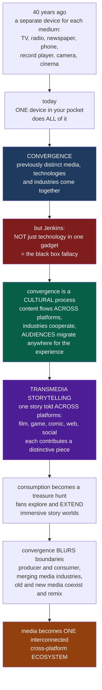

# 🔀 Media Convergence and Transmedia

> [!abstract] TL;DR
> Forty years ago each medium had its **own device, industry, and place** — a TV in the living room, a radio in the car, a newspaper on the table, a phone on the wall, a record player, a cinema. Today **one glowing rectangle in your pocket does all of it**. That coming-together of previously distinct media, technologies, and industries is **convergence**. But Henry Jenkins made the decisive move: convergence is **not** just technology cramming everything into one gadget — it is a **cultural and social process** defined by the *flow of content across multiple platforms*, the *cooperation between media industries*, and the *migratory behaviour of audiences* who will go almost anywhere for the experiences they want. It "occurs in the brains of individual consumers and through their social interactions." Its storytelling counterpart is **transmedia storytelling**: a single story world told **across** platforms — film, game, comic, web series, ARG, social feeds — where each medium contributes a *distinctive, additive* piece, turning consumption into a treasure hunt and building immersive worlds fans explore and extend. Convergence dissolves old boundaries everywhere: producer versus consumer, industry versus industry, and "old" versus "new" media, which **coexist and remix** rather than one simply replacing the other.

---

## Intuition

**Analogy:** Picture a living room in 1985. To *consume media* you walked between separate machines, each locked to one job and one industry: the **television** for moving pictures, the **radio** for sound, the **record player** for music, the **telephone bolted to the wall** for talking, the **newspaper** on the table for news, the **camera** for photos, and the **cinema** across town for films. Seven appliances, seven businesses, seven places. Now empty your pocket. **One device** watches the movies, streams the music, reads the news, makes the calls, shoots the photos, plays the games, and carries the whole cinema in your hand. The seven machines have *converged* into one. That collapse — the coming-together of previously distinct media, technologies, and industries into unified digital systems — is what "media convergence" names.

But here is the twist that makes convergence a *media-studies* idea rather than a gadget review. Henry Jenkins argued that if you think convergence is finished once everything fits inside one black box, you have missed the point entirely — he called that the **"black box fallacy."** Convergence is fundamentally a **cultural and social process**, not a technological endpoint. It is the *flow of content* across many platforms (the same story lives in a film, a game, a comic, and a hashtag); it is the *cooperation and merging of industries* (tech, telecom, and media companies fusing); and above all it is the *migratory behaviour of audiences* who chase an experience wherever it leads. Convergence "occurs in the brains of individual consumers and through their social interactions" — a friend who explains a plot twist you missed is *doing convergence*. From this flows **transmedia storytelling**: a single expansive **story world** unfolds *across* platforms, each contributing a distinctive, non-redundant piece, so the full experience requires — and rewards — hopping between them. Think of the huge franchise universes — the MCU, Star Wars, The Matrix — that spread across films, series, games, and comics: the movie shows you one corner, the game lets you *live* another, the comic fills the gap between, and the social accounts speak in-character. Consumption becomes an active **treasure hunt**, and fans do not just explore these worlds — they *extend* them. Convergence also blurs every old line at once: between **producers and consumers** (the "prosumer"), between **media industries** as they merge, between **content types**, and between **old and new media**, which do not replace one another but **coexist and remix**. Media today is less a set of separate channels than a single, interconnected, **cross-platform ecosystem**.

---

## How It Works

Jenkins's *Convergence Culture* (2006) and the transmedia tradition build the concept in a chain that runs from the device in your hand to the story world in your head:

1. **The technological layer — but only the surface.** **Digitization** turns text, audio, image, and video into the *same* stuff (bits), so a single device and network can carry all of them. The **smartphone is the convergence device**; the internet is the convergence network. This is *technological convergence*. Crucially, Jenkins insists this is the *enabler*, not the essence — the **black box fallacy** is believing convergence is complete once all media flow through one appliance.
2. **The industrial layer.** As media go digital, the **industries merge**: film, TV, telecom, publishing, gaming, and Big Tech cross-own and integrate into conglomerates that pursue **synergy** — exploiting one property across every division and platform. This *economic convergence* (conglomeration, cross-ownership, franchising) is the corporate engine (see the political economy of media).
3. **The cultural layer — Jenkins's key intervention.** Convergence is a **process** with three moving parts: the **flow of content** across multiple media platforms; the **cooperation** among multiple media industries; and the **migratory behaviour of audiences** who go almost anywhere in search of the experiences they want. It plays out as an **interplay of top-down corporate power and bottom-up grassroots participation** — companies pushing content across platforms *and* fans pulling, remixing, and circulating it.
4. **The blurring of boundaries.** Convergence dissolves the **producer/consumer** divide (the *prosumer*, participatory culture), the lines **between industries and platforms**, the borders **between genres and content types**, and the opposition **between "old" and "new" media**. Bolter and Grusin's **remediation** names the last one precisely: new media *refashion* older media (a website mimics a newspaper; a video game borrows cinema's language) and old media *adapt* to survive — so the "digital revolution" is **coexistence and remix, not simple replacement**.
5. **Transmedia storytelling — the narrative form of convergence.** A single **story world** unfolds across platforms, and *each medium makes a distinctive and valuable contribution* — not adaptation or repetition, but **additive, complementary** content. Jenkins's **seven principles** organize the craft: **spreadability vs drillability** (content that circulates widely vs depths for the obsessed), **continuity vs multiplicity** (one coherent canon vs alternate versions), **worldbuilding**, **seriality**, **subjectivity** (many characters' viewpoints), and **performance** (audiences activating the world). The payoff is **additive comprehension**: each platform you visit adds understanding no single platform holds, and the immersive world invites fans to **explore and extend** it (fandom).
6. **The migratory, engaged audience.** Because meaning is distributed, the audience becomes **multi-platform, active, and collaborative** — pooling knowledge as Pierre Lévy's **collective intelligence** to map worlds too big for any one viewer. Convergence therefore raises the demands of **media literacy** and stages an enduring tension between **corporate control** of story worlds and **fan co-creation** of them.

### Flow / Architecture



---

## Key Concepts

### Secondary (intuitive)
- **Convergence:** all the things that used to need separate machines — TV, radio, phone, camera, music, games, newspaper — now live inside **one device**.
- **Not just the gadget:** convergence is also about the same *story or content* showing up in many places, and about *you* moving between them to get the whole experience.
- **Transmedia storytelling:** telling **one big story across many media** — the movie, the game, the comic, the web series each show a *different piece*, so you have to hop between them to get the full picture.
- **Old and new together:** newspapers, TV, and radio did not die — they moved online and mixed with new media rather than being replaced.

### Undergraduate (mechanistic)
- **Technological vs industrial convergence:** *technological* = digitization letting all media share one device/network (the smartphone); *industrial/economic* = media, telecom, and tech companies **merging and cross-owning** to chase synergy. Distinguish both from **divergence** — the *proliferation* of specialized devices (the same content on phone, laptop, TV, watch).
- **Jenkins's three-part definition:** convergence = the **flow of content** across platforms + the **cooperation** of industries + the **migratory** audience. It is a *process* "in the brains of consumers," an interplay of **top-down** corporate and **bottom-up** grassroots forces.
- **Remediation (Bolter and Grusin):** new media **refashion** old media and old media adapt in return; convergence is **coexistence and remix**, not the "digital revolution" myth of clean replacement. Twin logics: **immediacy** (erasing the medium) and **hypermediacy** (foregrounding many media at once).
- **Transmedia principles (Jenkins):** **spreadability vs drillability**, **continuity vs multiplicity**, **worldbuilding**, **seriality**, **subjectivity**, **performance** — the design grammar distinguishing true transmedia from mere licensing.
- **Additive comprehension and the story world:** each platform adds *unique, non-redundant* understanding; the sum is an immersive **world** larger than any single text — the basis for franchise **worldbuilding**.

### Graduate (critical / theoretical)
- **The black box fallacy critiqued:** technological determinism reads convergence as an inevitable convergence *of devices*; Jenkins relocates it to *culture and practice*, where the relevant unit is **content flow and audience behaviour**, not hardware.
- **Corporate vs grassroots convergence:** convergence is a **contested** interplay — studios push properties across platforms and try to *control* fan worlds, while fans **pull, poach, and extend** them (spreadability, "if it doesn't spread, it's dead"). The result is neither pure empowerment nor pure co-optation but a negotiated field (link participatory culture, free labor).
- **Political economy of synergy:** franchise and **IP-driven worldbuilding**, conglomeration, and cross-media exploitation are *economic* strategies; transmedia can be genuine artistry *or* a marketing skin over the same product sold seven times. The critique connects to media industries and the political economy of communication.
- **Convergence in institutions:** **newsroom / convergence journalism** (one story produced for print, broadcast, web, social), **multi-platform and second-screen** viewing, and the **streaming/OTT** reconfiguration of distribution — the industrial face of the concept.
- **The frontier:** **platform convergence** and the "everything app," **AI-generated and personalized transmedia**, and **immersive AR/VR and the "metaverse"** as convergence's proposed next stage — reopening the enduring question of what convergence means for creativity, industry power, and audience experience.

---

## Python Demo

```python
# Media convergence & transmedia, quantified two ways, in numpy + matplotlib:
#
#  (a) DEVICE / MEDIA CONVERGENCE OVER TIME (many -> one):
#      Forty years ago each media FUNCTION lived on its own single-purpose
#      DEVICE. After the smartphone (~2007) each function is progressively
#      ABSORBED onto ONE converged device. We model each function's migration
#      as a logistic adoption curve and watch the number of separate devices
#      COLLAPSE toward one -- convergence made quantitative.
#
#  (b) TRANSMEDIA ADDITIVE COMPREHENSION + MIGRATORY AUDIENCE (one -> many):
#      A story WORLD holds S fragments spread across P platforms. In TRANSMEDIA
#      each platform carries UNIQUE, complementary fragments, so comprehension
#      GROWS as you visit more platforms; in mere ADAPTATION every platform
#      retells the SAME core story, so comprehension SATURATES at once. We also
#      simulate the MIGRATORY audience as a random walk across a platform
#      network and show that hopping uncovers far more of the world.

import numpy as np
import matplotlib.pyplot as plt

rng = np.random.default_rng(7)

# ---- (a) DEVICE CONVERGENCE OVER TIME ---------------------------------------
years = np.arange(1980, 2026)
functions = ["Telephone", "Camera", "Music player", "TV / video",
             "Radio", "Game console", "News / maps"]
midpoints = np.array([2009, 2011, 2010, 2014, 2013, 2015, 2012], float)  # 50%-absorbed year
steepness = 0.9
# fraction of each function absorbed onto the single converged device
absorbed = 1.0 / (1.0 + np.exp(-steepness * (years[None, :] - midpoints[:, None])))
# a function still needs its OWN device to the extent it is NOT absorbed
separate_devices = (1.0 - absorbed).sum(axis=0)              # ~7 early -> ~0 late
has_converged = (absorbed.sum(axis=0) > 0.05).astype(float)  # is there a smartphone yet
total_devices = separate_devices + has_converged             # ~7 -> ~1 : many-to-one

# ---- (b) TRANSMEDIA COMPREHENSION vs ADAPTATION -----------------------------
P = 7                       # platforms: film, series, game, comic, web, ARG, social
S = 100.0                   # total story-world fragments
plat = np.arange(1, P + 1)
transmedia = S * plat / P                                   # unique, additive -> full world
adaptation = S * (0.55 + 0.10 * (1 - np.exp(-0.9 * (plat - 1))))  # redundant -> saturates

# ---- (b cont.) MIGRATORY AUDIENCE as a random walk over platforms -----------
block = S / P               # each platform owns a unique block of the world
steps, walkers = 40, 5000
Aff = rng.uniform(0.2, 1.0, (P, P)); Aff = (Aff + Aff.T) / 2   # symmetric affinities
np.fill_diagonal(Aff, 0.6)                                     # some chance of staying
Tmat = Aff / Aff.sum(axis=1, keepdims=True)                   # row-stochastic transitions

pos = rng.integers(0, P, walkers)
seen = np.zeros((walkers, P), dtype=bool)
seen[np.arange(walkers), pos] = True
disc_migrate = np.zeros(steps)
for s in range(steps):
    disc_migrate[s] = seen.sum(axis=1).mean() * block         # mean world uncovered
    r = rng.random(walkers)
    cdf = np.cumsum(Tmat[pos], axis=1)
    pos = (r[:, None] < cdf).argmax(axis=1)                    # migrate to next platform
    seen[np.arange(walkers), pos] = True
disc_stay = np.full(steps, block)                             # single-platform audience

# ---- PLOTS ------------------------------------------------------------------
fig, ax = plt.subplots(2, 2, figsize=(13, 9))
fig.suptitle("Media Convergence and Transmedia: many devices -> one platform, "
             "one story -> many platforms", fontsize=13, fontweight="bold")

# (a1) separate devices collapsing to one
ax[0, 0].plot(years, total_devices, color="#1e3a5f", lw=2.5)
ax[0, 0].axvline(2007, ls="--", color="gray", alpha=0.7)
ax[0, 0].text(2007.5, total_devices.max() * 0.9, "smartphone", color="gray")
ax[0, 0].set_title("(a) Convergence: separate devices collapse toward ONE")
ax[0, 0].set_xlabel("year")
ax[0, 0].set_ylabel("separate devices a person uses")

# (a2) functions absorbed onto the single converged device
ax[0, 1].stackplot(years, absorbed, labels=functions, alpha=0.85)
ax[0, 1].set_title("Functions absorbed onto ONE converged device")
ax[0, 1].set_xlabel("year")
ax[0, 1].set_ylabel("functions on the smartphone")
ax[0, 1].legend(loc="upper left", fontsize=7, ncol=2)

# (b1) additive comprehension vs redundant adaptation
ax[1, 0].plot(plat, transmedia, "-o", color="#8e44ad", lw=2,
              label="transmedia (unique, additive)")
ax[1, 0].plot(plat, adaptation, "-s", color="#c0392b", lw=2,
              label="adaptation (redundant, saturating)")
ax[1, 0].set_title("(b) Transmedia rewards multi-platform engagement")
ax[1, 0].set_xlabel("platforms visited")
ax[1, 0].set_ylabel("story-world comprehension")
ax[1, 0].legend(loc="center right")

# (b2) migratory audience uncovers more of the world by hopping
ax[1, 1].plot(np.arange(steps), disc_migrate, color="#16a085", lw=2.5,
              label="migrating audience")
ax[1, 1].plot(np.arange(steps), disc_stay, color="#7f8c8d", lw=2.5, ls="--",
              label="single-platform audience")
ax[1, 1].set_title("Migratory audience flow across platforms")
ax[1, 1].set_xlabel("hops across the platform network")
ax[1, 1].set_ylabel("mean story-world uncovered")
ax[1, 1].legend(loc="lower right")

plt.tight_layout(rect=[0, 0, 1, 0.96])
plt.show()

# ---- SUMMARY ----------------------------------------------------------------
print(f"Separate devices in 1985: {total_devices[years == 1985][0]:.1f}")
print(f"Separate devices in 2022: {total_devices[years == 2022][0]:.1f}")
print(f"Comprehension at 1 platform   -> transmedia {transmedia[0]:.0f}, adaptation {adaptation[0]:.0f}")
print(f"Comprehension at {P} platforms -> transmedia {transmedia[-1]:.0f}, adaptation {adaptation[-1]:.0f}")
print(f"World uncovered by a MIGRATING audience after {steps} hops: {disc_migrate[-1]:.0f} of {S:.0f}")
print(f"World uncovered by STAYING on one platform: {disc_stay[-1]:.0f} of {S:.0f}")
```

Panel **(a)** makes the *many-to-one* logic of convergence concrete: as each media function is absorbed onto the smartphone (logistic curves in the stacked plot), the number of separate single-purpose devices a person carries collapses from roughly seven toward one — the coming-together, plotted. Panel **(b)** makes the *one-to-many* logic of transmedia concrete: when platforms carry **unique, additive** content, comprehension *grows* the more platforms you visit (transmedia), whereas mere **adaptation** — retelling the same story everywhere — **saturates immediately**, so extra platforms add nothing. The bottom-right panel closes the loop with the **migratory audience**: modeling viewers as a random walk across a platform network, those who *hop* uncover far more of the story world than those who stay put — which is exactly why transmedia designs *reward* the audience Jenkins says "will go almost anywhere."

---

## Real-World Applications

- **The Marvel Cinematic Universe and Star Wars.** The canonical convergence-era franchises: a single continuity spread across **films, streaming series, video games, comics, and animated shorts**, each contributing distinctive story world material (a Disney+ series backfills a film character; a game lets you *inhabit* a corner the movies only mention). Owned by conglomerates pursuing synergy, they are transmedia worldbuilding *and* political economy in one object.
- **The Matrix (Jenkins's textbook case).** The Wachowskis distributed the story across the **films, the *Animatrix* shorts, the *Enter the Matrix* game, and comics** — plot points introduced in one medium paid off in another, so "additive comprehension" was structural, not optional. Jenkins used it to define transmedia storytelling.
- **Alternate reality games (ARGs).** *The Beast* (promoting *A.I.*, 2001) and Halo's *I Love Bees* (2004) spread a fiction across **websites, phone calls, emails, and real-world events**, requiring a distributed audience to pool **collective intelligence** to solve it — convergence as an active treasure hunt with no single "screen."
- **Pokemon and franchise worldbuilding.** Jenkins's example of a world engineered *for* transmedia: **games, anime, trading cards, films, and merchandise** each present a different slice of the same universe, and mastery means engaging several — a template later industrialized across children's and blockbuster media.
- **Convergence journalism and the newsroom.** Modern outlets produce one story **for print, broadcast, web, podcast, and social** simultaneously, with **second-screen** and live-blog experiences — the industrial, everyday face of convergence far from any blockbuster.
- **The smartphone and streaming/OTT reconfiguration.** The device that literally absorbed the camera, radio, TV, console, and newspaper; the OTT platforms (Netflix, Disney+) that fused production and distribution and normalized cross-device, multi-platform viewing — convergence you use hourly.

---

## Common Pitfalls

- **The black box fallacy** — Assuming convergence is *finished* once all media flow through one device. Jenkins's whole point is that convergence is a **cultural process** — content flow, industry cooperation, audience migration — not a hardware endpoint. The gadget is the enabler, not the phenomenon.
- **Confusing transmedia with adaptation or licensing** — Novelizing a film, or slapping a franchise logo on a game that retells the same plot, is **redundant**, not transmedia. True transmedia is **additive**: each platform contributes something *distinctive and valuable* (the demo's saturating-adaptation curve is the failure mode).
- **The replacement myth** — Believing "new media killed old media." **Remediation** shows old and new media **coexist and refashion each other**; newspapers became websites, radio became podcasts, cinema's grammar shapes games. Convergence is remix, not extinction.
- **Reading convergence as purely top-down (or purely bottom-up)** — It is *both*: corporations pushing content across platforms **and** fans pulling, poaching, and extending. Crediting only the studios erases participatory culture; crediting only fans erases political-economic power. The concept lives in the tension.
- **Assuming audiences will actually migrate everywhere** — Transmedia *rewards* multi-platform engagement, but real participation is **uneven** — most audiences stay on one or two platforms, and demanding cross-platform hunting can gatekeep casual viewers. Designing "additive" worlds that punish the non-obsessive is a real failure mode.
- **Technological determinism** — Treating digitization as an autonomous force that *causes* social change. Convergence is shaped by industry strategy, regulation, ownership, and audience practice as much as by bits — the "convergence device" does not determine the convergence culture.

---

## Related Concepts

- [[Media_Culture_and_Cultural_Industries]] — The sociology-of-media companion: cultural industries, conglomeration, and platform capitalism supply the institutional and political-economic context in which convergence and franchise synergy operate.
- [[Narrative_Structure_and_Storytelling]] — Transmedia is *storytelling* distributed across media; the narratology of plot, world, and seriality is the craft foundation that transmedia stretches beyond a single text.
- [[Structuralism_and_Narratology]] — The story/discourse distinction and the analysis of narrative worlds underpin the idea of a **story world** that can be told across many platforms without repeating itself.
- [[Contagion_and_Diffusion_in_Social_Networks]] — The mechanics of the migratory, spreading audience modeled in the demo: how content and fans propagate peer-to-peer across a platform network ("spreadability").
- [[Online_Social_Networks_and_Platforms]] — The platform architectures whose affordances enable content flow, second-screen participation, and the cross-platform ecosystem convergence produces.
- [[Digital_Art_and_New_Media]] — The new-media-art counterpart: interactivity, remediation, and immersive/AR-VR forms that overlap with convergence's aesthetic frontier.

Within this vault, this note is the cross-platform hub whose **prose-referenced siblings** (present or to be created) develop adjacent threads: **The_Digital_Revolution_and_New_Media** (the digitization and "new media" foundations convergence rides on), **Social_Media_and_Networked_Communication** (the networked infrastructure that carries content flow and audience migration), **Fandom_and_Participatory_Culture** (the grassroots co-creation and spreadability that make convergence *cultural*), **Media_Audiences_and_Reception** (the migratory, active audience this concept presupposes), **Popular_Culture_and_the_Culture_Industry** (the franchise/culture-industry debate transmedia re-stages), and **Media_Industries_and_Political_Economy** (the conglomeration and synergy driving industrial convergence).

---

## Review Questions

### Secondary

1. Name four things a smartphone does today that each needed a *separate machine* forty years ago. In one sentence, what do we call this coming-together of previously distinct media onto one device?

2. What is the difference between telling *one story across many media* (transmedia) and simply putting *the same story* into a book, a film, and a game? Why does the first one reward you for hopping between platforms and the second does not?

### Undergraduate

3. Henry Jenkins says convergence is "not just about technology." State his three-part definition (content, industries, audiences) and explain what he means by claiming convergence "occurs in the brains of individual consumers."

4. Explain **remediation** (Bolter and Grusin) and use it to argue against the claim that "new media killed old media." Give one concrete example of new media refashioning old, and one of old media adapting.

5. Using the demo's contrast between the **additive** (transmedia) and **saturating** (adaptation) comprehension curves, explain why licensing a franchise across platforms is *not* automatically transmedia storytelling. What must each platform contribute for it to qualify?

### Graduate

6. Jenkins frames convergence as an interplay of **top-down corporate** and **bottom-up grassroots** forces. Analyze a contemporary franchise (e.g., the MCU, a Netflix universe, or a game world) as a site where corporate control of the story world and fan co-creation are simultaneously in tension. Who wins, and where?

7. Is transmedia storytelling a genuine narrative and aesthetic innovation, or a marketing rationalization for **synergy** — selling the same intellectual property seven times? Argue the case using both Jenkins's transmedia principles and the political economy of media conglomeration.

8. Evaluate the claim that immersive **AR/VR and the "metaverse"** (or the platform "everything app") represent convergence's *next stage*. Which of Jenkins's arguments about the black box fallacy and audience migration would you apply to test whether this is real convergence or a repackaged technological-determinist promise?

---

## Sources

- [Henry Jenkins, *Convergence Culture: Where Old and New Media Collide* (New York University Press, 2006)](https://nyupress.org/9780814742952/convergence-culture/)
- [Henry Jenkins, "Transmedia Storytelling," *MIT Technology Review*, January 15, 2003](https://www.technologyreview.com/2003/01/15/234540/transmedia-storytelling/)
- [Henry Jenkins, "Transmedia Storytelling 101," *Confessions of an Aca-Fan*, March 21, 2007](http://henryjenkins.org/blog/2007/03/transmedia_storytelling_101.html)
- [Jay David Bolter and Richard Grusin, *Remediation: Understanding New Media* (MIT Press, 1999)](https://mitpress.mit.edu/9780262522793/remediation/)
- [Henry Jenkins, Sam Ford, and Joshua Green, *Spreadable Media: Creating Value and Meaning in a Networked Culture* (New York University Press, 2013)](https://nyupress.org/9780814743508/spreadable-media/)

---

#media-studies #convergence #transmedia #convergence-culture #remediation
