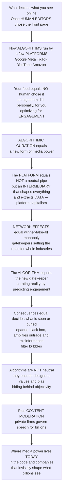

# 📲 Platforms, Algorithms and Curation

> [!abstract] TL;DR
> **Who decides what you see online?** For most of media history a *human* chose: a newspaper editor picked the front page, a TV programmer set the schedule. Today the most powerful gatekeepers on Earth are **algorithms** run by a handful of **platforms** — Google, Meta, TikTok, YouTube, Amazon. When you open a feed, *no human selected those specific posts in that order*: an algorithm did, **personally, for you, out of millions of possibilities, optimizing for a goal — usually ENGAGEMENT.** This is **algorithmic curation**, a profound new form of media power. To understand it, understand the **platform** first — not a neutral "pipe" or website but a distinctive business form (Srnicek's *platform capitalism*) that presents itself as a mere **intermediary** connecting users, creators, and advertisers while actually **shaping** everything that happens on it and **extracting value (especially data)** from every interaction. Platforms wield powerful **network effects** (more users → more value → winner-take-all monopoly) and act as **gatekeepers** who set the rules for entire industries. Then the **algorithm**: recommendation and ranking systems are the *new gatekeepers*, curating reality by predicting what will keep us engaged and serving more of it — deciding which news, creators, and ideas get seen or buried, largely invisibly and unaccountably. Optimizing for engagement can amplify **outrage, sensationalism, and misinformation** (they get clicks), spawn **filter bubbles**, and shape everything from elections to self-image — all while algorithms hide behind a false veneer of mathematical **objectivity**, when in fact they encode their designers' choices, values, and biases. And platform power now extends to **content moderation**: private companies make quasi-governmental decisions about permissible speech for billions. Platforms, algorithms, and curation are where media power actually **lives today** — in the code and companies that invisibly shape what billions see, think, and know.

---

## Intuition

**Analogy — the newsstand that rearranges itself for every single reader.** Picture the old town newsstand: one rack, one front page, one human editor who chose the day's top story for everyone. You and your neighbor saw the *same* newsstand. Now imagine a magical newsstand that **rebuilds itself the instant you walk up** — it has silently watched everything you have ever glanced at, lingered on, or shared, and out of *millions* of possible items it instantly arranges a display **just for you**, putting at eye level whatever it predicts will keep you standing there longest. Your neighbor walks up two seconds later and sees a *completely different* newsstand, also built just for them. No editor chose your front page; a **machine** did, in milliseconds, optimizing not for what is true or important but for what will **hold your attention**. That machine is a **recommendation algorithm**, and the shop it lives in is a **platform**.

Two things follow, and they are the whole subject. **First, the shop is not neutral.** The platform *insists* it is just "a place where people connect" — a mere **intermediary**, a pipe, a "platform" you stand on — but that self-image is a strategic fiction. It designs the rack, writes the rules, decides who gets shelf space, and quietly photographs everything you touch to sell to advertisers. It is an active **shaper** and a **value-extractor**, not a passive conduit (this is why Tarleton Gillespie calls "platform" a *carefully chosen political word*). And because the shop gets more useful the more people use it — your friends are here, so you come; you are here, so advertisers come; advertisers pay, so creators come — it grows by a self-reinforcing **network effect** that tends toward one giant shop swallowing the market: **winner-take-all**.

**Second, the arranging machine is the new editor — but an invisible, unaccountable one.** A human editor could be named, questioned, and held responsible; the algorithm is an opaque **black box** (Frank Pasquale's term) whose logic is proprietary and even its makers cannot fully explain. When it optimizes for engagement, it learns a brutal lesson: **outrage, fear, and sensation hold attention better than nuance and truth** — so it amplifies them, buries the calm and the careful, and can wall you inside a **filter bubble** of more-of-the-same. It does all this while wearing a lab coat of mathematical **objectivity**, though it is nothing of the sort: every algorithm encodes the goals, values, and **biases** of the people who built it and the data it learned from. And because the same platform that curates also **polices** — deciding what speech is allowed for *billions* of people through content moderation — a handful of private companies now perform a function that used to belong to editors, publishers, and governments *combined*. Understanding platforms, algorithms, and curation is understanding **where media power actually lives today**: not in the newspaper's editorial board, but in the code and the companies that invisibly assemble what each of us sees.

---

## How It Works

### Core mechanics

1. **The platform as a media and economic form.** A **platform** is a programmable digital infrastructure that **intermediates** between multiple groups — users, creators, advertisers, developers — and grows by drawing them together. Van Dijck, Poell & de Waal call the resulting order a **platform society**; Nick Srnicek names the business model **platform capitalism**: firms whose core asset is not a factory but the *position in the middle*, from which they extract and refine **data**. The web and much of culture have been **platformized** — increasingly organized around, and dependent on, a few dominant platforms (GAFAM / Big Tech).

2. **The politics of the word "platform" (Gillespie).** Firms *choose* to call themselves "platforms" precisely because the word connotes an open, neutral, egalitarian stage — a "mere conduit." This framing lets them claim the legal and moral protections of a *passive intermediary* while enjoying the profits and power of an *active shaper* that ranks, filters, promotes, and demotes everything on it. The neutrality is a **strategic self-presentation**, not a description.

3. **Network effects → winner-take-all.** A platform's value to each user rises with the *total* number of users (direct effects) and with the presence of the *other side* of the market — advertisers, creators (indirect / cross-side effects). This makes markets **tip**: a slight early lead compounds into dominance, producing **monopoly or oligopoly** rather than stable competition. The platform becomes **infrastructure** and a **gatekeeper**, setting the terms, fees, and chokepoints for entire industries — news, music, apps, retail.

4. **Data extraction and multi-sided markets.** Every interaction is logged as **behavioral data**, the raw material for prediction and targeting (the datafication / surveillance-capitalism critique). The platform runs a **multi-sided market**: users are given "free" service, their attention and data are packaged, and *access* to them is sold to advertisers — while creators depend on opaque platform rules for their **visibility, reach, and monetization** ("algorithmic precarity").

5. **Algorithms as the new gatekeepers.** **Recommendation, ranking, and filtering algorithms** decide what billions of people see — feeds, search results, trends, autoplay, "up next." In essence they **predict** relevance or engagement from behavioral data and **optimize an objective**, almost always a proxy for **engagement / attention** (watch-time, clicks, shares). Whatever the algorithm predicts will keep you engaged is **amplified**; the rest is **buried**. This is **algorithmic gatekeeping**: visibility itself becomes the new currency of power.

6. **Why engagement optimization goes wrong.** The objective is a *proxy*, not truth or wellbeing — an instance of **Goodhart's law** and reward misspecification. Under selection pressure, engagement optimization drifts toward **outrage, sensationalism, extremism, and misinformation** because those reliably drive clicks; personalization narrows exposure into **filter bubbles**; and a **feedback loop** closes (you click engaging items → the model learns to show more → the feed tilts further toward bait), a *performative* dynamic in which we adapt to the algorithm as it adapts to us.

7. **Opacity and the myth of neutrality.** The system is a proprietary **black box** — unexplainable, unaccountable, unlike a nameable editor. And it is **not** objective: algorithms **encode human choices, values, and biases** in their design and training data, then **launder** those choices as neutral mathematics — the AI-fairness critique applied to curation.

8. **Content moderation as private governance.** The same platforms that curate also **police** speech. Kate Klonick calls them the **new governors**; Gillespie the **custodians of the internet**. Through vast, hidden human and automated **content-moderation** systems they enforce **community standards** as a kind of quasi-law, make **impossible trade-offs** (harm vs free expression, over- vs under-removal, at planetary scale), and decide who is **deplatformed** — a quasi-governmental power over the digital public sphere.

### Flow / architecture



---

## Key Concepts

### Secondary (intuitive level)
- **A platform is not a neutral pipe.** It looks like "just a place where people connect," but it *designs* the space, *writes* the rules, decides who gets seen, and *collects your data*. It shapes everything on it.
- **An algorithm chooses your feed.** No human picks the posts you see; a computer program ranks millions of possibilities and shows what it predicts will keep you scrolling. That goal is usually **engagement**, not truth.
- **Engagement rewards outrage.** Because shocking, angry, or sensational things get more clicks, an engagement-chasing feed tends to push those to the top and bury calm, careful, or boring-but-true content.
- **The big get bigger.** People join the platform their friends are on, which pulls in more friends — so one giant platform tends to win everything (**network effect**), leaving a few companies in charge.
- **Filter bubble.** By showing you more of what you already like, the algorithm can wall you inside a narrow slice of the world and hide the rest.
- **Platforms police speech.** These private companies also decide what is allowed to be posted — for billions of people — through **content moderation**.

### Undergraduate (working level)
- **Platform / platformization / platform society (Gillespie; van Dijck).** Programmable, data-driven **intermediary** infrastructures connecting multiple user groups; the reorganization of the web, media, and culture around a few dominant platforms. Types: **social** (Meta, TikTok), **search** (Google), **marketplace** (Amazon), **media/streaming** (YouTube, Spotify, Netflix).
- **Platform capitalism (Srnicek).** A business model whose core asset is the intermediary position and the **data** extracted from it; taxonomy of advertising, cloud, industrial, product, and lean platforms.
- **The politics of "platform" (Gillespie).** The strategic self-presentation as neutral **conduit** vs the reality of active **curator/shaper** — enabling firms to claim intermediary protections while wielding editorial power.
- **Network effects, multi-sided markets, and winner-take-all.** Value rising with the installed base and the presence of the other market side; **tipping** toward monopoly/oligopoly; the platform as **gatekeeper** and **infrastructure** setting rules, fees, and chokepoints for whole industries (link to **political economy / ownership**).
- **Algorithmic curation and gatekeeping.** Recommendation, ranking, filtering as the **new gatekeepers**; the mechanics — predict engagement/relevance from behavioral signals, optimize an objective, amplify vs bury; **visibility** as the currency; "algorithmic agenda-setting."
- **The engagement-optimization critique.** Optimizing a **proxy** (watch-time, clicks) drives sensationalism, outrage, and **misinformation**; **filter bubbles** and personalization; the **black box** (opacity/unaccountability) and the **myth of neutrality** (algorithms encode bias).
- **Algorithmic precarity.** Creators' dependence on opaque, changeable platform rules for reach and income; "the algorithm changed and my views vanished."
- **Content moderation.** Community standards as quasi-law; commercial content moderation and its human cost; **deplatforming**; the scale problem.

### Graduate (theoretical level)
- **Datafication and surveillance capitalism (Zuboff; van Dijck).** Human experience rendered as behavioral data and refined into prediction products; the platform's control over visibility and monetization as a new mode of **power**, not merely a market.
- **Objective misalignment / Goodhart dynamics in curation.** Engagement is a *proxy* correlated with but not equal to truth, quality, or wellbeing; optimizing it under selection pressure yields sensational, polarizing, low-quality equilibria — a media instance of reward misspecification, coupled to **performativity** (users adapt to the metric, changing the data the metric is learned from).
- **The black box society (Pasquale) and algorithmic accountability.** Proprietary, unexplainable systems evade the scrutiny to which editors and publishers were subject; the demands for **auditing, transparency, and explainability**; the limits of "explaining" complex learned models.
- **The myth of algorithmic objectivity (Gillespie).** How the "calculated public" and the rhetoric of neutral computation **launder** contestable human choices; algorithms as *value-laden* artifacts encoding designers' assumptions and biased training data (link to **AI bias and fairness**).
- **Platforms as private governors of the public sphere (Klonick's "New Governors"; Gillespie's "Custodians of the Internet").** Quasi-constitutional speech decisions made by firms; the impossible trade-offs of moderation at scale (over- vs under-removal, context collapse, cultural variation); the legitimacy question — *who should set and enforce the rules?*
- **Political economy and infrastructural power.** Winner-take-all dynamics, vertical integration, and platforms as **essential facilities**; the regulatory response — **antitrust**, "break up Big Tech," data protection, and the EU **DSA/DMA** and **GDPR** (link to **ownership/regulation**).
- **Resistance and alternatives.** Algorithmic **folk theories** and users **gaming the algorithm**; platform **cooperativism**, federated/decentralized alternatives, data portability, and interoperability as counter-designs.

---

## Python Demo

```python
# Platforms, algorithms & curation — three linked demonstrations:
#   (a) ENGAGEMENT-OPTIMIZING FEED & AMPLIFICATION: a recommender that RANKS a pool
#       of content to maximize predicted ENGAGEMENT. High-arousal "outrage/sensation"
#       items have higher engagement but lower informational quality. As the platform
#       leans harder on the engagement signal over time (a feedback loop: clicks ->
#       learn to show more -> feed tilts further), the feed drifts toward sensational,
#       low-quality content -- versus a quality-ranked baseline that stays informative.
#   (b) NETWORK EFFECTS -> WINNER-TAKE-ALL: two platforms; each user's value rises with
#       the installed base. With network effects a slight early lead COMPOUNDS into
#       monopoly (market tips); with NO network effect the split stays a stable duopoly.
#   (c) FILTER BUBBLE: personalization narrows the spread of content shown toward a
#       user's inferred preference -> the diversity of exposure SHRINKS over iterations.
import numpy as np
import matplotlib.pyplot as plt

rng = np.random.default_rng(42)

# ----------------------------------------------------------------------------- #
# (a) Engagement optimization amplifies sensational, low-quality content
# ----------------------------------------------------------------------------- #
n = 600                                   # items in the candidate pool
quality = rng.uniform(0, 1, n)            # informational quality of each item
# engagement bait (arousal/outrage) is NEGATIVELY related to quality, plus noise:
engagement = np.clip(1.0 - 0.7 * quality + rng.normal(0, 0.15, n), 0.01, None)
# "sensational" = high engagement (top third) AND low quality (bottom half)
sensational = (engagement > np.quantile(engagement, 0.66)) & (quality < np.median(quality))

k = 40                                    # feed size (items shown)
rounds = 24
# Feedback loop: the platform increasingly WEIGHTS engagement (beta grows over time)
betas = np.linspace(0.0, 6.0, rounds)
feed_quality, feed_sens = [], []
for b in betas:
    weight = engagement ** b              # ranking score = engagement^beta
    top = np.argsort(-weight)[:k]         # show the top-k by predicted engagement
    feed_quality.append(quality[top].mean())
    feed_sens.append(sensational[top].mean())

# Baselines (constant reference lines)
quality_top = np.argsort(-quality)[:k]
base_quality = quality[quality_top].mean()          # a quality-ranked feed
base_sens_chrono = sensational.mean()               # a chronological/random feed

# ----------------------------------------------------------------------------- #
# (b) Network effects drive market tipping to winner-take-all
# ----------------------------------------------------------------------------- #
T = 45
def simulate_share(alpha, a0=0.53, lr=0.18):
    """alpha>1 => value ~ share^alpha (network effect); alpha=1 => no network effect."""
    a = a0; hist = [a]
    for _ in range(T):
        va, vb = a ** alpha, (1 - a) ** alpha        # platform attractiveness
        pa = va / (va + vb)                          # prob a switcher joins platform A
        a = (1 - lr) * a + lr * pa                   # market share updates toward pa
        hist.append(a)
    return np.array(hist)

share_network = simulate_share(alpha=2.0)            # strong network effects -> tips
share_flat    = simulate_share(alpha=1.0)            # none -> stays a duopoly

# ----------------------------------------------------------------------------- #
# (c) Personalization narrows exposure -> a filter bubble
# ----------------------------------------------------------------------------- #
iters = 30
pref, window = 0.0, 1.0                               # inferred preference, breadth shown
diversity = []
for _ in range(iters):
    shown = rng.normal(pref, window, 300)            # items shown ~ around inferred pref
    w = np.exp(-0.5 * ((shown - pref) / (0.6 * window)) ** 2)  # engage more near pref
    pref = np.sum(w * shown) / np.sum(w)             # update inferred preference
    engaged = shown[w > 0.5]
    window = max(0.12, 0.85 * engaged.std())         # narrow the window toward engaged spread
    diversity.append(window)

# ----------------------------------------------------------------------------- #
# Plots
# ----------------------------------------------------------------------------- #
fig, ax = plt.subplots(1, 3, figsize=(16, 4.7))

ax[0].plot(range(rounds), feed_quality, color="#2563eb", lw=2.6,
           label="Avg quality of engagement-ranked feed")
ax[0].plot(range(rounds), feed_sens, color="#dc2626", lw=2.6,
           label="Share of sensational items in feed")
ax[0].axhline(base_quality, color="#2563eb", ls=":", lw=1.6,
              label="Quality-ranked baseline")
ax[0].axhline(base_sens_chrono, color="#dc2626", ls=":", lw=1.6,
              label="Chronological baseline (sensational share)")
ax[0].set_title("(a) Engagement optimization amplifies\nsensational, low-quality content")
ax[0].set_xlabel("rounds (platform leans harder on engagement)")
ax[0].set_ylabel("fraction / avg quality")
ax[0].set_ylim(0, 1); ax[0].legend(fontsize=7, loc="center right")

ax[1].plot(range(T + 1), share_network, color="#7c3aed", lw=2.8,
           label="Platform A: WITH network effects")
ax[1].plot(range(T + 1), 1 - share_network, color="#9ca3af", lw=2.0,
           label="Platform B: WITH network effects")
ax[1].plot(range(T + 1), share_flat, color="#059669", lw=2.2, ls="--",
           label="Platform A: NO network effect")
ax[1].axhline(0.5, color="gray", ls=":", lw=1.0)
ax[1].set_title("(b) Network effects -> winner-take-all\n(a slight lead tips the market)")
ax[1].set_xlabel("time"); ax[1].set_ylabel("market share")
ax[1].set_ylim(0, 1); ax[1].legend(fontsize=8, loc="center right")

ax[2].plot(range(iters), diversity, color="#ea580c", lw=2.8)
ax[2].fill_between(range(iters), diversity, color="#ea580c", alpha=0.12)
ax[2].set_title("(c) Filter bubble:\ndiversity of exposure shrinks")
ax[2].set_xlabel("personalization iterations")
ax[2].set_ylabel("breadth of content shown (std)")
ax[2].set_ylim(0, 1.1)

plt.tight_layout()
plt.show()

# Key readings
print(f"(a) Feed quality: quality-ranked={base_quality:.2f}  ->  "
      f"engagement-ranked (final)={feed_quality[-1]:.2f}")
print(f"(a) Sensational share: chronological={base_sens_chrono:.2f}  ->  "
      f"engagement-ranked (final)={feed_sens[-1]:.2f}")
print(f"(b) With network effects, Platform A share: {share_network[0]:.2f} -> {share_network[-1]:.2f} "
      f"(tips); without: {share_flat[-1]:.2f} (stable)")
print(f"(c) Exposure breadth: {diversity[0]:.2f} -> {diversity[-1]:.2f} (bubble narrows)")
```

Panel **(a)** makes the engagement critique concrete: as the platform leans harder on the engagement signal (the feedback loop), the **quality** of the top-k feed falls well below a quality-ranked baseline while the **share of sensational, low-quality items climbs** — the algorithm is not malicious, it is simply optimizing the wrong proxy, and outrage is what that proxy rewards. Panel **(b)** shows the platform's economic engine: with **network effects** (value rising with the installed base) a razor-thin early lead **compounds until the market tips to monopoly**, whereas with no network effect the two platforms coexist as a stable duopoly — the structural reason a *handful* of platforms end up controlling the pipes. Panel **(c)** shows personalization creating a **filter bubble**: by repeatedly showing more of what you engaged with, the recommender's window of exposure **narrows toward your inferred preference**, shrinking the diversity of what you ever see. Together the three panels are the anatomy of platform power — *what* gets amplified, *why* a few firms hold the levers, and *how* your informational world quietly contracts.

---

## Real-World Applications

- **The engagement turn on social feeds.** Facebook, Instagram, TikTok, YouTube, and X charge users nothing and rank feeds to maximize **engagement** (watch-time, interactions). Internal and external research repeatedly links this objective to the amplification of **outrage, rage-bait, and misinformation** — TikTok's "For You" page and YouTube's "up next" autoplay are the paradigm cases of recommendation as the modern gatekeeper of attention.
- **Search and the map of knowledge.** Google's ranking algorithm decides which sources billions treat as authoritative; a demotion in results can vanish a business or a story. Search is **algorithmic agenda-setting** at planetary scale — visibility as the new currency, controlled by an opaque, proprietary system.
- **Marketplaces as gatekeepers.** Amazon's ranking and "Buy Box" set the terms, fees, and visibility for millions of third-party sellers — and Amazon competes against those same sellers with its own private-label products, the classic **platform-as-gatekeeper** conflict now central to **antitrust** cases.
- **Network effects and winner-take-all.** The reason there is essentially *one* dominant search engine, *one* dominant video platform, and *one* dominant social graph per niche is cross-side network effects tipping each market — the empirical face of panel (b), and the target of "break up Big Tech" arguments.
- **Algorithmic precarity for creators.** YouTubers, TikTokers, and app developers live and die by opaque, frequently changing platform rules; "the algorithm changed" can erase a livelihood overnight, and **shadow-banning** (silent demotion) exemplifies invisible platform power over reach.
- **Content moderation as private governance.** Meta's **Oversight Board**, the deplatforming of major political figures, and the vast outsourced armies of commercial moderators reviewing traumatic content show private firms performing **quasi-governmental** speech decisions for billions — the "New Governors" in action.
- **Regulation and auditing.** The EU **Digital Services Act / Digital Markets Act**, **GDPR**, algorithmic-audit mandates, and antitrust suits are direct responses to platform and algorithmic power — attempts to pry open the black box and constrain the gatekeepers.

---

## Common Pitfalls

- **Believing the platform is a neutral pipe.** The "we're just an intermediary" framing is a *strategic* claim, not a fact. Platforms rank, promote, demote, and design every interaction; treating them as passive conduits (or as "just tech companies") misreads the editorial power they actually wield.
- **Assuming the algorithm is objective or "just math."** Every recommender encodes contestable human choices — what to optimize, which signals to trust, which training data to learn from — then launders them as neutral computation. "The algorithm decided" hides *people* who decided.
- **Confusing engagement with quality or truth.** Engagement is a **proxy**. High-engagement content (viral outrage) is often low or negative value, while high-value content draws little. Reading "what's trending" as "what's important or true" mistakes the metric for the goal (Goodhart's law).
- **Ignoring the feedback loop / performativity.** The algorithm does not just *reflect* preferences; it *shapes* them, then learns from the behavior it shaped. Analyzing curation as a one-way mirror misses the loop that drives drift toward sensationalism and narrowing.
- **Over-reading the filter-bubble thesis.** Bubbles and echo chambers are real dynamics but empirically *variable* — some studies find algorithms increase incidental diversity. Treating "everyone is trapped in a bubble" as settled fact overstates a contested literature; the effect is real but heterogeneous.
- **Framing content moderation as a simple free-speech switch.** Moderation at planetary scale is a field of *impossible trade-offs* — over- vs under-removal, context collapse, cultural variation, and the human toll on moderators. "Just leave everything up" and "just take the bad stuff down" both ignore the scale problem.
- **Mistaking transparency for accountability.** Publishing an algorithm's code or a moderation policy does not make a black-box learned system *explainable* or a private governor *accountable*. Real accountability needs auditing, redress, and governance, not just disclosure.

---

## Related Concepts

- [[Recommendation_System]] — the engineering counterpart: how recommender systems actually work (collaborative filtering, ranking objectives, candidate generation). This note supplies the *critical media-power* reading of the same machinery that note builds.
- [[Ranking_System]] — the ML system-design view of ranking feeds and results by a learned objective; algorithmic curation is ranking-at-scale turned into a gatekeeping institution.
- [[AI_Bias_and_Fairness]] — the technical grounding for "algorithms are not neutral": how design choices and biased training data produce discriminatory outcomes that curation then laundered as objective math.
- [[Monopoly]] — the microeconomics of the winner-take-all outcome in panel (b): network effects and increasing returns tipping platform markets toward monopoly/oligopoly and gatekeeper power.
- [[Online_Social_Networks_and_Platforms]] — the computational-social-science treatment of platforms as networked systems, the substrate on which recommendation, diffusion, and moderation operate.
- [[Misinformation_Polarization_and_the_Online_Public_Sphere]] — the empirical study of how engagement-optimized platforms interact with misinformation and polarization, the downstream consequences this note frames theoretically.
- [[DLP_and_Data_Protection]] — the security/governance angle on the **data** platforms extract from every interaction: how personal data is (or is not) protected, connecting to GDPR and the datafication critique.

Within this vault, platforms, algorithms and curation is the anchor of digital-media power and connects in prose to its section-05 siblings: **The Digital Revolution and New Media** (the shift to programmable, platformized media), **Social Media and Networked Communication** (the platforms whose feeds these algorithms curate), **Attention, Filter Bubbles and Echo Chambers** (the discourse-level consequences of personalization), **Advertising and the Attention Economy** (engagement optimization as the attention-harvesting business model that funds curation), **Misinformation, Disinformation and Fake News** (what engagement amplification spreads), **Surveillance, Privacy and Datafication** (the data-extraction engine beneath platform power), and **AI-Generated Media and Deepfakes** (the next frontier of synthetic content flowing through the same curation systems). It also complements the earlier **agenda-setting/framing** and **media ownership and regulation** notes — algorithmic curation is agenda-setting automated, and platform power is the concentration-of-ownership question of the digital age.

---

## Review Questions

1. **(Secondary)** Explain the difference between a newspaper editor choosing the front page and an algorithm choosing your feed. What goal is the algorithm usually optimizing for, and why does that goal push content toward outrage and sensation?
2. **(Secondary)** Why does calling a company a "platform" make it sound neutral? Give one example of how a platform actively *shapes* what happens on it rather than just passing content along.
3. **(Undergraduate)** Using **network effects**, explain why digital markets tend toward *one* dominant platform (winner-take-all) rather than many competitors. How does this connect a platform to being a "gatekeeper" for an entire industry?
4. **(Undergraduate)** A video platform switches its recommender's objective from "predicted user rating" to "predicted watch-time." Using the engagement-vs-quality distinction and the feedback loop, predict how the content mix will change and name two societal side effects.
5. **(Undergraduate)** What is the "myth of algorithmic objectivity," and how do algorithms encode human choices and bias despite appearing to be neutral mathematics? Tie your answer to training data and the choice of objective.
6. **(Graduate)** Klonick calls platforms the "New Governors" of speech. Argue whether private content moderation for billions is best understood as a market activity, an editorial activity, or a quasi-governmental one — and what mode of accountability (auditing, regulation, transparency, cooperativism) each framing implies.
7. **(Graduate)** Frame engagement-maximizing curation as an instance of objective misalignment (Goodhart's law) *coupled with performativity*. Why does the feedback loop between algorithm and behavior make the problem structurally harder than a static "biased ranking," and what interventions could realign it without abolishing recommendation?

---

## Sources

- Gillespie, T. (2018). *Custodians of the Internet: Platforms, Content Moderation, and the Hidden Decisions That Shape Social Media.* Yale University Press.
- Gillespie, T. (2010). "The Politics of 'Platforms.'" *New Media & Society*, 12(3), 347–364.
- Srnicek, N. (2017). *Platform Capitalism.* Polity Press.
- van Dijck, J., Poell, T., & de Waal, M. (2018). *The Platform Society: Public Values in a Connective World.* Oxford University Press.
- Pasquale, F. (2015). *The Black Box Society: The Secret Algorithms That Control Money and Information.* Harvard University Press.
- Klonick, K. (2018). "The New Governors: The People, Rules, and Processes Governing Online Speech." *Harvard Law Review*, 131(6), 1598–1670.

---

#media-studies #platforms #algorithms #algorithmic-curation #platform-capitalism
