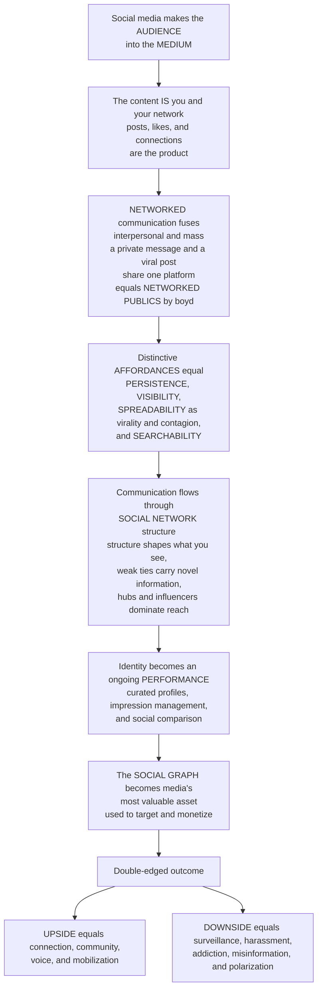

# 🕸️ Social Media and Networked Communication

> [!abstract] TL;DR
> Social media did something no medium ever had before: it **made the audience into the medium**. On TV, professionals made the content and you watched; on social media, the content **is you and your network** — your posts, photos, likes, shares, and connections *are* the product, and the "broadcast" flows **peer-to-peer** through webs of relationships. This is **networked communication**, and it fuses two things that used to be separate: **interpersonal** communication (talking to friends) and **mass** communication (broadcasting to the world) collapse into one space where a private message and a viral post live on the same platform — what danah boyd calls **networked publics**. A handful of **affordances** make it distinctive: **persistence** (what you post sticks around), **visibility** (huge potential audiences), **spreadability** (content is built to be shared and can go *viral*, spreading through the network like a contagion), and **searchability**. Because communication flows through **social-network structure**, *who you are connected to* determines what you see, information travels along ties (the "strength of weak ties"), and a few hyper-connected **hubs** — influencers — wield outsize reach. Social media also turned **identity into an ongoing performance** (Goffman goes digital), and made the **social graph** — the mapped web of who-knows-whom — the most valuable asset in media. The consequences are enormous and double-edged: unprecedented connection, voice, and mobilization on one hand; surveillance, harassment, addiction, misinformation, and polarization on the other. Understanding social media is understanding **how we now talk, connect, perform, and organize** in the networked age.

---

## Intuition

**Analogy:** Picture two ways a message can travel across a town. The **old broadcast tower** (TV, radio, the newspaper) sits on a hill: a few professionals write the content and beam it *down* to a silent audience — one-to-many, top-down, and the audience is just a crowd of receivers. Now picture a **rumor spreading through a party**: no central tower, no fixed script. It moves *sideways*, mouth to ear, friend to friend, jumping between clusters of guests, mutating as it goes; a whisper between two people and a story the whole room is repeating are the *same act*, differing only in how far the chain of tellers carried it. Social media rebuilt the whole media system in the shape of that party. The "content" isn't handed down from a tower — **it is the guests themselves**: their gossip, their photos, who they're standing with. And how far anything travels depends not on a broadcaster's budget but on the **shape of the crowd** — who knows whom, who is standing at the center of the room.

Technically: broadcast media are **one-to-many** and separate the professional *producer* from the amateur *audience*. Social media are **many-to-many** and erase that line — every user is producer, distributor, and audience at once, and the content flowing between them is *user-generated*. The message no longer radiates from a center; it **diffuses through a network of relationships**, so the network's *structure* — its hubs, its weak-tie bridges, its clusters — becomes the thing that governs who hears what. Grasping social media means shifting your mental model from *the tower* to *the web*.

---

## How It Works

### Core Mechanics

1. **User-generated content and the Web 2.0 shift.** boyd & Ellison define **social network sites** as web services that let people build a **profile**, articulate a list of **connections**, and traverse those connections. The underlying move is from **Web 1.0** (read-only pages made *for* you) to **Web 2.0** (read-write, participatory platforms made *by* you) — Tim O'Reilly's coinage for the "platformization of the social." The raw material of the medium becomes ordinary people's posts, and the platform's job is to host, sort, and monetize them.

2. **The fusion of communication forms.** Traditional theory kept **interpersonal** communication (one-to-one or one-to-few) and **mass** communication (one-to-many) in separate boxes with separate research traditions. Social media **collapse the two** into a hybrid **many-to-many** space. Manuel Castells names the result **"mass self-communication"** — self-generated in content, self-directed in reach, yet capable of reaching a mass audience. A DM to one friend and a post seen by millions run on the *same* infrastructure, differing only by a privacy toggle.

3. **Networked publics and their affordances.** boyd theorizes social media as **networked publics** — publics restructured by networked technology — and identifies four defining **affordances** (properties that shape what the medium makes easy):
   - **Persistence** — content endures by default; the ephemeral becomes recorded.
   - **Visibility** — the potential audience is vast and often invisible.
   - **Spreadability** (replicability) — content is trivial to copy and share, enabling **virality**.
   - **Searchability** — people and content can be found on demand.
   These affordances generate distinctive **dynamics**: **invisible and imagined audiences** (you post to a mental picture of who's watching, not the real crowd) and **context collapse** — the flattening of many separate audiences (boss, grandmother, ex, stranger) into one, so the self-presentation that works for one context leaks into all the others.

4. **Communication flows through network structure.** Because messages diffuse along **ties**, the **structure** of the social network governs the outcome. Mark Granovetter's **strength of weak ties**: your close friends know what you know, so novel information and opportunities arrive through *weak* ties — distant acquaintances who **bridge** otherwise separate groups. **Homophily** ("birds of a feather flock together") clusters similar people, seeding echo chambers. **Structural holes** (Burt) between clusters create **brokerage** advantages. And online networks are typically **scale-free**: a **power-law** degree distribution in which a few **hubs** (celebrities, influencers) accumulate enormous followings via **preferential attachment** ("the rich get richer"), while most accounts have few connections. **Network effects** (Metcalfe's law — value grows with the square of the users) lock users into the biggest platforms.

5. **Diffusion and contagion.** Information and behavior **spread through the network** like a contagion. **Simple contagion** (a joke, a news link) can jump on a single exposure and travels far via weak ties; **complex contagion** (adopting a risky behavior, joining a movement) usually needs **reinforcement** from multiple connected sources and travels better through dense, strong-tie clusters. **Cascades** and virality are therefore not just about content quality — they depend on *where* the spark starts. A message seeded at a **hub** reaches far more, far faster, than the same message seeded at a random node.

6. **Identity as performance.** Erving Goffman's **dramaturgy** — life as a stage where we manage impressions for an audience — goes digital. The profile is a curated **front stage**: we self-brand, post the **highlight reel**, and perform an identity for **imagined audiences**. This fuels **social comparison** — chronic **upward comparison** against others' curated best moments, amplified by the **friendship paradox** (your friends, on average, really do have more friends than you), feeding **FOMO** and documented effects on self-esteem and wellbeing. **Micro-celebrity** and **influencer** culture professionalize the performed self.

7. **The social graph as the business model.** The **social graph** — the mapped network of who-knows-whom, plus every like, dwell, and click — is the platform's core **asset and product**. It powers the **attention/data/advertising** model: users and their behavioral data are the commodity sold to advertisers, and **engagement-driven, algorithmic feeds** are engineered to maximize time-on-platform. The graph lets platforms **target and monetize** with unprecedented precision.

8. **Double-edged consequences.** The same architecture delivers **connection, community, belonging, voice for the marginalized, and mobilization** (networked movements, hashtag activism) *and* **surveillance, harassment, addiction, misinformation, polarization, and context collapse**. The medium is not simply good or bad; its affordances **enable and constrain** both at once, which is why the debate over its net effect on democracy and wellbeing remains genuinely open.

### Flow / Architecture



---

## Key Concepts

### Secondary (intuitive)
- **The audience became the medium:** on TV, pros make it and you watch; on social media, *you and your friends* are the content — your posts, photos, and connections are the product.
- **Networked, not broadcast:** a message spreads sideways, friend to friend, like a rumor at a party — not down from a tower. A private text and a viral post use the same app.
- **Going viral:** because content is easy to share, it can spread through the network like a cold spreads through a school — and a super-connected "influencer" can spread it to far more people than an ordinary account.
- **The highlight reel:** people post their best, most flattering moments, so scrolling makes everyone else look happier and more popular than they really are — that is the trap of social comparison.
- **The upside and the downside are the same feature:** the connection, voice, and organizing power come from the very same wiring that also enables harassment, addiction, and misinformation.

### Undergraduate (mechanistic)
- **Social network sites (boyd & Ellison):** profile + articulated connections + traversal; the Web 1.0 (read) to **Web 2.0** (read-write, participatory) shift and the platformization of everyday sociality.
- **Mass self-communication (Castells)** and the collapse of the **interpersonal/mass** distinction into a **many-to-many** space; **networked publics** and their restructuring by technology.
- **The four affordances (boyd):** persistence, visibility, spreadability, searchability — and their dynamics: **invisible/imagined audiences** and **context collapse**.
- **Weak ties & structure (Granovetter):** weak ties **bridge** clusters and carry **novel information**; **homophily** clusters similar people; **structural holes** create brokerage.
- **Scale-free networks:** power-law degree distributions, **hubs**, **preferential attachment** ("rich get richer"), **network effects** and Metcalfe's law; why a hub-seeded cascade dwarfs a random one.
- **Impression management online:** Goffman's front stage digitized — curation, self-branding, the highlight reel, **social comparison**, the **friendship paradox**.

### Graduate (critical / theoretical)
- **Simple vs complex contagion:** informational spread often succeeds on single exposure via weak ties (Granovetter/Bakshy), but behavioral adoption (Centola's complex contagion) typically requires **social reinforcement** from multiple ties, favoring dense clusters — reversing the naive "weak ties are always better for spread" reading.
- **The affordances debate and anti-determinism:** affordances **enable and constrain**, they do not *cause*; reading persistence or virality as destiny is **technological determinism**. boyd insists dynamics emerge from the *interaction* of affordances with social practice.
- **Political economy of the social graph (van Dijck; Zuboff):** "connectivity" is engineered, not natural; the graph and behavioral surplus are commodified, and engagement-optimizing algorithms encode platform interests. The "prosumer" performs unpaid **free labor** (Terranova) that platforms datafy and sell.
- **Networked movements and the mobilization debate:** Shirky's optimism about low-cost coordination vs Gladwell's critique that weak-tie "slacktivism" cannot sustain **high-risk** activism (which needs strong ties, per McAdam); the "Twitter revolution" framing of the Arab Spring and its critiques (Tufekci on the fragility of networked protest).
- **Context collapse and the crisis of self-presentation:** managing one identity across flattened, invisible audiences (Marwick & boyd) forces the **lowest-common-denominator** self or strategic segmentation; authenticity becomes a performed, marketable achievement, not a pre-social given.
- **Polarization and echo chambers, contested:** homophily + algorithmic curation can amplify sorting, but the empirical magnitude is disputed (Bakshy et al. vs Bail); the causal weight of algorithms vs pre-existing preference selection is a live methodological problem.

---

## Python Demo

```python
# Social Media and Networked Communication, simulated two ways on ONE network:
#  (a) VIRAL DIFFUSION on a SOCIAL NETWORK -- content spreads as a CONTAGION.
#      We hand-roll a SCALE-FREE (preferential-attachment) network with HUBS, then
#      run a simple independent-cascade: each sharer exposes neighbors, who reshare
#      with probability p. Seeding the SAME content at a HUB (influencer) reaches
#      far more, far faster, than seeding it at a RANDOM node -- showing that
#      network STRUCTURE, not just content, governs virality (the S-curve cascade).
#  (b) NETWORK STRUCTURE that makes (a) possible:
#      (b1) SCALE-FREE degree distribution -- a heavy-tailed power law where a few
#           accounts have enormous followings and most have few (follower inequality).
#      (b2) FRIENDSHIP PARADOX -- "your friends have more friends than you": for most
#           nodes, neighbors' average degree exceeds their own -- the structural root
#           of social comparison and the "everyone is more popular than me" feeling.
import numpy as np
import matplotlib.pyplot as plt

rng = np.random.default_rng(7)

# ---------- (b) build a hand-rolled SCALE-FREE network (Barabasi-Albert) ----------
def barabasi_albert(n, m, rng):
    adj = [set() for _ in range(n)]
    for i in range(m):                       # seed clique of m nodes
        for j in range(i + 1, m):
            adj[i].add(j); adj[j].add(i)
    repeated = list(range(m)) * m            # degree-proportional "bag" for pref. attachment
    for node in range(m, n):
        chosen = set()
        while len(chosen) < m:               # attach to m existing nodes, favoring high degree
            chosen.add(int(rng.choice(repeated)))
        for t in chosen:
            adj[node].add(t); adj[t].add(node)
            repeated.append(t); repeated.append(node)  # rich get richer
    return adj

N, M = 2500, 3
adj = barabasi_albert(N, M, rng)
deg = np.array([len(a) for a in adj])

# ---------- (a) independent-cascade (simple contagion) diffusion ----------
def cascade(adj, seeds, p, rng):
    infected = np.zeros(len(adj), bool)
    for s in seeds:
        infected[s] = True
    frontier, curve = list(seeds), [int(infected.sum())]
    while frontier:
        nxt = []
        for u in frontier:                   # only newly-infected try to infect neighbors
            for v in adj[u]:
                if not infected[v] and rng.random() < p:
                    infected[v] = True; nxt.append(v)
        frontier = nxt
        curve.append(int(infected.sum()))
    return np.array(curve)

def avg_curves(seed_fn, p, trials, rng):
    runs = [cascade(adj, seed_fn(rng), p, rng) for _ in range(trials)]
    L = max(len(r) for r in runs)
    pad = np.array([np.concatenate([r, np.full(L - len(r), r[-1])]) for r in runs])
    return pad.mean(0) / N, pad[:, -1] / N   # mean S-curve (fraction), final-reach per trial

hub = int(np.argmax(deg))                    # most-connected node = the influencer
p, TRIALS = 0.12, 120
hub_curve, hub_final = avg_curves(lambda r: [hub], p, TRIALS, rng)
rnd_curve, rnd_final = avg_curves(lambda r: [int(r.integers(0, N))], p, TRIALS, rng)

# ---------- (b2) friendship paradox ----------
own = deg.astype(float)
nbr_mean = np.array([deg[list(adj[i])].mean() if deg[i] else 0.0 for i in range(N)])
paradox = float(np.mean(nbr_mean > own))     # fraction whose friends have more friends

# ---------- PLOTS ----------
fig, ax = plt.subplots(2, 2, figsize=(13, 9))

# (a) viral S-curves: hub seeding vs random seeding
ax[0, 0].plot(hub_curve, "-", lw=2.2, color="#c0392b", label="seeded at a HUB (influencer)")
ax[0, 0].plot(rnd_curve, "-", lw=2.2, color="#2980b9", label="seeded at a RANDOM node")
ax[0, 0].set_title("(a) Viral diffusion: structure governs reach")
ax[0, 0].set_xlabel("cascade step (network time)")
ax[0, 0].set_ylabel("fraction of network reached")
ax[0, 0].legend(loc="lower right")

# (a2) distribution of final reach across trials
bins = np.linspace(0, max(hub_final.max(), rnd_final.max()) + 1e-6, 30)
ax[0, 1].hist(hub_final, bins=bins, alpha=0.65, color="#c0392b", label="hub seed")
ax[0, 1].hist(rnd_final, bins=bins, alpha=0.65, color="#2980b9", label="random seed")
ax[0, 1].axvline(hub_final.mean(), color="#c0392b", ls="--", lw=1.5)
ax[0, 1].axvline(rnd_final.mean(), color="#2980b9", ls="--", lw=1.5)
ax[0, 1].set_title("(a2) Final reach over " + str(TRIALS) + " trials")
ax[0, 1].set_xlabel("final fraction reached")
ax[0, 1].set_ylabel("number of cascades")
ax[0, 1].legend()

# (b1) scale-free degree distribution on log-log axes (heavy tail = hubs)
vals, counts = np.unique(deg, return_counts=True)
ax[1, 0].scatter(vals, counts, s=18, color="#8e44ad")
ax[1, 0].set_xscale("log"); ax[1, 0].set_yscale("log")
ax[1, 0].set_title("(b1) Scale-free degree distribution: a few huge hubs")
ax[1, 0].set_xlabel("degree = number of connections  [log]")
ax[1, 0].set_ylabel("number of accounts  [log]")

# (b2) friendship paradox: your friends vs you
ax[1, 1].hist(nbr_mean - own, bins=40, color="#16a085", alpha=0.8)
ax[1, 1].axvline(0, color="k", ls="--", lw=1.5)
ax[1, 1].set_title("(b2) Friendship paradox: friends minus you")
ax[1, 1].set_xlabel("neighbors' avg degree minus your own degree")
ax[1, 1].set_ylabel("number of accounts")
ax[1, 1].text(0.02, 0.9, str(round(100 * paradox)) + " pct of people:\nfriends have MORE friends",
              transform=ax[1, 1].transAxes)

plt.tight_layout()
plt.savefig("social_media_and_networked_communication.png", dpi=120)
print("Mean final reach  -- hub seed:", round(float(hub_final.mean()), 3),
      "  random seed:", round(float(rnd_final.mean()), 3))
print("Hub advantage (x):", round(float(hub_final.mean() / max(rnd_final.mean(), 1e-6)), 1))
print("Max degree (top hub):", int(deg.max()), " median degree:", int(np.median(deg)))
print("Friendship-paradox fraction:", round(paradox, 3))
```

Running it makes the mechanics concrete. Panel **(a)** shows the *same* content seeded at a hub racing up an **S-curve** to a large fraction of the network while the random-seeded cascade mostly sputters and dies — virality is a property of **where** you start in the structure, not just what you post. Panel **(a2)** shows the hub's advantage is systematic across trials, not luck. Panel **(b1)** is the **scale-free** signature — a heavy-tailed, near-straight line on log-log axes: most accounts have a handful of ties, a rare few are giant hubs (the influencers who make (a) possible). Panel **(b2)** dramatizes the **friendship paradox**: for the large majority of nodes, their friends' average degree *exceeds their own* — a purely structural artifact (popular people are over-represented in everyone's friend list) that, combined with the curated highlight reel, is the mathematical seed of "everyone is more connected and happier than me."

---

## Real-World Applications

- **Hashtag activism and networked movements.** #BlackLivesMatter, #MeToo, and the 2010-11 uprisings framed as "Twitter/Facebook revolutions" show weak-tie networks mobilizing attention and coordination at low cost — while Tufekci's fieldwork exposes their fragility (fast to assemble, hard to sustain), the empirical core of the Shirky-vs-Gladwell debate.
- **The TikTok "For You" feed and manufactured virality.** An engagement-optimizing recommender can vault an unknown creator to millions overnight — an algorithmic version of panel (a): the platform *manufactures* hub-like reach for content it predicts will spread, decoupling virality from a creator's existing follower count.
- **Instagram, social comparison, and teen wellbeing.** Internal research and external studies link curated highlight reels and upward comparison (panel b2's friendship paradox) to body image and mood effects — a live case for the wellbeing debate and for platform design (e.g., hiding like counts).
- **The Facebook social graph and ad targeting.** The graph plus behavioral data is the asset that made microtargeted advertising — and the Cambridge Analytica scandal — possible; it is precisely van Dijck's "culture of connectivity" and Zuboff's "surveillance capitalism" made operational.
- **Influencer and creator economies.** Micro-celebrity monetizes the performed self: brands pay for hub reach, and "authenticity" becomes a professional, quantified craft — Goffman's front stage turned into a business model.
- **Contagion in behavior, not just content.** Christakis & Fowler's findings that obesity, smoking, and happiness spread through social ties (complex contagion) inform public-health messaging and the design of network interventions (seeding change at well-chosen nodes).

---

## Common Pitfalls

- **Confusing "networked" with merely "digital."** The defining feature is not that communication is online but that it is **many-to-many and routed through network structure**. A one-to-many newspaper website is digital but not networked; a group chat is deeply networked. Miss this and you analyze social media as if it were just faster TV.
- **Technological determinism about affordances.** Persistence, visibility, spreadability, and searchability **enable and constrain** behavior; they do not *dictate* it. Outcomes emerge from affordances *interacting with* social practice — the same virality machinery serves both a fundraiser and a harassment mob.
- **"Weak ties are always best for spread."** True for *simple* (informational) contagion, but *complex* contagion (risky, high-commitment behavior and high-risk activism) needs **reinforcement from multiple strong ties**. Over-crediting weak ties is the exact error behind "slacktivism" optimism that Gladwell and McAdam critique.
- **Treating virality as content quality alone.** As panel (a) shows, *seeding position in the network* can matter more than the content. Ignoring structure leads to survivorship-biased "how to go viral" folklore that overlooks the hubs and cascades doing the actual work.
- **Reading the friendship paradox or social comparison as personal failure.** "Everyone has more friends and a better life than me" is partly a **structural illusion** (popular nodes are over-sampled in your feed) amplified by curated highlight reels — not an accurate audit of your worth.
- **Assuming "the audience is the product" means users are passive dupes.** Networked publics are also sites of genuine agency — participatory culture, remix, community, and resistance — and treating users purely as harvested data misses half the phenomenon.
- **Overstating echo chambers as inevitable.** Homophily and algorithmic curation can sort people, but the empirical magnitude and the causal share of *algorithms vs pre-existing preferences* are genuinely contested; asserting deterministic filter-bubble doom outruns the evidence.

---

## Related Concepts

- [[Online_Social_Networks_and_Platforms]] — the computational-social-science companion: how platform data operationalizes the social graph, follower distributions, and cascades studied here at population scale.
- [[Contagion_and_Diffusion_in_Social_Networks]] — the formal models (independent cascade, threshold, simple vs complex contagion) behind panel (a)'s viral spread and the hub-seeding advantage.
- [[The_Strength_of_Weak_Ties_and_Social_Capital]] — Granovetter's mechanism: why weak, bridging ties carry novel information across clusters and structure who hears what.
- [[Social_Networks_and_Social_Ties]] — the sociology of nodes, ties, homophily, and structural holes that this note applies to the online, many-to-many case.
- [[Digital_Society_and_Online_Communities]] — the sociological account of online community, identity, and the social effects of networked life that parallels networked publics.
- [[Identity_Stigma_and_Impression_Management]] — Goffman's dramaturgy, the direct source for social media as an ongoing front-stage performance and impression management.
- [[Small_World_and_Scale_Free_Networks]] — the network-science foundation for panel (b1): power laws, preferential attachment, hubs, and why online networks look the way they do.
- [[Network_Dynamics_and_Contagion]] — cascades, thresholds, and diffusion dynamics on networks; the general theory of which viral spread on social media is a case.
- [[Happiness_and_Wellbeing]] — the psychology of social comparison, upward comparison, and the wellbeing effects entangled with the friendship-paradox highlight reel.
- [[Mass_Communication_and_Media_Effects]] — the broadcast-era baseline whose one-to-many logic social media fuses with interpersonal communication into a many-to-many hybrid.
- [[Advertising_and_the_Attention_Economy]] — the business model that turns the social graph and attention into a commodity, the economic engine of engagement-driven feeds.

Within this vault, this note anchors the digital-media-and-networks section and should be read alongside its siblings (referenced in prose here, to avoid dangling links until they exist): **The_Digital_Revolution_and_New_Media** (the read-only to read-write shift that made social media possible), **Platforms_Algorithms_and_Curation** (the algorithmic feeds that now govern visibility and virality), **Attention_Filter_Bubbles_and_Echo_Chambers** (how homophily and curation may sort audiences), **Fandom_and_Participatory_Culture** (audiences as producers and "semiotic poachers"), **Surveillance_Privacy_and_Datafication** (the datafied social graph as the medium's asset), and **Misinformation_Disinformation_and_Fake_News** (false content weaponizing the same spreadability that carries everything else).

---

## Review Questions

1. **(Secondary)** Explain, in your own words, what it means to say social media "made the audience into the medium," and give one way this differs from watching television. Then describe one everyday example of something "going viral" and why a popular account (a hub) can spread it further than an ordinary one.
2. **(Secondary/Undergraduate)** boyd lists four affordances of networked publics: persistence, visibility, spreadability, and searchability. Pick a single post you might make and walk through how each affordance changes what could happen to it — including how it might reach an *imagined* audience you didn't intend (context collapse).
3. **(Undergraduate)** Distinguish **interpersonal** from **mass** communication, then explain what Castells means by **"mass self-communication."** Why does the fact that a private DM and a viral post use the same platform matter for how we theorize the medium?
4. **(Undergraduate/Graduate)** Using the Python demo, explain why seeding a cascade at a **hub** outperforms seeding at a **random** node, and connect this to the **scale-free** degree distribution in panel (b1). What does this imply about the common claim that "virality is just a matter of good content"?
5. **(Graduate)** Stake out a position in the Shirky-vs-Gladwell debate over networked movements, using the **simple vs complex contagion** distinction and the **strength of weak ties**. Under what conditions do weak-tie networks succeed at mobilization, and when does high-risk activism require strong ties instead? Reference the fragility critiques of the "Twitter revolution" framing.

---

## Sources

- boyd, danah. *It's Complicated: The Social Lives of Networked Teens*. New Haven: Yale University Press, 2014.
- boyd, danah m., and Nicole B. Ellison. "Social Network Sites: Definition, History, and Scholarship." *Journal of Computer-Mediated Communication* 13, no. 1 (2007): 210-230.
- Castells, Manuel. *Communication Power*. Oxford: Oxford University Press, 2009.
- Granovetter, Mark S. "The Strength of Weak Ties." *American Journal of Sociology* 78, no. 6 (1973): 1360-1380.
- van Dijck, José. *The Culture of Connectivity: A Critical History of Social Media*. Oxford: Oxford University Press, 2013.

---

#media-studies #social-media #networked-communication #networked-publics #social-networks
