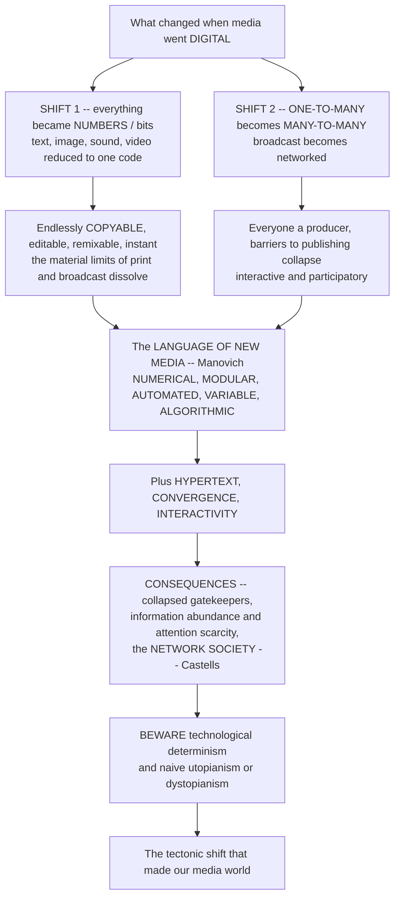

# 🌐 The Digital Revolution and New Media

> [!abstract] TL;DR
> When media went **digital**, two deep things changed. First, **everything became numbers**: text, images, sound, and video were all reduced to the same binary **code** — *bits* — which made them endlessly **copyable** (perfect copies at near-zero cost), editable, remixable, compressible, and instantly transmissible, dissolving the material constraints of print and broadcast. Second, and more transformative, communication shifted from the **one-to-many broadcast** of old mass media (a few producers pushing content to a passive mass) to the **many-to-many networks** of the internet, where the barriers to publishing collapsed and *everyone* could become a producer and distributor in an interactive, participatory environment. Lev **Manovich** captured what makes digital media distinct in the **"language of new media"** — they are **numerical, modular, automated, variable**, and increasingly **algorithmic** — and add **hypertext**, **convergence**, and **interactivity** and you get a genuinely new media environment. The consequences are civilizational: the collapse of old **gatekeepers** and business models, an explosion of information **abundance** (and the **attention scarcity** it creates), and the rise of the **network** as the dominant organizing form of society — Manuel **Castells**'s *network society*. Understanding this shift, while avoiding the twin traps of **technological determinism** and naive **utopianism/dystopianism**, is the foundation for everything about social media, platforms, and digital life.

---

## Intuition

**Analogy — the printing press versus the photocopier that is also a telephone.** Picture the old media world as a small number of enormous, expensive *printing presses* and *broadcast towers*. Owning one cost a fortune, so only a few institutions could speak; everyone else could only *listen*. Now imagine that every single person is handed a device that is at once a *perfect copier* (it duplicates any text, song, photo, or film flawlessly for essentially nothing), an *editing studio* (it can cut, remix, and rebuild any of them), and a *global telephone exchange wired to everyone else at once*. The presses and towers do not just get cheaper — the very **distinction between the few who broadcast and the many who receive dissolves**. That is the digital revolution in one image: the machinery of publishing, once scarce and one-directional, became abundant, cheap, and networked.

Two shifts sit underneath that image, and it is worth naming them precisely rather than waving at "everything changed." The **first and most basic** shift is that all media became the *same stuff*: **numbers**. A photograph, a symphony, a novel, and a movie, once physically different objects (silver on film, grooves on vinyl, ink on paper, frames on celluloid), are now all just strings of **bits** — the same digital code (link *information theory*). And because they are all just numbers, they inherit the magical properties of numbers: they can be copied perfectly and endlessly at near-zero cost, transmitted around the planet in an instant, compressed, searched, and remixed at will. The material friction that defined print and broadcast — the cost of the paper, the scarcity of the airwaves — simply **evaporates**.

The **second and most transformative** shift is structural. Old "mass media" were **broadcast**: a few producers pushed identical content out to a passive mass, one-to-many (link *mass communication*). Digital **networks** — the internet — let *everyone* be a producer *and* a distributor. The barriers to publishing collapsed, and communication became **interactive, participatory, and networked** rather than one-directional (link *participatory culture*). Media theorists like Lev **Manovich** distilled what makes this new: digital media are **numerical** (code-based and programmable), **modular** (built from reusable parts), **automated** (software does the work), **variable** (endlessly customizable, not fixed like a printed page), and increasingly **algorithmic**. Add **hypertext** (nonlinear, linked information — the Web), **convergence** (all media collapsing onto the same devices and networks — link *convergence*), and **interactivity**, and the result is a media environment genuinely different in kind. Its consequences are tectonic: the collapse of old **gatekeepers** and business models (link *journalism / political economy*), an explosion of information **abundance** and the **attention scarcity** it produces (link *attention economy*), and the rise of the network as the dominant morphology of society — Manuel Castells's **"network society."** But beware two traps: **technological determinism** (assuming the technology *alone* drives all these changes, ignoring how society shapes technology) and naive **utopianism or dystopianism**. Grasping the digital revolution is grasping the shift that created the media world we now live in.

---

## How It Works

The digital revolution is best read as a *chain of consequences* flowing from two root causes — digitization and networking — through the defining features of new media to their civilizational effects, with a crucial theoretical caution attached at the end.

1. **Digitization is the root.** Reduce text, image, sound, and video to the *same* binary code and they stop being different physical objects governed by different material limits. As pure numbers they become perfectly copyable, editable, compressible, searchable, remixable, and instantly transmissible (link *information theory*). This is the technical precondition for everything else, including **convergence** — formerly separate media (the phone, the TV, the newspaper, the record) collapsing onto the same digital devices and networks.
2. **Networking is the amplifier.** Put those digital objects on a packet-switched, many-to-many **network** and the *structure* of communication inverts. Where broadcast pushed one message from few to many, the network lets anyone address anyone — the producer/consumer asymmetry breaks down.
3. **New media acquire a distinctive "language."** Manovich's principles — **numerical, modular, automated, variable, transcoded** — plus **interactivity** and **hypertext** describe what is genuinely new: media that are programmable, database-driven, mutable, and increasingly run by software and algorithms rather than fixed like a printed page.
4. **Gatekeepers and business models collapse.** When anyone can publish and distribute for near-nothing, the traditional intermediaries who controlled scarce presses and airwaves — editors, broadcasters, record labels — lose their chokehold (**disintermediation**), and the advertising-and-subscription economics that funded them fracture (link *journalism / political economy*).
5. **Abundance breeds scarcity — of attention.** Near-zero reproduction cost produces an explosion in the *volume* of available information, which makes the truly scarce resource human **attention** (link *attention economy*).
6. **The network becomes society's core architecture.** Castells argues the network is now the dominant *morphology* of the information age — the **network society**, organized around a "space of flows" and enabling "mass self-communication."
7. **Caution: do not mistake the tool for the whole story.** The technology *enables and constrains*, but economics, politics, and social choices shape which possibilities are realized. Avoid **technological determinism** and naive **utopianism/dystopianism** alike.



---

## Key Concepts

### Secondary — the two big shifts

- **Everything became code.** A photo, a song, a book, and a film are now all the *same thing underneath*: strings of **bits** (link *information theory*). Because they are just numbers, they can be **copied perfectly for free**, edited, remixed, and sent anywhere instantly.
- **From "a few speak, everyone listens" to "everyone can speak."** Old **mass media** were **broadcast** — a few producers to a passive audience (link *mass communication*). The internet is a **network**: anyone can publish and reach anyone. The barrier to becoming a "publisher" almost vanished.
- **The Web is linked, not linear.** **Hypertext** means information is a web of clickable links you navigate your own way, not a fixed page you read start to finish.
- **All your media in one device.** Your phone is your TV, radio, newspaper, camera, cinema, and post office at once — that merging is **convergence**.
- **Too much to read.** When making and sharing content is nearly free, there is *far more information than anyone can consume* — so the scarce thing becomes your **attention** (link *attention economy*).

### Undergraduate — the language of new media and the structural shift

- **Digitization and its consequences.** Reducing all media to binary **code** yields **perfect, near-costless copying and distribution, editability, compression, remixability, transmissibility**, and **convergence** of once-separate media. This is the material basis of "new media."
- **Manovich's "language of new media" — the five principles.**
  1. **Numerical representation** — media are *programmable* code, describable mathematically and manipulable by software.
  2. **Modularity** — media objects are built from discrete, independent, *reusable* components (pixels, samples, files, elements) that keep their separate identity.
  3. **Automation** — software performs creation and operations (templates, filters, recommendation, generation), reducing human authorship at many steps.
  4. **Variability** — a new-media object is *mutable and customizable*, existing in many versions generated from a **database**, not fixed like a printed page.
  5. **Transcoding** — media now have two layers, a **cultural** layer (genre, meaning, story) and a **computational** layer (file format, data structure, algorithm), and the logic of the computer increasingly reshapes the culture.
- **Interactivity and hypertext.** New media are **two-way**, granting the user *agency* to select, respond, and create; **hypertext / hypermedia** organize information nonlinearly as linked networks — the architecture of the **Web**.
- **The one-to-many → many-to-many shift.** The collapse of barriers to *production and distribution* makes everyone a potential publisher; the producer/consumer line blurs into **"prosumers"** (link *participatory culture*); traditional **gatekeepers** are bypassed (**disintermediation**) (link *journalism / political economy*).
- **The internet as engine.** Its architecture — **packet-switching**, the open **Web**, then **Web 2.0** (user-generated content, social software) evolving into **platforms** — plus **Moore's Law** and exponential technological change as the underlying accelerant (link *history of computing*).

### Graduate — the network society and theorizing technology

- **Castells's network society.** In *The Rise of the Network Society*, Manuel Castells argues the **network** has become the dominant *morphology* of the **information age**, organized around a **"space of flows"** (a topology of connections) that increasingly supersedes the "space of places." The mode of development is **informationalism**; the internet enables **"mass self-communication"** — messaging that is potentially mass in reach yet self-generated, self-directed, and self-selected (link *networks / computational social science*).
- **The networked information economy (Benkler).** Yochai Benkler's *The Wealth of Networks* theorizes how radically cheap computation and networking enable **commons-based peer production** (Wikipedia, open source) as a non-market, non-proprietary mode of producing information and culture at scale.
- **Datafication and algorithmic mediation.** As activity moves online it becomes **data**; platforms mediate access to information through **algorithms** (ranking, recommendation, curation), shifting power from human editors to computational systems (link *platforms / datafication*).
- **Theorizing technology and society — the central debate.**
  - **Technological determinism** — technology as the autonomous *driver* of social change; associated with McLuhan's medium theory ("the medium is the message") and popular "the internet changed everything" narratives.
  - **Social shaping / social construction of technology (SCOT)** — society, economics, and politics shape how a technology develops and is used; the same internet could have developed very differently (link *STS*).
  - **Mutual shaping / affordances** — the mature middle position: technology and society **co-evolve**; a medium's **affordances** make certain uses easier and others harder without *determining* outcomes.
- **The perils of utopianism and dystopianism.** Cyber-**utopianism**, "digital democracy," and the **"Californian ideology"** (Barbrook & Cameron) that fused countercultural liberation with free-market techno-optimism, versus reflexive **dystopian** panic. Both err by treating outcomes as inevitable properties of the technology rather than as contingent, contested social results.
- **Remediation and the "what's genuinely new?" question.** Bolter and Grusin's **remediation** — new media refashion old ones rather than erase them — cautions against overstating the break; much of "new media" recycles the dynamics of older media, and disentangling genuine novelty from continuity is a core analytic task.

---

## Python Demo

```python
# The digital revolution & new media, quantified two ways:
#   (a) BROADCAST vs NETWORK topology + connectivity SCALING. The structural shift
#       from a one-to-many BROADCAST (a single hub -> many passive receivers, no
#       cross-links) to a many-to-many NETWORK (everyone can connect AND produce).
#       We DRAW both topologies, then compute how "connectivity value" SCALES with
#       the number of participants n: broadcast grows only LINEARLY (~n), a network's
#       pairwise connections grow QUADRATICALLY (~n^2, Metcalfe), and its possible
#       subgroups grow EXPONENTIALLY (~2^n, Reed) -- the many-to-many value explosion
#       and the collapse of the producer/consumer asymmetry.
#   (b) COST COLLAPSE -> INFORMATION ABUNDANCE. Digital reproduction/transmission
#       marginal cost falls toward ZERO (vs the high, ~flat cost of print/broadcast),
#       which detonates the VOLUME of information produced -> attention scarcity.
import numpy as np
import matplotlib.pyplot as plt

rng = np.random.default_rng(42)
fig, ax = plt.subplots(2, 2, figsize=(13, 9))

# ---- (a1) BROADCAST: one hub -> many passive receivers (one-to-many star) -------
n_star = 12
theta = np.linspace(0, 2 * np.pi, n_star, endpoint=False)
sx, sy = np.cos(theta), np.sin(theta)
for x, y in zip(sx, sy):
    ax[0, 0].plot([0, x], [0, y], color="#cbd5e1", lw=1, zorder=1)
ax[0, 0].scatter(sx, sy, s=130, color="#2563eb", zorder=2, label="Passive receiver")
ax[0, 0].scatter([0], [0], s=430, color="#dc2626", zorder=3, label="Single producer / hub")
ax[0, 0].set_title("ONE-TO-MANY broadcast (star)\nproducer / consumer asymmetry")
ax[0, 0].legend(fontsize=7, loc="upper right")
ax[0, 0].set_aspect("equal"); ax[0, 0].axis("off")

# ---- (a2) NETWORK: every node is producer AND receiver (many-to-many mesh) -------
n_mesh = 12
th = np.linspace(0, 2 * np.pi, n_mesh, endpoint=False)
mx, my = np.cos(th), np.sin(th)
edges = 0
for i in range(n_mesh):
    for j in range(i + 1, n_mesh):
        if rng.random() < 0.45:                      # sparse peer-to-peer links
            ax[0, 1].plot([mx[i], mx[j]], [my[i], my[j]],
                          color="#cbd5e1", lw=0.8, alpha=0.75, zorder=1)
            edges += 1
ax[0, 1].scatter(mx, my, s=190, color="#059669", zorder=2,
                 label="Node = producer AND receiver")
ax[0, 1].set_title(f"MANY-TO-MANY network (mesh, {edges} peer links)\nasymmetry collapses")
ax[0, 1].legend(fontsize=7, loc="upper right")
ax[0, 1].set_aspect("equal"); ax[0, 1].axis("off")

# ---- (a3) Connectivity SCALING: the many-to-many value explosion -----------------
n = np.arange(2, 41)
broadcast = n - 1.0                 # one-to-many links grow LINEARLY  (Sarnoff ~ n)
metcalfe  = n * (n - 1) / 2.0       # pairwise connections grow QUADRATICALLY (~ n^2)
reed      = 2.0 ** n - n - 1.0      # possible subgroups grow EXPONENTIALLY  (~ 2^n)
ax[1, 0].plot(n, broadcast, "o-", color="#dc2626", lw=2, ms=3,
              label="Broadcast links ~ n (linear)")
ax[1, 0].plot(n, metcalfe, "s-", color="#059669", lw=2, ms=3,
              label="Network pairs ~ n^2 (Metcalfe)")
ax[1, 0].plot(n, reed, "^-", color="#7c3aed", lw=2, ms=3,
              label="Network subgroups ~ 2^n (Reed)")
ax[1, 0].set_yscale("log")
ax[1, 0].set_xlabel("number of participants n")
ax[1, 0].set_ylabel("possible communication paths (log)")
ax[1, 0].set_title("Broadcast vs network: connectivity scaling\nthe many-to-many value explosion")
ax[1, 0].legend(fontsize=7, loc="upper left")
ax[1, 0].grid(True, which="both", alpha=0.3)

# ---- (a4/b) COST COLLAPSE -> INFORMATION ABUNDANCE -------------------------------
gen = np.arange(0, 12)                          # successive digital tech generations
analog_cost  = np.full_like(gen, 0.50, dtype=float)   # print/broadcast: high, ~flat
digital_cost = 0.50 * np.exp(-0.9 * gen)              # digital marginal cost -> ~0
info_volume  = 1.0 * np.exp(0.9 * gen)                # info produced explodes

l1, = ax[1, 1].plot(gen, analog_cost, "o--", color="#dc2626", lw=2,
                    label="Analog marginal cost / copy")
l2, = ax[1, 1].plot(gen, digital_cost, "o-", color="#2563eb", lw=2,
                    label="Digital marginal cost / copy")
ax[1, 1].set_xlabel("digital technology generation")
ax[1, 1].set_ylabel("marginal cost per copy ($)")
ax[1, 1].set_title("Cost collapse -> information abundance\n(-> attention scarcity)")
ax11b = ax[1, 1].twinx()
l3, = ax11b.plot(gen, info_volume, "s-", color="#059669", lw=2,
                 label="Volume of information produced")
ax11b.set_yscale("log")
ax11b.set_ylabel("information volume (log, arb. units)")
ax[1, 1].legend(handles=[l1, l2, l3], fontsize=7, loc="center right")

fig.suptitle("The Digital Revolution: broadcast->network topology + cost collapse / information abundance",
             fontsize=13, weight="bold")
fig.tight_layout()
plt.show()

print(f"At n=40:  broadcast links={broadcast[-1]:.0f}  "
      f"Metcalfe pairs={metcalfe[-1]:.0f}  Reed subgroups={reed[-1]:.3e}")
print(f"Digital marginal cost:  gen 0 = ${digital_cost[0]:.3f}  ->  gen 11 = ${digital_cost[-1]:.5f}")
print(f"Information volume:      gen 0 = {info_volume[0]:.1f}  ->  gen 11 = {info_volume[-1]:.0f}x")
```

The top row *draws* the two communication topologies side by side — a single-hub **broadcast star** (producers few, receivers passive) versus a **many-to-many mesh** in which every node both produces and receives — making the collapse of the producer/consumer asymmetry visible. The bottom-left panel then quantifies *why the network is a different beast*: as participants grow, broadcast connectivity climbs only **linearly** (`~n`), but a network's pairwise ties climb **quadratically** (`~n^2`, Metcalfe's law) and its possible subgroups climb **exponentially** (`~2^n`, Reed's law) — a genuine qualitative jump in connective value, plotted on a log scale so all three fit. The bottom-right panel shows the second engine: digital **marginal cost per copy collapses toward zero** (against the high, flat cost of print/broadcast), which **detonates the volume of information produced** — and it is precisely that abundance that turns human attention into the newly scarce resource (link *attention economy*).

---

## Real-World Applications

- **Wikipedia and open-source software.** The purest demonstration of many-to-many production: millions of unpaid contributors collaboratively produce an encyclopedia and operating systems (Linux) that rival or exceed proprietary ones — Benkler's **commons-based peer production**, impossible under broadcast-era economics.
- **The collapse of legacy news and music business models.** Craigslist and search advertising gutted newspaper classifieds and ad revenue; Napster, then iTunes and streaming, dismantled the album-and-record-label economy. Both are textbook **disintermediation** — digital networks routing around the gatekeepers who once controlled scarce distribution (link *journalism / political economy*).
- **YouTube, blogs, podcasts, and the "former audience."** Platforms that succeeded precisely by *collapsing* the producer/consumer distinction (Jay Rosen's "the people formerly known as the audience"), turning viewers into the supply of content — the **prosumer** in action and the seedbed for the next section on social media and platforms.
- **Networked social movements — with the determinism caveat.** The Arab Spring, #MeToo, and Black Lives Matter used many-to-many networks to organize and publicize without traditional media gatekeepers. But reading these as caused by the technology alone is the classic error; the tools *afforded* coordination while political and social forces determined outcomes (Castells's "networks of outrage and hope," tempered by the social-shaping critique).
- **Convergence on the smartphone.** Phone, camera, TV, radio, newspaper, cinema, map, and mailbox merged into one networked device — the everyday face of **digitization** and **convergence**, and the platform on which mobile, ubiquitous computing now runs.
- **Generative AI as the latest wave.** Software that *automatically generates* text, image, audio, and video is Manovich's **automation** and **variability** principles taken to their limit — a continuation, not a rupture, of the digital-media trajectory, and a live test of the "what's genuinely new?" question.

---

## Common Pitfalls

- **Technological determinism.** Treating the technology as an autonomous force that *by itself* causes revolutions, democracy, or social collapse ("the internet caused the Arab Spring"). The disciplined view is **co-evolutionary**: media enable and constrain, but economics, politics, and human choices decide which possibilities are realized (link *STS*).
- **Naive utopianism or dystopianism.** Both the cyber-utopian "the internet inherently liberates" and the reflexive "screens are destroying us" mistake *contingent, contested social outcomes* for fixed properties of the technology. The same network hosts both Wikipedia and disinformation; the outcome is a political question, not a technical one.
- **Assuming "new" means totally discontinuous.** The **remediation** insight is that new media refashion old ones rather than erase them — the webpage remediates the newspaper, streaming the cinema. Overstating the break ignores how much of "new media" recycles older dynamics; disentangling genuine novelty from continuity is the real work.
- **Conflating going digital with democratization.** Cheap publishing does not mean *equal* participation. Access, skills, and algorithmic gatekeeping are unevenly distributed — the **digital divide** — so "everyone can publish" describes a potential, not a reality (a theme the section develops separately).
- **Treating "the internet" as one monolithic thing.** The open Web of the 1990s, the Web 2.0 of user-generated content, and today's walled **platforms** have very different architectures and power structures. Collapsing them hides the enclosure of the once-open network by a handful of dominant platforms.
- **Over-reading "the medium is the message."** McLuhan's slogan is a valuable corrective to content-only analysis, but wielded carelessly it becomes determinism in aphorism form. Form matters *and* content matters *and* social context matters.

---

## Related Concepts

**Cross-vault (Glob-verified):**

- [[The_Computing_and_Information_Revolution]] — the History-of-Science deep history (computers, packet-switching, the Web, Moore's Law) that is the technological substrate of the digital media revolution.
- [[Science_Technology_and_Society]] — the technological-determinism vs social-shaping (SCOT) debate that is the essential caveat to any "the digital changed everything" claim.
- [[Digital_Society_and_Online_Communities]] — the sociology of life lived inside the network society: online communities, identity, and sociability in the many-to-many environment.
- [[Social_Networks_and_Social_Ties]] — the network-as-social-form that Castells generalizes into the "network society"; strong and weak ties are the microstructure of the new media environment.
- [[Online_Social_Networks_and_Platforms]] — the computational-social-science study of the networked communication this note theorizes, measured empirically at scale.
- [[Contagion_and_Diffusion_in_Social_Networks]] — how information, adoption, and influence spread through many-to-many networks — the diffusion dynamics behind the digital-technology adoption curves.
- [[Big_Data_and_the_Social_Sciences]] — datafication: the digital revolution turns human activity into data, the raw material of platforms and algorithmic mediation.
- [[Information_Theory_Overview]] — bits and the reduction of all media to a common code; the formal grounding of "everything became numbers," perfect copying, and compression.

**Within this vault (siblings, referenced in prose):** this note is the **opener** for the digital-media section. It builds directly on *The History of Media and Communication* (the digital stage as the latest medium revolution) and *Media and Communication Studies Overview* (the field map), inverts the broadcast model theorized in *Mass Communication and Media Effects*, and sets up the whole section that follows — *Social Media and Networked Communication* (the many-to-many environment realized), *Platforms, Algorithms and Curation* (the enclosure of the open network and algorithmic mediation), *Media Convergence and Transmedia* (formerly separate media collapsing onto shared devices), and *Digital Divide and Media Access* (why "everyone can publish" is a potential, not an equally distributed reality).

---

## Review Questions

**Tier 1 — Conceptual (explain to a peer):**
1. Name the *two* deepest shifts that occurred when media went digital, and explain why the second (one-to-many → many-to-many) is described as more transformative than the first (everything became bits).
2. In plain terms, what does it mean that digital media are "numerical" and "variable," and why does that make a digital object fundamentally different from a printed page?

**Tier 2 — Applied (analyze / reason):**
3. Using the connectivity-scaling idea from the demo (broadcast `~n`, Metcalfe `~n^2`, Reed `~2^n`), explain why a many-to-many network is not just "a bigger broadcaster" but a qualitatively different communication structure. Give one real platform that exploits each scaling regime.
4. A newspaper executive says, "The internet destroyed our business." Reframe this using **disintermediation**, **cost collapse**, and **information abundance / attention scarcity**, and identify which of these the newspaper could plausibly have done anything about.

**Tier 3 — Theoretical (deep understanding):**
5. Reconstruct the strongest version of the claim that new media are "genuinely new," then rebut it using **remediation** and the continuity argument. Where do you land, and on what criterion do you decide what counts as *genuine* novelty?
6. A commentator argues that social media "caused" a wave of democratic uprisings. Using the trio of **technological determinism**, **social shaping (SCOT)**, and **mutual shaping / affordances**, diagnose what is wrong with the claim and restate it in a defensible, co-evolutionary form — being explicit about what the technology did and did not do.

---

## Sources

- Manovich, L. (2001). *The Language of New Media.* MIT Press. (numerical, modular, automated, variable, transcoding — the principles of new media)
- Castells, M. (1996). *The Rise of the Network Society* (The Information Age, Vol. I). Blackwell. (the network society, the space of flows, informationalism)
- Lister, M., Dovey, J., Giddings, S., Grant, I., & Kelly, K. (2009). *New Media: A Critical Introduction* (2nd ed.). Routledge. (the standard critical survey of new-media characteristics and debates)
- Jenkins, H. (2006). *Convergence Culture: Where Old and New Media Collide.* NYU Press. (convergence, participatory culture, and the blurring of producer and consumer)
- Benkler, Y. (2006). *The Wealth of Networks: How Social Production Transforms Markets and Freedom.* Yale University Press. (the networked information economy and commons-based peer production)

---

#media-studies #new-media #digital-revolution #network-society #manovich
