# 🎭 AI-Generated Media and Deepfakes

> [!abstract] TL;DR
> **Can you still trust what you see and hear?** For all of media history the answer was a confident *yes*: a photograph or a video of an event was strong evidence that it *really happened* — "pics or it didn't happen," "seeing is believing." **AI-generated media shatters that assumption.** With today's **generative AI**, anyone can create photorealistic images, video, and audio of people saying and doing things they never said or did — **deepfakes** — or generate endless synthetic text, art, and media on demand at near-zero cost. Two seismic shifts define the moment. **First, synthetic media as content:** AI now produces images from text prompts, clones voices from seconds of audio, generates video, and writes fluent text at infinite scale — transforming *who and what* makes media (from Hollywood studios to a teenager with a laptop), flooding the information ecosystem with AI content, and raising deep questions about creativity, authorship, jobs, and authenticity. **Second, and more alarming, deepfakes as a weapon:** realistic fabricated video and audio power **disinformation** (fake footage of politicians), **fraud** (voice-cloning scams, biometric spoofing), and — overwhelmingly in practice — **non-consensual sexual imagery**, the original and still-dominant harmful use, weaponized mostly against women. But the subtlest and deepest danger, arguably worse than any single fake, is the **"liar's dividend"** (Chesney & Citron): once *everyone knows* video can be faked, the powerful can dismiss **real, incriminating evidence** as "just a deepfake." So AI-media erodes trust in **all** media, real and fake alike, corroding the shared evidentiary reality that society, journalism, and justice depend on. This is an **epistemic crisis**: not merely "fake things look real," but "**real things can be denied.**" The responses are an escalating cat-and-mouse — **detection** algorithms chasing ever-better fakes, **provenance/watermarking** standards that cryptographically certify authentic media (**C2PA**), **media literacy**, and **law and regulation**. Understanding AI-generated media and deepfakes is understanding the **frontier of media itself**: the collapse of the age-old link between *recording* and *reality*, and what it means for truth when seeing is no longer believing.

---

## Intuition

**Analogy — the courtroom where every photograph is now suspect.** Imagine a trial in which, for centuries, a photograph or a piece of film has been the *gold-standard exhibit*: show the jury a clear video of the defendant committing the act and the case is essentially closed, because everyone knows a camera **records what was actually in front of it**. A photograph is an *index* of reality — light really did bounce off that scene and imprint itself on the film. Now imagine a new technology arrives that lets *anyone* fabricate a flawless, photorealistic video of *any* person doing *anything* — indistinguishable from a real recording, made in minutes on a laptop. Two things happen at once, and they are the whole subject. **First, the room fills with convincing fakes:** forged videos of the defendant, of witnesses, of events that never occurred, flooding in faster than anyone can check. **Second — and this is the deeper poison — every *genuine* exhibit is now deniable.** The guilty party, caught on *real* video, simply shrugs and says: "That's a deepfake." And because the jury *knows* deepfakes exist, they cannot be sure it isn't. The gold-standard evidence has lost its gold. That courtroom is our entire media environment, and the technology is **generative AI**.

Hold onto that double blow, because most people only notice the first half. The obvious fear is **deception** — that a *fake* will fool you: a fabricated video of a president declaring war, a cloned voice of your boss ordering a wire transfer, a synthetic nude of a classmate. That harm is real, growing, and — in the case of **non-consensual intimate imagery** — already devastating tens of thousands of victims, overwhelmingly women. But the subtler, more corrosive harm runs the *opposite* direction. It is not that fakes fool us; it is that, once fakes are *possible*, **nothing real can be trusted either.** When any recording *might* be synthetic, the dictator dismisses genuine footage of a massacre as "Western deepfakes," the executive waves away a real incriminating call as "AI voice-cloning," and the abuser tells the court the actual evidence was fabricated. This is Chesney and Citron's **"liar's dividend"**: the more the public learns that seeing is no longer believing, the *more* cover liars gain to deny the truth. The camera — humanity's most powerful instrument for pinning down what actually happened — is quietly demoted from *witness* to *rumor*.

Zoom out and the stakes are civilizational. A shared factual reality — a common floor of "here is footage of what happened, we can all look at it" — is the substrate on which **journalism** reports, **courts** convict, **science** documents, and **democracies** argue. Photographs and recordings have anchored that floor for over a century. Generative AI is the first technology that can pull the floor out from under *all* recorded evidence simultaneously — creating what some call an **"infocalypse"** or **"reality apathy,"** where exhausted audiences stop trying to tell true from false and retreat into "believe whatever fits my tribe." The responses form an arms race with no clear winner: **detectors** that spot the artifacts of today's fakes (and are obsolete against tomorrow's), **provenance** systems that instead try to *certify the real* by cryptographically signing authentic media at the moment of capture (the **C2PA** standard), **media literacy** to build public skepticism, and **law** to punish the worst abuses. To study AI-generated media and deepfakes is to stand at the frontier of media itself — the exact point where the ancient link between *recording* and *reality* comes apart, and to ask the question this entire vault has been building toward: **what happens to truth, evidence, and media power when we can no longer believe our own eyes?**

---

## How It Works

### Core mechanics

1. **Synthetic media as a new content category.** "Synthetic" or **AI-generated media** is content produced (in whole or part) by generative models rather than captured from reality: **text** (large language models — link **[[GPT_Family]]** / **[[Language_Model_Basics]]**), **images** (text-to-image models), **audio** (voice cloning, speech and music synthesis), and **video**. The defining economics: media that once required studios, crews, and budgets can now be generated at **near-zero marginal cost and effectively infinite scale**. This *democratizes* production (anyone is a creator) and simultaneously *industrializes* it (endless AI content floods every channel) — a transformation of who makes media, and of creativity, authorship, and labor.

2. **The generative engines (the essentials for media students).** Three families do most of the work. **GANs** — a *generator* network learns to fabricate images while an adversarial *discriminator* learns to tell fake from real; they train in a duel until the generator's fakes fool the discriminator (link **[[GAN]]**). **Diffusion models** — start from pure noise and iteratively *denoise* toward a coherent image guided by a text prompt; the technology behind modern text-to-image tools (link **[[Diffusion_Models]]** / **[[Stable_Diffusion]]**). **Autoregressive and multimodal models** — LLMs that predict the next token, and multimodal systems that translate between text, image, audio, and video (link **[[Multimodal_AI]]**). Media students need not implement these, but must grasp the shared punchline: these systems *learn the statistical texture of reality* well enough to manufacture new, convincing instances of it.

3. **"Deepfake" — deep learning plus fake.** The term (coined ~2017 from a Reddit username) names the use of deep learning to **swap or synthesize faces, voices, and bodies** — grafting one person's face onto another's body, cloning a voice from a short sample, or generating a whole talking-head video from a script. The trajectory is the whole danger: from *expensive, rare, and detectable* (early face-swaps had tell-tale flicker and artifacts) toward **cheap, easy, real-time, and near-undetectable**, available in consumer apps.

4. **Cheap fakes vs deepfakes.** Not all deceptive media is AI (Paris & Donovan): **"cheap fakes"** — miscaptioning real footage, slowing a video to feign drunkenness, crude edits — are *lower-tech, more common, and already highly effective*. Deepfakes are the sophisticated frontier; cheap fakes are the everyday reality. Both exploit the same underlying vulnerability — our habit of trusting recordings.

5. **Deepfakes as a weapon (the malicious uses).** In rough order of prevalence: **non-consensual intimate imagery** — the *original* and by every measure the *dominant* real-world abuse (the earliest Deeptrace census found ~96% of deepfake videos online were non-consensual pornography, almost entirely targeting women) — a form of **image-based sexual abuse** and gendered harm; **fraud and social engineering** — voice-clone "grandparent" and CEO scams, fake video calls authorizing transfers, biometric/liveness spoofing (link **[[Multi_Factor_Authentication]]**); **disinformation and political manipulation** — fabricated video or audio of leaders to swing elections or incite violence; and **reputation attacks, fabricated evidence, market manipulation, and fake "witnesses."**

6. **The liar's dividend and the epistemic crisis (the deeper danger).** Beyond any single fake lies a systemic harm. As **awareness** of deepfakes spreads, bad actors gain the ability to **dismiss authentic, incriminating media as fabricated** — the **liar's dividend** (Chesney & Citron). The corollary is the erosion of trust in *all* media: the century-old **evidentiary status** of the photograph and the recording collapses. The failure mode shifts from **"fakes deceive us"** to **"nothing can be trusted"** — the *reality apathy* / *infocalypse* concern — dissolving the shared factual basis that journalism, justice, and democratic deliberation require (link **public sphere / misinformation**).

7. **Detection and the losing arms race.** The first countermeasure is **deepfake detection** — ML classifiers trained to spot artifacts (unnatural blinking, inconsistent lighting, physiologically impossible pulses, spectral fingerprints). But detection is a **cat-and-mouse adversarial game**, structurally identical to a GAN's generator-vs-discriminator loop: every published detector becomes *training signal* for the next, better generator. Detectors chase a moving target and generalize poorly to unseen methods — technical detection *alone* is a never-ending, ultimately losing battle.

8. **Provenance — authenticate the real instead of detecting the fake.** The strategic pivot: rather than trying to *catch every fake* (impossible), **certify authentic media at the source**. **Provenance / content-authenticity** systems attach tamper-evident, cryptographically signed **content credentials** recording where a piece of media came from and how it was edited — the **C2PA** standard and the **Content Authenticity Initiative**, plus watermarking of AI outputs and secure capture. The shift is from *"detect the fake"* to *"prove the real"* — restoring a **trust gap** between verified and unverified content.

9. **Governance, ethics, and the beneficial uses.** Responses widen: **law and regulation** (deepfake and NCII statutes, election-integrity rules, the **EU AI Act**'s transparency/labeling requirements — link **regulation / ethics**), **platform policies and labeling**, and **media literacy** (link). And the ethics cut both ways: synthetic media also enables **accessibility** (voice restoration, dubbing), education, art, satire, and privacy-preserving **synthetic data** — so governance must separate *harm* from *legitimate expression*, weighing consent, free speech, and benefit.

### Flow / architecture

```mermaid
flowchart TD
    A["Can you trust what you see and hear<br/>For all of media history a PHOTO or VIDEO<br/>was strong evidence an event happened — seeing is believing"]
    B["GENERATIVE AI shatters that assumption<br/>machines can now fabricate images voice video and text"]
    C["DEEPFAKES equal photorealistic fakes of people<br/>saying and doing things they never said or did"]
    D["SHIFT 1 equals SYNTHETIC MEDIA as CONTENT<br/>AI makes images voice-clones video and text<br/>at near-zero cost and infinite scale<br/>transforms who makes media and floods the zone"]
    E["SHIFT 2 equals DEEPFAKES as a WEAPON<br/>disinformation fraud and overwhelmingly<br/>non-consensual sexual imagery against women"]
    F["DEEPER DANGER equals the LIARS DIVIDEND<br/>the powerful dismiss REAL incriminating evidence<br/>as just a deepfake"]
    G["Erodes trust in ALL media real and fake alike<br/>corroding shared evidentiary reality"]
    H["EPISTEMIC CRISIS equals not only do fakes look real<br/>but REAL things can now be denied"]
    I["RESPONSES equal detection, provenance and watermarking C2PA,<br/>media literacy, and law and regulation"]
    J["The collapse of the age-old link<br/>between RECORDING and REALITY<br/>when seeing is no longer believing"]
    A --> B --> C --> D --> E --> F --> G --> H --> I --> J
```



---

## Key Concepts

### Secondary (intuitive level)
- **Seeing is no longer believing.** A photo or video used to prove something really happened. Now AI can make fake images, video, and audio so realistic you cannot tell — of *anyone* doing *anything*.
- **Deepfake.** A fake video, image, or voice made by AI — for example, putting someone's face on another body, or cloning their voice from a short clip.
- **Two dangers, not one.** The obvious one: a *fake* fools you (a scam call in your mum's voice; a fake video of a leader). The sneakier one: because fakes exist, a guilty person can call *real* evidence "just a deepfake" and get away with it.
- **The worst real harm is targeted abuse.** By far the most common malicious deepfakes are **fake sexual images of real people made without consent** — overwhelmingly of women and girls. This is a serious form of abuse, not a joke.
- **You can fight back with checking, not just eyes.** Since your eyes can be fooled, we need other tools: **detectors**, **labels** on AI content, **proof-of-origin** stamps on real media, and healthy skepticism.

### Undergraduate (working level)
- **Synthetic / AI-generated media.** Content produced by generative models across **text, image, audio, video** at near-zero marginal cost; the *democratization* (anyone a creator) and *industrialization* (AI-flooded feeds) of media, and its disruption of creativity, authorship, and creative labour.
- **The generative engines.** **GANs** (generator vs discriminator adversarial game), **diffusion** models (iterative denoising from noise, guided by prompts), autoregressive **LLMs**, and **multimodal** models — the mechanics behind text-to-image, voice cloning, and video synthesis.
- **Deepfake vs cheap fake (Paris & Donovan).** AI-synthesised media vs low-tech manipulation (miscaptioning, slowing, splicing); cheap fakes are more common and often more effective, deepfakes are the escalating frontier.
- **The taxonomy of harm.** **Non-consensual intimate imagery** (the dominant abuse, gendered and targeting women — image-based sexual abuse); **fraud/social engineering** (voice-clone scams, biometric spoofing); **disinformation** (fabricated political footage); reputation attacks, fabricated evidence, and market manipulation.
- **The liar's dividend (Chesney & Citron).** As deepfake awareness grows, authentic evidence becomes *deniable*; the malicious payoff of *plausible deniability* rises with the public's knowledge that fakes exist — the erosion of trust in *all* media.
- **The detection arms race.** ML classifiers spotting artifacts vs ever-improving generation; a structural **cat-and-mouse** in which detectors become training data for better fakes and generalize poorly — why detection alone cannot win.
- **Provenance and authentication.** **C2PA / Content Authenticity Initiative** content credentials, watermarking, and secure capture — certifying the *real* rather than catching the *fake*; the shift from detection to authentication.
- **Governance.** Deepfake and NCII **law**, election rules, the **EU AI Act**, platform labeling, and **media literacy**; balancing harm against satire, art, accessibility, and free expression.

### Graduate (theoretical level)
- **The indexical collapse.** The photograph's epistemic authority rested on its **indexicality** (Peircean semiotics) — a causal, physical trace of a real scene. Generative media severs the causal link: the image is now a *sample from a learned distribution*, not a trace of the world. AI-media is a crisis of the **index**, not merely of representation.
- **The liar's dividend as strategic equilibrium.** Formalize as a signaling game: as the *base rate* of fakes and their *believability* rise, a Bayesian receiver's posterior that authentic-looking evidence is genuine **falls**, expanding the sender's room to deny truth. The harm is *not* the fakes' deception but the **degraded informativeness of the honest signal** — a pooling equilibrium in which real and fake become indistinguishable and evidence loses probative value.
- **The epistemic-commons argument.** Shared, verifiable recordings function as an **epistemic commons** underwriting journalism, adjudication, and democratic accountability; AI-media is a *tragedy of the commons* on trust — private incentives to fabricate (or to deny) degrade a public good, motivating collective governance (provenance standards, law) rather than purely technical fixes.
- **Detection as an adversarial dynamical system.** Generation-vs-detection is a co-evolving arms race isomorphic to GAN training and to **adversarial examples** (link **[[Adversarial_ML_Attacks]]**); under continual retraining the detector's advantage is transient and its equilibrium accuracy drifts toward chance — the theoretical case for prioritizing **provenance** over **detection**.
- **Provenance vs detection as governance philosophies.** *Detection* = adversarial, post-hoc, probabilistic, and losing; *provenance* = infrastructural, ex-ante, cryptographic, and coverage-limited (only certified content benefits; the *absence* of a credential is not proof of fakery). Their interaction defines the achievable **trust architecture** of the synthetic-media era (link **[[Responsible_AI]]**).
- **Gendered political economy of harm.** The dominance of non-consensual imagery reframes deepfakes not as a novel "disinformation" problem but as a *continuation and automation of image-based sexual abuse and gendered surveillance* — a critique linking the technology to power, consent, and the disproportionate targeting of women (link **[[Privacy_Surveillance_and_Data_Ethics]]** / **[[AI_Ethics_Overview]]**).
- **Post-truth and reality apathy.** The systemic endpoint is not universal deception but **epistemic exhaustion** — audiences abandon the true/false distinction for tribal credibility heuristics, a condition ("infocalypse," "reality apathy") that corrodes the very possibility of shared deliberation (link **[[AI_Bias_and_Fairness]]** on how model choices shape whose reality is represented).

---

## Python Demo

```python
# AI-generated media & deepfakes -- two linked demonstrations of WHY this is hard:
#
#   (a) THE DETECTION ARMS RACE (cat-and-mouse): model deepfake GENERATION vs DETECTION
#       as an adversarial co-evolution (like a GAN's generator vs discriminator). Each
#       new detector generation SPIKES accuracy high, but as generation improves within
#       that generation, detectability DECAYS back toward chance (0.5). Because fakes get
#       fundamentally better, each detector's PEAK is lower than the last -> an oscillating,
#       DECLINING detectability envelope. Lesson: technical detection alone is a losing,
#       never-ending battle.
#
#   (b) THE LIAR'S DIVIDEND & PROVENANCE: as the PREVALENCE of believable fakes rises, a
#       rational (Bayesian) audience must lower its trust that ANY authentic-looking clip
#       is GENUINE -> the credibility of REAL evidence FALLS and its DENIABILITY (the
#       liar's dividend) RISES. Then model PROVENANCE (C2PA): cryptographically CERTIFIED
#       media keeps its trust, while UNCERTIFIED media collapses -> a restored TRUST GAP.
import numpy as np
import matplotlib.pyplot as plt

CHANCE = 0.5

# ----------------------------------------------------------------------------- #
# (a) Detection arms race: sawtooth accuracy with a declining envelope -> chance
# ----------------------------------------------------------------------------- #
n_gen = 6                 # successive detector "generations"
steps = 14                # rounds of generator improvement within each generation
decay = 0.32              # how fast fakes erode a detector within a generation
peak_falloff = 0.70       # each new detector's BEST is lower (fakes fundamentally better)

acc, gen_starts, peak = [], [], 0.97
for g in range(n_gen):
    gen_starts.append(len(acc))                         # where this detector was deployed
    for t in range(steps):
        # within a generation the generator improves -> accuracy decays toward chance
        a = CHANCE + (peak - CHANCE) * np.exp(-decay * t)
        acc.append(a)
    peak = CHANCE + (peak - CHANCE) * peak_falloff      # next detector caps out lower
acc = np.array(acc)
rounds = np.arange(len(acc))

# ----------------------------------------------------------------------------- #
# (b) Liar's dividend + provenance as a function of the FAKE-RATE
# ----------------------------------------------------------------------------- #
f = np.linspace(0.0, 1.0, 240)     # fraction of circulating media that is FAKE
believability = 0.92               # prob a fake looks authentically real (near-perfect)

# A skeptic sees authentic-looking incriminating media. Bayes:
#   P(genuine | looks-real) = P(real) / [ P(real) + P(fake)*believability ]
cred_genuine   = (1 - f) / ((1 - f) + f * believability + 1e-9)   # trust in REAL evidence
liars_dividend = 1 - cred_genuine                                  # deniability of the REAL

# Provenance / C2PA: certified-real media retains trust regardless of the fake-rate
trust_certified   = np.full_like(f, 0.96)     # cryptographic content credentials hold
trust_uncertified = cred_genuine              # no credential -> collapses with fake-rate
trust_gap         = trust_certified - trust_uncertified

# ----------------------------------------------------------------------------- #
# Plots
# ----------------------------------------------------------------------------- #
fig, ax = plt.subplots(1, 3, figsize=(16.5, 4.8))

# (a) arms race
ax[0].plot(rounds, acc, color="#dc2626", lw=2.4, label="Detector accuracy")
ax[0].axhline(CHANCE, color="gray", ls=":", lw=1.6, label="Chance (0.5) = useless")
for i, s in enumerate(gen_starts):
    ax[0].axvline(s, color="#2563eb", ls="--", lw=0.9, alpha=0.6,
                  label="New detector deployed" if i == 0 else None)
ax[0].plot(gen_starts, acc[gen_starts], "o", color="#2563eb", ms=6)
ax[0].set_title("(a) Detection arms race:\naccuracy spikes then decays toward chance")
ax[0].set_xlabel("time (generation improvements)")
ax[0].set_ylabel("deepfake detector accuracy")
ax[0].set_ylim(0.45, 1.0); ax[0].legend(fontsize=7.5, loc="upper right")

# (b) liar's dividend
ax[1].plot(f, cred_genuine, color="#059669", lw=2.8,
           label="Credibility of GENUINE evidence")
ax[1].plot(f, liars_dividend, color="#dc2626", lw=2.8,
           label="Liar's dividend (deniability of the REAL)")
ax[1].fill_between(f, cred_genuine, liars_dividend,
                   where=(liars_dividend > cred_genuine),
                   color="#dc2626", alpha=0.10)
ax[1].set_title("(b) The liar's dividend:\ntrust in REAL evidence collapses as fakes spread")
ax[1].set_xlabel("prevalence of believable fakes (fake-rate)")
ax[1].set_ylabel("audience trust / deniability")
ax[1].set_ylim(0, 1); ax[1].legend(fontsize=8, loc="center right")

# (c) provenance restores a trust gap
ax[2].plot(f, trust_certified, color="#2563eb", lw=2.8,
           label="CERTIFIED media (C2PA provenance)")
ax[2].plot(f, trust_uncertified, color="#9ca3af", lw=2.4,
           label="UNCERTIFIED media")
ax[2].fill_between(f, trust_certified, trust_uncertified,
                   color="#2563eb", alpha=0.12, label="restored TRUST GAP")
ax[2].set_title("(c) Provenance solution:\nauthenticate the REAL, not detect the fake")
ax[2].set_xlabel("prevalence of believable fakes (fake-rate)")
ax[2].set_ylabel("audience trust")
ax[2].set_ylim(0, 1); ax[2].legend(fontsize=8, loc="lower left")

plt.tight_layout()
plt.show()

# Key readings
print(f"(a) Detector peak accuracy fell from {acc[gen_starts[0]]:.2f} (gen 1) "
      f"to {acc[gen_starts[-1]]:.2f} (gen {n_gen}); each generation ends near chance "
      f"({acc[steps-1]:.2f}).")
print(f"(b) As fake-rate goes 0 -> 1, trust in GENUINE evidence falls "
      f"{cred_genuine[0]:.2f} -> {cred_genuine[-1]:.2f}; the liar's dividend rises "
      f"{liars_dividend[0]:.2f} -> {liars_dividend[-1]:.2f}.")
print(f"(c) At a 50% fake-rate, provenance opens a trust gap of "
      f"{trust_gap[np.argmin(abs(f-0.5))]:.2f} between certified and uncertified media.")
```

Panel **(a)** makes the *futility of detection-alone* concrete: every time defenders deploy a new detector, accuracy **spikes** — then, as generators are retrained against it (the cat-and-mouse loop), detectability **decays back toward chance (0.5)**. And because each generation of fakes is fundamentally harder to catch, every detector's *best day* is worse than the last — an oscillating, **declining envelope**. There is no stable win; detection is a treadmill. Panel **(b)** is the **liar's dividend** in one curve: as believable fakes become more prevalent, a *rational* audience must discount *all* authentic-looking media, so the **credibility of genuine evidence collapses** while its mirror image — the **deniability of the real** — climbs. The damage is done not by any single fake but by the mere *knowledge that fakes are possible*: real footage becomes dismissible as "just a deepfake." Panel **(c)** shows why the field is pivoting from *detecting the fake* to *authenticating the real*: **cryptographic provenance (C2PA)** lets certified media retain trust even in a fake-saturated world, reopening a **trust gap** between verified and unverified content — the one structural defense the arms race of panel (a) cannot erode. Together the three panels frame the whole problem: you cannot *catch* your way out of synthetic media, but you may be able to *certify* your way to a floor of trust.

---

## Real-World Applications

- **Non-consensual intimate imagery — the dominant harm.** The largest real-world use of deepfakes by volume is **fake sexual imagery of real people made without consent**, overwhelmingly targeting women and girls, from celebrities to private individuals and, alarmingly, minors via "nudify" apps. This is **image-based sexual abuse** at industrial scale, and it drove the earliest deepfake legislation.
- **Political disinformation.** Fabricated audio and video of leaders — a deepfaked Zelensky "surrender," AI robocalls impersonating a U.S. president's voice ahead of a primary, synthetic clips in elections across dozens of countries — aim to deceive voters *and* to muddy the waters so that *genuine* footage can be dismissed. The liar's dividend has been invoked in real courtrooms to challenge authentic evidence.
- **Fraud and social engineering.** Voice-cloning "family emergency" scams, a Hong Kong finance worker wired ~$25M after a **deepfaked video call** of his "CFO" and colleagues, and **biometric/liveness spoofing** that defeats face- and voice-based authentication — synthetic media as a direct attack on identity and money (link **[[Multi_Factor_Authentication]]**).
- **Synthetic media in industry.** Hollywood de-aging and posthumous performances, AI dubbing that lip-syncs actors into any language, AI-generated stock imagery and ad creative, and a flood of AI "slop" on social feeds and content farms — the industrialization and disruption of creative labour, plus live disputes over **training-data consent and IP**.
- **Detection tooling and its limits.** Vendors and platforms (Intel's FakeCatcher, academic detectors, Meta/Google labeling) deploy classifiers — but real-world accuracy degrades sharply on unseen generators and compressed social-media video, exactly the panel-(a) treadmill.
- **Provenance in production.** The **C2PA** standard and **Content Authenticity Initiative** (Adobe, Microsoft, the BBC, camera makers) attach **content credentials** to media; Google **SynthID** watermarks AI outputs; the **EU AI Act** mandates disclosure/labeling of synthetic content — the shift from detecting fakes to certifying the real.
- **Beneficial synthetic media.** Voice restoration for people who have lost speech (ALS), scalable educational and accessibility dubbing, privacy-preserving **synthetic training data**, satire and art — the reason governance must target *harm and consent*, not synthesis per se.

---

## Common Pitfalls

- **Thinking the only danger is being fooled by a fake.** The deeper harm runs the other way: the **liar's dividend** lets bad actors deny *real* evidence. Framing deepfakes purely as a "deception" problem misses that the corrosion of trust in *authentic* media is the larger, systemic threat.
- **Treating deepfakes as primarily a political-disinformation issue.** By volume the dominant abuse is **non-consensual sexual imagery targeting women** — a gendered harm and form of sexual abuse. Centering only elections erases the actual majority of victims.
- **Believing detection will solve it.** Detection is an **adversarial arms race** structurally rigged against defenders: every detector trains the next generator, and accuracy generalizes poorly and drifts toward chance. Detection is useful but *cannot* be the primary defense (panel a).
- **Assuming a missing provenance credential proves a fake.** Provenance **certifies the real**; it does *not* label the fake. Absence of a content credential means "unverified," not "fabricated" — mistaking the two would let *uncredentialed genuine* media be wrongly dismissed, ironically amplifying the liar's dividend.
- **Ignoring cheap fakes.** Obsessing over sophisticated AI deepfakes while overlooking **cheap fakes** (miscaptioned real clips, slowed video, selective edits) misreads the threat landscape — cheap fakes are more common, cheaper, and often more effective.
- **Techno-solutionism vs the whole stack.** No single lever wins. Detection, provenance/watermarking, media literacy, platform policy, and law each cover only part of the problem; treating any one as *the* fix underestimates a socio-technical crisis that needs all of them together.
- **"AI content is inherently fake/harmful."** Synthetic media also powers accessibility, education, art, and privacy-preserving data. The ethical line is **consent, deception, and harm** — not the mere fact that a machine helped make it.

---

## Related Concepts

- [[GAN]] — the adversarial generator-vs-discriminator architecture that launched realistic face-synthesis; its training loop is the literal template for the detection arms race in panel (a) of the demo.
- [[Diffusion_Models]] — the denoising-from-noise engine behind modern text-to-image and much video synthesis; the technical source of the photorealistic images that erode "seeing is believing."
- [[Stable_Diffusion]] — the open, widely deployed diffusion model that *democratized* image generation, turning synthetic imagery from a lab demo into a consumer commodity (and a NCII abuse vector).
- [[Multimodal_AI]] — cross-modal generation (text↔image↔audio↔video) is what makes end-to-end deepfakes — a script becoming a talking-head video — possible; the mechanical substrate of synthetic media.
- [[GPT_Family]] — large language models generate the *fluent synthetic text* half of the flood (fake reviews, articles, personas, and the scripts fed to voice and video deepfakes).
- [[Adversarial_ML_Attacks]] — the security theory of adversarial examples and model evasion; deepfake detection is a special case of an attacker perpetually evading a classifier, explaining why detection loses.
- [[Multi_Factor_Authentication]] — the security control that voice- and face-clone deepfakes directly attack (biometric/liveness spoofing), and why "verify the person by another channel" is the practical counter to voice-clone fraud.
- [[Responsible_AI]] — the governance frame (transparency, accountability, harm mitigation, labeling) under which watermarking, provenance, and disclosure obligations for generative models sit.
- [[AI_Bias_and_Fairness]] — connects to *whose* reality synthetic media misrepresents and how generative systems encode and amplify social bias, deepening the epistemic and gendered harms.
- [[AI_Ethics_Overview]] — the ethics of consent, deception, dual-use, and free expression that structure the debate over legitimate vs harmful synthetic media.
- [[Privacy_Surveillance_and_Data_Ethics]] — the datafication and consent lens on non-consensual imagery and voice-cloning: deepfakes as an attack on bodily and informational autonomy.

Within this vault, **AI-Generated Media and Deepfakes** is the culminating frontier of the section-06 *Media Power, Ethics and Frontiers* arc, and it closes loops opened across the whole vault. It is the technological accelerant of **Misinformation, Disinformation and Fake News** (deepfakes are disinformation's most potent new medium *and* its most corrosive alibi via the liar's dividend), and it flows through the very curation machinery described in **Platforms, Algorithms and Curation** (synthetic content amplified by the same engagement-optimizing feeds). It intensifies **Surveillance, Privacy and Datafication** (voice- and face-cloning as non-consensual capture of the self), demands the skepticism cultivated in **Media Literacy and Critical Consumption**, tests the governance frameworks of **Media Ethics and Regulation** (deepfake/NCII law, the EU AI Act, provenance mandates), and defines much of **The Reach and Future of Media and Communication** as the open question of what "evidence" can mean next. It also completes earlier threads: it is the endpoint of **Signs, Codes and Semiotics** (the collapse of the photograph's *indexicality*), the extreme case of **Cultivation Theory and Media Reality** (a media-constructed reality no longer even anchored to real recordings), a new weapon for **Propaganda and Persuasion**, an acute instance of the gendered harms analysed in **Gender, Race and Identity in Media**, and a direct threat to the evidentiary floor beneath **Journalism and News Production** and **Media and Democracy: the Public Sphere**.

---

## Review Questions

1. **(Secondary)** Explain in your own words why "seeing is believing" no longer holds. Give one example of a deepfake used to *deceive* someone, and one example of the *opposite* problem — where a real video gets dismissed as fake.
2. **(Secondary)** What is the single most common malicious use of deepfakes in the real world, and who is overwhelmingly targeted by it? Why is calling this "just pornography" misleading?
3. **(Undergraduate)** Describe the deepfake **detection arms race** and explain, using the GAN generator-vs-discriminator idea, why building better detectors tends to *produce* better fakes. What does this imply about relying on detection as the main defense?
4. **(Undergraduate)** Define the **liar's dividend**. Why does *public awareness* of deepfakes — normally a good thing — actually *increase* the harm this concept describes? Give a concrete scenario.
5. **(Undergraduate)** Contrast **detection** and **provenance (C2PA)** as strategies. Why is a *missing* content credential not the same as proof that media is fake, and why does confusing the two risk making the liar's dividend worse?
6. **(Graduate)** Frame the liar's dividend as a Bayesian signaling problem: as the base rate and believability of fakes rise, what happens to a rational receiver's posterior that authentic-looking evidence is genuine, and in what sense does *honest* media lose its "probative value"? Relate this to a pooling equilibrium.
7. **(Graduate)** AI-media has been called a crisis of the photograph's **indexicality** and a tragedy of the **epistemic commons**. Using both framings, argue whether the primary remedy for synthetic media should be technical (detection/provenance), legal, or cultural (media literacy) — and defend why a single-lever solution is likely to fail.

---

## Sources

- Chesney, R., & Citron, D. K. (2019). "Deep Fakes: A Looming Challenge for Privacy, Democracy, and National Security." *California Law Review*, 107(6), 1753–1820.
- Ajder, H., Patrini, G., Cavalli, F., & Cullen, L. (2019). *The State of Deepfakes: Landscape, Threats, and Impact.* Deeptrace.
- Goodfellow, I., et al. (2014). "Generative Adversarial Networks." *NeurIPS / arXiv:1406.2661.*
- Paris, B., & Donovan, J. (2019). *Deepfakes and Cheap Fakes: The Manipulation of Audio and Visual Evidence.* Data & Society Research Institute.
- Coalition for Content Provenance and Authenticity (C2PA). *C2PA Technical Specification* / Content Authenticity Initiative — https://c2pa.org

---

#media-studies #deepfakes #generative-ai #synthetic-media #liars-dividend
