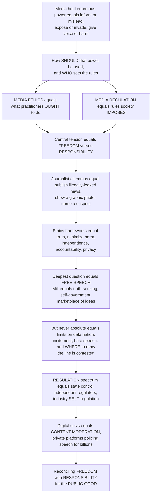

# ⚖️ Media Ethics and Regulation

> [!abstract] TL;DR
> **Media ethics and regulation** are society's twin answers to a single problem: media hold enormous power — to inform or mislead, to expose or invade, to give voice or to harm — so *how should that power be used, and who should set the rules?* **Media ethics** asks what practitioners *ought* to do (the normative, self-imposed side); **media regulation** asks what rules society *imposes* (the coercive, external side). Both orbit one unavoidable tension: **freedom versus responsibility** — the freedom of expression foundational to democracy against the real harms that unrestrained media can cause. Journalists face this daily: publish a newsworthy but illegally leaked document? Show a graphic photo that reveals war's horror but violates a victim's dignity? Name a suspect who may be innocent? Ethics supplies **frameworks** (truth and accuracy, minimizing harm, independence, accountability, fairness, respecting privacy) and **codes** to navigate the clash between the public's *right to know* and individuals' rights to *privacy and dignity*. The deepest questions are about **free speech** itself — justified classically (Mill, Milton) as essential to **truth-seeking**, **self-government**, and **autonomy** via the *marketplace of ideas* — yet never absolute: every society draws limits (defamation, incitement, hate speech, obscenity, national security), and *where* is fiercely contested (American near-absolutism versus European dignity/hate-speech restrictions). **Regulation** spans a spectrum from state control, through independent regulators (Ofcom, FCC), to industry **self-regulation** (press councils, journalistic codes). And the digital age has thrown it all into crisis through **content moderation** — the near-impossible question of whether and how private **platforms** should police the speech of billions without becoming censors. Media ethics and regulation are the perennial struggle to reconcile media's freedom with its responsibilities: the values and rules that try to keep media power serving the public good.

---

## Intuition

**Analogy — the editor at midnight, and the town's single megaphone.** Picture a newspaper editor at the deadline desk holding a leaked government file. Publishing it might expose a genuine scandal the public deserves to know — or wreck an innocent person's life, betray a source, and reward a theft. Nobody handed the editor a rulebook that resolves this; there is only *judgment* — a weighing of the good the story does against the harm it causes. That weighing, done well and consistently, is **media ethics**. Now widen the lens. Imagine the whole town shares *one giant megaphone*, and whoever holds it can be heard by everyone at once — that megaphone is *mass media*. A free society wants **everyone** to be able to speak (freedom of expression is the lifeblood of self-government), but it also knows that a megaphone can spread lies, incite a mob, or shred a reputation faster than any whisper. So the town argues, endlessly, about two things: how the *megaphone-holder ought to behave* (ethics), and what *rules the town should impose* on the megaphone (regulation). Every real controversy in this field is some version of that argument.

That is the whole terrain. Media power cuts both ways — it can **inform or mislead, expose or invade, give voice or harm** — and the field exists in the gap between two goods that pull against each other: the **freedom** of expression that democracy cannot live without, and the **responsibility** not to cause the harms that unrestrained media inflict. Ethics is the *internal* answer (what practitioners owe: truth, minimizing harm, independence, accountability), codified in professional codes and enforced mostly by conscience and reputation. Regulation is the *external* answer (what society enforces), running along a spectrum from outright **state control**, through **independent regulators** who set broadcasting and advertising standards, to industry **self-regulation** by press councils and ombudsmen. Underneath both sits the philosophical bedrock — the case for **free speech** as the engine of **truth-seeking**, **democratic self-rule**, and personal **autonomy**, the *marketplace of ideas* in which good arguments are supposed to defeat bad ones. But the marketplace has never been perfect, free speech has never been absolute, and the digital age has broken the old settlement entirely: when *everyone* holds a megaphone and a handful of private **platforms** decide what billions may say, the question of how to keep media power serving the public good becomes the hardest governance problem of our time — the crisis we now call **content moderation**.

---

## How It Works

### Core mechanics

1. **Two answers to one problem.** Because media wield power to inform or mislead and to give voice or harm, societies developed two responses. **Media ethics** is the normative study of how practitioners and institutions *ought* to act — applied ethics for journalism, advertising, PR, entertainment, and digital media. **Media regulation** is the set of rules society *imposes*. Ethics is largely **self-imposed and internal** (conscience, codes, reputation); regulation is **external and coercive** (law, licences, penalties). Both are attempts to reconcile the same tension.

2. **The central tension — freedom versus responsibility.** Free expression is foundational to democracy; unrestrained media can also defame, incite, deceive, invade privacy, and degrade public discourse. Every dilemma in the field is a point on the line between these two. The **social responsibility theory of the press** (the 1947 Hutchins Commission, *A Free and Responsible Press*) is the classic synthesis: press *freedom* is a public trust that carries public *duties* — accuracy, context, a forum for debate, and representation of society's constituent groups.

3. **The ethical frameworks, applied to media.** Media ethics borrows the standard toolkit of moral philosophy: **consequentialism** (weigh the outcomes — does publishing do more good than harm?), **deontology** (respect duties and rights — truth-telling, keeping promises to sources, human dignity — regardless of outcome), **virtue ethics** (what would a person of good journalistic character do?), **Rawlsian justice** (would the rule be fair from behind a veil of ignorance?), and **care ethics** (attend to relationships and the vulnerable). Real cases usually pit these against each other.

4. **Journalism's core principles and recurring dilemmas.** Practitioner codes (the SPJ *Code of Ethics*, the IFJ *Global Charter*) converge on four pillars: **seek truth and report it** (accuracy, verification), **minimize harm**, **act independently** (avoid conflicts of interest and commercial capture), and **be accountable and transparent**. The recurring dilemmas are the *public's right to know* colliding with a *right to privacy/dignity*: publishing leaked or illegally obtained but newsworthy material, the ethics of graphic images, naming suspects and victims, protecting confidential sources, deception in reporting, and sensationalism versus genuine public interest.

5. **The philosophical core — why free speech.** Three classic justifications. **Truth-seeking:** Milton's *Areopagitica* and Mill's *On Liberty* argue that truth emerges when ideas compete freely — the **marketplace of ideas**; even false speech is useful because it sharpens the true. **Democratic self-government:** citizens cannot rule themselves or check power without freedom to inform, criticize, and debate. **Autonomy / self-realization:** expression is part of what it is to be a free person. Together these make free expression a *foundational* right — but not an *absolute* one.

6. **The limits, and why they are contested.** No society permits *all* speech. Standard categories of restriction: **defamation/libel**, **incitement** to violence and "clear and present danger," **true threats** and harassment, **obscenity**, **hate speech**, **privacy** violations, **copyright/IP**, and **national security**. Mill's **harm principle** — restrict only to prevent harm to others — is the usual dividing line, but "harm" is elastic. The lines are drawn *very* differently across traditions: American **First-Amendment near-absolutism** protects even hateful and offensive speech, while many European and other systems restrict **hate speech** and protect **dignity** — fueling the debates over offense, "cancel culture," and Popper's **paradox of tolerance**.

7. **The regulation spectrum.** Governance runs from **state/statutory control** (licensing content, censorship — at the authoritarian end), through **independent regulators** enforcing content standards (Ofcom, the FCC — decency, accuracy, advertising standards, impartiality rules), to industry **self-regulation and co-regulation** (press councils, ombudsmen, professional codes, market discipline). The **rationales** for intervening: preventing harm, protecting the public interest, decency, fairness, and pluralism — always in tension with press freedom. (The *structural/ownership* side of regulation — who owns the megaphone — is treated in *Media_Ownership_and_Regulation*; this note is the *speech/content/ethics* side.)

8. **The defining contemporary problem — content moderation.** Digital platforms host the speech of *billions*, so the old frameworks built for a few licensed publishers strain to breaking. The hard questions: **should and can** private companies police speech at this scale? The **impossible tradeoff** between **over-removal** (censoring legitimate speech — false positives) and **under-removal** (leaving harm up — false negatives); **who decides** (governments, companies, users, oversight boards — Klonick's "**New Governors**"); **automated versus human** moderation and its human toll; **transparency and due process**; **deplatforming**; **Section 230** and intermediary liability; and new regimes like the **EU Digital Services Act**. Moderating **misinformation** and **hate** without enabling censorship is the crisis where ethics, regulation, and free speech now collide.

### Flow / architecture



---

## Key Concepts

### Secondary (intuitive foundations)
- **Media ethics:** the idea that people who make and share media (journalists, advertisers, film-makers, platforms) *should* behave in certain ways — telling the truth, not causing needless harm, being fair.
- **Media regulation:** the *rules* a society makes for media — some by law, some by industry itself — to keep them fair, honest, and not harmful.
- **Freedom versus responsibility:** the basic clash. Free speech lets people say and publish what they think, which democracy needs; but media can also lie, hurt reputations, or invade privacy — so with freedom comes responsibility.
- **A journalist's dilemma:** should you print a leaked secret that's important but was stolen? Show a shocking photo that tells the truth but hurts a grieving family? Name someone who *might* be innocent? These are the everyday choices ethics tries to guide.
- **Free speech has limits:** you cannot legally lie to destroy someone's reputation (defamation), tell a crowd to attack someone (incitement), or, in many countries, spread hate speech. Every society draws these lines somewhere.

### Undergraduate (mechanisms and evidence)
- **Ethics as internal, regulation as external:** ethics is *self-imposed* (codes, conscience, reputation); regulation is *society-imposed* (law, licences, regulators). They address the same tension from opposite directions.
- **Social responsibility theory (Hutchins Commission, 1947):** press *freedom* is a public trust carrying public *duties* — a bridge between the libertarian "hands-off the press" view and full state control.
- **The four journalistic pillars (SPJ / IFJ codes):** seek truth and report it; minimize harm; act independently; be accountable and transparent. Applied via **consequentialist, deontological, virtue, Rawlsian, and care** reasoning.
- **The right to know versus privacy and dignity:** the master conflict behind most dilemmas — leaked/illegally obtained material, the ethics of the image, naming suspects/victims, source confidentiality, deception, conflicts of interest, sensationalism versus public interest.
- **Three justifications for free speech:** truth-seeking (the **marketplace of ideas** — Milton, Mill), democratic self-government (informed, power-checking citizens), and individual autonomy — grounding a foundational-but-not-absolute right.
- **The harm principle and its limits:** Mill's rule that speech may be restricted only to prevent harm to others — and why "harm" is contested (offense, dignity, group defamation, "true threats").
- **The regulation spectrum and its rationales:** state control → independent regulators (Ofcom, FCC: decency, accuracy, advertising, impartiality) → self-/co-regulation (press councils, ombudsmen). Rationales: harm, public interest, decency, fairness, pluralism.
- **Content moderation as signal detection:** any removal threshold trades **false positives** (over-censorship) against **false negatives** (under-moderation); there is no error-free line, and at platform scale even tiny error rates mean millions of wrong calls.

### Graduate (theory, contestation, and frontiers)
- **The American versus European speech traditions:** First-Amendment near-absolutism (content-neutrality, protection of offensive/hateful speech, the *Brandenburg* incitement test) versus European **militant democracy** and dignity-based **hate-speech** restrictions — a deep normative clash over what "free speech" *means*.
- **Klonick's "New Governors":** private platforms have become the *de facto* governors of online speech, developing quasi-legal internal rule systems, review processes, and appeals (e.g. Meta's Oversight Board) — raising First-Amendment-style due-process questions in a *private* setting where constitutional speech protections do not directly bind.
- **Section 230 and intermediary liability:** the US statute immunizing platforms for third-party content while permitting "good-faith" moderation — the legal scaffolding of the modern internet, now contested from both the "too much removal" and "too little removal" directions; contrast the EU **DSA** and **online-safety** regimes.
- **The scale problem and automation's necessary errors:** human moderation cannot scale to billions of daily decisions, forcing reliance on **automated classifiers** whose irreducible error rate, multiplied by volume, guarantees mass mistakes — and imposing a documented psychological toll on human reviewers of the residual queue.
- **Failure modes of the marketplace of ideas:** the classic model assumes rough equality of access and that truth is "stickier" than falsehood; online, **falsehoods can be cheaper, more novel, and more emotionally engaging**, and **amplification is algorithmically unequal**, so the marketplace can systematically reward misinformation (link to *Misinformation_Disinformation_and_Fake_News*).
- **Christians et al.'s case-and-principle method:** *Media Ethics: Cases and Moral Reasoning* frames ethics as structured deliberation (the Potter Box: facts → values → principles → loyalties) applied to concrete cases rather than abstract rules.
- **Emerging frontiers:** **algorithmic/recommender responsibility** and bias, **surveillance and privacy** ethics under datafication, **deepfakes and synthetic media** ethics, **data ethics**, and the ethics of **attention/engagement design** — the search for accountability across an opaque, automated, globally distributed media ecosystem.

---

## Python Demo

```python
# Media ethics & regulation — modeling the CONTENT-MODERATION dilemma
#   (a) SIGNAL DETECTION: legitimate vs harmful content overlap on a
#       "harmfulness score"; a removal THRESHOLD cannot separate them cleanly,
#       so it must trade FALSE POSITIVES (over-censorship of legit speech)
#       against FALSE NEGATIVES (harmful content left up)
#   (b) THE TRADEOFF CURVE: as the threshold moves, over-censorship and
#       under-moderation trade off — no threshold gives zero error, and the
#       "best" point DEPENDS ON VALUE WEIGHTS (free-expression vs harm-prevention)
#   (c) THE SCALE PROBLEM: at platform scale, even a tiny error rate means
#       MILLIONS of wrong decisions per day -> human review cannot scale and
#       imperfect automation becomes unavoidable
import numpy as np
import matplotlib.pyplot as plt

rng = np.random.default_rng(7)

# ---- Model content as a "harmfulness score" in [0, 1] ----
# Most content is legitimate; a small fraction is genuinely harmful. The two
# distributions OVERLAP, so no score perfectly separates them.
base_rate_harmful = 0.05
N = 200_000
n_harm = int(N * base_rate_harmful)
n_legit = N - n_harm
legit = np.clip(rng.normal(0.35, 0.15, n_legit), 0, 1)   # legitimate speech
harm  = np.clip(rng.normal(0.70, 0.15, n_harm),  0, 1)   # harmful content

# A moderation rule REMOVES everything scoring ABOVE a threshold t.
thresholds = np.linspace(0.0, 1.0, 300)
fp_rate = np.array([(legit > t).mean() for t in thresholds])   # legit wrongly removed
fn_rate = np.array([(harm <= t).mean() for t in thresholds])   # harm wrongly left up

# Convert to counts, then to a weighted "societal cost" under two value systems
FP = fp_rate * n_legit          # over-censorship events
FN = fn_rate * n_harm           # under-moderation events
# free-expression prioritizes NOT silencing legit speech (high weight on FP)
cost_speech = 5.0 * FP + 1.0 * FN
# harm-prevention prioritizes NOT leaving harm up (high weight on FN)
cost_harm   = 1.0 * FP + 5.0 * FN
t_speech = thresholds[np.argmin(cost_speech)]   # optimal threshold, speech-weighted
t_harm   = thresholds[np.argmin(cost_harm)]     # optimal threshold, harm-weighted

fig, ax = plt.subplots(1, 3, figsize=(16, 4.6))

# (a) the two overlapping distributions and a chosen threshold
t_show = 0.55
ax[0].hist(legit, bins=60, density=True, alpha=0.6, color="#2980b9",
           label="Legitimate speech")
ax[0].hist(harm,  bins=60, density=True, alpha=0.6, color="#c0392b",
           label="Harmful content")
ax[0].axvline(t_show, color="black", ls="--", lw=2, label=f"Removal threshold t={t_show}")
ax[0].text(0.72, 2.2, "FALSE POSITIVES\n(legit removed)", color="#2980b9", fontsize=8)
ax[0].text(0.06, 2.2, "FALSE NEGATIVES\n(harm left up)", color="#c0392b", fontsize=8)
ax[0].set_xlabel("Harmfulness score"); ax[0].set_ylabel("Density")
ax[0].set_title("(a) No score separates them cleanly")
ax[0].legend(fontsize=7, loc="upper center")

# (b) the unavoidable tradeoff as the threshold moves
ax[1].plot(thresholds, fp_rate, color="#2980b9", lw=2,
           label="Over-censorship (false-positive rate)")
ax[1].plot(thresholds, fn_rate, color="#c0392b", lw=2,
           label="Under-moderation (false-negative rate)")
ax[1].axvline(t_speech, color="#2980b9", ls=":", lw=1.5,
              label=f"Free-expression optimum t={t_speech:.2f}")
ax[1].axvline(t_harm, color="#c0392b", ls=":", lw=1.5,
              label=f"Harm-prevention optimum t={t_harm:.2f}")
ax[1].set_xlabel("Moderation threshold (strict <- -> lax)")
ax[1].set_ylabel("Error rate")
ax[1].set_title("(b) No zero-error line; 'best' depends on values")
ax[1].legend(fontsize=7)

# (c) the scale problem: wrong decisions per day = error_rate x daily volume
volumes = np.logspace(3, 9, 100)          # posts moderated per day: 1e3 .. 1e9
for err, c in [(0.001, "#16a085"), (0.01, "#e67e22"), (0.05, "#c0392b")]:
    ax[2].loglog(volumes, err * volumes, lw=2, color=c,
                 label=f"{err*100:.1f}% error rate")
ax[2].scatter([1e9], [0.001 * 1e9], s=70, color="#16a085", zorder=3)
ax[2].annotate("1B posts x 0.1% =\n1 MILLION wrong/day",
               xy=(1e9, 0.001 * 1e9), xytext=(3e5, 5e6), fontsize=8,
               arrowprops=dict(arrowstyle="->", color="black"))
ax[2].set_xlabel("Decisions per day (log)")
ax[2].set_ylabel("Wrong decisions per day (log)")
ax[2].set_title("(c) At scale, tiny error rates = mass mistakes")
ax[2].legend(fontsize=8)

plt.tight_layout()
plt.savefig("media_ethics_content_moderation.png", dpi=120)
print(f"Free-expression-optimal threshold: {t_speech:.2f} "
      f"(FP={FP[np.argmin(cost_speech)]:.0f}, FN={FN[np.argmin(cost_speech)]:.0f})")
print(f"Harm-prevention-optimal threshold: {t_harm:.2f} "
      f"(FP={FP[np.argmin(cost_harm)]:.0f}, FN={FN[np.argmin(cost_harm)]:.0f})")
print(f"At 1e9 decisions/day, a 0.1% error rate = {0.001*1e9:,.0f} wrong decisions/day")
```

Panel **(a)** shows *why* moderation is hard even in principle: legitimate speech and harmful content overlap on any "harmfulness" signal, so any single **removal threshold** must cut through the overlap — removing some legitimate speech (**false positives**, over-censorship) *and* leaving some harm up (**false negatives**, under-moderation). Panel **(b)** turns this into the unavoidable **tradeoff**: as the threshold moves from strict to lax, over-censorship falls exactly as under-moderation rises — there is **no threshold with zero error**, and the "right" point is a *value judgment*, not a technical fact. Weighting free expression more heavily pushes the optimum toward a **laxer** threshold (tolerate more harm to avoid silencing speech); weighting harm-prevention pushes it **stricter** (tolerate more over-censorship to remove harm). Panel **(c)** delivers the point that breaks the old frameworks: because wrong decisions scale with **volume**, a platform making a billion decisions a day at even a **0.1% error rate** commits a **million** wrong decisions *daily* — which is why human review cannot scale, imperfect automation is unavoidable, and *some* mass of both wrongful takedowns and missed harms is mathematically guaranteed no matter how the rules are written.

---

## Real-World Applications

- **The Pentagon Papers (1971) and WikiLeaks:** the archetypal "publish the illegally leaked but newsworthy document" dilemma — the *New York Times* and later WikiLeaks/*Guardian* weighing the public's right to know against legality, source welfare, and national-security harm. The US Supreme Court's *New York Times Co. v. United States* enshrined a strong presumption against **prior restraint**.
- **Meta's Oversight Board:** an independent body that reviews and can overturn the company's content-moderation decisions (including the Trump deplatforming case) — a concrete instance of Klonick's "**New Governors**" building quasi-judicial due process inside a private speech system.
- **Section 230 and the EU Digital Services Act:** the two poles of platform governance — US intermediary immunity that enabled the open internet versus the EU's obligations for risk assessment, notice-and-action, and transparency — the live regulatory frontier for moderating misinformation and hate.
- **Ofcom and the FCC:** independent regulators enforcing broadcasting **impartiality**, accuracy, decency, and advertising standards — the "independent regulator" middle of the regulation spectrum, now extended (via the UK Online Safety Act) toward platforms.
- **The graphic-image debate (Alan Kurdi, war photography):** newsroom decisions to publish images that reveal a truth the public should confront while risking the dignity of victims — the ethics of the image weighing truth-telling against minimizing harm.
- **Defamation and "true threats" litigation:** libel suits and cases like *New York Times v. Sullivan* (actual-malice standard) and *Brandenburg v. Ohio* (imminent-incitement test) show where and how the law operationalizes the *limits* of protected speech.

---

## Common Pitfalls

- **Treating free speech as absolute (or as nonexistent).** Neither extreme survives contact with reality: *every* society limits speech (defamation, incitement, threats), yet those limits are narrow and contested. The serious question is never "free speech: yes or no?" but *where* and *how* the lines are drawn — and by whom.
- **Conflating "legal" with "ethical."** Something can be perfectly lawful to publish yet ethically wrong (naming a rape victim, running a gratuitously cruel image), and vice versa. Regulation sets a *floor*; ethics asks for more. Collapsing the two erases the whole normative layer.
- **Assuming moderation can be made error-free.** The signal-detection tradeoff is mathematical: over- and under-removal cannot both be driven to zero, and at scale *some* mass of each is guaranteed. Demands for "just remove all the harm and none of the speech" are incoherent; the real debate is about *where* to set the threshold and *who* bears the errors.
- **Importing one country's speech norms as universal.** The American First-Amendment tradition and European dignity/hate-speech traditions rest on genuinely different values; assuming either is the "neutral" default (especially when platforms export one nation's rules globally) obscures a real normative clash.
- **Ignoring who decides.** "The platform should take this down" and "the platform should leave this up" both hand enormous, largely unaccountable power to private companies. Content moderation is not just *what* rules but *who* legitimately makes and reviews them — the "New Governors" problem.
- **Mistaking the marketplace of ideas for a law of nature.** "Good ideas win in the end" assumes rough equality of access and that truth is stickier than falsehood; online amplification is unequal and falsehoods can be cheaper and more engaging, so the marketplace can fail — which is exactly what misinformation exploits.

---

## Related Concepts

- [[Ethical_Frameworks_in_Practice]] — the applied-ethics toolkit (consequentialism, deontology, virtue, Rawlsian justice, care ethics) that media ethics adapts to newsroom and platform dilemmas.
- [[Moral_Reasoning_and_Case_Analysis]] — the case-and-principle method (of the kind in Christians et al.'s *Media Ethics*) for reasoning through concrete conflicts rather than abstract rules.
- [[Liberty_and_Rights]] — Mill's *On Liberty* and the **harm principle**, the philosophical bedrock of the free-speech case and of where its limits legitimately fall.
- [[Rights_and_Civil_Liberties]] — the constitutional free-speech / First-Amendment protections that both empower media and constrain what regulation may do.
- [[Human_Rights_Law]] — free expression as an international human right (ICCPR Art. 19) and its permissible limitations, the transnational frame for speech norms.
- [[Tort_Law]] — **defamation/libel** as the classic private-law limit on speech, balancing reputation against expression.
- [[Intellectual_Property_Law]] — **copyright** as a content limit and a recurring pressure point in what media may publish and platforms must remove.
- [[Administrative_Law_and_Regulation]] — the legal machinery (rule-making, licensing, enforcement) through which independent regulators like Ofcom and the FCC actually operate.
- [[Privacy_and_Data_Protection]] — the legal right to privacy that constrains intrusive reporting and grounds the "right to know versus privacy" dilemma.
- [[Privacy_Surveillance_and_Data_Ethics]] — the ethical frontier of surveillance and datafication that extends media ethics into the digital ecosystem.
- [[Algorithmic_Fairness_and_Bias]] — algorithmic and recommender responsibility, a core emerging frontier of media ethics and platform governance.
- [[Liberalism_and_Its_Variants]] — the liberal tradition (Mill included) that supplies the classic justifications for free expression and its role in self-government.
- [[Media_Propaganda_and_Political_Communication]] — the political-communication view of media's persuasive power; the harms this power can do are exactly what media ethics and regulation try to check.

Within this vault, *Media_Ethics_and_Regulation* is the **normative capstone** of the media-power section: it supplies the ethics-and-speech-governance counterpart to the structural-and-ownership analysis in *Media_Ownership_and_Regulation* (this note is content/speech/ethics; that one is who-owns-the-megaphone); it turns the content-moderation and curation mechanics of *Platforms_Algorithms_and_Curation* into a governance problem; it provides the values and rules that *Media_and_Democracy_the_Public_Sphere* needs to keep the public sphere healthy; and it directly frames the frontier problems taken up in *Misinformation_Disinformation_and_Fake_News*, *Surveillance_Privacy_and_Datafication*, *AI_Generated_Media_and_Deepfakes*, and *Media_Literacy_and_Critical_Consumption* — the ethical and regulatory response to a world where everyone publishes.

---

## Review Questions

1. **(Secondary)** A journalist is handed a leaked document that reveals real wrongdoing but was stolen and would expose a private individual. In your own words, what values are in conflict, and how might the ideas of "the public's right to know" and "minimizing harm" help decide what to do?
2. **(Secondary)** Explain the difference between **media ethics** and **media regulation**. Give one example of each — a rule a media company might set for *itself*, and a rule a government might *impose*.
3. **(Undergraduate)** State the three classic justifications for free speech (truth-seeking, self-government, autonomy) and explain what the "marketplace of ideas" claims. Then give one reason the marketplace might *fail* in a digital environment.
4. **(Undergraduate)** Using the content-moderation tradeoff, explain why no removal threshold can eliminate both over-censorship and under-moderation at once, and why "the platform should remove all harm and no legitimate speech" is incoherent.
5. **(Graduate)** Compare the American First-Amendment near-absolutist tradition with European dignity/hate-speech restrictions. What underlying values differ, and what problems arise when a global platform must apply *one* set of rules to *all* countries?
6. **(Graduate)** Klonick calls platforms the "New Governors" of online speech. Evaluate whether private companies deciding what billions may say is a legitimate form of governance — and what mix of self-regulation, independent oversight (e.g. an Oversight Board), and state regulation (Section 230, the DSA) could make it accountable without becoming censorship.

---

## Sources

- Christians, C. G., Fackler, M., Richardson, K. B., Kreshel, P., & Woods, R. H. *Media Ethics: Cases and Moral Reasoning.* Routledge (frameworks, cases, and the Potter Box method).
- Mill, J. S. (1859). *On Liberty* (the harm principle and the free-speech / marketplace-of-ideas argument).
- Klonick, K. (2018). "The New Governors: The People, Rules, and Processes Governing Online Speech." *Harvard Law Review*, 131(6), 1598–1670.
- Commission on Freedom of the Press (Hutchins Commission) (1947). *A Free and Responsible Press* (the social responsibility theory of the press).
- Society of Professional Journalists, *SPJ Code of Ethics*, and the International Federation of Journalists, *Global Charter of Ethics for Journalists* (practitioner principles: truth, minimizing harm, independence, accountability).

---

#media-studies #media-ethics #media-regulation #free-speech #content-moderation
