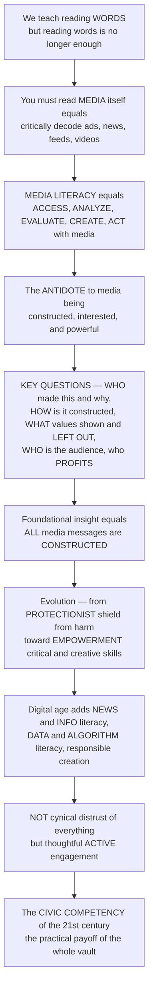

# 🧭 Media Literacy and Critical Consumption

> [!abstract] TL;DR
> **We teach children to read and write text — but in a world drowning in media, being able to read WORDS is no longer enough.** You must be able to "read" **media itself**: to look at an ad, a news story, a viral video, an algorithmic feed, or a TikTok and critically **decode what it is really doing**. That skill is **media literacy** — the ability to **ACCESS, ANALYZE, EVALUATE, CREATE, and ACT** with media in all its forms (the NAMLE / Aspen definition). If this whole vault reveals that media are **constructed, interested, and powerful** — that they shape reality, carry ideology, and serve commercial and political agendas — then media literacy is the practical **antidote**: the citizen's toolkit for not being a passive dupe. At its core sits a handful of powerful **key questions** you learn to ask of *any* message: **WHO** created this, and why? **HOW** is it constructed — what techniques (framing, editing, imagery, emotional appeals) attract my attention and shape meaning? **WHAT** values, viewpoints, and lifestyles are shown — and what is **LEFT OUT**? **WHO** is the target audience, and how might different people read it differently? And who **PROFITS**? The foundational insight, from the media-literacy pioneers, is that **all media messages are CONSTRUCTED** — they are not windows on reality but *made things*, with choices and agendas behind them. The field has evolved from an early **protectionist** stance (shielding people, especially children, from media's bad effects) toward an **empowerment** model (giving people the critical and creative skills to navigate, question, and participate on their own terms). And in the digital age it is more essential — and more demanding — than ever: **news / information literacy** (spotting misinformation, evaluating sources, *lateral reading*), **data and algorithm literacy** (understanding how platforms shape what you see), and the skills to **create media responsibly**. Media literacy is **not cynical distrust of everything** — it is thoughtful, informed, **active engagement**. It is the essential **civic competency of the twenty-first century**, and the applied payoff of everything else in this vault.

---

## Intuition

**Analogy — learning to "read" the media the way you learned to read words.** Think back to first grade. You were handed the alphabet and, letter by letter, taught the astonishing power of **literacy**: to turn marks on a page into meaning, and meaning into marks. That power made you a participant rather than a bystander — you could read the sign, sign the form, question the letter, write your own reply. But now step out of the classroom into your actual day: a phone that shows you a hundred images before breakfast, an ad that follows you across three apps, a news headline engineered to make you furious, a video edited to feel candid, a feed assembled *just for you* by a machine you cannot see. **Being able to read the words on all of that is no longer enough.** The words are the smallest part of the message. To be genuinely literate *now*, you must be able to read the **media itself** — to look at the ad, the headline, the clip, the feed, and ask what it is really *doing* to you, and *for whom*.

That second, deeper literacy is **media literacy**, and it is best defined not by what you consume but by what you can *do*: **access** media, **analyze** it, **evaluate** it, **create** it, and **act** with it. Its heart is a small set of habits of mind — **key questions** you learn to fire at any message automatically. *Who made this, and why — what is their purpose and interest?* *How is it built — what techniques of framing, editing, imagery, music, and emotional appeal are shaping how I feel before I have even thought?* *What values, viewpoints, and lifestyles does it show as normal or desirable — and, just as important, what does it leave out?* *Who is this aimed at, and would my grandmother, my neighbour, a stranger across the world read it the same way I do?* *And who profits or gains power from my believing it?* Underneath every one of these questions lies a single foundational idea, the one the pioneers put first: **all media messages are constructed.** A news bulletin is not a transparent window onto the world; it is a *made object*, the product of a thousand choices about what to show, whom to quote, how to cut, what to headline, and what to bury — choices that serve interests. Once you truly see that, you can never quite un-see it.

Here is the crucial part, though, because media literacy is easy to caricature. It is **not** the sneer of the person who "trusts nothing" and "knows it's all fake" — that cynicism is just gullibility wearing a leather jacket, and it is exactly what propagandists want (if nothing is true, the loudest liar wins). Media literacy is the opposite: **calibrated, active, informed engagement** — trusting the reliable *and* distrusting the unreliable, and being able to tell them apart. That is a *skill*, and skills can be taught, practised, and measured. The field that teaches them has itself grown up: it began in a **protectionist** crouch — media are dangerous, so let us *shield* children from their effects — and matured into an **empowerment** stance — media are powerful *and* pleasurable, so let us give people the critical and creative capacity to navigate, question, and *make* them. In the digital age this toolkit has had to expand fast: to **news and information literacy** (evaluating sources, cross-checking, spotting the fake), to **data and algorithm literacy** (grasping how the invisible feed decides what reaches you), and to **responsible creation** (because now *everyone* is a publisher). Understanding media literacy is understanding the one competency that turns all the critical theory in this vault — representation, ideology, propaganda, platform power — from abstract knowledge into **personal and civic power**: the practical means by which an ordinary person reclaims agency in a media-saturated world.

---

## How It Works

### Core mechanics

1. **Media literacy defined — five verbs, not a body of facts.** The influential NAMLE / Aspen Institute formulation frames media literacy as **the ability to ACCESS, ANALYZE, EVALUATE, CREATE, and ACT using all forms of communication.** It is a *competency*, an extension of print literacy from reading-and-writing *text* to "reading-and-writing" *media*. Renee Hobbs stresses that these five are interlocking: you cannot fully *evaluate* what you cannot *create*, and the point of it all is to *act* — to participate as an informed citizen.

2. **The foundational principle — all media messages are constructed.** The Center for Media Literacy's field-defining move was to boil the whole enterprise down to **five core concepts**, each paired with a **key question**. Concept one is the root of the rest: media are not transparent reflections of reality but **made things**, assembled through selection and choice. Everything else follows from taking that seriously (link *Cultural Studies and Representation* — the theory of the "constructedness" media literacy operationalizes).

3. **The five core concepts and their key questions.** (1) **All media messages are constructed** → *Who created this message?* (2) Media are built using a **creative language** with its own rules and techniques → *What techniques are used to attract my attention?* (3) **Different people experience the same message differently** (active audiences) → *How might others understand this differently from me?* (4) Media carry embedded **values and points of view** → *What lifestyles, values, and viewpoints are represented — or omitted?* (5) Media are organized to gain **profit and/or power** → *Why is this message being sent?* Aspen's shorthand adds **representation** and **response**. The practical skill is turning these from a poster on the wall into a *reflex*.

4. **Critical autonomy — the goal, not compliance.** Len Masterman argued the aim is **critical autonomy**: the learner's capacity to analyze *any* media text on their own, transferably, long after the lesson ends — not to memorize a list of "good" and "bad" media. This is why media literacy is a form of **critical pedagogy** (Freire): it seeks an emancipated, questioning subject, not an obedient one (link *Transfer of Learning* — whether the skill survives outside the classroom is the field's central empirical worry).

5. **The two paradigms — protection vs empowerment.** Media-literacy education has swung between two poles. The **protectionist / inoculation** paradigm (roots in F. R. Leavis, and in mid-century fears of mass media) treats audiences — especially children — as vulnerable and seeks to *defend* them against media's manipulation and harmful effects. The **cultural-studies / empowerment** paradigm (Masterman, David Buckingham, Hobbs) respects audience agency and *pleasure*, and aims to build critical *and* creative capacity and participation. Most modern practice blends them, but the center of gravity has shifted decisively toward empowerment.

6. **The analysis toolkit — deconstruction.** Applied media literacy is a set of **deconstruction** skills: taking apart advertising and persuasion techniques (link *Propaganda and Persuasion*); analyzing news for **framing, bias, sourcing, and selection** (link *Agenda-Setting, Priming and Framing* and *Journalism and News Production*); reading **representation and stereotypes** (link *Gender, Race and Identity in Media*); recognizing genre and narrative conventions; and "reading against the grain" — asking what a text assumes and whom it serves (link *Ideology, Hegemony and Media*).

7. **The digital expansion — news, data, and algorithm literacy.** The internet added new sub-literacies. **News / information literacy** fights misinformation through source evaluation — the **lateral reading** technique (Wineburg & McGrew's Stanford work: instead of scrutinizing a suspicious page *vertically*, you *leave it*, open new tabs, and check what the wider web says about the source, the way professional fact-checkers do), plus heuristics like **SIFT** (Stop, Investigate the source, Find better coverage, Trace claims) and **CRAAP** (link *Misinformation, Disinformation and Fake News*). **Data and algorithm literacy** means understanding **datafication** and how platforms and recommendation algorithms shape what you see (link *Platforms, Algorithms and Curation*). And **AI literacy** now extends this to synthetic media (link *AI-Generated Media and Deepfakes*).

8. **The calibration goal — critical trust, not blanket distrust.** The subtle, essential target is **accurate discrimination**: the well-calibrated consumer *trusts reliable sources and distrusts unreliable ones*, avoiding **both** the naive over-truster (fooled by anything slick) **and** the cynic who wrongly rejects everything. Poorly designed "media literacy" that just breeds suspicion can make people *less* informed ("nothing is true, so believe your gut"). The evidence says the intervention works — but its aim must be discernment, not cynicism, and it cannot substitute for **structural** fixes (regulation, platform design) by offloading systemic problems onto individuals.

### Flow / architecture



---

## Key Concepts

### Secondary (intuitive level)
- **Media literacy is "reading" media, not just words.** You learned to read text; now you learn to read the ad, the news clip, the feed — to figure out what it is really *doing* and *for whom*.
- **The five verbs.** Being media literate means you can **access**, **analyze**, **evaluate**, **create**, and **act** with media — not just watch it.
- **All media messages are made.** Nothing you see is a plain "window on reality." Someone chose the words, the images, the cut, the headline — and made those choices for a reason.
- **The key questions.** For anything you see, ask: **Who** made this and **why**? **How** is it built to grab me? **What** does it show as normal, and what does it leave out? **Who** is it aimed at? **Who** profits?
- **It is not "trust nothing."** Being cynical about everything is just being fooled in a different way. The goal is to tell reliable from unreliable — trust the good sources, doubt the bad ones.
- **Read sideways.** When something online looks fishy, don't stare harder at *that* page — open new tabs and ask what the rest of the internet says about who is behind it. That is **lateral reading**.

### Undergraduate (working level)
- **The NAMLE / Aspen definition.** Media literacy as the ability to **access, analyze, evaluate, create, and act** using all forms of communication; media literacy as a *literacy* for the media age, extending print's reading/writing to "reading/writing" media (Hobbs).
- **The five core concepts and key questions (Center for Media Literacy).** Constructed messages; a creative **language** of media; **differential decoding** by active audiences (link *Encoding, Decoding and Audience Reception*); embedded **values and viewpoints** plus **omissions**; organization for **profit and power**.
- **Critical autonomy (Masterman).** The transferable capacity to analyze any text independently — the true aim, versus teaching a canon of approved media.
- **Protection vs empowerment.** The inoculation/protectionist paradigm (Leavis; defend the vulnerable) versus the cultural-studies/empowerment paradigm (Buckingham, Hobbs; agency, pleasure, participation); media literacy as **critical pedagogy** (Freire).
- **The deconstruction toolkit.** Analyzing **framing, bias, selection, and sourcing** in news (link agenda-setting / journalism); decoding **advertising and persuasion**; reading **representation and stereotype**; genre and narrative conventions; "reading against the grain."
- **News / information literacy.** **Lateral reading** (Wineburg & McGrew), **SIFT** (Caulfield), and **CRAAP** as concrete procedures for source evaluation and spotting mis/disinformation.
- **Data, algorithm, and digital-citizenship literacies.** Understanding datafication and how algorithms curate feeds; privacy and security literacy; participatory / creation literacies (producing media responsibly).

### Graduate (theoretical level)
- **Literacy as social practice, not a fixed skill.** New Literacy Studies (the "multiliteracies" agenda of the New London Group) reframes media literacy as **situated social practice** varying by context, community, and power — not a neutral ladder of competencies; Buckingham's caution against reducing it to a checklist.
- **The empowerment / protection dialectic and its politics.** How the paradigm you adopt encodes a theory of the audience (dupe vs agent) and of power; the risk that "protection" becomes moral panic and gatekeeping, and that "empowerment" becomes an alibi for deregulation and *individual responsibilization* of structural problems.
- **The evidence base and its limits.** Meta-analytic and experimental findings that media-literacy interventions improve critical knowledge and **misinformation resistance** (including *psychological inoculation* / prebunking, Roozenbeek & van der Linden); but with heterogeneous, sometimes short-lived effects, ceiling and transfer problems, and the documented **backfire risk** of breeding indiscriminate cynicism ("truth decay") rather than **calibrated** trust.
- **The calibration objective formalized.** The goal is not maximal skepticism but **accurate discrimination** — high sensitivity *and* high specificity in a signal-detection sense — so that trust tracks reliability. Both over-trust and reflexive distrust are calibration failures (link *Calibration and Illusions of Competence*).
- **The dual-process account of susceptibility.** Why fast, intuitive **System 1** processing lets slick surface cues and motivated reasoning override truth, and why lateral reading is effortful **System 2** work (link *Dual Process Theory* and *Confirmation Bias and Motivated Reasoning*); the classic finding that domain novices judge credibility by design and tone, experts by provenance.
- **Individual skill vs structural solution.** The debate over whether media literacy can scale to the problem, keep pace with technology, and whether centering *individual* competence lets **platforms and regulators** off the hook (link *Platforms, Algorithms and Curation*; *Media Ethics and Regulation*); media literacy as necessary-but-insufficient, paired with design and policy.
- **Equity and the second-level divide.** Media-literacy capacity is itself unevenly distributed — a "second-level digital divide" of *skills*, not just access — so literacy programs can widen gaps unless designed for equity (link *Digital Divide and Media Access*).

---

## Python Demo

```python
# Media literacy & critical consumption -- three linked demonstrations of the PAYOFF:
#   (a) LATERAL vs NAIVE reading -- a signal-detection view of source evaluation.
#       A "naive"/vertical reader judges credibility by SURFACE CUES (slick design,
#       confident tone) that barely track real reliability -> poor discrimination,
#       fooled by professional-looking junk. A skilled "LATERAL" reader checks the
#       source's reputation and cross-references (the key questions) -> a much stronger
#       signal -> far higher accuracy. We plot ROC curves + AUC for each.
#   (b) INOCULATION / TRAINING dose-response -- as media-literacy training increases,
#       a trained group's RESISTANCE to manipulation rises steeply, while an untrained
#       group stays flat and vulnerable.
#   (c) CALIBRATION vs CYNICISM -- the goal is ACCURATE DISCRIMINATION (trust tracks
#       reliability), NOT blanket distrust. We contrast a well-calibrated critical
#       consumer against a naive OVER-TRUSTER and a cynical OVER-DISTRUSTER.
import numpy as np
import matplotlib.pyplot as plt

rng = np.random.default_rng(7)

# --------------------------------------------------------------------------- #
# (a) Lateral vs naive reading: discrimination between reliable & unreliable
# --------------------------------------------------------------------------- #
n = 1500
reliability = rng.uniform(0, 1, n)          # latent true reliability of each source
reliable = reliability > 0.5                # ground truth label

# NAIVE cue: surface slickness -- barely (even slightly negatively) tracks reliability,
# because junk is often the most professionally packaged. Lots of noise -> near chance.
naive_signal = 0.10 * (reliability - 0.5) + rng.normal(0, 0.40, n)
# LATERAL signal: checking reputation / cross-referencing recovers true reliability well.
lateral_signal = 0.90 * (reliability - 0.5) + rng.normal(0, 0.12, n)

def roc(score, label):
    order = np.argsort(-score)              # rank as "credible" from highest score down
    y = label[order].astype(float)
    tpr = np.concatenate([[0], np.cumsum(y) / y.sum()])
    fpr = np.concatenate([[0], np.cumsum(1 - y) / (1 - y).sum()])
    auc = np.trapz(tpr, fpr)
    return fpr, tpr, auc

fpr_n, tpr_n, auc_n = roc(naive_signal, reliable)
fpr_l, tpr_l, auc_l = roc(lateral_signal, reliable)

# --------------------------------------------------------------------------- #
# (b) Inoculation / training dose-response: resistance to manipulation
# --------------------------------------------------------------------------- #
dose = np.linspace(0, 1, 60)                        # amount of media-literacy training
resistance_trained = 0.22 + 0.68 / (1 + np.exp(-9 * (dose - 0.45)))  # rises steeply
resistance_untrained = np.full_like(dose, 0.22)    # flat, stays vulnerable

# --------------------------------------------------------------------------- #
# (c) Calibration vs cynicism: does assigned trust track true reliability?
# --------------------------------------------------------------------------- #
r = np.linspace(0, 1, 100)
critical = r                                        # well-calibrated: trust = reliability
over_truster = np.full_like(r, 0.82)               # naive: trusts almost everything
cynic = np.full_like(r, 0.15)                       # cynic: distrusts everything
mse = lambda t: np.mean((t - r) ** 2)              # calibration error vs the ideal

# --------------------------------------------------------------------------- #
# Plots
# --------------------------------------------------------------------------- #
fig, ax = plt.subplots(1, 3, figsize=(16, 4.8))

ax[0].plot(fpr_l, tpr_l, color="#2563eb", lw=2.8,
           label=f"LATERAL reader (AUC={auc_l:.2f})")
ax[0].plot(fpr_n, tpr_n, color="#dc2626", lw=2.6,
           label=f"NAIVE / surface reader (AUC={auc_n:.2f})")
ax[0].plot([0, 1], [0, 1], color="gray", ls=":", lw=1.4, label="pure chance")
ax[0].set_title("(a) Lateral vs naive source evaluation\n(separating reliable from unreliable)")
ax[0].set_xlabel("false alarms: unreliable rated credible")
ax[0].set_ylabel("hits: reliable rated credible")
ax[0].set_xlim(0, 1); ax[0].set_ylim(0, 1); ax[0].legend(fontsize=8, loc="lower right")

ax[1].plot(dose, resistance_trained, color="#059669", lw=2.9,
           label="Trained group (inoculated)")
ax[1].plot(dose, resistance_untrained, color="#9ca3af", lw=2.4, ls="--",
           label="Untrained group")
ax[1].fill_between(dose, resistance_untrained, resistance_trained,
                   color="#059669", alpha=0.12)
ax[1].set_title("(b) Media-literacy training:\ndose-response of resistance")
ax[1].set_xlabel("amount of media-literacy training")
ax[1].set_ylabel("resistance to manipulation")
ax[1].set_ylim(0, 1); ax[1].legend(fontsize=8, loc="center right")

ax[2].plot(r, critical, color="#2563eb", lw=2.9,
           label=f"Critical consumer (err={mse(critical):.2f})")
ax[2].plot(r, over_truster, color="#ea580c", lw=2.4, ls="--",
           label=f"Naive over-truster (err={mse(over_truster):.2f})")
ax[2].plot(r, cynic, color="#7c3aed", lw=2.4, ls="--",
           label=f"Cynic over-distruster (err={mse(cynic):.2f})")
ax[2].set_title("(c) Calibration, not cynicism:\ntrust should TRACK reliability")
ax[2].set_xlabel("true reliability of source")
ax[2].set_ylabel("trust assigned")
ax[2].set_xlim(0, 1); ax[2].set_ylim(0, 1); ax[2].legend(fontsize=8, loc="upper left")

plt.tight_layout()
plt.show()

# Key readings
print(f"(a) Discrimination AUC: naive/surface={auc_n:.2f}  ->  lateral/skilled={auc_l:.2f}")
print(f"(b) Resistance at full training: untrained={resistance_untrained[-1]:.2f}  ->  "
      f"trained={resistance_trained[-1]:.2f}")
print(f"(c) Calibration error (lower=better): critical={mse(critical):.2f}, "
      f"over-truster={mse(over_truster):.2f}, cynic={mse(cynic):.2f}")
```

Panel **(a)** turns source evaluation into a **signal-detection** problem and makes the payoff of skill undeniable: the **naive** reader, judging credibility by slick design and confident tone, produces an ROC curve hugging the diagonal (AUC near chance) — professional-looking junk fools them as often as real reporting — while the **lateral** reader, who leaves the page to check the source's reputation and cross-reference, produces a curve bowing sharply toward the top-left corner (high AUC), reliably separating trustworthy from untrustworthy. Panel **(b)** shows the **inoculation** logic behind media-literacy education: as training increases, the trained group's **resistance to manipulation climbs steeply** while the untrained group stays flat and exposed — a dose-response that mirrors real prebunking studies. Panel **(c)** encodes the field's most misunderstood point: the ideal is the **diagonal** — a critical consumer whose *trust tracks true reliability* (calibration error near zero) — and **both** the naive over-truster (flat-high) **and** the reflexive cynic (flat-low) miss it badly. Media literacy aims at **accurate discrimination**, not the empty triumph of "trusting nothing."

---

## Real-World Applications

- **News literacy against misinformation.** Programs like the **Stanford History Education Group's** "Civic Online Reasoning" curriculum and the **News Literacy Project's** *Checkology* teach **lateral reading** and source evaluation to millions of students — the direct classroom instantiation of panel (a), reliably raising students' ability to spot manipulated and low-credibility content.
- **Psychological inoculation / prebunking at platform scale.** Games like **Bad News** and **Go Viral!** and Google/Jigsaw's **prebunking** video campaigns "vaccinate" audiences against manipulation techniques *before* exposure — the empirical face of panel (b), deployed across YouTube and social platforms during elections and the COVID "infodemic."
- **National media-literacy education.** **Finland's** cross-curricular media-literacy program is the celebrated model of a whole society treating critical media reading as core civic education — repeatedly linked to high resilience against disinformation in European comparisons.
- **Deconstructing advertising and persuasion.** Ad-analysis exercises (Who is this selling to? What lifestyle does it equate with the product? What is omitted?) teach the CML key questions on real campaigns — foundational media-education practice from primary school onward.
- **Library and information-literacy frameworks.** The **ACRL Framework for Information Literacy** and heuristics like **CRAAP** and **SIFT** operationalize source evaluation in higher education and public libraries — infrastructure for evaluating scholarly and web sources alike.
- **Algorithm and data literacy initiatives.** Efforts teaching users *how feeds are curated* — from "why am I seeing this ad?" transparency tools to school units on recommendation algorithms — extend literacy to the invisible machinery of curation (link *Platforms, Algorithms and Curation*).
- **Health and civic infodemic response.** Public-health "infodemic management" and vaccine-misinformation programs apply media/information literacy to health claims, showing both the promise and the limits of literacy as a public-health intervention.

---

## Common Pitfalls

- **Confusing media literacy with cynicism.** The single most damaging error: teaching people to "distrust everything" instead of to *discriminate*. A cynic who rejects all sources is not literate — they are the propagandist's ideal target ("nothing is true, so believe your side"). The goal is **calibration**, not maximal doubt (panel c).
- **Vertical reading — staring harder at the suspicious page.** Novices dwell *on* a dubious site, judging its credibility by its own polish and confident prose. That is exactly how slick junk wins. The fix is **lateral reading**: leave the page and ask the wider web who is behind it.
- **Treating "constructed" as "therefore false or worthless."** Recognizing that all media are *made* (selected, framed, edited) does **not** mean all media are equally untrue. A rigorously reported investigation and a fabricated rumour are *both* constructed — but they are not equally reliable. Constructedness is an invitation to analyze, not to dismiss.
- **Checklist literacy without critical autonomy.** Drilling CRAAP or a five-point checklist without building transferable *judgment* produces students who can score a worksheet but freeze on a novel, ambiguous real-world source. Masterman's **critical autonomy** — and genuine **transfer** — is the target, not procedure-following.
- **Offloading structural problems onto individuals.** Framing misinformation, surveillance, and engagement-driven harm as things people should just "be more literate" about lets **platforms and regulators** escape responsibility. Media literacy is necessary but *insufficient*; it must accompany design and policy fixes, not replace them.
- **Ignoring the skills divide.** Assuming everyone can equally acquire these competencies ignores the **second-level digital divide** — unequal skills, time, and support — so poorly designed programs can *widen* gaps (link *Digital Divide and Media Access*).
- **Assuming the toolkit is finished.** News, data, algorithm, and now **AI / deepfake** literacy keep the target moving. A curriculum built for 2010's hoaxes will not equip anyone for synthetic video and generative feeds; media literacy must be continuously updated (link *AI-Generated Media and Deepfakes*).

---

## Related Concepts

- [[Media_Literacy_and_Source_Evaluation]] — the **critical-thinking / epistemology** companion to this note. That note supplies the logician's procedure (SIFT, CRAAP, lateral reading as belief-justification); *this* note gives the **media-studies** view — media literacy as the applied capstone of representation, ideology, and platform power. Distinct, complementary halves of the same skill.
- [[Cognitive_Biases_and_Heuristics]] — the mental shortcuts (availability, source confusion, illusory truth) that make us misjudge credibility; media literacy is, in part, structured counter-practice against these biases.
- [[Confirmation_Bias_and_Motivated_Reasoning]] — why we uncritically accept messages that flatter our existing beliefs and reject those that do not; the psychological engine behind misinformation susceptibility that critical consumption must fight.
- [[Dual_Process_Theory_System_1_and_2]] — fast intuitive **System 1** trusts slick surface cues; effortful **System 2** does lateral reading and asks the key questions. Media literacy is the discipline of engaging System 2 on demand.
- [[Calibration_and_Illusions_of_Competence]] — the metacognitive foundation of the calibration goal: literacy targets *accurate discrimination* (trust tracking reliability), avoiding both over-trust and the cynic's over-distrust.
- [[Transfer_of_Learning]] — the field's central empirical worry: does a media-literacy skill learned on one text **transfer** to novel, real-world media? Masterman's "critical autonomy" is precisely a claim about transfer.

Within this vault, media literacy is the **applied capstone** of the whole tradition and ties together its section-06 and earlier siblings in prose. It is the practical antidote to the powers those notes diagnose: the constructedness theorized in **Cultural Studies and Representation** and the ideology of **Ideology, Hegemony and Media**; the manipulation dissected in **Propaganda and Persuasion**; the invisible curation of **Platforms, Algorithms and Curation**; the falsehoods of **Misinformation, Disinformation and Fake News**; the synthetic frontier of **AI-Generated Media and Deepfakes**; the stereotypes read in **Gender, Race and Identity in Media**; and the framing exposed by **Agenda-Setting, Priming and Framing** and **Journalism and News Production**. It presupposes the active audiences of **Encoding, Decoding and Audience Reception**, is bounded by the unequal capacity of **Digital Divide and Media Access**, and shares its normative horizon with **Media Ethics and Regulation** — the structural counterpart to the individual skill this note describes.

---

## Review Questions

1. **(Secondary)** In your own words, why is "being able to read the words" no longer enough today? Pick a real ad, video, or feed and apply the five **key questions** (Who made it and why? How is it built to grab you? What values does it show, and what is left out? Who is it aimed at? Who profits?).
2. **(Secondary)** Explain the difference between being **media literate** and being **cynical about everything**. Why is a person who "trusts nothing" *not* a critically literate consumer?
3. **(Undergraduate)** Compare **vertical/naive reading** with **lateral reading** for evaluating an unfamiliar website. Using the signal-detection idea, explain why judging a source by its slick design and confident tone leads to near-chance accuracy, while checking its reputation elsewhere sharply improves discrimination.
4. **(Undergraduate)** Contrast the **protectionist/inoculation** and **empowerment/cultural-studies** paradigms of media education. What theory of the *audience* does each assume, and how does that shape what a lesson looks like in practice?
5. **(Undergraduate)** State the **five core concepts** (CML) and the key question each generates. Why is "all media messages are constructed" the foundational one from which the others follow — and why does *constructed* not mean *false*?
6. **(Graduate)** Media-literacy interventions demonstrably improve misinformation resistance, yet critics warn they can breed indiscriminate cynicism ("truth decay") and let platforms off the hook. Frame the goal as **calibration** (accurate discrimination, not maximal distrust) and argue how a program should be designed to raise discrimination *without* raising blanket suspicion — and where **structural** solutions must take over.
7. **(Graduate)** Masterman's aim is **critical autonomy** — transferable judgment, not a memorized checklist. Using the concept of **transfer of learning**, evaluate why so many media-literacy programs show strong in-lesson gains but weak real-world durability, and propose two design changes that would improve transfer.

---

## Sources

- Potter, W. J. (2019). *Media Literacy* (9th ed.). SAGE Publications.
- Buckingham, D. (2003). *Media Education: Literacy, Learning and Contemporary Culture.* Polity Press.
- Hobbs, R. (2011). *Digital and Media Literacy: Connecting Culture and Classroom.* Corwin.
- Wineburg, S., & McGrew, S. (2019). "Lateral Reading and the Nature of Expertise: Reading Less and Learning More When Evaluating Digital Information." *Teachers College Record*, 121(11), 1–40.
- Center for Media Literacy. *MediaLit Kit: Five Core Concepts and Five Key Questions of Media Literacy* (Thoman & Jolls). / NAMLE, *Core Principles of Media Literacy Education in the United States.*

---

#media-studies #media-literacy #critical-consumption #lateral-reading #digital-literacy
