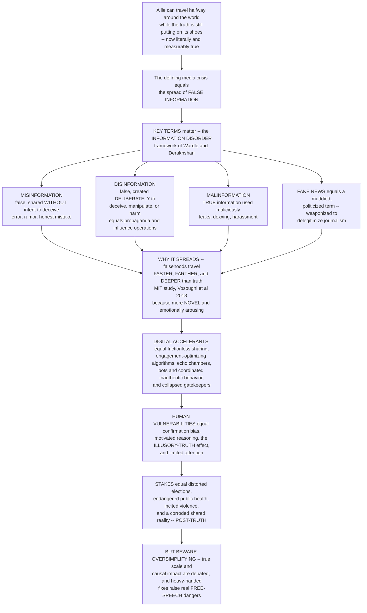

# 🕳️ Misinformation, Disinformation and Fake News

> [!abstract] TL;DR
> A famous line — often misattributed to Mark Twain — warns that **"a lie can travel halfway around the world while the truth is still putting on its shoes."** In the digital age this is no longer just a proverb: it is **literally and measurably true**, and it sits at the heart of what may be the defining media crisis of our time — the spread of false information. The terms matter, and scholars insist on precision (Wardle and Derakhshan's **"information disorder"** framework): **misinformation** is false information spread *without* intent to deceive (an honest mistake, a rumor, a genuine but wrong belief); **disinformation** is false information *deliberately* created and spread to deceive, manipulate, or harm (propaganda, hoaxes, influence operations); and **malinformation** is *genuine* information weaponized to cause harm (a private leak, doxxing). **"Fake news"** is a muddier, now-politicized label — originally meaning fabricated stories mimicking real journalism, but weaponized to dismiss *any* unwelcome coverage. Why does falsehood spread so well? The landmark MIT study of Twitter (**Vosoughi, Roy and Aral 2018**) found that false stories travel **faster, farther, and deeper** than the truth — largely because they are more **novel** and **emotionally arousing** (fear, disgust, outrage), and *humans*, not bots, do most of the spreading. Layer on the **digital accelerants** — frictionless sharing, engagement-optimizing algorithms, echo chambers, bots and coordinated inauthentic behavior, collapsed gatekeepers, and clickbait economics — plus **human vulnerabilities** — confirmation bias, motivated reasoning, the **illusory-truth effect** (repeated claims *feel* truer), and sheer inattention — and you have a perfect storm. The stakes are enormous: false information about elections, vaccines, wars, and disasters can distort democracy, endanger public health, incite violence, and corrode the **shared factual reality** a society needs to function ("post-truth"). But the honest analysis **resists oversimplification**: the true scale and causal impact of misinformation are hotly debated (most people see little; effects are often modest and concentrated among small, older, hyper-partisan groups), and heavy-handed "solutions" raise real free-speech dangers. Understanding misinformation is understanding the **epistemological crisis of the digital public sphere** — the struggle over truth itself.

---

## Intuition

**Analogy:** Imagine a small town where two runners set off to deliver a message door to door. The first carries a **shocking rumor** — vivid, scandalous, easy to repeat — and everyone who hears it grabs a neighbor to pass it on; it *sprints*. The second runner carries a careful **correction** — "actually, here's what really happened, with the boring details" — but he starts late, he's still lacing up his shoes when the rumor is already three streets ahead, and the people he reaches have *already heard the rumor* and half-believe it. Even after he explains, a residue of the false story lingers in their heads. That is misinformation in one image: **a lie has a head start and lighter shoes; the truth is slow, dull, and always chasing.** Now put that town online, where "grabbing a neighbor" takes one thumb-tap, where the fastest, most shocking messages get *amplified* by the very machinery of the platform, and where the runner delivering corrections is competing against millions of rumor-carriers at once.

Technically: false information is not a single thing but a **spectrum defined by intent** — an honest error (misinformation), a deliberate lie (disinformation), and a true fact turned into a weapon (malinformation). It spreads well not by magic but by a **fit between content and mind**: falsehoods are freer to be *novel* and *emotionally arousing* than the truth (the truth is constrained by what actually happened), and human cognition is wired to notice, remember, and share what is surprising and arousing. The digital environment then multiplies this fit — removing friction, rewarding engagement, sorting us into like-minded clusters, and dissolving the editorial **gatekeepers** who once slowed the spread. Grasping misinformation means shifting from "people are stupid" to a **systems** view: a race between two contagions on a network engineered to favor the faster, louder one.

---

## How It Works

### Core Mechanics

1. **The information-disorder taxonomy (Wardle and Derakhshan).** The essential first move is to stop saying "fake news" and instead classify by two axes — **falseness** and **intent to harm**. **Misinformation** = false, *no* intent to harm (a rumor shared in good faith, a misremembered statistic). **Disinformation** = false *and* intentionally harmful (fabricated stories, doctored images, state influence operations, hoaxes). **Malinformation** = *true* but deployed to harm (leaked private messages, doxxing, decontextualized real footage). The same false claim can be *disinformation* when a troll farm seeds it and *misinformation* when your aunt innocently reshares it — intent lives in the actor, not the content.

2. **Why "fake news" is a trap.** The phrase originally named a specific thing — **fabricated content that mimics the form of legitimate journalism** to earn clicks or deceive. But it was rapidly **weaponized**: politicians and partisans now use "fake news" to *delegitimize accurate reporting they dislike*, inverting the term into a tool of the very disinformation it was meant to describe. Scholars therefore prefer the precise vocabulary above, and treat "fake news" itself as an object of study — a contested political label — rather than an analytic category.

3. **The empirical engine of spread — faster, farther, deeper.** Analyzing ~126,000 rumor cascades on Twitter, **Vosoughi, Roy and Aral (Science, 2018)** found false news reached more people, spread **farther** (longer cascade depth), and **faster** than true news — the top 1% of false cascades diffused to 1,000–100,000 people while the truth rarely reached even 1,000. Crucially, this was **not driven by bots** (bots amplified true and false alike); *humans* spread falsehood faster. The mechanism they identify is **novelty** — false stories were measurably more novel — and **emotional arousal**: false stories evoked more **surprise and disgust**, true ones more sadness and trust. Novel, arousing content is more shareable, and we are wired to pass it on.

4. **The human cognitive vulnerabilities.** Several well-documented biases make minds hospitable to falsehood. **Confirmation bias** and **motivated reasoning** lead us to accept claims that flatter our existing beliefs and identity. The **illusory-truth effect** (Hasher; Fazio; Pennycook) means a claim *feels truer simply because we've seen it before* — repetition manufactures credibility regardless of accuracy, and even implausible claims gain a truth-boost from mere exposure. **Source confusion** and the **sleeper effect** let a message persist after we forget it came from an unreliable source. And a competing account — Pennycook and Rand's **"lazy, not biased"** thesis — argues much sharing of falsehood stems less from motivated reasoning than from **inattention and cognitive miserliness**: people *can* tell true from false but don't stop to think, especially in a fast-scrolling feed.

5. **The digital accelerants.** The platform environment supercharges all of the above: **frictionless, instantaneous, one-tap sharing** at planetary scale; **engagement-optimizing algorithms** that amplify whatever is sensational and divisive (the same arousal that drives sharing drives ranking); **echo chambers and homophily** that insulate false beliefs from correction; **bots, sockpuppets, troll farms, and coordinated inauthentic behavior** run by state and commercial actors; **micro-targeting** that tailors deception to the susceptible; the **collapse of gatekeepers** (editors, fact-checkers) who once slowed and vetted the flow; and the **economics of clickbait** — the Macedonian teenagers of Veles who fabricated pro-Trump stories purely for ad revenue are the emblem of engagement-driven, truth-indifferent content mills.

6. **The harms and stakes.** Consequences run from the political (election interference, manufactured consensus, democratic backsliding) to the epidemiological (anti-vaccine content, the COVID-19 **"infodemic,"** deadly folk cures) to the violent (misinformation-fueled lynchings; platform-amplified incitement in atrocities such as the Rohingya genocide) to the epistemic — the erosion of a **shared factual reality** and of trust in institutions, the condition commentators call **"post-truth."** A distinctive newer harm is the **"liar's dividend"**: as deepfakes make fabrication cheap, bad actors can dismiss *genuine* damning evidence as "probably fake," so the mere *possibility* of forgery corrodes the credibility of all evidence.

7. **The contested scale — a reality check.** Here rigor demands nuance. A large body of research finds that, on average, **most people consume very little outright fake news**; exposure is heavily **concentrated** among small, older, hyper-partisan subgroups (Grinberg et al.; Guess et al.), and average **persuasive effects are often modest**. Much of the correlation between misinformation and polarization is exactly that — correlation, not established causation. The task is to avoid **both complacency and moral panic**, and to notice a second-order danger: that "misinformation" itself becomes an elastic, weaponizable label used to justify **censorship** of merely inconvenient speech.

8. **Countermeasures and their limits.** Responses include **fact-checking and debunking** (effective but fighting the **continued-influence effect** — corrected beliefs leave residue; the once-feared "backfire effect" is now seen as rare and hard to replicate); **inoculation / "prebunking"** (Roozenbeek and van der Linden — pre-exposing people to a weakened dose of a manipulation technique builds resistance, as in the *Bad News* game); **media and digital literacy**; **platform interventions** (labels, downranking, removal, and **friction** such as "are you sure you want to share this?" prompts); **credibility signals**; and **regulation** — all colliding with hard **free-speech tradeoffs**, the genuine difficulty of adjudicating truth at scale, and the danger of overreach.

### Flow / Architecture



---

## Key Concepts

### Secondary (intuitive)
- **Three kinds of "wrong," and intent is the difference:** *misinformation* is an honest mistake you share believing it's true; *disinformation* is a lie someone made *on purpose* to fool you; *malinformation* is a true fact used to hurt someone (like posting a person's private address). Same false post can be either of the first two depending on who's sharing and why.
- **"Fake news" is a slippery term:** it started as a name for made-up stories dressed up to look like real news, but people now shout "fake news!" at *any* report they don't like — so careful thinkers avoid it.
- **A lie has a head start:** shocking, surprising, emotional stories spread faster and reach more people than boring true corrections — measured on real Twitter data. And it's *people* doing the spreading, not just robots.
- **Repetition is a trick:** the more times you see a claim, the truer it *feels*, even if it's false. That's the illusory-truth effect — why lies get repeated on purpose.
- **It's serious but not magic:** false information can swing opinions, scare people away from vaccines, and even spark violence — yet most people actually see very little of it, and clamping down too hard can threaten free speech.

### Undergraduate (mechanistic)
- **Information disorder (Wardle and Derakhshan):** a two-axis map (falseness × intent to harm) yielding **misinformation / disinformation / malinformation**; superior to the catch-all "fake news."
- **The Vosoughi–Roy–Aral findings:** false news spreads **farther, faster, deeper, more broadly** than truth; driven by **novelty** and **emotional arousal** (surprise, disgust), **not** primarily by bots.
- **The illusory-truth effect:** perceived truth rises monotonically with **repetition/fluency**, largely independent of accuracy or prior knowledge; the mechanism behind why "the big lie, repeated" works.
- **Two competing psychologies of susceptibility:** the **motivated-reasoning / confirmation-bias** account vs Pennycook and Rand's **inattention ("lazy, not biased")** account — with different intervention implications (deliberation prompts vs identity work).
- **Digital accelerants:** engagement-optimizing ranking, echo chambers/homophily, **bots and coordinated inauthentic behavior**, micro-targeting, clickbait economics, and the collapse of gatekeeping intermediaries.
- **The countermeasure toolkit:** fact-checking, **inoculation/prebunking**, media literacy, platform friction/labels/downranking, and regulation — each with documented limits.

### Graduate (critical / theoretical)
- **Intent is analytically load-bearing but empirically slippery:** classifying a piece of content requires inferring *actor intent*, which is often unobservable and shifts as content moves (a coordinated seed becomes organic resharing). This complicates measurement, moderation policy, and legal liability.
- **The continued-influence effect and the backfire debate:** corrections rarely fully erase a false belief (Lewandowsky et al.); early "backfire effect" claims (corrections *strengthening* false belief) have **largely failed to replicate** (Wood and Porter), reframing debunking as usually helpful-but-incomplete rather than counterproductive.
- **The "minimal effects" reappraisal:** converging evidence (Guess, Nyhan, Reifler; Grinberg et al.; Allen et al.) that fake-news *consumption* is a tiny share of the average media diet, hyper-concentrated among a small, older, partisan minority — challenging causal narratives that blame misinformation for polarization and demanding **correlation-vs-causation** discipline.
- **Epistemic fragmentation and "post-truth":** the deeper crisis is less any single false claim than the collapse of a **shared epistemic commons** and of trust in **institutional knowledge-adjudicators** (science, journalism, courts) — a public-sphere pathology, not merely a supply of bad facts.
- **The securitization / free-expression tension:** framing misinformation as an existential threat legitimates expansive platform and state power to define and remove "false" speech, risking **censorship, chilling effects, and the entrenchment of official truth** — the "misinformation" label as a governance weapon.
- **Inoculation theory as a scalable paradigm:** prebunking (McGuire's inoculation, revived by Roozenbeek and van der Linden) shifts defense **upstream** — building generalized resistance to *manipulation techniques* rather than debunking claims one by one — with promising but bounded, decaying effects that require "booster" exposure.

---

## Python Demo

```python
# Misinformation, modeled two ways with numpy + matplotlib.
#
# (a) COMPETING DIFFUSION -- a FALSE story vs the TRUTH/correction spreading
#     through a well-mixed population. The falsehood is more NOVEL and emotionally
#     arousing, so it has HIGHER transmissibility AND a HEAD START; the truth is
#     "still putting on its shoes" (a LATE, SLOWER start) and, when it finally
#     arrives, only PARTIALLY undoes the false belief (the CONTINUED-INFLUENCE
#     effect). Result: the lie goes FASTER, FARTHER, and DEEPER, and a late
#     correction never fully catches up.
#
# (b) Two cognitive levers:
#     (b1) ILLUSORY-TRUTH  -- perceived truth of a claim RISES with repeated
#          exposure, regardless of whether the claim is actually true.
#     (b2) INOCULATION / "prebunking" -- a group pre-exposed to a WEAKENED form of
#          the manipulation RESISTS later disinformation far better than an
#          untreated group.
import numpy as np
import matplotlib.pyplot as plt

# ------------------------------------------------------------------
# (a) COMPETING DIFFUSION: false story vs truth/correction
#     States (fractions): s = unaware, f = believes FALSE, t = knows TRUTH
# ------------------------------------------------------------------
STEPS      = 90
beta_false = 0.42     # falsehood is novel + arousing  -> HIGH transmissibility
beta_true  = 0.32     # the correction is duller       -> LOWER transmissibility
rho        = 0.50     # rate at which truth-holders try to correct false-believers
cont_infl  = 0.55     # CONTINUED INFLUENCE: 55% of a corrected false belief PERSISTS
seed       = 1e-3
true_delay = 10       # the truth is "still putting on its shoes": it starts late

def run(with_correction=True):
    s, f, t = 1.0 - seed, seed, 0.0
    seeded_true = False
    ever_false, ever_true = f, 0.0            # cumulative EVER-reached (depth of the cascade)
    S, F, T, EF, ET = [s], [f], [t], [ever_false], [ever_true]
    for step in range(STEPS):
        if step >= true_delay and not seeded_true:
            t = seed; s = max(s - seed, 0.0)  # truth finally begins to spread
            seeded_true = True
        new_f = beta_false * s * f            # falsehood infects the unaware (mass action)
        new_t = beta_true  * s * t            # truth infects the unaware
        # correction: truth converts false-believers, but continued influence means
        # only (1 - cont_infl) of those contacted actually let go of the false belief
        corr  = rho * f * t * (1.0 - cont_infl) if with_correction else 0.0
        s = max(s - new_f - new_t, 0.0)
        f = f + new_f - corr
        t = t + new_t + corr
        ever_false += new_f
        ever_true  += new_t + corr
        S.append(s); F.append(f); T.append(t); EF.append(ever_false); ET.append(ever_true)
    return (np.array(S), np.array(F), np.array(T), np.array(EF), np.array(ET))

S, F, T, EF, ET      = run(with_correction=True)
_, F_nc, _, _, _     = run(with_correction=False)   # counterfactual: no correction ever arrives

def first_cross(arr, thr):
    hit = np.where(arr >= thr)[0]
    return int(hit[0]) if hit.size else None

# ------------------------------------------------------------------
# (b1) ILLUSORY-TRUTH: perceived truth rises with repetition, accuracy-independent
# ------------------------------------------------------------------
reps      = np.arange(0, 9)
base, k   = 0.50, 0.45                                  # 0.5 = "don't know" on a 0..1 scale
perceived_repeated = base + (1 - base) * (1 - np.exp(-k * reps))   # a REPEATED claim
perceived_novel    = np.full_like(reps, base, dtype=float)         # a claim seen only once

# ------------------------------------------------------------------
# (b2) INOCULATION: belief in a later false claim vs exposure "dose"
# ------------------------------------------------------------------
dose            = np.linspace(0, 1, 60)
a               = 6.0
belief_untreated = 1 - np.exp(-a * dose)               # untreated: persuasion climbs steeply
resistance       = 0.72                                 # prebunking confers strong resistance
belief_prebunked = (1 - resistance) * (1 - np.exp(-a * dose))

# ------------------------------------------------------------------
# PLOTS
# ------------------------------------------------------------------
fig, ax = plt.subplots(2, 2, figsize=(13, 9))

# (a1) cumulative reach: the lie goes FARTHER and FASTER
ax[0, 0].plot(EF, lw=2.4, color="#c0392b", label="FALSE story (cumulative reach)")
ax[0, 0].plot(ET, lw=2.4, color="#2980b9", label="TRUTH / correction (cumulative reach)")
ax[0, 0].axvline(true_delay, color="#7f8c8d", ls=":", lw=1.6)
ax[0, 0].text(true_delay + 1, 0.05, "truth starts\n(still tying its shoes)", fontsize=8, color="#555")
ax[0, 0].set_title("(a1) A lie travels FASTER and FARTHER than the truth")
ax[0, 0].set_xlabel("time step"); ax[0, 0].set_ylabel("fraction of population ever reached")
ax[0, 0].legend(loc="center right")

# (a2) the correction cannot fully catch up: continued influence leaves a residue
ax[0, 1].plot(F_nc, lw=2.2, color="#e67e22", ls="--", label="false belief, NO correction")
ax[0, 1].plot(F,    lw=2.4, color="#c0392b",           label="false belief WITH late correction")
resid = F[-1]
ax[0, 1].axhline(resid, color="#c0392b", ls=":", lw=1.2)
ax[0, 1].text(2, resid + 0.02, "residual false belief\n(continued influence)", fontsize=8, color="#555")
ax[0, 1].set_title("(a2) Continued influence: the correction only partly sticks")
ax[0, 1].set_xlabel("time step"); ax[0, 1].set_ylabel("fraction currently believing the falsehood")
ax[0, 1].legend(loc="center right")

# (b1) illusory-truth: repetition raises perceived truth regardless of accuracy
ax[1, 0].plot(reps, perceived_repeated, "o-", lw=2.2, color="#8e44ad", label="REPEATED claim")
ax[1, 0].plot(reps, perceived_novel,    "s--", lw=1.8, color="#95a5a6", label="claim seen once")
ax[1, 0].axhline(base, color="k", ls=":", lw=1.0)
ax[1, 0].set_ylim(0.45, 1.0)
ax[1, 0].set_title("(b1) Illusory-truth: repetition manufactures 'truth'")
ax[1, 0].set_xlabel("number of exposures (repetitions)"); ax[1, 0].set_ylabel("perceived truth  [0..1]")
ax[1, 0].legend(loc="lower right")

# (b2) inoculation / prebunking builds resistance
ax[1, 1].plot(dose, belief_untreated, lw=2.4, color="#c0392b", label="UNTREATED audience")
ax[1, 1].plot(dose, belief_prebunked, lw=2.4, color="#16a085", label="PREBUNKED (inoculated)")
ax[1, 1].fill_between(dose, belief_prebunked, belief_untreated, color="#16a085", alpha=0.12)
ax[1, 1].set_title("(b2) Inoculation: prebunking blunts later disinformation")
ax[1, 1].set_xlabel("exposure 'dose' to the false claim"); ax[1, 1].set_ylabel("belief in the false claim")
ax[1, 1].legend(loc="lower right")

plt.tight_layout()
plt.savefig("misinformation_disinformation_and_fake_news.png", dpi=120)

# ------------------------------------------------------------------
# Numeric summary: FASTER, FARTHER, DEEPER
# ------------------------------------------------------------------
print("FARTHER  -- final reach : false =", round(float(EF[-1]), 3),
      " | truth =", round(float(ET[-1]), 3),
      " | ratio =", round(float(EF[-1] / max(ET[-1], 1e-9)), 1), "x")
print("FASTER   -- steps to reach 25% : false =", first_cross(EF, 0.25),
      " | truth =", first_cross(ET, 0.25))
print("DEEPER   -- peak simultaneous belief : false =", round(float(F.max()), 3),
      " | truth =", round(float(T.max()), 3))
print("RESIDUE  -- false belief left after correction :", round(float(F[-1]), 3),
      " (vs", round(float(F_nc[-1]), 3), "with no correction)")
print("ILLUSORY-TRUTH -- perceived truth of a FALSE claim after 8 repeats :",
      round(float(perceived_repeated[-1]), 3), "(started at", base, ")")
```

Running it makes the dynamics concrete. Panel **(a1)** shows the false story racing up its cumulative-reach curve and saturating a large share of the population *before the truth even starts* — the correction is literally still "tying its shoes" at the dotted line, and by the end the lie has reached several times more people (the printed `FARTHER` ratio) and crossed the 25% mark far sooner (`FASTER`). Panel **(a2)** captures the **continued-influence effect**: even when a correction finally arrives and spreads, the fraction still believing the falsehood only drops **partway** — a stubborn residue remains, because minds do not cleanly overwrite a belief they already hold. Panel **(b1)** dramatizes **illusory truth** — a claim's *perceived* truth climbs steeply with each repetition while a once-seen claim stays flat at "don't know," and note the model never consults whether the claim is *actually* true: **repetition alone** does the work. Panel **(b2)** shows **inoculation** flipping the defense upstream: the prebunked audience's belief in later disinformation stays far below the untreated audience's across every exposure dose — the shaded gap is the resistance that a small dose of "prebunking" buys.

---

## Real-World Applications

- **The Twitter cascade study (Vosoughi, Roy and Aral, 2018).** The empirical backbone of this whole note: ~126k verified-rumor cascades showing false news spreading farther, faster, deeper, and more broadly than the truth, driven by novelty and disgust/surprise — and crucially *not* mainly by bots. It is the rigorous data behind the "lie travels faster" proverb.
- **The COVID-19 "infodemic."** The WHO's term for the flood of pandemic misinformation — fake cures (bleach, ivermectin folk claims), anti-vaccine narratives, and conspiracy theories — that measurably influenced health behavior and mortality, the clearest case of misinformation as a **public-health** hazard.
- **Election interference and influence operations.** Russia's Internet Research Agency and the 2016 US campaign; the Macedonian teenagers of Veles fabricating viral pro-Trump stories purely for ad money — textbook **disinformation** (coordinated, intentional) alongside profit-driven **fabricated "fake news."**
- **Platform-amplified atrocity: Myanmar.** UN investigators found Facebook played a "determining role" in spreading anti-Rohingya hate and false rumors that helped fuel ethnic-cleansing violence — misinformation as an accelerant of **mass atrocity**, and a landmark case in the platform-accountability debate.
- **Fact-checking, labels, and friction at scale.** The IFCN network, Snopes, and PolitiFact; Twitter/Meta content **labels and downranking**; and behavioral **friction** such as "you're about to share an article you haven't opened — are you sure?" prompts, which measurably reduce reflexive resharing.
- **Prebunking in the wild.** Roozenbeek and van der Linden's *Bad News* game and Google Jigsaw's prebunking video campaigns (rolled out across Central Europe) operationalize **inoculation theory** — building population-level resistance to manipulation *techniques* before exposure.
- **The reality-check literature.** Grinberg et al. (Science, 2019) and Guess et al. showing fake-news exposure/sharing is a tiny, highly **concentrated** slice of the media diet (older, hyper-partisan users) — the essential corrective to moral-panic narratives and a case study in disciplined causal reasoning.

---

## Common Pitfalls

- **Collapsing the three terms.** Treating all false content as "disinformation" (or all of it as innocent "misinformation") erases the intent axis that determines the right response — you fight a coordinated influence operation very differently from your well-meaning uncle's mistaken reshare. Always ask: *false or true? intent to harm or not?*
- **Using "fake news" as an analytic term.** Because the phrase has been weaponized to attack legitimate journalism, using it uncritically imports that political baggage. Prefer misinformation/disinformation/malinformation, and treat "fake news" as a contested *object* of study.
- **Blaming bots for everything.** The signature finding of Vosoughi et al. is that **humans**, not bots, drive the speed advantage of falsehood. Over-attributing spread to automation lets human psychology and platform design off the hook and misdirects countermeasures.
- **Moral panic (or complacency) about scale.** Asserting that misinformation is single-handedly destroying democracy outruns the evidence (exposure is small and concentrated; effects often modest) — but so does dismissing it entirely. The honest stance holds **both** the concentrated harms and the modest averages in view.
- **The backfire-effect myth.** The once-popular claim that corrections *reliably* strengthen false beliefs has **largely failed to replicate**; treating debunking as futile-or-worse is itself a misinformation about misinformation. Corrections usually help — imperfectly, thanks to continued influence, but they help.
- **The deficit model — "just add facts."** Assuming people believe falsehoods only from lack of information ignores identity, motivated reasoning, fluency/repetition effects, and inattention. More facts alone rarely dislodge an identity-affirming or oft-repeated belief; **prebunking, friction, and trust-building** matter as much as facts.
- **"Misinformation" as a censorship license.** The gravest second-order risk: an elastic "misinformation" label that authorities or platforms use to suppress merely inconvenient or contested-but-legitimate speech. Robust responses must reckon with **free-speech tradeoffs** and the difficulty of adjudicating truth, not wish them away.

---

## Related Concepts

- [[Misinformation_Polarization_and_the_Online_Public_Sphere]] — the computational-social-science companion: population-scale measurement of exposure, cascades, and polarization that supplies the "reality-check" evidence cited here.
- [[Contagion_and_Diffusion_in_Social_Networks]] — the formal contagion/diffusion models (SIR, independent cascade, simple vs complex contagion) behind the competing-diffusion simulation and the "faster, farther, deeper" result.
- [[Media_Literacy_and_Source_Evaluation]] — the critical-thinking toolkit (lateral reading, source vetting, evidence evaluation) that is a frontline defense against believing and resharing falsehood.
- [[Cognitive_Biases_and_Heuristics]] — the general catalog of biases and mental shortcuts; the illusory-truth effect, availability, and fluency effects exploited by misinformation are cases of it.
- [[Confirmation_Bias_and_Motivated_Reasoning]] — the behavioral-economics account of why we accept identity-affirming claims; one of the two competing psychologies (vs inattention) of misinformation susceptibility.
- [[Epistemology_and_Theories_of_Knowledge]] — the philosophy of knowledge, justification, and truth underlying the "post-truth"/epistemic-fragmentation stakes of this note.
- [[Media_Propaganda_and_Political_Communication]] — the political-science treatment of propaganda, influence operations, and elections; the political-power dimension of disinformation.
- [[Democratic_Backsliding_and_Polarization]] — the democratic-erosion process that misinformation is often (contestedly) argued to accelerate; the stakes for the political system.
- [[Media_and_Democracy_the_Public_Sphere]] — the Habermasian public-sphere ideal whose corrosion by false information is the deepest harm at issue here.
- [[Social_Media_and_Networked_Communication]] — the networked, many-to-many architecture (spreadability, virality, hubs) that carries misinformation and supplies its digital accelerants.
- [[Journalism_and_News_Production]] — the professional gatekeeping and verification norms whose collapse removed the friction that once slowed false information.
- [[Advertising_and_the_Attention_Economy]] — the engagement-and-clicks business model that rewards sensational, arousing content and funds junk-news mills.
- [[Agenda_Setting_Priming_and_Framing]] — the classic media-effects mechanisms by which repeated, salient (even false) content shapes what audiences think about and how.
- [[Media_Ownership_and_Regulation]] — the ownership and regulatory levers (labeling, liability, platform rules) among the contested countermeasures to information disorder.

Within this vault, this note opens the **Media Power, Ethics and Frontiers** section and should be read alongside its siblings (referenced in prose here, to avoid dangling links until they exist): **Media_Literacy_and_Critical_Consumption** (the audience-side defenses), **Propaganda_and_Persuasion** (the intentional-influence tradition that disinformation extends), **Platforms_Algorithms_and_Curation** (the ranking systems that amplify sensational falsehood), **Attention_Filter_Bubbles_and_Echo_Chambers** (the sorting that insulates false beliefs from correction), **Surveillance_Privacy_and_Datafication** (the data that powers micro-targeted deception), **AI_Generated_Media_and_Deepfakes** (synthetic fabrication and the "liar's dividend"), and **Media_Ethics_and_Regulation** (the governance and free-speech tradeoffs of any response).

---

## Review Questions

1. **(Secondary)** In your own words, explain the difference between **misinformation**, **disinformation**, and **malinformation**, giving one everyday example of each. Then explain why researchers dislike the phrase "fake news."
2. **(Secondary/Undergraduate)** The proverb says "a lie can travel halfway around the world while the truth is still putting on its shoes." Using the Vosoughi–Roy–Aral findings, explain *why* false stories tend to spread faster and farther than true ones — and why the answer is *not* mainly "bots."
3. **(Undergraduate)** Describe the **illusory-truth effect** and the **continued-influence effect**. Using panels (b1) and (a2) of the demo, explain how each one makes misinformation hard to defeat even when a correction is available.
4. **(Undergraduate/Graduate)** Contrast the **motivated-reasoning** account of misinformation susceptibility with Pennycook and Rand's **inattention ("lazy, not biased")** account. What *different* interventions does each imply, and how might you design an experiment to tell them apart?
5. **(Graduate)** The "minimal effects" literature finds fake-news exposure is small and concentrated, while the "existential threat" framing warns of a crisis for democracy. Stake out a defensible position that takes **both** seriously, and explain why an expansive "misinformation" label can itself become a **free-speech** and censorship hazard.

---

## Sources

- Vosoughi, Soroush, Deb Roy, and Sinan Aral. "The Spread of True and False News Online." *Science* 359, no. 6380 (2018): 1146–1151.
- Wardle, Claire, and Hossein Derakhshan. *Information Disorder: Toward an Interdisciplinary Framework for Research and Policy Making.* Strasbourg: Council of Europe, 2017.
- Pennycook, Gordon, and David G. Rand. "The Psychology of Fake News." *Trends in Cognitive Sciences* 25, no. 5 (2021): 388–402.
- Lewandowsky, Stephan, Ullrich K. H. Ecker, Colleen M. Seifert, Norbert Schwarz, and John Cook. "Misinformation and Its Correction: Continued Influence and Successful Debiasing." *Psychological Science in the Public Interest* 13, no. 3 (2012): 106–131.
- Roozenbeek, Jon, and Sander van der Linden. "Fake News Game Confers Psychological Resistance Against Online Misinformation." *Palgrave Communications* 5, no. 65 (2019).

---

#media-studies #misinformation #disinformation #fake-news #information-disorder
