# 🛰️ Surveillance, Privacy and Datafication

> [!abstract] TL;DR
> **Every tap, swipe, search, like, location ping, and pause on a video is being recorded.** In the digital media world you are under constant, ambient **surveillance** — not by a shadowy government agent but by the very platforms and devices woven into your daily life, quietly converting your every action into **data**. This is **datafication**: the transformation of ever more of human life — behavior, relationships, moods, movements, even heartbeats — into quantified data that can be tracked, stored, analyzed, and monetized. The business model that drives it is Shoshana Zuboff's **surveillance capitalism**: platforms provide "free" services in exchange for your data, mine it to predict and influence your behavior, and sell those predictions to advertisers and others. *Your experience is the raw material; your future behavior is the product.* This is a genuinely new kind of media power. Older ideas of surveillance came from Orwell's **Big Brother** (a state watching you to instill fear) and Foucault's **panopticon** (Bentham's prison where inmates, never knowing when they are watched, *police themselves* — surveillance as disciplinary power we internalize). Today's reality is stranger: a distributed, corporate, **participatory** surveillance where we *voluntarily* hand over intimate data for convenience and connection, watched by algorithms rather than guards. The stakes go far beyond "I have nothing to hide": datafication enables **micro-targeted manipulation** (of purchases *and* votes — Cambridge Analytica), **algorithmic discrimination**, **chilling effects** on speech, and profound **power asymmetries** between watchers and watched. It reframes **privacy** not as secrecy but as a fundamental value — autonomy, dignity, and control over one's information — now under systematic threat. And it is contested terrain: **GDPR**, encryption, privacy activism, and **sousveillance** (citizens filming police) push back. To understand surveillance, privacy, and datafication is to understand the hidden data economy beneath our media.

---

## Intuition

**Analogy — the "free" theme park that quietly tattoos a tracking chip under your skin at the gate.** Imagine a dazzling amusement park that charges no admission. You wander in, delighted: the rides are fun, your friends are here, everything is *free*. What you never notice is that the turnstile slipped an invisible chip under your skin. From that moment the park logs every ride you queue for, every snack you crave, exactly where you pause, whom you walk with, how long you linger at each window, even your heart rate on the roller coaster. None of this is used to *charge* you — you are not the customer. Instead the park builds a shockingly complete dossier of *who you are and what you will do next*, and sells that prediction to shops, insurers, and political campaigns who want to nudge your future choices. The rides were never the business; **you** were — or rather, the *data trail* your body and behavior leave behind. That invisible chip is your smartphone, your browser, your smart TV, your fitness tracker; the park is the platform economy; and the dossier is **datafication** turned into profit.

Now notice something the old spy stories never prepared us for. When George **Orwell** imagined surveillance, it was **Big Brother**: a *state* watching you through a telescreen to make you *afraid* — control through terror. When Michel **Foucault** deepened the idea, he reached for Jeremy Bentham's **panopticon**: a circular prison with a central tower from which a single unseen guard *might* be watching any cell at any moment. Because inmates can never tell *when* they are observed, they behave *as if always watched* — they **police themselves**. Surveillance becomes **disciplinary power** that we *internalize*, producing "docile bodies" who need no guard at all. But today's reality is stranger than either. We are not coerced into the panopticon; we *walk in cheerfully and hand over the keys*. The watching is not one central state but a **distributed, corporate, participatory** web — platforms, apps, data brokers, and *each other* — and the watcher is not a guard but an **algorithm**. We volunteer our most intimate data for convenience and connection: a **participatory panopticon** in which we surveil ourselves, surveil our friends, and pay for the privilege.

Here is the uncomfortable payoff, and why "I have nothing to hide" misses the point entirely. Datafication does not merely *record* you — it is used to **sort, score, predict, and steer** you. The same machinery that recommends a movie can micro-target a lie at exactly the voters most likely to believe it (**Cambridge Analytica**); can score your creditworthiness, insurability, or "risk" using data you never knew was collected (**algorithmic discrimination**); can make you quietly **self-censor** the moment you sense you are watched (the **chilling effect**); and it concentrates a staggering **power asymmetry** in the hands of those who hold the data over those who *are* the data. This is why **privacy** is not about secrecy or having something to hide — it is a foundational value: the right to **autonomy**, **dignity**, and control over the flow of information about your life. Understanding surveillance, privacy, and datafication is understanding the hidden data economy beneath our media: the price of the connected life is being watched, quantified, and predicted.

---

## How It Works

### Core mechanics

1. **Datafication turns life into data (Mayer-Schönberger & Cukier).** *Datafication* is the transformation of ever more aspects of existence — actions, interactions, relationships, emotions, bodies, movement — into **quantified, machine-readable data**. A friendship becomes a "connection"; a mood becomes a sentiment score; a walk becomes a GPS trace; a heartbeat becomes a time series. Media and platforms are the great **data-generating and data-extracting machines**, and the result is "**big data**," the *datafied self*, and an ideology of **dataism** — the belief that data yields objective, unmediated truth.

2. **Surveillance shifts from centralized to distributed.** The classic frames are **Orwell's Big Brother** (centralized *state* surveillance, control through fear) and **Foucault's panopticon** (surveillance as *disciplinary* power — the mere *possibility* of observation induces **self-discipline** and the "docile body"). The digital update: watching moves from one all-seeing state to a **distributed, networked, corporate, and participatory** form — the "**surveillant assemblage**" (Haggerty & Ericson) of many data flows reassembled into a "data double"; "**liquid surveillance**" (Bauman & Lyon); **lateral / social surveillance** and **self-surveillance**; and **dataveillance** (monitoring *through data* rather than direct observation). We inhabit a **participatory panopticon**: we watch ourselves and each other and *volunteer* our data.

3. **Surveillance capitalism supplies the economic engine (Zuboff).** The logic runs: "free" services are exchanged for personal data → platforms extract **behavioral surplus** (data beyond what improving the service requires) → machine learning refines it into **prediction products** (predictions of what you will do) → these are sold in "**behavioral futures markets**" to advertisers and others → and the frontier moves from *predicting* behavior to *nudging and modifying* it at scale. Human experience becomes **free raw material**, concentrating a new "**instrumentarian**" power.

4. **Privacy is reconceived, not as secrecy but as a value.** Privacy is *not* mainly about hiding wrongdoing; it is **informational self-determination**, **autonomy**, **dignity**, and **contextual integrity** — Helen Nissenbaum's principle that information flows are appropriate *in context* (your pharmacist knowing your prescription is fine; your employer knowing it is not). Daniel Solove dismantles the "**nothing to hide**" fallacy; privacy is also a **social / public good**, not merely an individual one. Digital media erode public/private boundaries (**context collapse**), and the **privacy paradox** names the gap between people's stated concern and their actual data-sharing behavior.

5. **The harms exceed exposure.** Beyond "nothing to hide" lie: **micro-targeted manipulation** (behavioral and political advertising — Cambridge Analytica); **algorithmic discrimination and sorting** (data-driven scoring and profiling — "weapons of math destruction," differential treatment by class or race); **chilling effects** (self-censorship under observation, dampening speech and dissent); **function creep** and **data breaches**; the vast **power asymmetry** between watchers and watched; and the specter of **state–corporate fusion** (social credit systems, predictive policing, biometric surveillance).

6. **Resistance, regulation, and the frontier.** Pushback includes **data-protection regulation** (GDPR, CCPA — data rights, consent, the "right to be forgotten"), **encryption** and privacy-enhancing technologies, **privacy activism** and digital rights, **sousveillance** ("watching from below" — citizens recording the powerful, e.g. filming police), and **data minimization / privacy-by-design** — against the strained "**notice-and-consent**" model. The frontier is **AI, facial recognition, biometric and emotion surveillance**, the **Internet of Things**, and the **surveilled body**.

### Flow / architecture

```mermaid
flowchart TD
    A["Every tap, swipe, search, like, and location ping is recorded"]
    B["Constant ambient SURVEILLANCE<br/>by the platforms and devices woven into daily life"]
    C["DATAFICATION equals converting human life<br/>behavior, moods, movements, even heartbeats<br/>into quantified, monetizable DATA"]
    D["The business model equals SURVEILLANCE CAPITALISM by Zuboff<br/>free services traded for your data"]
    E["Data mined to PREDICT and INFLUENCE you<br/>then sold to advertisers and others"]
    F["Your experience is the raw material<br/>your future behavior is the product"]
    G["Older model one equals Orwell BIG BROTHER<br/>a state that watches to instill fear"]
    H["Older model two equals Foucault PANOPTICON<br/>we police ourselves under an unseen watch"]
    I["Today equals distributed, corporate, PARTICIPATORY surveillance<br/>we volunteer intimate data, watched by algorithms not guards"]
    J["Stakes beyond nothing-to-hide equal micro-targeted manipulation<br/>via Cambridge Analytica, algorithmic discrimination,<br/>chilling effects, and power asymmetry"]
    K["PRIVACY equals autonomy and dignity<br/>now under systematic threat"]
    L["Contested terrain equals GDPR, encryption, and sousveillance"]
    A --> B --> C --> D --> E --> F --> G --> H --> I --> J --> K --> L
```



---

## Key Concepts

### Secondary (intuitive level)
- **You are being watched by the apps, not a spy.** Every tap, search, and location is logged by the platforms and devices you use every day. That constant, background watching is **surveillance** — and mostly you agreed to it without reading a word.
- **Datafication turns your life into numbers.** Your steps, moods, friendships, and habits get turned into **data** that can be stored, studied, and sold. That is *datafication*.
- **"Free" costs you your data.** Free apps make money by collecting your data, guessing what you will do next, and selling that guess. **Your future behavior is the product.**
- **The watched watch themselves.** When people think they *might* be watched, they behave differently — they hold back, they conform. You do not even need a real guard; the *feeling* of being watched is enough (the **panopticon**).
- **"I have nothing to hide" misses the point.** Privacy is not about hiding bad things — it is about **freedom, dignity, and control** over your own life. Data can be used to manipulate you, score you unfairly, and silence you.

### Undergraduate (working level)
- **Datafication and dataism (Mayer-Schönberger & Cukier; van Dijck).** The rendering of actions, bodies, emotions, and relationships into quantified data; platforms as data-extraction machines; "big data," the datafied self, and **dataism** — the (contestable) ideology that data equals objective truth.
- **Theories of surveillance.** **Orwell's Big Brother** (centralized state, control by fear); **Foucault's panopticon** (Bentham's design; disciplinary power; self-discipline; the "docile body"). The digital shift to **distributed / corporate / participatory** surveillance: the **surveillant assemblage** (Haggerty & Ericson), **liquid surveillance** (Bauman & Lyon), **lateral / social surveillance**, **self-surveillance**, **dataveillance**, and the **participatory panopticon**.
- **Surveillance capitalism (Zuboff).** "Free" services → **behavioral surplus** → machine-learned **prediction products** → sold in **behavioral futures markets** → moving from prediction to **behavior modification**; the human experience as free raw material; **instrumentarian power**.
- **Privacy reconceived.** Not secrecy but **informational self-determination**, **autonomy**, **dignity**, and **contextual integrity** (Nissenbaum). The **"nothing to hide" fallacy** (Solove); privacy as a **social/public good**; **context collapse**; the **privacy paradox** (stated concern vs actual behavior).
- **The harms.** Micro-targeted **manipulation** (behavioral + political ads; Cambridge Analytica); **algorithmic discrimination / sorting** ("weapons of math destruction"); **chilling effects**; **function creep**; **data breaches**; **power asymmetry**; state–corporate fusion.
- **Resistance and regulation.** **GDPR / CCPA**, data rights, **consent**, the **right to be forgotten**; **encryption** and privacy-enhancing technologies; **sousveillance**; **data minimization** and **privacy-by-design**; the limits of **notice-and-consent**.

### Graduate (theoretical level)
- **From discipline to control (Foucault → Deleuze).** The move from *enclosed* disciplinary institutions to Deleuze's open "**societies of control**" — continuous, modulating, dividuated tracking — of which dataveillance and predictive scoring are the mature form; surveillance as *productive* power that manufactures subjects, not merely represses them.
- **The surveillant assemblage and the data double.** Surveillance as a rhizomatic reassembly of decontextualized data flows into a "**data double**" that is acted upon in place of the person; the collapse of the panoptic *single observer* into many partial, networked observers.
- **Surveillance capitalism as a distinct accumulation regime (Zuboff).** Behavioral surplus, prediction imperative, economies of scale/scope/action, and the shift from a *division of labor* to a *division of learning* in society; the critique that this is not "an accident of the internet" but a deliberately engineered logic — and counter-critiques (Morozov, political-economy readers) that it under-theorizes capital and labor.
- **Contextual integrity as a formal privacy theory (Nissenbaum).** Privacy as *appropriate information flow* governed by context-relative informational norms (actors, attributes, transmission principles); why "public vs private" binaries and pure consent models fail, and how CI grounds regulatory reasoning.
- **Algorithmic sorting, discrimination, and the datafied subject.** How profiling and scoring encode and reproduce inequality (link to **AI bias and fairness**), producing cumulative disadvantage; the politics of classification; "the social power of algorithms" and the datafication of citizenship.
- **The chilling effect and self-censorship as measurable phenomena.** Surveillance as a suppressor of the *diversity* of expression even absent enforcement; the normative stakes for a democratic public sphere; empirical debates over how large and durable such effects are.
- **Frontiers.** Facial recognition and biometric/**emotion** surveillance; the **IoT** and the surveilled body; social credit and predictive policing; and the governance debate over consent, data ownership, collective/relational privacy, and privacy as *infrastructure* rather than individual choice.

---

## Python Demo

```python
# Surveillance & datafication, quantified three ways:
#   (a) RE-IDENTIFICATION / DATA-MOSAIC: "anonymized" data is not private. Combining a
#       few innocuous quasi-identifiers (gender, age band, ZIP region, birth date, a
#       device/app trace...) rapidly narrows a large population to ONE person. We
#       simulate N people with categorical attributes and measure the fraction who
#       become UNIQUELY identifiable as we combine more attributes (Sweeney's result:
#       ZIP + birthdate + gender uniquely identify ~87% of the US population).
#   (b) PREDICTION VALUE (the surveillance-capitalism incentive): behavioral-prediction
#       accuracy rises with the VOLUME and VARIETY of data, with diminishing returns --
#       but because more data always buys a little more predictive edge (and money), the
#       rational incentive is to collect EVERYTHING.
#   (c) CHILLING EFFECT (the panopticon, no enforcement needed): as the PERCEIVED
#       probability of being watched rises, people self-censor opinions that deviate
#       from the norm -> the diversity of EXPRESSED opinion collapses, even though
#       NOBODY is ever actually punished.
import numpy as np
import matplotlib.pyplot as plt

rng = np.random.default_rng(7)

# --------------------------------------------------------------------------- #
# (a) Re-identification: anonymity dies with a few quasi-identifiers
# --------------------------------------------------------------------------- #
N = 100_000
# (name, number of categories) for successive quasi-identifiers, roughly realistic:
quasi = [("gender", 2), ("age band", 8), ("ZIP-3 region", 900),
         ("birth date in year", 365), ("device fingerprint", 500),
         ("a location / app trace", 1500)]

codes = np.zeros((N, len(quasi)), dtype=np.int64)
for j, (_, c) in enumerate(quasi):
    probs = rng.dirichlet(np.ones(c) * 3.0)              # slightly non-uniform categories
    codes[:, j] = rng.choice(c, size=N, p=probs)

frac_unique_mc, frac_unique_theory, Ck = [], [], 1
for k in range(1, len(quasi) + 1):
    _, inv, cnt = np.unique(codes[:, :k], axis=0,
                            return_inverse=True, return_counts=True)
    group_size = cnt[inv.ravel()]                        # how many share your fingerprint
    frac_unique_mc.append(np.mean(group_size == 1))      # fraction in a group of ONE
    Ck *= quasi[k - 1][1]                                # combinations if independent+uniform
    frac_unique_theory.append(np.exp(-(N - 1) / Ck))     # P(no one else shares your cell)

# --------------------------------------------------------------------------- #
# (b) Prediction value: accuracy vs data volume & variety (diminishing returns)
# --------------------------------------------------------------------------- #
data_volume = np.logspace(1, 6, 200)                     # number of behavioral data points
def learning_curve(a0, a_max, tau):
    return a_max - (a_max - a0) * np.exp(-data_volume / tau)
acc_low_variety  = learning_curve(0.55, 0.78, 8_000)     # few signal types -> low ceiling
acc_high_variety = learning_curve(0.55, 0.93, 8_000)     # many signal types -> high ceiling

# --------------------------------------------------------------------------- #
# (c) Chilling effect: expressed diversity collapses as surveillance rises
# --------------------------------------------------------------------------- #
M = 50_000
private = rng.normal(0.0, 1.0, M)                        # true private opinions
p_watch = np.linspace(0.0, 1.0, 100)                     # perceived surveillance level
expressed_std = []
for p in p_watch:
    # more deviant opinions are more likely to be self-censored when watched
    p_censor = p * np.clip(np.abs(private) / 2.0, 0.0, 1.0)
    censored = rng.random(M) < p_censor
    expressed = np.where(censored, 0.0, private)         # censored -> conform to the norm (0)
    expressed_std.append(expressed.std())

# --------------------------------------------------------------------------- #
# Plots
# --------------------------------------------------------------------------- #
fig, ax = plt.subplots(1, 3, figsize=(16, 4.7))

xs = range(1, len(quasi) + 1)
ax[0].plot(xs, frac_unique_mc, "o-", color="#dc2626", lw=2.6,
           label="Simulated: fraction uniquely identifiable")
ax[0].plot(xs, frac_unique_theory, "s--", color="#2563eb", lw=2.0,
           label="Theory: exp(-(N-1)/C)")
ax[0].set_xticks(list(xs))
ax[0].set_xticklabels([q[0] for q in quasi], rotation=30, ha="right", fontsize=7)
ax[0].set_title("(a) Re-identification / data mosaic:\nanonymity dies with a few quasi-identifiers")
ax[0].set_xlabel("quasi-identifiers combined (cumulative)")
ax[0].set_ylabel("fraction of people uniquely identifiable")
ax[0].set_ylim(0, 1.05); ax[0].legend(fontsize=8, loc="lower right")

ax[1].semilogx(data_volume, acc_high_variety, color="#059669", lw=2.6,
               label="High data VARIETY (many signals)")
ax[1].semilogx(data_volume, acc_low_variety, color="#7c3aed", lw=2.2, ls="--",
               label="Low data variety (few signals)")
ax[1].set_title("(b) Prediction value:\nmore data -> better behavioral prediction")
ax[1].set_xlabel("volume of behavioral data collected (log scale)")
ax[1].set_ylabel("behavioral-prediction accuracy")
ax[1].set_ylim(0.5, 1.0); ax[1].legend(fontsize=8, loc="lower right")

ax[2].plot(p_watch, expressed_std, color="#ea580c", lw=2.8)
ax[2].fill_between(p_watch, expressed_std, color="#ea580c", alpha=0.12)
ax[2].axhline(1.0, color="gray", ls=":", lw=1.2, label="Un-watched diversity")
ax[2].set_title("(c) Chilling effect / panopticon:\nexpressed diversity collapses under watch")
ax[2].set_xlabel("perceived probability of being watched")
ax[2].set_ylabel("std of EXPRESSED opinion")
ax[2].set_ylim(0, 1.15); ax[2].legend(fontsize=8, loc="lower left")

plt.tight_layout()
plt.show()

# Key readings
print(f"(a) Uniquely identifiable: after 1 attribute = {frac_unique_mc[0]*100:.1f}%, "
      f"after {len(quasi)} attributes = {frac_unique_mc[-1]*100:.1f}%  "
      f"(a handful of weak signals fingerprints almost everyone).")
i100 = np.argmin(np.abs(data_volume - 100))
print(f"(b) Prediction accuracy: at ~100 data points = {acc_high_variety[i100]:.2f}  ->  "
      f"at 1,000,000 = {acc_high_variety[-1]:.2f}  (gains shrink but never stop -> collect more).")
print(f"(c) Expressed diversity: un-watched = {expressed_std[0]:.2f}  ->  "
      f"fully watched = {expressed_std[-1]:.2f}  (self-censorship, with zero enforcement).")
```

Panel **(a)** is the killer fact about "anonymized" data: combining just a few **innocuous** quasi-identifiers (gender, an age band, a ZIP region, a birth date) drives the fraction of people who are **uniquely identifiable** sharply toward **1** — the *mosaic* / re-identification effect that let Latanya Sweeney re-identify a governor's medical record and estimate that **ZIP + birthdate + gender uniquely identify ~87% of the US population**. Anonymity is not a property of a single field; it dissolves the moment data is *combined*, which is exactly what datafication does. Panel **(b)** is the economic engine of surveillance capitalism: prediction accuracy rises with the **volume** and **variety** of behavioral data with *diminishing but never-vanishing* returns — so the rational move is always to collect **a little more of everything**, the structural driver of total data capture. Panel **(c)** is the panopticon made quantitative: as the *perceived* probability of being watched climbs, people self-censor their more deviant opinions and the **diversity of expressed opinion collapses toward the norm** — *even though no one is ever punished*. The chilling effect needs no enforcement; the *feeling* of the unseen watcher is enough.

---

## Real-World Applications

- **Surveillance advertising and the ad-tech stack.** Google and Meta build behavioral profiles from cross-site tracking (cookies, pixels, device IDs, SDKs) and auction access to *you specifically* in real time. This is datafication monetized: your clicks and dwell-times become **prediction products** priced by an ad exchange — Zuboff's thesis running live on every "free" page you open.
- **Cambridge Analytica and political micro-targeting.** Harvested Facebook data on ~87 million people was used to build psychographic profiles and micro-target political messages in the 2016 US election and the Brexit referendum — the paradigm case that datafication threatens not just consumer choice but **democratic autonomy**, moving from predicting behavior to *modifying* it.
- **Facial recognition and biometric surveillance.** Clearview AI scraped billions of public photos to build a face-search engine sold to police; live facial recognition, gait analysis, and **emotion recognition** extend the surveilled body into public space — the frontier where dataveillance fuses with the state.
- **Social credit and predictive policing.** China's social-credit experiments and Western **predictive-policing** systems (PredPol/Geolitica) show **state–corporate fusion**: datafied scoring that sorts citizens and pre-allocates suspicion, importing historical bias into ostensibly neutral algorithms (link to algorithmic discrimination).
- **The quantified self and the IoT.** Fitbits, Apple Watches, Oura rings, smart TVs, doorbell cameras (Ring), and connected cars datafy sleep, heartbeats, movement, and the home — often sharing data with insurers, advertisers, and law enforcement, and normalizing **self-surveillance** as wellness.
- **Regulation as counter-force.** The EU's **GDPR** (consent, data-subject rights, the **right to be forgotten**), California's **CCPA/CPRA**, Apple's App Tracking Transparency, and third-party-cookie deprecation are direct attempts to pry open the data economy — each a fight over how precisely you may be tracked and profiled.
- **Sousveillance in practice.** Bystander smartphone video of police violence (the killing of George Floyd), copwatch networks, and leak/whistleblower platforms invert the gaze — "**watching from below**" that uses the same recording technologies as a tool of accountability rather than control.

---

## Common Pitfalls

- **"I have nothing to hide."** Solove's target fallacy: it reframes privacy as *secrecy about wrongdoing* and quietly concedes that only the guilty need it. Privacy is about **autonomy, dignity, power, and contextual integrity** — the harms (manipulation, discrimination, chilling, asymmetry) fall on the *innocent* precisely because their data is used *about* them, not because they did wrong.
- **Trusting "anonymized" data.** Stripping names is not anonymity. As panel (a) shows, a few quasi-identifiers **re-identify** almost anyone via the mosaic effect; robust protection needs formal methods (k-anonymity's limits, **differential privacy**), not just deletion of the obvious identifiers.
- **Treating consent as meaningful.** The **notice-and-consent** model assumes people read, understand, and freely agree to dense privacy policies — they cannot and do not (the **privacy paradox**). "I agree" on a take-it-or-leave-it dialog is not informed consent; it is manufactured resignation.
- **Assuming surveillance requires a watching human (or any enforcement).** Dataveillance is automated and ambient, and its power is *productive*: the panopticon's chilling effect (panel c) narrows behavior with **no guard and no punishment at all** — the mere *possibility* of being seen does the work.
- **Framing privacy as purely individual.** Your data leaks *others'* data (relational/collective privacy): a DNA test exposes relatives; your contacts and location reveal your network. "It's my choice to share" ignores that you are trading away information about people who never consented — privacy is a **social good**.
- **Equating "personalization" with a benign convenience.** "We use your data to serve you better" hides the machinery: behavioral surplus, prediction markets, and the shift from predicting to **nudging** behavior. The relevant recommendation is the visible tip of an invisible extraction economy.
- **Believing more transparency alone fixes it.** Publishing a policy or a model card does not make an opaque, profit-driven system **accountable**, nor does it rebalance the **power asymmetry** between watchers and watched — that needs enforceable rights, audits, data minimization, and structural limits.

---

## Related Concepts

- [[Privacy_and_Data_Protection]] — the legal backbone of this note: how privacy law (GDPR, the right to be forgotten, data-subject rights, contextual limits on collection) tries to translate the *value* of privacy into enforceable rules against exactly the datafication described here.
- [[DLP_and_Data_Protection]] — the security/governance counterpart: how organizations classify, track, and prevent the exfiltration of personal data, the operational flip side of the data-extraction economy and a direct GDPR-compliance mechanism.
- [[AI_Bias_and_Fairness]] — the technical grounding for **algorithmic discrimination**: how profiling and scoring built on datafied traces encode and reproduce bias, turning surveillance data into unfair, cumulative disadvantage ("weapons of math destruction").
- [[Secure_Messaging_and_Signal_Protocol]] — the resistance layer: end-to-end **encryption** as a privacy-enhancing technology that structurally denies platforms and states access to content, one of the concrete counter-moves against ambient surveillance.

Within this vault, surveillance, privacy and datafication is the hidden-data-economy lens on digital media and connects in prose to its section-06 and digital-media siblings: **Platforms, Algorithms and Curation** (the data-extraction engine and prediction machinery beneath platform power), **Advertising and the Attention Economy** (surveillance advertising and Zuboff's surveillance capitalism as the business model that funds "free" media), **Social Media and Networked Communication** (context collapse, self-surveillance, and the participatory panopticon of everyday sharing), **Misinformation, Disinformation and Fake News** (micro-targeting and profiling as delivery systems for manipulation), **AI-Generated Media and Deepfakes** (biometric, facial, and emotion surveillance as the datafied-body frontier), and **Media Ethics and Regulation** (the normative and policy response — consent, data rights, and the limits of notice-and-consent). Together they map how the price of the connected life is being watched, quantified, and predicted.

---

## Review Questions

**Tier 1 — Conceptual (explain to a peer):**
1. Define **datafication** in your own words and give three examples of aspects of life that have been "datafied" that were *not* data a generation ago. Why does the sibling ideology of *dataism* (data equals objective truth) deserve skepticism?
2. Explain why "I have nothing to hide" misunderstands what privacy is *for*. Reframe privacy in terms of **autonomy, dignity, and contextual integrity** rather than secrecy.

**Tier 2 — Applied (analyze / reason):**
3. A company releases a "**fully anonymized**" dataset with names and addresses removed but keeping ZIP, birth date, gender, and browsing history. Using the re-identification result from the demo, explain why this is *not* anonymous and what an attacker could do. What would actually protect the data?
4. A government installs cameras in a public square "only to deter crime," with a policy that *no one is ever prosecuted* from the footage. Using the **panopticon** and the chilling-effect demo, argue whether this can still change how people behave, and identify who is harmed and how — even with zero enforcement.

**Tier 3 — Theoretical (deep understanding):**
5. Compare **Orwell's Big Brother**, **Foucault's panopticon**, and **Zuboff's surveillance capitalism** as models of surveillance. On what dimensions (who watches, why, how, and with what kind of power) does surveillance capitalism differ *in kind* from the earlier two, and where is that "novelty" claim contestable?
6. Zuboff argues the real danger is the move from *predicting* behavior to *modifying* it at scale. Using contextual integrity (Nissenbaum) and the notion of a **power asymmetry**, argue whether the standard fix of "better consent" can address this, or whether it requires structural limits (data minimization, bans, collective/relational rights) — and name the trade-offs of each.

---

## Sources

- Zuboff, S. (2019). *The Age of Surveillance Capitalism: The Fight for a Human Future at the New Frontier of Power.* PublicAffairs.
- Lyon, D. (2007). *Surveillance Studies: An Overview.* Polity Press.
- Solove, D. J. (2007). "'I've Got Nothing to Hide' and Other Misunderstandings of Privacy." *San Diego Law Review*, 44, 745–772.
- Nissenbaum, H. (2010). *Privacy in Context: Technology, Policy, and the Integrity of Social Life.* Stanford University Press.
- Mayer-Schönberger, V., & Cukier, K. (2013). *Big Data: A Revolution That Will Transform How We Live, Work, and Think.* Houghton Mifflin Harcourt.

---

#media-studies #surveillance #privacy #datafication #surveillance-capitalism
