# 🌐 The Reach and Future of Media and Communication

> [!abstract] TL;DR
> **This is the capstone — the whole vault seen from altitude.** Media and communication began with a *whisper*, the human voice carrying meaning a few feet across a fire, and now **encircle the planet** in an instantaneous, always-on, AI-mediated web that touches nearly every waking moment of billions of lives. That expansion is the **REACH** of media: it makes them not one topic among many but the **nervous system of human society** — the way we know the world beyond our own senses, connect and coordinate, form our identities and opinions, wield and resist power, and construct (or fracture) *shared reality itself*. Trace the threads of this vault — from the first **models of communication** and **semiotics**, through the century-long detective story of **media effects** (agenda-setting, cultivation, the spiral of silence), the **political economy** of who owns the media, the **cultural politics** of representation and ideology, the **digital revolution** of platforms and algorithms, to **surveillance, misinformation, and deepfakes** — and a single profound theme emerges: **media are never neutral pipes.** They *mediate*: they actively shape the meaning, the power relations, and the reality they seem merely to carry. The story is one of **accelerating transformation** — each new medium (writing, print, broadcast, internet, AI) remaking society faster than the last — arriving at our present moment of both extraordinary **CONNECTION** (democratized voice, global reach, participatory culture) and profound **CRISIS** (surveillance capitalism, manipulation, fragmentation, the erosion of shared truth). And the future rushes at us: an **AI-mediated** environment where machines write, curate, personalize, and *generate* our media reality; **immersive** and embodied media; brain-computer interfaces; and stakes that grow with the technology. Its gravest questions — *can we build a healthy digital public sphere? preserve truth against synthetic media? distribute communicative power justly?* — are **not merely technical but questions of POWER, MEANING, and human VALUES.** The enduring lesson of media studies is that understanding *how media work* is the precondition for shaping them wisely. **To study media is to study the central nervous system of the human world — and to take responsibility for its future.**

---

## Intuition

**Analogy — step back and watch the whole sweep, from the whisper to the web.** Imagine you could speed up the last hundred thousand years of human communication into a single evening. For the first many hours, nothing much happens: a **voice** carries meaning a few feet across a fire, and then vanishes on the wind — communication bounded by the range of the human body. Then, in the final minutes before midnight, everything erupts. **Writing** freezes speech so it can travel across distance and time. **Print** copies it a thousandfold. **Telegraph** unhooks the message from the messenger, sending meaning faster than any horse. **Radio and television** pour one voice into millions of living rooms at once. And in the last *few seconds* — the **internet**, the **smartphone**, the **algorithmic feed**, and now **generative AI** — the web tightens around the whole planet: instant, always-on, machine-mediated, touching nearly every waking moment of billions of lives. What took ninety-nine thousand years to begin now transforms in a decade.

That accelerating sweep is the **reach** of media and communication, and its scale reveals what media actually *are*. They are not gadgets or channels bolted onto a society that would otherwise be the same — they are the **nervous system** of that society. Just as your nervous system is *how* you sense the world beyond your skin, coordinate your limbs, feel pain and pleasure, and hold a self together, media are how a whole civilization senses the world beyond any single person's experience, coordinates collective action, feels shared joy and outrage, forms identity and opinion, and holds a common reality together. And here is the through-line that every note in this vault has been quietly building toward: **a nervous system is never a neutral wire.** It does not merely *carry* signals — it *shapes* them, filters them, amplifies some and silences others, and in doing so constructs the very reality the body experiences. Media *mediate*: they actively author the meaning, the power, and the reality they appear only to transmit. To understand the reach and future of media, then, is to understand that we are learning to read, and to take responsibility for, the nervous system of the human world.

---

## How It Works

The capstone's job is **synthesis** — to show that the vault's six sections are not six topics but six views of one thing. Read as a whole, they trace an arc from *how meaning moves between minds* all the way to *machines authoring reality*, and every station on that arc restates a single lesson.

### The vault's arc, recapped

1. **Foundations of Communication.** The field begins by asking how meaning crosses between minds at all — the transmission model, **semiotics** (signs and codes), encoding/decoding, and the long **history of media** from oral culture to the network. The founding insight is already here: meaning is not *delivered*, it is *constructed* from shared codes. Communication is inherently mediated.
2. **Mass Communication and Media Effects.** A century-long detective story about *how powerful media are*: from the "hypodermic needle" through limited effects to the cumulative theories — **agenda-setting** (media set what we think *about*), **framing**, **cultivation** (heavy exposure reshapes our sense of reality), the **spiral of silence**, **uses and gratifications**, and **propaganda**. The verdict: media effects are real but work through *what is salient, sayable, and normal* — the furniture of shared reality.
3. **Media Institutions and Political Economy.** *Who owns and funds the nervous system?* Industries, journalism, ownership and concentration, advertising and the attention economy, and **media and democracy — the public sphere**. Structure shapes content: the conditions of production set the outer limits of what can be said.
4. **Culture, Representation, and Identity.** *How do media construct reality?* **Cultural studies**, ideology and **hegemony**, the politics of gender and race, popular culture, fandom, and active audiences. Representation is world-making: media furnish the categories through which we perceive normality, power, and ourselves.
5. **Digital Media and Networks.** *How is the network rewiring everything?* New media, social platforms, **platforms, algorithms, and curation**, echo chambers, convergence, and the **digital divide**. The neat one-to-many broadcast model collapses into a many-to-many, machine-curated, feedback-driven flow.
6. **Media Power, Ethics, and Frontiers.** *What now, and what next?* **Misinformation** and disinformation, **media literacy**, surveillance and datafication, **AI-generated media and deepfakes**, and **media ethics and regulation** — the stakes of an information environment increasingly authored by machines. This is where the vault points at its own future.

### The enduring themes the vault reveals

Across all six sections, the same deep through-lines recur — the real "findings" of media studies:

- **Media are never neutral — they MEDIATE.** The anti-transmission, *constructionist* insight: media do not merely carry pre-existing meaning, power, or reality; they actively shape all three. This is the single idea the whole vault keeps proving.
- **POWER versus AGENCY.** A permanent tension between the structural, ideological, and technological *power* of media systems and the *agency* of active audiences who interpret, resist, remix, and participate. Neither total control nor total freedom.
- **FREEDOM versus RESPONSIBILITY; CONNECTION versus CONTROL.** Every gain in communicative freedom and connection arrives coupled to new possibilities of manipulation and control — the double edge that defines the present.
- **The CO-EVOLUTION of technology and society.** Media technology and social order shape each other; neither pure technological determinism ("the medium alone explains everything") nor pure social constructivism ("technology is just a neutral tool") is adequate.
- **Media are CENTRAL to democracy, culture, identity, and power.** Not a niche or an entertainment sector but the connective tissue of collective life.

### The reach, the crossroads, and the frontier

The **reach** is staggering in scope: media touch cognition and knowledge, identity and socialization, relationships and community, economy and labor, politics and democracy, culture and meaning, and the global order. This is why media studies is a *lens* onto nearly every other domain — psychology (minds), sociology (society), political science (power), economics (industries), computer science and AI (the machinery), philosophy (truth and meaning), and history (change over time). The **present crossroads** is double-edged: unprecedented *promise* (democratized voice, global connection, access to knowledge, new communities and activism) against unprecedented *peril* (surveillance capitalism, manipulation, fragmentation, attention exploitation, platform monopoly, and the erosion of shared truth) — the tension that fuels the "techlash." And the **frontier** rushes ahead: the AI-mediated environment, immersive and embodied media, ambient and brain-interface media, and an evolving regulatory landscape. The capstone's final move is to insist that the future is **not technologically determined but socially chosen** — shaped by design, policy, literacy, ethics, and collective action.

```mermaid
flowchart TD
    A["Media began with a WHISPER<br/>the human voice carrying meaning<br/>a few feet across a fire<br/>now they encircle the planet<br/>instant, always-on, AI-mediated"]
    B["The REACH equals the NERVOUS SYSTEM of society<br/>how we know the world beyond our senses,<br/>connect and coordinate, form identity and opinion,<br/>wield and resist power, build shared reality"]
    C["The through-line of the whole vault<br/>media are NEVER neutral pipes<br/>they MEDIATE equals actively shaping<br/>meaning, power, and reality"]
    D["The arc equals ACCELERATING TRANSFORMATION<br/>writing, print, broadcast, internet, AI<br/>each new medium remaking society faster"]
    E["Our moment equals extraordinary CONNECTION<br/>and profound CRISIS<br/>voice and access versus surveillance,<br/>manipulation, fragmentation, eroded truth"]
    F["The future equals AI-MEDIATED reality<br/>immersive and embodied media<br/>ever-higher stakes"]
    G["The enduring QUESTIONS<br/>a healthy public sphere,<br/>truth versus synthetic media,<br/>a just distribution of communicative power"]
    H["Not merely TECHNICAL questions<br/>but questions of POWER, MEANING, and VALUES"]
    I["To study MEDIA is to study the<br/>NERVOUS SYSTEM of the human world<br/>and to take responsibility for its future"]
    A --> B --> C --> D --> E --> F --> G --> H --> I
```



---

## Key Concepts

### Secondary Level

**Media are how the world talks to itself.** Think about how a message reaches you today: a text from a friend, a video from across the planet, a news alert, an ad that somehow knows what you were just thinking about. Now rewind ten thousand years, and the *only* way to send a message was to be standing in front of someone and use your **voice** — and when you stopped talking, the message was gone. The whole history of media is the story of breaking those limits: **writing** let messages outlive the moment, **printing** copied them cheaply, **radio and TV** sent one voice to millions, and the **internet and phones** connected almost everyone to almost everyone, all the time. That expanding reach is why media matter so much: they are how billions of people share news, ideas, and feelings — how the whole world "talks to itself."

**The one big idea: media are not just pipes.** It is tempting to think media simply *carry* messages, like a pipe carries water — that the news just shows you "what happened," and the feed just shows you "what's out there." But this vault's biggest lesson is that media always **shape** what they carry. Someone chooses what becomes news and what gets ignored; an algorithm chooses which posts you see out of millions; a photo is framed to make you feel a certain way. Media *mediate* — they change the meaning on the way through. Learning to see that shaping is one of the most useful skills for living in a world made of screens.

**The good news and the bad news, together.** Right now media give ordinary people amazing powers: anyone can publish, learn almost anything, find their community, and organize for change. *And* the same systems can spy on us, spread lies, addict us to scrolling, and split people into hostile bubbles. Both are true at once. That is why the **future** of media is not something that just "happens to us" — it depends on the choices people make about how to design, regulate, and use these tools. The future is ours to shape.

### Undergraduate Level

#### Reach: mediatization and media as infrastructure

The concept that captures the reach is **mediatization** (Couldry & Hepp; Hepp): the long-term process by which more and more of social life — politics, work, friendship, education, identity — comes to be *conducted through and shaped by* media, until media are less a separate "sector" than the **infrastructure of everyday reality**. Where earlier theory studied *media effects* (media as an external force acting on society), mediatization studies *the mediated construction of reality* — how society is increasingly built *inside* media. Combined with McLuhan's insight that each medium is an **extension** of human faculties that reshapes perception and social order, this reframes media as the **nervous system** metaphor made rigorous: the sensing, connecting, and coordinating substrate of collective life.

#### The through-line: mediation, not transmission

The vault's unifying thesis is the rejection of the **transmission (conduit) model** in favor of **mediation**. Every section restates it in its own vocabulary: semiotics says *meaning is constructed from codes, not delivered*; encoding/decoding says *audiences actively produce meaning*; agenda-setting and cultivation say *media shape what is salient and normal*; political economy says *ownership structures what can be said*; cultural studies says *representation constitutes reality*; and platform studies says *algorithms curate the visible world*. Different levels — the sign, the message, the institution, the culture, the algorithm — but one lesson: **media are constitutive, not neutral.**

#### The present crossroads: connection versus crisis

The undergraduate framing of the present is a balance sheet with large numbers on both sides:

| Dimension | The promise (connection) | The peril (crisis) |
|---|---|---|
| **Voice** | Anyone can publish; participatory culture, activism | Manipulation, astroturfing, information warfare |
| **Access** | The sum of human knowledge, a search away | The digital divide; unequal access and skills |
| **Community** | Find your people anywhere; networked publics | Fragmentation, filter bubbles, affective polarization |
| **Attention** | Personalized relevance | Engagement exploitation; the attention economy |
| **Truth** | More sources, faster fact-checking | Misinformation, deepfakes, eroded shared reality |
| **Power** | Bottom-up organizing, transparency | Platform monopoly, surveillance capitalism |

The "**techlash**" is the cultural name for the swing from techno-utopian optimism (roughly the 1990s–2000s) to a sober reckoning with the peril column — and the search for a *healthier media ecosystem* is the constructive response.

#### The frontier: an AI-mediated environment

The dominant frontier is the shift from media that *carry human-made content* to media that *generate content themselves*. **Generative AI** increasingly writes, curates, personalizes, and produces our media reality; **AI intermediaries and agents** stand between us and the world; and **synthetic media** (deepfakes, voice clones, AI influencers) sever the century-old assumption that a media "source" is a human being. Alongside this run **immersive and embodied media** (VR/AR, spatial computing, the "metaverse"), **ambient media** and the Internet of Things, **brain-computer interfaces** at the far horizon, and **decentralized / Web3** alternatives — each reopening the field's classic questions (Who is the source? What is real? Who has voice? Who governs?) in a sharper key.

### Graduate Level

#### From "media effects" to "mediatization": a change of ontology

The deepest conceptual move the capstone marks is ontological. The 20th-century "effects" paradigm treated **media and society as two separate things** and asked how one *affects* the other — a causal, variable-analytic framing native to the administrative tradition. The mediatization / "mediated construction of reality" paradigm (Couldry & Hepp, drawing on Berger & Luckmann) treats them as **mutually constitutive**: society is increasingly *made in and through* media, so "media" and "society" cannot be cleanly separated as cause and effect. This dissolves the old strong-versus-limited-effects debate by changing the question — not *how much do media move an external society?* but *how is social reality itself materially and symbolically built through media infrastructures?* The wager is that in a "deeply mediatized" world, studying media *is* studying society.

#### Communication power and the network society (Castells)

Manuel Castells reframes the reach as **communication power**: in a **network society**, power is exercised primarily through the capacity to **program** communication networks (set their goals and code) and to **switch** between them (connect finance, media, politics, technology). Because "the fundamental battle being fought in society is the battle over the minds of the people," and minds are shaped through communication, whoever controls the network's protocols and gateways holds structural power. This is the theoretical spine of the political-economy and platform sections: from **broadcast** gatekeeping (few-to-many, editorial control, scarce channels) to **networked/platform** gatekeeping (many-to-many, *algorithmic* control, infinite channels) — a shift not in the *existence* of power over communication but in its *architecture*.

#### The AI rupture and the crisis of the epistemic commons

Generative AI is the strongest test the field has ever faced of its founding assumptions. A century of theory — Lasswell's "who," the two-step flow, encoding/decoding, agenda-setting — silently assumed a **human source** and a **scarce, identifiable channel**. Synthetic media collapse both: the "who" can be a machine, and content can be produced without limit, personalized to an audience of one, and made *indistinguishable* from the authentic. The systemic risk is to the **epistemic commons** — the shared, minimally-trusted stock of facts a democracy needs to deliberate. When any image, voice, or document can be fabricated (the "liar's dividend": even *true* evidence can be dismissed as fake), the problem shifts from *persuasion* to *the possibility of shared knowledge itself*. This is why the frontier is not merely a new content type but a potential phase transition in the information environment — and why **media literacy, provenance/authentication, and governance** move from peripheral to existential concerns.

#### The contingency thesis: the future is chosen, not determined

The capstone's normative core is an argument against **technological determinism**. The trajectory of media is *underdetermined* by the technology: the same generative and network technologies could yield a revitalized public sphere (well-designed platforms, robust provenance, high media literacy, democratic governance, bridged divides) or a post-truth, surveilled, fragmented order (engagement-maximizing design, unchecked synthetic media, monopoly, and unequal access). Which path we take is a function of **design choices, policy and regulation, media literacy, professional and platform ethics, and collective action** — that is, of *politics and values*, not of the chips. It follows that the field's deepest questions are irreducibly normative: *what kind of communicative order do we want, and how do we govern our way to it?* The critical understanding this vault cultivates is offered as a **precondition for wise stewardship** — a claim that studying media is, ultimately, a civic act.

#### The unifying claim: media as the nervous system of the human world

Pulling the threads together: the reach shows media are *pervasive*; the through-line shows they are *constitutive* (never neutral); the arc shows they are *accelerating*; the crossroads shows they are *double-edged*; the frontier shows they are becoming *machine-authored*; and the contingency thesis shows their future is *ours to choose*. The synthesizing metaphor — media as the **nervous system** of society — is therefore not a flourish but a thesis: media are the substrate through which a civilization senses, connects, coordinates, remembers, feels, and constructs its reality, and like any nervous system they can be healthy or diseased, free or captured, truthful or hallucinating. To study them is to take responsibility for the mind of the species.

---

## Python Demo

```python
import numpy as np
import matplotlib
matplotlib.use("Agg")            # headless-safe; drop for interactive use
import matplotlib.pyplot as plt

# =====================================================================
# THE REACH AND FUTURE OF MEDIA, in four synthesis pictures:
#   (A) ACCELERATING REVOLUTIONS -> the intervals between successive
#       communication revolutions COLLAPSE (log scale): ~100,000 yrs
#       from speech to writing, ~15 yrs from mobile to AI.
#   (B) EXPLODING REACH          -> the connected human population grows
#       super-exponentially as the network encircles the planet.
#   (C) CONNECTION vs CRISIS     -> promise indicators (connectivity,
#       access, voice) AND peril indicators (misinformation, surveillance,
#       fragmentation) BOTH rise together -- the double edge.
#   (D) DIVERGENT FUTURES        -> the health of the public sphere is
#       NOT determined: a "healthy" trajectory and a "post-truth"
#       trajectory diverge from today based on our CHOICES.
# =====================================================================
rng = np.random.default_rng(2)

# ---------------------------------------------------------------------
# (A) The accelerating communication revolutions
#     Approximate arrival years (negative = BCE). The point is the
#     SHRINKING gap between each transformative medium.
# ---------------------------------------------------------------------
media   = ["Speech", "Writing", "Print", "Telegraph",
           "Broadcast", "Internet", "Mobile/Social", "Gen-AI"]
arrival = np.array([-100000, -3200, 1440, 1837, 1920, 1991, 2007, 2022], float)
gaps    = np.diff(arrival)                 # years between successive revolutions
gap_lbl = [f"{m1}→{m2}" for m1, m2 in zip(media[:-1], media[1:])]

# ---------------------------------------------------------------------
# (B) Exploding reach: connected human population, 1990 -> 2030.
#     Logistic saturation toward ~6.5B, capturing super-exponential
#     early growth as the web encircles the planet.
# ---------------------------------------------------------------------
yrs = np.arange(1990, 2031)
cap = 6.5                                   # billions reachable (ceiling)
connected = cap / (1.0 + np.exp(-0.28 * (yrs - 2012)))   # billions online

# ---------------------------------------------------------------------
# (C) Connection vs crisis: two families of indicators, 2000 -> 2030.
#     Normalized 0..1. BOTH rise -- the promise and the peril grow at once.
# ---------------------------------------------------------------------
t = np.arange(2000, 2031)
def logi(x, x0, k):
    return 1.0 / (1.0 + np.exp(-k * (x - x0)))
# promise (connection)
connectivity = logi(t, 2012, 0.30)
access       = logi(t, 2010, 0.26)
voice        = logi(t, 2013, 0.34)
promise      = np.vstack([connectivity, access, voice]).mean(0)
# peril (crisis) -- rising later and steeper as the system matures
misinfo      = logi(t, 2017, 0.42)
surveil      = logi(t, 2015, 0.30)
fragment     = logi(t, 2016, 0.36)
peril        = np.vstack([misinfo, surveil, fragment]).mean(0)

# ---------------------------------------------------------------------
# (D) Divergent futures: "health of the public sphere" from 2025 on.
#     Same starting point; choices about design/regulation/literacy send
#     it up (healthy) or down (post-truth). The future is contingent.
# ---------------------------------------------------------------------
fyrs   = np.arange(2010, 2051)
now    = 2025
past   = 0.62 - 0.010 * (fyrs[fyrs <= now] - 2010)      # gentle decline to now
h0     = past[-1]
future = fyrs[fyrs > now]
healthy   = h0 + (0.95 - h0) * logi(future, 2038, 0.16)          # recovers, rises
posttruth = h0 * np.exp(-0.045 * (future - now))                 # continued decay
healthy_full   = np.concatenate([past, healthy])
posttruth_full = np.concatenate([past, posttruth])

# ============================ REPORT =================================
print("=" * 66)
print("THE REACH AND FUTURE OF MEDIA -- synthesis toy models")
print("=" * 66)
print("(A) Interval between successive communication revolutions:")
for lbl, g in zip(gap_lbl, gaps):
    print(f"      {lbl:<22} {int(g):>8,d} years")
print(f"      -> collapse ratio: {gaps[0]/gaps[-1]:,.0f}x faster "
      f"(speech->writing vs mobile->AI)")
print(f"(B) Connected humans: {connected[0]:.2f}B in 1990 -> "
      f"{connected[-1]:.2f}B by 2030")
print(f"(C) 2000->2030: promise {promise[0]:.2f}->{promise[-1]:.2f}, "
      f"peril {peril[0]:.2f}->{peril[-1]:.2f} (BOTH rise)")
print(f"(D) By 2050 the SAME 2025 start diverges to "
      f"{healthy_full[-1]:.2f} (healthy) vs {posttruth_full[-1]:.2f} "
      f"(post-truth) -- the future is CHOSEN")

# ============================ FIGURE ================================
fig, axes = plt.subplots(2, 2, figsize=(14.5, 10.5))
fig.suptitle("The Reach and Future of Media and Communication: "
             "acceleration, reach, the double edge, and contingent futures",
             fontsize=13, fontweight="bold")

# Panel A: collapsing intervals (log scale)
axA = axes[0, 0]
axA.bar(range(len(gaps)), gaps, color="#2563eb", edgecolor="black")
axA.set_yscale("log")
axA.set_xticks(range(len(gaps)))
axA.set_xticklabels(gap_lbl, rotation=40, ha="right", fontsize=7.5)
axA.set_ylabel("years between revolutions (log scale)")
axA.set_title("(A) The accelerating media revolutions:\n"
              "intervals collapse from ~100,000 yrs to ~15 yrs", fontsize=10)
axA.grid(axis="y", alpha=0.25)

# Panel B: exploding reach
axB = axes[0, 1]
axB.plot(yrs, connected, color="#059669", lw=2.6)
axB.fill_between(yrs, connected, alpha=0.15, color="#059669")
axB.set_title("(B) The exploding REACH:\n"
              "connected humans encircle the planet", fontsize=10)
axB.set_xlabel("year"); axB.set_ylabel("people connected (billions)")
axB.grid(alpha=0.25)

# Panel C: connection vs crisis (both rise)
axC = axes[1, 0]
axC.plot(t, promise, color="#059669", lw=2.8, label="Promise: connection, access, voice")
axC.plot(t, peril,   color="#dc2626", lw=2.8, label="Peril: misinfo, surveillance, fragmentation")
axC.fill_between(t, promise, peril, where=(peril <= promise),
                 color="#059669", alpha=0.10)
axC.fill_between(t, promise, peril, where=(peril > promise),
                 color="#dc2626", alpha=0.10)
axC.set_title("(C) The present crossroads:\n"
              "CONNECTION and CRISIS rise together", fontsize=10)
axC.set_xlabel("year"); axC.set_ylabel("normalized intensity (0..1)")
axC.set_ylim(0, 1); axC.legend(fontsize=8, loc="upper left")
axC.grid(alpha=0.25)

# Panel D: divergent futures
axD = axes[1, 1]
axD.plot(fyrs, healthy_full,   color="#2563eb", lw=2.8, label="Healthy public sphere")
axD.plot(fyrs, posttruth_full, color="#b45309", lw=2.8, label="Post-truth / fragmented")
axD.fill_between(fyrs, healthy_full, posttruth_full,
                 where=(fyrs >= now), color="#7c3aed", alpha=0.12)
axD.axvline(now, color="gray", ls=":", lw=1.4)
axD.text(now + 0.6, 0.12, "TODAY\nchoices diverge", fontsize=7.5, color="gray")
axD.set_title("(D) The future is CHOSEN, not determined:\n"
              "design, regulation & literacy set the path", fontsize=10)
axD.set_xlabel("year"); axD.set_ylabel("health of the public sphere (0..1)")
axD.set_ylim(0, 1); axD.legend(fontsize=8, loc="center left")
axD.grid(alpha=0.25)

plt.tight_layout(rect=[0, 0, 1, 0.95])
plt.savefig("the_reach_and_future_of_media_and_communication.png",
            dpi=110, bbox_inches="tight")
plt.show()
```

**What the demo shows:**

- **Panel A (accelerating revolutions).** On a log scale, the gaps between successive communication revolutions **collapse** — roughly 96,800 years from speech to writing, but only about 15 years from mobile/social to generative AI. The bars falling like a staircase are the concrete shape of "accelerating transformation": each medium remakes society faster than the last.
- **Panel B (exploding reach).** The connected human population rises **super-exponentially** and then saturates as the network *encircles the planet* — the quantitative face of media becoming the nervous system of a *planetary* society, reaching billions in real time.
- **Panel C (connection versus crisis).** The promise indicators (connectivity, access, voice) and the peril indicators (misinformation, surveillance, fragmentation) **both climb together** — the demo's core point that ours is not a story of progress *or* decline but of connection *and* crisis, the same systems delivering both at once.
- **Panel D (divergent futures).** From today's shared starting point, a "healthy public sphere" trajectory and a "post-truth / fragmented" trajectory **diverge** — driven not by the technology itself but by choices about design, regulation, and literacy. The shaded fork is the capstone's thesis in one image: **the future of media is contingent, not determined.**

The takeaway: **acceleration, reach, the double edge, and contingency** — four faces of one argument, that media have become the nervous system of the human world and that stewarding it is a choice we are making now.

---

## Real-World Applications

> **The AI-mediated information environment.** Generative systems already draft news, translate and summarize the world, personalize every feed, and answer the questions we once put to search engines — increasingly standing *between* us and reality as the default interface to knowledge. Whether these AI intermediaries widen access and understanding or concentrate epistemic power and hallucinate a plausible-but-false world is the defining media question of the decade, and the direct concern of [[Responsible_AI]] and [[Multimodal_AI]].

> **Synthetic media and the crisis of provenance.** Deepfakes, cloned voices, and AI-generated documents make fabrication cheap and convincing, threatening the shared epistemic commons a democracy needs. The applied response — cryptographic **content provenance** (C2PA), watermarking, detection, and media-literacy "prebunking" — is a live infrastructure-building project, and the "liar's dividend" (dismissing *true* evidence as fake) is already reshaping law, journalism, and politics.

> **Platform governance and the digital public sphere.** The EU's Digital Services Act and Digital Markets Act, debates over Section 230, algorithmic-transparency mandates, and experiments in decentralized/federated social media (the fediverse, protocol-based networks) are all attempts to answer the capstone's question — *can we govern the nervous system democratically?* This connects to [[Technology_AI_and_Politics]] and the polarization dynamics of [[Democratic_Backsliding_and_Polarization]].

> **Surveillance capitalism and data governance.** The business model that funds much of the media system — rendering behavior into predictive data — drives regulation (GDPR and successors), privacy-preserving design, and the search for alternative funding models for journalism and platforms. It is the economic engine beneath [[Digital_Society_and_Online_Communities]] and the datafied everyday.

> **Immersive, ambient, and networked media.** VR/AR and spatial computing, the Internet of Things, and (at the horizon) brain-computer interfaces extend media into the body and the environment — reopening questions of presence, embodiment, privacy, and reality that the field's classic theories must be rebuilt to address, and that connect media dynamics to [[Network_Science_Fundamentals]] and [[Network_Dynamics_and_Contagion]].

> **Media literacy as civic infrastructure.** Because the future is contingent, education systems, newsrooms, and platforms are treating **critical media literacy** — the ability to see the mediation, evaluate sources, and resist manipulation — as a public good on par with public health, a precondition for a functioning democracy in a synthetic-media age.

---

## Common Pitfalls

- **Technological determinism (the master pitfall of futurism).** Assuming the technology *dictates* the outcome — that AI or the metaverse *will* inevitably produce dystopia or utopia. The capstone's central lesson is the opposite: media futures are **socially chosen** through design, policy, literacy, and collective action. Treating the future as fixed disempowers the very agency needed to shape it.
- **Naive techno-utopianism (or its mirror, techno-pessimism).** Reading only the *promise* column ("the internet democratizes everything!") or only the *peril* column ("social media is destroying society!"). Both are half-truths; the honest analysis holds **connection and crisis together**, as the same systems produce both. Single-signed narratives are almost always propaganda for someone.
- **Treating media as neutral pipes — even now.** The oldest error, reborn in every era: assuming AI "just retrieves information," the feed "just shows what's popular," or a platform is "just a place people connect." The vault's through-line is that media **always mediate**; the neutrality claim is itself a strategic move that hides the shaping and the shapers.
- **"The medium alone explains everything."** Over-correcting into strong McLuhanite determinism, where the technology's *form* is treated as the sole cause and economics, politics, culture, and agency vanish. Media and society **co-evolve**; the medium is one powerful factor among several, not a first mover acting on a passive world.
- **Presentism — mistaking the current medium for the endpoint.** Every generation believes its dominant medium (print, TV, the smartphone) is the final form. The accelerating arc guarantees it is not. Analyzing the present as if it were stable, or as if today's platforms were permanent, blinds you to the next rupture already forming.
- **Confusing more information with better knowledge.** The reach delivers *volume*, not *understanding*. Abundance can degrade the epistemic commons (misinformation, fragmentation, attention scarcity) as easily as enrich it. Access is necessary but not sufficient; the *quality and trustworthiness* of the shared reality is the real variable.
- **Ignoring inequality in the "global" media.** "Everyone is connected now" erases the **digital divide** — unequal access, skills, language, and voice — and the concentration of platform and AI power in a few firms and nations. A just distribution of communicative power is a core open question, not a solved fact.

---

## Related Concepts

**Cross-vault — media as the nervous system of society (Glob-verified links):**

- [[Media_Culture_and_Cultural_Industries]] — the sociology of the culture industry, hegemony, and surveillance capitalism; the deepest single companion to this vault from the sociological side.
- [[Digital_Society_and_Online_Communities]] — the digitally-mediated social world whose datafied, networked life this capstone frames as the present crossroads.
- [[The_Future_of_Society]] — the sociological capstone on where society is heading; a sibling "future" note that the media future is inseparable from.
- [[Technology_AI_and_Politics]] — how information technology and AI reshape power, democracy, and the state; the political-science reading of the same frontier.
- [[Democratic_Backsliding_and_Polarization]] — the polarization and democratic erosion that a fractured, misinformation-laden media system can accelerate.
- [[The_Future_of_Global_Order]] — the political-science capstone on the emerging world order, of which the global media and platform landscape is a central axis.
- [[Responsible_AI]] — the AI-safety and governance frame for the AI-mediated communication environment, synthetic media, and machine-authored reality.
- [[Multimodal_AI]] — the generative-AI machinery (text, image, audio, video) that now writes, curates, and *produces* our media reality.
- [[AI_Bias_and_Fairness]] — why algorithmic curation and generation are never neutral: how design choices and training data encode bias into the mediation.
- [[Network_Science_Fundamentals]] — the network structure of the planetary communication web through which reach, influence, and virality actually operate.
- [[Network_Dynamics_and_Contagion]] — the contagion and cascade dynamics that govern how information (and misinformation) spreads across the media nervous system.

**Within this vault — the whole arc, in prose (siblings, prose-only):** This capstone is the vault's final synthesis, and every section feeds it. It begins where **Media and Communication Studies Overview** opens the field and where **The History of Media and Communication** traces the accelerating arc from the whisper to the web. The effects tradition — **Mass Communication and Media Effects** (agenda-setting, cultivation, the spiral of silence, uses and gratifications, propaganda) — supplies the finding that media shape what is salient and normal. The structural layer — culminating in **Media and Democracy: the Public Sphere** — supplies the *who owns and funds it* question. The meaning layer — **Cultural Studies and Representation** (ideology, hegemony, gender and race) — supplies representation-as-world-making. The digital layer — **The Digital Revolution and New Media** and **Platforms, Algorithms and Curation** — supplies the rewiring into a machine-curated, feedback-driven flow. And the frontier — **Misinformation, Disinformation and Fake News**, **AI-Generated Media and Deepfakes**, and **Media Ethics and Regulation** — supplies the crisis of the epistemic commons and the argument that the future is *chosen*, through literacy, ethics, design, and governance. Read together, the six sections prove the single thesis this note names: media are never neutral pipes; they *mediate*; and to study them is to take responsibility for the nervous system of the human world.

---

## Review Questions

### Secondary

1. Explain the analogy that media are the "nervous system" of society. What does a nervous system *do* for a body, and how do media do the same thing for a whole society? Give one example from your own life of media helping the world "sense" or "coordinate" something.
2. The note says media are "never just pipes." In your own words, what does it mean that media *mediate* rather than simply carry messages? Describe one time a photo, video, or headline was framed to make you feel a particular way.
3. Name one way media today give ordinary people new power, and one way the same systems can cause harm. Why does the note say the *future* of media depends on our choices rather than just "happening to us"?

### Undergraduate

1. Distinguish the **media effects** paradigm from the **mediatization** paradigm. How does treating media and society as *mutually constitutive* (rather than as separate cause and effect) change the questions the field asks? Use one contemporary example.
2. Fill in a "connection versus crisis" balance sheet for the present media moment: give two concrete items in the *promise* column and two in the *peril* column, and explain why the note insists both are produced by the *same* systems rather than being separate trends.
3. Explain the claim that **generative AI** breaks assumptions baked into a century of communication theory. Which classic assumption (about the "source" or the "channel") does synthetic media violate, and why does that threaten the shared "epistemic commons"?

### Graduate

1. Defend or critique the **contingency thesis** — that the future of media is "socially chosen, not technologically determined." What would a strong technological-determinist counterargument look like, and how does the co-evolution view answer it? What follows, practically, for policy and media literacy if the contingency thesis is correct?
2. Using Castells's concept of **communication power** (programming and switching networks), analyze how the locus of media power shifts from broadcast gatekeeping to platform/algorithmic gatekeeping to a possible AI-intermediated regime. Is this a change in the *nature* of communicative power or only in its *architecture*?
3. The capstone argues that the field's gravest questions — a healthy public sphere, truth against synthetic media, just distribution of communicative power — are "not merely technical but questions of power, meaning, and values." Choose one of these questions and show, with reference to at least three sections of the vault, why a purely technical solution is insufficient and what a genuinely socio-technical response would require.

---

## Sources

- [Marshall McLuhan, *Understanding Media: The Extensions of Man* (McGraw-Hill, 1964; MIT Press ed. 1994)](https://mitpress.mit.edu/9780262631594/understanding-media/)
- [Manuel Castells, *Communication Power* (Oxford University Press, 2009; 2nd ed. 2013)](https://global.oup.com/academic/product/communication-power-9780199681938)
- [Shoshana Zuboff, *The Age of Surveillance Capitalism* (PublicAffairs, 2019)](https://www.publicaffairsbooks.com/titles/shoshana-zuboff/the-age-of-surveillance-capitalism/9781610395694/)
- [Nick Couldry & Andreas Hepp, *The Mediated Construction of Reality* (Polity, 2017)](https://www.wiley.com/en-us/The+Mediated+Construction+of+Reality-p-9780745681306)
- [Denis McQuail & Mark Deuze, *McQuail's Media and Mass Communication Theory* (7th ed., SAGE, 2020)](https://uk.sagepub.com/en-gb/eur/mcquails-media-and-mass-communication-theory/book252369)

---

#media-studies #future-of-media #mediatization #media-and-society #digital-future
