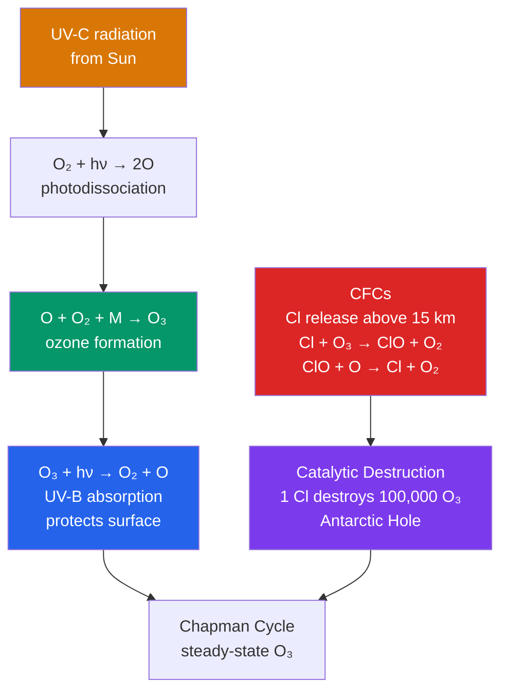

# 🧪 Atmospheric Chemistry and Stratospheric Ozone

> [!abstract] TL;DR
> **Atmospheric chemistry** governs the abundance and cycling of reactive gases — ozone (O₃), the hydroxyl radical (OH), nitrogen oxides (NOₓ), and volatile organic compounds (VOCs) — that jointly control climate, air quality, and the surface UV dose. **Stratospheric ozone**, peaking near **25 km at ~10 ppm**, absorbs biologically lethal **UV-B and UV-C** through a natural photochemical loop called the **Chapman cycle**. Anthropogenic **chlorofluorocarbons (CFCs)** release chlorine radicals that **catalytically destroy** ozone in chain reactions — a single Cl atom can consume ~100,000 O₃ molecules — producing the **Antarctic ozone hole**. The **Montreal Protocol (1987)** phased out these chemicals and has driven measurable ozone recovery. Meanwhile, **tropospheric chemistry** does the opposite: it manufactures surface ozone (photochemical smog) and lets the **OH radical** scrub the lower atmosphere of pollutants and oxidize methane.

## Intuition — analogy FIRST

Think of the stratosphere as Earth's **sunscreen worn 25 km up**. A thin smear of ozone — if you compressed all of it to sea-level pressure it would be a layer only **3 mm thick** — soaks up the Sun's most damaging ultraviolet before it can reach living tissue. Now imagine spraying a chemical into that sunscreen that dissolves it faster than the Sun can rebuild it. That is exactly what CFCs do: each chlorine atom acts like a catalytic solvent, tearing apart ozone molecule after molecule while barely being consumed itself. **Punch a hole in the sunscreen and the UV-B gets through** — raising skin-cancer rates, giving cataracts, and scorching the phytoplankton at the base of the ocean food web.

Down at the surface, the star chemical is different. The **hydroxyl radical (OH) is the atmosphere's soap** — a ferociously reactive scrubbing agent that grabs and breaks down most pollutants and greenhouse gases (methane, carbon monoxide, VOCs) before they accumulate. Without this "detergent," the lower atmosphere would fill up with its own exhaust. The catch: the very same ozone that *protects* us up high becomes a *toxic pollutant* down low. Same molecule, opposite meaning — location is everything.

---

## How It Works

Ozone is not a static reservoir; it is a **dynamic steady state** between production and destruction, both driven by sunlight. In the unpolluted stratosphere this balance is the **Chapman cycle** (1930): oxygen molecules are split by hard UV, the fragments recombine into ozone, and ozone is itself split by softer UV — the very act that shields the surface. Human chemistry hijacks this loop by injecting **catalysts** (Cl, Br, NO, OH) that accelerate the destruction side without being consumed, tipping the steady state toward far less ozone.



**1. The Chapman cycle (natural ozone in four reactions).** Sydney Chapman's 1930 scheme is pure oxygen photochemistry:

$$\text{O}_2 + h\nu \;\rightarrow\; 2\,\text{O} \qquad (\lambda < 242\ \text{nm}) \tag{R1}$$
$$\text{O} + \text{O}_2 + \text{M} \;\rightarrow\; \text{O}_3 + \text{M} \tag{R2}$$
$$\text{O}_3 + h\nu \;\rightarrow\; \text{O}_2 + \text{O} \qquad (\lambda \approx 240\text{–}320\ \text{nm}) \tag{R3}$$
$$\text{O} + \text{O}_3 \;\rightarrow\; 2\,\text{O}_2 \tag{R4}$$

R1 (photodissociation of O₂) is the **rate-limiting, slow source step** — it needs hard UV-C that only exists at altitude. R2 and R3 cycle furiously back and forth (they interconvert O and O₃ thousands of times without changing the total "odd oxygen" O_x = O + O₃), while **R4 is the slow natural sink**. Crucially, **R3 is the reaction that absorbs UV-B**: ozone is destroyed and immediately reforms via R2, so the net effect is that UV energy is converted to heat — which is why the stratosphere warms with height.

**2. Catalytic destruction cycles.** Chapman chemistry alone *overpredicts* ozone; the real sink is a family of **catalytic cycles** that speed up R4 without being consumed. The generic form is:

$$\text{X} + \text{O}_3 \;\rightarrow\; \text{XO} + \text{O}_2 \qquad\qquad \text{XO} + \text{O} \;\rightarrow\; \text{X} + \text{O}_2$$
$$\text{net:}\quad \text{O} + \text{O}_3 \;\rightarrow\; 2\,\text{O}_2$$

where **X = Cl, Br, NO, or OH**. The catalyst X emerges intact, ready to attack another ozone, so one atom can cycle **~10⁴–10⁵ times** before a "reservoir" reaction parks it. Sources: **Cl from CFCs** (dominant), **Br from halons** (per-atom ~60× more destructive than Cl but far less abundant), **NOₓ from N₂O oxidation**, and **HOₓ (OH/HO₂) from water and methane**.

**3. Polar stratospheric clouds (PSCs) and heterogeneous chemistry.** In gas phase, chlorine mostly hides in unreactive **reservoir species** — hydrogen chloride (HCl) and chlorine nitrate (ClONO₂). The Antarctic winter changes everything. The **polar vortex** isolates a pool of air and cools it below **~−78 °C**, cold enough to condense **polar stratospheric clouds** (nitric-acid trihydrate and water ice). On the surfaces of these cloud particles, otherwise-impossible **heterogeneous reactions** run:

$$\text{ClONO}_2 + \text{HCl} \;\xrightarrow{\text{PSC surface}}\; \text{Cl}_2 + \text{HNO}_3$$
$$\text{ClONO}_2 + \text{H}_2\text{O} \;\xrightarrow{\text{PSC surface}}\; \text{HOCl} + \text{HNO}_3$$

These convert the inert reservoirs into **photolabile Cl₂ and HOCl**, while locking away NO₂ as solid HNO₃ (**denitrification**), which removes the gas that would otherwise deactivate chlorine. The stage is now set.

**4. Ozone-hole dynamics.** Through the dark polar winter, Cl₂ accumulates. When the **spring Sun returns (September–October)**, sunlight photolyzes Cl₂ into two Cl atoms, unleashing an **explosive burst of catalytic destruction**, dominated by the **ClO dimer cycle** (ClO + ClO + M → Cl₂O₂, which photolyzes to release 2 Cl) that does not even need free O atoms. Ozone at 14–22 km can be **wiped out almost completely**, producing the "hole." As the vortex breaks down in late spring and mixes with ozone-rich mid-latitude air, the hole heals until the next winter.

**5. The Montreal Protocol.** Signed in **1987** and strengthened repeatedly (London 1990, Copenhagen 1992, Kigali 2016), it phased out CFCs, halons, and later HCFCs worldwide. Because CFCs live **50–100 years**, recovery lags emissions, but stratospheric chlorine peaked around 1997 and is now declining; **full recovery is projected around 2060–2080**. It is the only UN treaty ratified by every country on Earth.

**6. Tropospheric OH — the atmosphere's detergent.** Near the surface a *different* chemistry dominates. The **hydroxyl radical OH**, formed when ozone photolysis produces excited O(¹D) that reacts with water vapour,

$$\text{O}_3 + h\nu \rightarrow \text{O}(^1D) + \text{O}_2, \qquad \text{O}(^1D) + \text{H}_2\text{O} \rightarrow 2\,\text{OH}$$

initiates the oxidation of almost every reduced gas. The **methane oxidation chain** begins with

$$\text{OH} + \text{CH}_4 \rightarrow \text{CH}_3 + \text{H}_2\text{O}$$

and proceeds through formaldehyde and CO to CO₂, setting methane's ~9-year lifetime. **OH is the single most important control on the self-cleaning capacity of the troposphere.**

**7. Photochemical smog.** In polluted, sunlit air the equation flips to *making* ozone. **NOₓ + VOCs + sunlight** drive a cycle in which VOCs are oxidized to peroxy radicals that convert NO to NO₂; NO₂ then photolyzes to give the O atom that makes ozone (R2). The result is **ground-level ozone** — the toxic core of Los Angeles / Mexico City–style smog.

---

## Key Concepts / Details

### Secondary Level

- **Where the ozone layer lives.** A diffuse band in the stratosphere, roughly **15–35 km up**, densest near **25 km**. Even at its peak it is only ~10 molecules of ozone per million of air — squeezed to sea-level pressure the whole layer would be a **film ~3 mm thick**.
- **What UV-B does.** UV-B (280–315 nm) penetrates skin and is absorbed by **DNA**, causing the mutations behind **skin cancer** and premature ageing, plus **cataracts** and immune suppression. It also damages **phytoplankton** and crops. Ozone blocks essentially all UV-C and most UV-B.
- **Where CFCs came from.** Chlorofluorocarbons were cheap, non-toxic, non-flammable "miracle" chemicals used as **refrigerants** (fridges, air conditioners), **aerosol propellants** (spray cans), **foam-blowing agents**, and electronics solvents. Their very inertness let them survive the trip to the stratosphere intact.
- **The ozone hole over Antarctica.** Each Southern-Hemisphere spring, ozone over Antarctica plunges — the famous "hole." It sits over the *South* Pole because Antarctica's isolated, ultra-cold winter vortex is what makes the destroying clouds.
- **Why Montreal Protocol worked.** Substitutes existed, the science was decisive, and only a handful of chemicals from a few industries were involved — a *tractable* problem, unlike CO₂.
- **Surface ozone is a pollutant.** Down at the ground, ozone is a **lung irritant** and the main ingredient of summer smog. Cities issue **ozone action-day alerts** on hot, sunny, stagnant days.

### Undergraduate Level

- **Chapman reactions with rate constants.** R1 (J₁·[O₂], photolysis frequency J₁), R2 (k₂·[O][O₂][M], termolecular, temperature-dependent), R3 (J₃·[O₃], photolysis), R4 (k₄·[O][O₃], the slow sink). Steady state for **odd oxygen** balances production 2J₁[O₂] against loss 2k₄[O][O₃]; the fast pair R2/R3 sets the **O/O₃ partitioning** at each altitude.
- **The ozone maximum is a product of two opposing gradients.** UV intensity for R1 *increases* with altitude, but the density of O₂ and the third body M for R2 *decreases*. Their product peaks in the middle — near **25 km** — giving the layer its characteristic shape (a **Chapman-layer** profile).
- **Catalytic cycles, quantified.** Cl (from CFCs), Br (from halons), NOₓ (from N₂O), and HOₓ (from H₂O/CH₄) each run the generic X + O₃ / XO + O loop. Their **relative importance varies with altitude**: HOₓ dominates the upper stratosphere and mesosphere, NOₓ the mid-stratosphere, and halogens the lower stratosphere (and overwhelmingly the polar spring).
- **Dobson Units.** The total ozone column is measured in **Dobson Units (DU)**: **1 DU = 0.01 mm** of pure ozone at STP. A typical column is **~300 DU** (i.e. a 3 mm layer); the ozone hole is conventionally defined as the region below **220 DU**.
- **Antarctic ozone-hole mechanism, step by step.** (i) Winter **polar vortex** isolates and super-cools the air; (ii) **PSCs form** below ~195 K; (iii) heterogeneous reactions convert HCl and ClONO₂ into **Cl₂ / HOCl** and denitrify the air; (iv) **spring sunlight** photolyzes the chlorine; (v) the **ClO-dimer cycle** destroys ozone explosively; (vi) vortex breakup ends the episode.
- **"Area" vs "depth."** The hole is reported both as **area** (millions of km² below 220 DU — a measure of *extent*) and **minimum column / depth** (lowest DU value — a measure of *severity*). A cold, stable vortex year gives a bigger, deeper hole.
- **Brewer–Dobson circulation.** A slow overturning of the stratosphere: air **rises in the tropics**, drifts **poleward**, and **descends at high latitudes**. This is why ozone is *produced* over the tropics (max sunlight) but *accumulates* to higher columns over the mid/high latitudes — the column maximum is **not** over the equator.
- **Tropospheric oxidation and lifetimes.** OH sets the **lifetime** of most reactive gases: CH₄ ≈ 9 yr, CO ≈ 2 months, most NMVOCs hours to days. A gas's lifetime τ ≈ 1/(k[OH]) determines how far it spreads before being destroyed — short-lived species stay local, long-lived ones (CFCs, N₂O, CH₄) mix globally and reach the stratosphere.

### Graduate Level

- **Heterogeneous chemistry on PSC surfaces.** Three PSC types matter: **Type Ia = nitric-acid trihydrate (NAT, HNO₃·3H₂O)**, **Type Ib = supercooled ternary solution (STS, H₂SO₄/HNO₃/H₂O)**, and **Type II = water ice** (below the frost point ~188 K). Reaction probabilities (γ) for ClONO₂ + HCl approach ~0.3 on ice, orders of magnitude faster than gas-phase paths. **Sedimentation of large NAT particles** causes irreversible **denitrification**, prolonging the active-chlorine window.
- **Reservoir partitioning.** In the quiescent stratosphere ~99% of inorganic chlorine sits as **HCl** and **ClONO₂**; the ozone-destroying **active forms (Cl, ClO, Cl₂O₂)** are a tiny fraction — until PSC processing shifts nearly all of it into active form. Modelling ozone loss is really modelling this **partitioning**, not total chlorine.
- **Br–Cl synergism.** The **BrO + ClO → Br + Cl + O₂** cross-cycle destroys ozone without needing O atoms and is far more efficient at the low-O-atom conditions of the polar lower stratosphere; bromine (from halons and methyl bromide) contributes disproportionately despite trace abundance.
- **Ozone Depletion Potential (ODP).** A dimensionless index normalizing a compound's integrated ozone destruction to **CFC-11 = 1.0**. Halon-1301 ≈ 10–16; HCFCs ≈ 0.02–0.1; HFCs ≈ 0 (no chlorine) — which is why HFCs solved the *ozone* problem but created a *climate* one (high GWP, addressed by the **Kigali Amendment**).
- **Chemistry–climate models.** From early **semi-empirical 2D (latitude–altitude) models** to full **3D chemistry–climate models (CCMs)** coupling ~100+ reactions, transport, radiation, and dynamics. Air-quality analogues like **GEOS-Chem** and **WRF-Chem** simulate tropospheric O₃, NOₓ–VOC chemistry, and aerosols for policy and forecasting.
- **The recovery timeline.** WMO assessments project **column ozone returning to 1980 values** around **2040 (mid-latitudes)**, **2045 (Arctic)**, and **~2066 (Antarctic)**, assuming continued compliance — a rare, verifiable environmental success story.
- **Ozone–climate coupling.** Antarctic ozone loss cooled the polar lower stratosphere, strengthening the **Southern Annular Mode** and pushing the **Southern Hemisphere jet stream poleward** — altering surface winds, storm tracks, and even Southern Ocean circulation. Ozone recovery and rising CO₂ now push this jet in *opposing* directions.
- **Stratospheric ozone as a climate forcer.** Ozone is itself a **greenhouse gas**; stratospheric depletion produced a small *negative* forcing (cooling), while *tropospheric* ozone is the **third-largest anthropogenic greenhouse gas** after CO₂ and CH₄.
- **Global OH burden.** The tropospheric OH field — concentration ~10⁶ molecules cm⁻³, hugely variable — sets the **oxidizing capacity** of the whole lower atmosphere and thus the **methane lifetime**. It is constrained indirectly via proxy tracers like **methyl chloroform (CH₃CCl₃)**, and its long-term stability is a key uncertainty in the methane budget.

---

## Code Demo

```python
# Two-panel figure on stratospheric ozone:
#  (1) Southern-Hemisphere total-column ozone (Dobson Units) vs year, showing the
#      pre-1980 baseline, the 1980s collapse, the 1987 Montreal Protocol, and
#      the slow post-2000 recovery (schematic but quantitatively realistic).
#  (2) A 1D Chapman-style ozone production/loss profile vs altitude, peaking ~25 km.
import numpy as np
import matplotlib.pyplot as plt

# ---------------------------------------------------------------------------
# PANEL 1: Antarctic-region ozone column time series (approximated)
# ---------------------------------------------------------------------------
years = np.arange(1960, 2081)

def ozone_column(year):
    """Schematic SH spring total ozone (DU): baseline ~ 300, deep 1990s-2000s hole."""
    baseline = 300.0
    # Logistic DECLINE centered ~1985 as CFCs load the stratosphere
    decline = 130.0 / (1.0 + np.exp(-(year - 1985) / 3.0))
    # Logistic RECOVERY centered ~2045 following the 1987 Montreal Protocol
    recovery = 120.0 / (1.0 + np.exp(-(year - 2045) / 12.0))
    col = baseline - decline + recovery
    return col

col = ozone_column(years)
# Add small interannual variability (vortex strength, temperature, volcanoes)
rng = np.random.default_rng(42)
col_noisy = col + rng.normal(0, 6, size=years.shape)

fig, (ax1, ax2) = plt.subplots(1, 2, figsize=(13, 5.5))

ax1.plot(years, col, color='navy', lw=2.5, label='trend')
ax1.scatter(years, col_noisy, s=10, color='steelblue', alpha=0.5, label='annual (synthetic)')
ax1.axhline(220, color='red', ls='--', lw=1.2, label='ozone-hole threshold (220 DU)')
ax1.axvline(1987, color='green', ls=':', lw=1.5)
ax1.text(1988, 200, 'Montreal\nProtocol 1987', color='green', fontsize=9)
ax1.set_xlabel('Year'); ax1.set_ylabel('Total ozone column (DU)')
ax1.set_title('Antarctic spring ozone: decline & recovery')
ax1.set_ylim(150, 320); ax1.grid(alpha=0.3); ax1.legend(fontsize=8, loc='lower right')

# ---------------------------------------------------------------------------
# PANEL 2: idealized Chapman ozone number-density profile vs altitude
# ---------------------------------------------------------------------------
z = np.linspace(0, 50, 500)                       # altitude, km
# UV availability for O2 photolysis RISES with height (less overhead absorber)
uv = 1.0 - np.exp(-(z) / 12.0)
# Air (O2 + third body M) density FALLS ~ exponentially with height
air = np.exp(-z / 7.0)
# Ozone production ~ UV * air^2 (need O2 to split AND O2+M to reform O3)
production = uv * air**2
o3 = production / production.max() * 10.0         # scale so peak ~ 10 ppm-like units

peak_km = z[np.argmax(o3)]
ax2.plot(o3, z, color='seagreen', lw=2.5)
ax2.fill_betweenx(z, 0, o3, color='seagreen', alpha=0.15)
ax2.axhline(peak_km, color='darkorange', ls='--', lw=1.2)
ax2.text(0.3, peak_km + 1.2, f'ozone maximum ~ {peak_km:.0f} km', color='darkorange', fontsize=9)
ax2.set_xlabel('Relative ozone concentration'); ax2.set_ylabel('Altitude (km)')
ax2.set_title('Chapman ozone layer profile')
ax2.set_ylim(0, 50); ax2.grid(alpha=0.3)

plt.tight_layout()
plt.savefig('stratospheric_ozone.png', dpi=120)

print(f"Modeled ozone-layer peak altitude: {peak_km:.1f} km")
print(f"Minimum column reached (trend):    {col.min():.0f} DU  (below 220 DU = hole)")
print(f"Column in 1975 (pre-CFC era):      {ozone_column(1975):.0f} DU")
print(f"Column in 2000 (near worst):       {ozone_column(2000):.0f} DU")
print(f"Projected column in 2075:          {ozone_column(2075):.0f} DU")
print("Saved figure to stratospheric_ozone.png")

# Expected console highlights:
#   Modeled ozone-layer peak altitude: ~25 km
#   1975 ~ 300 DU  ->  2000 ~ 172 DU (deep hole)  ->  2075 ~ 290 DU (recovered)
```

The left panel reproduces the signature "**collapse then recovery**" ozone history — a steep 1980s decline through the 220 DU hole threshold, then a slow rebound after the Montreal Protocol. The right panel shows why the layer peaks near **25 km**: it is the product of *rising* UV availability and *falling* air density, whose maximum sits in the middle stratosphere.

---

## Real-World Notes

- **The most successful environmental treaty ever.** The **Montreal Protocol** is the only UN treaty with **universal ratification**; equivalent effective stratospheric chlorine peaked in the late 1990s and is now **declining**, with the Antarctic hole showing statistically detectable healing. A co-benefit: because CFCs/HCFCs are potent greenhouse gases, the phase-out also avoided substantial warming.
- **The 2023 hole was anomalously large** — one of the biggest on record — attributed partly to the **January 2022 Hunga Tonga–Hunga Haʻapai eruption**, which injected an unprecedented mass of **water vapour** into the stratosphere, cooling it and enhancing PSC-driven chlorine activation.
- **Surface ozone triggers public-health advisories.** On hot, stagnant, sunny days, NOₓ + VOC photochemistry pushes ground-level ozone past health limits, prompting **ozone action-day alerts** for children, the elderly, and asthmatics in cities worldwide.
- **Satellite ozone monitoring is continuous and global.** The lineage runs **TOMS → SBUV → OMI → TROPOMI (Sentinel-5P)**, providing **daily global maps** of total column ozone and tracing the hole's size and depth each spring — the data backbone of the WMO ozone assessments.
- **The hole was discovered from the ground.** The **British Antarctic Survey** (Farman, Gardiner & Shanklin, *Nature*, **1985**) reported the springtime collapse from **Halley Bay** Dobson-spectrophotometer records. Satellite data had actually seen it too, but automated quality control had flagged the ultra-low values as errors — the ground team caught what the algorithms discarded.

---

## Common Pitfalls

1. **Confusing "good" and "bad" ozone.** **Stratospheric ozone (protective)** and **tropospheric ozone (pollutant)** are the **exact same molecule** — the difference is purely *location*. Up high it shields us from UV; near the ground it is a toxic, lung-damaging component of smog. "Good up high, bad nearby."
2. **Thinking the ozone hole is a literal hole.** It is **not empty space** — it is a **region of severely depleted concentration** (below ~220 DU) within the ozone layer, where springtime chemistry has removed most, but not all, of the ozone.
3. **Merging the ozone and CO₂ problems.** **Ozone depletion (CFCs, UV)** and **global warming (CO₂, infrared)** are **distinct problems** with different chemicals, different wavelengths, and different fixes. CFCs happen to also be greenhouse gases, but the two crises are mechanistically separate — solving one does not solve the other.
4. **Assuming ozone loss warms the stratosphere.** In fact, **stratospheric ozone depletion cools the stratosphere** (less UV absorbed = less local heating), which **partially offsets** greenhouse warming *in that layer* — a counterintuitive coupling that complicates attributing stratospheric temperature trends.
5. **Trusting "ozone-friendly" labels blindly.** Many "**ozone-safe**" aerosols replaced CFCs with **HCFCs or HFCs**. HCFCs still deplete ozone (just less), and **HFCs are potent greenhouse gases** — which is exactly why the **Kigali Amendment (2016)** now phases *them* down too. Fixing ozone quietly created a climate liability.

---

## Related Concepts

- [[_MOC_Atmospheric_Structure]] — section map of the atmospheric-structure unit (uplink).
- [[Atmospheric_Layers_and_Composition]] — the vertical layering whose stratosphere hosts the ozone layer and whose warming-with-height is caused by ozone UV absorption.
- [[Greenhouse_Effect_and_Radiative_Forcing]] — how ozone (and CFC replacements) act as greenhouse gases, distinct from their UV role.
- [[Solar_Radiation_and_the_Energy_Budget]] — the incoming UV spectrum that both powers the Chapman cycle and is absorbed by ozone.
- [[Atmospheric_Optics_and_Aerosols]] — stratospheric aerosols (volcanic sulphate, PSCs) that provide surfaces for heterogeneous ozone chemistry.
- [[Anthropogenic_Climate_Change]] — the broader human perturbation of atmospheric composition, of which CFC emission is one chapter.
- [[_MOC_Chemistry_Master]] — parent chemistry vault for reaction kinetics and photochemistry.
- [[Chemical_Kinetics]] — rate constants, catalysis, and chain reactions underlying the Chapman and catalytic cycles.
- [[Acids_Bases_and_pH]] — nitric/hydrochloric acid reservoir species (HNO₃, HCl) central to PSC heterogeneous chemistry.
- [[_MOC_Physics_Master]] — parent physics vault for radiation and photodissociation physics.
- [[Electromagnetic_Waves_and_Radiation]] — the UV-C/UV-B photons whose energy drives photodissociation and defines the shielding.
- [[Atomic_Models_and_Spectroscopy]] — the molecular absorption/photolysis and radical chemistry (Cl, OH, ClO) at the heart of ozone destruction.

---

## Review Questions

- **Secondary:** Why is the ozone hole located over **Antarctica** rather than at the North Pole? What human activities caused ozone depletion, and what international treaty addressed the problem?
- **Undergraduate:** Write out the **four Chapman cycle reactions**. Which step is **rate-limiting**? Explain how a single chlorine atom can **catalytically destroy ~100,000 ozone molecules** before being deactivated, and what role **polar stratospheric clouds** play in making Antarctic depletion so severe.
- **Graduate:** Explain how the **heterogeneous reactions on PSC surfaces** release reactive chlorine from the **reservoir species HCl and ClONO₂**. How does this differ from the gas-phase Chapman cycle, and why does it lead to such dramatic **springtime** ozone loss over Antarctica? How does the **Brewer–Dobson circulation** shape the global latitudinal distribution of stratospheric ozone?

---

## Sources

- Wayne, R. P. — *Chemistry of Atmospheres*, 3rd ed. (Oxford University Press). Stratospheric and tropospheric photochemistry, catalytic cycles.
- Seinfeld, J. H. & Pandis, S. N. — *Atmospheric Chemistry and Physics: From Air Pollution to Climate Change*, 3rd ed. (Wiley). Chapman chemistry, ozone depletion, tropospheric OH and smog.
- World Meteorological Organization (WMO) — *Scientific Assessment of Ozone Depletion: 2022* (WMO/UNEP Global Ozone Research and Monitoring Project). Recovery timelines, ODP values, Antarctic hole assessment.
- Farman, J. C., Gardiner, B. G. & Shanklin, J. D. (1985) — "Large losses of total ozone in Antarctica reveal seasonal ClOₓ/NOₓ interaction," *Nature* **315**, 207–210.

---

#Meteorology #AtmosphericChemistry #StratosphericOzone #OzoneHole #MontrealProtocol
