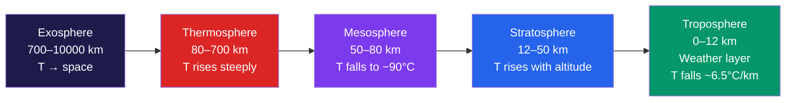

# 🌍 Atmospheric Layers and Composition

> [!abstract] TL;DR
> Earth's atmosphere is **stratified by reversals in its vertical temperature gradient**, not by sharp physical walls. Five principal layers stack from the surface upward — **troposphere, stratosphere, mesosphere, thermosphere, and exosphere** — each bounded by a "pause" where the temperature trend flips. By volume, dry air is remarkably uniform up to ~85 km: **78% N₂, 21% O₂, 0.93% Ar**, and a tiny but climatically decisive **0.04% CO₂**, plus highly variable water vapour. Because pressure falls off exponentially with a **scale height of ~8.5 km**, roughly **half the atmosphere's mass lies below 5.5 km** and about **99% below 32 km** — the layers above are physically vast but nearly massless. Each layer runs its own physics and chemistry: weather and convection in the troposphere, UV-absorbing ozone in the stratosphere, meteor ablation in the mesosphere, and ionisation and auroras in the thermosphere.

## Intuition — analogy FIRST

Picture the atmosphere as a **tall layered cake**, but a strange one where each layer's "flavour" — its temperature gradient — **reverses direction** from the layer below it. In the bottom sponge (the **troposphere**), it gets *colder* as you climb, the way a mountaintop is freezing. But the frosting above it (the **stratosphere**) does the opposite: it gets *warmer* with height, because that layer is soaked in ozone that drinks in the Sun's ultraviolet light and heats up from the top down. Climb into the next sponge (the **mesosphere**) and the chill returns — it is the coldest place in the whole atmosphere. Then the very top icing (the **thermosphere**) roasts again as raw solar X-rays and UV smash molecules apart.

So the atmosphere is a cake whose flavours alternate **cool → warm → cool → warm** as you rise, and every flavour change marks a boundary — a *tropopause*, *stratopause*, or *mesopause*. **Where the temperature gradient flips is where one layer ends and the next begins.** Once you see that each reversal is caused by *what absorbs sunlight at that height*, the whole structure stops being a list to memorise and becomes a story about where energy is deposited.

---

## How It Works

The layering is a direct consequence of **where solar energy is absorbed** in the vertical column. The Sun's radiation is deposited at different altitudes depending on wavelength: energetic X-rays and extreme-UV are absorbed highest up, mid-UV by ozone in the middle, and visible/near-IR passes through to warm the *ground*, which then heats the air from below. The result is a temperature profile that rises and falls, and each turning point defines a layer boundary.



**Reading the profile from the ground up:**

1. **Troposphere (cools with height).** Visible sunlight is largely transparent to air, so it passes through and heats the *surface*. The warm ground drives convection, and rising air expands and cools. The mean **environmental lapse rate is ~6.5 °C/km**. This convective mixing is exactly why all weather — clouds, storms, fronts — lives here. The trend ends at the **tropopause** (~12 km mid-latitude, ~17 km at the equator, ~8 km at the poles).

2. **Stratosphere (warms with height — the first reversal).** Here **ozone (O₃) absorbs solar UV**, converting it directly to heat *aloft*. Because the heating source is at the *top* of the layer, temperature *rises* with altitude, peaking at the **stratopause** (~50 km, near 0 °C). Warm air over cool air is **statically stable** — this is why the stratosphere has almost no vertical convection and is prized for smooth flight.

3. **Mesosphere (cools again — second reversal).** Above the ozone peak there is little to absorb sunlight, so the layer radiates heat to space and cools with height, bottoming out at the **mesopause** (~85 km, as cold as **−90 °C / ~183 K**) — the coldest point in the atmosphere. Meteors ablate here.

4. **Thermosphere (warms steeply — third reversal).** Extreme-UV and X-rays from the Sun photodissociate and ionise O₂ and N₂, dumping energy into a very thin gas. Temperature soars past **1000 K** (and far higher during solar maximum). The **ionosphere** and **auroras** live here.

5. **Exosphere.** The uppermost fringe, where the gas is so rarefied that molecules follow ballistic trajectories and light atoms (H, He) can escape to space entirely. There is no meaningful "temperature" in the thermodynamic sense — it merges into the solar wind.

The key physical takeaway: **temperature reversals are not arbitrary — each one marks a switch in the dominant radiative process** (ground heating → ozone UV absorption → radiative cooling → EUV ionisation).

---

## Key Concepts / Details

### Secondary Level

**The five layers, bottom to top:**

| Layer | Altitude (approx.) | Temperature trend | Signature feature |
|-------|--------------------|-------------------|-------------------|
| Troposphere | 0–12 km | **Falls** ~6.5 °C/km | Weather, clouds, ~80% of mass |
| Stratosphere | 12–50 km | **Rises** | Ozone layer, stable, jets cruise here |
| Mesosphere | 50–85 km | **Falls** to ~−90 °C | Meteors burn up |
| Thermosphere | 85–700 km | **Rises** to 1000+ K | Ionosphere, auroras, ISS orbit |
| Exosphere | 700–10 000 km | Merges into space | Atoms escape to space |

**The boundaries ("pauses")** are where the trend reverses: **tropopause** (top of troposphere), **stratopause** (top of stratosphere), **mesopause** (top of mesosphere).

**Dry-air composition (by volume, near the surface):**

| Gas | Fraction | Role |
|-----|----------|------|
| Nitrogen (N₂) | **78.08%** | Inert bulk gas |
| Oxygen (O₂) | **20.95%** | Respiration, combustion, ozone source |
| Argon (Ar) | **0.93%** | Inert noble gas |
| Carbon dioxide (CO₂) | **~0.04%** (420 ppm) | Greenhouse gas — small but decisive |
| Neon, He, CH₄, Kr, H₂, N₂O… | trace | Various |
| Water vapour (H₂O) | **0–4%, highly variable** | Not part of "dry air"; greenhouse gas, forms clouds |

**Where weather happens:** essentially all of it in the **troposphere**, because that is where convection, water vapour, and clouds are. The **ozone layer** sits in the lower-to-mid stratosphere (~20–30 km) and shields the surface from harmful UV.

### Undergraduate Level

**The hydrostatic equation.** A thin slab of air is squeezed between the pressure below and the pressure above; that pressure difference must support the slab's weight:

$$\frac{dP}{dz} = -\rho g$$

**Scale height and the barometric formula.** Combine hydrostatics with the ideal gas law $P = \rho R_d T$ (equivalently $P = \rho \tfrac{R^{*}}{M} T$). For an isothermal layer,

$$\frac{dP}{dz} = -\frac{Mg}{R^{*}T}\,P \quad\Rightarrow\quad P(z) = P_0\,e^{-z/H}, \qquad H = \frac{R^{*}T}{Mg}$$

The **scale height** $H$ is the altitude over which pressure falls by a factor of $e$. For dry air at 288 K:

$$H = \frac{(8.314)(288)}{(0.02896)(9.81)} \approx 8.4\ \text{km} \approx 8.5\ \text{km}$$

This single number explains the exponential thinning: every ~8.5 km, pressure drops to ~37% of its value below.

**Virtual temperature.** Moist air is *less* dense than dry air at the same $T$ and $P$ (water is lighter than N₂/O₂). To keep using the dry-air gas constant, replace $T$ with the **virtual temperature** $T_v \approx T(1 + 0.61\,r)$, where $r$ is the water-vapour **mixing ratio** (mass of vapour per mass of dry air). $T_v$ is always slightly larger than $T$, and it is what actually governs buoyancy.

**Water vapour as a variable.** Because vapour condenses and evaporates, its mixing ratio ranges from near-zero in the polar stratosphere to ~40 g/kg in the tropics. This variability is why we quote *dry-air* composition and handle H₂O separately.

**Ionospheric layers.** Within the thermosphere, solar EUV ionises the gas into stratified **D, E, and F layers** (F splits into F1/F2 by day). These reflect HF radio waves — the basis of long-distance shortwave communication — and vary strongly between day and night as the D layer decays after sunset.

**Noctilucent clouds.** The frigid **mesopause** (~130–150 K) allows the highest clouds on Earth (~80–85 km) — thin ice-crystal *noctilucent clouds*, visible at twilight when the surface is dark but they are still sunlit.

**Number density vs altitude.** Even though the *composition* (mixing ratio) stays nearly constant up to ~85 km, the **number density** $n = P/(k_B T)$ collapses exponentially — from ~$2.5\times10^{25}\,\text{m}^{-3}$ at the surface to ~$10^{19}\,\text{m}^{-3}$ near 100 km. A "hot" thermosphere at 1000 K still has vanishingly few molecules.

**Absorption windows and Wien's law.** The Sun (~5800 K) peaks in the visible by Wien's law ($\lambda_\text{max} \approx 2898/T\ \mu\text{m·K} \approx 0.5\ \mu\text{m}$); Earth (~255 K emitting) peaks in the thermal IR (~10 μm). The atmosphere is a *selective* filter — largely transparent in the visible "window," strongly absorbing in UV (ozone/O₂) and in IR bands (H₂O, CO₂) — which is the physical basis of both UV shielding and the greenhouse effect.

### Graduate Level

**Chapman function and slant paths.** The classic **Chapman layer** describes how an absorbing species produces a peak in absorption (and ion production) at the altitude where the optical depth along the solar beam reaches unity. For an overhead Sun the vertical optical depth is $\tau(z) = \sigma\!\int_z^\infty n\,dz'$; for a solar zenith angle $\chi$ the slant path lengthens the effective air mass by the **Chapman function** $\text{Ch}(x,\chi)$, which reduces to $\sec\chi$ for small $\chi$ but stays finite at the horizon (unlike $\sec\chi$, which diverges). This governs the altitude and thickness of the ozone and ionospheric production peaks and their diurnal migration.

**Radiatively active trace gases.** Beyond CO₂, several minor constituents punch far above their weight:

| Gas | Typical tropospheric mixing ratio | Radiative role |
|-----|-----------------------------------|----------------|
| CH₄ | ~1.9 ppm | Strong IR absorber; ~28–34× CO₂ per molecule (100-yr GWP) |
| N₂O | ~0.33 ppm | Long-lived greenhouse gas; stratospheric NOₓ source |
| O₃ | ~0.02–0.1 ppm (trop.), up to ~10 ppm (strat.) | UV shield aloft, greenhouse gas + pollutant near surface |

Their small abundances belie their leverage because they absorb in the **atmospheric IR window (8–12 μm)** where H₂O and CO₂ are relatively transparent.

**Homosphere vs heterosphere.** Below the **turbopause (~85–100 km)**, turbulent mixing dominates molecular diffusion, so the *composition is uniform* (the **homosphere**) — this is why 78/21 N₂/O₂ holds all the way up to the mesopause. Above the turbopause lies the **heterosphere**, where molecular diffusion wins and species separate by mass.

**Diffusive separation.** In the heterosphere each gas settles toward its *own* scale height $H_i = R^{*}T/(M_i g)$. Heavy species (N₂, O₂, Ar) fall off quickly with height, while **light species (O, He, then H) become progressively enriched** with altitude. Atomic oxygen dominates from ~200–600 km, helium above that, and atomic hydrogen at the exobase. Consequently the **mean molecular weight decreases with altitude** — a profile that empirical models must carry explicitly.

**Mean free path across the layers.** The mean free path $\lambda = 1/(\sqrt{2}\,n\,\sigma)$ scales inversely with number density: ~$70\ \text{nm}$ at the surface, ~cm near 100 km, and **kilometres in the exosphere**, where it exceeds the local scale height — the formal definition of the **exobase**, above which molecular collisions effectively cease and ballistic/Jeans escape governs the light species.

**Auroral physics.** Auroras are **thermospheric** emission: solar-wind electrons and protons, funnelled along geomagnetic field lines into the polar cusps, collisionally excite atomic O and N₂. The **557.7 nm green line** (O, ~100–150 km) and **630.0 nm red line** (O, >200 km, forbidden transition with a long radiative lifetime) dominate, with N₂⁺ blue/violet bands at lower altitudes.

**Empirical modelling — MSIS.** Because thermospheric density, temperature, and composition vary with solar EUV, geomagnetic activity, local time, and season, they are captured by **empirical models such as NRLMSISE-00 / MSIS 2.0**, built from decades of satellite drag, mass-spectrometer, and incoherent-scatter radar data. These models provide the mean molecular weight and density profiles needed for satellite drag and re-entry prediction.

**Limb sounding and occultation.** Vertical profiles above the turbopause are retrieved by looking *tangentially* through the atmosphere: **solar/stellar occultation** (measuring absorption as a source sets behind the limb) and **limb emission sounding** give long slant paths that amplify weak trace-gas signals. Instruments like SAGE and MIPAS use exactly this geometry to build **multi-year records of stratospheric aerosol optical depth** — the record that reveals how volcanic injections (e.g. Pinatubo, 1991) load the stratosphere with sulphate aerosol and perturb the radiation budget for years.

---

## Code Demo

```python
# US Standard Atmosphere 1976: reconstruct T(z) and P(z) from first principles.
# The model stacks 7 layers, each with a constant lapse rate; pressure is
# integrated analytically from the hydrostatic equation + ideal gas law.
# Valid to ~86 km geopotential (troposphere -> stratosphere -> mesosphere).
import numpy as np
import matplotlib.pyplot as plt

# --- Physical constants (SI) ---
g0 = 9.80665      # standard gravity, m/s^2
M  = 0.0289644    # mean molar mass of dry air, kg/mol
R  = 8.3144598    # universal gas constant, J/(mol*K)
P0 = 101325.0     # sea-level pressure, Pa

# Layer bases: geopotential height h_b [m], base temp T_b [K], lapse rate L [K/m]
# (positive L = temperature RISES with height)
h_b = np.array([0, 11000, 20000, 32000, 47000, 51000, 71000], dtype=float)
T_b = np.array([288.15, 216.65, 216.65, 228.65, 270.65, 270.65, 214.65])
L   = np.array([-0.0065, 0.0, 0.001, 0.0028, 0.0, -0.0028, -0.002])

# Precompute the base pressure at the bottom of each layer by chaining upward
P_b = np.empty_like(h_b)
P_b[0] = P0
for i in range(len(h_b) - 1):
    dh = h_b[i+1] - h_b[i]
    if L[i] == 0.0:                       # isothermal layer -> exponential
        P_b[i+1] = P_b[i] * np.exp(-g0 * M * dh / (R * T_b[i]))
    else:                                 # constant-lapse layer -> power law
        T_top = T_b[i] + L[i] * dh
        P_b[i+1] = P_b[i] * (T_top / T_b[i]) ** (-g0 * M / (R * L[i]))

def atmosphere(h):
    """Return (T [K], P [Pa]) at geopotential height h [m] for h <= 86 km."""
    i = np.searchsorted(h_b, h, side='right') - 1   # which layer are we in?
    i = np.clip(i, 0, len(h_b) - 1)
    dh = h - h_b[i]
    T = T_b[i] + L[i] * dh
    P = np.where(
        L[i] == 0.0,
        P_b[i] * np.exp(-g0 * M * dh / (R * T_b[i])),
        P_b[i] * (T / T_b[i]) ** (-g0 * M / (R * np.where(L[i] == 0.0, 1.0, L[i]))),
    )
    return T, P

z = np.linspace(0, 84000, 1000)         # geopotential height grid, m
T, P = atmosphere(z)
z_km = z / 1000.0

# --- Sanity checks printed to console ---
for target in [0, 11000, 20000, 50000]:
    Tt, Pt = atmosphere(np.array([float(target)]))
    print(f"z={target/1000:5.1f} km : T={Tt[0]:6.2f} K, "
          f"P={Pt[0]:9.1f} Pa ({100*Pt[0]/P0:5.2f}% of surface)")

frac_below_20 = 1 - atmosphere(np.array([20000.0]))[1][0] / P0
print(f"\nFraction of atmospheric mass below 20 km: {frac_below_20*100:.1f}%")

# --- Plot T(z) and P(z) side by side ---
fig, (axT, axP) = plt.subplots(1, 2, figsize=(11, 6), sharey=True)

axT.plot(T, z_km, color='crimson', lw=2)
axT.set_xlabel('Temperature (K)'); axT.set_ylabel('Geopotential altitude (km)')
axT.set_title('Temperature profile (US Std Atm 1976)')
axT.grid(alpha=0.3)

axP.semilogx(P, z_km, color='navy', lw=2)   # log axis reveals the exponential falloff
axP.set_xlabel('Pressure (Pa, log scale)')
axP.set_title('Pressure profile (exponential decay)')
axP.grid(alpha=0.3, which='both')

# Annotate layer boundaries on both panels
for hb, name in zip([11, 20, 47, 71], ['tropopause', ' ', 'stratopause', ' ']):
    for ax in (axT, axP):
        ax.axhline(hb, color='gray', ls='--', lw=0.8, alpha=0.6)
    if name.strip():
        axT.text(200, hb + 1, name, fontsize=8, color='gray')

axT.text(235, 5,  'Troposphere',  fontsize=9, rotation=0)
axT.text(235, 30, 'Stratosphere', fontsize=9)
axT.text(210, 60, 'Mesosphere',   fontsize=9)

plt.tight_layout()
plt.savefig('us_standard_atmosphere.png', dpi=120)
print("\nSaved figure to us_standard_atmosphere.png")

# Expected console highlights:
#   z=  0.0 km : T=288.15 K, P= 101325.0 Pa (100.00% of surface)
#   z= 11.0 km : T=216.65 K, P=  22632.1 Pa ( 22.34% of surface)
#   z= 20.0 km : T=216.65 K, P=   5474.9 Pa (  5.40% of surface)
#   z= 50.0 km : T=270.65 K, P=     75.9 Pa (  0.07% of surface)
#   Fraction of atmospheric mass below 20 km: ~94.6%
```

The output makes the two headline facts concrete: temperature **reverses** at the tropopause and stratopause, and pressure decays roughly **exponentially** (a straight line on the log plot within each layer), so ~95% of the atmosphere's mass sits below 20 km.

---

## Real-World Notes

- **Airliners cruise in the lower stratosphere.** At mid-latitudes the tropopause sits near ~11 km, and jets cruise at ~10–12 km to ride the **statically stable, cloud-free, low-turbulence** stratospheric air just above the weather — also where fuel efficiency is best in the thin, cold air.
- **Space Shuttle re-entry heating happens in the thermosphere.** Despite near-vacuum *pressure*, the thermosphere's ~1000+ K gas and, more importantly, the **enormous kinetic energy** of a 7.8 km/s vehicle compressing the sparse gas produce a plasma sheath of thousands of °C — heat comes from *velocity*, not ambient warmth.
- **GPS signals are bent by two layers.** The **troposphere** (neutral, wet delay) and the **ionosphere** (dispersive, frequency-dependent delay) both refract GNSS signals; high-accuracy positioning applies tropospheric models and dual-frequency ionospheric corrections.
- **The ozone layer is life's UV shield.** Stratospheric O₃ absorbs essentially all **UV-C** and most **UV-B**, radiation that would otherwise damage DNA — which is why the Antarctic "ozone hole" and the Montreal Protocol matter far beyond meteorology.
- **Concorde flew at ~18 km.** Cruising deep in the stratosphere let it exploit **stable, thin air** for supersonic efficiency; passengers could even perceive the curvature of the Earth and the darkening sky. And note the contrast: **Mt Everest's summit (8.85 km)** is *still in the troposphere*, yet pressure there is only ~⅓ of sea level, which is why the "death zone" has so little O₂ despite the same 21% mixing ratio.

---

## Common Pitfalls

1. **"The troposphere always cools with height."** The *average* lapse rate is ~6.5 °C/km, but **temperature inversions** — where air warms with height — are common (nocturnal radiation inversions, subsidence inversions, frontal inversions). These stable layers trap pollutants and are central to smog episodes.
2. **"The thermosphere is scorching, so it's hot up there."** Kinetic temperature exceeds **1000 K**, but the **density is so low** that the heat content is negligible; an exposed astronaut would *radiate away* heat and feel cold, not warm. Temperature (energy per molecule) and heat (energy times number of molecules) are not the same thing.
3. **"A thick layer holds more air."** Layer *thickness* is unrelated to *mass*. The thermosphere spans hundreds of kilometres but holds a vanishing fraction of the mass; the 12-km troposphere holds ~80%. Mass follows the **exponential pressure profile**, not geometric height.
4. **"Ozone is good, so more is better."** **Stratospheric** ozone shields us, but **surface (tropospheric) ozone** is a toxic **pollutant** and greenhouse gas — a lung irritant and a core ingredient of photochemical smog. Same molecule, opposite value depending on altitude ("good up high, bad nearby").
5. **"The Kármán line is the physical edge of space."** The **100 km Kármán line** is an **arbitrary convention** (roughly where aerodynamic lift would require orbital speed); it lies within the thermosphere, and the atmosphere continues far above it — the ISS orbits at ~400 km, still experiencing measurable drag.

---

## Related Concepts

- [[_MOC_Atmospheric_Structure]] — section map of the atmospheric-structure unit (uplink).
- [[Solar_Radiation_and_the_Energy_Budget]] — the incoming solar energy that each layer selectively absorbs, driving the temperature reversals.
- [[Atmospheric_Pressure_and_the_Hydrostatic_Equation]] — the hydrostatic balance and scale height behind the exponential pressure profile used here.
- [[Atmospheric_Chemistry_and_Stratospheric_Ozone]] — the ozone photochemistry that heats the stratosphere and shields the surface from UV.
- [[Greenhouse_Effect_and_Radiative_Forcing]] — how trace gases (CO₂, CH₄, N₂O, H₂O) in this composition trap outgoing IR.
- [[_MOC_Physics_Master]] — parent physics vault for the underlying mechanics and thermodynamics.
- [[Laws_of_Thermodynamics]] — energy conservation and entropy governing adiabatic lapse and static stability.
- [[Kinetic_Theory_of_Gases]] — number density, mean free path, and the molecular meaning of "temperature" in the thermosphere.
- [[Electromagnetic_Waves_and_Radiation]] — the wavelength-dependent absorption (Wien's law, UV vs IR windows) that stratifies the atmosphere.
- [[_MOC_Chemistry_Master]] — chemistry vault for gas composition and photodissociation reactions.
- [[The_Sun]] — the EUV/X-ray source that ionises the thermosphere and powers the ionosphere and auroras.

---

## Review Questions

- **Secondary:** List the five atmospheric layers in order from the surface to space, and state whether temperature **increases or decreases** with altitude in each.
- **Undergraduate:** Starting from the hydrostatic equation $dP/dz = -\rho g$ and the ideal gas law, **derive the barometric formula** $P(z) = P_0 e^{-z/H}$ for an isothermal atmosphere. Compute the **scale height for dry air at 15 °C**. Using the exponential profile, estimate **what fraction of the atmosphere's total mass lies below 20 km**.
- **Graduate:** Explain **diffusive separation above the turbopause**: which gases become **enriched** and which become **depleted** with altitude, and why? How does the resulting change in the **mean molecular weight profile** feed into empirical models like **NRLMSISE-00** used for satellite-drag and re-entry prediction?

---

## Sources

- Holton, J. R. & Hakim, G. J. — *An Introduction to Dynamic Meteorology*, 5th ed. (Academic Press). Ch. 1: fundamentals, hydrostatic balance, scale height.
- Wallace, J. M. & Hobbs, P. V. — *Atmospheric Science: An Introductory Survey*, 2nd ed. (Academic Press). Ch. 1 & 3: composition, vertical structure, thermodynamics of dry/moist air.
- Andrews, D. G. — *An Introduction to Atmospheric Physics*, 2nd ed. (Cambridge University Press). Ch. 1–3: layer structure, radiative processes, ozone and the middle atmosphere.
- U.S. Standard Atmosphere, 1976 (NOAA/NASA/USAF) — reference profiles used in the code demo.

---

#Meteorology #AtmosphericScience #AtmosphericLayers #Composition
