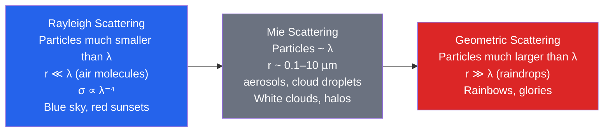

# 🌈 Atmospheric Optics and Aerosols

> [!abstract] TL;DR
> Atmospheric optics is the study of how light is **scattered, absorbed, and refracted** by the atmosphere's gas molecules and its suspended particles (**aerosols**). **Rayleigh scattering** by molecules much smaller than the wavelength scales as $\lambda^{-4}$, so blue light scatters far more than red — this paints the daytime sky blue and reddens the low Sun at sunset. **Mie scattering** by particles comparable to the wavelength (radius $\sim\lambda$) is nearly wavelength-independent, which is why clouds and haze appear white. Aerosols — sea salt, mineral dust, sulfate, organic carbon, and black carbon — exert a large but **highly uncertain climate influence**, cooling directly by scattering sunlight and indirectly by seeding brighter, longer-lived clouds, while absorbing species like black carbon warm. The column loading is quantified by the **aerosol optical depth (AOD)**, monitored globally from space (MODIS, MISR) and from the ground (the AERONET sun-photometer network).

## Intuition — analogy FIRST

Imagine throwing balls of different sizes at a forest of thin, closely spaced saplings. Tiny ping-pong balls (short wavelengths) ricochet wildly off every trunk and scatter in all directions; big beach balls (long wavelengths) barely notice the saplings and sail straight through. **Air molecules are the saplings, and blue light is the ping-pong ball.** Because scattering strength grows steeply as the ball shrinks — precisely as $\lambda^{-4}$ — blue and violet bounce around the sky many times more than red does. Look anywhere away from the Sun and your eye catches this rescattered blue light: the sky is blue.

Now watch a **sunset**. When the Sun sits on the horizon, its light skims through a much longer slab of atmosphere before reaching you. Along that long path essentially *all* the blue has been scattered out sideways (lighting up someone else's sky), and only the survivors — red and orange — reach your eye directly. Same physics, longer path, opposite colour.

Finally, why are **clouds white**, not blue, even though they are made of transparent water? Because cloud droplets ($\sim10\ \mu\text{m}$) are far *larger* than the wavelength of light. Large particles scatter **all colours nearly equally** (Mie scattering), so white light in gives white light out. The size of the particle relative to the wavelength decides everything — and that single ratio organizes the whole subject.

---

## How It Works

The controlling quantity is the **size parameter** $x = 2\pi r / \lambda$, the ratio of particle circumference to wavelength. Three regimes follow, and each governs a different family of sky phenomena:



**Rayleigh scattering ($x \ll 1$).** For a particle much smaller than the wavelength, the incident field is essentially uniform across it and drives an oscillating dipole. The re-radiated power gives a scattering cross-section

$$\sigma_{\text{R}} = \frac{2\pi^5}{3}\,\frac{d^6}{\lambda^4}\left(\frac{n^2-1}{n^2+2}\right)^2,$$

with $d$ the diameter and $n$ the refractive index. The signature $\lambda^{-4}$ dependence means violet ($400\ \text{nm}$) scatters $(700/400)^4 \approx 9.4\times$ more strongly than red ($700\ \text{nm}$). (The sky looks blue rather than violet because the Sun emits less violet, our eyes are less violet-sensitive, and upper-atmosphere ozone absorbs some violet.) The angular pattern is symmetric fore-and-aft, $\propto (1+\cos^2\theta)$, and the scattered light is strongly polarized at $90^\circ$ from the Sun.

**Mie scattering ($x \sim 1$).** When the particle is comparable to the wavelength, the full **Lorenz–Mie** solution of Maxwell's equations is required — an infinite series in spherical harmonics. The wavelength dependence weakens dramatically (roughly $\lambda^{0}$ to $\lambda^{-1.5}$ for typical aerosols), so scattering becomes nearly **colour-neutral**: clouds, fog, and thick haze appear white or grey. Mie scattering is also strongly **forward-peaked** — most light continues roughly in its original direction — which is why you see a bright glare around the Sun through thin cloud.

**Geometric optics ($x \gg 1$).** For raindrops and large ice crystals, light can be treated as **rays** that refract and reflect at surfaces. Refraction plus one internal reflection in a spherical raindrop produces the **primary rainbow** (bow at $\sim42^\circ$ from the antisolar point, red on the outside); two internal reflections give the fainter, colour-reversed **secondary rainbow** at $\sim51^\circ$.

### Aerosols: what they are and what they do

**Aerosol** = any solid or liquid particle suspended in air (excluding cloud/rain drops themselves). The main types, by source and optical behaviour:

| Type | Dominant source | Typical size | Optical role |
|---|---|---|---|
| Sea salt | Ocean spray (bubble bursting) | Coarse ($>1\ \mu\text{m}$) | Scatters (cooling) |
| Mineral dust | Deserts, dry lakebeds | Coarse | Scatters + partly absorbs (iron oxides) |
| Sulfate ($\text{SO}_4^{2-}$) | $\text{SO}_2$ oxidation (fossil fuel, volcanoes) | Fine ($<1\ \mu\text{m}$) | Strong scatterer, cooling; efficient CCN |
| Organic carbon | Biomass burning, biogenic SOA | Fine | Mostly scatters |
| Black carbon (soot) | Incomplete combustion | Fine | Strong **absorber**, warming |

**Column loading — aerosol optical depth (AOD).** Extinction of the direct solar beam obeys the **Beer–Lambert law**, $I = I_0\,e^{-\tau}$, where the optical depth $\tau = \int \sigma_{\text{ext}}\, n\, dz$ integrates extinction over the whole column. AOD $\tau$ at $550\ \text{nm}$ is the standard measure of how much aerosol sits overhead: $\tau \sim 0.05$ over a clean ocean, $\tau \sim 0.2$–$0.5$ over polluted or dusty regions, and $\tau > 1$ in dense smoke or a dust storm.

**Direct radiative effect.** By scattering sunlight back to space, most aerosols add to planetary albedo and **cool** the surface (negative forcing). But absorbing aerosols (black carbon) intercept sunlight and **warm** the atmospheric layer they occupy while dimming the surface — the net sign depends on the **single-scattering albedo** $\omega_0$ (fraction of extinction that is scattering rather than absorption) and on the brightness of the underlying surface.

**Indirect (aerosol–cloud) effects.** Aerosols that act as **cloud condensation nuclei (CCN)** reshape clouds:
- **First indirect / Twomey effect:** more CCN, at fixed cloud water, means the water is divided among *more but smaller* droplets. Smaller droplets scatter more efficiently per unit water, so the cloud becomes **brighter** (higher albedo) — a cooling.
- **Second indirect / lifetime effect:** smaller droplets coalesce into rain less efficiently, so clouds **last longer and rain less**, again cooling on average.

**Volcanic aerosols and climate cooling.** A large explosive eruption injects **$\text{SO}_2$** into the *stratosphere*, where it oxidizes to sulfuric-acid ($\text{H}_2\text{SO}_4$) droplets. Being above the weather, these persist for **1–2 years**, raising global AOD and reflecting sunlight. **Mount Pinatubo (1991)** cooled the globe by $\sim0.5^\circ\text{C}$ for about two years — a natural experiment that validates aerosol–climate models.

### Refraction and reflection phenomena

- **Halos** — refraction through hexagonal **ice crystals** in cirrus. Light passing through the $60^\circ$ prism formed by alternate side faces bends by a minimum of $\sim21.8^\circ$, producing the common **$22^\circ$ halo**; the $90^\circ$ end-vs-side prism gives the rarer **$46^\circ$ halo**. (These are *ice*, never liquid water.)
- **Rainbows** — geometric refraction + internal reflection in spherical raindrops (primary $\sim42^\circ$, secondary $\sim51^\circ$).
- **Green flash** — at the instant of sunset, the atmosphere acts as a weak prism; the red rim sets first and blue is scattered away, so the last light to vanish is briefly **green**, visible under a sharp, clean horizon.
- **Mirages** — refraction through strong vertical temperature (density) gradients. An **inferior mirage** (hot road/desert, air hottest at the ground) bends rays upward, placing an *inverted image below* the object — the shimmering "water" on a highway. A **superior mirage** (temperature inversion, cold air below warm) bends rays downward, lifting an image *above* the object and producing the towering, distorted **Fata Morgana**.

---

## Key Concepts / Details

### Secondary Level

- **Why the sky is blue.** Air molecules scatter short (blue) wavelengths far more than long (red) ones, because scattering strength grows as $\lambda^{-4}$. Blue light bounces around the sky and reaches your eye from every direction.
- **Why sunsets are red.** Near the horizon, sunlight travels through much more atmosphere; the blue is scattered away along the path, leaving the reds and oranges to reach you directly.
- **Why clouds are white.** Cloud droplets are much larger than a wavelength, so they scatter **all colours equally**. White light in, white light out. The water itself is transparent — the *droplets* do the scattering.
- **How rainbows form.** Sunlight enters a raindrop, refracts (bending different colours by different amounts), reflects off the back, and refracts again on the way out — spreading white sunlight into a coloured arc opposite the Sun.
- **Types of aerosols.** Tiny airborne particles: sea-salt spray, desert dust, smoke from fires, and pollution haze. Some are natural, some human-made.
- **How volcanoes cool the climate.** Big eruptions blast sulfur high into the stratosphere, where it forms a bright haze that reflects sunlight and temporarily cools the whole planet.

### Undergraduate Level

**Rayleigh cross-section scaling.** For a small dielectric sphere the *scattering efficiency* $Q_{\text{sca}} = \sigma/(\pi r^2)$ scales as

$$Q_{\text{sca}} \propto \left(\frac{r}{\lambda}\right)^4 = x^4,$$

so the cross-section itself goes as $\sigma \propto r^6/\lambda^4$. Doubling the wavelength drops scattering $16\times$.

**Beer–Lambert extinction.** The direct beam through a column of optical depth $\tau$ is transmitted as

$$I = I_0\, e^{-\tau/\cos\theta_z} = I_0\, e^{-\tau\, m},$$

where $\theta_z$ is the solar zenith angle and $m \approx 1/\cos\theta_z$ is the **air mass**. For overhead Sun ($m=1$), an AOD of $\tau=0.3$ transmits $e^{-0.3}\approx 0.74$ of the direct beam.

**Aerosol optical depth (AOD)** $\tau$ — the vertically integrated extinction; the master variable for column aerosol loading.

**Single-scattering albedo** $\omega_0 = \dfrac{\sigma_{\text{sca}}}{\sigma_{\text{sca}}+\sigma_{\text{abs}}}$ — ranges from $\omega_0=1$ (pure scatterer, e.g. sulfate/sea salt) to $\omega_0=0$ (pure absorber). Black carbon has $\omega_0 \approx 0.2$–$0.4$; it sets whether an aerosol cools or warms.

**Asymmetry parameter** $g = \langle\cos\theta\rangle$ — the intensity-weighted mean cosine of the scattering angle. $g=0$ is isotropic (Rayleigh), $g\to 1$ is fully forward. Typical aerosols have $g\approx 0.6$–$0.7$; the strong forward peak reduces how much light is actually turned back to space.

**Aerosol size distribution** is well described by a sum of **lognormal** modes,

$$\frac{dN}{d\ln r} = \frac{N}{\sqrt{2\pi}\,\ln\sigma_g}\exp\!\left[-\frac{(\ln r - \ln r_g)^2}{2(\ln\sigma_g)^2}\right],$$

with geometric mean radius $r_g$ and geometric standard deviation $\sigma_g$.

**Size modes:**

| Mode | Radius range | Origin / fate |
|---|---|---|
| Nucleation | $< 0.005\ \mu\text{m}$ | Fresh gas-to-particle conversion |
| Aitken | $0.005$–$0.05\ \mu\text{m}$ | Coagulation growth; combustion |
| Accumulation | $0.05$–$0.5\ \mu\text{m}$ | Optically most active, long-lived, best CCN |
| Coarse | $> 1\ \mu\text{m}$ | Mechanically generated (dust, sea salt); settles fast |

**Cloud condensation nuclei (CCN)** — the subset of aerosols on which water vapour condenses to form cloud droplets. More CCN → the **Twomey effect**: at fixed liquid water, more and smaller droplets → brighter cloud.

**Volcanic cooling chain:** $\text{SO}_2 \to \text{H}_2\text{SO}_4$ droplets in the stratosphere $\to$ elevated AOD $\to$ reflected sunlight $\to$ transient global cooling.

### Graduate Level

**Full Mie theory (Lorenz–Mie).** For a homogeneous sphere the scattering and extinction efficiencies are infinite series in the Mie coefficients $a_n, b_n$ (ratios of Riccati–Bessel functions of the size parameter $x$ and the complex index $m$):

$$Q_{\text{ext}} = \frac{2}{x^2}\sum_{n=1}^{\infty}(2n+1)\,\mathrm{Re}(a_n+b_n),\qquad Q_{\text{sca}} = \frac{2}{x^2}\sum_{n=1}^{\infty}(2n+1)\left(|a_n|^2+|b_n|^2\right).$$

The **complex refractive index** $m = n + ik$ carries both the real part $n$ (refraction/scattering) and the imaginary part $k$ (absorption); $k$ for black carbon is $\sim0.5$–$0.8$, versus $k\approx 0$ for sulfate.

**Phase function.** Full Mie phase functions are expensive, so radiation codes approximate them with the single-parameter **Henyey–Greenstein** form,

$$p(\cos\theta) = \frac{1-g^2}{\left(1+g^2-2g\cos\theta\right)^{3/2}},$$

which reproduces the forward peak through $g$ alone.

**Aerosol indirect effects (formalized).** The **first indirect (Twomey)** effect fixes liquid water path (LWP) and increases droplet number $N_d$; the **second indirect (lifetime/precipitation)** effect lets cloud water and cloud fraction adjust. IPCC decomposes total aerosol forcing into **ARI** (aerosol–radiation interaction, the direct effect) and **ACI** (aerosol–cloud interaction).

**Forcing estimates (illustrative, still uncertain).** Direct/ARI $\approx -0.45 \pm 0.5\ \text{W/m}^2$; indirect/ACI $\approx -0.9\ \text{W/m}^2$ — the largest single uncertainty in anthropogenic radiative forcing. (IPCC AR6 gives total aerosol ERF $\approx -1.1\ \text{W/m}^2$, likely range $-1.7$ to $-0.4$.)

**Absorbing aerosol and the semi-direct effect.** **Absorption AOD (AAOD)** isolates the absorbing component; black-carbon heating of the aerosol layer can **evaporate cloud (semi-direct effect)** or, when deposited on snow, lower surface albedo — both warming pathways that partly offset sulfate cooling.

**Ångström exponent** $\alpha$ characterizes the *spectral slope* of AOD, $\tau(\lambda)\propto\lambda^{-\alpha}$, and hence particle size: $\alpha \approx 4$ for molecular (Rayleigh) scattering, $\alpha \sim 1.5$–$2.5$ for fine pollution/smoke, and $\alpha \lesssim 0.5$ for coarse dust and sea salt. It is the key discriminator between fine and coarse aerosol in remote sensing.

**Observing systems.** **AERONET** — a global network of $\sim1000$ ground **sun photometers** — provides high-accuracy AOD and inversion products (size distribution, $\omega_0$) that anchor satellite retrievals. Space-based AOD comes from **MODIS** (Dark Target and Deep Blue algorithms, plus the high-resolution **MAIAC**) and multi-angle **MISR**, which adds particle-shape and height information; lidar (CALIOP) resolves the vertical distribution. These feed **aerosol–climate feedbacks** in Earth-system models, where meteorology, chemistry, and cloud microphysics are two-way coupled.

---

## Python Demo

Two figures: (1) the Rayleigh scattering cross-section versus wavelength, normalized to $\sigma(400\ \text{nm})=1$, showing the steep $\lambda^{-4}$ falloff; and (2) a two-mode lognormal aerosol number distribution (fine accumulation mode + coarse mode).

```python
# Atmospheric optics and aerosols.
# (1) Rayleigh scattering cross-section vs wavelength (sigma ∝ lambda^-4).
# (2) Lognormal aerosol size distribution: fine (accumulation) + coarse mode.
import numpy as np
import matplotlib.pyplot as plt

# --- (1) Rayleigh scattering, normalized to sigma(400 nm) = 1 ---
wavelength_nm = np.linspace(300, 700, 400)          # visible-ish band, nm
sigma = (400.0 / wavelength_nm) ** 4                # sigma ∝ lambda^-4, normalized at 400 nm

# Compare blue (450 nm) to red (700 nm)
blue_over_red = (700.0 / 450.0) ** 4
violet_over_red = (700.0 / 400.0) ** 4
print(f"Blue (450 nm) scatters {blue_over_red:.2f}x more than red (700 nm)")   # ~5.86x
print(f"Violet (400 nm) scatters {violet_over_red:.2f}x more than red (700 nm)")  # ~9.38x

# --- (2) Lognormal aerosol number distribution dN/dln(r) ---
def lognormal_dNdlnr(r, N, r_g, sigma_g):
    """Number distribution per unit ln(r). r, r_g in micrometres."""
    coeff = N / (np.sqrt(2.0 * np.pi) * np.log(sigma_g))
    return coeff * np.exp(-(np.log(r) - np.log(r_g))**2 / (2.0 * np.log(sigma_g)**2))

r = np.logspace(-2, 1.3, 500)                       # 0.01 to ~20 micrometres
fine   = lognormal_dNdlnr(r, N=1.0,  r_g=0.10, sigma_g=1.6)  # accumulation mode
coarse = lognormal_dNdlnr(r, N=0.02, r_g=2.00, sigma_g=2.0)  # coarse mode (dust/sea salt)

fig, (ax1, ax2) = plt.subplots(1, 2, figsize=(12, 4.5))

ax1.plot(wavelength_nm, sigma, color="#2563eb", lw=2)
for wl, name, col in [(450, "blue", "#2563eb"), (550, "green", "#16a34a"),
                      (700, "red", "#dc2626")]:
    ax1.axvline(wl, ls="--", lw=1, color=col, alpha=0.7)
ax1.set_xlabel("Wavelength (nm)")
ax1.set_ylabel(r"Relative scattering cross-section  $\sigma/\sigma_{400}$")
ax1.set_title(r"Rayleigh scattering  $\sigma \propto \lambda^{-4}$")
ax1.grid(alpha=0.3)

ax2.plot(r, fine,   color="#2563eb", lw=2, label=r"Fine (accumulation): $r_g=0.1\,\mu m$")
ax2.plot(r, coarse, color="#d97706", lw=2, label=r"Coarse: $r_g=2\,\mu m$")
ax2.set_xscale("log")
ax2.set_xlabel(r"Particle radius $r$ ($\mu m$, log scale)")
ax2.set_ylabel(r"$dN/d\ln r$ (normalized)")
ax2.set_title("Lognormal aerosol size distribution")
ax2.legend()
ax2.grid(alpha=0.3, which="both")

plt.tight_layout()
plt.savefig("atmospheric_optics.png", dpi=120)
plt.show()
```

Expected: the Rayleigh curve rises steeply toward short wavelengths, with blue ($450\ \text{nm}$) scattering $\approx 5.86\times$ and violet ($400\ \text{nm}$) $\approx 9.38\times$ more than red ($700\ \text{nm}$). The size-distribution plot shows a narrow, tall **fine mode** near $0.1\ \mu\text{m}$ (the optically dominant, CCN-active aerosols) and a broad, low **coarse mode** near $2\ \mu\text{m}$ (dust and sea salt).

---

## Real-World Notes

- **Mount Pinatubo (June 1991)** injected $\sim20\ \text{Tg}$ of $\text{SO}_2$ into the stratosphere. The resulting sulfate veil raised global AOD sharply and cooled Earth's surface by $\sim0.5^\circ\text{C}$ for about two years — the best-observed volcanic climate perturbation and a benchmark test for climate models.
- **Wildfires and biomass burning** are dominant sources of **organic carbon** and **black carbon** aerosol; large fire seasons (e.g. Australia 2019–20, boreal Canada 2023) loft smoke across continents and oceans, spiking AOD and reddening skies far downwind.
- **AERONET**, a network of $\sim1000$ automated **sun photometers**, delivers daily, high-accuracy AOD and aerosol-property retrievals worldwide — the ground truth that calibrates and validates satellite AOD products.
- **"Blue Moon" events** occur when smoke or dust particles of a narrow size ($\sim0.7\ \mu\text{m}$) preferentially scatter *red* light out of the beam, letting the transmitted moonlight appear bluish — famously after the 1883 Krakatoa eruption and during major wildfire smoke plumes.
- **Ship tracks** — bright, linear cloud features threading through marine stratocumulus in satellite imagery — are the aerosol **indirect effect made visible**: ship-exhaust particles add CCN, shrinking droplets and brightening the cloud along the vessel's path.

---

## Common Pitfalls

1. **Applying Rayleigh scattering to clouds.** Rayleigh's $\lambda^{-4}$ law holds *only* when $r \ll \lambda$. Cloud droplets are $\sim10\ \mu\text{m}$ — far larger than visible wavelengths — so cloud whiteness is **Mie** scattering (nearly colour-neutral), not Rayleigh.
2. **Confusing halos with rainbows.** The $22^\circ$ and $46^\circ$ halos come from **refraction in hexagonal ice crystals** in cirrus, not from water droplets. Rainbows are a separate, liquid-water, geometric-optics phenomenon on the *opposite* side of the sky from the Sun.
3. **Assuming aerosols only cool.** Aerosol forcing is signed by species: scattering sulfate, sea salt, and most dust **cool**, but absorbing **black carbon warms**. The *net* effect depends on composition, single-scattering albedo $\omega_0$, and surface brightness — do not read "negative aerosol forcing" as "all aerosols cool."
4. **Ignoring where the aerosol sits.** AOD is a **column** integral. A thin, optically faint layer high in the stratosphere may look invisible yet be climatically potent (long lifetime, above the clouds), while a dense near-surface haze may be short-lived. Vertical distribution matters as much as total loading.
5. **Equating air-quality PM with AOD.** Health metrics like $\text{PM}_{2.5}$ and $\text{PM}_{10}$ measure **surface mass concentration** ($\mu\text{g/m}^3$); AOD measures **column optical extinction** (dimensionless). They correlate loosely but describe different properties — a lofted dust plume can raise AOD while ground-level PM stays moderate, and vice versa.

---

## Related Concepts

- [[_MOC_Atmospheric_Structure]] — section map of the atmosphere and its radiative processes (entry point).
- [[Atmospheric_Layers_and_Composition]] — the gases and layers doing the scattering and absorbing; where aerosols reside (troposphere vs stratosphere).
- [[Solar_Radiation_and_the_Energy_Budget]] — how scattering and aerosol reflection feed into planetary albedo and the top-of-atmosphere balance.
- [[Greenhouse_Effect_and_Radiative_Forcing]] — the framework of radiative forcing into which aerosol direct and indirect effects are folded.
- [[Atmospheric_Chemistry_and_Stratospheric_Ozone]] — gas-to-particle conversion, volcanic $\text{SO}_2 \to$ sulfate chemistry, and ozone's UV absorption.
- [[Remote_Sensing_Radar_and_Satellites]] — MODIS, MISR, and AERONET retrievals of AOD; the observational backbone of aerosol monitoring.
- [[Climate_Models_and_Projections]] — where aerosol forcing enters as the dominant uncertainty in projected warming.
- [[_MOC_Physics_Master]] — physics-vault entry point for the underlying electromagnetism and optics.
- [[Electromagnetic_Waves_and_Radiation]] — the wave nature of light being scattered and refracted.
- [[Wave_Motion_and_Properties]] — interference, diffraction, and dispersion that underlie halos, coronae, and rainbows.
- [[Atomic_Models_and_Spectroscopy]] — molecular absorption bands that complement scattering in the atmosphere's spectrum.

---

## Review Questions

- **Secondary:** Explain in physical terms why the daytime sky is blue but sunsets are red. Then explain why clouds appear **white** even though they are made of water, which is transparent.
- **Undergraduate:** The Rayleigh scattering cross-section scales as $\lambda^{-4}$. How much more strongly does $400\ \text{nm}$ (violet) light scatter than $700\ \text{nm}$ (red) light? Separately, if the aerosol optical depth at $500\ \text{nm}$ is $\tau=0.3$, what fraction of the **direct** solar beam is transmitted when the Sun is overhead, and how would that change at a solar zenith angle of $60^\circ$?
- **Graduate:** Describe the **Twomey effect** (aerosol first indirect effect). At fixed liquid water path, how does doubling the CCN concentration change the cloud-droplet effective radius, the cloud optical depth, and the planetary albedo (give the approximate scaling)? Explain why the aerosol **indirect** forcing is the most uncertain component of total anthropogenic radiative forcing.

---

## Sources

- van de Hulst, H. C. *Light Scattering by Small Particles* (Wiley, 1957; Dover reprint) — the classic derivation of Rayleigh and Mie scattering.
- Seinfeld, J. H. & Pandis, S. N. *Atmospheric Chemistry and Physics: From Air Pollution to Climate Change*, 3rd ed. (Wiley, 2016) — aerosol sources, size distributions, CCN, and indirect effects.
- Bohren, C. F. & Clothiaux, E. E. *Fundamentals of Atmospheric Radiation* (Wiley-VCH, 2006) — scattering, absorption, and radiative transfer with physical insight.
- IPCC AR6 WG1 (2021), Ch. 6–7 — aerosol radiative forcing estimates and uncertainty.
- NASA AERONET: <https://aeronet.gsfc.nasa.gov/>

---

#Meteorology #AtmosphericOptics #Aerosols #RayleighScattering #MieScattering
