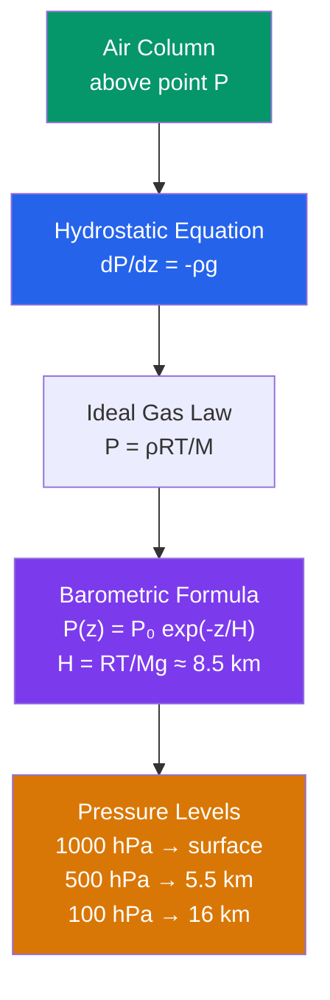

# 🌡️ Atmospheric Pressure and the Hydrostatic Equation

> [!abstract] TL;DR
> Atmospheric pressure is the weight of the overlying air column per unit area — about $101{,}325$ Pa ($1013.25$ hPa) at sea level. The **hydrostatic equation** $\frac{dP}{dz} = -\rho g$ states that the vertical pressure gradient exactly balances gravity acting on the air. Combining it with the ideal gas law gives the **barometric formula** $P(z) = P_0\,e^{-z/H}$, where the scale height $H = \frac{RT}{Mg} \approx 8.5$ km sets how rapidly pressure falls with height — roughly **50% of the atmosphere's mass lies below 5.5 km** (the 500 hPa level). Because pressure decreases monotonically with height, meteorologists use *pressure* rather than *altitude* as the vertical coordinate; pressure-based coordinate systems ($\sigma$, $\eta$, $\theta$) are the foundation of every numerical weather prediction model.

---

## Intuition — analogy FIRST

Imagine standing at the bottom of a swimming pool. The pressure you feel on your ears is simply the **weight of all the water stacked directly above you**, pressing down and (because fluids transmit pressure equally in all directions) squeezing in from every side. Dive twice as deep and there is twice as much water overhead, so the pressure roughly doubles.

The atmosphere works the same way — you already live at the bottom of an "ocean of air" roughly 100 km deep, and sea-level pressure is the weight of that entire air column bearing down on every square metre. The one crucial difference: **water is nearly incompressible** (so pool pressure grows *linearly* with depth), whereas **air is compressible**. Air near the surface is squashed by the weight above it, so it is dense; air high up has little weight pressing on it, so it is thin. The result is that atmospheric density and pressure fall off *exponentially* with height rather than linearly — the air "runs out" much faster than a naive pool analogy would suggest.

---

## How It Works

The vertical structure of the atmosphere follows from a single force balance. Take a thin horizontal slab of air of thickness $dz$ and unit horizontal area. Gravity pulls it down with force $\rho g\,dz$; the pressure difference between its bottom and top ($P(z)$ vs $P(z+dz)$) pushes it up. In the absence of significant vertical acceleration these must balance, giving the hydrostatic equation. Feed in the ideal gas law and you get the barometric formula and the ladder of pressure levels used on every weather map.



**The hydrostatic assumption.** The balance $dP/dz = -\rho g$ is only *approximate*: the full vertical momentum equation is
$$\frac{Dw}{Dt} = -\frac{1}{\rho}\frac{\partial P}{\partial z} - g,$$
and hydrostatic balance drops the vertical acceleration $Dw/Dt$. This is superbly accurate for large-scale flow, where vertical velocities are $\sim\!\text{cm/s}$ and $Dw/Dt \ll g \approx 9.8\ \text{m/s}^2$. It **fails inside convective updrafts** (thunderstorms, where $w$ can reach tens of m/s) and in downbursts — exactly the situations that convection-permitting models must treat non-hydrostatically.

**Deriving the barometric formula.** Start from the two governing relations:
$$\frac{dP}{dz} = -\rho g, \qquad P = \frac{\rho R T}{M} = \rho R_d T,$$
where $R$ is the universal gas constant, $M$ the mean molar mass of dry air ($\approx 28.96$ g/mol), and $R_d = R/M \approx 287\ \text{J kg}^{-1}\text{K}^{-1}$ the specific gas constant. Solve the ideal gas law for $\rho = PM/(RT)$ and substitute:
$$\frac{dP}{P} = -\frac{Mg}{RT}\,dz = -\frac{dz}{H}, \qquad H \equiv \frac{RT}{Mg}.$$
For an **isothermal** layer ($T$ constant) this integrates directly to the barometric formula:
$$\boxed{\,P(z) = P_0\,e^{-z/H}\,}$$

**Scale height.** $H = RT/(Mg)$ is the vertical distance over which pressure drops by a factor $e \approx 2.718$. For $T = 250$ K it is $H \approx 7.3$ km; for a warmer mean tropospheric temperature it approaches $\approx 8.5$ km. Warm atmospheres are "puffier" (larger $H$, pressure falls slowly); cold atmospheres are compact.

**Why 500 hPa matters.** The 500 hPa surface sits near 5.5 km — the level where about half the atmosphere's mass is below and half above, i.e. the **mid-troposphere**. Flow at 500 hPa is largely free of surface friction yet still steers surface weather systems, so the 500 hPa geopotential-height chart (with its troughs and ridges) is the workhorse of synoptic forecasting.

**Geopotential height.** Because gravity weakens slightly with altitude, meteorology replaces geometric height $z$ with **geopotential height** $Z$, defined so that potential energy is exactly $g_0 Z$:
$$Z = \frac{1}{g_0}\int_0^z g(z')\,dz', \qquad g_0 = 9.80665\ \text{m/s}^2.$$
Integrating the hydrostatic equation between two pressure levels in $Z$ gives the **hypsometric equation** (the altimeter's core relation):
$$\Delta Z = Z_2 - Z_1 = \frac{R_d\,\overline{T}}{g_0}\ln\!\frac{P_1}{P_2},$$
where $\overline{T}$ is the mean (virtual) temperature of the layer. The thickness between two pressure surfaces is thus a direct thermometer of the intervening air — "thickness charts" distinguish warm from cold air masses.

**Breakdown in convection.** Inside a growing cumulus tower, buoyant parcels accelerate upward, $Dw/Dt$ is no longer negligible, and pressure is no longer just the weight of overlying air (dynamic pressure perturbations appear). Hydrostatic NWP models literally *cannot represent* such updrafts — they must parameterize convection — which is why km-scale forecasting requires **non-hydrostatic** dynamical cores.

---

## Key Concepts / Details

### Secondary Level

- **Sea-level pressure** averages $\approx 1013.25$ hPa (also written 1 atm $= 101{,}325$ Pa $= 760$ mmHg). It is literally the weight of the air column above you divided by area.
- **Highs and lows.** On a weather map, an **H** marks a region of higher-than-surrounding surface pressure (typically sinking air, clear skies) and an **L** marks lower pressure (rising air, clouds and storms).
- **Pressure falls with altitude**, and it falls *fast*: about halving every 5.5 km. Mountaineers on Everest (8.8 km) breathe air at only $\sim\!1/3$ of sea-level pressure.
- **Why your ears pop.** The middle ear holds trapped air. When you ascend quickly (plane take-off, mountain road), outside pressure drops but inner-ear pressure lags; the eardrum bulges outward until the Eustachian tube equalizes it — the "pop."
- **Altimeter settings.** Pilots and hikers use barometric altimeters that convert measured pressure into altitude; they must dial in the local sea-level pressure so the reading is correct.

### Undergraduate Level

**Force-balance derivation.** For an air parcel of area $A$ and thickness $dz$, the net upward pressure force $A[P(z) - P(z+dz)] = -A\,dP$ must support its weight $\rho g A\,dz$. Cancelling $A$ gives $-dP = \rho g\,dz$, i.e. $\dfrac{dP}{dz} = -\rho g$.

**Variable temperature (layer model).** Real atmospheres are not isothermal. The US Standard Atmosphere stacks layers of constant lapse rate $L = -dT/dz$. Within a layer with base $(P_b, T_b)$:
$$P(z) = P_b\left(\frac{T_b}{T_b + L(z-z_b)}\right)^{\!g_0 M/(RL)} \quad (L\neq 0),$$
reverting to the exponential form when $L = 0$ (isothermal layers such as the tropopause).

**Geopotential height $Z$** (above) linearizes gravity so the hydrostatic equation reads $dP = -\rho g_0\,dZ$ — a cleaner form used throughout dynamics.

**Hypsometric equation** $\Delta Z = \dfrac{R_d \overline{T}}{g_0}\ln(P_1/P_2)$ relates layer thickness to mean temperature; it is how radiosondes convert measured pressure/temperature into height.

**Standard atmosphere landmarks** (approximate): 1000 hPa $\approx$ surface; 850 hPa $\approx$ 1.5 km; 700 hPa $\approx$ 3 km; 500 hPa $\approx$ 5.5 km; 300 hPa $\approx$ 9 km (jet level); 200 hPa $\approx$ 12 km; 100 hPa $\approx$ 16 km (near tropical tropopause).

**Reduction to sea level.** A weather station at elevation reports *station pressure*, then extrapolates downward through a fictitious air column to give **mean sea-level pressure (MSLP)**, so stations at different elevations can be compared on one map.

**Pressure coordinates ($p$-coordinates).** Because $P$ decreases monotonically with height, it is a legitimate vertical coordinate. Using $P$ instead of $z$ turns the density-weighted continuity equation into a simple, *density-free* form $\nabla_p\!\cdot\!\mathbf{V} + \partial\omega/\partial p = 0$ — a major reason meteorologists prefer it.

### Graduate Level

**When does hydrostatic balance break?** Compare the vertical acceleration to gravity via a vertical Rossby/aspect argument: hydrostatic balance holds when the ratio of vertical acceleration to the pressure-gradient term is small, which scales with $(H/L)^2$ where $L$ is the horizontal scale of the motion. For synoptic $L \sim 1000$ km it is $\sim\!10^{-4}$ (excellent); for cumulus $L \sim 1$ km it is order unity (balance fails). The **Richardson number** $Ri = N^2/(\partial u/\partial z)^2$ further diagnoses when buoyancy-driven vertical accelerations dominate shear.

**Anelastic and non-hydrostatic approximations.** For deep convection, models retain vertical acceleration. The **anelastic** system filters acoustic waves by using a reference-state density $\bar\rho(z)$ while keeping buoyancy and non-hydrostatic pressure; fully **non-hydrostatic** cores (WRF, ICON, MPAS) solve the complete vertical momentum equation and are mandatory for **convection-permitting NWP** ($\lesssim 4$ km grid spacing).

**Terrain-following $\sigma$-coordinates.** Define $\sigma = P/P_s$, where $P_s$ is the surface pressure. Then $\sigma = 1$ at the ground and $\sigma = 0$ at the model top *everywhere*, so the lower boundary becomes a coordinate surface even over mountains — no coordinate "cuts into" terrain. The cost: $\sigma$-surfaces slope steeply over topography, introducing pressure-gradient-force errors near mountains.

**Hybrid $\sigma$–$p$ ($\eta$) coordinates.** Operational models blend terrain-following $\sigma$ near the surface with flat pressure surfaces aloft, via $P = A(\eta) + B(\eta)P_s$. This keeps the clean lower boundary of $\sigma$ while removing its steep-slope errors in the stratosphere.

**Isentropic ($\theta$) coordinates and the Exner function.** Using potential temperature $\theta$ as the vertical coordinate, adiabatic flow stays on a coordinate surface. The **Exner function**
$$\pi = c_p\left(\frac{P}{P_0}\right)^{R_d/c_p}$$
replaces pressure as the natural variable, and the horizontal momentum equations acquire the **Montgomery streamfunction** $\psi = c_p T + gZ = \pi\theta + \Phi$ as their streamfunction — geostrophic flow follows $\psi$-contours on an isentrope.

**Why hydrostatic models can't make clouds.** A hydrostatic core diagnoses vertical velocity from continuity rather than predicting it from buoyancy, so it cannot generate the strong, narrow updrafts of a cumulus tower. Individual clouds are therefore invisible to it and must be represented by a **convective parameterization** — the single largest source of uncertainty in coarse global models.

---

## Python demo — US Standard Atmosphere (1976)

The script builds the US Standard Atmosphere layer-by-layer, then plots pressure $P(z)$, density $\rho(z)$, and local scale height $H(z) = R_d T/g_0$ from 0–80 km. It marks the standard pressure levels and verifies that ~50% of the atmosphere's mass lies below the 500 hPa surface (≈ 5.5 km), since the mass of air *above* height $z$ equals $P(z)/g$.

```python
# US Standard Atmosphere 1976: P(z), rho(z), H(z) and the "half-mass" altitude.
# Runnable with numpy + matplotlib.
import numpy as np
import matplotlib.pyplot as plt

# ---- Physical constants (US Standard Atmosphere 1976) ----
g0    = 9.80665       # m/s^2   standard gravity
Rstar = 8.31446       # J/(mol K) universal gas constant
M     = 0.0289644     # kg/mol  mean molar mass of dry air
Rd    = Rstar / M     # ~287.05 J/(kg K) specific gas constant for dry air

# ---- Layer table: base geopotential height (m), base temperature (K), lapse rate (K/m) ----
h_base = np.array([0, 11000, 20000, 32000, 47000, 51000, 71000], dtype=float)
T_base = np.array([288.15, 216.65, 216.65, 228.65, 270.65, 270.65, 214.65])
L      = np.array([-0.0065, 0.0, 0.001, 0.0028, 0.0, -0.0028, -0.002])   # K/m

# Precompute base pressures by integrating the hydrostatic/gas-law solution upward.
P_base = np.zeros_like(h_base)
P_base[0] = 101325.0                                # sea-level pressure (Pa)
for i in range(len(h_base) - 1):
    dh = h_base[i+1] - h_base[i]
    if L[i] == 0.0:                                 # isothermal layer -> exponential
        P_base[i+1] = P_base[i] * np.exp(-g0*dh/(Rd*T_base[i]))
    else:                                           # constant-lapse layer -> power law
        P_base[i+1] = P_base[i] * (T_base[i]/(T_base[i]+L[i]*dh))**(g0/(Rd*L[i]))

def standard_atmosphere(h):
    """Temperature, pressure, density at geopotential height h [m] (scalar or array)."""
    h = np.atleast_1d(h).astype(float)
    T = np.empty_like(h); P = np.empty_like(h)
    idx = np.clip(np.searchsorted(h_base, h, side='right') - 1, 0, len(h_base) - 1)
    for k in range(len(h_base)):
        m = idx == k
        if not np.any(m):
            continue
        dh = h[m] - h_base[k]
        T[m] = T_base[k] + L[k]*dh
        if L[k] == 0.0:
            P[m] = P_base[k]*np.exp(-g0*dh/(Rd*T_base[k]))
        else:
            P[m] = P_base[k]*(T_base[k]/(T_base[k]+L[k]*dh))**(g0/(Rd*L[k]))
    rho = P/(Rd*T)
    return T, P, rho

z = np.linspace(0, 80000, 2000)          # geopotential altitude, 0-80 km
T, P, rho = standard_atmosphere(z)
H = Rd * T / g0                          # local scale height (m)

# ---- Half the atmospheric mass lies where P = P0/2 (mass above z is proportional to P(z)) ----
mass_below = 1.0 - P/P[0]                # fraction of column mass below height z
z_half = np.interp(0.5, mass_below, z)   # crosses 0.5 near 5.5 km

# ---- Altitudes of standard pressure levels (P is decreasing -> reverse for interp) ----
levels_hPa = [850, 700, 500, 300, 200, 100]
z_of_P = lambda p_hpa: np.interp(p_hpa*100.0, P[::-1], z[::-1])   # hPa -> m

fig, ax = plt.subplots(1, 3, figsize=(15, 6), sharey=True)

ax[0].plot(P/100, z/1000, 'b')
ax[0].set_xscale('log'); ax[0].set_xlabel('Pressure (hPa)'); ax[0].set_ylabel('Altitude (km)')
ax[0].set_title('Pressure  P(z)')
for p in levels_hPa:
    zk = z_of_P(p)/1000
    ax[0].axhline(zk, color='grey', ls=':', lw=0.8)
    ax[0].text((P.max()/100)*0.35, zk+0.6, f'{p} hPa  ({zk:.1f} km)', fontsize=8)

ax[1].plot(rho, z/1000, 'g')
ax[1].set_xscale('log'); ax[1].set_xlabel('Density (kg/m³)')
ax[1].set_title('Density  ρ(z)')

ax[2].plot(H/1000, z/1000, color='purple')
ax[2].set_xlabel('Scale height  H = Rd·T/g₀  (km)')
ax[2].set_title('Scale height  H(z)')

for a in ax:                              # 50%-mass line on every panel
    a.axhline(z_half/1000, color='red', ls='--', lw=1.2)
ax[0].text(2, z_half/1000+1.0,
           f'50% of mass below {z_half/1000:.1f} km', color='red', fontsize=9)

plt.tight_layout(); plt.show()

# ---- Console summary ----
print(f"Sea-level pressure: {P[0]/100:.2f} hPa")
print(f"50% of atmospheric mass lies below {z_half/1000:.2f} km "
      f"(P = {np.interp(z_half, z, P)/100:.0f} hPa)")
for p in levels_hPa:
    print(f"{p:4d} hPa  ->  {z_of_P(p)/1000:5.2f} km")
```

Expected console output (rounded): sea-level pressure $\approx 1013.25$ hPa; 50% of mass below $\approx 5.5$ km at $\approx 500$ hPa; 850 hPa ≈ 1.5 km, 700 hPa ≈ 3.0 km, 500 hPa ≈ 5.6 km, 300 hPa ≈ 9.2 km, 200 hPa ≈ 11.8 km, 100 hPa ≈ 16.2 km. The density panel shows the same near-exponential decline, and the scale-height panel reveals $H$ ranging from ~8.4 km at the warm surface down to ~6.3 km at the cold tropopause and back up in the warm stratopause — a direct picture of "$H$ tracks temperature."

---

## Real-World Notes

- **Isobars on surface maps** are drawn at **4 hPa intervals** (e.g. 1000, 1004, 1008…); tightly packed isobars mean a strong pressure gradient and therefore strong winds — the map's spacing is a wind-speed gauge.
- **The 500 hPa chart (~5.5 km)** is the forecaster's primary upper-air tool because it sits near the mid-troposphere: its geopotential-height troughs and ridges steer surface cyclones and mark the polar jet.
- **Aircraft altimeters** are aneroid barometers calibrated to pressure-altitude. Pilots set **QNH** (local mean sea-level pressure) so the instrument reads true altitude above sea level near the airport; above the transition altitude they switch to the standard 1013.25 hPa ("QNE") so all aircraft share one reference.
- **Highest sea-level pressure** ever recorded is $\approx 1084$ hPa, in the intensely cold **Siberian High** at Agata, Russia (Dec 2001) — dense, frigid air piling up over the continent.
- **Lowest sea-level pressure** ever measured is $\approx 870$ hPa, in the eye of **Typhoon Tip** (Western Pacific, Oct 1979) — the deepest pressure well ever sampled, and the reason its winds were catastrophic.

---

## Common Pitfalls

1. **Assuming hydrostatic balance always holds.** $dP/dz = -\rho g$ neglects vertical acceleration and is invalid inside thunderstorm updrafts, downbursts, and gravity-wave crests where $Dw/Dt$ is comparable to $g$. Convection-permitting forecasts *require* a non-hydrostatic core.
2. **Confusing station pressure with sea-level pressure.** The "barometric pressure" on phone weather apps is already **reduced to sea level** for map comparability — it is *not* the raw pressure your barometer reads at elevation. Comparing the two directly gives nonsense.
3. **Treating scale height as a universal constant.** $H = RT/(Mg)$ depends on temperature, so it varies with height and latitude (~6.3 km at the cold tropopause, ~8.5 km in a warm troposphere). "$H = 8$ km" is a convenient average, not a law.
4. **Equating geopotential and geometric height.** Because $g$ weakens with altitude, $Z < z$, with the gap growing to $\sim\!1.3\%$ (≈ 1 km) by 80 km. Small at the surface but non-negligible in GCMs and for satellite geodesy — always know which one your dataset uses.
5. **Ignoring the surface singularity of pressure coordinates over terrain.** Pure $p$-coordinates assume every pressure surface is continuous, but over a mountain the ground can rise *above* a given pressure level, so that surface intersects terrain. Terrain-following $\sigma$ (and hybrid $\eta$) coordinates exist precisely to avoid this pathology at the lower boundary.

---

## Related Concepts

- [[_MOC_Atmospheric_Structure]] — section map for the atmospheric-structure chapter of this vault.
- [[Atmospheric_Layers_and_Composition]] — the troposphere/stratosphere layering whose temperature profile *sets* the local scale height.
- [[Solar_Radiation_and_the_Energy_Budget]] — solar heating drives the temperature field $T(z)$ that determines $H$ and layer thickness.
- [[Atmospheric_Optics_and_Aerosols]] — refraction and aerosol distributions depend on the density profile $\rho(z)$ derived here.
- [[Pressure_Gradient_Force_and_Winds]] — horizontal pressure gradients (the *isobars* above) are the engine of wind; this note supplies the vertical structure.
- [[Coriolis_Effect_and_Geostrophic_Balance]] — geostrophic balance is most cleanly expressed on the pressure surfaces defined here (500 hPa flow).
- [[Synoptic_Meteorology_and_Weather_Maps]] — the practical use of isobars, highs/lows, and 500 hPa charts.
- [[Numerical_Weather_Prediction]] — uses the $\sigma$/$\eta$/$\theta$ pressure coordinates and hydrostatic vs non-hydrostatic cores discussed here.
- [[_MOC_Physics_Master]] — cross-vault entry point to the underlying physics.
- [[Fluid_Statics_and_Properties]] — the general hydrostatic law $P = P_0 + \rho g h$ of which the atmosphere is the compressible case.
- [[Laws_of_Thermodynamics]] — the ideal gas law and adiabatic processes underlying $\theta$ and the Exner function.
- [[Kinetic_Theory_of_Gases]] — microscopic origin of pressure and of the relation $P = \rho R_d T$.

---

## Review Questions

**Secondary.** At what pressure level does approximately half of the atmosphere's mass lie below it, and what altitude does that correspond to? Why do your ears "pop" when you ascend rapidly in a car up a mountain road or during a plane's climb?

**Undergraduate.** Starting from the hydrostatic equation $dP/dz = -\rho g$ and the ideal gas law $P = \rho R_d T$, derive the barometric formula $P(z) = P_0 e^{-z/H}$ assuming constant temperature, and identify $H$. Then compute the scale height for $T = 250$ K and $M = 29$ g/mol (use $R = 8.314\ \text{J mol}^{-1}\text{K}^{-1}$, $g = 9.81\ \text{m/s}^2$). At what altitude has the pressure fallen to half its surface value?

**Graduate.** Explain why pressure coordinates ($p$-coordinates) simplify the continuity equation for atmospheric flow. Define the pressure-velocity $\omega = DP/Dt$ and explain why *negative* $\omega$ corresponds to *upward* motion. Finally, describe how terrain-following $\sigma$-coordinates ($\sigma = P/P_s$) resolve the lower-boundary-condition problem over mountainous terrain, and what new error they introduce in exchange.

---

## Sources

- Holton, J. R., & Hakim, G. J. — *An Introduction to Dynamic Meteorology* (5th ed.), Academic Press. Hydrostatic balance, pressure/sigma/isentropic coordinates, geopotential.
- Wallace, J. M., & Hobbs, P. V. — *Atmospheric Science: An Introductory Survey* (2nd ed.), Academic Press. Atmospheric structure, hypsometric equation, thickness.
- NOAA / NASA / USAF — *U.S. Standard Atmosphere, 1976*. Layer definitions, standard pressure levels, and reference constants used in the demo.

---

#Meteorology #AtmosphericScience #HydrostaticEquation #AtmosphericPressure #Meteorology
