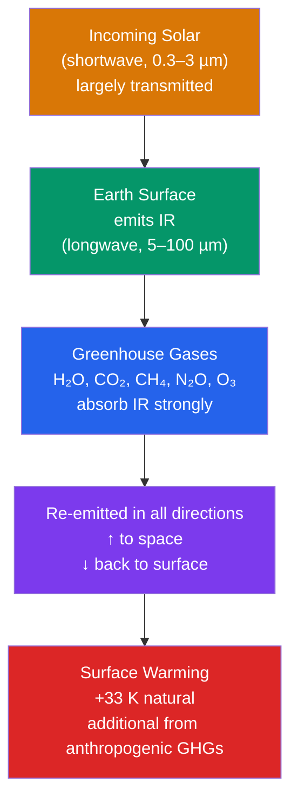

# 🌡️ Greenhouse Effect and Radiative Forcing

> [!abstract] TL;DR
> The greenhouse effect arises because greenhouse gases (H₂O, CO₂, CH₄, N₂O, O₃) absorb and re-emit longwave infrared radiation, warming the surface far beyond the effective blackbody temperature Earth would have with a transparent atmosphere. The **natural** greenhouse effect provides roughly **+33 K** of warming (raising the mean surface from ~255 K to ~288 K) and is essential for liquid water and life. **Radiative forcing** (measured in W/m²) quantifies how a perturbation — for example a doubling of CO₂ (~3.7 W/m²) — shifts the top-of-atmosphere (TOA) energy budget *before* the climate feedbacks adjust. The **enhanced** greenhouse effect from anthropogenic emissions is the primary driver of observed 20th–21st century warming, and **climate sensitivity** is what converts a given forcing into the eventual equilibrium temperature change.

## Intuition — analogy FIRST

Picture a garden greenhouse on a sunny day. Visible sunlight (shortwave) streams in through the glass and warms the soil and plants. That warm interior radiates heat as infrared, but the glass is **opaque** to infrared — it lets the light *in* but slows the heat *out*. The inside heats up until the small amount of heat that does leak out balances the sunlight coming in.

Earth's atmosphere does the same thing, but with gases instead of glass: it is nearly transparent to incoming visible sunlight yet strongly absorbing at the infrared wavelengths the surface emits. Adding more CO₂ is like **thickening the glass** — heat escapes less efficiently, so the surface must warm until it radiates enough extra infrared to restore balance. This works because a hotter object radiates more strongly (the Stefan–Boltzmann law, $j = \sigma T^4$): the only way for a "leakier-to-block" planet to re-balance its energy budget is to run hotter.

*(One caveat carried into the Pitfalls: a real greenhouse actually works mostly by stopping convection, not by radiative trapping — the analogy captures the radiative physics, not the mechanism inside real glasshouses.)*

---

## How It Works



**Why gases absorb infrared.** A molecule absorbs a photon only if the photon's energy matches an allowed transition. For greenhouse gases the relevant transitions are **molecular vibrations and rotations**, which fall in the thermal-IR band (roughly 5–50 µm). Crucially, a molecule can absorb IR only if a vibration changes its **electric dipole moment**. Symmetric diatomics like N₂ and O₂ have no dipole and no IR-active vibration — which is why the bulk of the atmosphere is radiatively inert. CO₂, H₂O, CH₄, N₂O and O₃ do have IR-active bending/stretching modes, so they are the GHGs.

**H₂O is strongest but temperature-controlled.** Water vapor accounts for the largest share of the natural greenhouse effect, but its atmospheric concentration is set by temperature via the Clausius–Clapeyron relation. It condenses and rains out, so it cannot independently drive long-term change — it responds. **CO₂ is the key "knob"** precisely because it is **non-condensing** at terrestrial temperatures: it stays in the gas phase, accumulates, and sets the baseline temperature that then determines how much water vapor the air can hold.

**Radiative forcing, defined.** Radiative forcing $\Delta F$ is the change in **net downward irradiance at the tropopause** caused by a perturbation, evaluated *before* surface and tropospheric temperatures respond (with, in the standard definition, stratospheric temperatures allowed to re-equilibrate). A positive $\Delta F$ means the planet is gaining energy and must warm to restore balance.

**Logarithmic CO₂ forcing.** Because the strong 15 µm CO₂ band is already nearly saturated at its center, each additional increment of CO₂ absorbs mainly in the band **wings**, giving a logarithmic dependence:
$$\Delta F \approx 5.35 \, \ln\!\left(\frac{C}{C_0}\right) \ \text{W/m}^2$$
A doubling ($C/C_0 = 2$) gives $5.35 \ln 2 \approx 3.7$ W/m² — the canonical "forcing per CO₂ doubling."

**Global Warming Potentials (GWP).** Different gases differ in per-molecule radiative efficiency and atmospheric lifetime. GWP integrates a pulse emission's forcing over a time horizon (usually 100 years) relative to CO₂:

| Gas | GWP-100 | Notes |
|-----|---------|-------|
| CO₂ | 1 (reference) | long-lived, non-condensing |
| CH₄ | ≈ 28 | short lifetime (~12 yr), potent |
| N₂O | ≈ 265 | agriculture, ~120 yr lifetime |
| SF₆ | ≈ 23,500 | extremely long-lived, industrial |

---

## Key Concepts / Details

### Secondary Level

- **What greenhouse gases are.** Trace gases that are transparent to sunlight but absorb the infrared heat radiated by Earth's surface: water vapor (H₂O), carbon dioxide (CO₂), methane (CH₄), nitrous oxide (N₂O) and ozone (O₃). Together they make up a tiny fraction of the atmosphere yet dominate its radiative behavior.
- **Why CO₂ and H₂O absorb IR.** Their bonds can bend and stretch (molecular vibrations) at frequencies that match infrared light, so they soak up outgoing heat. N₂ and O₂ cannot, so they do not warm the planet despite being 99% of the air.
- **Natural vs enhanced greenhouse effect.** The *natural* effect keeps Earth ~33 K warmer than it would otherwise be — without it the surface would average about −18 °C and be largely frozen. The *enhanced* effect is the extra warming from human-added GHGs (mainly fossil-fuel CO₂).
- **How adding CO₂ warms Earth.** More CO₂ means outgoing infrared escapes to space less efficiently, so Earth must warm until it radiates enough to rebalance incoming sunlight.
- **Why Venus is so hot.** Venus has a thick, ~90-atmosphere CO₂ atmosphere and underwent a **runaway greenhouse**: its surface sits near 465 °C, hotter than Mercury despite being farther from the Sun.
- **Ozone is a different mechanism.** The stratospheric ozone layer protects life by absorbing **ultraviolet** light, not by trapping infrared. Ozone depletion and greenhouse warming are separate problems (see Pitfalls).

### Undergraduate Level

- **Beer–Lambert law and optical depth.** Radiation of intensity $I_0$ passing through an absorbing layer is attenuated as $I = I_0 e^{-\tau}$, where the **optical depth** $\tau = \int n\,\sigma\,ds$ integrates number density $n$ and absorption cross-section $\sigma$ along the path. The atmosphere is optically thin in the visible and optically thick in the thermal IR at GHG band centers.
- **Single-layer model.** Treat the atmosphere as one isothermal slab, transparent to shortwave and with emissivity $\varepsilon$ in the longwave. Energy balance gives the surface temperature rising above the bare-planet value; in the fully absorbing idealization the surface is $2^{1/4} \approx 1.19\times$ the emission temperature, i.e. $255\,\text{K} \to \sim 303$ K, bracketing the real 288 K.
- **Emission vs surface temperature.** The **emission (effective) temperature** $T_e \approx 255$ K is what a distant observer measures as Earth's outgoing IR; it corresponds to an average emission altitude high in the troposphere. The **surface temperature** $T_s \approx 288$ K is warmer because IR emitted from the ground is intercepted and re-emitted downward.
- **Key absorption bands.** CO₂ **15 µm** bending band; H₂O **6.3 µm** vibration plus a broad pure-**rotation** band beyond ~20 µm; CH₄ **7.7 µm**; O₃ **9.6 µm**. The **atmospheric window (8–13 µm)** is a relatively transparent gap through which the surface radiates directly to space — which is exactly where O₃ (9.6 µm) and, increasingly, minor GHGs plug leaks.
- **CO₂ forcing formula.** $\Delta F = 5.35\,\ln(C/C_0)$ W/m² (Myhre et al. 1998). Pre-industrial $C_0 = 280$ ppm.
- **Keeling Curve.** Continuous CO₂ measurements at Mauna Loa show a rise from ~315 ppm (1958) — and ~280 ppm pre-industrial — to **>420 ppm** today, with the famous annual saw-tooth from Northern Hemisphere vegetation. Present CO₂ forcing is $5.35\ln(420/280) \approx 2.1$ W/m² relative to pre-industrial.
- **Methane cycle.** CH₄ comes from **wetlands** (natural), **livestock/rice/landfills** and **fossil-fuel leaks** (anthropogenic). Short lifetime (~12 yr) but high per-molecule potency.
- **Nitrous oxide.** N₂O is dominated by **agriculture** (fertilizer, manure); long-lived (~120 yr) and also an ozone-depleting substance.
- **CFC forcing and ozone coupling.** Chlorofluorocarbons are strong GHGs whose bands sit in the atmospheric window, *and* they destroy stratospheric ozone — a coupling that links the Montreal Protocol to climate.

### Graduate Level

- **Line-by-line radiative transfer.** The rigorous approach solves the Schwarzschild equation wavelength-by-wavelength using spectroscopic line parameters (positions, strengths, pressure/temperature-broadened widths) from the **HITRAN** database. This is accurate but computationally heavy.
- **Band models and k-distribution.** For GCMs the spectrum is compressed with band models or the **correlated-k (k-distribution) method**, which reorders absorption coefficients within a band into a smooth cumulative distribution, capturing overlapping lines at a fraction of the cost.
- **Three definitions of forcing.**
  1. **Instantaneous RF (IRF):** the flux change at the tropopause the instant the perturbation is applied, all temperatures fixed.
  2. **Stratospheric-adjusted RF (SARF):** allow stratospheric temperatures to relax to equilibrium (days–months), surface/troposphere fixed. This corrects IRF because CO₂ increase *cools* the stratosphere, altering downward IR.
  3. **Effective radiative forcing (ERF):** the TOA flux change after **all rapid adjustments** (clouds, lapse rate, tropospheric humidity, and the direct physiological/plant response to CO₂) have acted, but with **sea-surface temperatures held fixed**. ERF best predicts eventual warming and is the IPCC AR6 standard.
- **Rapid adjustments.** Stratospheric cooling and tropospheric adjustments (cloud changes, land warming, CO₂ physiological effects on stomata) happen on timescales too fast to count as feedbacks; they are folded into ERF rather than into climate sensitivity.
- **Water-vapor feedback.** Warming increases saturation vapor pressure by ~7%/K (**Clausius–Clapeyron**), and since relative humidity is roughly conserved, absolute humidity rises — amplifying the initial forcing. This is the single largest positive feedback.
- **Cloud radiative effect.** Clouds both cool (shortwave albedo) and warm (longwave trapping); the **net** cloud feedback is the largest source of uncertainty in climate sensitivity, with high thin cirrus warming and low marine stratus cooling.
- **Aerosols.** **Direct** effects (scattering/absorption of sunlight) and **indirect** effects (aerosols as cloud condensation nuclei, brightening clouds) produce a net **cooling** that partially masks GHG warming and carries large uncertainty.
- **ERF for CO₂ doubling.** IPCC AR6 assesses **3.93 ± 0.47 W/m²** for 2×CO₂ (ERF), slightly larger than the classic 3.7 W/m² SARF value.
- **Attribution.** Total anthropogenic ERF (1750→2019) is dominated by CO₂, then CH₄, halocarbons, N₂O, tropospheric O₃ and black carbon on the warming side, offset by aerosol–radiation and aerosol–cloud cooling and by land-use albedo changes.

---

## Python Demo — Logarithmic CO₂ Radiative Forcing

```python
# Compute and plot the logarithmic CO2 radiative forcing
#   Delta_F = 5.35 * ln(C / C0)  [W/m^2]   (Myhre et al. 1998)
# as CO2 rises from pre-industrial (280 ppm) toward 4x (1120 ppm).

import numpy as np
import matplotlib.pyplot as plt

C0 = 280.0                     # pre-industrial CO2 (ppm)
k  = 5.35                      # radiative-forcing coefficient (W/m^2)

C  = np.linspace(280.0, 1120.0, 500)   # 1x -> 4x CO2
dF = k * np.log(C / C0)                 # radiative forcing (W/m^2)

# Reference points
C_double, C_now = 560.0, 420.0
dF_double = k * np.log(C_double / C0)   # ~3.71 W/m^2
dF_now    = k * np.log(C_now / C0)      # ~2.17 W/m^2

print(f"Doubling  (560 ppm): dF = {dF_double:5.2f} W/m^2")
print(f"Present   (420 ppm): dF = {dF_now:5.2f} W/m^2")
print(f"4x CO2   (1120 ppm): dF = {k*np.log(1120/C0):5.2f} W/m^2")

fig, ax = plt.subplots(figsize=(8, 5))
ax.plot(C, dF, color="#dc2626", lw=2, label=r"$\Delta F = 5.35\,\ln(C/C_0)$")

# Annotate the doubling point (canonical 3.7 W/m^2)
ax.scatter([C_double], [dF_double], color="#2563eb", zorder=5)
ax.annotate(f"2x CO2 (560 ppm)\n{dF_double:.1f} W/m$^2$",
            (C_double, dF_double), textcoords="offset points",
            xytext=(10, -30), color="#2563eb",
            arrowprops=dict(arrowstyle="->", color="#2563eb"))

# Annotate present-day (2024, ~420 ppm)
ax.scatter([C_now], [dF_now], color="#059669", zorder=5)
ax.annotate(f"2024 (420 ppm)\n{dF_now:.1f} W/m$^2$",
            (C_now, dF_now), textcoords="offset points",
            xytext=(10, 15), color="#059669",
            arrowprops=dict(arrowstyle="->", color="#059669"))

ax.axvline(C0, ls=":", color="gray")
ax.text(C0 + 4, 0.2, "pre-industrial\n280 ppm", color="gray", fontsize=9)

ax.set_xlabel("CO$_2$ concentration (ppm)")
ax.set_ylabel(r"Radiative forcing $\Delta F$ (W/m$^2$)")
ax.set_title("Logarithmic CO$_2$ Radiative Forcing (Myhre et al. 1998)")
ax.legend(loc="upper left")
ax.grid(alpha=0.3)
plt.tight_layout()
plt.show()
```

The curve is concave: the jump from 280→420 ppm buys ~2.2 W/m², but reaching a full doubling (560 ppm) adds only ~1.5 W/m² more — a direct visualization of the **diminishing marginal effect** of each CO₂ increment.

---

## Real-World Notes

- **Mauna Loa / Keeling Curve.** The Scripps/NOAA observatory on Mauna Loa, Hawaii has measured atmospheric CO₂ continuously since **1958**. Concentrations now exceed **420 ppm** — higher than at any point in at least the last **3 million years**, based on ice-core and marine proxy records.
- **Total anthropogenic forcing.** IPCC AR6 (WGI, 2021) assesses the ERF of all human activities at **+2.72 W/m²** for 2019 relative to 1750, with CO₂ the single largest contributor.
- **Aerosol masking.** Sulfate and other aerosols exert a net **cooling** that offsets a substantial fraction of GHG warming; as air-quality policy removes aerosols, some of this "masked" warming is expected to emerge.
- **Methane's short lifetime.** Because CH₄ decays in ~12 years, **cutting methane emissions produces near-term climate benefit** — one of the fastest available levers to slow warming this decade.
- **Stratospheric cooling as a fingerprint.** Greenhouse warming **cools the stratosphere** while warming the troposphere, whereas an increase in solar output would warm both. The observed stratospheric cooling is a key attribution fingerprint distinguishing GHG-driven from solar-driven change.
- **Venus, the cautionary case.** With a ~90 atm, ~96% CO₂ atmosphere, Venus's surface sits near **465 °C** — a real-world runaway greenhouse and the clearest demonstration of the effect's power.

---

## Common Pitfalls

1. **"Greenhouse" is a misnomer.** A real garden greenhouse warms mainly by **suppressing convection** (trapping warm air under the glass), not by radiative IR trapping. The atmospheric effect is genuinely radiative; the name stuck for historical reasons, so don't over-read the analogy.
2. **H₂O is the strongest GHG but is a feedback, not a forcing.** Water vapor's concentration is set by temperature (Clausius–Clapeyron) and it rains out within days. It **amplifies** warming triggered by other agents but cannot independently initiate long-term change.
3. **CO₂ does not "trap" heat permanently.** Absorbed IR photons are promptly re-emitted; what changes is the **efficiency of IR escape** and the **altitude of emission to space**. Framing it as permanent trapping obscures the actual radiative-transfer mechanism.
4. **CO₂ forcing is logarithmic, not linear.** Because the band center is saturated, each additional ppm adds less forcing than the last. "The next doubling matters as much as the last doubling," not "each ppm adds a fixed amount."
5. **Ozone depletion ≠ greenhouse warming.** Stratospheric ozone loss is a **UV**-absorption problem (the "ozone hole"), while the greenhouse effect is an **IR**-absorption problem. They share some chemicals (CFCs, N₂O) but are physically distinct issues — conflating them is a classic error.

---

## Related Concepts

- [[_MOC_Atmospheric_Structure]] — section map of the atmospheric-structure unit
- [[Solar_Radiation_and_the_Energy_Budget]] — the incoming shortwave side of the balance the greenhouse effect regulates
- [[Atmospheric_Layers_and_Composition]] — where GHGs reside and why the stratosphere cools under CO₂ increase
- [[Atmospheric_Chemistry_and_Stratospheric_Ozone]] — the separate UV/ozone mechanism and CFC coupling
- [[Climate_Sensitivity_and_Feedbacks]] — converts radiative forcing into equilibrium temperature change
- [[Anthropogenic_Climate_Change]] — the enhanced greenhouse effect as the driver of modern warming
- [[_MOC_Physics_Master]] — cross-vault physics entry point
- [[Electromagnetic_Waves_and_Radiation]] — shortwave vs longwave radiation and blackbody emission
- [[Laws_of_Thermodynamics]] — energy balance and the Stefan–Boltzmann underpinning of warming
- [[Atomic_Models_and_Spectroscopy]] — molecular vibration/rotation bands that make gases IR-active
- [[_MOC_Chemistry_Master]] — cross-vault chemistry entry point
- [[Chemical_Kinetics]] — atmospheric reaction rates and gas lifetimes (CH₄, N₂O, CFCs)

---

## Review Questions

**Secondary**
- Why is water vapor a **feedback** rather than a **forcing** in climate change?
- What would happen to Earth's temperature if CO₂ were suddenly removed from the atmosphere?

**Undergraduate**
- Using $\Delta F = 5.35\,\ln(C/C_0)$ W/m², calculate the radiative forcing from pre-industrial (280 ppm) to present-day (420 ppm) CO₂. *(Answer: $5.35\ln(420/280) = 5.35\ln 1.5 \approx 2.17$ W/m².)*
- How many more **doublings** are needed to reach 4×CO₂ starting from the pre-industrial level? *(From 280 ppm: 280→560 is one doubling, 560→1120 is the second, so **two** doublings reach 4×CO₂; 420 ppm is already ~0.58 of the way through the first doubling.)*

**Graduate**
- Distinguish **instantaneous** radiative forcing, **stratospheric-adjusted** radiative forcing, and **effective** radiative forcing (ERF). Why does IPCC AR6 prefer ERF, and how do rapid tropospheric adjustments to CO₂ (e.g., direct CO₂ physiological effects on plants) make ERF differ from the stratospheric-adjusted value?

---

## Sources

- Pierrehumbert, R. T. (2010). *Principles of Planetary Climate*. Cambridge University Press.
- IPCC AR6 WGI (2021), *Chapter 7: The Earth's Energy Budget, Climate Feedbacks, and Climate Sensitivity*.
- Myhre, G., Highwood, E. J., Shine, K. P., & Stordal, F. (1998). "New estimates of radiative forcing due to well-mixed greenhouse gases." *Geophysical Research Letters*, 25(14), 2715–2718.

---

#Meteorology #Climatology #GreenhouseEffect #RadiativeForcing #ClimateChange
