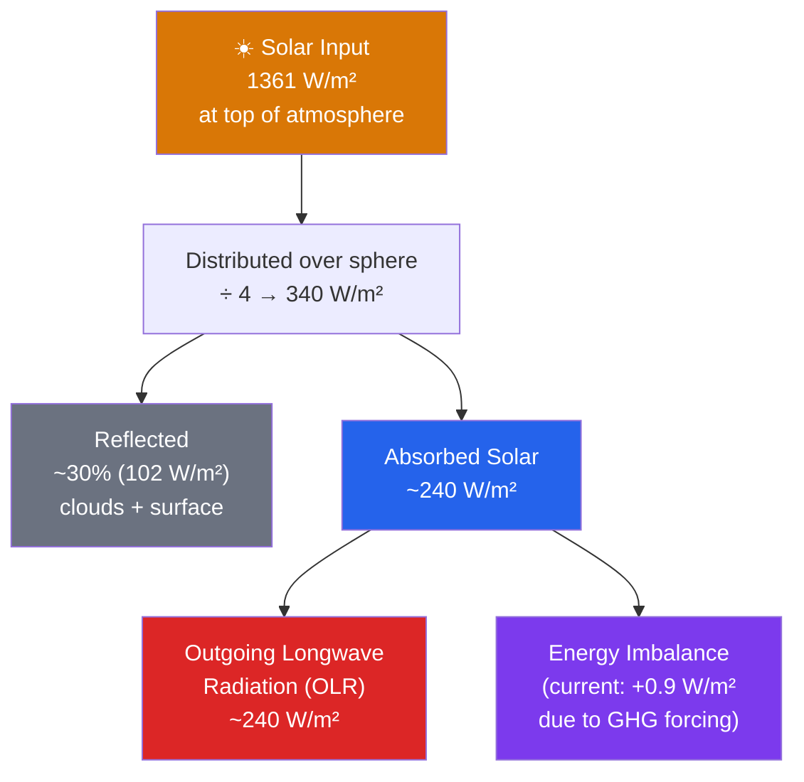

# ☀️ Solar Radiation and the Energy Budget

> [!abstract] TL;DR
> The Sun delivers $\sim1361\ \text{W/m}^2$ to a surface facing it at Earth's orbital distance — the **solar constant**. Spread over the whole rotating sphere the average input drops by a factor of four to $\sim340\ \text{W/m}^2$, and after $\sim30\%$ is reflected away by clouds, aerosols, and bright surfaces (the planetary **albedo**), only about $240\ \text{W/m}^2$ is actually absorbed. In equilibrium this absorbed sunlight must be balanced by an equal stream of **outgoing longwave (infrared) radiation** to space. The gap between the warm surface and the cold level from which Earth actually radiates is the **greenhouse effect**, worth about $33\ \text{K}$ of extra warmth; adding greenhouse gases widens that gap and forces a new, warmer equilibrium. On glacial–interglacial timescales the same balance is nudged by **Milankovitch orbital cycles**.

## Intuition — analogy FIRST

Picture a room in winter with an electric heater and a window. The **heater is the Sun**, steadily pumping energy in. The **window is the atmosphere-plus-surface**, radiating heat back out to the cold night. The room does not heat forever: it settles at whatever temperature makes the heat leaking out the window exactly equal the heat coming from the heater. That settling point is **equilibrium**.

Now change three things and watch the thermostat move:

- Turn up the **heater power** (a brighter Sun, or Earth moving closer) → the room warms.
- Lay a **white rug on the floor** so sunlight bounces straight back out before it can be absorbed (raise the **albedo**) → the room cools.
- Hang **thick curtains** over the window that let sunlight in but slow heat from escaping (add **greenhouse gases**) → the room warms until the leak, though partly blocked, once again matches the heater.

Earth's climate is exactly this room. Its temperature is set by the heater (solar input), the rug (albedo), and the curtains (the infrared-absorbing atmosphere). Everything technical below is just making those three knobs quantitative.

---

## How It Works

Energy enters as concentrated visible sunlight and leaves as diffuse infrared. Follow the accounting from the top of the atmosphere down and back out:



**Solar constant.** A flat panel held perpendicular to the Sun's rays at $1\ \text{AU}$ receives $S_0 \approx 1361\ \text{W/m}^2$ (the modern satellite value; older textbooks quote $\sim1366$).

**Geometric dilution — the factor of 4.** Earth intercepts sunlight over its shadow, a disk of area $\pi R^2$, but it radiates from and averages sunlight over its entire surface, a sphere of area $4\pi R^2$. The ratio is $\pi R^2 / 4\pi R^2 = 1/4$, so the globally averaged incoming flux is
$$\bar{S} = \frac{S_0}{4} \approx 340\ \text{W/m}^2.$$

**Planetary albedo.** A fraction $A \approx 0.30$ of that is reflected straight back to space before it can warm anything — roughly $0.23$ from clouds and atmosphere and $0.07$ from the surface. The absorbed flux is therefore
$$\bar{S}(1-A) \approx 340 \times 0.70 \approx 240\ \text{W/m}^2.$$

**Stefan–Boltzmann emission.** Every warm body radiates. A blackbody at temperature $T$ emits $\sigma T^4$ per unit area, with $\sigma = 5.67\times10^{-8}\ \text{W m}^{-2}\text{K}^{-4}$. In equilibrium the planet's emission must equal its absorption.

**Effective vs surface temperature.** Setting absorbed solar equal to emitted infrared gives the **effective emission temperature**:
$$\sigma T_{\text{eff}}^4 = \frac{S_0 (1-A)}{4} \quad\Rightarrow\quad T_{\text{eff}} \approx 255\ \text{K} \; (-18^\circ\text{C}).$$
But the observed global-mean **surface** temperature is $\sim288\ \text{K}$ ($+15^\circ\text{C}$). The $33\ \text{K}$ difference is the **greenhouse effect**: the atmosphere is transparent to incoming sunlight but opaque to outgoing infrared, so Earth radiates to space from a cold, high altitude ($\sim255\ \text{K}$) while the surface underneath stays much warmer.

---

## Key Concepts / Details

### Secondary Level

- **Solar constant $\approx 1361\ \text{W/m}^2$** — the power of sunlight on a surface facing the Sun at Earth's distance, about the output of a small electric heater per square metre.
- **The factor of 4** — the Sun only lights one hemisphere at a time, and at a slant near the poles and the day/night terminator. Averaged over the whole spinning globe, incoming sunlight is a quarter of the solar constant, $\sim340\ \text{W/m}^2$.
- **Albedo** measures reflectivity on a scale from $0$ (a perfectly black, fully absorbing surface) to $1$ (a perfect white mirror). Earth's average is about $0.30$: roughly a third of sunlight bounces back to space, mostly off clouds and ice.
- **Greenhouse effect** — gases like water vapour and $\text{CO}_2$ let sunlight through but trap the infrared heat the ground gives off, keeping the surface warmer than it would otherwise be.
- **Earth's average surface temperature is $\sim15^\circ\text{C}$.** Without any greenhouse effect it would be about $-18^\circ\text{C}$ — a frozen planet.
- **Seasons come from the axial tilt ($23.5^\circ$), not from distance.** In fact the Earth is *closest* to the Sun in early January, during Northern-Hemisphere winter. What changes with season is the *angle* and *day length* of sunlight, not how far away the Sun is.

### Undergraduate Level

**Stefan–Boltzmann law.** The radiant flux from a blackbody is
$$S = \sigma T^4,$$
so emitted power scales with the *fourth* power of temperature — a small warming raises emission strongly, which is what stabilises the climate.

**Zero-dimensional effective temperature.** Balancing absorbed solar against emitted infrared for the whole planet:
$$\underbrace{\frac{S_0(1-A)}{4}}_{\text{absorbed}} = \underbrace{\sigma T_{\text{eff}}^4}_{\text{emitted}} \quad\Rightarrow\quad T_{\text{eff}} = \left[\frac{S_0(1-A)}{4\sigma}\right]^{1/4} \approx 255\ \text{K}.$$

**Wien's displacement law.** The wavelength of peak emission is $\lambda_{\max} = b/T$ with $b = 2.898\times10^{-3}\ \text{m·K}$. The Sun ($\sim5778\ \text{K}$) peaks near $\lambda \approx 0.50\ \mu\text{m}$ — visible light. Earth ($\sim288\ \text{K}$) peaks near $\lambda \approx 10\ \mu\text{m}$ — thermal infrared. The two spectra barely overlap, which is exactly why the atmosphere can treat "shortwave" and "longwave" radiation as separate problems.

**Atmospheric window.** Between roughly $8$ and $13\ \mu\text{m}$ the clear-sky atmosphere is relatively transparent, letting surface infrared escape directly to space. $\text{CO}_2$ and water vapour absorb strongly on either side; closing this window (e.g., by adding absorbers) is a major lever on climate.

**Albedo by surface type:**

| Surface | Albedo $A$ |
|---|---|
| Fresh snow | $0.80\text{–}0.90$ |
| Sea ice | $0.50\text{–}0.70$ |
| Thick / low cloud | $0.30\text{–}0.70$ |
| Desert sand | $0.30\text{–}0.40$ |
| Grass / crops | $0.15\text{–}0.25$ |
| Forest | $0.10\text{–}0.15$ |
| Open ocean | $0.06$ |

**Milankovitch cycles** modulate insolation over tens of thousands of years:

| Cycle | Period | What changes |
|---|---|---|
| Eccentricity | $\sim100\ \text{kyr}$ | Shape of orbit → annual total insolation |
| Obliquity | $\sim41\ \text{kyr}$ | Axial tilt $22.1^\circ\text{–}24.5^\circ$ → seasonal contrast, high-latitude sun |
| Precession | $\sim23\ \text{kyr}$ | Season at which Earth is nearest the Sun |

These pace the ice ages by redistributing sunlight in latitude and season even when the global annual mean barely changes.

**Energy balance model (EBM).** Give the planet a heat capacity $C$ and let it relax toward equilibrium:
$$C\frac{dT}{dt} = \frac{S_0(1-A)}{4} - \sigma T^4.$$
The steady state ($dT/dt = 0$) recovers $T_{\text{eff}}$; the transient shows how thermal inertia (mostly the ocean) delays and smooths the response to any change in $S_0$ or $A$.

### Graduate Level

**Radiative transfer equation.** Along a ray, the monochromatic intensity $I_\nu$ evolves with optical depth $\tau_\nu$ as
$$\frac{dI_\nu}{d\tau_\nu} = -I_\nu + S_\nu,$$
where $S_\nu$ is the **source function**. In local thermodynamic equilibrium $S_\nu = B_\nu(T)$, the Planck function, giving **Schwarzschild's equation** for an emitting–absorbing atmosphere. This is the microphysical foundation beneath the tidy $\sigma T^4$ bookkeeping.

**Two-stream approximation.** Splitting the diffuse field into upward and downward hemispheric fluxes $F^\uparrow, F^\downarrow$ reduces the full angular integral to a pair of coupled ODEs — the workhorse of both shortwave (scattering-dominated) and longwave (absorption/emission-dominated) parameterizations in climate models.

**Radiative forcing $\Delta F$** (W/m²) is the instantaneous change in net top-of-atmosphere flux when a forcing agent (e.g., doubled $\text{CO}_2$, $\sim3.7\ \text{W/m}^2$) is imposed, before the surface responds. **Equilibrium climate sensitivity** relates the eventual warming to the forcing via the net feedback parameter:
$$\Delta T_{\text{eq}} = -\frac{\Delta F}{\lambda}, \qquad \lambda = \sum_i \lambda_i.$$

**Forcings vs feedbacks.** A *forcing* is externally imposed; a *feedback* is a response of the climate system that amplifies or damps warming:

| Feedback | Sign | Mechanism |
|---|---|---|
| Planck | $-$ (stabilising) | Warmer planet emits more IR ($\sigma T^4$); $\lambda_P \approx -3.2\ \text{W/m}^2/\text{K}$ |
| Lapse-rate | $-$ | Upper troposphere warms faster (moist adiabat) → more efficient IR loss |
| Water-vapour | $+$ | Warmer air holds more vapour (Clausius–Clapeyron), a strong greenhouse gas |
| Surface-albedo | $+$ | Melting snow/ice darkens the surface, absorbing more sun |
| Cloud | $\pm$ | Largest uncertainty; depends on cloud type, height, optical depth |

**TOA imbalance and CERES.** The current planetary energy imbalance ($\sim +0.9\ \text{W/m}^2$) is measured from space by **CERES** (Clouds and the Earth's Radiant Energy System) and independently confirmed by ocean-heat-content gain (Argo floats), since $>90\%$ of the excess heat goes into the ocean.

**Spectral OLR.** Decomposing outgoing longwave by wavenumber reveals the greenhouse fingerprint: the deep $\text{CO}_2$ bite at $15\ \mu\text{m}$, the ozone notch at $9.6\ \mu\text{m}$, and water-vapour absorption flanking the $8\text{–}13\ \mu\text{m}$ window. Emission in each band originates from the altitude where the atmosphere becomes optically thin.

**Solar variability.** Total solar irradiance varies only $\sim0.1\%$ ($\sim1\ \text{W/m}^2$ in $S_0$, i.e. $\sim0.18\ \text{W/m}^2$ in global-mean forcing) over the 11-year cycle, and somewhat more over grand minima like the **Maunder Minimum** ($\sim1645\text{–}1715$). This is small compared to anthropogenic greenhouse forcing but non-negligible for reconstructing pre-industrial climate. Note also the **TOA vs surface budget distinction**: the surface energy budget includes non-radiative fluxes (sensible and latent heat) that vanish at the top of atmosphere, where only radiation crosses.

---

## Python Demo

Two calculations in one script: (1) Earth's effective temperature as a function of albedo, and (2) the blackbody spectra of the Sun and Earth on a shared wavelength axis, normalized to show their spectral separation.

```python
# Solar radiation and the planetary energy budget.
# (1) Effective temperature vs albedo from the zero-D energy balance.
# (2) Planck blackbody spectra for the Sun (5778 K) and Earth (288 K).
import numpy as np
import matplotlib.pyplot as plt

# --- Physical constants (SI) ---
sigma = 5.670374419e-8   # Stefan-Boltzmann constant, W m^-2 K^-4
h     = 6.62607015e-34   # Planck constant, J s
c     = 2.99792458e8     # speed of light, m/s
kB    = 1.380649e-23     # Boltzmann constant, J/K
S0    = 1361.0           # solar constant, W/m^2

# (1) Effective temperature T_eff = [ S0 (1-A) / (4 sigma) ]^(1/4)
def effective_temperature(A, S=S0):
    return (S * (1.0 - A) / (4.0 * sigma)) ** 0.25

albedo = np.linspace(0.10, 0.50, 9)
Teff   = effective_temperature(albedo)

print("Albedo   T_eff (K)   T_eff (C)")
for A, T in zip(albedo, Teff):
    print(f"{A:5.2f}   {T:8.1f}   {T-273.15:8.1f}")
print(f"\nAt A=0.30: T_eff = {effective_temperature(0.30):.1f} K "
      f"({effective_temperature(0.30)-273.15:.1f} C)")

# (2) Planck spectral radiance B_lambda(T), W m^-3 sr^-1
def planck_lambda(lam, T):
    return (2.0 * h * c**2 / lam**5) / (np.exp(h * c / (lam * kB * T)) - 1.0)

lam = np.linspace(1e-7, 5e-5, 4000)   # 0.1 to 50 micron
sun   = planck_lambda(lam, 5778.0)
earth = planck_lambda(lam, 288.0)

# Normalize each to its own peak so both are visible on one axis
sun_n   = sun / sun.max()
earth_n = earth / earth.max()

lam_um = lam * 1e6  # to micrometres

fig, (ax1, ax2) = plt.subplots(1, 2, figsize=(12, 4.5))

ax1.plot(albedo, Teff, "o-", color="#2563eb")
ax1.axhline(255, ls="--", color="gray", lw=1)
ax1.set_xlabel("Planetary albedo A")
ax1.set_ylabel("Effective temperature (K)")
ax1.set_title("T_eff vs albedo (S0 = 1361 W/m^2)")
ax1.grid(alpha=0.3)

ax2.plot(lam_um, sun_n,   color="#d97706", label="Sun (5778 K)")
ax2.plot(lam_um, earth_n, color="#dc2626", label="Earth (288 K)")
ax2.axvspan(8, 13, color="#93c5fd", alpha=0.3, label="Atmospheric window")
ax2.set_xscale("log")
ax2.set_xlabel("Wavelength (micron, log scale)")
ax2.set_ylabel("Normalized spectral radiance")
ax2.set_title("Shortwave sun vs longwave Earth")
ax2.legend()
ax2.grid(alpha=0.3, which="both")

plt.tight_layout()
plt.savefig("energy_budget.png", dpi=120)
plt.show()
```

Expected: `T_eff` falls from $\sim271\ \text{K}$ at $A=0.10$ to $\sim249\ \text{K}$ at $A=0.50$ (passing $255\ \text{K}$ near the observed $A=0.30$), and the two Planck curves sit almost side by side — the Sun near $0.5\ \mu\text{m}$, Earth near $10\ \mu\text{m}$ — with only a sliver of overlap.

---

## Real-World Notes

- **CERES energy imbalance.** NASA's CERES instruments (on Terra, Aqua, and Suomi-NPP) measure reflected shortwave and emitted longwave at the top of atmosphere; the derived planetary imbalance is $\sim +0.87\ \text{W/m}^2$ averaged over the recent decade, and it has been *rising* — direct evidence of accumulating heat.
- **Tracking the solar constant.** Since the late 1970s a chain of satellite radiometers (Nimbus-7, ACRIM, SORCE/TIM, TSIS-1) has monitored total solar irradiance, resolving the $\sim0.1\%$ 11-year cycle and refining the modern value to $\sim1361\ \text{W/m}^2$, down from earlier $\sim1366$ estimates.
- **Venus vs Mercury.** Venus reflects $77\%$ of sunlight (albedo $0.77$) yet its surface sits at $\sim737\ \text{K}$ — hotter than Mercury, which is closer to the Sun but nearly airless. A massive $\text{CO}_2$ greenhouse, not proximity, sets Venus's temperature.
- **Mars.** With a thin $\text{CO}_2$ atmosphere ($\sim0.6\%$ of Earth's surface pressure), Mars gets only $\sim5\ \text{K}$ of greenhouse warming, so its surface stays close to its effective temperature.
- **Southern Ocean and the Arctic.** The Southern Ocean, uninterrupted by land, absorbs a disproportionate share of the planet's excess heat and $\text{CO}_2$. Meanwhile, Arctic sea-ice loss replaces bright ice ($A\sim0.6$) with dark ocean ($A\sim0.06$), lowering local albedo and amplifying warming — the classic **ice-albedo feedback**.

---

## Common Pitfalls

1. **"Seasons are caused by Earth's changing distance from the Sun."** No — Earth is actually *closest* to the Sun (perihelion) in early January. Seasons come from the $23.5^\circ$ **axial tilt**, which changes the angle and duration of sunlight, not the distance.
2. **"Clouds always cool the planet."** It depends. Low, thick clouds reflect sunlight and cool; high, thin cirrus (ice) clouds are cold and trap outgoing infrared more than they reflect sun, giving a net **warming**. The sign is set by cloud height, thickness, and phase.
3. **"$255\ \text{K}$ is Earth's surface temperature."** It is the *effective emission temperature* — the temperature of the altitude in the atmosphere from which Earth radiates to space, not the ground. The surface is $\sim33\ \text{K}$ warmer.
4. **"The solar constant is truly constant."** It varies $\sim0.1\%$ over the 11-year sunspot cycle and a bit more over centuries. Real, measurable, but far smaller than the $\text{CO}_2$ forcing driving current warming.
5. **"Absorbed solar is a steady $240\ \text{W/m}^2$ everywhere."** That is a *global annual average*. Any given spot swings enormously with day/night, season, and latitude; the tidy number only emerges after averaging over the whole sphere and a full year.

---

## Related Concepts

- [[_MOC_Atmospheric_Structure]] — section map of the atmosphere and its energy exchanges (entry point).
- [[Atmospheric_Layers_and_Composition]] — where absorption and emission happen: troposphere, stratosphere, and the gases that intercept radiation.
- [[Greenhouse_Effect_and_Radiative_Forcing]] — the mechanism behind the $255\to288\ \text{K}$ gap and how forcing quantifies added $\text{CO}_2$.
- [[Atmospheric_Chemistry_and_Stratospheric_Ozone]] — ozone's role in absorbing UV and shaping the stratosphere's thermal structure.
- [[Global_Atmospheric_Circulation]] — how the pole-to-equator imbalance in absorbed sunlight drives winds and heat transport.
- [[Anthropogenic_Climate_Change]] — what happens to this balance when humans thicken the "curtains."
- [[_MOC_Physics_Master]] — physics vault entry point for the underlying radiation and thermodynamics.
- [[Electromagnetic_Waves_and_Radiation]] — the nature of the shortwave and longwave photons being exchanged.
- [[Laws_of_Thermodynamics]] — energy conservation and the equilibrium argument behind the budget.
- [[Atomic_Models_and_Spectroscopy]] — why $\text{CO}_2$ and water vapour absorb specific infrared bands.
- [[The_Sun]] — the source: its luminosity, spectrum, and variability set the top-of-atmosphere input.
- [[Formation_of_the_Solar_System]] — origin of Earth's orbit and axial tilt, the geometry behind Milankovitch cycles.

---

## Review Questions

- **Secondary:** Why is Earth's average surface temperature ($\sim15^\circ\text{C}$) warmer than the effective radiative temperature ($\sim-18^\circ\text{C}$)? What does this $33\ \text{K}$ difference tell us about the role of the atmosphere?
- **Undergraduate:** Using the zero-dimensional energy balance model, calculate Earth's effective temperature assuming albedo $A=0.30$ and solar constant $S_0=1361\ \text{W/m}^2$. Then recalculate for an ocean-dominated planet with $A=0.10$. What new equilibrium temperature results, and why does lowering albedo warm the planet?
- **Graduate:** Distinguish radiative *forcing* from radiative *feedback*. A $\text{CO}_2$ doubling produces $\Delta F \approx 3.7\ \text{W/m}^2$. With Planck feedback $\lambda_P = -3.3\ \text{W/m}^2/\text{K}$, what equilibrium warming $\Delta T = -\Delta F/\lambda_P$ results from the Planck response alone? Explain how the (negative) lapse-rate feedback and the (positive) water-vapour feedback would revise that estimate toward the canonical $\sim3\ \text{K}$ sensitivity.

---

## Sources

- Hartmann, D. L. *Global Physical Climatology*, 2nd ed. (Elsevier, 2016) — Ch. 2–3, radiation and the global energy balance.
- Pierrehumbert, R. T. *Principles of Planetary Climate* (Cambridge University Press, 2010) — radiative transfer and effective temperature.
- Kiehl, J. T. & Trenberth, K. E. (1997), "Earth's Annual Global Mean Energy Budget," *Bulletin of the American Meteorological Society*, 78(2), 197–208.
- Wild, M. et al. (2013), "The global energy balance from a surface perspective," *Climate Dynamics*, 40, 3107–3134.
- NASA CERES: <https://ceres.larc.nasa.gov/>

---

#Meteorology #Climatology #EnergyBudget #SolarRadiation #RadiativeBalance
