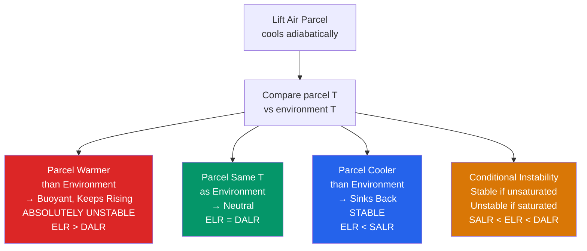

# 🌩️ Adiabatic Processes and Atmospheric Stability

> [!abstract] TL;DR
> An **adiabatic process** involves *no heat exchange* between an air parcel and its environment — the parcel's temperature changes only because it does work (expands) or has work done on it (compresses). Dry air rising adiabatically cools at the **dry adiabatic lapse rate (DALR) $\approx 9.8$ K/km**, whereas *saturated* air cools more slowly at the **saturated adiabatic lapse rate (SALR) $\approx 4\text{–}7$ K/km** because condensation releases **latent heat** that partly offsets the expansion cooling. **Atmospheric stability** is decided by comparing the actual **environmental lapse rate (ELR)** to these parcel lapse rates: if the environment cools *faster* than a lifted parcel, the parcel stays warmer, remains buoyant, and keeps rising — the atmosphere is **unstable**. **CAPE** (Convective Available Potential Energy, J/kg) integrates that buoyancy into the total energy available to a rising parcel, while **CIN** (Convective Inhibition) measures the negative-buoyancy "cap" that must first be overcome. High CAPE ($>2500$ J/kg) with low CIN and strong wind shear is the classic recipe for **severe thunderstorms**.

---

## Intuition — analogy FIRST

Picture an air parcel as a **sealed, flexible bag of air** — a balloon with perfectly insulating walls so no heat can leak in or out. Carry that bag upward and the surrounding pressure falls, so the bag *expands*. Expansion is work done *by* the gas, and since no heat is being supplied to replace that lost energy, the gas inside **cools**. Push it back down and it is compressed, work is done *on* it, and it **warms**. All of this happens with the walls sealed — this is what "adiabatic" means: temperature changes purely from expansion and compression, never from heat flowing across the boundary.

Now ask the key question: after you lift the bag, is it **warmer or cooler than the outside air at that new height?** If it is warmer, it is less dense — like a **hot-air balloon** whose gas is hotter than the surrounding air — so it keeps floating upward on its own: the atmosphere is *unstable*. If the lifted bag ends up *cooler* (denser) than its surroundings, it sinks back to where it started: the atmosphere is *stable*. The whole of convective meteorology — whether the sky stays clear or erupts into a supercell — comes down to this one comparison, repeated at every level.

---

## How It Works

A rising parcel cools along a fixed **adiabat** set by thermodynamics, while the *environment* has whatever temperature profile the large-scale weather has produced. Stability is the running comparison between the two. Below the parcel's saturation point it follows the steep **dry adiabat** (DALR); once it saturates it follows the gentler **moist adiabat** (SALR), because latent heat release slows the cooling. Where the parcel first becomes *warmer* than its surroundings it is free to accelerate upward, and the integrated buoyancy from that level to where it finally goes cold again is the CAPE.



**Deriving the DALR from first principles.** Start with the **first law of thermodynamics** for a unit mass of ideal gas, written with specific heat at constant pressure $c_p$ and specific volume $\alpha = 1/\rho$:
$$dq = c_p\,dT - \alpha\,dP.$$
For an **adiabatic** process $dq = 0$, so $c_p\,dT = \alpha\,dP = \dfrac{1}{\rho}\,dP$. Now invoke the **hydrostatic equation** $dP = -\rho g\,dz$ (see [[Atmospheric_Pressure_and_the_Hydrostatic_Equation]]):
$$c_p\,dT = \frac{1}{\rho}(-\rho g\,dz) = -g\,dz \;\Longrightarrow\; \boxed{\;\Gamma_d \equiv -\frac{dT}{dz} = \frac{g}{c_p} \approx \frac{9.81}{1004} \approx 9.8\ \text{K/km}\;}$$
The DALR is thus a *pure constant* — it depends only on gravity and the heat capacity of dry air, not on the environment.

**Why saturated air cools more slowly (the SALR).** Once a parcel is lifted to saturation, further cooling forces **water vapour to condense**, and each kilogram of condensate liberates the **latent heat of vaporization** $L_v \approx 2.5\times10^6$ J/kg back into the parcel. This internal heating partly cancels the expansion cooling, giving the **pseudoadiabatic** (saturated) lapse rate:
$$\Gamma_s = \Gamma_d\,\frac{1 + \dfrac{L_v\, r_s}{R_d\, T}}{1 + \dfrac{L_v^{2}\, r_s}{c_p\, R_v\, T^{2}}},$$
where $r_s$ is the saturation mixing ratio. Because $r_s$ grows rapidly with temperature (Clausius–Clapeyron), $\Gamma_s$ is **not constant**: it is as low as $\sim4$ K/km in warm, moisture-rich low levels and rises toward the DALR ($\sim9$ K/km) in the cold, dry upper troposphere where there is little vapour left to condense.

**The parcel's journey up a sounding.**
1. **Lifting Condensation Level (LCL).** An unsaturated surface parcel rises along the dry adiabat, cooling at $\Gamma_d$ while its dewpoint falls slowly ($\approx1.8$ K/km). Where they meet the parcel is **saturated** — cloud base. A handy field estimate is $z_{\text{LCL}} \approx 125\,(T - T_d)$ metres (Espy's rule), with $T,T_d$ in °C.
2. **Level of Free Convection (LFC).** Above the LCL the parcel follows the moist adiabat $\Gamma_s$. As long as it remains *cooler* than the environment it is negatively buoyant and must be *forced* upward — this is the inhibited layer. At the **LFC** the parcel finally becomes *warmer* than the environment and can accelerate on its own.
3. **Equilibrium Level (EL).** Rising freely, the parcel eventually reaches air as warm as itself (typically near the tropopause), loses its buoyancy, and decelerates. This is the **EL** — the theoretical anvil / cloud-top height. Overshooting tops punch a little above the EL on residual momentum.

**CAPE and CIN as areas on a thermodynamic diagram.** Buoyancy per unit mass is $b = g\,(T_{v,p} - T_{v,e})/T_{v,e}$, using **virtual temperature** $T_v = T(1+0.61\,r)$ so that moisture's effect on density is included. Integrating buoyancy over height gives the two signature quantities:
$$\text{CAPE} = \int_{\text{LFC}}^{\text{EL}} g\,\frac{T_{v,p} - T_{v,e}}{T_{v,e}}\,dz \quad (\text{J/kg}), \qquad \text{CIN} = -\int_{\text{sfc}}^{\text{LFC}} g\,\frac{T_{v,p} - T_{v,e}}{T_{v,e}}\,dz.$$
On a **Skew-T log-P diagram** these are literal *areas*: CAPE is the **positive area** where the parcel path lies to the right of (warmer than) the environmental sounding between LFC and EL; CIN is the **negative area** below the LFC where the parcel path is to the left of (cooler than) the sounding. A parcel that consumes all its CIN converts CAPE into kinetic energy, giving the thermodynamic speed limit for updrafts $w_{\max} = \sqrt{2\,\text{CAPE}}$ (a 2500 J/kg environment implies $\sim70$ m/s in the absence of loading and mixing).

**Skew-T log-P interpretation.** The Skew-T rotates isotherms 45° so that the three fundamental line families — dry adiabats, moist adiabats, and saturation mixing-ratio lines — are all clearly separated. A forecaster plots the observed temperature and dewpoint traces from a radiosonde, lifts a surface (or mean-layer) parcel along a dry adiabat to the LCL and a moist adiabat above it, and simply *reads off* the LCL, LFC, EL, CAPE (right-hand positive area) and CIN (small negative area near the surface) by inspection.

**Potential (convective) instability of a layer.** A whole *layer* can be conditionally stable to parcel lifting yet become explosively unstable if the entire layer is lifted — for example over a front or terrain. This happens when equivalent potential temperature **decreases with height** ($\partial\theta_e/\partial z < 0$): the moist lower part of the layer warms slowly along a moist adiabat while the dry upper part cools fast along a dry adiabat, steepening the lapse rate until the layer overturns.

---

## Key Concepts / Details

### Secondary Level

- **What "adiabatic" means.** No heat crosses the parcel boundary. The parcel still changes temperature — but *only* through expansion (cooling) and compression (warming), never by contact heating or radiation.
- **Why rising air cools.** As a parcel ascends into lower pressure it expands, doing work on the surrounding air; that energy comes out of the gas's own internal energy, so it cools. No fire is being removed — the air is simply "spending" heat to expand.
- **Why saturated air cools more slowly.** Once cloud droplets start forming, **condensation releases latent heat** inside the parcel, offsetting some of the expansion cooling. That's why a moist rising parcel cools at only ~5 K/km instead of the dry ~9.8 K/km.
- **Stable vs unstable in one sentence.** If a nudged parcel comes back down, the air is **stable** (calm, layered clouds, smooth flights); if it keeps going up on its own, the air is **unstable** (towering cumulus, showers, thunderstorms).
- **What CAPE means intuitively.** CAPE is the amount of "fuel" stored in the atmosphere for updrafts — the bigger the warm, buoyant area a parcel can ride through, the more violent the storm it can build. It is measured in joules per kilogram of air.
- **Why forecasters watch CAPE before thunderstorm season.** Rising CAPE through spring signals that the atmosphere is loading up potential energy; combined with a trigger (front, heating, terrain) and wind shear, high CAPE days are flagged days ahead as severe-weather risks.

### Undergraduate Level

**DALR derivation (recap).** From $dq = c_p\,dT - \alpha\,dP = 0$ and hydrostatic balance $dP = -\rho g\,dz$: $\Gamma_d = -dT/dz = g/c_p \approx 9.8$ K/km — independent of the environment.

**Potential temperature $\theta$.** The temperature a parcel *would* have if brought adiabatically to a reference pressure $P_0 = 1000$ hPa:
$$\theta = T\left(\frac{P_0}{P}\right)^{R_d/c_p}, \qquad R_d/c_p \approx 0.286.$$
$\theta$ is **conserved for dry adiabatic motion**, so it is the natural vertical coordinate for stability: $\partial\theta/\partial z > 0$ is statically stable, $=0$ neutral, $<0$ unstable.

**SALR via the pseudoadiabat.** Because $\Gamma_s$ depends on temperature and pressure through $r_s(T,P)$, moist adiabats are computed **iteratively** (or read from the pre-drawn curves on a Skew-T). They fan out from steep and dry adiabat-like at cold temperatures to shallow ($\sim4$ K/km) in the warm boundary layer.

**LCL, LFC, EL graphically.** On a Skew-T: LCL is where the dry adiabat from the surface temperature meets the saturation mixing-ratio line from the surface dewpoint; LFC is the lower intersection of the moist adiabat with the environmental temperature curve; EL is the upper intersection. The **positive area** between them is CAPE; the **negative area** below the LFC is CIN.

**LCL quick estimate.** $z_{\text{LCL}} \approx 125\,(T - T_d)$ m — a 6 °C dewpoint depression puts cloud base near 750 m.

**Stability regimes vs the lapse rates.**

| Condition on ELR | Stability | Behaviour |
|---|---|---|
| $\text{ELR} > \Gamma_d$ | **Absolutely unstable** | Buoyant whether saturated or not (rare, shallow superadiabatic surface layers) |
| $\text{ELR} = \Gamma_d$ | Dry neutral | Marginal for unsaturated parcels |
| $\Gamma_s < \text{ELR} < \Gamma_d$ | **Conditionally unstable** | Stable if dry, unstable *if* the parcel is lifted to saturation — the common case |
| $\text{ELR} = \Gamma_s$ | Moist neutral | Marginal for saturated parcels |
| $\text{ELR} < \Gamma_s$ | **Absolutely stable** | Parcel always cooler than environment; no free convection |

**Stability indices (proxies).** Rather than integrate CAPE by hand, forecasters historically used single-number indices:
- **Lifted Index (LI)** $= T_{\text{env},500} - T_{\text{parcel},500}$; negative $\Rightarrow$ unstable ($-6$ or lower is very unstable).
- **K-index** $= (T_{850}-T_{500}) + T_{d,850} - (T_{700}-T_{d,700})$; blends mid-level lapse rate with low-level moisture, used for airmass-thunderstorm/heavy-rain risk.
- **Convective temperature** — the surface temperature that must be reached (by daytime heating) for a surface parcel to rise freely to its LFC with no other forcing, i.e. the threshold for spontaneous afternoon convection.

**Foehn / chinook warming.** Moist air forced over a mountain **ascends the windward side along the SALR** (cooling slowly while it rains out its moisture), then **descends the lee side along the steeper DALR** (warming fast because it is now dry). Since descent warms at $\sim9.8$ K/km but the ascent only cooled at $\sim5$ K/km, the leeward air arrives **warmer and much drier** than it started — the dramatic chinook "snow-eater" winds east of the Rockies.

### Graduate Level

**Equivalent potential temperature $\theta_e$.** Condensing *all* the vapour and adding its latent heat to the parcel defines
$$\theta_e \approx \theta\,\exp\!\left(\frac{L_v\, r_s}{c_p\, T}\right),$$
which is **conserved for both dry and moist (pseudo)adiabatic processes**. Because it packages temperature, pressure, and moisture into one conserved scalar, $\theta_e$ is the premier **air-mass tracer**: a tongue of high-$\theta_e$ air on an 850 hPa map marks the warm, moist inflow feeding a storm. **Potential (convective) instability** is diagnosed as $\partial\theta_e/\partial z < 0$ over a layer — a stably stratified layer that becomes unstable when lifted bodily.

**Parcel flavours of CAPE.** Which parcel you lift matters enormously:
- **SBCAPE** (surface-based) lifts an actual surface parcel — relevant for daytime, surface-based storms.
- **MLCAPE** (mixed-layer) lifts a parcel with the mean $\theta$ and $r$ of the lowest ~100 hPa — reduces sensitivity to an unrepresentative surface "spike" and better predicts sustained updrafts.
- **MUCAPE** (most-unstable) lifts whichever parcel in the lowest few hundred hPa yields the largest CAPE — captures **elevated convection** feeding on air above a stable surface layer (e.g. nocturnal storms above a cool boundary layer).

**Capping inversions and convective initiation (CI).** A warm, dry mid-level layer (often an **elevated mixed layer**, EML, advected off high terrain such as the Mexican Plateau) imposes large CIN — the "cap" or "lid." It suppresses weak convection all day, letting the boundary layer heat and moisten (CAPE builds) until a **mesoscale trigger** (dryline, cold front, outflow boundary, terrain circulation, gravity wave, or low-level jet convergence) supplies enough lift to breach the cap. The delayed, *explosive* release is exactly why capped days produce the most violent supercells — or, if the cap never breaks, a "busted" forecast with clear skies.

**Virtual temperature and water loading.** Buoyancy must use $T_v = T(1+0.61 r_v - r_l)$: water vapour makes air *less* dense (positive buoyancy correction), but suspended/condensed **liquid and ice loading** $r_l$ makes the parcel *heavier*, reducing effective CAPE by 10–40% and helping drive **downdrafts**. Neglecting the virtual correction systematically over- or under-estimates CAPE, especially in the moist tropics.

**CAPE–shear parameter space and storm mode.** CAPE sets updraft *strength*; deep-layer (0–6 km) **bulk wind shear** sets updraft *organization and longevity*. The joint space discriminates hazards:
- **High CAPE, weak shear** → short-lived single "pulse" cells; hazard is **hail** and wet microbursts.
- **Moderate–high CAPE, strong shear ($\gtrsim 20$ m/s)** → **supercells**; rotating mesocyclones, giant hail, and (with strong low-level shear / high storm-relative helicity and low LCL) **tornadoes**. Composite indices such as the Supercell Composite and Significant Tornado Parameter formalize this.
- **Long, narrow high-CAPE + strong shear zones** → **QLCS / squall lines and derechos**; hazard is widespread damaging straight-line wind.
The **Bulk Richardson Number** $\text{BRN} = \text{CAPE}/(0.5\,U^2)$ (with $U$ a shear metric) historically separates multicell (high BRN) from supercell (BRN $\sim10\text{–}45$) regimes.

**Dynamic stability of the boundary layer.** Beyond static (parcel) stability, *shear-driven* turbulence is governed by the **gradient Richardson number**
$$Ri = \frac{N^2}{S^2} = \frac{(g/\theta)\,\partial\theta/\partial z}{(\partial u/\partial z)^2},$$
where $N$ is the **Brunt–Väisälä frequency**. $Ri < 0.25$ permits Kelvin–Helmholtz overturning and generation of **turbulent kinetic energy (TKE)** in the boundary layer; $Ri > 1$ suppresses it. Operational forecasting increasingly relies on **ensemble** CAPE/CIN and shear forecasts to express the sharp, threshold-like sensitivity of convective initiation to small errors in the cap.

---

## Python demo — CAPE and CIN as shaded areas on a simplified Skew-T

The script builds a simplified sounding (a slightly unstable troposphere with a stable cap near the tropopause), lifts a surface parcel with $T = 28\,°$C, $T_d = 22\,°$C **dry-adiabatically to the LCL** and then **moist-adiabatically** above it, locates the **LFC** and **EL**, shades the **positive (CAPE)** and **negative (CIN)** areas, and integrates buoyancy numerically to report CAPE and CIN in J/kg. Runnable with `numpy` + `matplotlib`.

```python
# CAPE / CIN from a simplified parcel ascent on a temperature-vs-height diagram.
# Dry adiabat to the LCL, constant simplified moist adiabat above; numeric buoyancy integral.
import numpy as np
import matplotlib.pyplot as plt

# ---- Constants and parcel/environment definition ----
g      = 9.81            # m/s^2
DALR   = 9.8             # K/km   dry adiabatic lapse rate
SALR   = 6.0             # K/km   simplified (constant) saturated adiabatic lapse rate
T_sfc  = 28.0           # deg C  surface parcel temperature
Td_sfc = 22.0           # deg C  surface parcel dewpoint

# LCL via Espy's approximation: ~125 m per deg C of dewpoint depression
z_LCL = 0.125 * (T_sfc - Td_sfc)                 # km  -> 0.75 km

# Height grid (10 m resolution) up to 16 km
z = np.linspace(0.0, 16.0, 1601)                 # km

# Environmental sounding: constant lapse 7.5 K/km to a 12 km tropopause, isothermal above
ELR, z_trop = 7.5, 12.0
T_env = np.where(z <= z_trop, T_sfc - ELR*z, T_sfc - ELR*z_trop)

# Parcel path: dry adiabat below the LCL, moist adiabat above it
T_lcl    = T_sfc - DALR*z_LCL
T_parcel = np.where(z <= z_LCL, T_sfc - DALR*z, T_lcl - SALR*(z - z_LCL))

# ---- Buoyancy (use Kelvin; positive where parcel is warmer than environment) ----
Tp_K, Te_K = T_parcel + 273.15, T_env + 273.15
diff  = Tp_K - Te_K
buoy  = g * diff / Te_K                            # m/s^2 buoyant acceleration
dz_m  = (z[1] - z[0]) * 1000.0                     # layer thickness in metres

# ---- Locate LFC (first neg->pos crossing above LCL) and EL (next pos->neg crossing) ----
neg_to_pos = np.where((diff[:-1] < 0) & (diff[1:] > 0) & (z[:-1] >= z_LCL))[0]
z_LFC = z[neg_to_pos[0] + 1] if neg_to_pos.size else z_LCL
pos_to_neg = np.where((diff[:-1] > 0) & (diff[1:] < 0) & (z[:-1] > z_LFC))[0]
z_EL = z[pos_to_neg[0] + 1] if pos_to_neg.size else z[-1]

# ---- Integrate positive area (CAPE) and negative area (CIN) ----
cape_mask = (z >= z_LFC) & (z <= z_EL) & (diff > 0)
cin_mask  = (z < z_LFC) & (diff < 0)
CAPE =  np.sum(buoy[cape_mask]) * dz_m             # J/kg (positive)
CIN  =  np.sum(buoy[cin_mask])  * dz_m             # J/kg (negative)
w_max = np.sqrt(2.0 * CAPE)                        # theoretical max updraft (m/s)

# ---- Plot: environment, parcel path, shaded CAPE / CIN ----
fig, ax = plt.subplots(figsize=(7, 9))
ax.plot(T_env,    z, 'b-', lw=2, label='Environment T(z)')
ax.plot(T_parcel, z, 'r-', lw=2, label='Parcel path')
ax.fill_betweenx(z, T_env, T_parcel, where=cape_mask,
                 color='red',  alpha=0.30, label=f'CAPE = {CAPE:.0f} J/kg')
ax.fill_betweenx(z, T_env, T_parcel, where=cin_mask,
                 color='blue', alpha=0.30, label=f'CIN = {CIN:.0f} J/kg')

for zz, name in [(z_LCL, 'LCL'), (z_LFC, 'LFC'), (z_EL, 'EL')]:
    ax.axhline(zz, color='grey', ls=':', lw=0.8)
    ax.text(30, zz, f' {name} ({zz:.1f} km)', va='center', fontsize=8)

ax.set_xlabel('Temperature (deg C)'); ax.set_ylabel('Height (km)')
ax.set_title('Simplified Skew-T: CAPE (red) and CIN (blue)')
ax.set_xlim(-70, 35); ax.set_ylim(0, 16); ax.legend(loc='upper right')
plt.tight_layout(); plt.show()

# ---- Console summary ----
print(f"LCL  = {z_LCL:.2f} km   LFC = {z_LFC:.2f} km   EL = {z_EL:.2f} km")
print(f"CAPE = {CAPE:.0f} J/kg  (w_max ~ {w_max:.0f} m/s)")
print(f"CIN  = {CIN:.0f} J/kg")
```

Expected output (rounded): `LCL = 0.75 km, LFC ≈ 1.9 km, EL ≈ 14.5 km`; `CAPE ≈ 3500 J/kg` (a severe-weather environment, implying a theoretical $w_{\max}\sim80$ m/s before loading and mixing); `CIN ≈ -30 J/kg` (a modest cap easily broken by afternoon heating or a front). The plot shows the steep dry-adiabatic segment below the LCL, the shallower moist adiabat above it, a small blue negative-area cap near the surface, and the large red positive area fanning open toward the tropopause — the visual signature every forecaster scans for.

---

## Real-World Notes

- **US "Tornado Alley" springs** routinely reach **CAPE $>3000$ J/kg**: warm, moist inflow from the Gulf of Mexico at low levels, a hot **elevated mixed layer** off the Mexican Plateau acting as a cap (high CIN), and a strong upper-level jet supplying the shear — the textbook supercell/tornado ingredients over the Great Plains in April–June.
- **Foehn / chinook winds** cause dramatic warming and drying on the lee side of mountains — east of the **Alps** (Foehn) and the **Rocky Mountains** (chinook) — because air ascends the windward slope at the moist SALR but descends the lee slope at the steeper dry DALR, arriving net-warmer; chinooks have raised temperatures by tens of degrees in hours.
- **Radiosonde soundings** from roughly **800 global upper-air stations**, launched twice daily at 00 and 12 UTC, provide the vertical $T$, $T_d$, wind, and pressure profiles that *are* the raw material for every stability analysis — CAPE, CIN, LCL, and shear are all derived from these Skew-T soundings.
- **"Explosive" thunderstorm initiation** occurs when a substantial CIN cap is **rapidly overcome by mesoscale lift** (a dryline, outflow boundary, or intensifying low-level jet): all the CAPE that built under the lid is released nearly at once, launching violent updrafts within minutes.
- **Tropical convection along the ITCZ** is driven not by huge CAPE but by **near-zero CIN and modest CAPE**: the warm, humid tropical column has almost no cap, so even weak convergence continuously fires showers and thunderstorms — deep convection on a hair trigger rather than an explosive release.
- **Skew-T log-P diagrams** remain the **standard tool** across all operational forecasting and atmospheric research for thermodynamic and stability analysis, because parcel paths, CAPE, CIN, and the LCL/LFC/EL levels can all be constructed and read directly on a single chart.

---

## Common Pitfalls

1. **"CAPE alone predicts severe weather."** CAPE is *necessary but not sufficient*. Without adequate **wind shear** to organize and tilt the updraft, high-CAPE air produces only short-lived pulse storms; supercells and tornadoes require CAPE **and** deep-layer shear (and, for tornadoes, strong low-level shear plus a low LCL). Always evaluate the CAPE–shear space, not CAPE by itself.
2. **"Adiabatic means isothermal."** These are opposites. *Isothermal* = temperature held constant (which requires heat exchange). *Adiabatic* = **no heat exchange**, during which the temperature very much **does change** through expansion/compression. Confusing them inverts the whole physics of rising air.
3. **"Rising air always cools at 9.8 K/km."** The **DALR applies only to *unsaturated* parcels**. Once a parcel saturates (above the LCL) it releases latent heat and follows the shallower, temperature-dependent **SALR ($\approx4\text{–}7$ K/km)**. Using the DALR above cloud base badly overestimates cooling and underestimates CAPE.
4. **"The LCL is where convection takes off."** The **LCL is merely where saturation is reached** (cloud base). The parcel there is usually still *cooler* than its surroundings and negatively buoyant. Free convection only begins at the higher **LFC**, where the parcel finally becomes warmer than the environment. Confusing LCL with LFC misplaces both the cap and the storm.
5. **"Potential instability is just parcel instability."** **Potential (convective) instability** refers to a *layer's* $\theta_e$ structure ($\partial\theta_e/\partial z < 0$), not to lifting a single parcel. A layer that is perfectly *stable* to parcel displacement can become **explosively unstable** when the *entire layer* is lifted (over a front or terrain), because its dry top cools faster than its moist base — a mechanism single-parcel CAPE cannot capture.

---

## Related Concepts

- [[_MOC_Atmospheric_Thermodynamics]] — section map for the atmospheric-thermodynamics chapter of this vault.
- [[Atmospheric_Temperature_and_Lapse_Rates]] — defines the environmental lapse rate (ELR) that this note compares against the parcel (DALR/SALR) lapse rates.
- [[Moisture_and_Humidity]] — dewpoint, mixing ratio, and saturation that set the LCL and the latent-heat term behind the SALR.
- [[Cloud_Formation_and_Microphysics]] — condensation at the LCL and the droplet/ice loading that modifies parcel buoyancy.
- [[Thunderstorms_and_Convective_Systems]] — the storms that CAPE, CIN, and shear together produce; this note supplies their thermodynamic energetics.
- [[Tropical_Meteorology_and_Monsoons]] — low-CIN, modest-CAPE ITCZ convection contrasted with mid-latitude capped regimes.
- [[Mesoscale_Meteorology_and_Severe_Weather]] — the CAPE–shear parameter space distinguishing supercell, QLCS, and hail/wind hazards.
- [[Synoptic_Meteorology_and_Weather_Maps]] — how soundings, LI/K-index, and CAPE fields are used operationally in forecasting.
- [[Atmospheric_Pressure_and_the_Hydrostatic_Equation]] — the hydrostatic relation combined with the first law to derive the DALR.
- [[_MOC_Physics_Master]] — cross-vault entry point to the underlying physics.
- [[Laws_of_Thermodynamics]] — the first law and adiabatic processes that define $\theta$, $\theta_e$, and the lapse rates.
- [[Kinetic_Theory_of_Gases]] — the ideal-gas foundation ($P=\rho R_d T$, $c_p$, $c_v$) behind $\Gamma_d = g/c_p$.

---

## Review Questions

**Secondary.** Why does a rising *unsaturated* air parcel cool faster ($9.8\,°$C/km) than a rising *saturated* parcel ($\sim5\,°$C/km)? What process occurring *inside* the rising saturated parcel releases heat and slows its cooling?

**Undergraduate.** A surface air parcel has $T = 30\,°$C and $T_d = 20\,°$C. **(a)** Estimate the LCL height using $z_{\text{LCL}} \approx 125\,(T - T_d)$ m. **(b)** Above the LCL the parcel cools at SALR $= 6$ K/km while the environment cools at ELR $= 7$ K/km. For this *saturated* parcel, is the atmosphere absolutely unstable, absolutely stable, or conditionally unstable — and what does that imply for the parcel's buoyancy? **(c)** Describe, step by step, how you would compute CAPE from a full radiosonde sounding on a Skew-T.

**Graduate.** Explain why meteorologists distinguish **SBCAPE**, **MLCAPE**, and **MUCAPE**, and give a situation where each is the right choice. In a strongly **capped** environment (large CIN), which mesoscale forcing mechanisms can breach the cap to initiate convection, and why does such delayed release often yield the *most* violent storms? Finally, describe how the **CAPE–shear parameter space** differentiates an ordinary single-cell storm, a supercell, and a quasi-linear convective system (QLCS), and which hazards dominate each mode.

---

## Sources

- Holton, J. R., & Hakim, G. J. — *An Introduction to Dynamic Meteorology* (5th ed.), Academic Press. Adiabatic processes, potential temperature, static stability, and the lapse-rate derivations.
- Emanuel, K. A. — *Atmospheric Convection* (1994), Oxford University Press. Moist thermodynamics, $\theta_e$, CAPE/CIN, and conditional/potential instability.
- Markowski, P., & Richardson, Y. — *Mesoscale Meteorology in Midlatitudes* (2010), Wiley-Blackwell. Convective initiation, capping inversions, and the CAPE–shear parameter space for storm mode.

---

#Meteorology #AtmosphericThermodynamics #Adiabatic #AtmosphericStability #CAPE
