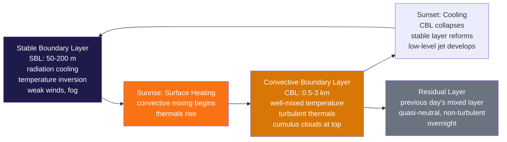

# 🌀 Atmospheric Boundary Layer

> [!abstract] TL;DR
> The **atmospheric boundary layer (ABL, or planetary boundary layer, PBL)** is the lowest **~1–3 km** of the troposphere that is *directly* coupled to the surface through **turbulent exchange of momentum, heat, and moisture**. It is **convective (well-mixed, unstable) by day** and **stable (stratified) by night**, cycling with the surface energy budget. The ABL controls **pollutant dispersion, wind-energy resources, aviation turbulence, fog, and the surface fluxes that feed climate models**. **Monin–Obukhov similarity theory** describes the universal structure of the **surface layer** (the lowest 50–100 m), where the **log-wind profile** $u(z)=(u_*/\kappa)\ln(z/z_0)$ holds under neutral stability. ABL depth ranges dramatically — from a **deep ~3–5 km desert** boundary layer to a **shallow ~200–500 m maritime** one — and is set by **surface sensible heat flux, stability (via the Obukhov length $L$), and entrainment** at its top.

---

## Intuition — analogy FIRST

Picture the boundary layer as a **mixing bowl of air sitting on a hotplate**. During the day the Sun heats the ground, the ground heats the air touching it, and buoyant **thermals** rise like bubbles in simmering soup — stirring heat, moisture, momentum, and pollution *upward* until the whole bowl is churned into a uniform, well-mixed broth. The more you heat it, the taller the stirring reaches, so the **mixing bowl grows through the day**, sometimes to 2–3 km.

At **sunset the hotplate switches off**. The stirring stops. The bottom of the bowl, now radiating its heat away to a clear sky, chills and settles into a calm, cold, stratified **"nightcap"** — a shallow stable layer where a torch beam of smoke would hang motionless in flat sheets. Anything emitted into that nightcap — car exhaust, factory plumes, radiation fog — is **trapped** under a lid a few hundred metres thick until the morning Sun fires the hotplate again and the bowl reinflates.

Everything about the ABL flows from one question: *is the surface adding buoyancy (heating → convective, deep, turbulent) or removing it (cooling → stable, shallow, laminar)?* The free troposphere above simply doesn't feel the ground on these timescales — it is the still air above the bowl's rim.

---

## How It Works

The boundary layer is the atmosphere's **turbulent skin**. Sunlight passes through the air and heats the *surface*; the heated surface drives **turbulent eddies** — mechanical eddies from wind shear over rough ground, and buoyant thermal eddies from heating — that carry momentum *down* and heat and moisture *up*. The character of that turbulence flips twice a day with the **sign of the surface heat flux**, producing a distinct **diurnal cycle** of layers.



**The surface layer (Prandtl layer)** is the bottom **~10 % of the ABL** — typically the lowest 50–100 m — where turbulent fluxes are nearly constant with height (the "constant-flux layer") and **Monin–Obukhov similarity theory (MOST)** applies. Here the mean wind follows the **logarithmic wind profile** under neutral conditions:

$$u(z) = \frac{u_*}{\kappa}\ln\!\left(\frac{z}{z_0}\right)$$

with **von Kármán constant** $\kappa \approx 0.40$, **friction velocity** $u_* = \sqrt{\tau_s/\rho}$ (the shear stress recast as a velocity), and **roughness length** $z_0$ — the height at which the extrapolated wind vanishes. Over tall canopies the profile is shifted upward by the **displacement height** $d$, so $z$ is replaced by $(z-d)$.

**Stability bends the log profile.** The single number that measures stability is the **Monin–Obukhov length**:

$$L = -\frac{u_*^{3}\,\rho\,c_p\,T_v}{\kappa\,g\,Q_H}$$

where $Q_H$ is the **surface sensible heat flux**. The dimensionless **stability parameter** $\zeta = z/L$ then classifies the surface layer: $\zeta<0$ **unstable/convective** (upward heat flux, $Q_H>0$), $\zeta>0$ **stable** (downward heat flux at night), $\zeta\approx 0$ **neutral** (strong wind, cloudy — mechanical turbulence dominates). $|L|$ is the height at which buoyant and shear production of turbulence are comparable; below it shear rules, above it buoyancy rules.

**The daytime convective boundary layer (CBL)** has a three-part structure: a thin **superadiabatic surface layer** where temperature falls steeply, a deep **mixed layer** where potential temperature $\theta$, humidity $q$, and wind are nearly *uniform with height* (the "well-mixed" signature — thermals homogenise everything), and a capping **entrainment zone** where the turbulent top of the CBL erodes into the warmer, drier **free troposphere**, pulling that air down. The CBL top, the **boundary-layer height $z_i$**, is marked by a capping inversion and often a line of **fair-weather cumulus** where rising thermals reach their condensation level. The convective velocity scale $w_* = \left(\tfrac{g}{T_v}\,Q_H\,z_i\right)^{1/3}$ sets the strength of the thermals.

**The nighttime stable boundary layer (SBL)** is a shallow, strongly stratified layer capped by a surface **temperature inversion** from radiative cooling. Turbulence is **weak, patchy, and intermittent**. Above the shrinking turbulent SBL sits the **residual layer** — yesterday's mixed layer, now decoupled from the ground, quasi-neutral and non-turbulent, preserving the previous afternoon's pollutants and moisture aloft. Decoupling of the flow aloft from surface friction lets a **nocturnal low-level jet (LLJ)** accelerate to a super-geostrophic wind maximum near the SBL top.

**Measuring the ABL.** $z_i$ and the vertical structure are diagnosed from **radiosonde** soundings (the inversion base), and remotely from **lidar/ceilometer** (aerosol backscatter drops at the CBL top), **sodar** (acoustic sounding of thermals), and **wind-profiler / Doppler-lidar** (turbulence and the LLJ). Because the ABL "breathes" — deep by afternoon, collapsed by night — its height is a moving target that pollution, aviation, and NWP all must track.

---

## Key Concepts / Details

### Secondary Level

- **The boundary layer is the part of the atmosphere that "feels" the ground.** It is the bottom kilometre or two where friction, heating, and evaporation from the surface actually mix into the air. Above it, the free atmosphere glides along untouched.
- **Day vs night flips it completely.** By day the hot ground makes air rise and churn — the layer is **unstable and well-mixed**, growing tall and gusty. By night the cold ground makes a shallow **stable** layer of calm, cold air that sits still.
- **Why fog forms at night.** With the mixing switched off and the ground radiating heat to a clear sky, the air just above the surface cools to its dew point. Trapped in the calm stable layer, that moisture condenses into **radiation fog** that lingers until the morning Sun re-heats and re-mixes the air.
- **Why pollution is worst on calm, cold nights and clears after sunrise.** At night the stable "lid" sits only 100–300 m up, so exhaust and smoke pile up in a thin trapped layer — the recipe for morning smog. After sunrise, thermals punch through, the mixing bowl reinflates, and the pollution is diluted through a layer ten times deeper — so **air quality is usually worst in the early morning and best in the early afternoon** on sunny days.
- **Why wind turbines live in the boundary layer.** Turbine rotors spin at 50–150 m — right in the surface layer — so where and how you site a wind farm depends entirely on how the ABL wind and turbulence behave with height and stability.

### Undergraduate Level

**The logarithmic wind profile** is the cornerstone of surface-layer meteorology. Under **neutral** stratification, dimensional analysis (Prandtl's mixing length) gives $\partial u/\partial z = u_*/(\kappa z)$, which integrates to

$$u(z) = \frac{u_*}{\kappa}\ln\!\left(\frac{z}{z_0}\right).$$

- **Friction velocity** $u_* = \sqrt{\tau_s/\rho}$ recasts the surface shear stress $\tau_s$ (momentum flux $-\overline{u'w'}$) as a velocity scale. Typical values: **0.1 m/s** (light wind) to **>0.6 m/s** (strong wind over rough terrain).
- **Roughness length** $z_0$ is an **aerodynamic** property — the height at which the log profile extrapolates to zero wind — *not* the physical obstacle height. Ranges over five orders of magnitude: **~0.0002 m open ocean (calm)**, ~0.03 m grassland, ~0.1 m crops/scrub, **1–2 m for cities and forests**.
- **Displacement height** $d$ raises the effective ground for tall canopies (forests, urban): use $\ln((z-d)/z_0)$, with $d\approx 0.6$–$0.7\times$ the canopy/building height.

**Stability corrections.** Away from neutral, MOST adds an integrated correction $\psi_m(\zeta)$:

$$u(z) = \frac{u_*}{\kappa}\left[\ln\!\left(\frac{z}{z_0}\right) - \psi_m\!\left(\frac{z}{L}\right)\right],\qquad \zeta=\frac{z}{L}.$$

The **Obukhov length**

$$L = -\frac{u_*^{3}\,\rho\,c_p\,T_v}{\kappa\,g\,Q_H}$$

encodes the competition between shear-generated and buoyancy-generated turbulence. **Stable ($\zeta>0$)** flow suppresses mixing, so the profile shows *stronger shear* (wind rises faster with height for a given $u_*$); **unstable ($\zeta<0$)** flow enhances mixing, flattening the profile toward a well-mixed, nearly uniform wind.

**Convective mixed-layer structure.** In the CBL, **$\theta$ is well-mixed** (near-constant with height), **$q$ is well-mixed**, and wind is roughly constant, with a thin superadiabatic surface layer below and an **entrainment zone** above. Typical **ABL depths**: **desert ~3 km, mid-latitude land 1–2 km (afternoon), maritime ~500 m**, stable-nocturnal 50–300 m.

**The turbulent kinetic energy (TKE) budget** governs whether turbulence grows or decays:

$$\frac{\partial \bar e}{\partial t} = \underbrace{-\overline{u'w'}\frac{\partial \bar u}{\partial z}}_{\text{shear production}} + \underbrace{\frac{g}{\theta_v}\overline{w'\theta_v'}}_{\text{buoyancy}} - \underbrace{\frac{\partial \overline{w'e}}{\partial z}}_{\text{transport}} - \underbrace{\varepsilon}_{\text{dissipation}}.$$

Buoyancy production is **positive** (a turbulence source) in the convective CBL and **negative** (a sink) in the SBL — which is exactly why nighttime turbulence is weak and intermittent.

### Graduate Level

**The turbulent closure problem.** The Reynolds-averaged equations contain turbulent fluxes (e.g. $\overline{w'\theta'}$) that are unknowns — averaging the nonlinear advection generates more unknowns than equations. Every ABL model must **parameterize** these fluxes.

- **First-order (K-theory) closure** models fluxes as down-gradient diffusion, $\overline{w'\theta'} = -K_h\,\partial\bar\theta/\partial z$, with an **eddy diffusivity** $K_h$. Simple and cheap, but **fails in the convective mixed layer**, where thermals drive **counter-gradient / non-local transport** (heat flows *up* through a layer of zero or slightly positive $\partial\theta/\partial z$). The **K-profile parameterization (KPP / YSU)** patches this by prescribing a smooth $K(z)$ shape across the whole ABL plus a non-local counter-gradient term $\gamma_c$; the **Mellor–Yamada–Janjić (MYJ)** scheme is a widely used local closure in NWP.
- **1.5-order (TKE) closure** carries a **prognostic equation for TKE** and diagnoses $K = \ell\sqrt{e}$ from a length scale $\ell$ — a better balance of cost and physics across stability regimes (e.g. the MYNN and BouLac schemes).
- **Large-eddy simulation (LES)** resolves the energy-containing eddies directly on a fine 3-D grid and models only the sub-grid scales — the gold standard for CBL research, but **far too expensive for operational NWP**, which is why parameterization schemes remain essential.

**Similarity functions.** MOST posits that dimensionless gradients are universal functions of $\zeta$: $\phi_m(\zeta)=\tfrac{\kappa z}{u_*}\tfrac{\partial \bar u}{\partial z}$ and $\phi_h(\zeta)=\tfrac{\kappa z}{\theta_*}\tfrac{\partial \bar\theta}{\partial z}$. The empirical **Businger–Dyer** forms:

$$\phi_m=(1-16\zeta)^{-1/4},\quad \phi_h=(1-16\zeta)^{-1/2}\ \ (\zeta<0);\qquad \phi_m=\phi_h=1+5\zeta\ \ (\zeta>0).$$

In the **free-convection limit** ($\zeta\to-\infty$, weak wind, strong heating), $u_*$ loses relevance and the **convective velocity scale** $w_*=\left(\tfrac{g}{\theta_v}\overline{w'\theta_v'}\,z_i\right)^{1/3}$ replaces it as the governing scale.

**Air–sea fluxes via bulk transfer.** Over the ocean, surface fluxes are parameterized with **bulk transfer (exchange) coefficients**:

$$\tau = \rho\,C_D\,U^2,\quad H = \rho c_p\,C_H\,U\,(\theta_s-\theta_a),\quad LE = \rho L_v\,C_E\,U\,(q_s-q_a),$$

with $C_D, C_H, C_E \sim 1$–$1.5\times10^{-3}$, adjusted for stability (the COARE algorithm). These fluxes are the ABL's handshake with the ocean and are the dominant surface boundary condition in climate models.

**Surface energy balance** closes the system:

$$R_{net} = G + H + LE$$

net radiation is partitioned into **ground (soil) heat flux $G$**, **sensible heat $H$**, and **latent heat $LE$**. The **Bowen ratio** $B=H/LE$ (large over deserts, small over wet surfaces) controls whether energy goes into *heating* the ABL (deep, dry) or *moistening* it (shallow, humid). Dissipation of turbulence follows an **Obukhov–Corrsin / Kolmogorov** cascade to the millimetre scale.

**Urban and canopy layers.** Cities add a **roughness sublayer** and a **canyon-scale urban canopy layer** below roof level, with a distinct **urban boundary layer** aloft; large $z_0$, anthropogenic heat, and reduced evaporation reshape the whole ABL and drive the [[Urban_Heat_Island_Effect|urban heat island]]. Modern ABL structure is probed with **Doppler lidar** and **wind-profiler radar** that resolve $z_i$, entrainment, and the LLJ continuously.

---

## Code Demo

```python
# Surface-layer wind profiles under NEUTRAL, STABLE, and UNSTABLE stratification
# using Monin-Obukhov similarity theory with Businger-Dyer stability corrections:
#
#     u(z) = (u*/kappa) * [ ln(z/z0) - psi_m(z/L) ]
#
#   Neutral:  psi_m = 0
#   Stable:   psi_m = -5 * (z/L)                               (z/L > 0)
#   Unstable: psi_m = 2 ln[(1+x)/2] + ln[(1+x^2)/2]
#                     - 2 arctan(x) + pi/2,  x = (1 - 16 z/L)^(1/4)   (z/L < 0)
import numpy as np
import matplotlib.pyplot as plt

kappa = 0.40      # von Karman constant (dimensionless)
z0    = 0.10      # aerodynamic roughness length, m (grassland / scrub)
ustar = 0.30      # friction velocity, m/s

z = np.linspace(1.0, 200.0, 400)          # height above ground, m

# Fix the Obukhov length so that z/L = +/-0.5 at the top of the surface
# layer (z_ref = 50 m):   L = z_ref / (z/L)
z_ref      = 50.0
L_stable   = z_ref /  0.5                  # = +100 m  (weakly stable)
L_unstable = z_ref / -0.5                  # = -100 m  (weakly convective)

def psi_m(zeta):
    """Businger-Dyer integrated stability correction for momentum."""
    zeta = np.asarray(zeta, dtype=float)
    psi  = np.zeros_like(zeta)
    # unstable branch (zeta < 0)
    un = zeta < 0.0
    x  = (1.0 - 16.0 * zeta[un]) ** 0.25
    psi[un] = (2.0 * np.log((1.0 + x) / 2.0)
               + np.log((1.0 + x**2) / 2.0)
               - 2.0 * np.arctan(x) + np.pi / 2.0)
    # stable branch (zeta > 0)
    st = zeta > 0.0
    psi[st] = -5.0 * zeta[st]
    return psi

def u_profile(z, L=None):
    """Log-wind profile with MOST stability correction. L=None -> neutral."""
    zeta = np.zeros_like(z) if L is None else z / L
    return (ustar / kappa) * (np.log(z / z0) - psi_m(zeta))

u_neutral  = u_profile(z, L=None)
u_stable   = u_profile(z, L=L_stable)
u_unstable = u_profile(z, L=L_unstable)

# --- console sanity checks: neutral log law ---
for zc in (10.0, 100.0):
    print(f"neutral u({zc:6.1f} m) = {(ustar/kappa)*np.log(zc/z0):5.2f} m/s")
print(f"stable  u(200 m)   = {u_stable[-1]:5.2f} m/s  (strong shear)")
print(f"unstable u(200 m)  = {u_unstable[-1]:5.2f} m/s  (well mixed, flat)")

# --- plot: wind speed (x) vs height (y) ---
fig, ax = plt.subplots(figsize=(6, 8))
ax.plot(u_neutral,  z, 'k-',  lw=2.2, label='Neutral  (z/L = 0)')
ax.plot(u_stable,   z, color='#1e40af', ls='--', lw=1.8,
        label='Stable   (z/L = +0.5 at 50 m)')
ax.plot(u_unstable, z, color='#d97706', ls='--', lw=1.8,
        label='Unstable (z/L = -0.5 at 50 m)')
ax.axhspan(0, 50, color='grey', alpha=0.08)
ax.text(0.3, 48, 'surface layer (~lowest 10% of ABL)', fontsize=8, va='top')
ax.set_xlabel('Wind speed  u(z)  [m/s]')
ax.set_ylabel('Height  z above ground  [m]')
ax.set_title('Surface-layer wind profiles (Monin-Obukhov similarity)')
ax.set_ylim(0, 200); ax.set_xlim(left=0)
ax.grid(alpha=0.3); ax.legend(loc='lower right', fontsize=8)
plt.tight_layout()
plt.savefig('abl_wind_profiles.png', dpi=120)
print("Saved figure to abl_wind_profiles.png")

# Expected console highlights:
#   neutral u(  10.0 m) =  3.45 m/s
#   neutral u( 100.0 m) =  5.18 m/s
#   Stable curve bends RIGHT of neutral (suppressed mixing -> strong shear);
#   unstable curve bends LEFT (enhanced mixing -> nearly uniform wind).
```

The three curves share the same $u_*$ and $z_0$ yet look completely different: the **stable** profile bows to the right (mixing suppressed → wind climbs steeply with height, the setting for a nocturnal low-level jet), the **unstable** profile flattens toward a well-mixed, nearly height-independent wind, and the **neutral** log profile sits between them. This is the everyday reason turbine hub-height wind and shear depend on whether the boundary layer is convective or stable.

---

## Real-World Notes

- **Wind energy.** Turbine rotors sweep the **50–150 m rotor layer**, where wind shear and turbulence intensity vary strongly with ABL stability. Stable nights bring strong shear (large speed difference top-to-bottom of the rotor, a fatigue-loading problem) and can hide an energetic **low-level jet**; unstable days bring gustier but better-mixed, more uniform inflow. Siting and power forecasting hinge on modeling the local ABL, not just the mean wind.
- **Great Plains nocturnal low-level jet.** As the SBL decouples the flow aloft from surface friction after sunset, a **super-geostrophic LLJ** (often 15–25 m/s near 300–800 m) develops over the U.S. Great Plains. It transports **Gulf of Mexico moisture** northward overnight and helps energize the region's nocturnal **severe thunderstorms and mesoscale convective systems**.
- **The Saharan boundary layer** routinely reaches **3–5 km depth** — the deepest ABL on Earth — because intense dry surface heating (a huge Bowen ratio, almost all sensible heat) drives vigorous, deep convection. This deep, dusty **Saharan Air Layer** rides out over the Atlantic and can suppress tropical-cyclone development.
- **Urban heat islands.** Cities reshape the ABL through large roughness ($z_0$ of 1–2 m), **anthropogenic waste heat**, and **reduced evaporation** (paved, dry surfaces → high Bowen ratio). The resulting warmer, more turbulent urban boundary layer sustains an elevated **urban plume** downwind and a nocturnal heat island that never fully cools — see [[Urban_Heat_Island_Effect]].
- **Beijing air-quality episodes.** Severe winter haze is exacerbated by a **persistent, shallow nocturnal stable ABL** that traps emissions under a **200–300 m inversion**. With mixing volume collapsed and weak winds, concentrations spike; the pollution only disperses when the daytime CBL grows or a frontal passage scours it out.

---

## Common Pitfalls

1. **Applying the log-wind profile too high or in the wrong stability.** $u(z)=(u_*/\kappa)\ln(z/z_0)$ is valid only in the **surface layer (~lowest 10 % of the ABL)** and strictly only under **near-neutral** conditions. Above the surface layer, or in strongly stable/convective flow, you must use the stability-corrected form or a mixed-layer model — extrapolating the bare log law to 500 m is simply wrong.
2. **Treating ABL height as a sharp boundary.** $z_i$ is not a solid lid. The **entrainment zone** transitions *gradually* from turbulent boundary-layer air to the laminar free troposphere, and its thickness (10–40 % of $z_i$) matters for entrainment fluxes. A single "the ABL is X metres" number hides real structure.
3. **Assuming stable-layer turbulence is steady.** SBL turbulence is **intermittent and patchy**: the flow can look smooth and laminar, then abruptly burst into turbulence (from a passing gravity wave, LLJ shear, or a density current). Time-averaged fluxes badly misrepresent this on-off behaviour, which is a chronic source of NWP error at night.
4. **Confusing roughness length with obstacle height.** $z_0$ is an **aerodynamic** parameter fitted to the wind profile — **not** the physical height of trees or buildings. A forest of 20 m trees has $z_0 \approx 1$–2 m and a displacement height $d \approx 12$–14 m; using the tree height as $z_0$ overestimates the drag by an order of magnitude.
5. **Expecting LES to replace parameterizations.** **Large-eddy simulation** resolves ABL turbulence directly, but at grid spacings of tens of metres it is **far too expensive for operational forecasting**. That is precisely why PBL **parameterization schemes** (KPP/YSU, MYJ, MYNN) exist — and why choosing and tuning the right scheme is a real skill in NWP, not an afterthought.

---

## Related Concepts

- [[_MOC_Atmospheric_Thermodynamics]] — section map of the atmospheric-thermodynamics unit (uplink).
- [[Atmospheric_Temperature_and_Lapse_Rates]] — the diurnal temperature cycle, superadiabatic surface layer, and surface-based inversions that define ABL stability.
- [[Moisture_and_Humidity]] — the moisture the ABL mixes upward; latent-heat flux $LE$ and the Bowen ratio set ABL depth and cloud base.
- [[Thunderstorms_and_Convective_Systems]] — the CBL and nocturnal low-level jet supply the buoyancy, moisture, and shear that feed deep convection.
- [[Urban_Heat_Island_Effect]] — how city roughness, waste heat, and dryness reshape the urban boundary layer.
- [[Numerical_Weather_Prediction]] — PBL parameterization schemes (KPP/YSU, MYJ, MYNN) that represent the ABL in forecast models.
- [[Remote_Sensing_Radar_and_Satellites]] — lidar, sodar, ceilometer, and wind profilers that measure ABL height and turbulence.
- [[Pressure_Gradient_Force_and_Winds]] — surface friction in the ABL turns the wind across isobars (the Ekman spiral) and slows the geostrophic flow.
- [[_MOC_Physics_Master]] — parent physics vault for the underlying fluid mechanics and thermodynamics.
- [[Fluid_Statics_and_Properties]] — viscosity, shear stress, and boundary-layer concepts that generalise from engineering flows to the atmosphere.
- [[Laws_of_Thermodynamics]] — the energy budget and first law behind surface sensible/latent heat fluxes.
- [[_MOC_Earth_Science_Master]] — parent Earth-science vault for the surface that forces the ABL.
- [[Weathering_and_Soils]] — soil moisture and surface type set the Bowen ratio and roughness that control ABL growth.

---

## Review Questions

- **Secondary:** Why does the boundary layer grow rapidly through the morning and then collapse abruptly after sunset? Using that daily cycle, explain why urban air quality is typically **worst in the early morning and best in the early afternoon** on a sunny day.
- **Undergraduate:** Starting from the flux-gradient (mixing-length) relation $\partial u/\partial z = u_*/(\kappa z)$, **derive the logarithmic wind profile** for neutral stability and state the physical meaning of the friction velocity $u_*$ and the roughness length $z_0$ in terms of surface properties. Then, for grassland with $u_* = 0.4$ m/s and $z_0 = 0.1$ m, **compute the wind speed at 10 m and at 100 m** (take $\kappa = 0.4$).
- **Graduate:** Explain the **turbulent closure problem** in ABL modeling. Compare **first-order K-closure**, **1.5-order TKE closure**, and **large-eddy simulation (LES)** in terms of their assumptions, computational cost, and validity across stability regimes. Under what conditions does **local K-closure break down** in the convective boundary layer, and how do **non-local schemes such as the KPP/YSU** (counter-gradient transport) address that limitation?

---

## Sources

- Stull, R. B. — *An Introduction to Boundary Layer Meteorology* (Kluwer, 1988). The standard graduate text; TKE budget, mixed-layer and stable-layer structure, similarity theory.
- Garratt, J. R. — *The Atmospheric Boundary Layer* (Cambridge University Press, 1992). Surface-layer flux–profile relations, air–sea exchange, and parameterization.
- Sorbjan, Z. — *Structure of the Atmospheric Boundary Layer* (Prentice Hall, 1989). Convective and stable ABL scaling, similarity, and turbulence structure.

---

#Meteorology #AtmosphericBoundaryLayer #ABL #PBL #SurfaceLayer #Turbulence
