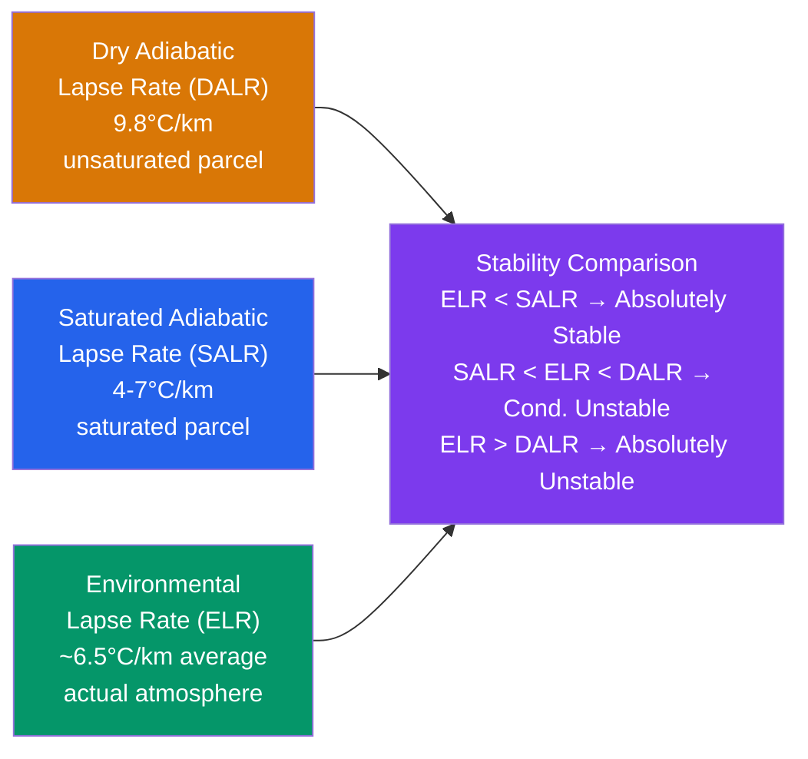

# 🌡️ Atmospheric Temperature and Lapse Rates

> [!abstract] TL;DR
> Temperature generally **decreases with altitude** through the troposphere — the **environmental lapse rate (ELR)** averages about **6.5 °C/km** — but reversal layers called **inversions** trap pollution and shut off convection. Two *theoretical* rates describe rising air parcels: the **dry adiabatic lapse rate (DALR = 9.8 °C/km)** for unsaturated air and the **saturated adiabatic lapse rate (SALR ≈ 4–7 °C/km)** for cloudy air, the difference being latent-heat release during condensation. **Atmospheric stability is judged by comparing the ELR to the relevant adiabatic rate**: steep ELRs favour convection, shallow or reversed ELRs suppress it. **Temperature inversions** (surface radiation inversions and elevated subsidence/frontal inversions) are decisive for air quality, fog, and aviation. Tropospheric temperature is measured by **radiosondes, satellite microwave sounders (MSU/AMSU), and reanalysis datasets (ERA5, MERRA-2)**.

---

## Intuition — analogy FIRST

Think of the lower atmosphere as a **poorly-mixed oven that is heated only from the bottom rack**. The Sun warms the *ground*, and the ground warms the air touching it, so the bottom of the room is hot and the top is cold — exactly why a mountaintop is freezing while the valley bakes. Air near the floor, being warm and buoyant, keeps trying to rise and stir the room; that overturning is *weather*.

Now imagine someone slides a **warm lid onto a pot of cold soup** — a sheet of warm air drifts in *above* a pool of cold air. Suddenly the normal "hot below, cold above" order is flipped: warm sits on top of cold. Nothing wants to rise through that warm lid, so the cold, foggy, smoggy air underneath is **locked in place**. That flipped layer is a **temperature inversion**, and it is why still winter mornings breed valley fog and why a city's exhaust can hang in the air for days.

The whole subject reduces to one question: *does a parcel of air, nudged upward, keep rising or sink back?* The answer depends entirely on how the room's temperature falls off with height (the ELR) versus how fast the parcel itself cools as it expands (the adiabatic rate).

---

## How It Works

Temperature at any height is set by a **competition between heating from below and cooling by expansion**. Sunlight passes through clear air and heats the *surface*; the surface then warms the atmosphere by **radiation** (longwave IR emission), **conduction** (molecule-to-molecule contact in the thin skin of air touching the ground), and above all **convection** (buoyant plumes and turbulent eddies that carry warm air upward). As those plumes rise into lower pressure, they **expand and cool** — and *how fast* they cool is the lapse rate that controls everything else.



**The surface energy budget sets the starting temperature.** The ground's temperature is a balance of absorbed solar shortwave, emitted longwave, sensible-heat flux into the air, latent-heat flux (evaporation), and heat conducted into the soil. When that budget swings positive by day the surface heats and drives convection; when it swings negative at night the surface cools and the air above it can invert.

**The daily temperature cycle** follows the *integrated* energy budget, not the instantaneous sun angle. Surface air temperature typically **peaks in mid-afternoon (~2–4 pm / ~15 LST)** — a couple of hours *after* solar noon, because the ground keeps gaining heat as long as incoming sun exceeds outgoing loss — and reaches its **minimum just before/at sunrise**, after a whole night of radiative cooling.

**Temperature inversions** are the important exceptions to "cooler with height." Four common types:

1. **Radiation inversion** — on clear, calm nights the surface radiates heat to space and cools faster than the air above; the coldest air ends up at the ground. Surface-based, shallow, dawn-maximum; breeds fog and frost.
2. **Subsidence inversion** — sinking air in a **high-pressure system** is adiabatically compressed and warmed aloft, capping the boundary layer. Elevated, persistent; the classic pollution-trapping "lid."
3. **Frontal inversion** — a **warm air mass overrides a cold one** along a front, placing warm over cold across the frontal surface.
4. **Marine inversion** — cool marine air below warm subsiding air over a cold ocean current, producing persistent marine stratus (e.g. California coast).

**The standard atmosphere profile** idealises the mean state: temperature falls at **6.5 K/km** from 288 K at the surface up to the **tropopause (~11 km, 216.65 K)**, stays isothermal through the lower stratosphere, then **rises with altitude** through the mid-stratosphere because **ozone absorbs solar UV** there. The tropopause is the lid on the "weather layer," and stratospheric warming is why the stratosphere is statically stable and largely cloud-free.

**Why temperature matters for forecasting.** Convective forecasting lives and dies on the vertical temperature profile. A warm layer aloft (a **capping inversion**, or "cap") produces **convective inhibition (CIN)** — negative buoyancy that a parcel must be *forced* through before it can rise freely. Break the cap and the stored **CAPE** (convective available potential energy) is released explosively into thunderstorms; leave it intact and a hot, humid day stays cloudless. Reading the temperature curve *is* reading the day's convective potential.

---

## Key Concepts / Details

### Secondary Level

- **Temperature falls ~6.5 °C for every kilometre you climb** in the troposphere, on average. This is the **lapse rate** — literally "how temperature lapses (drops) with height."
- **Why mountaintops are cold:** as air rises it moves into lower pressure and expands; expanding gas cools. So even a peak directly under a hot sun is far colder than the valley below it. Everest's summit can be −30 °C while its base camp is −10 °C.
- **A temperature inversion** is when the normal order flips and air gets *warmer* with height. It acts like a lid: it stops warm ground air from rising, so pollution, fog, and haze get trapped underneath — the recipe for **smog**.
- **The daily temperature cycle:** coldest **just before sunrise** (after cooling all night), warmest in the **mid-afternoon (~3 pm)** — a lag after noon because the ground keeps banking heat until the sun gets low.

### Undergraduate Level

**Environmental lapse rate (ELR).** The *actual* temperature drop with height in the real atmosphere at a given place and time, $\text{ELR} = -\dfrac{\partial T}{\partial z}$. It is measured directly by **radiosondes** (instrument packages on weather balloons) and varies enormously — steep in a well-mixed afternoon boundary layer, negative (inverted) on a calm night.

**Dry adiabatic lapse rate (DALR).** For an *unsaturated* parcel that neither gains nor loses heat, the first law plus hydrostatic balance give a fixed cooling rate:

$$\Gamma_d = -\frac{dT}{dz} = \frac{g}{c_p} = \frac{9.81}{1004} \approx 9.8\ \text{K/km}$$

**Saturated adiabatic lapse rate (SALR).** Once a rising parcel is saturated, condensation **releases latent heat** that partly offsets expansion cooling, so it cools *more slowly*:

$$\Gamma_s = \Gamma_d\,\frac{1 + \dfrac{L_v\, r_s}{R_d\, T}}{1 + \dfrac{L_v^2\, r_s\, \varepsilon}{c_p\, R_d\, T^2}} \approx 4\text{–}7\ \text{K/km}$$

$\Gamma_s$ is **not constant**: it is near ~4 K/km in warm, moist tropical air (lots of latent heat) and approaches $\Gamma_d$ in cold, dry air (little vapour to condense).

**Potential temperature.** The temperature a parcel *would* have if brought **adiabatically to a reference pressure** $P_0$ (usually 1000 hPa):

$$\theta = T\left(\frac{P_0}{P}\right)^{R_d/c_p}, \qquad \frac{R_d}{c_p} \approx 0.286$$

$\theta$ is **conserved in dry adiabatic motion**, which makes it the natural coordinate for stability: $\partial\theta/\partial z > 0$ is stable, $=0$ neutral, $<0$ unstable.

**Virtual temperature.** Moist air is lighter than dry air at the same $T, P$, so buoyancy is governed by the **virtual temperature** $T_v \approx T(1 + 0.61\,q)$, where $q$ is specific humidity. Always use $T_v$ (not $T$) in buoyancy calculations.

**Tropopause height** varies with latitude: **~9 km at the poles** to **~16–17 km in the tropics**, because vigorous tropical convection pushes the weather layer higher.

**Inversion mechanisms in detail:**
- **Radiation inversion** — nocturnal surface cooling under clear skies and light winds.
- **Subsidence inversion** — large-scale sinking in **anticyclones** warms air aloft by compression.
- **Marine inversion** — warm subsiding air over cold upwelling ocean; caps persistent **marine stratus**.

### Graduate Level

**Equivalent potential temperature** $\theta_e$ is conserved in **moist (saturated) adiabatic** processes — it folds in the latent heat that would be released if all vapour condensed:

$$\theta_e \approx \theta\,\exp\!\left(\frac{L_v\, r_s}{c_p\, T_{LCL}}\right)$$

It is the master variable for moist convection. **Wet-bulb potential temperature** $\theta_w$ is a related conserved quantity read directly off a thermodynamic chart.

**Conditional vs potential instability.** A layer with $\Gamma_s < \text{ELR} < \Gamma_d$ is **conditionally unstable**: stable to dry displacements, unstable *if* a parcel becomes saturated. **Potential (convective) instability** is a *layer* property — $\partial\theta_e/\partial z < 0$ — where lifting an entire moist layer destabilises it as the moist base saturates before the dry top.

**CAPE and CIN from a Skew-T log-P.** On a Skew-T diagram, **CAPE** is the positive area between the environmental temperature curve and the parcel's ascent curve above the **level of free convection (LFC)**; **CIN** is the negative area below the LFC that the parcel must be forced through:

$$\text{CAPE} = \int_{LFC}^{EL} g\,\frac{T_{v,\text{parcel}} - T_{v,\text{env}}}{T_{v,\text{env}}}\,dz$$

Roughly, CAPE < 1000 J/kg is marginal, 1000–2500 J/kg moderate, and > 2500 J/kg strong instability (with significant/tornadic environments typically pairing high CAPE with strong deep-layer shear).

**Satellite temperature sounding.** The **Microwave Sounding Unit (MSU)** and successor **AMSU** retrieve broad-layer temperatures from **O₂ microwave emission** near 50–60 GHz; different channels weight different altitudes, giving lower-troposphere, mid-troposphere, and lower-stratosphere products (the basis of the RSS and UAH satellite temperature records).

**Reanalysis.** **ERA5 (ECMWF)** and **MERRA-2 (NASA)** assimilate radiosondes, satellites, aircraft, and surface data into a physics model to produce dynamically consistent 3-D temperature fields — ERA5 at **hourly** resolution back to **1940**.

**Thermal wind.** The **meridional (pole-to-equator) temperature gradient** ties directly to the vertical wind shear: the **thermal wind relation** $\partial \mathbf{V}_g/\partial \ln p = -(R_d/f)\,\hat{k}\times\nabla_p T$ explains why the jet streams sit above the strongest horizontal temperature contrasts.

**Tropopause folds.** Along upper-level fronts the tropopause can **fold** downward, drawing **stratospheric air** (high potential vorticity, low humidity, ozone-rich) deep into the troposphere — a **low-PV / high-ozone signature** important for stratosphere–troposphere exchange and surface ozone spikes.

**Observed trends.** Radiosonde and satellite records show a robust fingerprint of greenhouse forcing: **tropospheric warming** together with **stratospheric cooling** — a vertical pattern that distinguishes CO₂ forcing from solar variability.

---

## Code Demo

```python
# Skew-T style plot of the US Standard Atmosphere temperature profile
# (T vs P, log-pressure inverted) with DALR and SALR reference adiabats
# drawn from a surface parcel, plus the tropopause marked.
import numpy as np
import matplotlib.pyplot as plt

# --- physical constants (SI unless noted) ---
g   = 9.80665     # gravity, m/s^2
cp  = 1004.0      # dry-air c_p, J/(kg K)
Rd  = 287.0       # dry-air gas constant, J/(kg K)
Rv  = 461.5       # water-vapour gas constant, J/(kg K)
Lv  = 2.5e6       # latent heat of vaporisation, J/kg
eps = Rd / Rv     # ~0.622
P0  = 1013.25     # reference pressure, hPa
DALR = g / cp * 1000.0            # dry adiabatic lapse rate, K/km (~9.76)
kappa = Rd / cp                   # Poisson exponent ~0.286

# --- US Standard Atmosphere 1976: layered T(z), integrate P(z) ---
# layer base geopotential height [km], base T [K], lapse rate [K/km]
zb = np.array([0.0, 11.0, 20.0, 32.0])
Tb = np.array([288.15, 216.65, 216.65, 228.65])
Lr = np.array([-6.5, 0.0, 1.0, 2.8])
Pb = np.empty_like(zb); Pb[0] = P0
for i in range(len(zb) - 1):
    dz_m = (zb[i+1] - zb[i]) * 1000.0
    if Lr[i] == 0.0:                              # isothermal -> exponential
        Pb[i+1] = Pb[i] * np.exp(-g * dz_m / (Rd * Tb[i]))
    else:                                         # constant lapse -> power law
        Ttop = Tb[i] + Lr[i] * (zb[i+1] - zb[i])
        Pb[i+1] = Pb[i] * (Ttop / Tb[i]) ** (-g / (Rd * Lr[i] / 1000.0))

def std_atm(z_km):
    """US Std Atm T [K], P [hPa] at geopotential height z_km (<= 32 km)."""
    z = np.atleast_1d(z_km).astype(float)
    i = np.clip(np.searchsorted(zb, z, side='right') - 1, 0, len(zb) - 1)
    dz = z - zb[i]
    T  = Tb[i] + Lr[i] * dz
    Lsafe = np.where(Lr[i] == 0.0, 1.0, Lr[i]) / 1000.0
    P = np.where(Lr[i] == 0.0,
                 Pb[i] * np.exp(-g * dz * 1000.0 / (Rd * Tb[i])),
                 Pb[i] * (T / Tb[i]) ** (-g / (Rd * Lsafe)))
    return T, P

z = np.linspace(0.0, 32.0, 400)
Tenv, Penv = std_atm(z)
Ttrop, Ptrop = std_atm(11.0)     # tropopause

# --- Dry adiabat through the surface parcel: theta = const ---
Pgrid = np.linspace(P0, Penv.min(), 400)
T_sfc = 288.15
T_dry = T_sfc * (Pgrid / P0) ** kappa

# --- Saturated (moist) adiabat: integrate dT/dP up from the surface ---
def es_hPa(T):                                    # Bolton (1980), T in K
    return 6.112 * np.exp(17.67 * (T - 273.15) / (T - 29.65))

def moist_dTdP(T, P):                             # returns dT/dP in K/hPa
    es = es_hPa(T)
    rs = eps * es / (P - es)                       # sat. mixing ratio, kg/kg
    num = 1.0 + Lv * rs / (Rd * T)
    den = 1.0 + Lv**2 * rs * eps / (cp * Rd * T**2)
    dTdz = -(g / cp) * num / den                   # K/m
    dPdz = -(P * 100.0) * g / (Rd * T)             # Pa/m
    return dTdz / dPdz * 100.0                      # K/hPa

Pm = np.linspace(P0, Penv.min(), 400)
Tm = np.empty_like(Pm); Tm[0] = T_sfc
for k in range(len(Pm) - 1):                        # simple Euler integration
    Tm[k+1] = Tm[k] + moist_dTdP(Tm[k], Pm[k]) * (Pm[k+1] - Pm[k])

# --- console sanity checks ---
print(f"DALR (g/cp)           = {DALR:5.2f} K/km")
print(f"Tropopause            = {Ttrop[0]-273.15:6.2f} C at {Ptrop[0]:6.1f} hPa")
print(f"Moist adiabat @500hPa = {np.interp(500, Pm[::-1], Tm[::-1])-273.15:6.2f} C")
print(f"Dry   adiabat @500hPa = {T_sfc*(500/P0)**kappa-273.15:6.2f} C")

# --- Skew-T style plot: T on x, log-pressure on y (inverted) ---
fig, ax = plt.subplots(figsize=(7, 8))
ax.plot(Tenv - 273.15, Penv, 'k-',  lw=2.5, label='Environmental (US Std Atm)')
ax.plot(T_dry - 273.15, Pgrid, color='#d97706', ls='--', lw=1.8,
        label='Dry adiabat (DALR 9.8 K/km)')
ax.plot(Tm - 273.15, Pm, color='#2563eb', ls='--', lw=1.8,
        label='Saturated adiabat (SALR 4-7 K/km)')

ax.set_yscale('log'); ax.invert_yaxis(); ax.set_ylim(P0, 100)
ax.set_yticks([1000, 850, 700, 500, 300, 200, 100])
ax.get_yaxis().set_major_formatter(plt.ScalarFormatter())
ax.axhline(Ptrop[0], color='purple', ls=':', lw=1.5)
ax.text(-70, Ptrop[0] * 0.94, 'Tropopause (~11 km)', color='purple', fontsize=9)

ax.set_xlabel('Temperature (°C)')
ax.set_ylabel('Pressure (hPa, log scale)')
ax.set_title('Skew-T style profile with dry & saturated adiabats')
ax.grid(alpha=0.3, which='both')
ax.legend(loc='upper right', fontsize=8)
plt.tight_layout()
plt.savefig('skewt_profile.png', dpi=120)
print("\nSaved figure to skewt_profile.png")

# Expected console highlights:
#   DALR (g/cp)           =  9.77 K/km
#   Tropopause            = -56.50 C at  226.3 hPa
#   Dry adiabat cools much faster than the moist adiabat aloft, and both
#   fall away to the LEFT of the (warmer, slowly-lapsing) environmental curve.
```

The dry adiabat plunges to the left fastest (9.8 K/km), the saturated adiabat leans right because latent heating slows its cooling (4–7 K/km), and the environmental curve sits between them in the troposphere before **kinking to the right at the tropopause** where the atmosphere becomes isothermal and then warms.

---

## Real-World Notes

- **Los Angeles smog** is a textbook **subsidence + marine inversion** problem: cool Pacific marine air pools in the basin under warm subsiding air from the semi-permanent high, and the surrounding coastal mountains block horizontal escape — so vehicle exhaust and photochemical ozone are trapped under the lid for days.
- **Radiosondes** (weather balloons carrying a thermistor, hygristor, and GPS) are launched **twice daily at 00Z and 12Z UTC** from roughly **800 stations worldwide**, giving the synchronised vertical temperature/humidity/wind snapshots that initialise global forecast models.
- **The "Death Valley effect":** hot, dry air descending from surrounding highlands is **adiabatically compressed** as it sinks into the below-sea-level basin, warming at ~9.8 °C/km — a major reason Death Valley records some of Earth's highest surface temperatures.
- **Aircraft icing** concentrates in the **−10 to 0 °C** band, where **supercooled liquid water** persists in clouds and freezes on contact with the airframe; knowing the temperature profile tells pilots which altitudes to avoid or where to climb into safer, colder (fully glaciated) air.
- **ERA5 reanalysis** delivers physically consistent **6-hourly (and hourly) temperature fields back to 1940**, making it the workhorse dataset for climate trends, extreme-event attribution, and validating the tropospheric-warming / stratospheric-cooling fingerprint.

---

## Common Pitfalls

1. **Confusing environmental and adiabatic lapse rates.** The **ELR** is the *actual* atmosphere's measured temperature drop and it varies enormously (even reversing in inversions). **DALR (9.8)** and **SALR (4–7)** are *parcel* rates — the theoretical cooling of a rising blob of dry or saturated air. Stability comes from *comparing* the two, so mixing them up inverts every conclusion.
2. **Misreading potential temperature.** $\theta$ is **not** the temperature a parcel would have "at the surface" in general — it is the temperature it would have if brought adiabatically to a **reference pressure $P_0$** (conventionally 1000 hPa, which is *near* but not exactly the surface). It is a *label* that is conserved in dry adiabatic motion, not a forecast of surface temperature.
3. **Treating "inversion" as one thing.** **Radiation, subsidence, marine, and frontal** inversions have different structures (surface-based vs elevated), different causes, and different forecast implications (fog and frost vs a convective cap vs stratus). Diagnosing *which* one you have changes the forecast.
4. **Assuming a fixed tropopause height.** The tropopause is **not constant**: ~7–9 km at the poles rising to ~16–17 km in the tropics, and it moves day to day and with the jet stream. Convective and stratospheric-exchange reasoning fails if you nail it to a single altitude.
5. **Taking −6.5 K/km as gospel.** The Standard Atmosphere's **−6.5 K/km is a long-term average**, useful for altimetry and reference calculations. On any given day the *real* profile can be steeper, shallower, or inverted — never assume the standard lapse rate describes today's soundings.

---

## Related Concepts

- [[_MOC_Atmospheric_Thermodynamics]] — section map of the atmospheric-thermodynamics unit (uplink).
- [[Adiabatic_Processes_and_Atmospheric_Stability]] — how DALR/SALR vs ELR comparisons yield stable, neutral, and unstable regimes.
- [[Moisture_and_Humidity]] — the water vapour that condenses to release latent heat and lower the SALR below the DALR.
- [[Atmospheric_Boundary_Layer]] — where the daily temperature cycle, mixing, and surface-based inversions play out.
- [[Cloud_Formation_and_Microphysics]] — clouds form once a rising parcel cools to saturation along the moist adiabat.
- [[Thunderstorms_and_Convective_Systems]] — CAPE, CIN, and the cap are all read straight off the temperature profile.
- [[Atmospheric_Layers_and_Composition]] — the tropopause and stratospheric warming that bound the lapse-rate story (Section 01).
- [[Synoptic_Meteorology_and_Weather_Maps]] — thermal gradients, fronts, and inversions as seen on operational charts (Section 05).
- [[Numerical_Weather_Prediction]] — reanalysis and forecast models that assimilate radiosonde and satellite temperatures (Section 05).
- [[_MOC_Physics_Master]] — parent physics vault for the underlying thermodynamics.
- [[Laws_of_Thermodynamics]] — the first law that, with hydrostatic balance, yields $\Gamma_d = g/c_p$.
- [[Kinetic_Theory_of_Gases]] — the molecular meaning of temperature and the ideal-gas relations behind $\theta$ and $T_v$.

---

## Review Questions

- **Secondary:** Why is the temperature at the summit of Mount Everest (8.85 km) roughly −30 °C on a "warm" day even if the base camp (5.4 km) is −10 °C? Use the **average environmental lapse rate (~6.5 °C/km)** in your answer. *(Hint: the height difference is ~3.45 km.)*
- **Undergraduate:** Derive the dry adiabatic lapse rate $\Gamma_d = g/c_p$ from first principles, combining the **hydrostatic equation** $dP/dz = -\rho g$ with the **first law of thermodynamics** for an adiabatic process ($dq = 0 = c_p\,dT - \alpha\,dP$). Why is the **saturated** lapse rate lower than the dry one? Sketch **potential temperature $\theta(z)$** for a stable, a neutral, and an unstable atmosphere.
- **Graduate:** Explain **conditional instability** ($\Gamma_s < \text{ELR} < \Gamma_d$). How can such an atmosphere stay stable to small displacements yet erupt into deep convection once a parcel is forced to its **level of free convection (LFC)**? Describe how **CAPE** is computed as an area on a **Skew-T log-P** diagram, and roughly what CAPE value marks the boundary between "moderate" and "significant/tornadic" convective environments (and why shear matters too).

---

## Sources

- Holton, J. R. & Hakim, G. J. — *An Introduction to Dynamic Meteorology*, 5th ed. (Academic Press). Static stability, potential temperature, thermal wind.
- Wallace, J. M. & Hobbs, P. V. — *Atmospheric Science: An Introductory Survey*, 2nd ed. (Academic Press). Dry/moist thermodynamics, lapse rates, the standard atmosphere.
- Stull, R. B. — *Meteorology for Scientists and Engineers*, 3rd ed. (Brooks/Cole). Lapse rates, thermodynamic diagrams, CAPE/CIN, boundary-layer temperature.

---

#Meteorology #AtmosphericThermodynamics #LapseRate #TemperatureProfile #AtmosphericStability
